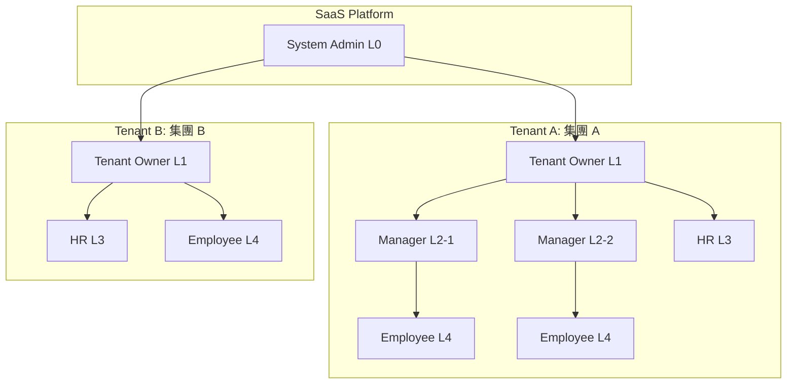
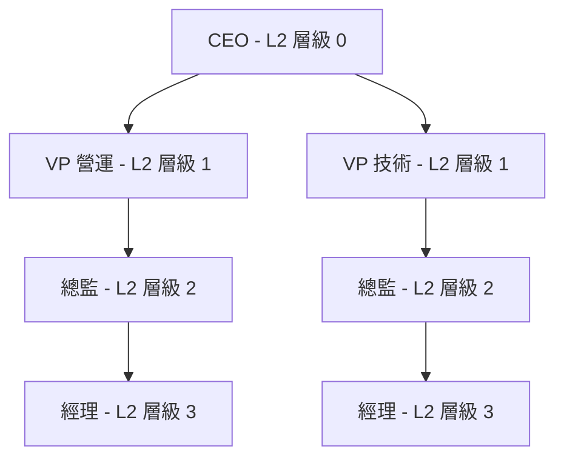
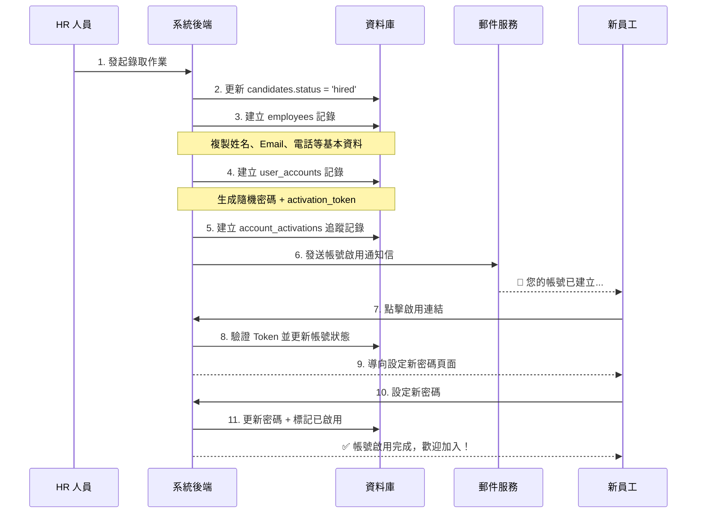

# 帳號管理模組實作規劃書

> **版本**：v1.0  
> **建立日期**：2026-02-03  
> **狀態**：規劃中 (待審核)

---

## 1. 專案背景與目標

### 1.1 背景說明

Bombus 系統目前已具備完整的招聘流程（候選人管理 → 面試評估 → 錄取決策），但尚未建立**帳號管理機制**。當候選人被錄取後，需要有一套系統化的流程來：

1. 將候選人資料轉換為試用期員工
2. 自動開通系統帳號
3. 依據角色分配適當的權限

### 1.2 目標

設計一套符合 **SaaS 多租戶架構** 的帳號管理系統，支援以下角色層級：

| 層級 | 角色名稱 | 說明 |
|------|----------|------|
| L0 | 系統管理員 (System Admin) | Bombus SaaS 平台的最高管理者 |
| L1 | 集團負責人 (Tenant Owner) | 單一租戶（公司/集團）的最高管理者 |
| L2 | 主管 (Manager) | 支援多層級的部門主管 (N 層) |
| L3 | HR 人員 (HR) | 人力資源部門人員 |
| L4 | 一般員工 (Employee) | 基層員工 |

---

## 2. 系統架構設計

### 2.1 多租戶架構 (Multi-Tenancy)



### 2.2 資料隔離策略

採用 **共享資料庫 + 租戶 ID 隔離 (Shared Database with Tenant ID)** 策略：

- 所有資料表新增 `tenant_id` 欄位
- 查詢時強制加入 `tenant_id` 過濾條件
- 優點：成本較低、易於維護
- 缺點：需嚴格控制資料存取邏輯

---

## 3. 資料庫設計

### 3.1 新增資料表

#### 3.1.1 租戶表 (tenants)

| 欄位名稱 | 類型 | 說明 |
|----------|------|------|
| `id` | TEXT PRIMARY KEY | 租戶 UUID |
| `name` | TEXT NOT NULL | 租戶名稱（公司/集團名） |
| `code` | TEXT UNIQUE | 租戶代碼 (簡碼) |
| `logo` | TEXT | Logo 圖片 URL |
| `status` | TEXT | active / suspended / deleted |
| `plan` | TEXT | 訂閱方案：free / basic / pro / enterprise |
| `max_users` | INTEGER | 最大用戶數限制 |
| `contact_email` | TEXT | 聯絡人 Email |
| `contact_phone` | TEXT | 聯絡人電話 |
| `created_at` | TEXT | 建立時間 |
| `updated_at` | TEXT | 更新時間 |

---

#### 3.1.2 使用者帳號表 (user_accounts)

| 欄位名稱 | 類型 | 說明 |
|----------|------|------|
| `id` | TEXT PRIMARY KEY | 帳號 UUID |
| `tenant_id` | TEXT NOT NULL | 所屬租戶 (FK → tenants) |
| `employee_id` | TEXT | 關聯員工 (FK → employees) |
| `username` | TEXT NOT NULL | 登入帳號 (租戶內唯一) |
| `email` | TEXT NOT NULL | Email (全域唯一) |
| `password_hash` | TEXT NOT NULL | 密碼雜湊值 (bcrypt) |
| `role` | TEXT NOT NULL | 角色：system_admin / tenant_owner / manager / hr / employee |
| `status` | TEXT | active / pending / suspended / deleted |
| `avatar` | TEXT | 頭像 URL |
| `last_login_at` | TEXT | 最後登入時間 |
| `login_attempts` | INTEGER DEFAULT 0 | 登入失敗次數 |
| `locked_until` | TEXT | 帳號鎖定解除時間 |
| `password_changed_at` | TEXT | 密碼最後變更時間 |
| `must_change_password` | INTEGER DEFAULT 1 | 首次登入需變更密碼 |
| `created_at` | TEXT | 建立時間 |
| `updated_at` | TEXT | 更新時間 |

**複合唯一索引**：`(tenant_id, username)` - 確保同一租戶內帳號唯一

---

#### 3.1.3 角色定義表 (roles)

| 欄位名稱 | 類型 | 說明 |
|----------|------|------|
| `id` | TEXT PRIMARY KEY | 角色 UUID |
| `tenant_id` | TEXT | 租戶 ID (NULL = 系統預設角色) |
| `name` | TEXT NOT NULL | 角色名稱 |
| `code` | TEXT NOT NULL | 角色代碼：system_admin / tenant_owner / manager / hr / employee |
| `description` | TEXT | 角色說明 |
| `level` | INTEGER | 角色層級 (0-4，數字越小權限越高) |
| `is_system` | INTEGER DEFAULT 0 | 是否為系統預設角色 |
| `created_at` | TEXT | 建立時間 |

---

#### 3.1.4 權限定義表 (permissions)

| 欄位名稱 | 類型 | 說明 |
|----------|------|------|
| `id` | TEXT PRIMARY KEY | 權限 UUID |
| `module` | TEXT NOT NULL | 模組名稱：recruitment / employee / meeting / report |
| `action` | TEXT NOT NULL | 操作：create / read / update / delete / manage |
| `resource` | TEXT | 資源範圍：self / team / department / all |
| `name` | TEXT NOT NULL | 權限顯示名稱 |
| `description` | TEXT | 權限說明 |

---

#### 3.1.5 角色權限關聯表 (role_permissions)

| 欄位名稱 | 類型 | 說明 |
|----------|------|------|
| `id` | TEXT PRIMARY KEY | UUID |
| `role_id` | TEXT NOT NULL | 角色 ID (FK → roles) |
| `permission_id` | TEXT NOT NULL | 權限 ID (FK → permissions) |
| `created_at` | TEXT | 建立時間 |

**複合唯一索引**：`(role_id, permission_id)`

---

#### 3.1.6 使用者角色關聯表 (user_roles)

> 支援一個使用者擁有多個角色

| 欄位名稱 | 類型 | 說明 |
|----------|------|------|
| `id` | TEXT PRIMARY KEY | UUID |
| `user_id` | TEXT NOT NULL | 使用者 ID (FK → user_accounts) |
| `role_id` | TEXT NOT NULL | 角色 ID (FK → roles) |
| `granted_by` | TEXT | 授權者 ID |
| `granted_at` | TEXT | 授權時間 |

---

#### 3.1.7 管理範圍表 (manager_scopes)

> 定義主管可管理的部門/團隊範圍

| 欄位名稱 | 類型 | 說明 |
|----------|------|------|
| `id` | TEXT PRIMARY KEY | UUID |
| `user_id` | TEXT NOT NULL | 主管帳號 ID (FK → user_accounts) |
| `scope_type` | TEXT NOT NULL | 範圍類型：department / team / location |
| `scope_value` | TEXT NOT NULL | 範圍值，例如部門名稱 |
| `created_at` | TEXT | 建立時間 |

---

#### 3.1.8 帳號開通記錄表 (account_activations)

> 追蹤從候選人到員工帳號開通的完整記錄

| 欄位名稱 | 類型 | 說明 |
|----------|------|------|
| `id` | TEXT PRIMARY KEY | UUID |
| `tenant_id` | TEXT NOT NULL | 租戶 ID |
| `candidate_id` | TEXT NOT NULL | 原候選人 ID (FK → candidates) |
| `employee_id` | TEXT NOT NULL | 新員工 ID (FK → employees) |
| `user_account_id` | TEXT NOT NULL | 新帳號 ID (FK → user_accounts) |
| `activation_token` | TEXT UNIQUE | 啟用連結 Token |
| `activation_email_sent_at` | TEXT | 啟用信發送時間 |
| `activated_at` | TEXT | 帳號啟用時間 |
| `created_by` | TEXT | 建立者 (HR) |
| `created_at` | TEXT | 建立時間 |

---

### 3.2 現有資料表修改

#### 3.2.1 employees 表新增欄位

| 欄位名稱 | 類型 | 說明 |
|----------|------|------|
| `tenant_id` | TEXT | 租戶 ID (FK → tenants) |
| `candidate_id` | TEXT | 原候選人 ID (用於追溯) |
| `employment_type` | TEXT | probation / regular / contract / intern |
| `probation_end_date` | TEXT | 試用期結束日期 |
| `converted_at` | TEXT | 正式轉正時間 |

#### 3.2.2 candidates 表新增欄位

| 欄位名稱 | 類型 | 說明 |
|----------|------|------|
| `tenant_id` | TEXT | 租戶 ID |
| `converted_to_employee` | INTEGER DEFAULT 0 | 是否已轉為員工 |
| `converted_employee_id` | TEXT | 轉換後的員工 ID |
| `converted_at` | TEXT | 轉換時間 |

---

## 4. 角色權限矩陣

### 4.1 功能模組權限

| 功能模組 | System Admin | Tenant Owner | Manager | HR | Employee |
|----------|:------------:|:------------:|:-------:|:--:|:--------:|
| **租戶管理** | ✅ 全部 | ✅ 本租戶 | ❌ | ❌ | ❌ |
| **帳號管理** | ✅ 全部 | ✅ 本租戶 | 👀 下屬 | ✅ 本租戶 | ❌ |
| **角色配置** | ✅ 全部 | ✅ 本租戶 | ❌ | ❌ | ❌ |
| **招聘管理** | ✅ 全部 | ✅ 本租戶 | 👀 部門 | ✅ 全部 | ❌ |
| **員工資料** | ✅ 全部 | ✅ 本租戶 | 👀 下屬 | ✅ 全部 | 👀 自己 |
| **薪資資料** | ✅ 全部 | ✅ 本租戶 | ⚙️ 有限 | ✅ 全部 | 👀 自己 |
| **會議管理** | ✅ 全部 | ✅ 本租戶 | ✅ 參與 | ✅ 參與 | ✅ 參與 |
| **報表檢視** | ✅ 全部 | ✅ 本租戶 | 👀 部門 | 👀 部門 | ❌ |

> **圖例**：✅ 完整權限 | 👀 唯讀 | ⚙️ 有限權限 | ❌ 無權限

### 4.2 主管多層級設計



主管層級透過 `employees.manager_id` 形成樹狀結構，並可透過 `manager_scopes` 表擴展跨部門管理權限。

---

## 5. 核心業務流程

### 5.1 候選人錄取轉員工流程



### 5.2 帳號開通 API 規格 (規劃)

```
POST /api/hr/accounts/activate-employee

Request Body:
{
  "candidate_id": "uuid",
  "employee_no": "E2026XXX",        // 可自動產生
  "department": "研發部",
  "position": "軟體工程師",
  "manager_id": "uuid",
  "hire_date": "2026-02-10",
  "probation_months": 3,           // 試用期月數
  "initial_role": "employee",      // 初始角色
  "send_activation_email": true    // 是否發送啟用信
}

Response:
{
  "status": "success",
  "data": {
    "employee_id": "uuid",
    "user_account_id": "uuid",
    "username": "wang.xiaoming",
    "temp_password": "Abc@12345",  // 僅首次回傳
    "activation_link": "https://..."
  }
}
```

---

## 6. 安全性設計

### 6.1 密碼策略

| 項目 | 規則 |
|------|------|
| 最小長度 | 8 字元 |
| 複雜度要求 | 必須包含大小寫字母 + 數字 + 特殊符號 |
| 密碼雜湊 | bcrypt (cost factor = 12) |
| 密碼過期 | 90 天強制變更 (可設定) |
| 歷史密碼 | 不得使用最近 5 次密碼 |

### 6.2 登入安全

| 項目 | 規則 |
|------|------|
| 連續失敗鎖定 | 5 次失敗後鎖定 15 分鐘 |
| Session 有效期 | 8 小時 (可設定) |
| Token 機制 | JWT + Refresh Token |
| 多裝置登入 | 允許，但可檢視/踢出 |

### 6.3 API 認證機制

```
Authorization: Bearer <JWT_TOKEN>

JWT Payload:
{
  "sub": "user_account_id",
  "tenant_id": "tenant_uuid",
  "role": "manager",
  "permissions": ["recruitment:read", "employee:read:team"],
  "iat": 1706918400,
  "exp": 1706947200
}
```

---

## 7. 前端介面規劃

### 7.1 帳號管理模組頁面

| 頁面 | 路由 | 權限要求 |
|------|------|----------|
| 帳號列表 | `/admin/accounts` | tenant_owner / hr |
| 帳號詳情 | `/admin/accounts/:id` | tenant_owner / hr |
| 新增帳號 | `/admin/accounts/new` | tenant_owner / hr |
| 角色管理 | `/admin/roles` | tenant_owner |
| 權限配置 | `/admin/permissions` | system_admin |
| 登入紀錄 | `/admin/audit-logs` | tenant_owner / hr |

### 7.2 員工自助功能

| 功能 | 路由 | 說明 |
|------|------|------|
| 變更密碼 | `/profile/password` | 所有登入使用者 |
| 個人資料 | `/profile` | 所有登入使用者 |
| 登入裝置 | `/profile/sessions` | 查看/登出其他裝置 |

---

## 8. 實作階段規劃

### Phase 1：基礎架構 (預估 2 週)

- [ ] 建立 `tenants`、`user_accounts`、`roles`、`permissions` 資料表
- [ ] 實作 JWT 認證中介層
- [ ] 建立登入/登出 API
- [ ] 密碼策略驗證

### Phase 2：帳號管理 (預估 2 週)

- [ ] 帳號 CRUD API
- [ ] 角色指派 API
- [ ] 前端帳號管理頁面
- [ ] 登入失敗鎖定機制

### Phase 3：候選人轉員工 (預估 1 週)

- [ ] 錄取 → 員工 → 帳號開通一條龍 API
- [ ] Email 啟用流程
- [ ] 首次登入強制改密碼

### Phase 4：權限控管整合 (預估 2 週)

- [ ] 各模組加入權限檢查
- [ ] 主管層級資料過濾
- [ ] 前端選單動態顯示

### Phase 5：多租戶強化 (預估 1 週)

- [ ] 租戶管理介面
- [ ] 資料隔離驗證
- [ ] 跨租戶禁止存取測試

---

## 9. 驗證計畫

### 9.1 自動化測試

| 測試類型 | 覆蓋範圍 |
|----------|----------|
| 單元測試 | 密碼驗證、權限邏輯 |
| API 測試 | 登入、帳號 CRUD、權限檢查 |
| 整合測試 | 候選人 → 員工 → 帳號流程 |

### 9.2 手動驗證 (需 HR/主管協助)

1. **角色權限**：以不同角色登入，確認只能看到授權範圍的資料
2. **帳號開通**：從錄取到新員工首次登入的完整流程
3. **密碼安全**：測試弱密碼被拒、連續登入失敗鎖定

---

## 10. 待討論事項

> [!IMPORTANT]
> 以下議題需要與產品/業務負責人確認：

1. **帳號命名規則**：是否採用 `名.姓` (wang.xiaoming) 格式？若有重複如何處理？
2. **試用期轉正**：是否需要獨立審批流程？試用期結束是否自動轉正？
3. **離職/停權**：帳號停權後資料如何處理？是否保留 X 天後刪除？
4. **密碼重設**：是否需要雙重驗證 (Email + 手機)？
5. **SSO 整合**：未來是否需要支援 Google Workspace / Azure AD 登入？

---

## 附錄 A：預設角色與權限 Seed Data

```json
{
  "roles": [
    { "code": "system_admin", "name": "系統管理員", "level": 0, "is_system": 1 },
    { "code": "tenant_owner", "name": "集團負責人", "level": 1, "is_system": 1 },
    { "code": "manager", "name": "主管", "level": 2, "is_system": 1 },
    { "code": "hr", "name": "HR 人員", "level": 3, "is_system": 1 },
    { "code": "employee", "name": "一般員工", "level": 4, "is_system": 1 }
  ],
  "permissions": [
    { "module": "tenant", "action": "manage", "resource": "all", "name": "租戶完整管理" },
    { "module": "account", "action": "manage", "resource": "all", "name": "帳號完整管理" },
    { "module": "account", "action": "read", "resource": "team", "name": "檢視下屬帳號" },
    { "module": "recruitment", "action": "manage", "resource": "all", "name": "招聘完整管理" },
    { "module": "employee", "action": "read", "resource": "self", "name": "檢視個人資料" },
    { "module": "employee", "action": "read", "resource": "team", "name": "檢視下屬資料" },
    { "module": "employee", "action": "manage", "resource": "all", "name": "員工完整管理" }
  ]
}
```

---

> **文件維護**：本規劃書將隨需求變更持續更新，請以最新版本為準。
