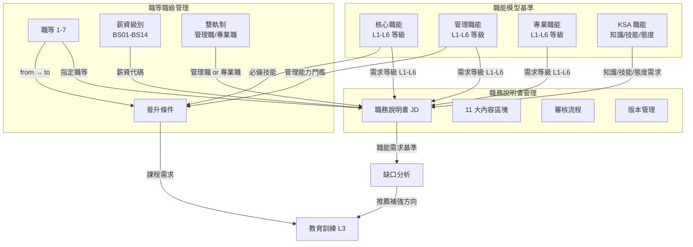
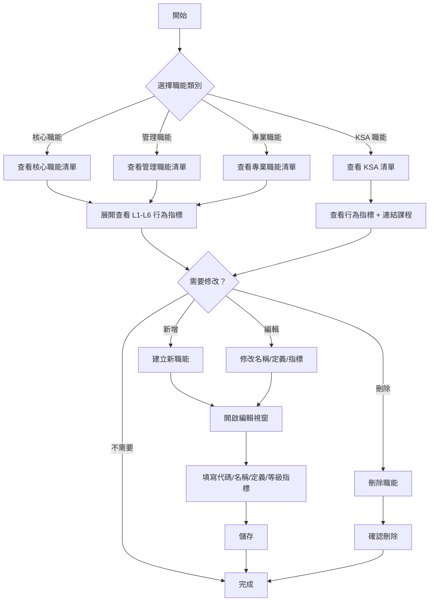
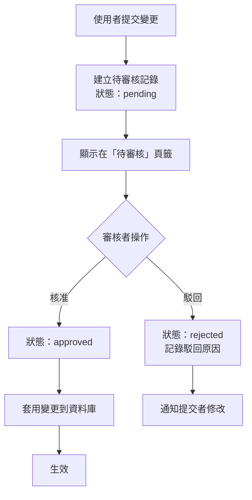
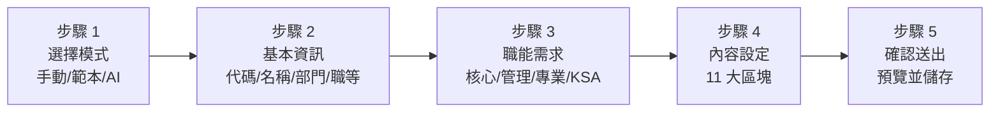
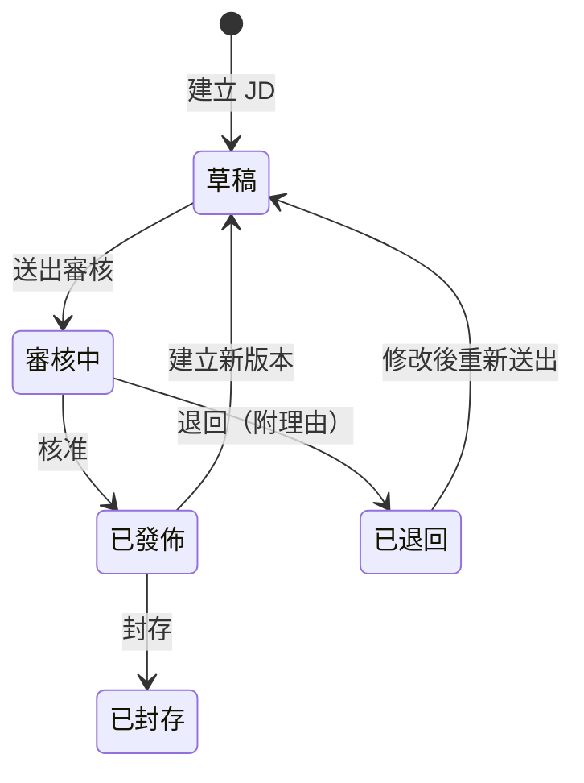
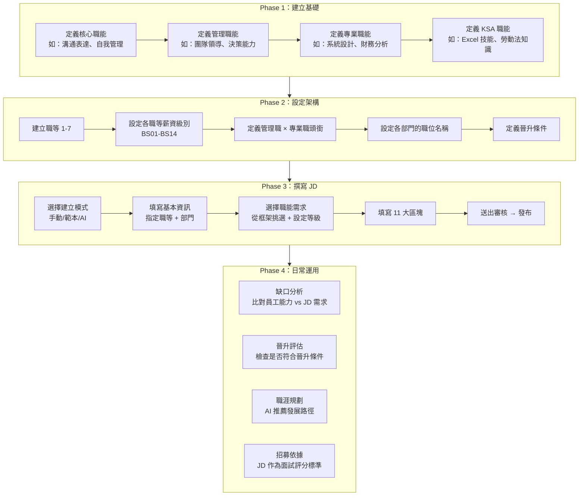
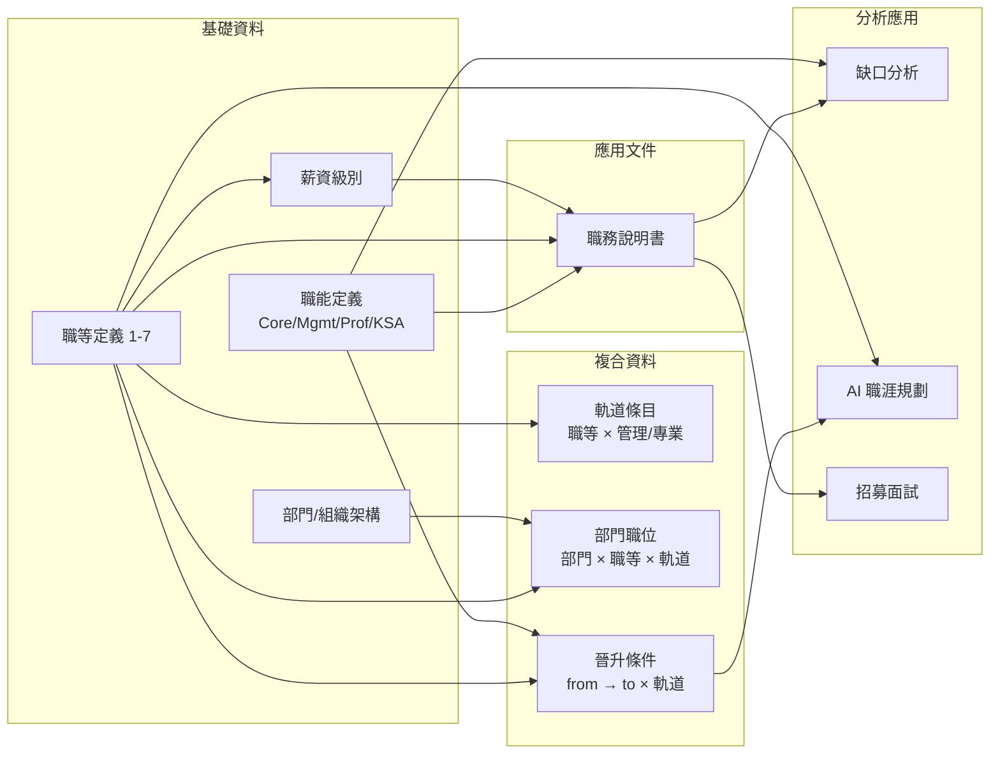

# Bombus 人力資源管理系統
# 功能說明書：職務說明書管理、職能模型基準、職等職級管理

---

## 文件資訊

| 項目 | 內容 |
|------|------|
| 文件名稱 | 職務說明書管理、職能模型基準與職等職級管理功能說明書 |
| 適用模組 | 職能管理（L2）> 職務說明書、職能框架、職等職級 |
| 適用對象 | HR 人員、部門主管、訓練發展人員、薪資管理人員 |
| 文件版本 | v1.0 |

---

## 目錄

1. [文件目的與適用範圍](#一文件目的與適用範圍)
2. [系統導覽與入口說明](#二系統導覽與入口說明)
3. [三大模組總覽與關聯說明](#三三大模組總覽與關聯說明)
4. [第一部分：職能模型基準](#第一部分職能模型基準)
5. [第二部分：職等職級管理](#第二部分職等職級管理)
6. [第三部分：職務說明書管理](#第三部分職務說明書管理)
7. [第四部分：三大模組協作流程](#第四部分三大模組協作流程)
8. [第五部分：AI 服務功能缺口分析](#第五部分ai-服務功能缺口分析)
9. [附錄](#附錄)

---

## 一、文件目的與適用範圍

### 1.1 文件目的

本說明書旨在介紹 Bombus 人力資源管理系統中「**職能管理（L2）**」模組的三大核心功能：

- **職能模型基準**：定義組織需要哪些「能力」
- **職等職級管理**：定義組織的「階層架構」與薪資對應
- **職務說明書管理**：將「能力需求」與「階層定位」結合成一份完整的職務規格

透過本文件，使用者可了解每個功能的操作方式、三者之間如何串聯，以及目前 AI 服務尚未實現的功能。

### 1.2 適用範圍

| 場景 | 說明 |
|------|------|
| 建立職能框架 | 定義核心職能、管理職能、專業職能及 KSA 職能 |
| 管理職等與薪資 | 設定 1-7 職等、雙軌制（管理職/專業職）、薪資對照表 |
| 撰寫職務說明書 | 建立 JD、綁定職能需求、審核發布 |
| 職能缺口分析 | 比較員工實際能力與 JD 要求的差距 |
| 晉升條件設定 | 定義晉升所需技能、課程與績效門檻 |
| AI 職涯規劃 | 分析員工適合的發展路徑（目前為模擬資料） |

---

## 二、系統導覽與入口說明

### 2.1 主要功能入口

| 功能模組 | 導覽路徑 | 路由 | 說明 |
|----------|----------|------|------|
| 職能框架 | 職能管理 → 職能框架 | `/competency/framework` | 管理四大類職能定義 |
| 職等職級 | 職能管理 → 職等職級 | `/competency/grade-matrix` | 管理職等、薪資、軌道、晉升 |
| 職務說明書 | 職能管理 → 職務說明書 | `/competency/job-description` | 建立與管理 JD |
| 新建 JD | 職能管理 → 職務說明書 → 新增 | `/competency/job-description/create` | 五步驟建立 JD |
| 職能缺口分析 | 職能管理 → 缺口分析 | `/competency/gap-analysis` | 雷達圖分析能力差距 |

### 2.2 頁面功能架構

```
職能管理 (L2)
├── 職能框架
│   ├── 核心職能（全員適用，L1-L6 等級）
│   ├── 管理職能（管理者適用，L1-L6 等級）
│   ├── 專業職能（部門專屬，L1-L6 等級）
│   └── KSA 職能（知識/技能/態度，無等級）
├── 職等職級
│   ├── 職等薪資對照表
│   ├── 管理職軌道明細
│   ├── 專業職軌道明細
│   ├── AI 職涯規劃助手
│   ├── 待審核變更
│   └── 變更歷史
├── 職務說明書
│   ├── JD 列表（卡片/列表檢視）
│   ├── 新建 JD（手動/範本/AI 輔助）
│   └── JD 審核與版本管理
└── 缺口分析
    ├── 員工能力雷達圖
    └── 差距嚴重度分析
```

---

## 三、三大模組總覽與關聯說明

### 3.1 白話說明：三者的關係

> **用蓋房子來比喻**：
> - **職能模型基準** 就像「建材清單」— 定義你的組織需要哪些「能力磚塊」（溝通力、領導力、專業知識…）
> - **職等職級管理** 就像「樓層設計圖」— 定義你的組織有幾層樓（職等 1-7）、每層樓的規格（薪資、頭銜）、以及上樓的條件（晉升標準）
> - **職務說明書** 就像「房間規格書」— 把「這間房間在幾樓」（職等）和「這間房間需要哪些建材」（職能需求）寫成一份完整的說明

### 3.2 模組關聯圖



### 3.3 資料流向摘要

| 來源模組 | → | 目標模組 | 流向的資料 |
|----------|---|----------|-----------|
| 職能模型基準 | → | 職務說明書 | 職能 ID、名稱、需求等級（L1-L6）、權重（%） |
| 職等職級管理 | → | 職務說明書 | 職等（1-7）、薪資代碼（如 BS03） |
| 職能模型基準 | → | 職等職級（晉升） | 晉升所需的必備技能 |
| 職務說明書 | → | 缺口分析 | 職能需求基準（required score） |
| 職等職級（晉升） | → | 教育訓練 | 晉升所需課程清單 |
| 職等職級（AI） | → | 員工發展 | 職涯路徑推薦、訓練計畫 |

---

## 第一部分：職能模型基準

### 1.1 功能概述

職能模型基準是整個職能管理體系的**基石**。它定義了組織裡每一種「能力」的名稱、定義和等級標準。

> **白話說明**：想像你在開一間餐廳。你需要先列出「好廚師需要哪些能力」：刀工（L1 會切菜 → L6 大師級雕花）、調味能力（L1 基本調味 → L6 創新菜系）。這個「能力清單」就是職能模型。

### 1.2 四大職能類別

系統將職能分為四大類別，每一類有不同的用途和結構：

| 類別 | 英文 | 適用對象 | 等級制度 | 說明 |
|------|------|----------|----------|------|
| 核心職能 | Core | **全體員工** | L1-L6 | 組織的基本 DNA，每個人都要具備 |
| 管理職能 | Management | **管理者** | L1-L6 | 帶領團隊所需的領導能力 |
| 專業職能 | Professional | **特定部門** | L1-L6 | 該領域的專業技術能力 |
| KSA 職能 | KSA | **依職務而定** | 無等級 | 知識(K)、技能(S)、態度(A) 三維度 |

### 1.3 等級制度說明（L1-L6）

核心、管理、專業三類職能都採用 **L1 到 L6 的六級制度**，有一個重要特性：**累積制**。

> **白話說明**：像考駕照一樣，拿到 L3 的人不是只會 L3 的東西，而是 L1 + L2 + L3 全部都要會。

```
L1 入門級    → 基礎認知，能在指導下操作
L2 發展級    → L1 的全部 + 能獨立處理常規工作
L3 熟練級    → L1+L2 的全部 + 能處理複雜狀況
L4 進階級    → L1-L3 的全部 + 能指導他人
L5 專家級    → L1-L4 的全部 + 能制定策略
L6 大師級    → L1-L5 的全部 + 能引領創新
```

**每個等級包含的內容**：
- **行為指標（Indicators）**：具體描述「做到這個等級需要表現出什麼行為」
- 每個等級可定義多條行為指標

**範例**：

| 職能名稱 | 等級 | 行為指標範例 |
|----------|------|-------------|
| 溝通表達 | L1 | 能清楚表達自己的想法；能撰寫基本的工作郵件 |
| 溝通表達 | L3 | 能在會議中有效簡報；能根據對象調整表達方式 |
| 溝通表達 | L6 | 能代表公司對外溝通重大議題；能建立組織溝通文化 |

### 1.4 KSA 職能的特殊設計

KSA 職能不使用 L1-L6 等級，而是以三個維度分類：

| 維度 | 代碼前綴 | 說明 | 範例 |
|------|----------|------|------|
| 知識 Knowledge | K | 該職務需要「知道」的事 | 勞動法規知識、產品知識 |
| 技能 Skill | S | 該職務需要「做到」的事 | Excel 進階操作、專案管理 |
| 態度 Attitude | A | 該職務需要「展現」的特質 | 主動積極、團隊合作 |

每個 KSA 項目包含：
- **行為指標**：具體描述需要展現的行為
- **連結課程**：推薦的培訓課程（可連結到 L3 教育訓練模組）

### 1.5 多租戶支援

職能可以分為兩個層級：

| 層級 | org_unit_id | 說明 |
|------|-------------|------|
| 集團共用 | NULL | 所有子公司共享的標準職能（如核心職能） |
| 子公司專屬 | 子公司 ID | 某子公司自行定義的專業職能 |

### 1.6 操作流程



### 1.7 欄位說明

#### 核心/管理/專業職能

| 欄位 | 必填 | 說明 |
|------|------|------|
| 代碼 (Code) | ✅ | 唯一識別碼，如 CORE-01、MGMT-02 |
| 名稱 (Name) | ✅ | 職能名稱，如「溝通表達」、「團隊領導」 |
| 定義 (Description) | ✅ | 職能的文字描述 |
| L1-L6 行為指標 | ✅ | 每個等級的具體行為描述（可多條） |
| 所屬公司 | ❌ | 留空 = 集團共用，選擇 = 子公司專屬 |

#### KSA 職能

| 欄位 | 必填 | 說明 |
|------|------|------|
| 代碼 (Code) | ✅ | 唯一識別碼，如 KSA-K01 |
| 名稱 (Name) | ✅ | 職能名稱，如「勞動法規知識」 |
| KSA 類型 | ✅ | Knowledge / Skill / Attitude |
| 定義 (Description) | ✅ | 職能的文字描述 |
| 行為指標 | ❌ | 具體行為描述 |
| 連結課程 | ❌ | 推薦的培訓課程名稱 |

---

## 第二部分：職等職級管理

### 2.1 功能概述

職等職級管理定義了組織的**層級結構**，包含職等（1-7）、薪資對照、雙軌制度（管理職/專業職）、晉升條件和部門職位。

> **白話說明**：把組織想像成一棟七層樓的大樓。每一層（職等）都有兩條走廊（管理職走廊和專業職走廊），每層樓的租金不同（薪資），而且要從 3 樓搬到 4 樓，你必須先滿足一些條件（晉升標準）。

### 2.2 雙軌制設計

系統採用**雙軌制**：每個職等自動對應「管理職」和「專業職」兩條發展路徑。

```
職等 7 ┃ 總經理         ┃ 首席技術官        ┃
職等 6 ┃ 副總經理       ┃ 資深技術總監      ┃
職等 5 ┃ 處長/協理      ┃ 技術總監          ┃
職等 4 ┃ 經理           ┃ 資深專家          ┃
職等 3 ┃ 副理           ┃ 資深工程師        ┃
職等 2 ┃ 主任           ┃ 工程師            ┃
職等 1 ┃ 組長           ┃ 助理工程師        ┃
       ┗━━━管理職━━━━━━━┻━━━專業職━━━━━━━━━┛
```

> **白話說明**：不是每個優秀的工程師都想當主管。雙軌制讓「技術高手」可以在專業職軌道上升遷加薪，不一定要轉管理職。

### 2.3 五個功能頁籤

| 頁籤 | 說明 |
|------|------|
| **職等薪資對照表** | 整體覽表：每個職等的薪資範圍、管理職/專業職頭銜 |
| **管理職明細** | 矩陣式佈局：職等 × 部門的管理職職位、晉升條件 |
| **專業職明細** | 矩陣式佈局：職等 × 部門的專業職職位、晉升條件 |
| **AI 職涯規劃** | 選擇員工 → AI 分析職涯路徑（目前為模擬資料） |
| **待審核 / 歷史** | 查看待核准的變更和已處理的歷史記錄 |

### 2.4 薪資級別管理

每個職等可以有多個薪資級別，用「薪資代碼」區分：

| 職等 | 薪資代碼 | 月薪 | 說明 |
|------|----------|------|------|
| 1 | BS01 | 28,000 | 職等 1 起薪 |
| 1 | BS02 | 30,000 | 職等 1 第二級 |
| 2 | BS03 | 33,000 | 職等 2 起薪 |
| 2 | BS04 | 36,000 | 職等 2 第二級 |
| 3 | BS05 | 40,000 | 職等 3 起薪 |
| ... | ... | ... | ... |

> **白話說明**：同樣是職等 2 的員工，做了一年的和做了三年的薪水不一樣。薪資級別讓同一職等的人可以有不同薪資，像是「年資加薪」的概念。

**自動編號機制**：
1. 使用者輸入前綴（如 `BS`）
2. 系統自動計算：從前一職等的最大編號 + 1 開始遞增
3. 例如：職等 2 最大是 BS04，職等 3 自動從 BS05 開始

### 2.5 審核流程（重要！）

職等職級管理的所有**新增、修改、刪除**操作都不會直接生效，而是進入審核流程：



> **白話說明**：就像公司的請購流程。你想改一個職等的薪資，不是改了就生效，而是先「送簽」，主管核准後才會正式更新。這樣可以避免誤操作造成的影響。

**審核記錄包含**：
- 變更類型（新增/修改/刪除）
- 舊資料快照 vs 新資料快照
- 提交者、核准者
- 駁回原因（若被駁回）

### 2.6 晉升條件設定

每個「從 A 職等到 B 職等」的晉升路徑可以定義具體條件：

| 欄位 | 說明 | 範例 |
|------|------|------|
| 起始職等 | 目前在幾等 | 3 |
| 目標職等 | 要升到幾等 | 4 |
| 適用軌道 | 管理職 or 專業職 | management |
| 績效門檻 | 最近評核需達到的等級 | A 或 B |
| 必備技能 | 需要具備的技能清單 | 專案管理、預算編制 |
| 必修課程 | 需完成的訓練課程 | 管理學基礎、領導力工作坊 |
| KPI 重點 | 關注的績效指標 | 團隊生產力提升 10% |
| 其他條件 | 其他要求 | 帶領 5 人以上團隊滿一年 |
| 晉升流程 | 流程說明 | 自薦 → 部門推薦 → HR 審核 → 總經理核准 |

### 2.7 部門職位對照

定義每個部門在各職等、各軌道下的**具體職位名稱**：

| 部門 | 職等 | 軌道 | 職位名稱 |
|------|------|------|----------|
| 人資部 | 3 | 管理職 | 人資副理 |
| 人資部 | 3 | 專業職 | 資深人資專員 |
| 研發部 | 4 | 管理職 | 研發經理 |
| 研發部 | 4 | 專業職 | 資深軟體架構師 |

### 2.8 子公司覆蓋機制

| 資料 | 集團預設 | 子公司覆蓋 |
|------|----------|-----------|
| 職等定義 (1-7) | 共用 | 不可覆蓋（全集團統一） |
| 薪資級別 | 集團標準薪資 | 子公司可定義自己的薪資 |
| 軌道條目 | 集團標準頭銜 | 子公司可定義自己的頭銜 |
| 部門職位 | 集團標準職位 | 子公司可定義自己的職位 |

> **白話說明**：集團規定統一有 7 個職等，但台北分公司和高雄分公司的「職等 3 的薪水」可以不一樣。

### 2.9 AI 職涯規劃助手

系統提供 AI 職涯規劃功能，可以分析員工的發展路徑：

**分析維度**：

| 維度 | 說明 |
|------|------|
| 垂直晉升 | 現在是職等 3，下一步升到職等 4 需要什麼？ |
| 橫向轉調 | 同職等換到不同角色（如從技術轉產品） |
| 跨部門發展 | 跨到其他部門的可能性 |

**輸出內容**：
- 當前狀態分析（職等、年資、能力分數）
- 三個方向的路徑推薦（含時間估計、風險等級）
- 個人化訓練計畫（推薦課程與完成時間）
- 晉升準備度百分比
- 職涯模擬情景

> ⚠️ **目前狀態**：AI 職涯規劃目前使用**模擬資料 (Mock)**，尚未接入真實 AI 服務。詳見[第五部分：AI 服務功能缺口分析](#第五部分ai-服務功能缺口分析)。

---

## 第三部分：職務說明書管理

### 3.1 功能概述

職務說明書（JD, Job Description）是將「職能需求」和「職等定位」整合為一份完整文件的功能。每份 JD 描述一個具體職位需要做什麼、需要什麼能力、在組織中的定位。

> **白話說明**：如果你要在 104 徵一個「人資經理」，JD 就是你要寫的那份「我們要找什麼樣的人」的詳細說明。差別是在 Bombus 系統裡，JD 不只是一段文字描述，而是一份**結構化**的規格書，自動連結到職能框架和職等。

### 3.2 JD 包含的 11 大內容區塊

| 編號 | 區塊名稱 | 說明 |
|------|----------|------|
| 1 | 主要職責 (Responsibilities) | 這個職位要做的事情清單 |
| 2 | 職務目的 (Job Purpose) | 為什麼需要這個職位 |
| 3 | 職務要求 (Qualifications) | 學歷、經歷、證照等硬性條件 |
| 4 | 最終有價值產品 (VFP) | 這個職位的最終產出是什麼 |
| 5 | 職能基準 (Competency Standards) | 引用職能框架的需求 |
| 6 | 工作描述 (Work Description) | 日常工作內容描述 |
| 7 | 檢查清單 (Checklist) | 工作品質檢查項目（含配分） |
| 8 | 職務責任 (Job Duties) | 具體的責任歸屬 |
| 9 | 每日工作 (Daily Tasks) | 每天要做的事 |
| 10 | 每週工作 (Weekly Tasks) | 每週要做的事 |
| 11 | 每月工作 (Monthly Tasks) | 每月要做的事 |

### 3.3 職能需求連結

JD 的第 5 區塊「職能基準」直接連結到職能框架，分為四類需求：

| 類別 | 選擇項目 | 設定內容 | 範例 |
|------|----------|----------|------|
| 核心職能 | 從框架選擇 | 需求等級 (L1-L6) + 權重 (%) | 溝通表達 L3 30% |
| 管理職能 | 從框架選擇 | 需求等級 (L1-L6) + 權重 (%) | 團隊領導 L4 25% |
| 專業職能 | 從框架選擇 | 需求等級 (L1-L6) + 權重 (%) | 系統設計 L4 20% |
| KSA 職能 | 從框架選擇 | 權重 (%) | Excel 進階 15% |

> **白話說明**：就像食譜上寫「需要高筋麵粉 300g、雞蛋 2 顆、糖 50g」，JD 的職能需求寫的是「需要溝通力 L3（佔 30%）、領導力 L4（佔 25%）」。

### 3.4 三種建立方式

| 方式 | 說明 | 適用情境 |
|------|------|----------|
| 手動建立 | 從零開始填寫所有欄位 | 全新職位，沒有參考依據 |
| 範本複製 | 從已有的 JD 複製再修改 | 類似職位，微調即可 |
| AI 輔助 | 輸入描述 → AI 自動產生（目前為前端 UI 模擬） | 快速起草，再手動微調 |

> ⚠️ **AI 輔助目前為 UI 展示**：前端有進度動畫模擬 AI 生成過程，但後端尚未接入 LLM 服務。

### 3.5 五步驟建立流程



**步驟 2 關鍵欄位**：

| 欄位 | 必填 | 說明 | 關聯模組 |
|------|------|------|----------|
| 職位代碼 | ✅ | 自動產生，格式 JD-{部門}-{職等}-{序號} | — |
| 職位名稱 | ✅ | 如「人資經理」 | — |
| 部門 | ✅ | 下拉選擇 | 組織架構 |
| 職等 | ✅ | 下拉 1-7 | **職等職級管理** |
| 職級代碼 | ❌ | 如 BS03 | **職等職級管理** |
| 職位頭銜 | ❌ | 英文職稱，如 HR Manager | — |
| 所屬子公司 | ❌ | 多租戶隔離 | 組織架構 |

### 3.6 審核與版本管理

#### 審核流程



| 狀態 | 英文 | 可執行的動作 |
|------|------|-------------|
| 草稿 | draft | 編輯、送出審核、刪除 |
| 審核中 | pending_review | 核准、退回 |
| 已退回 | rejected | 修改、重新送出 |
| 已發佈 | published | 封存、建立新版本 |
| 已封存 | archived | 僅供查閱 |

#### 版本管理

當一份已發佈的 JD 需要修改時：
1. 點選「建立新版本」→ 系統自動建立新的**草稿**版本
2. 修改後重新送出審核
3. 新版本核准後取代舊版本
4. 所有歷史版本都保留完整快照，可隨時回顧

### 3.7 權限控制

| 角色 | 查看 | 編輯 | 審核 |
|------|------|------|------|
| 超級管理員 | ✅ 全公司 | ✅ 全公司 | ✅ |
| 子公司管理員 | ✅ 全公司 | ✅ 全公司 | ✅ |
| HR 主管 | ✅ 全公司 | ✅ 全公司 | ✅ |
| 部門主管 | ✅ 全公司 | ❌ | ❌ |
| 一般員工 | ✅ 全公司 | ❌ | ❌ |

---

## 第四部分：三大模組協作流程

### 4.1 端到端完整流程

以下展示從「零」到「完整運作」的典型建置流程：



> **白話說明**：就像蓋房子一樣，要先有建材（職能）、再有設計圖（職等），最後才能寫出每間房間的規格（JD）。順序不能反過來，因為 JD 需要引用職能和職等。

### 4.2 三大模組的互動場景

#### 場景 1：新增一個「資深軟體工程師」職位

```
Step 1 [職能框架] 確認已有需要的職能：
  - 核心：溝通表達、自我管理
  - 專業：系統設計、程式開發
  - KSA：Git 版本控制（技能）、敏捷開發知識（知識）

Step 2 [職等職級] 確認職等設定：
  - 職等 3、專業職軌道
  - 薪資範圍：BS05 (40,000) ~ BS08 (48,000)
  - 頭銜：資深工程師

Step 3 [職務說明書] 建立 JD：
  - 基本資訊：代碼 JD-RD-3-001、部門=研發部、職等=3
  - 職能需求：
    - 核心：溝通表達 L2 (20%)、自我管理 L3 (15%)
    - 專業：系統設計 L3 (30%)、程式開發 L4 (20%)
    - KSA：Git (10%)、敏捷知識 (5%)
  - 內容區塊：填寫職責、每日工作等
  - 送出審核 → 核准 → 發佈
```

#### 場景 2：員工晉升評估

```
Step 1 [缺口分析] 查看員工能力 vs JD 需求：
  - 系統比對：JD 要求系統設計 L3，員工實際 L2 → 缺口 1 級
  - 雷達圖顯示各項職能的差距

Step 2 [職等職級] 檢查晉升條件：
  - 從職等 2 升到職等 3 需要：
    - 績效 ≥ B
    - 完成「系統架構設計」課程
    - 在現職等服務滿 2 年

Step 3 [教育訓練] 安排補強：
  - 推薦「系統架構設計」課程
  - 追蹤完成進度
```

#### 場景 3：組織改制 — 新增子公司

```
Step 1 [職能框架] 決定哪些職能需要子公司專屬化：
  - 核心職能 → 沿用集團共用版
  - 專業職能 → 為新子公司建立專屬版本

Step 2 [職等職級] 設定子公司薪資：
  - 職等結構沿用（1-7 不變）
  - 子公司可設定自己的薪資級別和頭銜

Step 3 [職務說明書] 建立子公司的 JD：
  - 可參考集團範本
  - 職能需求可選用集團共用或子公司專屬職能
```

### 4.3 資料依賴關係圖



---

## 第五部分：AI 服務功能缺口分析

### 5.1 現況總覽

目前三大模組中，AI 相關功能的實作狀態如下：

| 功能 | 所屬模組 | 狀態 | 說明 |
|------|----------|------|------|
| AI 職涯規劃 | 職等職級 | 🟡 前端 Mock | 完整 UI + 模擬資料，無後端 AI API |
| AI JD 生成 | 職務說明書 | 🟡 前端 UI 骨架 | 有進度動畫，無實際生成邏輯 |
| 職能缺口分析 | 缺口分析 | 🟢 基礎實作 | 雷達圖 + 差距計算，但數據依賴手動評核 |
| 職能自動建議 | 職能框架 | 🔴 未實作 | 無 AI 輔助建立職能 |
| 職位薪資建議 | 職等職級 | 🔴 未實作 | 無市場薪資比對 |

### 5.2 優勢（已具備的能力）

| 項目 | 說明 |
|------|------|
| 完整的資料結構 | 職能四分類、L1-L6 等級、JD 11 區塊等結構完整 |
| 審核流程機制 | 職等變更的 pending → approved 流程已完善 |
| 多租戶隔離 | org_unit_id 已全面支援，含薪資覆蓋 |
| JD 版本管理 | 完整的版本快照 + 審核歷史記錄 |
| AI 介面框架 | 前端已有 AICareerAnalysis 等完整介面定義 |
| 雙軌制結構 | 管理職/專業職的並行軌道設計完整 |

### 5.3 缺失的 AI 功能

#### 缺口 1：AI 職務說明書生成 🔴 P0（最高優先）

**現況**：前端 `create-jd-page` 有 AI 模式的 UI 和進度動畫，但點擊後只有動畫效果，沒有實際產生內容。

**期望功能**：
- 使用者輸入職位描述（如「我們需要一個管理研發團隊的工程主管」）
- AI 自動解析並產生：
  - 11 大區塊的內容（職責、每日工作等）
  - 推薦的職能需求（核心 L? + 管理 L? + 專業 L? + KSA）
  - 建議的職等和薪資範圍
- 使用者可在生成結果上微調

**技術需求**：
- 後端整合 LLM API（如 Claude、GPT-4）
- 需提供組織的職能框架和職等資料作為 Context
- 輸出格式需符合 JD 結構化欄位

---

#### 缺口 2：AI 職涯規劃引擎 🟡 P0（最高優先）

**現況**：前端有完整的 `AICareerAnalysis` 介面和 UI，但 `generateMockAnalysis()` 只回傳硬編碼的模擬資料。

**期望功能**：
- 連接真實員工資料（職等、年資、評核紀錄、已完成課程）
- 分析職能缺口，對照晉升條件
- 產生個人化的三方向推薦（垂直/橫向/跨部門）
- 生成具體可執行的訓練計畫

**技術需求**：
- 後端 AI 分析 API，整合員工資料 + 職能評核 + 晉升條件
- 可先用規則引擎（Rule-based）做基本推薦，再逐步接入 LLM

---

#### 缺口 3：智能職能建議 🔴 P1

**現況**：建立職能時完全手動，需逐一填寫名稱、定義、各等級行為指標。

**期望功能**：
- 根據產業類型和職位角色，AI 建議適合的職能清單
- 根據職能名稱，自動產生 L1-L6 的行為指標描述
- 根據 JD 內容反向推薦需要新增的職能

**技術需求**：
- LLM 生成行為指標（需要 HR 領域的 Prompt 工程）
- 產業標準職能資料庫作為參考基礎

---

#### 缺口 4：市場薪資基準比對 🔴 P1

**現況**：薪資級別完全手動設定，無外部參考。

**期望功能**：
- 接入外部薪資調查資料（如 104 薪資數據）
- 比對目前薪資與市場水準的差距
- 提供薪資調整建議

**技術需求**：
- 外部薪資 API 接入（104 薪資查詢、主計處統計等）
- 薪資競爭力分析演算法

---

#### 缺口 5：職能評核自動化 🔴 P2

**現況**：職能缺口分析的數據來自手動填寫的評核分數。

**期望功能**：
- 根據員工的工作成果（專案完成度、培訓紀錄）自動推算能力等級
- AI 輔助評核建議（管理者評核時提供參考分數）
- 360 度回饋整合（同儕、下屬、客戶回饋）

**技術需求**：
- 工作成果數據收集管道
- 能力推算模型（可先用加權公式，再升級為 ML 模型）

---

#### 缺口 6：JD 相似度比對 🔴 P2

**現況**：無法判斷兩份 JD 之間的相似度或重複性。

**期望功能**：
- 新建 JD 時自動比對現有 JD，提示相似職位
- 組織改制時分析哪些 JD 可以合併
- 職能需求的重疊度分析

**技術需求**：
- 文本向量化（Embedding）+ 相似度計算
- 職能需求的結構化比對演算法

---

#### 缺口 7：晉升預測模型 🔴 P3

**現況**：晉升條件是固定規則，沒有預測性分析。

**期望功能**：
- 預測員工何時可以達到晉升標準
- 識別高潛力人才（綜合績效、學習力、能力成長速度）
- 預警：「即將符合但差一步」的員工清單

**技術需求**：
- 歷史晉升數據收集與分析
- 預測模型（可先用統計分析，再升級為 ML）

### 5.4 優先順序建議

| 優先級 | 缺口 | 理由 |
|--------|------|------|
| **P0** | AI JD 生成 | 前端 UI 已完成，只差後端串接，ROI 最高 |
| **P0** | AI 職涯規劃 | 同上，前端完整，需後端引擎 |
| **P1** | 智能職能建議 | 大幅減少 HR 手動建立職能的時間 |
| **P1** | 市場薪資比對 | 薪資競爭力是留才關鍵 |
| **P2** | 職能評核自動化 | 減少主觀判斷，提升評核品質 |
| **P2** | JD 相似度比對 | 避免重複建立，維護效率 |
| **P3** | 晉升預測模型 | 需要足夠歷史資料，適合後期實作 |

### 5.5 技術整合建議

| 缺口功能 | 建議技術方案 | 複雜度 |
|----------|-------------|--------|
| AI JD 生成 | Claude API / GPT-4 + 組織資料 Context | 中 |
| AI 職涯規劃 | Rule Engine → Claude API | 低→中 |
| 智能職能建議 | Claude API + HR 領域 Prompt Template | 中 |
| 市場薪資比對 | 104 薪資 API + 統計分析 | 中 |
| 職能評核自動化 | 加權公式 → ML 模型（scikit-learn） | 中→高 |
| JD 相似度比對 | OpenAI Embedding + Cosine Similarity | 低 |
| 晉升預測模型 | Logistic Regression → XGBoost | 高 |

---

## 附錄

### 附錄 1：職能類別快速對照表

| 類別 | 代碼前綴 | 等級制度 | 適用對象 | 與 JD 的關係 |
|------|----------|----------|----------|-------------|
| 核心職能 | CORE- | L1-L6 累積制 | 全體員工 | 必選，需設定等級 + 權重 |
| 管理職能 | MGMT- | L1-L6 累積制 | 管理者 | 管理職 JD 需選 |
| 專業職能 | PROF- | L1-L6 累積制 | 特定部門 | 依部門選擇 |
| KSA 職能 | KSA- | 無等級 | 依職務 | 選擇並設定權重 |

### 附錄 2：JD 狀態與操作對照表

| 當前狀態 | 可執行操作 | 操作後狀態 |
|----------|-----------|-----------|
| 草稿 | 編輯、送出審核、刪除 | 審核中 |
| 審核中 | 核准、退回（附理由） | 已發佈 / 已退回 |
| 已退回 | 修改、重新送出 | 草稿 → 審核中 |
| 已發佈 | 封存、建立新版本 | 已封存 / 新草稿 |
| 已封存 | 僅供查閱 | — |

### 附錄 3：API 端點參考

| 模組 | API 前綴 | 主要端點 |
|------|----------|----------|
| 職能框架 | `/api/competency-mgmt` | `GET/POST/PUT/DELETE /:category` |
| 職等職級 | `/api/grade-matrix` | `GET/POST/PUT/DELETE /grades`、`/salaries`、`/tracks` |
| 審核管理 | `/api/grade-matrix/changes` | `GET /pending`、`POST /:id/approve`、`POST /:id/reject` |
| 職務說明書 | `/api/job-descriptions` | `GET/POST/PUT/DELETE /`、`POST /:id/submit-review` |
| 晉升條件 | `/api/grade-matrix/promotion` | `GET/POST/PUT/DELETE /criteria` |
| 部門職位 | `/api/grade-matrix/positions` | `GET /list`、`POST/PUT/DELETE /` |

### 附錄 4：AI 功能缺口對照表

| # | 功能 | 前端 UI | 後端 API | AI 引擎 | 現況 |
|---|------|---------|----------|---------|------|
| 1 | AI JD 生成 | ✅ 已有 | ❌ 缺 | ❌ 缺 | 前端有動畫模擬 |
| 2 | AI 職涯規劃 | ✅ 已有 | ❌ 缺 | ❌ 缺 | 前端用 Mock 資料 |
| 3 | 智能職能建議 | ❌ 缺 | ❌ 缺 | ❌ 缺 | 完全未實作 |
| 4 | 市場薪資比對 | ❌ 缺 | ❌ 缺 | ❌ 缺 | 完全未實作 |
| 5 | 職能評核自動化 | ❌ 缺 | ❌ 缺 | ❌ 缺 | 完全未實作 |
| 6 | JD 相似度比對 | ❌ 缺 | ❌ 缺 | ❌ 缺 | 完全未實作 |
| 7 | 晉升預測模型 | ❌ 缺 | ❌ 缺 | ❌ 缺 | 完全未實作 |

### 附錄 5：資料庫表對照

| 模組 | 主要資料表 | 說明 |
|------|-----------|------|
| 職能框架 | `competencies` | 職能定義（四類合一） |
| 職能框架 | `competency_levels` | L1-L6 等級行為指標 |
| 職能框架 | `competency_ksa_details` | KSA 行為指標 + 連結課程 |
| 職等職級 | `grade_levels` | 職等定義 (1-7) |
| 職等職級 | `grade_salary_levels` | 薪資代碼 + 金額 |
| 職等職級 | `grade_tracks` | 軌道定義 |
| 職等職級 | `grade_track_entries` | 職等 × 軌道 條目 |
| 職等職級 | `promotion_criteria` | 晉升條件 |
| 職等職級 | `department_positions` | 部門職位對照 |
| 職等職級 | `career_paths` | 職涯路徑 |
| 職等職級 | `grade_change_history` | 審核變更紀錄 |
| 職務說明書 | `job_descriptions` | JD 主表 |
| 職務說明書 | `job_description_versions` | JD 版本快照 |
| 職務說明書 | `job_description_approvals` | JD 審核紀錄 |
