# Bombus 人力資源管理系統
# 功能說明書：招募職缺管理與 AI 智能面試

---

## 文件資訊

| 項目 | 內容 |
|------|------|
| 文件名稱 | 招募職缺管理、AI 智能面試與入職報到功能說明書 |
| 適用模組 | 員工管理 > 職缺管理、招募管理、人才庫、入職報到 |
| 適用對象 | HR 人員、招募負責人、面試官、部門主管、新進員工 |
| 文件版本 | v3.0 |

---

## 目錄

1. [文件目的與適用範圍](#一文件目的與適用範圍)
2. [系統導覽與入口說明](#二系統導覽與入口說明)
3. [角色權責說明](#三角色權責說明)
4. [名詞定義](#四名詞定義)
5. [第一部分：招募職缺管理](#第一部分招募職缺管理)
6. [第二部分：AI 智能面試](#第二部分ai-智能面試)
7. [第三部分：入職報到與帳號建立](#第三部分入職報到與帳號建立)
8. [第四部分：完整招募到入職流程總覽](#第四部分完整招募到入職流程總覽)
9. [第五部分：AI 服務功能缺口分析](#第五部分ai-服務功能缺口分析)
10. [附錄](#附錄)

---

## 一、文件目的與適用範圍

### 1.1 文件目的

本說明書旨在提供 Bombus 人力資源管理系統使用者完整的操作指引，涵蓋「招募職缺管理」與「AI 智能面試」兩大核心功能模組。透過本文件，使用者可了解：

- 各功能模組的操作方式與流程
- 系統欄位定義與資料規格
- 104 人力銀行整合機制
- AI 分析指標與評分邏輯
- **端到端招募流程的完整步驟（含入職報到與帳號建立）**
- **目前 AI 服務的實際能力與待開發功能**

### 1.2 適用範圍

本說明書適用於以下業務場景：

- 職缺建立、審核與發布作業
- 104 人力銀行職缺同步與履歷匯入
- 候選人管理與 AI 履歷評分
- 面試評核與 AI 量化分析
- 錄用決策與 Offer 管理
- **入職報到：候選人轉員工、帳號建立、文件簽署、入職進度追蹤**

---

## 二、系統導覽與入口說明

### 2.1 主要功能入口

| 功能模組 | 導覽路徑 | 說明 |
|----------|----------|------|
| 職缺管理 | 員工管理 → 職缺管理 | 建立、編輯、發布職缺；管理候選人 |
| 招募管理 | 員工管理 → 招募管理 | AI 智能面試評分與分析 |
| 人才庫 | 員工管理 → 人才庫 | 人才儲備與職缺媒合 |
| 入職報到 | 員工管理 → 入職報到 | 候選人轉員工、文件簽署、入職進度追蹤 |
| 候選人面試表單 | 由系統產生之 Token 連結或 QR Code | 候選人填寫面試前問卷 |
| 入職文件簽署 | 由系統產生之 Token 連結 | 新進員工簽署入職文件 |

### 2.2 頁面功能對照

```
員工管理
├── 職缺管理
│   ├── 內部職缺列表
│   ├── 104 職缺列表
│   ├── 新增職缺
│   ├── 候選人列表（依職缺）
│   └── 職缺關鍵字管理
├── 招募管理（AI 智能面試）
│   ├── 候選人列表
│   ├── 面試評分
│   ├── AI 量化分析
│   └── 錄用決策
├── 入職報到
│   ├── 入職進度（待轉換 + 進行中 + 候選人轉員工）
│   ├── 入職文件管理（範本管理）
│   ├── 我的入職文件（員工端文件上傳與簽署）
│   └── 入職簽核管理（主管審核簽署文件）
└── 人才庫
    ├── 人才列表
    ├── 標籤管理
    └── 職缺媒合
```

---

## 三、角色權責說明

### 3.1 HR／招募負責人

| 功能項目 | 操作權限 |
|----------|----------|
| 職缺管理 | 新增、編輯、刪除、送審、發布、關閉 |
| 104 整合 | 設定同步、匯入履歷、管理排程 |
| 候選人管理 | 查看履歷、變更狀態、發送面試邀請 |
| AI 評分 | 啟動履歷評分、查看評分報告 |
| 面試安排 | 設定面試時間、產生表單連結 |
| 錄用決策 | 發送 Offer、追蹤回覆狀態 |

### 3.2 面試官

| 功能項目 | 操作權限 |
|----------|----------|
| 候選人資料 | 查看履歷、面試表單填寫內容 |
| 面試評分 | 填寫 17 題評核、流程檢核、綜合評估 |
| 錄取建議 | 提供 Pass / Hold / Reject 建議 |
| AI 分析 | 查看 AI 量化分析結果 |

### 3.3 部門主管／決策者

| 功能項目 | 操作權限 |
|----------|----------|
| 候選人資料 | 查看履歷與評分結果 |
| AI 分析 | 查看三維分析與錄用建議 |
| 錄用決策 | 核定錄用或婉拒 |
| 狀態追蹤 | 追蹤 Offer 回覆與報到狀態 |
| 入職審核 | 審核新進員工的入職文件簽署 |

### 3.4 新進員工

| 功能項目 | 操作權限 |
|----------|----------|
| 帳號登入 | 使用系統產生的初始密碼登入，首次登入須更改密碼 |
| 文件上傳 | 上傳身分證件、銀行帳戶、體檢報告、大頭照、學經歷證明 |
| 表單簽署 | 透過 Token 連結簽署入職文件（勞動契約、保密協議等） |
| 進度查看 | 查看自己的入職進度 |

---

## 四、名詞定義

### 4.1 職缺相關名詞

| 名詞 | 定義 |
|------|------|
| 內部職缺 | 僅於系統內部使用之職缺，不同步至外部人力銀行，可手動新增候選人 |
| 104 職缺 | 已同步至 104 人力銀行之職缺，履歷可透過 API 自動匯入 |
| 職缺狀態 | 職缺於招募流程中的階段標記（草稿、審核中、刊登中、已關閉） |
| JD（Job Description） | 職務說明書，記載職缺之工作內容、資格條件、職能要求等 |

### 4.2 候選人相關名詞

| 名詞 | 定義 |
|------|------|
| 候選人狀態 | 候選人於招募流程中的階段標記，詳見 4.3 節 |
| AI 履歷評分 | 系統依據職缺需求自動分析履歷，產生匹配分數（0-100） |
| 匹配分數 | AI 評估候選人與職缺需求之吻合程度，分數越高代表越適合 |

### 4.3 候選人狀態定義

#### 招募流程狀態

| 狀態代碼 | 狀態名稱 | 說明 |
|----------|----------|------|
| new | 新進履歷 | 履歷剛匯入或新增，尚未處理 |
| invited | 已邀請 | 已發送面試邀請，等待候選人回覆 |
| *(待安排)* | *(邏輯狀態)* | 程式碼中無獨立的 `pending_schedule` 候選人狀態。候選人接受邀請時，**invitation 狀態**設為 `Confirmed`，候選人狀態仍維持 `invited`。系統以「`invited` + 存在 `Confirmed` 邀請」識別待安排面試的候選人 |
| reschedule | 待改期 | 候選人要求更改面試時間 |
| interview | 已安排面試 | 面試時間已確定 |
| pending_ai | 待 AI 分析 | 面試官已提交評分但未帶 AI 分析結果（例外狀況，正常流程會同步提交 AI 結果） |
| pending_decision | 待決策 | 評分與 AI 分析已同步提交，等待主管決策 |
| offered | 待回覆 Offer | 已發送錄取通知，等待候選人回覆 |
| offer_accepted | 已錄取同意 | 候選人接受 Offer |
| onboarded | 已報到 | 候選人已完成報到程序 |

#### 終止狀態（公司決定）

| 狀態代碼 | 狀態名稱 | 說明 |
|----------|----------|------|
| not_invited | 不邀請 | 履歷審查後決定不邀請面試 |
| not_hired | 未錄取 | 面試後決定不錄用 |

#### 終止狀態（候選人決定）

| 狀態代碼 | 狀態名稱 | 說明 |
|----------|----------|------|
| invite_declined | 邀請婉拒 | 候選人婉拒面試邀請 |
| interview_declined | 面試婉拒 | 候選人取消面試 |
| offer_declined | Offer 婉拒 | 候選人婉拒錄取通知 |

### 4.4 入職報到相關名詞

| 名詞 | 定義 |
|------|------|
| 候選人轉換 | 將已接受 Offer 的候選人正式轉為員工記錄的過程，同時自動建立登入帳號 |
| 入職進度 | 追蹤新進員工完成所有入職手續（文件上傳 + 表單簽署）的進度百分比 |
| 試用期 | 新進員工的觀察期間，預設 3 個月，期間員工狀態為「試用中（probation）」 |
| 入職文件 | 新進員工需上傳的 5 類必要文件（身分證、銀行帳戶、體檢報告、大頭照、學經歷證明） |
| 表單簽署 | 透過系統產生的 Token 連結，新進員工線上填寫並簽署入職相關表單（如勞動契約） |
| 初始密碼 | 系統自動產生的 12 字元隨機密碼，員工首次登入後必須更改 |

### 4.5 AI 分析相關名詞

| 名詞 | 定義 |
|------|------|
| 關鍵字匹配 | 分析候選人資料中與職缺需求關鍵字的匹配程度 |
| 語意分析 | 分析候選人回答內容的語意特徵，判斷溝通風格與態度 |
| JD 適配度 | 計算候選人技能與職缺需求條件的匹配程度 |
| 錄用建議 | 系統依據綜合分數產生之建議等級 |

---

# 第一部分：招募職缺管理

## 一、功能概述

招募職缺管理模組提供完整的職缺生命週期管理功能，包含職缺建立、審核、發布、候選人管理，以及與 104 人力銀行的整合功能。本模組為招募流程的起點，負責管理「從職缺建立到候選人進入面試」的前置作業。

### 1.1 主要功能項目

- 職缺 CRUD（新增、查詢、修改、刪除）
- 職缺狀態管理與審核流程
- 104 人力銀行職缺同步
- 104 履歷自動/手動匯入
- 候選人列表管理
- AI 履歷評分
- 手動新增候選人（內部職缺）

---

## 二、職缺管理功能

### 2.1 新增職缺

#### 操作步驟

1. 進入「職缺管理」頁面
2. 點擊「新增職缺」按鈕
3. 填寫職缺基本資訊
4. 選擇是否同步至 104（可選）
5. 若勾選同步 104，填寫 104 專屬欄位
6. 點擊「儲存草稿」

#### 基本資訊欄位

| 欄位名稱 | 必填 | 說明 |
|----------|------|------|
| 職缺名稱 | 是 | 職缺顯示名稱 |
| 部門 | 是 | 所屬部門 |
| 招募負責人 | 是 | 負責此職缺招募之人員 |
| 職務說明 | 否 | 職缺工作內容描述 |
| 關聯 JD | 否 | 可選擇已建立之職務說明書，自動帶入相關資訊 |
| 同步至 104 | 否 | 勾選後職缺將於發布時同步至 104 人力銀行 |

### 2.2 編輯職缺

已建立之職缺可進行編輯，修改基本資訊或 104 設定。若為已同步之 104 職缺，可使用「從 104 同步」功能取得最新資料。

#### 操作限制

- 「刊登中」狀態之職缺修改後將自動同步至 104
- 「已關閉」狀態之職缺需先重新開啟才能編輯

### 2.3 刪除職缺

僅「草稿」狀態之職缺可執行刪除操作。系統將顯示確認對話框，避免誤刪。

### 2.4 職缺狀態管理

#### 狀態定義

| 狀態 | 說明 | 可執行操作 |
|------|------|------------|
| 草稿（draft） | 職缺建立後的初始狀態 | 編輯、刪除、送出審核 |
| 審核中（review） | 等待主管或 HR 主管審核 | 核准發布、退回草稿（透過 `PATCH /api/jobs/:id/status` 將狀態改回 `draft`，無專屬退回端點，不清除任何欄位） |
| 刊登中（published） | 職缺正式對外刊登 | 編輯、關閉職缺 |
| 已關閉（closed） | 職缺已停止招募 | 重新開啟 |

#### 職缺狀態流程圖

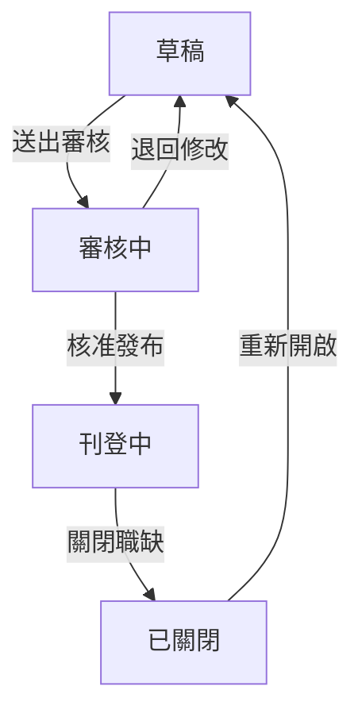

**流程說明（用白話解釋）：**

> 想像職缺就像一份公告，從寫好草稿 → 交給主管審核 → 審核通過後正式張貼 → 招完人後撤下。
> 如果主管覺得內容不夠好，可以退回修改；已經撤下的公告也可以重新張貼。

#### 狀態變更觸發事件

| 狀態變更 | 觸發事件 |
|----------|----------|
| 草稿 → 審核中 | 無 |
| 審核中 → 刊登中 | 若有 104 設定，自動同步至 104 人力銀行 |
| 審核中 → 草稿（退回） | 無特殊清除邏輯，職缺資料完整保留，僅狀態改回 `draft`（程式碼位於 `jobs.js` 的 `PATCH /api/jobs/:id/status`） |
| 刊登中 → 已關閉 | 若已同步 104，自動下架 104 職缺 |

### 2.5 搜尋與篩選

#### 篩選條件

| 篩選項目 | 選項 |
|----------|------|
| 資料來源 | 內部職缺、104 職缺 |
| 關鍵字搜尋 | 職缺名稱、部門 |
| 部門篩選 | 依組織架構之部門清單 |
| 狀態篩選 | 草稿、審核中、刊登中、已關閉 |

---

## 三、104 人力銀行整合

### 3.1 同步職缺至 104

#### 啟用方式

於新增或編輯職缺時，勾選「同步至 104」選項，並填寫 104 專屬欄位。

#### 104 專屬欄位說明

| 欄位名稱 | 必填 | 說明 | 選項/格式 |
|----------|------|------|-----------|
| 職缺類型 | 是 | 工作性質 | 全職(1)、兼職(2)、高階主管(3) |
| 職務類別 | 是 | 104 職務分類代碼 | 依 104 職務分類表 |
| 薪資類型 | 是 | 薪資計算方式 | 面議(10)、月薪(50)、年薪(60) |
| 最低薪資 | 條件必填 | 薪資下限（非面議時必填） | 數字 |
| 最高薪資 | 條件必填 | 薪資上限（非面議時必填） | 數字 |
| 工作地點 | 是 | 104 地區代碼 | 依 104 地區分類表 |
| 學歷要求 | 是 | 最低學歷要求 | 高中以下(1)、高中職(2)、專科(4)、大學(8)、碩士(16)、博士(32) |
| 聯絡人 | 是 | 對外顯示之聯絡人姓名 | 文字 |
| 聯絡 Email | 是 | 接收應徵通知之信箱 | Email 格式 |
| 上班時段 | 否 | 工作時間設定 | 日班(1)、夜班(2)、大夜班(3)、假日班(4)、中班(5) |
| 回覆天數 | 否 | 預計回覆求職者天數 | 0(不限)、3、7、14、30 |

#### 薪資設定規則

| 職缺類型 | 薪資類型限制 |
|----------|--------------|
| 全職 | 可選擇面議、月薪、年薪 |
| 兼職 | 可選擇面議、月薪、年薪 |
| 高階主管 | 強制使用面議（104 API 規定） |

### 3.2 從 104 同步資料

對於已同步之 104 職缺，可使用「從 104 同步」功能，取得 104 端的最新職缺資料並更新至系統。

#### 同步欄位

- 職缺名稱
- 職務說明
- 薪資設定
- 職務類別
- 學歷要求
- 其他 104 專屬欄位

### 3.3 履歷匯入功能

#### 匯入方式

| 匯入方式 | 說明 |
|----------|------|
| 手動匯入 | 點擊「立即匯入」按鈕，即時從 104 同步最新履歷 |
| 自動匯入 | 設定排程，系統於指定時間自動執行匯入 |

#### 自動匯入排程設定

| 頻率 | 可設定項目 |
|------|------------|
| 每天 | 執行時間（00:00 ~ 23:00） |
| 每週 | 星期幾（可複選）+ 執行時間 |
| 每月 | 日期（1-31 號，可複選）+ 執行時間 |

#### 履歷匯入流程圖

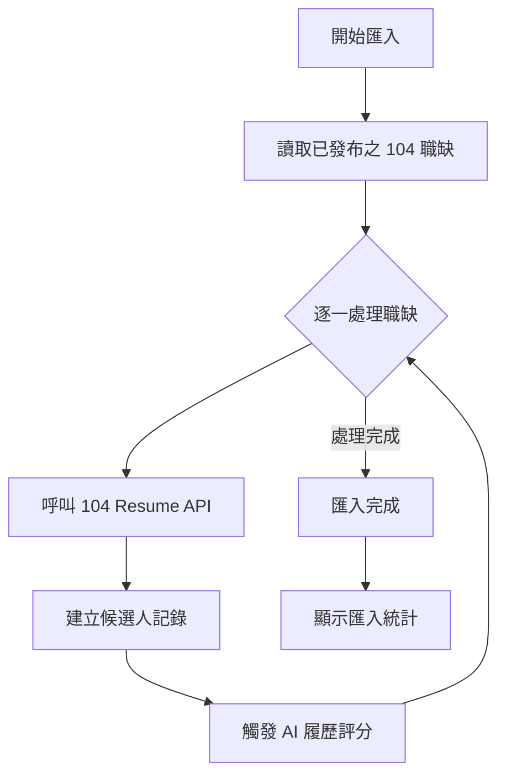

**流程說明：**

> 履歷匯入就像去信箱收信：系統會逐一檢查每個已發布的 104 職缺，從 104 網站把新投遞的履歷「收下來」，
> 自動建立候選人資料，並且立即啟動 AI 評分，讓 HR 一打開系統就能看到每位候選人的匹配分數。

#### 匯入進度顯示

手動匯入時，系統將顯示即時進度：
- 目前處理中的職缺名稱
- 各職缺處理狀態（待處理、處理中、已完成、錯誤）
- 已匯入履歷數量
- 整體進度百分比

---

## 四、候選人管理

### 4.1 候選人列表

#### 進入方式

1. 於職缺管理頁面，點擊特定職缺的「查看候選人」按鈕
2. 系統導向該職缺之候選人列表頁面

#### 列表顯示資訊

| 欄位 | 說明 |
|------|------|
| 姓名 | 候選人姓名 |
| 應徵日期 | 履歷投遞或匯入日期 |
| 學歷 | 最高學歷 |
| 工作經驗 | 總工作年資 |
| 技能 | 主要技能標籤 |
| 匹配分數 | AI 履歷評分結果（0-100） |
| 狀態 | 候選人目前狀態 |

#### 篩選條件

| 篩選項目 | 說明 |
|----------|------|
| 關鍵字搜尋 | 姓名、學歷、技能 |
| 狀態篩選 | 依候選人狀態篩選 |
| 分數篩選 | 依匹配分數區間篩選 |

### 4.2 AI 履歷評分

#### 評分觸發方式

| 方式 | 說明 |
|------|------|
| 自動觸發 | 履歷匯入時自動執行 |
| 手動觸發 | 點擊候選人列表中的「AI 評分」按鈕 |
| 批量評分 | 勾選多位候選人後執行批量評分 |

#### 評分指標

| 指標 | 權重 | 說明 |
|------|------|------|
| 需求條件匹配 | 40% | 候選人條件與職缺需求的匹配程度 |
| 技能關鍵字 | 35% | 履歷中技能關鍵字與職缺需求的吻合度 |
| 經歷相關性 | 25% | 工作經歷與職缺需求的相關程度 |

#### AI 履歷評分運作原理

**目前的運作方式：**

系統使用「規則引擎」進行評分（非大型語言模型），流程如下：

1. **提取職缺關鍵字**：從職缺的 JD（職務說明書）中提取需求條件與技能關鍵字
2. **掃描候選人資料**：逐一比對候選人的學歷、技能、工作經歷等文字內容
3. **正則匹配計算**：使用關鍵字比對（正向關鍵字加分、負向關鍵字扣分）
4. **加權求和**：依照各指標權重計算最終分數

> **白話比喻**：就像拿著一張「技能需求清單」逐項檢查候選人的履歷，
> 有打勾的加分，沒打勾的不扣分，出現警示詞的才扣分，最後算出一個總成績。

#### 評分結果

| 分數區間 | 等級 | 說明 |
|----------|------|------|
| 80-100 | 高度匹配 | 強烈建議邀請面試 |
| 60-79 | 中度匹配 | 建議進一步評估 |
| 0-59 | 低度匹配 | 建議謹慎考慮 |

### 4.3 候選人操作

#### 可執行操作

| 操作 | 說明 | 前置條件 |
|------|------|----------|
| 查看履歷 | 檢視候選人完整履歷資料 | 無 |
| AI 評分 | 執行或重新執行 AI 履歷評分 | 無 |
| 發送邀請 | 發送面試邀請給候選人 | 狀態為 new |
| 不邀請 | 標記為不邀請面試 | 狀態為 new |
| 安排面試 | 設定面試時間與方式 | 候選人已回覆邀請 |
| 面試評分 | 進入面試評分頁面 | 狀態為 interview |

### 4.4 手動新增候選人

#### 適用條件

僅「內部職缺」可使用手動新增候選人功能。104 職缺之候選人由系統自動同步，不提供手動新增。

#### 表單結構

表單分為 4 個頁籤，包含完整的 104 履歷規格欄位：

**頁籤一：基本資料**

| 欄位 | 必填 | 說明 |
|------|------|------|
| 姓名 | 是 | 候選人中文姓名 |
| 英文姓名 | 是 | 候選人英文姓名 |
| 性別 | 是 | 男/女 |
| 生日 | 是 | 出生日期 |
| Email | 是 | 電子郵件 |
| 手機 | 是 | 行動電話 |
| 市話 | 否 | 住宅電話 |
| 聯絡方式 | 是 | 偏好聯絡方式 |
| 聯絡地址 | 是 | 通訊地址 |
| 國籍 | 是 | 國籍 |
| 兵役狀況 | 否 | 役畢/免役/未服役 |
| 駕照 | 否 | 持有駕照類型 |
| 交通工具 | 否 | 擁有交通工具 |

**頁籤二：求職條件**

| 欄位 | 必填 | 說明 |
|------|------|------|
| 希望性質 | 是 | 全職/兼職 |
| 上班時段 | 是 | 日班/夜班/輪班 |
| 輪班制度 | 是 | 是否接受輪班 |
| 可上班日 | 否 | 最快可到職日期 |
| 希望待遇 | 否 | 期望薪資 |
| 希望地點 | 否 | 期望工作地點 |
| 希望職稱 | 否 | 期望職務名稱 |
| 希望職類 | 否 | 期望職務類別 |
| 希望產業 | 否 | 期望產業類別 |
| 個人簡介 | 否 | 自我介紹 |
| 格言 | 否 | 個人座右銘 |
| 個人特色 | 否 | 特色描述 |
| 證照 | 否 | 持有證照 |

**頁籤三：學經歷**

| 欄位 | 必填 | 說明 |
|------|------|------|
| 學歷列表 | 是（至少一筆） | 學校、科系、學位、就學狀態 |
| 工作經歷 | 是（至少一筆） | 公司、職稱、產業、任職期間、工作內容 |
| 技能專長 | 否 | 技能描述 |

**頁籤四：附件與推薦人**

| 欄位 | 必填 | 說明 |
|------|------|------|
| 附件上傳 | 否 | 履歷附件（PDF、Word、圖片） |
| 推薦人 | 否 | 姓名、公司、職稱、電話、Email |

---

# 第二部分：AI 智能面試

## 一、功能概述

AI 智能面試模組整合「面試評分」、「候選人表單」與「AI 量化分析」三大功能，協助組織建立標準化的面試流程，降低主觀偏差，提升錄用決策的一致性與品質。

### 1.1 主要功能項目

- 面試官評分系統（17 題倒扣制）
- 面試流程檢核
- 綜合評估
- 候選人面試表單
- AI 三維量化分析
- 錄用決策管理
- 人才庫管理

### 1.2 AI 智能面試的完整流程

> **白話說明**：AI 智能面試不是讓 AI 直接面試候選人，而是在「人工面試」的基礎上，
> 由 AI 輔助分析候選人的回答品質，幫助面試官做出更客觀的決策。

整體流程分為 **四大階段**：

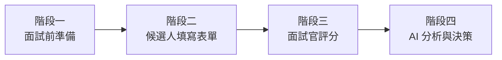

**階段一：面試前準備（HR 操作）**
1. HR 在候選人列表中選擇要面試的候選人
2. 點擊「發送面試邀請」，系統自動產生邀請連結
3. 候選人透過連結回覆是否接受面試
4. HR 安排面試時間，系統產生面試表單連結與 QR Code

**階段二：候選人填寫表單（候選人操作）**
1. 候選人收到面試表單的 Token 連結或掃描 QR Code
2. 進入 5 步驟表單頁面，限時 60 分鐘填寫
3. 系統每秒自動暫存，防止意外遺失
4. 填寫完成送出，資料進入系統等待面試官查看

**階段三：面試官評分（面試官操作）**
1. 面試當天，面試官開啟候選人的評分頁面
2. 參考候選人的履歷與表單回答，進行 17 題評核
3. 勾選 6 項面試流程檢核（確保面試品質一致）
4. 填寫 10 項綜合評估與優缺點總評
5. 給出錄取建議：Pass / Hold / Reject

**階段四：AI 分析與決策（系統 + 主管操作）**
1. 面試官提交評分時，前端同步計算 AI 量化分析結果，**隨評分一併送出**（同一個 API 請求）
2. AI 從「關鍵字匹配」「語意分析」「JD 適配度」三個維度進行評估
3. 若 AI 結果一併提交 → 候選人直接進入 `pending_decision`（待決策）
4. 若未帶 AI 結果（例外狀況）→ 候選人進入 `pending_ai`（待 AI 分析）
5. 主管查看 AI 報告與面試官評分，做出最終決策
6. 錄用 → 發送 Offer → 候選人回覆 → 報到

---

## 二、面試評分系統

### 2.1 評分架構概述

面試評分採用「100 分倒扣制」，面試官依據候選人表現，針對各評核項目給予評分等級，系統自動計算扣分後得出總分。

> **白話說明**：每位候選人一開始都有 100 分，面試官針對 17 個項目打分，
> 表現越差扣越多分。最後加總剩餘的分數就是面試總分。
> 這樣的好處是：所有面試官使用相同標準，減少「這個面試官比較嚴格」的問題。

#### 評分等級定義

| 等級 | 扣分 | 說明 |
|------|------|------|
| 優異 | 0 | 表現超越期望，無需改進 |
| 良好 | -1 | 表現符合期望，偶有小缺失 |
| 佳 | -2 | 表現尚可，有改進空間 |
| 尚可 | -3 | 表現略低於期望，需要培訓 |
| 差 | -4 | 表現明顯不足，不符合要求 |

#### 總分計算

```
總分 = 100 + Σ(各題扣分)

範例：若 17 題中有 10 題為「優異」(0)、5 題為「良好」(-1)、2 題為「佳」(-2)
總分 = 100 + (10×0) + (5×-1) + (2×-2) = 100 - 5 - 4 = 91 分
```

### 2.2 17 題評核項目

#### 第一類：個人修養（3 題）

| 編號 | 評核項目 | 評核重點 |
|------|----------|----------|
| 1 | 守時 | 是否準時到達面試地點 |
| 2 | 禮貌 | 言談舉止是否得體有禮 |
| 3 | 儀容 | 穿著打扮是否整潔適當 |

#### 第二類：求職意願（3 題）

| 編號 | 評核項目 | 評核重點 |
|------|----------|----------|
| 4 | 職業目標 | 是否有明確的職涯規劃 |
| 5 | 職位了解 | 是否了解應徵職位的工作內容 |
| 6 | 求職態度 | 對此職位的積極度與誠意 |

#### 第三類：綜合素質（6 題）

| 編號 | 評核項目 | 評核重點 |
|------|----------|----------|
| 7 | 執行力 | 完成任務的能力與效率 |
| 8 | 責任感 | 對工作的負責態度 |
| 9 | 反應能力 | 面對問題的應變能力 |
| 10 | 團隊意識 | 團隊合作的意願與能力 |
| 11 | 計畫性 | 工作規劃與組織能力 |
| 12 | 溝通能力 | 表達與傾聽的能力 |

#### 第四類：性格特質（2 題）

| 編號 | 評核項目 | 評核重點 |
|------|----------|----------|
| 13 | 外向親和 | 人際互動的主動性與親和力 |
| 14 | 自信心 | 對自我能力的信心程度 |

#### 第五類：專業技能（3 題）

| 編號 | 評核項目 | 評核重點 |
|------|----------|----------|
| 15 | 專業知識 | 職位所需專業知識的掌握程度 |
| 16 | 工作經驗 | 相關工作經驗的深度與廣度 |
| 17 | 解決問題能力 | 分析與解決問題的能力 |

### 2.3 面試流程檢核

面試官需勾選確認已完成以下面試流程項目：

| 編號 | 檢核項目 | 說明 |
|------|----------|------|
| 1 | 公司文化與願景介紹 | 說明公司文化、願景與工作環境 |
| 2 | 商業模式與品牌簡介 | 介紹公司業務、產品與品牌定位 |
| 3 | 組織架構與工作環境 | 說明部門架構與工作環境 |
| 4 | 職務內容與 JD 說明 | 詳細說明工作內容與職責 |
| 5 | 薪酬制度與福利 | 說明薪資結構與員工福利 |
| 6 | 管理工具說明 | 介紹使用的管理工具（如 OKR、專案報表等） |

> **為什麼需要流程檢核？** 確保每位面試官都完整介紹了公司資訊，
> 讓每位候選人獲得一致的面試體驗，避免因面試官不同而造成資訊落差。

### 2.4 綜合評估

除 17 題評核外，面試官需針對以下 10 個面向進行綜合評估：

| 編號 | 評估面向 | 說明 |
|------|----------|------|
| 1 | 整體儀態形象 | 外表、氣質、談吐的整體印象 |
| 2 | 對公司/職務了解程度 | 是否事先了解公司與職位 |
| 3 | 對應徵工作之熱誠 | 對此工作的熱情與投入意願 |
| 4 | 個人期望與公司發展方向 | 個人目標是否與公司方向契合 |
| 5 | 選擇新工作期望 | 換工作的動機與期望 |
| 6 | 人格特質與性格 | 性格是否適合團隊與工作 |
| 7 | 對問題的理解力（EQ） | 情緒智商與問題理解能力 |
| 8 | 表達能力 | 口語表達的清晰度與邏輯性 |
| 9 | 親和度 | 與人互動的親切感 |
| 10 | 專業技能評價 | 專業能力的整體評價 |

### 2.5 面試結果總評

#### 必填項目

| 項目 | 必填 | 說明 |
|------|------|------|
| 優點總評 | 是 | 候選人的主要優點與亮點 |
| 缺點總評 | 是 | 候選人的不足之處與風險 |
| 錄取建議 | 是 | Pass / Hold / Reject |
| 備註 | 否 | 其他補充說明 |

#### 錄取建議定義

| 建議 | 說明 |
|------|------|
| Pass | 建議錄取，符合職位需求 |
| Hold | 考慮中，可列入人才庫觀察 |
| Reject | 不予錄取，不符合職位需求 |

### 2.6 分數警示機制

當面試總分低於 65 分時，系統將顯示警示提醒，建議面試官審慎評估。

---

## 三、候選人面試表單

### 3.1 表單概述

候選人面試表單為面試前由候選人填寫之問卷，採 5 步驟分頁設計，共約 50 題。系統提供自動暫存與倒數計時功能，確保填寫過程順暢。

> **白話說明**：候選人在面試前會收到一個連結，點開後進入線上問卷。
> 問卷分五個步驟（像是填五頁的表格），總共 60 分鐘要填完。
> 系統會自動存檔，所以中途不小心關掉也不會遺失已填的內容。
> 時間到了就自動鎖定，不能再修改。

### 3.2 存取方式

| 方式 | 說明 |
|------|------|
| Token 連結 | HR 產生專屬連結，發送給候選人 |
| QR Code | HR 產生 QR Code，候選人掃描後進入表單 |

### 3.3 表單結構

**步驟一：基本資料與工作經歷**

- 基本個人資訊確認
- 工作經歷補充

**步驟二：應徵動機與一般印象（7 題）**

- 應徵此職位的動機
- 對公司的了解程度
- 對職位的期望
- 相關問題

**步驟三：工作經驗與態度**

- 經驗與潛能（11 題）
- 離職分析與期望（4 題）
- 工作態度（7 題）

**步驟四：人際互動與衝突解決**

- 人際互動（4 題）
- 衝突解決（4 題）

**步驟五：職涯規劃與願景**

- 協作、專業與挑戰（10 題）
- 職涯規劃與願景（7 題）

### 3.4 候選人填寫流程圖

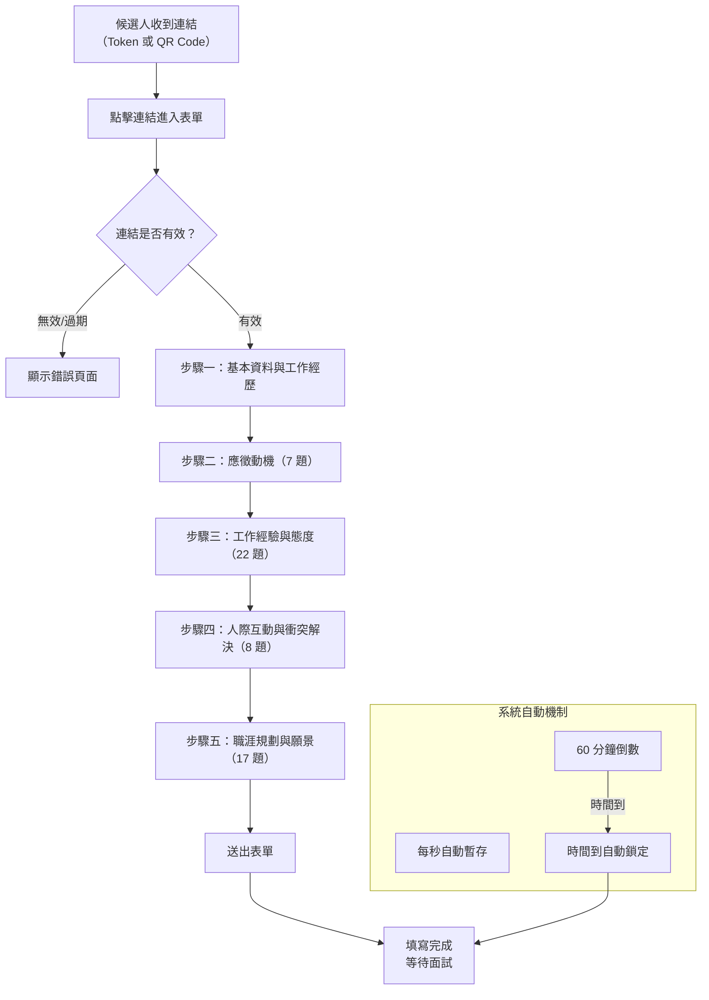

### 3.5 系統功能

| 功能 | 說明 |
|------|------|
| 自動暫存 | 表單每次變更後 debounce 1 秒自動儲存（已鎖定時不再儲存） |
| 倒數計時 | 顯示剩餘填寫時間，預設 60 分鐘。剩餘 ≤5 分鐘顯示黃色警告，≤1 分鐘顯示紅色脈衝動畫 |
| 時間鎖定 | 時間到達後自動鎖定表單：所有輸入欄位 `disabled`、容器 `opacity: 0.7` + `pointer-events: none`。**但「送出」按鈕仍可點擊**，超時送出記錄為 `Locked` 狀態（非 `Submitted`） |
| 進度追蹤 | 顯示目前填寫步驟與完成進度 |
| 資料預填 | 自動帶入候選人履歷中的基本資料 |

---

## 四、AI 量化分析

### 4.1 分析架構

AI 量化分析採用三維分析模型，分別針對「關鍵字匹配」、「語意分析」與「JD 適配度」進行評估，最終加權計算綜合分數。

> **白話說明**：AI 會從三個角度來看候選人：
> 1. **關鍵字匹配（40%）**：候選人的回答中有沒有提到我們在意的技能和經驗
> 2. **語意分析（30%）**：候選人的回答呈現出什麼樣的溝通風格和態度
> 3. **JD 適配度（30%）**：候選人的技能跟這個職缺的需求有多吻合

#### 分析權重配置

| 分析維度 | 權重 | 說明 |
|----------|------|------|
| 關鍵字匹配 | 40% | 分析候選人資料中的關鍵字匹配情況 |
| 語意分析 | 30% | 分析回答內容的語意特徵 |
| JD 適配度 | 30% | 計算技能與職缺需求的匹配程度 |

### 4.2 AI 量化分析流程圖

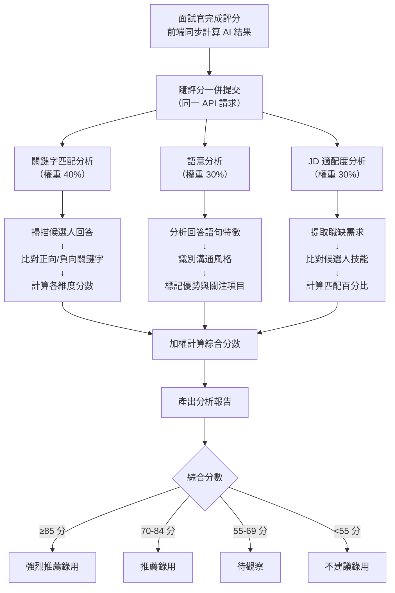

### 4.3 關鍵字匹配分析（40%）

#### 分析內容

| 項目 | 說明 |
|------|------|
| 正向關鍵字統計 | 與職缺需求相關的正面關鍵字出現次數 |
| 負向關鍵字統計 | 可能的風險或負面關鍵字出現次數 |
| 各維度分數明細 | 各評估維度的關鍵字匹配分數 |
| 匹配關鍵字列表 | 詳列匹配到的關鍵字、所屬維度、分數、出現次數 |

#### 預設關鍵字範例

| 類型 | 關鍵字範例 |
|------|-----------|
| 正向關鍵字 | 專案經驗、技術、系統、架構、優化、團隊、合作、主動、學習、成長、達成、完成 |
| 負向關鍵字 | 不知道、不確定、沒有經驗、不會、離職、衝突、薪水、休假 |

> **備註**：HR 可以在「職缺關鍵字管理」頁面自訂正向/負向關鍵字、設定權重（1-10），
> 也可以新增同義詞，讓系統能更精準地辨識不同說法。

#### 分數計算

```
關鍵字分數 = 基礎分(50) + 正向關鍵字加分 - 負向關鍵字扣分
```

### 4.4 語意分析（30%）

#### 分析內容

| 項目 | 說明 |
|------|------|
| 語意洞察 | 分析候選人回答的語意特徵 |
| 優勢項目 | 從回答中識別的正面特質 |
| 關注項目 | 從回答中識別的潛在風險 |
| 溝通風格 | 判斷候選人的溝通風格類型 |

#### 溝通風格類型

| 類型 | 特徵 | 辨識依據 |
|------|------|----------|
| 自信積極型 | 表達自信、主動積極 | 使用「我擅長」「我負責」「我帶領」等語句 |
| 團隊協作型 | 強調合作、重視團隊 | 使用「我們團隊」「一起合作」「共同完成」等語句 |
| 學習成長型 | 願意學習、追求成長 | 使用「我學到」「我想提升」「持續進步」等語句 |
| 中性平穩 | 表達平穩、無明顯傾向 | 無明顯上述特徵 |

#### 分數計算

```
語意分數 = 基礎分(60) + 優勢項目加分(每項+10) - 關注項目扣分(每項-10)
```

### 4.5 JD 適配度分析（30%）

#### 分析內容

| 項目 | 說明 |
|------|------|
| 匹配需求 | 候選人符合的職缺需求項目 |
| 缺少技能 | 候選人未具備的必要技能 |
| 額外技能 | 候選人具備的額外加分技能 |
| 匹配百分比 | 需求匹配度百分比 |

#### 分數計算

```
JD 適配分數 = (匹配需求數 / 總需求數) × 100 + 額外技能加分(每項+2，最高+10)
```

### 4.6 綜合評分與錄用建議

#### 綜合分數計算

```
綜合分數 = 關鍵字分數 × 0.4 + 語意分數 × 0.3 + JD 適配分數 × 0.3
```

#### 錄用建議對照表

| 分數區間 | 建議等級 | 說明 |
|----------|----------|------|
| ≥85 | 強烈推薦錄用 | 候選人高度符合職缺需求，建議優先錄用 |
| 70-84 | 推薦錄用 | 候選人符合大部分需求，建議錄用 |
| 55-69 | 待觀察 | 候選人部分符合需求，建議進一步評估或列入人才庫 |
| <55 | 不建議錄用 | 候選人與職缺需求差距較大，不建議錄用 |

### 4.7 視覺化呈現

系統提供以下視覺化分析結果：

| 項目 | 說明 |
|------|------|
| 能力雷達圖 | 以雷達圖呈現各維度評分 |
| 分數卡片 | 以卡片形式呈現三維分數與綜合分數 |
| 錄用建議卡片 | 以視覺化方式呈現錄用建議等級 |

---

## 五、錄用決策管理

### 5.1 決策選項

| 決策 | 說明 |
|------|------|
| 錄用（Offered） | 決定錄用候選人，發送 Offer |
| 婉拒（Rejected） | 決定不錄用候選人 |

### 5.2 決策流程圖

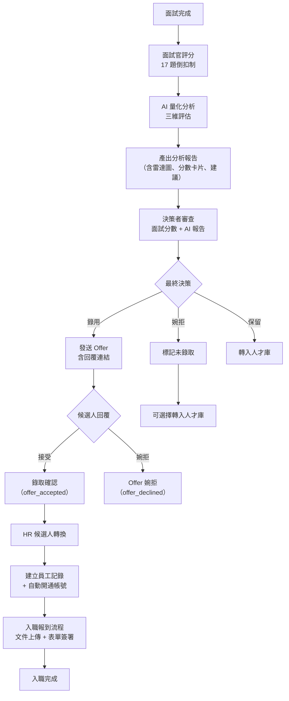

### 5.3 Offer 管理

#### 功能項目

| 項目 | 說明 |
|------|------|
| 發送 Offer | 系統產生 Offer 回覆連結並發送給候選人 |
| 追蹤狀態 | 追蹤候選人的 Offer 回覆狀態 |
| 回覆連結 | 候選人透過連結回覆接受或婉拒 |
| 回覆期限 | 可設定 Offer 回覆截止日期 |

---

## 六、人才庫管理

### 6.1 功能概述

人才庫用於儲存與管理潛在候選人，包含未錄取但值得保留的人才、主動投遞但暫無適合職缺的候選人等。

> **白話說明**：人才庫就像一個「優質候選人通訊錄」。
> 即使這次沒有錄用，但覺得不錯的人才可以存起來，等以後有合適的職缺時再聯繫。

### 6.2 主要功能

| 功能 | 說明 |
|------|------|
| 人才列表 | 瀏覽與搜尋人才庫中的候選人 |
| 標籤管理 | 為候選人設定分類標籤 |
| 聯繫追蹤 | 記錄與候選人的聯繫歷史 |
| 職缺媒合 | AI 自動媒合適合的職缺 |
| 自動標籤 | 系統自動依據技能、經驗、學歷等條件標記標籤 |

### 6.3 標籤分類

| 分類 | 說明 | 範例 |
|------|------|------|
| 技能 | 技術能力標籤 | Python、React、專案管理 |
| 經驗 | 工作經驗標籤 | 資深、主管級、跨國經驗 |
| 教育 | 學歷相關標籤 | 碩士、海外學歷 |
| 個性 | 性格特質標籤 | 積極主動、團隊合作 |
| 自訂 | 自定義標籤 | 依組織需求自行定義 |

### 6.4 聯繫狀態

| 狀態 | 說明 |
|------|------|
| 待聯繫 | 尚未聯繫的候選人 |
| 已聯繫 | 已進行聯繫的候選人 |
| 無意願 | 候選人表示無意願 |

---

# 第三部分：入職報到與帳號建立

## 一、功能概述

入職報到模組處理「候選人接受 Offer 之後」到「正式成為可登入系統的員工」之間的所有流程。這是招募流程的最後一哩路，也是員工生命週期的起點。

> **白話說明**：候選人說「我要來上班」之後，HR 還需要幫他建檔案、開帳號、收文件。
> 這個模組就是把這些瑣碎的入職手續電子化，HR 在系統上操作，新人在線上交文件、簽合約。

### 1.1 主要功能項目

- 待轉換候選人清單（已接受 Offer，等待 HR 處理）
- 候選人轉換為員工（自動建立員工記錄 + 登入帳號）
- 入職文件上傳（5 類必要文件）
- 入職表單簽署（線上簽署勞動契約等文件）
- 入職進度追蹤（即時百分比 + 各項目狀態）
- 主管審核簽署文件

### 1.2 入職報到的完整流程

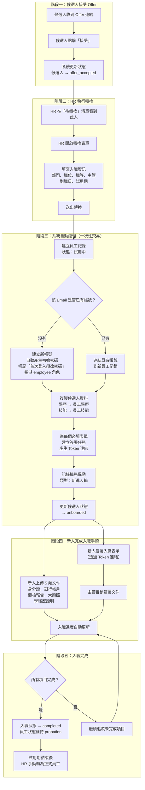

---

## 二、待轉換候選人清單

### 2.1 功能說明

當候選人透過 Offer 回覆連結點擊「接受」後，系統自動將其加入「待轉換」清單。HR 可在此清單中查看所有已接受 Offer 但尚未正式入職的候選人。

### 2.2 清單顯示資訊

| 欄位 | 說明 |
|------|------|
| 姓名 | 候選人姓名 |
| Email | 候選人電子郵件 |
| 電話 | 候選人手機號碼 |
| 應徵職位 | 來自職缺的職位名稱 |
| 原始部門 | 職缺所屬部門（預填用） |
| 原始職等 | 來自職務說明書的職等（預填用） |
| 接受 Offer 時間 | 候選人回覆接受的時間 |
| 等待天數 | 距離接受 Offer 已過幾天（提醒 HR 儘速處理） |

---

## 三、候選人轉換為員工

### 3.1 功能說明

這是入職流程的核心操作。HR 點擊「轉換」後，系統在**一次原子交易**中完成以下所有動作，確保不會出現「員工建了一半、帳號沒建到」的情況。

> **白話說明**：就像搬新家時簽約 — 簽完租約的那一刻，房東同時給你鑰匙（帳號）、
> 把水電登記在你名下（員工檔案）、準備好需要你簽的文件。這些事情一次全部辦好，
> 不會發生「檔案建了但帳號忘了開」的情況。

### 3.2 轉換表單欄位

| 欄位 | 必填 | 說明 | 預設值 |
|------|------|------|--------|
| 部門 | ✅ | 新員工所屬部門 | 自動帶入職缺所屬部門 |
| 職位 | ✅ | 標準職位名稱（如「會計」） | — |
| 職務 | ❌ | 具體工作名稱（如「財務出納」） | — |
| 職等 | ❌ | 1-7 職等 | 自動帶入 JD 的職等 |
| 角色 | ❌ | 管理者 or 一般員工 | 一般員工 |
| 直屬主管 | ❌ | 下拉選擇 | — |
| 到職日期 | ✅ | 預計報到日期 | — |
| 試用期 | ❌ | 試用月數 | 3 個月 |
| 合約類型 | ❌ | 全職/兼職/約聘 | 全職 |
| 工作地點 | ❌ | 辦公地點 | — |
| 所屬子公司 | ❌ | 多租戶隔離用 | — |

### 3.3 系統自動執行的動作

HR 點擊「確認轉換」後，系統在**同一筆交易**中依序執行：

| 步驟 | 動作 | 說明 |
|------|------|------|
| 1 | 驗證前置條件 | 確認候選人狀態為 offer_accepted、尚未被轉換過 |
| 2 | 產生員工編號 | 格式 `E{年份}{3位序號}`，如 E2026001 |
| 3 | 建立員工記錄 | 狀態設為「試用中（probation）」、入職狀態設為「pending」 |
| 4 | 建立/連結登入帳號 | 若 Email 不存在 → 建新帳號；若已存在 → 連結到員工記錄 |
| 5 | 指派系統角色 | 自動指派「employee」角色 |
| 6 | 複製學歷資料 | 候選人學歷 → 員工學歷 |
| 7 | 複製技能資料 | 候選人技能 → 員工技能 |
| 8 | 更新候選人狀態 | 候選人狀態變更為「onboarded」 |
| 9 | 建立簽署任務 | 為每個必填的公開表單範本建立簽署任務，產生 Token 連結 |
| 10 | 記錄職務異動 | 新增一筆「新進入職」的異動記錄 |

### 3.4 帳號建立機制

#### 新帳號建立流程

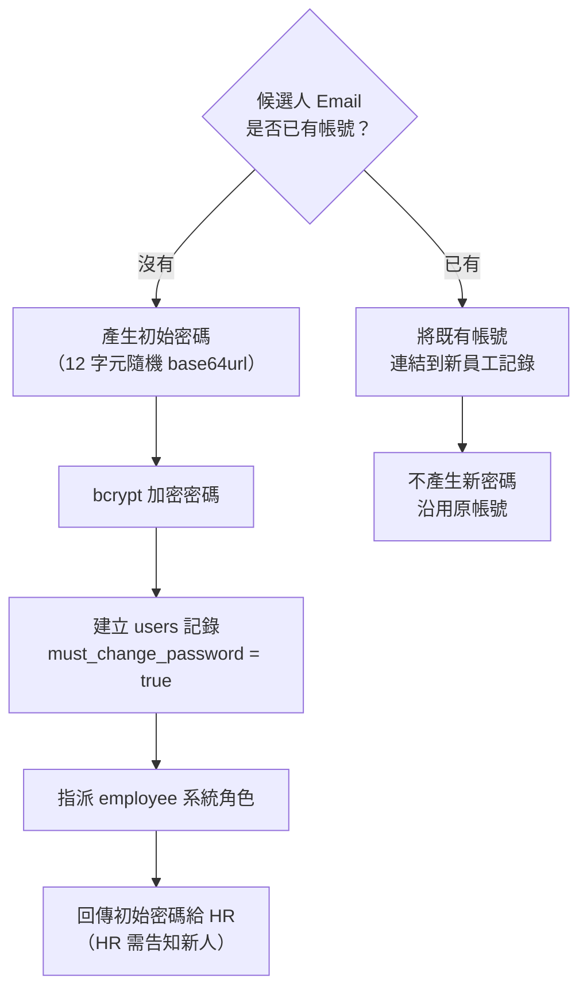

> **白話說明**：系統會幫新人自動開好一組帳號密碼。帳號就是候選人的 Email，
> 密碼是系統隨機產生的一串亂碼。HR 需要把密碼交給新人，新人第一次登入時系統會強制要求改密碼。
> 如果這個 Email 之前就在系統裡有帳號（例如回鍋員工），就直接沿用舊帳號。

#### 帳號建立回傳資訊

轉換完成後，系統回傳以下資訊給 HR：

| 欄位 | 說明 |
|------|------|
| 員工編號 | 自動產生的編號（如 E2026001） |
| Email | 登入帳號（= 候選人 Email） |
| 初始密碼 | 僅在新建帳號時回傳，HR 需安全地交付給新人 |
| 首次登入須改密碼 | 固定為「是」 |
| 預設角色 | employee |
| 入職文件連結 | 各必填表單的簽署連結清單 |

---

## 四、入職文件管理

### 4.1 必要文件上傳

新進員工需上傳以下 5 類必要文件：

| 文件類型 | 代碼 | 必填 | 說明 |
|----------|------|------|------|
| 身分證件 | id_card | ✅ | 身分證正反面影本 |
| 銀行帳戶 | bank_account | ✅ | 薪資轉帳用的銀行帳戶資料 |
| 體檢報告 | health_report | ✅ | 最近三個月內的體檢報告 |
| 大頭照 | photo | ✅ | 員工證件照 |
| 學經歷證明 | education_cert | ✅ | 畢業證書或相關證明文件 |
| 其他 | other | ❌ | 其他補充文件 |

#### 文件狀態

| 狀態 | 說明 |
|------|------|
| pending | 尚未上傳 |
| uploaded | 已上傳，等待審核 |
| approved | 已審核通過 |
| rejected | 被退回，需重新上傳 |

### 4.2 表單簽署

系統會根據已設定的「公開、啟用、必填」表單範本，自動為新進員工建立簽署任務。

> **白話說明**：HR 事先在系統裡設定好入職要簽的文件（例如勞動契約、保密協議、員工守則確認書），
> 新人入職後系統會自動產生這些文件的簽署連結。新人點連結、填表、電子簽名就完成了。

#### 簽署流程

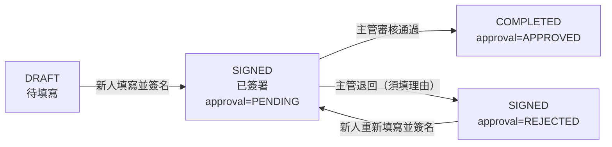

> **退回機制說明（`approvals.js`）**：
> - 退回時**必須填寫理由**（`approval_note`），否則 API 回傳 400 錯誤
> - 退回**不會清除**簽名資料（`signature_base64` 保留），僅將 `approval_status` 設為 `REJECTED`
> - 已核准（`APPROVED`）的文件**不可再退回**
> - 員工重新簽署時，新簽名**覆蓋**舊簽名，`approval_status` 重設為 `PENDING`，進入新一輪審核
> - 若範本有新版本，重簽時自動更新 `template_version`（`submissions.js` L134）

#### 簽署方式

| 項目 | 說明 |
|------|------|
| 存取方式 | 系統產生的 Token 連結（每份文件一個唯一連結） |
| 填寫內容 | 依表單範本的欄位填寫 |
| 簽名方式 | 電子簽名（signature_base64） |
| 審核者 | 直屬主管或 HR |

---

## 五、入職進度追蹤

### 5.1 進度計算方式

系統自動計算每位新進員工的入職完成百分比：

```
入職進度 = (已核准的表單數 + 已上傳的文件類型數) ÷ (必填表單總數 + 5 類必要文件) × 100%
```

> **白話說明**：假設有 2 份表單要簽、5 類文件要交，總共 7 項。
> 如果新人已經簽了 1 份表單（且主管核准了）、交了 3 類文件，那進度就是 4/7 ≈ 57%。

### 5.2 入職狀態自動更新

| 入職狀態 | 觸發條件 | 說明 |
|----------|---------|------|
| pending（待處理） | 剛完成轉換 | 新人尚未開始處理任何入職項目 |
| in_progress（進行中） | 進度 > 0% | 新人已開始上傳文件或簽署表單 |
| completed（已完成） | 進度 = 100% | 所有必填文件已上傳、所有必填表單已簽署且核准 |

### 5.3 HR 入職進度儀表板

HR 可在入職報到頁面查看所有新進員工的入職狀態：

| 顯示資訊 | 說明 |
|----------|------|
| 員工編號 | 如 E2026001 |
| 姓名 | 新進員工姓名 |
| 部門 | 所屬部門 |
| 職位 | 職位名稱 |
| 到職日 | 預計報到日期 |
| 試用期截止 | 到職日 + 試用月數 |
| 入職進度 | 百分比 + 進度條 |
| 表單進度 | 已簽/總數（如 1/2） |
| 文件進度 | 已傳/總數（如 3/5） |
| 狀態 | pending / in_progress / completed |

### 5.4 個別員工入職明細

點擊特定員工可查看每一項的詳細狀態：

**表單簽署明細**

| 欄位 | 說明 |
|------|------|
| 表單名稱 | 如「勞動契約」 |
| 是否必填 | 是/否 |
| 簽署狀態 | DRAFT / SIGNED / COMPLETED |
| 審核狀態 | 未審核 / APPROVED / REJECTED |
| 簽署時間 | 新人簽署的時間 |
| 審核時間 | 主管核准的時間 |
| 連結 | 簽署用的 Token 連結 |

**文件上傳明細**

| 欄位 | 說明 |
|------|------|
| 文件類型 | 身分證件、銀行帳戶等 |
| 是否必填 | 是/否 |
| 狀態 | pending / uploaded / approved / rejected |
| 檔案名稱 | 上傳的檔案名稱 |
| 上傳時間 | 上傳的時間 |

---

## 六、員工狀態生命週期

### 6.1 從候選人到正式員工

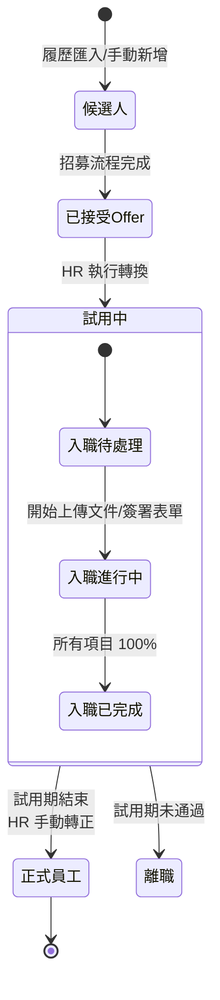

### 6.2 白話說明

| 階段 | 說明 |
|------|------|
| 候選人 | 還在面試流程中的人，還不是我們的員工 |
| 已接受 Offer | 候選人說「我要來」了，但還沒正式入職 |
| 試用中（probation） | HR 已經幫他建好員工檔案和帳號，正在辦入職手續 |
| 入職待處理 | 帳號開好了，但文件和表單都還沒交 |
| 入職進行中 | 正在陸續交文件、簽合約 |
| 入職已完成 | 所有該交的文件和該簽的合約都搞定了 |
| 正式員工 | 試用期結束，正式成為公司的一份子 |

---

# 第四部分：完整招募到入職流程總覽

## 一、端到端招募流程圖

以下流程圖展示從「產生職缺需求」到「員工入職完成」的完整旅程：

```mermaid
flowchart TD
    subgraph phase1 ["Phase 1：職缺準備"]
        need["產生招募需求"] --> create["HR 建立職缺草稿"]
        create --> fillJD["填寫職缺資訊<br/>關聯 JD、設定 104 欄位"]
        fillJD --> submit["送出審核"]
        submit --> approve{主管審核}
        approve -->|核准| publish["發布職缺"]
        approve -->|退回| create
        publish --> sync104{同步 104?}
        sync104 -->|是| pushTo104["同步至 104 人力銀行"]
        sync104 -->|否| wait["等待履歷"]
        pushTo104 --> wait
    end

    subgraph phase2 ["Phase 2：履歷收集與篩選"]
        wait --> source{履歷來源}
        source -->|"104 自動匯入"| auto104["排程/手動匯入<br/>104 履歷"]
        source -->|"手動新增"| manual["HR 手動建立<br/>候選人資料"]
        auto104 --> aiResume["AI 履歷評分<br/>（自動觸發）"]
        manual --> aiResume
        aiResume --> candidateList["候選人列表<br/>含匹配分數排序"]
        candidateList --> hrScreen{HR 初步篩選}
        hrScreen -->|邀請面試| invite["發送面試邀請"]
        hrScreen -->|不邀請| notInvited["標記不邀請<br/>可轉入人才庫"]
    end

    subgraph phase3 ["Phase 3：面試邀請與安排"]
        invite --> candidateReply{候選人回覆}
        candidateReply -->|接受| schedule["HR 安排面試時間"]
        candidateReply -->|婉拒| declined1["邀請婉拒"]
        candidateReply -->|改期| reschedule["重新協調時間"]
        reschedule --> candidateReply
        schedule --> sendForm["產生面試表單<br/>Token 連結 / QR Code"]
        sendForm --> fillForm["候選人填寫表單<br/>（5 步驟、60 分鐘）"]
    end

    subgraph phase4 ["Phase 4：面試評核"]
        fillForm --> conductInterview["進行面試"]
        conductInterview --> scoring["面試官評分<br/>17 題倒扣制"]
        scoring --> checklist["完成流程檢核<br/>6 項確認"]
        checklist --> assessment["綜合評估<br/>10 項 + 優缺點"]
        assessment --> recommendation["給出錄取建議<br/>Pass / Hold / Reject"]
    end

    subgraph phase5 ["Phase 5：AI 分析與決策"]
        recommendation --> aiTrigger["啟動 AI 量化分析"]
        aiTrigger --> aiKw["關鍵字匹配 40%"]
        aiTrigger --> aiSem["語意分析 30%"]
        aiTrigger --> aiJD["JD 適配度 30%"]
        aiKw --> aiReport["產出 AI 分析報告<br/>綜合分數 + 錄用建議"]
        aiSem --> aiReport
        aiJD --> aiReport
        aiReport --> bossReview["主管審查<br/>面試分數 + AI 報告"]
        bossReview --> finalDecision{最終決策}
        finalDecision -->|錄用| sendOffer["發送 Offer"]
        finalDecision -->|婉拒| notHired["未錄取"]
        finalDecision -->|保留| toPool["轉入人才庫"]
    end

    subgraph phase6 ["Phase 6：Offer 與回覆"]
        sendOffer --> offerReply{候選人回覆 Offer}
        offerReply -->|接受| accepted["錄取確認<br/>offer_accepted"]
        offerReply -->|婉拒| offerDeclined["Offer 婉拒"]
    end

    subgraph phase7 ["Phase 7：入職報到與帳號建立"]
        accepted --> hrConvert["HR 執行候選人轉換"]
        hrConvert --> createEmp["建立員工記錄<br/>+ 自動建立登入帳號<br/>+ 指派 employee 角色"]
        createEmp --> copyData["複製學歷/技能資料<br/>+ 建立簽署任務"]
        copyData --> newHireDocs["新人上傳 5 類文件"]
        copyData --> newHireSign["新人簽署入職表單"]
        newHireDocs --> progress["入職進度追蹤"]
        newHireSign --> managerApprove["主管審核簽署"]
        managerApprove --> progress
        progress --> onboardComplete{進度 100%?}
        onboardComplete -->|是| done["入職完成<br/>員工正式上線"]
        onboardComplete -->|否| progress
    end
```

## 二、流程階段說明（白話解釋）

### Phase 1：職缺準備 — 「發出需求，刊登職缺」

> 就像在報紙上刊登徵人廣告一樣，HR 先把職缺資訊整理好（需要什麼技能、什麼條件），
> 交給主管確認沒問題後，就可以正式刊登。如果公司有用 104 人力銀行，系統會自動把資訊同步過去。

### Phase 2：履歷收集與篩選 — 「收履歷，AI 初步打分」

> 職缺刊登後，求職者的履歷會從 104 自動匯進來（也可以 HR 自己手動加）。
> 每份履歷進來時，系統會自動跑 AI 評分，依照匹配度排序。
> HR 看排名後決定要邀請誰來面試、誰先不邀請。

### Phase 3：面試邀請與安排 — 「發邀請、填問卷」

> HR 發出面試邀請，候選人透過連結回覆是否接受。
> 接受後 HR 排定面試時間，系統會產生一個問卷連結，
> 候選人在面試前先上線填寫（限時 60 分鐘），讓面試官事先了解候選人的想法。

### Phase 4：面試評核 — 「面試官打分」

> 面試當天，面試官一邊面試一邊對 17 個項目打分（從 100 分倒扣），
> 面試結束後完成流程檢核、綜合評估，最後給出 Pass（錄取）/ Hold（保留）/ Reject（不錄取）建議。

### Phase 5：AI 分析與決策 — 「AI 出報告，主管拍板」

> 面試官打完分後，AI 分析**同步執行**——前端計算完 AI 結果後，隨評分一起提交給後端（同一個 API 請求），
> 不是背景排程或異步觸發。AI 從三個角度分析候選人：關鍵字有沒有對上、回答的語氣態度如何、技能跟職缺需不需要。
> AI 算出一個綜合分數並給出建議。主管看完面試官的分數加上 AI 報告後，做最終決定。

### Phase 6：Offer 與回覆 — 「發 Offer、等回覆」

> 決定錄用後，系統發出 Offer 連結給候選人。
> 候選人透過連結回覆接受或婉拒。

### Phase 7：入職報到與帳號建立 — 「建檔、開帳號、交文件」

> 候選人接受 Offer 後，HR 在系統上執行「轉換」操作。
> 系統一次搞定所有事：建立員工檔案、自動開好登入帳號（帳號 = Email，密碼隨機產生）、
> 把候選人的學歷和技能資料搬過來、產生需要簽署的文件連結。
> 新人收到帳號後登入系統，上傳身分證、銀行帳戶等文件，線上簽署勞動契約。
> 主管審核通過後，入職進度跑到 100%，入職手續就全部完成了。

## 三、候選人 → 員工完整狀態流轉圖

以下展示從履歷匯入到入職完成的所有可能狀態變化：

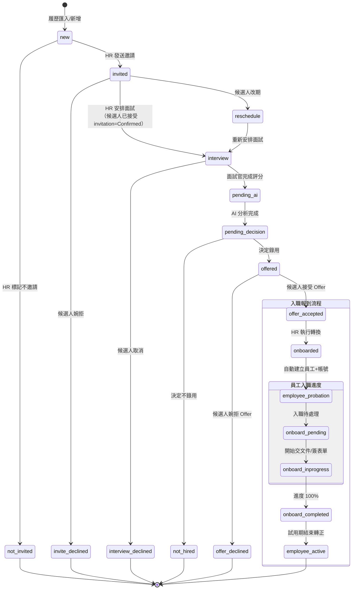

---

# 第五部分：AI 服務功能缺口分析

## 一、概述

本節說明目前 Bombus 系統中 AI 相關功能的「實際實作狀況」與「尚未實作的功能」。
了解這些缺口有助於未來的產品規劃與技術投資決策。

> **重要說明**：目前系統的 AI 分析功能主要使用「規則引擎」（基於關鍵字比對與預設規則）來實作，
> 尚未整合外部 AI 大型語言模型（如 OpenAI GPT、Google Gemini、Anthropic Claude）。
> 這代表現有 AI 功能的分析深度和智慧程度有一定的限制，但基礎架構已經完備，
> 未來可以逐步升級為真正的 AI 驅動系統。

## 二、現有 AI 功能實作狀況

### 已完成功能清單

| 功能 | 實作方式 | 說明 |
|------|----------|------|
| 關鍵字匹配分析 | 規則引擎（正則表達式） | 比對正向/負向關鍵字出現次數，支援自訂關鍵字與權重 |
| 語意分析（基礎版） | 規則引擎（短語計數） | 透過預設短語規則辨識溝通風格（如「我擅長」→ 自信型） |
| JD 適配度評分 | 規則引擎（字串比對） | 比對候選人技能與職缺需求的文字包含關係 |
| 綜合評分與建議 | 加權平均公式 | 三維分數加權後產出綜合分數與錄用建議等級 |
| 自動標籤（人才庫） | 規則引擎（正則表達式） | 根據技能、經驗等關鍵字自動標記分類標籤 |
| 職缺媒合 | 字串比對 | 比對人才技能清單與職缺需求清單的交集 |
| 視覺化報告 | 前端圖表元件 | 雷達圖、分數卡片、錄用建議卡片等 UI 呈現 |

### 現有方式的優缺點

| 面向 | 優點 | 限制 |
|------|------|------|
| 速度 | 毫秒級回應，不需等待外部 API | — |
| 成本 | 無 API 呼叫費用 | — |
| 穩定性 | 不依賴外部服務，不會因 API 故障而中斷 | — |
| 分析深度 | — | 僅能做表面文字比對，無法理解語意與上下文 |
| 準確度 | — | 容易被同義詞、不同用語方式影響結果 |
| 擴展性 | — | 新增分析維度需要手動編寫規則 |

## 三、缺少的 AI 功能（待開發）

### 3.1 真實自然語言處理（NLP）引擎

**現狀**：語意分析僅基於「出現特定短語就給分/扣分」的固定規則。

**缺少的能力**：
- 理解完整句子的意思（例：「我在壓力下也能保持冷靜」應被判斷為抗壓性高，但目前無法辨識）
- 辨識回答的邏輯連貫性（候選人是否前後矛盾）
- 分析回答的深度與具體性（是否言之有物 vs 泛泛而談）
- 跨語言理解（中英混雜的回答）

**預期改善效果**：
> 從「看到『團隊』這個字就加分」升級為「理解候選人是否真的具有團隊合作經驗」。

### 3.2 履歷自動解析引擎

**現狀**：資料庫已預留完整的 AI 分析欄位（`candidate_resume_analysis` 表），但實際無解析引擎。

**缺少的能力**：
- 從 PDF / Word 履歷檔案中自動提取結構化資訊（姓名、技能、經歷）
- 自動識別技術技能（硬技能 vs 軟技能分類）
- 自動分析工作經歷的成就與貢獻
- 自動偵測履歷中的異常（如頻繁跳槽、經歷空窗期）

**預期改善效果**：
> HR 不需要手動建檔，上傳一份履歷 PDF 就能自動完成候選人資料建立。

### 3.3 語音轉文字（ASR）與面試錄音分析

**現狀**：面試評分表中有 `transcript_text`（逐字稿）和 `media_url`（錄音檔）欄位，但無實際錄音上傳與轉譯功能。

**缺少的能力**：
- 面試錄音上傳與儲存
- 語音轉文字（Speech-to-Text），將面試錄音轉為逐字稿
- 從語音語調分析候選人的情緒狀態（自信、緊張、猶豫）
- 自動記錄面試重點摘要

**預期改善效果**：
> 面試官不需要邊面試邊做筆記，系統自動將對話轉成文字並摘要重點。

### 3.4 情緒與行為分析

**現狀**：前端程式碼中有情緒資料結構（信心度、焦慮、熱情），但僅為空殼，無實際分析引擎。

**缺少的能力**：
- 分析文字回答中的情緒傾向（正面、中性、負面）
- 分析語音的情緒特徵（語速、音調、停頓頻率）
- 偵測候選人的自信程度與焦慮程度
- 綜合多模態（文字+語音）的情緒評估

**預期改善效果**：
> 提供面試官一個「候選人心理狀態雷達圖」，幫助評估軟實力。

### 3.5 智能推薦與匹配引擎

**現狀**：人才庫的職缺媒合使用簡單字串比對（`includes()` 方法）。

**缺少的能力**：
- 基於語意相似度的技能匹配（例：「React 開發」和「前端框架」應被視為相關）
- 考量候選人偏好與職缺條件的雙向匹配
- 基於歷史錄用資料的推薦模型（哪些特徵的候選人在特定職位表現最好）
- 主動推送通知：當新職缺開放時，自動通知匹配度高的人才庫候選人

**預期改善效果**：
> 從「比對有沒有完全一樣的關鍵字」升級為「理解技能之間的關聯性」。

### 3.6 面試問題智能生成

**現狀**：面試問卷為固定的 50 題標準題目，所有職缺使用相同問卷。

**缺少的能力**：
- 根據職缺 JD 自動生成針對性的面試問題
- 根據候選人履歷自動生成個人化追問問題
- 依據候選人回答動態調整後續問題（自適應問卷）
- 提供面試官「建議追問問題」（基於候選人回答的薄弱環節）

**預期改善效果**：
> 每個候選人的面試體驗更有針對性，面試官不再問千篇一律的問題。

### 3.7 招募數據分析與預測

**現狀**：僅有基礎的統計數據（活躍職缺數、新履歷數、待審核數）。

**缺少的能力**：
- 招募漏斗分析（各階段的轉換率與平均停留時間）
- 招募效率預測（預估職缺的填補時間）
- 候選人流失風險預警（哪些候選人可能放棄面試或拒絕 Offer）
- AI 面試評分準確度回饋（錄用候選人的後續表現 vs AI 預測）

**預期改善效果**：
> HR 可以看到「這個職缺平均需要 30 天填補」或「這位候選人有 70% 機率接受 Offer」。

## 四、AI 功能缺口優先級建議

| 優先級 | 功能 | 建議理由 | 預估影響範圍 |
|--------|------|----------|-------------|
| **P0（最高）** | 真實 NLP 引擎整合 | 直接提升所有 AI 分析的品質與可信度 | 關鍵字分析、語意分析、JD 適配度 |
| **P0（最高）** | 履歷自動解析 | 大幅降低 HR 手動建檔的工時 | 候選人管理、AI 評分 |
| **P1（高）** | 語音轉文字（ASR） | 面試錄音是高價值但未被利用的資料 | 面試評分、AI 分析 |
| **P1（高）** | 智能推薦引擎 | 提升人才庫的利用率與招募效率 | 人才庫、職缺媒合 |
| **P2（中）** | 情緒與行為分析 | 增加面試評估的維度，但需要大量標注資料 | 面試評分 |
| **P2（中）** | 面試問題智能生成 | 提升面試品質，但依賴 NLP 引擎先行完成 | 面試流程 |
| **P3（低）** | 招募數據分析與預測 | 需要累積足夠歷史資料後才有效 | 管理報表 |

## 五、技術整合建議

若決定進行 AI 功能升級，以下為建議的技術路線：

| AI 功能 | 建議技術方案 | 替代方案 |
|---------|-------------|---------|
| NLP 引擎 | OpenAI GPT-4 API / Anthropic Claude API | Google Gemini Pro |
| 履歷解析 | OpenAI GPT-4 + Document Parsing | Azure AI Document Intelligence |
| 語音轉文字 | OpenAI Whisper API | Google Speech-to-Text / Azure Speech |
| 情緒分析 | 文字情感：GPT-4 / 語音情緒：Azure Cognitive Services | Google Natural Language API |
| 推薦引擎 | 向量嵌入（Embedding）+ 相似度搜尋 | 自建 ML 模型 |
| 問題生成 | GPT-4 Prompt Engineering | Claude API |
| 數據預測 | 自建 ML 模型（Python / scikit-learn） | Google AutoML |

> **備註**：由於現有架構已將 AI 分析邏輯封裝為獨立服務（`ai-analysis.service.ts`），
> 升級時只需替換該服務的內部實作，不會影響前端 UI 和後端 API 的業務邏輯。
> 這是目前架構的一大優勢，讓 AI 升級的成本和風險都相對可控。

---

# 附錄

## 附錄一：完整招募到入職流程圖（簡化版）

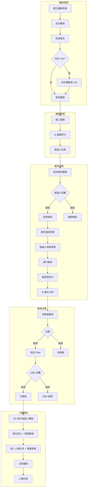

## 附錄二：狀態對照快速參考表

### 職缺狀態

| 狀態 | 代碼 | 可執行操作 |
|------|------|------------|
| 草稿 | draft | 編輯、刪除、送審 |
| 審核中 | review | 核准、退回 |
| 刊登中 | published | 編輯、關閉 |
| 已關閉 | closed | 重新開啟 |

### 候選人狀態

| 狀態 | 代碼 | 下一步操作 |
|------|------|------------|
| 新進履歷 | new | 邀請面試/不邀請 |
| 已邀請 | invited | 等待回覆 |
| *(待安排)* | *(invited + Confirmed 邀請)* | 安排面試（邏輯狀態，非獨立候選人狀態） |
| 已安排面試 | interview | 進行面試 |
| 待 AI 分析 | pending_ai | 等待分析 |
| 待決策 | pending_decision | 決策 |
| 待回覆 Offer | offered | 等待回覆 |
| 已錄取同意 | offer_accepted | HR 執行候選人轉換 |
| 已報到 | onboarded | 候選人已轉為員工 |

### 員工入職狀態

| 狀態 | 代碼 | 說明 |
|------|------|------|
| 入職待處理 | pending | 帳號已建立，文件和表單尚未處理 |
| 入職進行中 | in_progress | 正在上傳文件或簽署表單 |
| 入職已完成 | completed | 所有必填項目都已完成且核准 |

### 員工狀態

| 狀態 | 代碼 | 說明 |
|------|------|------|
| 試用中 | probation | 入職後預設狀態，試用期間 |
| 正式 | active | 試用期結束，HR 手動轉正 |

## 附錄三：AI 分數解讀指引

| 分數 | 錄用建議 | 建議行動 |
|------|----------|----------|
| 85-100 | 強烈推薦 | 優先安排面試或錄用 |
| 70-84 | 推薦 | 正常流程評估 |
| 55-69 | 待觀察 | 深入面試或列入人才庫 |
| 0-54 | 不建議 | 謹慎評估是否繼續 |

## 附錄四：入職報到 API 端點參考

| 功能 | 方法 | 端點 | 說明 |
|------|------|------|------|
| 待轉換清單 | GET | `/api/hr/onboarding/pending-conversions` | 列出所有已接受 Offer 的候選人 |
| 執行轉換 | POST | `/api/hr/onboarding/convert-candidate` | 候選人轉員工（含帳號建立） |
| 進行中清單 | GET | `/api/hr/onboarding/in-progress` | 列出所有入職進行中的員工 |
| 個別進度 | GET | `/api/hr/onboarding/progress/:employeeId` | 查看特定員工入職進度明細 |
| 上傳文件 | POST | `/api/employee/documents` | 新人上傳入職文件 |
| 文件進度 | GET | `/api/employee/documents/progress` | 查看文件上傳進度 |
| 下載文件 | GET | `/api/employee/documents/:id/download` | 下載已上傳的文件 |
| 表單簽署頁 | GET | `/api/onboarding/sign/:token` | 取得表單內容（Token 存取） |
| 送出簽署 | POST | `/api/onboarding/sign/:token/submit` | 新人填寫並簽署表單 |
| 待審核清單 | GET | `/api/manager/approvals` | 主管查看待審核的簽署文件 |
| 核准簽署 | POST | `/api/manager/approvals/:id/approve` | 主管核准 |
| 退回簽署 | POST | `/api/manager/approvals/:id/reject` | 主管退回（需填理由） |
| 單一提交詳情 | GET | `/api/manager/approvals/:id` | 取得待審核提交的完整資訊（用於預覽） |
| 簽核統計 | GET | `/api/manager/approvals/stats/summary` | 獲取簽核統計摘要（待審核/已核准/已退回數量） |
| 建立簽署連結 | POST | `/api/onboarding/sign/create` | HR 建立員工簽署連結（已有連結則返回現有） |
| 提交記錄清單 | GET | `/api/onboarding/sign/submissions/:templateId` | 取得特定模板的所有提交記錄 |
| 下一個員工編號 | GET | `/api/hr/onboarding/next-employee-no` | 預覽下一個自動生成的員工編號 |
| 部門列表 | GET | `/api/hr/onboarding/departments` | 獲取部門列表（用於下拉選單） |
| 職等列表 | GET | `/api/hr/onboarding/grades` | 獲取職等列表 |
| 職級薪資 | GET | `/api/hr/onboarding/salary-levels` | 獲取職級薪資列表（支援按組織隔離） |
| 職位列表 | GET | `/api/hr/onboarding/positions` | 獲取職位列表（可依部門/職等篩選） |
| 主管列表 | GET | `/api/hr/onboarding/managers` | 獲取可選的主管列表 |

## 附錄五：AI 功能缺口對照表

| 功能項目 | 目前狀態 | 實作方式 | 缺口說明 |
|----------|---------|----------|----------|
| 關鍵字匹配 | 已實作 | 規則引擎 | 無法理解同義詞和語意關聯 |
| 語意分析 | 基礎版 | 短語規則 | 無法理解完整句意和上下文 |
| JD 適配度 | 已實作 | 字串比對 | 無法識別技能之間的關聯性 |
| 履歷解析 | 未實作 | — | 需要整合文件解析 AI 服務 |
| 語音轉文字 | 未實作 | — | 需要整合 ASR 服務 |
| 情緒分析 | 未實作 | — | 需要整合情緒分析模型 |
| 智能推薦 | 基礎版 | 字串比對 | 需要向量嵌入與相似度計算 |
| 問題生成 | 未實作 | — | 需要整合 LLM 服務 |
| 數據預測 | 未實作 | — | 需要累積資料並建立 ML 模型 |

## 附錄六：關鍵資料庫結構補充

> 以下為驗證後發現原附錄未涵蓋的重要資料結構。完整欄位定義請參照 `tenant-schema.js`。

**interviews 表補充欄位**

| 欄位 | 類型 | 說明 |
|------|------|------|
| address | TEXT | 面試地點地址（補充 location 欄位） |
| cancel_token | TEXT UNIQUE | 面試取消令牌（供公開取消連結使用） |
| cancelled_at | TEXT | 面試取消時間 |
| cancel_reason | TEXT | 取消原因說明 |

**interview_evaluations 表補充欄位**

| 欄位 | 類型 | 說明 |
|------|------|------|
| scoring_items | TEXT | 評分項目細節（JSON 格式） |
| process_checklist | TEXT | 流程檢查清單（JSON 格式） |
| comprehensive_assessment | TEXT | 綜合評估意見 |
| pros_comment | TEXT | 優點評論 |
| cons_comment | TEXT | 缺點評論 |
| recommendation | TEXT | 最終建議 |

**talent_pool 表補充欄位**

| 欄位 | 類型 | 說明 |
|------|------|------|
| contact_reminder_enabled | INTEGER | 是否啟用聯繫提醒（0/1） |
| contact_reminder_date | TEXT | 下次提醒日期 |

**未記載的關鍵表格**

| 表名 | 說明 |
|------|------|
| candidate_resume_analysis | AI 履歷分析結果（含 overall_match_score、extracted_tech_skills 等 29 欄位） |
| candidate_interview_forms | 候選人面試表單（含 form_token、form_data、submitted_at、current_step 等 11 欄位） |
| talent_job_matches | 人才庫與職缺匹配度分析（含 match_score、match_details 等 8 欄位） |
| jobs | 職缺管理主表（11 欄位，含 title、department、status、org_unit_id 等） |

---

## 文件結束

如有操作問題，請聯繫系統管理員或參閱線上說明。
