# Bombus 人力資源管理系統
# 功能說明書：組織架構管理、使用者帳號管理、角色權限管理與平台管理

---

## 文件資訊

| 項目 | 內容 |
|------|------|
| 文件名稱 | 功能說明書：組織架構管理、使用者帳號管理、角色權限管理與平台管理 |
| 適用模組 | 系統設定（SYS）+ 平台管理（Platform）：組織架構、使用者、角色權限、審計日誌、租戶管理、方案管理 |
| 適用對象 | 平台管理員（Platform Admin）、系統管理員（super_admin）、子公司管理員（subsidiary_admin） |
| 文件版本 | v1.0 |

---

## 目錄

1. [文件目的與適用範圍](#一文件目的與適用範圍)
2. [系統導覽與入口說明](#二系統導覽與入口說明)
3. [角色權責說明](#三角色權責說明)
4. [第一部分：組織架構管理](#第一部分組織架構管理)
5. [第二部分：使用者帳號管理](#第二部分使用者帳號管理)
6. [第三部分：角色權限管理](#第三部分角色權限管理)
7. [第四部分：審計日誌](#第四部分審計日誌)
8. [第五部分：認證與安全機制](#第五部分認證與安全機制)
9. [第六部分：AI 服務功能缺口分析](#第六部分ai-服務功能缺口分析)
10. [第七部分：平台管理](#第七部分平台管理)
11. [附錄](#附錄)

---

## 一、文件目的與適用範圍

### 1.1 文件目的

本說明書詳細描述 Bombus 人力資源管理系統中**系統設定模組**與**平台管理模組**的功能：

**系統設定（租戶內管理）**

1. **組織架構管理**：建立與維護企業的集團 → 子公司 → 部門三級組織樹，支援視覺化畫布與列表雙模式
2. **使用者帳號管理**：管理系統登入帳號的建立、狀態控制與員工關聯
3. **角色權限管理**：定義角色、設定功能權限矩陣，並將角色指派給使用者
4. **審計日誌**：追蹤系統中所有安全相關操作的歷史記錄

**平台管理（跨租戶管理）**

5. **租戶管理**：建立、暫停、恢復、刪除租戶，管理租戶管理員帳號
6. **訂閱方案管理**：定義訂閱方案的功能模組、使用者上限與費用
7. **平台審計日誌**：追蹤跨租戶的平台級操作記錄

### 1.2 適用範圍

- **適用角色**：具有 `super_admin` 或 `subsidiary_admin` 角色的管理人員
- **適用情境**：企業初始建置、組織異動（合併/拆分）、人員帳號管理、權限調整、安全稽核
- **多租戶架構**：本系統採用 Database-per-Tenant 架構，每個租戶擁有獨立資料庫，組織架構與權限設定完全隔離

---

## 二、系統導覽與入口說明

### 2.1 主要功能入口

| 功能模組 | 導覽路徑 | 路由 | 說明 |
|----------|----------|------|------|
| 組織架構管理 | 系統設定 → 租戶管理 → 組織架構管理 | `/settings/org-structure` | 管理集團、子公司、部門的層級關係 |
| 使用者管理 | 系統設定 → 租戶管理 → 使用者管理 | `/settings/users` | 管理系統帳號、指派角色 |
| 角色權限管理 | 系統設定 → 租戶管理 → 角色管理 | `/settings/roles` | 定義角色、設定功能權限 |
| 審計日誌 | 系統設定 → 租戶管理 → 審計日誌 | `/settings/audit` | 查看系統操作歷史 |
| 租戶管理 | 平台管理 → 租戶管理 | `/platform/tenants` | 建立與管理租戶（僅平台管理員） |
| 方案管理 | 平台管理 → 方案管理 | `/platform/plans` | 定義訂閱方案與功能授權（僅平台管理員） |
| 平台審計日誌 | 平台管理 → 審計日誌 | `/platform/audit` | 查看跨租戶操作記錄（僅平台管理員） |

> **白話說明**：前四個功能在側邊欄的「系統設定」區域下，只有租戶管理員能看到，就像公司的 IT 管理後台。後三個功能在「平台管理」區域下，只有平台管理員（SaaS 營運者）能看到，就像管理所有公司帳戶的「總控台」。

### 2.2 頁面功能架構

```
系統設定（SYS）— 租戶管理員可見
├── 組織架構管理
│   ├── [畫布模式] 視覺化組織圖
│   │   ├── 統計卡片（公司數/部門數/員工數/協作關係數）
│   │   ├── 編輯模式（拖曳/對齊/撤銷重做）
│   │   ├── 協作關係線（平行協作/下游流程）
│   │   └── 匯出 PNG
│   ├── [列表模式] 階層樹狀表格
│   │   ├── 節點 CRUD 操作
│   │   └── 協作關係表
│   ├── 公司管理（新增/編輯/刪除）
│   │   └── 基本資訊 + 聯絡資訊 + 詳細資訊
│   └── 部門管理（新增/編輯/刪除）
│       └── 基本資訊 + 負責任務 + KPI + 職能框架 + 職務配置 + 協作關係
├── 使用者管理
│   ├── 使用者清單（姓名/郵件/狀態/角色/建立時間）
│   ├── 新增使用者（姓名/郵件/密碼/關聯員工）
│   └── 角色管理（指派/撤銷角色 + 功能權限預覽）
├── 角色權限管理
│   ├── 角色清單（卡片式，含使用者計數）
│   ├── 新增/編輯角色
│   ├── 功能權限矩陣（操作等級 × 資料範圍）
│   └── 角色使用者列表
└── 審計日誌
    ├── 篩選（動作類型/日期區間）
    └── 日誌清單（時間/動作/資源/使用者/IP/詳情）

平台管理（Platform）— 僅平台管理員可見
├── 平台總覽 → 租戶管理
├── 租戶管理
│   ├── 統計卡片（總租戶數/啟用中/已暫停）
│   ├── 狀態篩選（全部/啟用中/已暫停/已刪除）+ 搜尋
│   ├── 租戶清單（名稱/代碼/產業別/方案/狀態/建立時間/操作）
│   ├── 新增租戶（名稱/代碼/Logo/產業別/方案/管理員帳號）
│   ├── 編輯租戶（基本資訊 + 管理員帳號管理）
│   └── 狀態操作（暫停/恢復/軟刪除/永久刪除）
├── 方案管理
│   ├── 方案卡片（名稱/狀態/月年費/上限/功能模組）
│   ├── 新增方案（名稱/月年費/使用者上限/儲存空間/啟用狀態）
│   └── 功能模組勾選（L1~L6 模組 × 子功能，三態 checkbox）
└── 審計日誌
    ├── 篩選（動作類型/租戶 ID/日期區間）
    └── 日誌清單（時間/動作/資源/租戶/使用者/IP/詳情）
```

---

## 三、角色權責說明

### 3.1 管理層級

本系統的權限管理分為**三個層級**：

| 層級 | 角色 | 可管理範圍 | 說明 |
|------|------|-----------|------|
| 平台層 | 平台管理員 | 所有租戶 | 獨立於租戶體系之外，管理租戶的建立與訂閱 |
| 全域層 | super_admin | 整個租戶 | 租戶內的最高管理者，可管理所有功能與帳號 |
| 子公司層 | subsidiary_admin | 特定子公司 | 管理該子公司及其下部門的使用者與設定 |

> **白話說明**：就像連鎖企業的管理結構——總公司有個「平台管理員」管理所有分公司帳戶；每個分公司內有個「超級管理員」管理公司內部一切；各地區經理（子公司管理員）只管自己那一塊。

### 3.2 系統預設角色

系統初始化時自動建立 5 個**系統角色**（標記為「系統角色」，不可刪除）：

| 角色名稱 | 中文說明 | 作用範圍 | 核心權限 |
|----------|----------|----------|----------|
| super_admin | 超級管理員 | 全域（global） | 全部功能的編輯權限 + 全公司資料範圍 |
| subsidiary_admin | 子公司管理員 | 子公司（subsidiary） | 大部分功能的編輯權限（排除使用者/角色管理的寫入） |
| hr_manager | 人資管理員 | 全域（global） | HR 相關功能全部權限 + 組織管理 |
| dept_manager | 部門主管 | 部門（department） | 部門級管理權限（員工、評核、週報等） |
| employee | 一般員工 | 部門（department） | 唯讀權限 + 自身週報/提交 |

---

## 第一部分：組織架構管理

### 1.1 功能總覽

組織架構管理提供**雙模式展示**，讓管理者以最直覺的方式建立與維護企業組織樹：

| 模式 | 特點 | 適用場景 |
|------|------|----------|
| 畫布模式 | 視覺化拖曳、自動佈局、協作線繪製 | 簡報展示、調整佈局、理解全貌 |
| 列表模式 | 階層樹狀表格、快速 CRUD | 批量管理、快速查看資料 |

### 1.2 組織節點類型

系統支援三種組織節點，形成三級架構：

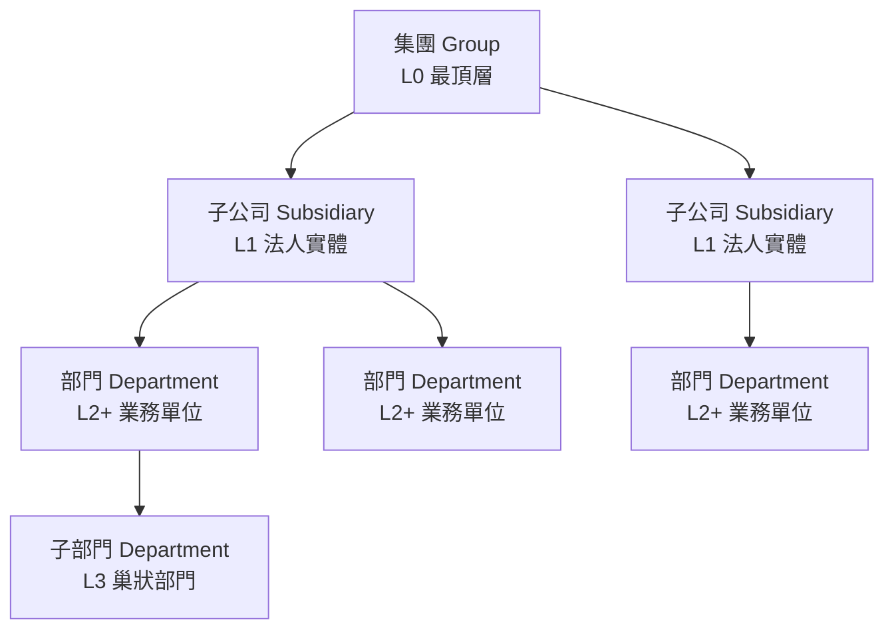

| 節點類型 | 說明 | 畫布尺寸 | 可包含 |
|----------|------|----------|--------|
| 集團（Group） | 企業最頂層組織 | 240×160px | 子公司 |
| 子公司（Subsidiary） | 具法人地位的子公司 | 240×120px | 部門 |
| 部門（Department） | 業務執行單位 | 200×90px | 子部門 |

> **白話說明**：組織架構就像一棵倒過來的樹——最上面是集團（樹根），往下分出各子公司（粗枝），再分出各部門（細枝）。部門底下還可以再分子部門。

### 1.3 畫布模式功能

#### 統計卡片

頁面頂部顯示 4 張即時統計卡片：

| 卡片 | 圖示 | 說明 |
|------|------|------|
| 公司數 | ri-building-4-line | 集團 + 子公司數量合計 |
| 部門數 | ri-organization-chart | 所有部門（含子部門）數量 |
| 員工總數 | ri-team-line | 全組織在職員工合計 |
| 協作關係 | ri-links-line | 部門間協作關係數量 |

#### 工具列功能

| 功能 | 操作 | 說明 |
|------|------|------|
| 視圖切換 | 畫布 / 列表 | 切換兩種顯示模式 |
| 編輯模式 | 編輯佈局 / 完成編輯 | 開啟拖曳、對齊等佈局功能 |
| 協作線顯示 | 開/關 | 顯示或隱藏部門間的協作關係虛線 |
| 網格吸附 | 開/關 | 拖曳節點時自動對齊網格 |
| 縮放控制 | 縮小 / 放大 / 重置 | 範圍 30%～200% |
| 匯出 PNG | 按鈕 | 將目前畫布匯出為 PNG 圖片 |
| 新增節點 | 按鈕 | 開啟新增公司表單 |

#### 編輯模式工具

進入編輯模式後，上方出現專用工具列：

| 分類 | 功能 | 快捷鍵 |
|------|------|--------|
| 選取 | 全選 / 取消選取 | Ctrl/Cmd + 點擊多選 |
| 對齊 | 靠左 / 水平置中 / 靠右 / 靠上 / 垂直置中 / 靠下 | — |
| 分布 | 水平等距 / 垂直等距 | — |
| 歷史 | 還原 / 重做 | Ctrl+Z / Ctrl+Y |
| 佈局 | 自動整理 | — |

> **白話說明**：編輯模式就像 PowerPoint 裡排版——可以拖曳方塊、多選後對齊、做完不滿意還能 Ctrl+Z 撤銷。

#### 協作關係

部門之間除了隸屬（上下級）關係外，還可以定義兩種**協作關係**：

| 關係類型 | 線型 | 色彩 | 說明 |
|----------|------|------|------|
| 平行協作（parallel） | 虛線 | 藍色系 | 同級或跨級別的雙向協作 |
| 下游流程（downstream） | 虛線 | 橘色系 | 單向的下游依賴流程 |

協作線支援**錨點調整**：點擊協作線後，可拖曳起止點到卡片的上/下/左/右四個邊緣。

### 1.4 列表模式功能

#### 組織樹狀表格

| 欄位 | 說明 |
|------|------|
| 名稱 | 縮進樹狀結構，支援展開/收合 |
| 類型 | 節點類型徽章（集團/子公司/部門） |
| 狀態 | 營運狀態（僅公司節點：營運中/已停止） |
| 主管 | 部門主管名稱 |
| 員工數 | 該節點下的員工人數 |
| 部門數 | 該節點下的部門數（僅公司節點） |
| 操作 | 檢視 / 編輯 / 新增子項 / 刪除 |

### 1.5 公司管理

#### 新增/編輯公司欄位規格

| 區段 | 欄位 | 類型 | 必填 | 說明 |
|------|------|------|------|------|
| 基本資訊 | 公司名稱 | 文字 | ✓ | 公司全名 |
| 基本資訊 | 公司代碼 | 文字 | — | 內部識別碼 |
| 基本資訊 | 類型 | 下拉選單 | ✓ | 集團 / 子公司 |
| 基本資訊 | 上級單位 | 下拉選單 | — | 選擇隸屬的上級組織 |
| 聯絡資訊 | 地址 | 文字 | — | 公司地址 |
| 聯絡資訊 | 電話 | 文字 | — | 公司電話 |
| 聯絡資訊 | Email | 文字 | — | 公司聯絡信箱 |
| 詳細資訊 | 統一編號 | 文字 | — | 稅務識別號碼 |
| 詳細資訊 | 成立日期 | 日期 | — | 公司成立日期 |
| 詳細資訊 | 營運狀態 | 下拉選單 | — | 營運中 / 已停止 |
| 詳細資訊 | 公司簡介 | 多行文字 | — | 公司描述 |

#### 刪除公司檢查

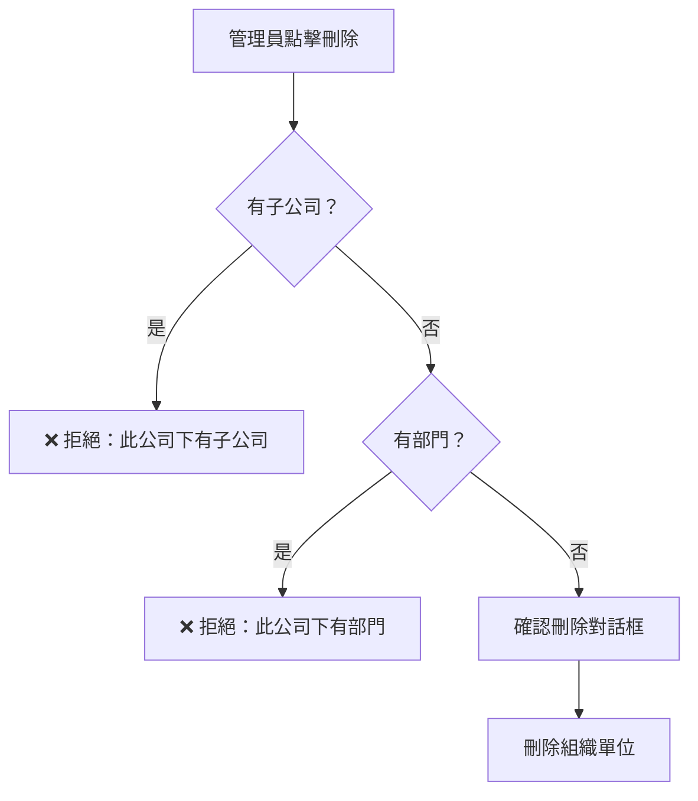

> **白話說明**：要刪除一家子公司前，必須先把底下的部門和子公司全部搬走或刪除，就像拆房子前要先搬家具。

### 1.6 部門管理

#### 新增/編輯部門欄位規格

| 區段 | 欄位 | 類型 | 必填 | 說明 |
|------|------|------|------|------|
| 基本資訊 | 部門名稱 | 文字 | ✓ | 部門全名 |
| 基本資訊 | 部門代碼 | 文字 | — | 內部識別碼 |
| 基本資訊 | 部門主管 | 下拉選單 | — | 選擇員工作為主管 |
| 基本資訊 | 上級單位 | 下拉選單 | — | 隸屬的上級組織 |
| 負責任務 | 任務清單 | 動態列表 | — | 可新增/刪除多筆任務描述 |
| KPI 事項 | KPI 清單 | 動態列表 | — | 可新增/刪除多筆 KPI 指標 |
| 職能框架分類 | 分類與職務 | 巢狀結構 | — | 分類名稱 + 多筆職務（名稱/說明） |
| 職務配置 | 對照表 | 唯讀表格 | — | 顯示職等矩陣中的部門職位配置 |
| 協作關係 | 關係清單 | 表格 | — | 顯示與其他部門的協作關係 |

#### 刪除部門檢查

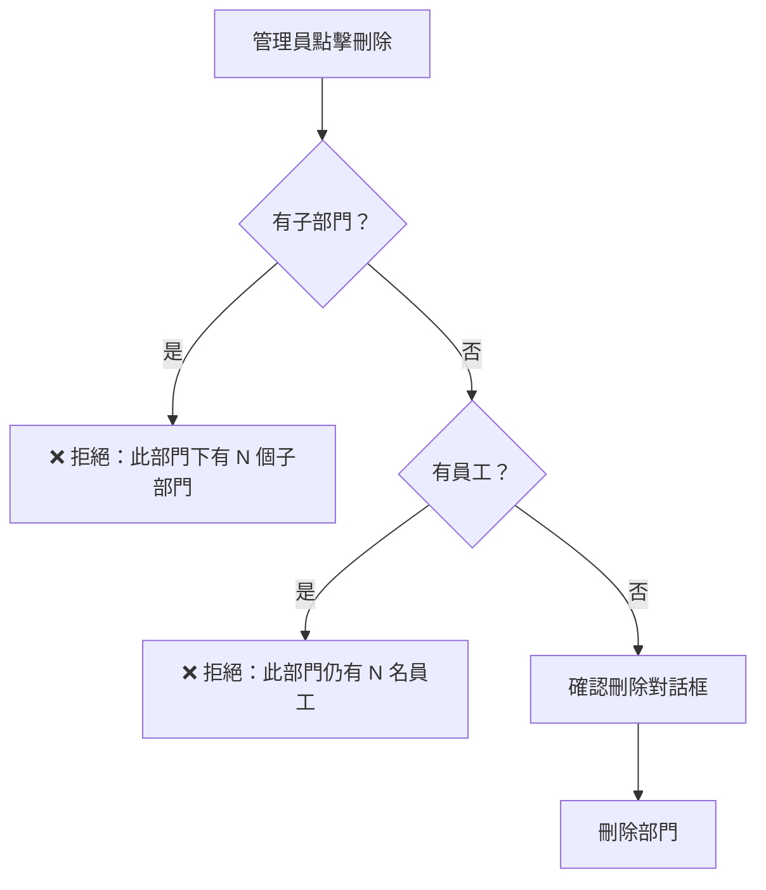

### 1.7 協作關係管理

#### 新增/編輯協作關係欄位

| 欄位 | 類型 | 必填 | 說明 |
|------|------|------|------|
| 來源部門 | 下拉選單 | ✓ | 協作的發起方 |
| 目標部門 | 下拉選單 | ✓ | 協作的接收方 |
| 關係類型 | 下拉選單 | ✓ | 平行協作 / 下游流程 |
| 說明 | 多行文字 | — | 協作內容描述 |

---

## 第二部分：使用者帳號管理

### 2.1 功能總覽

使用者帳號管理讓管理員建立系統登入帳號，並將帳號與角色、員工檔案關聯起來。

> **白話說明**：員工檔案（在 L1 員工管理中建立）和登入帳號是兩回事——不是每個員工都需要系統帳號。這個頁面管理的是「誰可以登入系統」以及「登入後能做什麼」。

### 2.2 使用者清單

主頁面以表格形式展示所有使用者：

| 表格欄位 | 說明 |
|----------|------|
| 使用者 | 頭像（首字） + 姓名 |
| 電子郵件 | 帳號登入信箱 |
| 狀態 | 啟用（active）/ 停用（inactive）/ 鎖定（locked） |
| 角色 | 已指派的角色標籤，多個以逗號分隔；無角色顯示「無角色」 |
| 建立時間 | 帳號建立日期 |
| 操作 | 「角色管理」按鈕 |

### 2.3 使用者狀態

| 狀態 | 顯示文字 | 說明 |
|------|----------|------|
| active | 啟用 | 正常使用中的帳號 |
| inactive | 停用 | 已停用，無法登入 |
| locked | 鎖定 | 帳號被鎖定，需管理員解鎖 |

### 2.4 新增使用者

#### 操作流程

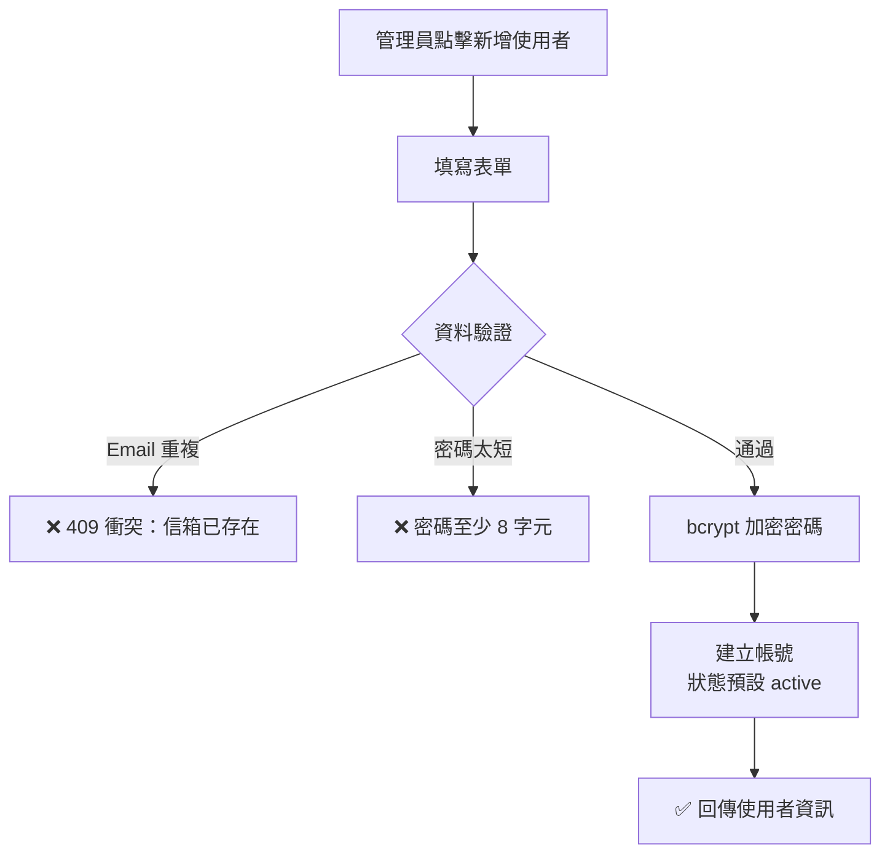

#### 表單欄位

| 欄位 | 類型 | 必填 | 範例/提示 |
|------|------|------|-----------|
| 姓名 | 文字 | ✓ | 例：王大明 |
| 電子郵件 | 文字 | ✓ | 例：user@company.com |
| 初始密碼 | 密碼 | ✓ | 至少 6 個字元 |
| 關聯員工 ID | 文字 | — | 若從員工建立帳號，可輸入員工 ID |

> **白話說明**：建立帳號時可以選擇關聯到一位已建檔的員工。這樣登入後系統就知道「這個帳號背後是哪位員工」，可以顯示對應的個人資料。

### 2.5 角色管理（指派與撤銷）

點擊使用者列表的「角色管理」按鈕，開啟角色管理模態對話框：

#### 目前角色區段

顯示該使用者已指派的所有角色，每個角色可：
- **查看權限 / 收起權限**：展開該角色的功能權限明細表
- **移除角色**：撤銷該角色的指派

#### 指派新角色區段

| 欄位 | 類型 | 必填 | 選項 |
|------|------|------|------|
| 角色 | 下拉選單 | ✓ | 系統角色 + 自訂角色 |
| 作用範圍 | 下拉選單 | ✓ | 全域 / 子公司 / 部門 |
| 範圍對象 | 下拉選單 | 條件 | 當作用範圍不是「全域」時，選擇具體的子公司或部門 |

選擇角色後，下方自動顯示**功能權限預覽**，讓管理員在指派前預覽該角色的權限。

#### 有效權限（合併後）

頁面底部有**可摺疊的「有效權限（合併後）」區段**，展示該使用者所有角色合併計算後的最終權限。

> **白話說明**：一個使用者可以有多個角色（例如同時是「部門主管」和「HR 助理」），系統會自動取各角色中最高的權限作為最終結果。

---

## 第三部分：角色權限管理

### 3.1 功能總覽

#### 什麼是權限管理？

想像公司是一棟大樓：

- **大門鑰匙**（登入帳號）讓你進入大樓
- **樓層門禁卡**（權限）決定你能去哪些樓層、進哪些房間
- **權限等級**決定你到了那個房間之後，只能「看」還是能「動手改」

**權限管理**就是幫公司每位同仁配發正確的門禁卡，確保：

- **看得到該看的** — HR 主管能查閱全公司員工資料
- **改得到該改的** — 部門經理只能編輯自己部門的資料
- **碰不到不該碰的** — 一般員工看不到薪資矩陣的編輯功能

> **一句話總結**：權限管理 = 「誰」可以對「哪些功能」做「什麼程度的操作」，看到「多大範圍的資料」。

#### 三層架構一次搞懂

Bombus 的權限系統由三層組成，就像疊積木一樣：

```
┌──────────────────────────────────────────┐
│  第一層：角色 (Role)                       │
│  → 組織裡的「職務模板」                      │
│  → 例如：HR 經理、部門主管、一般員工           │
├──────────────────────────────────────────┤
│  第二層：功能權限 (Feature Permission)       │
│  → 每個角色可以操作哪些功能、到什麼程度         │
│  → 例如：員工檔案「可編輯」，招募職缺「僅查看」   │
├──────────────────────────────────────────┤
│  第三層：使用者指派 (User Assignment)        │
│  → 把角色分配給真實的人                       │
│  → 例如：王小明 → HR 經理                    │
└──────────────────────────────────────────┘
```

**操作順序建議**：

```
步驟 1：建立角色       →  步驟 2：設定功能權限  →  步驟 3：指派給使用者
（建立職務模板）          （配置門禁卡）           （發卡給員工）
```

#### 技術架構

角色權限管理採用**功能權限矩陣（Feature-Based Permission）**模型：

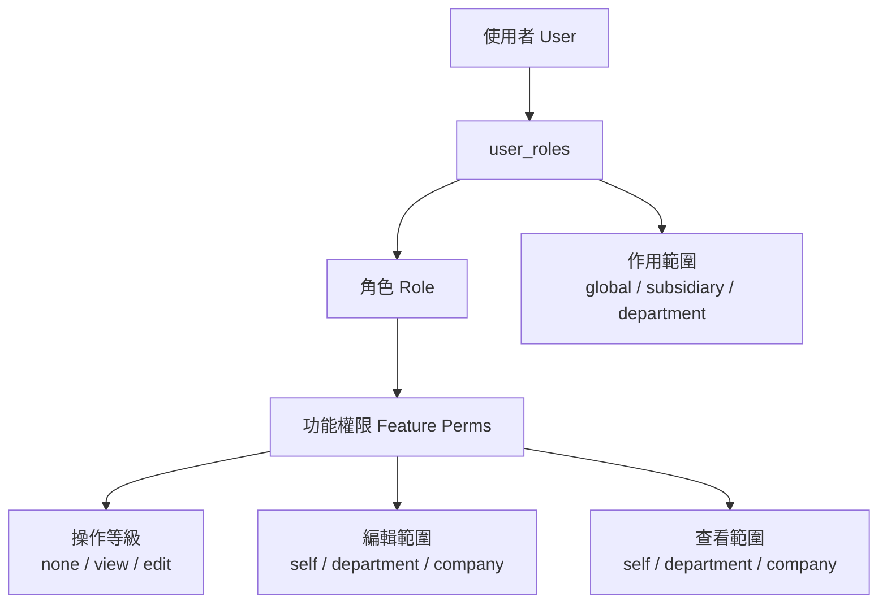

### 3.2 角色清單

角色以**卡片式佈局**展示，每張卡片包含：

| 項目 | 說明 |
|------|------|
| 角色名稱 | 角色標題 |
| 角色說明 | 描述文字 |
| 系統角色標籤 | 系統角色顯示「系統角色」徽章，不可刪除 |
| 已指派使用者數 | 「已指派 N 位使用者」（可點擊查看名單） |

#### 角色操作按鈕

| 按鈕 | 說明 | 限制 |
|------|------|------|
| 檢視功能權限 | 唯讀查看該角色的權限矩陣 | — |
| 編輯功能權限 | 開啟權限矩陣編輯介面 | — |
| 編輯角色 | 修改角色名稱與說明 | — |
| 刪除 | 刪除自訂角色 | 僅限非系統角色且無使用者指派 |

### 3.3 新增/編輯角色

| 欄位 | 類型 | 必填 | 說明 |
|------|------|------|------|
| 角色名稱 | 文字 | ✓ | 例：HR 經理 |
| 說明 | 文字 | — | 角色說明（選填） |

> 功能權限請於角色建立後，透過「編輯功能權限」設定。

### 3.4 功能權限矩陣

這是角色權限管理的核心介面。以表格形式呈現，按模組分組，每個功能需設定**兩個維度**：

#### 維度一：操作等級 — 能做什麼？

| 等級 | 圖示 | 說明 | 類比 |
|------|------|------|------|
| 無權限（none） | 🚫 | 完全看不到這個功能 | 這層樓你進不去 |
| 僅查看（view） | 👁️ | 只能看，不能新增/修改/刪除 | 可以透過玻璃看，但門鎖著 |
| 可編輯（edit） | ✏️ | 完整的讀寫權限 | 有鑰匙可以自由進出 |

#### 維度二：資料範圍 — 能看/改多大範圍？

| 範圍 | 說明 | 類比 |
|------|------|------|
| 個人（self） | 只能存取自己的資料 | 只能進自己的辦公室 |
| 部門（department） | 可存取所屬部門的所有資料 | 能進整個部門區域 |
| 全公司（company） | 可存取整個租戶的所有資料 | 能進大樓所有房間 |

#### 重要規則：查看範圍 ≥ 編輯範圍

系統會自動確保「你能看到的範圍」不小於「你能編輯的範圍」。

> **為什麼？** 想像一位部門主管可以編輯部門內的員工資料，那他至少也要能看到這些資料吧！如果他的查看範圍只有「個人」，那他連要編輯誰都不知道。

| 設定 | 是否合理？ | 說明 |
|------|----------|------|
| 編輯：部門、查看：全公司 | ✅ 合理 | 能看全公司，但只能改自己部門 |
| 編輯：個人、查看：部門 | ✅ 合理 | 能看部門資料，但只能改自己的 |
| 編輯：全公司、查看：部門 | ❌ 不允許 | 能改全公司但只看得到部門？矛盾！ |

#### 操作技巧

- 選擇「**無權限**」時，編輯範圍和查看範圍會自動隱藏（顯示 —）
- 選擇「**僅查看**」時，只需設定「查看範圍」，編輯範圍會自動隱藏
- 選擇「**可編輯**」時，需要設定「編輯範圍」和「查看範圍」兩項
- 當你調整編輯範圍時，如果查看範圍小於編輯範圍，系統會**自動擴大查看範圍**

#### 情境：如何設定角色的功能權限？

> **場景**：剛建立的「訓練專員」角色，需要設定他能使用哪些功能。

**操作步驟**：

1. 在角色卡片上點擊「**編輯功能權限**」
2. 系統會展開一個權限矩陣表，包含所有功能模組：

```
┌─────────────────────────────────────────────────────┐
│ 功能名稱          │ 操作等級  │ 編輯範圍  │ 查看範圍  │
├─────────────────────────────────────────────────────┤
│ ▼ L1 員工管理                                        │
│   招募職缺管理      │ 僅查看 ▼  │    —     │ 全公司 ▼  │
│   員工檔案管理      │ 僅查看 ▼  │    —     │ 部門   ▼  │
│   人才庫管理        │ 無權限 ▼  │    —     │    —     │
│   ...                                                │
├─────────────────────────────────────────────────────┤
│ ▼ L2 職能管理                                        │
│   職等職級矩陣      │ 僅查看 ▼  │    —     │ 全公司 ▼  │
│   ...                                                │
├─────────────────────────────────────────────────────┤
│ ▼ 系統管理                                           │
│   組織架構管理      │ 無權限 ▼  │    —     │    —     │
│   ...                                                │
└─────────────────────────────────────────────────────┘
```

3. 逐一調整每個功能的操作等級與範圍
4. 點擊「**儲存功能權限**」

#### 功能清單（35 個功能，依模組分組）

| 模組 | 功能 ID | 功能名稱 |
|------|---------|----------|
| L1 員工管理 | L1.jobs | 招募職缺管理 |
| L1 員工管理 | L1.recruitment | AI 智能面試 |
| L1 員工管理 | L1.talent-pool | 人才庫 |
| L1 員工管理 | L1.profile | 員工檔案管理 |
| L1 員工管理 | L1.meetings | 會議管理 |
| L1 員工管理 | L1.onboarding | 入職管理 |
| L2 職能管理 | L2.grade-matrix | 職等職級 |
| L2 職能管理 | L2.framework | 職能模型 |
| L2 職能管理 | L2.job-description | 職務說明書 |
| L2 職能管理 | L2.assessment | 職能評估 |
| L2 職能管理 | L2.gap-analysis | 落差分析 |
| L3 教育訓練 | L3.course-management | 課程管理 |
| L3 教育訓練 | L3.learning-map | 學習地圖 |
| L3 教育訓練 | L3.effectiveness | 成效追蹤 |
| L3 教育訓練 | L3.heatmap | 職能熱力圖 |
| L3 教育訓練 | L3.nine-box | 九宮格 |
| L3 教育訓練 | L3.learning-path | 學習路徑 |
| L3 教育訓練 | L3.talent-dashboard | 人才儀表板 |
| L4 專案管理 | L4.list | 專案列表 |
| L4 專案管理 | L4.project-pnl | 損益預測 |
| L4 專案管理 | L4.forecast | Forecast |
| L4 專案管理 | L4.reports | 報表 |
| L5 績效管理 | L5.profit-dashboard | 毛利儀表板 |
| L5 績效管理 | L5.bonus-distribution | 獎金分配 |
| L5 績效管理 | L5.goal-task | 目標與任務 |
| L5 績效管理 | L5.profit-settings | 毛利參數設定 |
| L5 績效管理 | L5.review | 績效考核 |
| L5 績效管理 | L5.360-feedback | 360 度回饋 |
| L6 文化管理 | L6.handbook | 企業文化手冊 |
| L6 文化管理 | L6.eap | EAP 員工協助 |
| L6 文化管理 | L6.awards | 獎項資料庫 |
| L6 文化管理 | L6.documents | 文件儲存庫 |
| L6 文化管理 | L6.ai-assistant | AI 申請助理 |
| L6 文化管理 | L6.analysis | 智慧文件分析 |
| L6 文化管理 | L6.impact | 影響力評估 |
| SYS 系統管理 | SYS.org-structure | 組織架構管理 |
| SYS 系統管理 | SYS.user-management | 使用者管理 |
| SYS 系統管理 | SYS.role-management | 角色管理 |
| SYS 系統管理 | SYS.audit | 審計日誌 |

### 3.5 權限合併策略

當使用者擁有多個角色時，系統自動合併所有角色的權限，採用**寬鬆合併（取最高權限）**策略：

> **類比**：你同時拿著兩張門禁卡，系統會把兩張卡能進的房間都打開給你。

**等級排序（由低到高）**：

| 項目 | 排序 |
|------|------|
| 操作等級 | 無權限 < 僅查看 < 可編輯 |
| 資料範圍 | 個人 < 部門 < 全公司 |

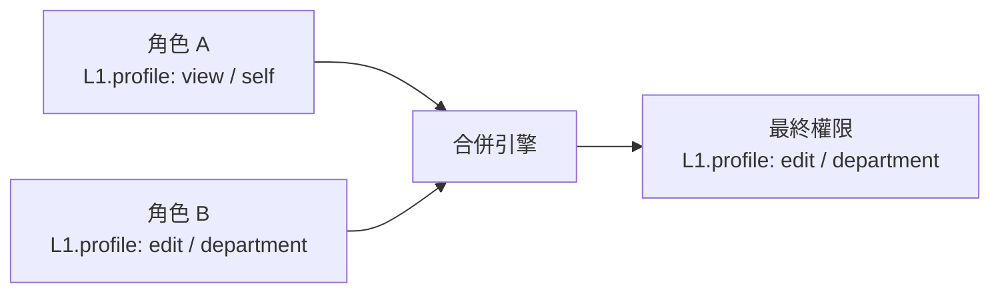

#### 合併範例一

> **場景**：陳經理同時擁有「部門主管」和「HR 經理」兩個角色。

**部門主管**對「員工檔案管理」的權限：
- 操作等級：可編輯
- 編輯範圍：個人（只能改自己的檔案）
- 查看範圍：部門（能看部門內所有人）

**HR 經理**對「員工檔案管理」的權限：
- 操作等級：可編輯
- 編輯範圍：全公司
- 查看範圍：全公司

**合併後的有效權限**：
- 操作等級：**可編輯**（兩個都是可編輯，取最高）
- 編輯範圍：**全公司**（全公司 > 個人，取最廣）
- 查看範圍：**全公司**（全公司 > 部門，取最廣）

#### 合併範例二

> **場景**：李專員有「一般員工」和「訓練專員」兩個角色。

**一般員工**對「會議管理」的權限：
- 操作等級：可編輯（編輯：個人、查看：全公司）

**訓練專員**對「會議管理」的權限：
- 操作等級：僅查看（查看：部門）

**合併結果**：
- 操作等級：**可編輯**（可編輯 > 僅查看）
- 編輯範圍：**個人**（只有一個角色有編輯權限，取該值）
- 查看範圍：**全公司**（全公司 > 部門）

#### 合併邏輯圖解

```
角色 A 的權限          角色 B 的權限          合併後（有效權限）
─────────────        ─────────────        ─────────────────
操作等級：僅查看    +  操作等級：可編輯   =   操作等級：可編輯
編輯範圍：—            編輯範圍：部門          編輯範圍：部門
查看範圍：全公司        查看範圍：部門          查看範圍：全公司
                                              ↑ 取兩者最廣
```

> **白話說明**：每個角色的「最好」部分都算數——可以理解為系統幫你把所有門禁卡合成一張「超級卡」。

### 3.6 刪除角色

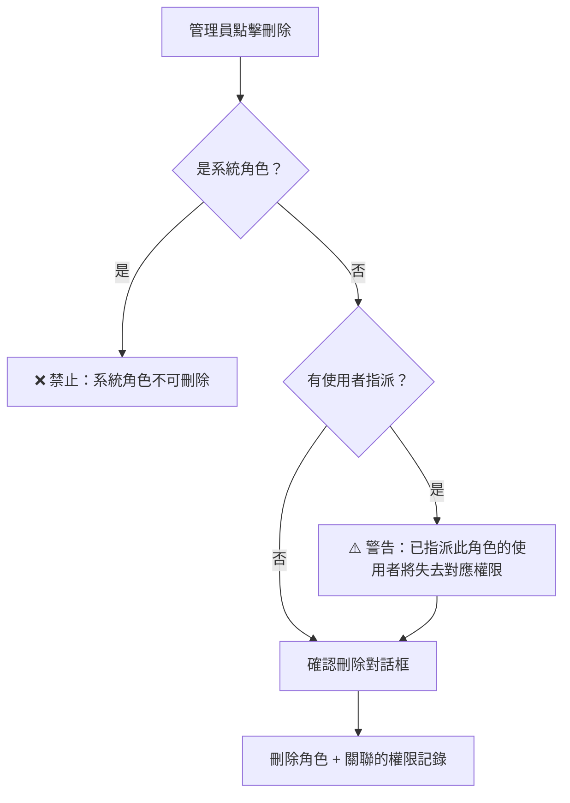

### 3.7 系統預設角色詳細權限

系統初始化時自動建立 5 個預設角色，涵蓋最常見的企業職務分工：

#### 超級管理員 (super_admin)

> **定位**：系統的最高管理者，通常是 IT 或人資主管。

| 功能模組 | 操作等級 | 編輯範圍 | 查看範圍 |
|---------|---------|---------|---------|
| L1 員工管理（全部功能） | 可編輯 | 全公司 | 全公司 |
| L2 職能管理（全部功能） | 可編輯 | 全公司 | 全公司 |
| 組織架構管理 | 可編輯 | 全公司 | 全公司 |
| 使用者管理 | 可編輯 | 全公司 | 全公司 |
| 匯出功能 | 可編輯 | 全公司 | 全公司 |
| 審計日誌 | 僅查看 | — | 全公司 |

#### 子公司管理員 (subsidiary_admin)

> **定位**：集團中各子公司的管理者，管理範圍限定在子公司內。

| 功能模組 | 操作等級 | 編輯範圍 | 查看範圍 |
|---------|---------|---------|---------|
| L1 招募/員工/人才庫 | 可編輯 | 全公司 | 全公司 |
| L1 會議管理 | 可編輯 | 個人 | 全公司 |
| L2 職等/職涯/職務說明 | 可編輯 | 全公司 | 全公司 |
| L2 職能評估/落差分析 | 僅查看 | — | 全公司 |
| 使用者管理/匯出/審計 | 僅查看 | — | 全公司 |

#### HR 經理 (hr_manager)

> **定位**：人力資源部門主管，專注於招募與人員管理。

| 功能模組 | 操作等級 | 編輯範圍 | 查看範圍 |
|---------|---------|---------|---------|
| 招募職缺/員工檔案/人才庫 | 可編輯 | 全公司 | 全公司 |
| AI 面試 | 僅查看 | — | 全公司 |
| 會議管理 | 可編輯 | 全公司 | 全公司 |
| 職等/職涯/職務/職能庫 | 可編輯 | 全公司 | 全公司 |
| 職能評估/落差分析 | 僅查看 | — | 全公司 |
| 匯出功能 | 僅查看 | — | 全公司 |
| 組織/使用者/審計 | 無權限 | — | — |

#### 部門主管 (dept_manager)

> **定位**：各部門經理，管理部門內的日常事務。

| 功能模組 | 操作等級 | 編輯範圍 | 查看範圍 |
|---------|---------|---------|---------|
| 員工檔案 | 可編輯 | 個人 | 部門 |
| 會議管理 | 可編輯 | 全公司 | 全公司 |
| AI 面試 | 可編輯 | 全公司 | 全公司 |
| 職等/職涯/職務/職能庫 | 僅查看 | — | 全公司 |
| 人才庫 | 僅查看 | — | 部門 |
| 招募職缺/匯出 | 無權限 | — | — |

#### 一般員工 (employee)

> **定位**：普通員工，主要查看個人資料。

| 功能模組 | 操作等級 | 編輯範圍 | 查看範圍 |
|---------|---------|---------|---------|
| 員工檔案 | 可編輯 | 個人 | 個人 |
| 會議管理 | 可編輯 | 個人 | 全公司 |
| 職等/職涯/職務/職能庫 | 僅查看 | — | 全公司 |
| 職能評估/落差分析 | 僅查看 | — | 全公司 |
| 招募/AI 面試/人才庫 | 無權限 | — | — |
| 系統管理（全部） | 無權限 | — | — |

### 3.8 常見情境操作指南

#### 情境 A：新員工入職

> 小美剛加入行銷部，需要基本的系統使用權限。

1. **使用者管理** → 確認小美的帳號已建立
2. **角色管理** → 點擊小美的「角色管理」
3. **指派角色** → 選擇「一般員工」，作用範圍「全域」
4. **點擊指派** → 完成

**結果**：小美可以查看自己的員工檔案、參加會議、查看職能資料。

#### 情境 B：員工升任部門主管

> 小明原本是一般員工，現在升任為行銷部主管。

1. **使用者管理** → 找到小明，點擊「角色管理」
2. 保留原有的「一般員工」角色（不需移除）
3. **新增指派** → 選擇「部門主管」，作用範圍「部門」→「行銷部」
4. **點擊指派**

**結果**：小明的權限自動合併——除了原本的個人功能外，現在還能查看行銷部所有員工資料、管理部門會議。

#### 情境 C：建立全新的自訂角色

> 公司需要一個「招募專員」角色，只負責招募相關功能。

1. **角色管理** → 點擊「新增角色」
2. 名稱填入「招募專員」，說明填入「負責招募流程管理」
3. **建立角色** → 新角色出現在列表中
4. 點擊「**編輯功能權限**」
5. 設定權限：
   - 招募職缺管理：可編輯（編輯：全公司、查看：全公司）
   - AI 智能面試：可編輯（編輯：全公司、查看：全公司）
   - 人才庫管理：可編輯（編輯：全公司、查看：全公司）
   - 員工檔案管理：僅查看（查看：全公司）
   - 其他功能：無權限
6. **儲存功能權限**
7. 到**使用者管理**，將此角色指派給相關人員

#### 情境 D：確認使用者的實際權限

> 主管想確認「李小華」目前到底有哪些權限。

1. **使用者管理** → 找到李小華，點擊「角色管理」
2. 查看「目前角色」區塊，列出所有已指派角色
3. 點擊各角色的「**查看權限**」展開細節
4. 點擊底部「**有效權限（合併後）**」查看最終合併結果

#### 情境 E：暫時撤銷權限

> 員工請長假，需要暫時關閉系統存取。

**方式一：停用帳號**（推薦）
- 使用者管理 → 編輯使用者 → 將狀態改為「停用」
- 使用者完全無法登入，所有權限暫停
- 回來上班時改回「啟用」即可恢復

**方式二：移除角色**
- 使用者管理 → 角色管理 → 移除所有角色
- 使用者可以登入，但沒有任何功能權限
- 需要手動重新指派角色

#### 情境 F：查看某個角色被哪些人使用

> 想知道「HR 經理」這個角色目前指派給了誰。

1. **角色管理** → 找到「HR 經理」角色卡片
2. 卡片上顯示「**已指派 N 位使用者**」
3. 點擊該連結，會彈出使用者清單，顯示姓名、Email 和作用範圍

### 3.9 常見問題 FAQ

#### Q1：修改角色的功能權限後，已指派的使用者會立即生效嗎？

**是的**。權限是即時生效的。當你修改了「HR 經理」的功能權限，所有擁有「HR 經理」角色的使用者在下次操作時就會套用新權限（無需登出再登入）。

#### Q2：一個使用者可以有幾個角色？

**沒有上限**。你可以根據實際需求指派多個角色。系統會自動合併所有角色的權限，取最高等級和最廣範圍。

#### Q3：刪除角色後，已指派的使用者會怎樣？

使用者會**立即失去**該角色提供的所有權限。如果使用者只有這一個角色，他將失去所有功能存取權（但仍可登入系統）。

#### Q4：「作用範圍」和「資料範圍」有什麼不同？

| 概念 | 設定位置 | 說明 |
|------|---------|------|
| **資料範圍**（個人/部門/全公司） | 角色的功能權限設定 | 決定在功能內能看到/編輯多大範圍的資料 |
| **作用範圍**（全域/子公司/部門） | 使用者的角色指派 | 決定這個角色在哪個組織範圍內生效 |

> **舉例**：指派「部門主管」角色給小明，作用範圍選「部門 → 行銷部」。這表示小明在行銷部內擁有部門主管的所有權限。

#### Q5：系統角色和自訂角色有什麼差別？

| 項目 | 系統角色 | 自訂角色 |
|------|---------|---------|
| 來源 | 系統初始化自動建立 | 管理員手動建立 |
| 能否刪除 | 不能 | 可以 |
| 能否修改名稱 | 可以 | 可以 |
| 能否修改權限 | 可以 | 可以 |
| 標示 | 有「系統角色」標籤 | 無標籤 |

#### Q6：如果所有管理員都被移除角色，系統會怎樣？

平台管理員（Platform Admin）始終擁有最高權限，不受角色設定影響。如果發生權限設定錯誤，平台管理員可以登入並修復。

#### Q7：可以讓同一個角色在不同部門有不同的權限嗎？

**不行**。角色的功能權限是全域統一的。但你可以：
- 建立多個角色（如「行銷部主管」、「研發部主管」），各自設定不同權限
- 或使用同一個「部門主管」角色，但在指派時指定不同的部門

---

## 第四部分：審計日誌

### 4.1 功能總覽

審計日誌自動記錄系統中所有安全相關操作，供管理員進行安全監控與合規稽核。

### 4.2 篩選條件

| 篩選項 | 類型 | 選項 |
|--------|------|------|
| 動作類型 | 下拉選單 | 全部動作、登入成功、登入失敗、建立角色、更新角色、刪除角色、指派角色、移除角色 |
| 開始日期 | 日期選擇器 | — |
| 結束日期 | 日期選擇器 | — |

### 4.3 日誌清單

| 欄位 | 說明 |
|------|------|
| 時間 | 操作發生時間（yyyy-MM-dd HH:mm:ss） |
| 動作 | 操作類型（帶有色彩標記） |
| 資源 | 被操作的資源類型（如 auth、user、role） |
| 使用者 | 執行操作的使用者 ID |
| IP | 操作來源 IP 位址 |
| 詳情 | 操作詳細描述（超過 40 字自動截斷） |

#### 支援的動作類型

| 動作代碼 | 說明 | 資源類型 |
|----------|------|----------|
| login_success | 登入成功 | auth |
| login_failed | 登入失敗 | auth |
| role_create | 建立角色 | role |
| role_update | 更新角色 | role |
| role_delete | 刪除角色 | role |
| user_role_assign | 指派角色 | user |
| user_role_revoke | 撤銷角色 | user |

### 4.4 分頁

- 支援分頁瀏覽，顯示「共 N 筆記錄」
- 上一頁 / 下一頁按鈕，頁碼顯示「第 X / Y 頁」

---

## 第五部分：認證與安全機制

### 5.1 登入流程

系統支援兩種登入模式，透過頁面頂部的頁籤切換：

| 模式 | 說明 | 需填欄位 |
|------|------|----------|
| 租戶登入 | 一般使用者登入 | 組織代碼 + 電子郵件 + 密碼 |
| 平台管理 | 平台管理員登入 | 電子郵件 + 密碼 |

#### 租戶登入流程

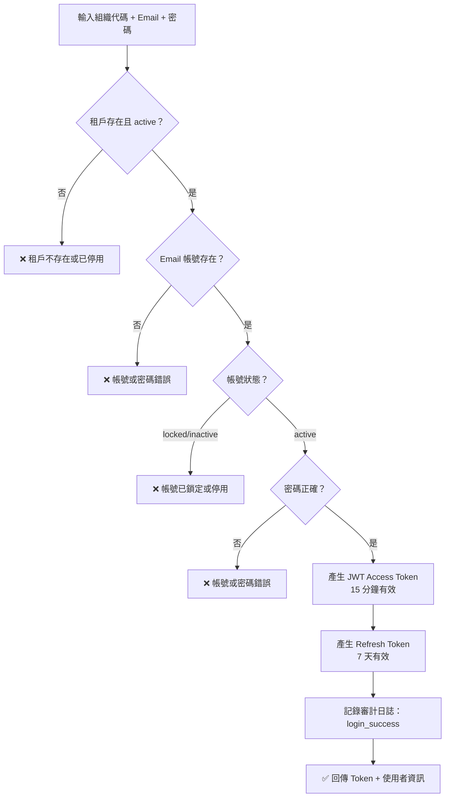

### 5.2 登入頁面

| 欄位 | 類型 | 必填 | 說明 |
|------|------|------|------|
| 組織代碼 | 文字 | ✓（租戶模式） | 租戶識別碼（如 demo） |
| 電子郵件 | 文字 | ✓ | 登入帳號 |
| 密碼 | 密碼 | ✓ | 支援顯示/隱藏切換 |
| 記住登入資訊 | 勾選框 | — | 下次自動填充帳號 |

**輔助功能**：
- 忘記密碼連結（開啟重設密碼對話框，目前為模擬功能）
- 測試帳號提示區（僅開發環境顯示）

### 5.3 Token 機制

| Token 類型 | 有效期 | 儲存方式 | 用途 |
|-----------|--------|----------|------|
| JWT Access Token | 15 分鐘 | localStorage `bombus_access_token` | API 請求認證（Authorization: Bearer） |
| Refresh Token | 7 天 | localStorage `bombus_refresh_token` | Access Token 過期後自動刷新 |

#### 自動刷新流程

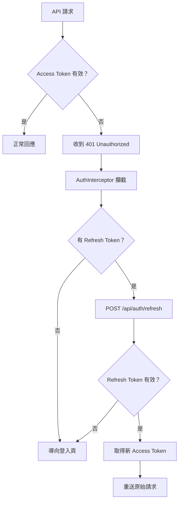

### 5.4 密碼安全

| 項目 | 規格 |
|------|------|
| 加密演算法 | bcryptjs（salt rounds: 10） |
| 最小長度 | 8 字元 |
| 變更密碼後 | 撤銷所有 Refresh Token（強制重新登入所有裝置） |
| 首次登入 | 可設定 `must_change_password` 強制修改密碼 |

### 5.5 變更密碼

路由：`/change-password`

| 欄位 | 類型 | 必填 | 說明 |
|------|------|------|------|
| 目前密碼 | 密碼 | ✓ | 驗證身分 |
| 新密碼 | 密碼 | ✓ | 至少 8 字元 |

---

## 第六部分：AI 服務功能缺口分析

### 6.1 已實現功能

| 功能 | 狀態 | 說明 |
|------|------|------|
| 組織架構視覺化 | ✅ 已實現 | 完整的畫布模式 + 列表模式 |
| RBAC 權限系統 | ✅ 已實現 | 功能權限矩陣 + 多角色合併 |
| 審計日誌 | ✅ 已實現 | 自動記錄安全操作 |
| JWT 認證 | ✅ 已實現 | Access + Refresh Token 雙 Token |
| 多租戶隔離 | ✅ 已實現 | Database-per-Tenant 架構 |
| 平台租戶管理 | ✅ 已實現 | 建立/暫停/恢復/刪除 + 管理員管理 |
| 訂閱方案管理 | ✅ 已實現 | 功能模組授權 + 費用設定 |
| 平台審計日誌 | ✅ 已實現 | 跨租戶操作記錄 + 12 種動作類型 |

### 6.2 待開發功能

| # | 功能 | 前端 UI | 後端 API | AI 引擎 | 優先級 | 預期效益 |
|---|------|---------|----------|---------|--------|----------|
| 1 | 忘記密碼 | ✅ 已有 UI | ❌ 缺 | — | 高 | 減少管理員手動重設密碼的負擔 |
| 2 | 組織架構 AI 建議 | ❌ 缺 | ❌ 缺 | ❌ 缺 | 低 | 根據企業規模推薦組織結構 |
| 3 | 異常登入偵測 | ❌ 缺 | ❌ 缺 | ❌ 缺 | 中 | 偵測不尋常的登入行為（地點、時間） |
| 4 | 權限使用分析 | ❌ 缺 | ❌ 缺 | ❌ 缺 | 中 | 分析角色實際使用率，建議精簡權限 |
| 5 | 雙因素認證（2FA） | ❌ 缺 | ❌ 缺 | — | 高 | 強化帳號安全 |
| 6 | 批量使用者匯入 | ❌ 缺 | ❌ 缺 | — | 中 | 支援 Excel 批量建立帳號 |
| 7 | 密碼強度檢查 | ❌ 缺 | ❌ 缺 | — | 中 | 強制複雜密碼策略 |

> ⚠️ **忘記密碼目前為 UI 展示**：前端有重設密碼的對話框和成功動畫，但後端尚未實作發送重設郵件的功能。

---

## 第七部分：平台管理

> **白話說明**：如果把整個 Bombus 系統比喻成一棟辦公大樓，前面介紹的「系統設定」是每層樓（租戶）的內部管理，而「平台管理」就是大樓物業管理——負責租出樓層、設定租金方案、管理公共區域的監控記錄。只有物業管理員（平台管理員）能進入這個後台。

### 7.1 功能總覽

平台管理提供 SaaS 營運者管理所有租戶的統一後台，涵蓋三大功能：

| 功能 | 說明 | 核心操作 |
|------|------|----------|
| 租戶管理 | 管理所有企業租戶的生命週期 | 建立、暫停、恢復、刪除租戶 |
| 訂閱方案管理 | 定義與維護訂閱方案 | 設定功能模組、使用者上限、費用 |
| 平台審計日誌 | 追蹤跨租戶的平台級操作 | 查詢、篩選、匯出審計記錄 |

### 7.2 平台管理員認證

平台管理員的認證流程獨立於租戶使用者，使用專用的登入端點：

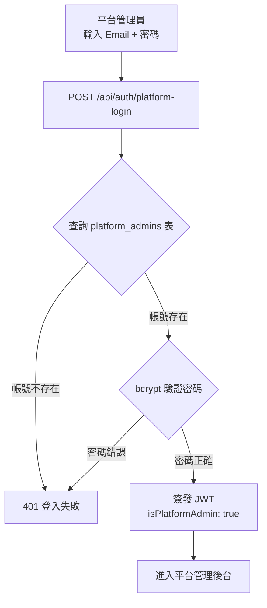

| 項目 | 平台管理員 | 租戶使用者 |
|------|-----------|-----------|
| 登入端點 | `POST /api/auth/platform-login` | `POST /api/auth/login` |
| 帳號來源 | platform.db → `platform_admins` 表 | tenant_*.db → `users` 表 |
| JWT 內容 | `{ sub, isPlatformAdmin: true, name }` | `{ sub, tid, roles, scope }` |
| 權限模型 | 固定最高權限 | RBAC 角色權限矩陣 |
| 可存取範圍 | 所有租戶（管理視角） | 僅自己所屬租戶（業務視角） |
| Refresh Token | 無 | 有（7 天有效期） |

> **白話說明**：平台管理員就像大樓物業經理，用特別的門禁卡進入管理室；而租戶管理員則像每家公司的行政主管，用公司門禁卡進入自己的辦公樓層。兩者是完全不同的身份系統。

### 7.3 租戶管理

#### 7.3.1 租戶清單

頁面頂部顯示三張統計卡片：

| 卡片 | 數值 | 說明 |
|------|------|------|
| 總租戶數 | `stats.total` | API 回傳全域統計 |
| 啟用中 | `stats.active`（綠色） | 前端從當前頁面資料計算 |
| 已暫停 | `stats.suspended`（琥珀色） | 前端從當前頁面資料計算 |

**狀態篩選頁籤**

| 頁籤 | 對應 status 值 | 說明 |
|------|---------------|------|
| 全部 | （空） | 顯示全部租戶 |
| 啟用中 | `active` | 僅顯示啟用的租戶 |
| 已暫停 | `suspended` | 僅顯示暫停的租戶 |
| 已刪除 | `deleted` | 僅顯示軟刪除的租戶 |

**表格欄位**

| 欄位 | 說明 | 備註 |
|------|------|------|
| 租戶 | Logo + 租戶名稱 | Logo 顯示縮圖或預設圖示 |
| 代碼 | 租戶 slug | URL 識別碼（如 `acme-corp`） |
| 產業別 | 對應 15 類產業 | 科技業、製造業、金融保險業等 |
| 方案 | 訂閱方案名稱 | 停用方案顯示「已停用」徽章 |
| 狀態 | 啟用中 / 已暫停 / 已刪除 | 以不同色彩徽章標示 |
| 建立時間 | yyyy-MM-dd 格式 | — |
| 操作 | 依狀態顯示不同按鈕 | 見下方狀態操作 |

**各狀態下的操作按鈕**

| 租戶狀態 | 可用操作 |
|----------|----------|
| 啟用中（active） | 編輯、暫停 |
| 已暫停（suspended） | 編輯、恢復、軟刪除 |
| 已刪除（deleted） | 恢復、永久刪除 |

#### 7.3.2 新增租戶

```mermaid
flowchart TD
    A[填寫新增租戶表單] --> B{驗證 slug 格式}
    B -->|格式錯誤| C[提示：僅小寫英文與連字號]
    B -->|格式正確| D{檢查 slug 唯一性}
    D -->|已存在| E[提示：代碼已被使用]
    D -->|可用| F[POST /api/platform/tenants]
    F --> G[platform.db 建立租戶記錄]
    G --> H[建立租戶 DB 檔案<br/>tenant_{id}.db]
    H --> I[初始化 Schema<br/>69 業務表 + 7 RBAC 表]
    I --> J[RBAC 種子資料<br/>5 角色 + 權限 + 管理員帳號]
    J --> K[記錄審計日誌]
    K --> L[租戶建立完成 ✓]
```

**表單欄位**

| 欄位 | 類型 | 必填 | 驗證規則 |
|------|------|------|----------|
| 租戶名稱 | 文字 | ✅ | — |
| 代碼（slug） | 文字 | ✅ | 僅小寫英文、數字、連字號；最少 3 字元 |
| 公司 Logo | 檔案上傳 | — | 檔案 ≤ 2MB；格式限 JPEG / PNG / WebP |
| 產業別 | 下拉選單 | — | 15 個選項（科技業、製造業、金融保險業…等） |
| 訂閱方案 | 下拉選單 | ✅ | 僅顯示啟用中的方案 |
| 管理員名稱 | 文字 | ✅ | — |
| 管理員信箱 | Email | ✅ | 有效 Email 格式 |
| 初始密碼 | 密碼 |  ✅ | 至少 6 字元 |

> **白話說明**：建立租戶就像在大樓中租出一整層給新公司——系統會自動幫這家公司準備好獨立的「辦公空間」（獨立資料庫）、「門禁系統」（RBAC 角色權限）、以及第一位「行政主管」帳號（管理員）。

#### 7.3.3 RBAC 種子資料（自動建立）

新租戶建立時，系統自動在其獨立資料庫中建立以下預設資料：

| 步驟 | 建立內容 | 數量 |
|------|----------|------|
| 1 | 根組織單位（type='group'） | 1 |
| 2 | 系統角色（super_admin / subsidiary_admin / hr_manager / dept_manager / employee） | 5 |
| 3 | 權限定義（20 資源 × 多種操作） | 80 |
| 4 | 角色-權限對應 | 依角色配置 |
| 5 | 功能權限矩陣（Feature-based） | 39 功能 × 5 角色 |
| 6 | 管理員帳號（password bcrypt 加密） | 1 |
| 7 | 管理員角色指派（super_admin） | 1 |

#### 7.3.4 租戶狀態流轉

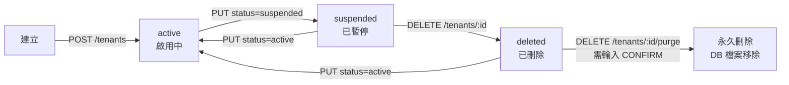

| 狀態 | 使用者登入 | API 存取 | 資料保留 |
|------|-----------|---------|----------|
| active | ✅ 正常 | ✅ 正常 | ✅ 保留 |
| suspended | ❌ 403 TenantSuspended | ❌ 403 TenantSuspended | ✅ 保留 |
| deleted | ❌ 403 TenantDeleted | ❌ 403 TenantDeleted | ✅ 保留（可恢復） |
| 永久刪除 | — | — | ❌ DB 檔案已移除，不可恢復 |

> **白話說明**：暫停就像大樓管理處暫時關掉某層的門禁——東西都還在，只是暫時不讓人進去。軟刪除像是標記該樓層為「待清退」，但還可以反悔恢復。永久刪除則是真的把整層清空——物品全部移除，不可恢復。

#### 7.3.5 編輯租戶與管理員管理

**編輯模式**下可修改租戶基本資訊，並管理該租戶的管理員帳號：

| 可編輯項目 | 說明 |
|-----------|------|
| 租戶名稱 | 可修改公司名稱 |
| 公司 Logo | 重新上傳或移除 |
| 產業別 | 變更產業分類 |
| 訂閱方案 | 升級或降級方案 |
| 管理員帳號（列表） | 修改名稱、信箱、重設密碼 |

> 每位管理員卡片顯示其**角色徽章**（如 super_admin）和**帳號狀態**（active / inactive），可直接編輯姓名、信箱或重設密碼。

#### 7.3.6 永久刪除確認

永久刪除租戶需要**二次確認**，以防止誤操作：

1. 顯示警告：「此操作將永久刪除租戶 **[名稱]** 及其所有資料，且無法復原。」
2. 使用者必須在輸入框中鍵入 `CONFIRM` 才能啟用「永久刪除」按鈕
3. 後端同時驗證 `confirm=true` 參數
4. 執行：卸載租戶 DB → 刪除 DB 檔案 → 移除 platform.db 記錄 → 記錄審計日誌

### 7.4 訂閱方案管理

#### 7.4.1 方案卡片

方案以卡片網格形式展示，每張卡片包含：

| 區塊 | 內容 |
|------|------|
| 標題列 | 方案名稱 + 狀態徽章（啟用 / 停用） |
| 費用資訊 | 月費 + 年費（NT$ 格式） |
| 使用限制 | 最大使用者數 + 儲存空間（GB） |
| 功能清單 | 已啟用的功能模組列表 |
| 操作 | 編輯按鈕 |

#### 7.4.2 新增 / 編輯方案

**表單欄位**

| 欄位 | 類型 | 預設值 | 說明 |
|------|------|--------|------|
| 方案名稱 | 文字 | — | 如 Starter、Pro、Enterprise |
| 月費（NT$） | 數字 | 0 | 月繳費用 |
| 年費（NT$） | 數字 | 0 | 年繳費用 |
| 最大使用者數 | 數字 | 10 | 方案內含使用者上限 |
| 儲存空間（GB） | 數字 | 5 | 可用儲存空間 |
| 啟用狀態 | 下拉 | 啟用 | 啟用 / 停用 |

#### 7.4.3 功能模組勾選

方案編輯時可精細控制各功能模組的授權，使用**三態 checkbox** 機制：

```
┌─ L1 員工管理（6 項）[■ 全選 / □ 半選 / ☐ 未選]
│  ├─ ☑ L1.jobs — 招募職缺管理
│  ├─ ☑ L1.recruitment — AI 智能面試
│  ├─ ☑ L1.talent-pool — 人才庫與再接觸管理
│  ├─ ☑ L1.profile — 員工檔案與歷程管理
│  ├─ ☑ L1.meeting — 會議管理
│  └─ ☑ L1.onboarding — 入職管理
├─ L2 職能管理（5 項）
│  ├─ ☑ L2.grade-matrix / L2.framework / L2.job-description
│  ├─ ☑ L2.assessment / L2.gap-analysis
├─ L3 教育訓練（7 項）
├─ L4 專案管理（4 項）
├─ L5 績效管理（6 項）
└─ L6 文化管理（7 項）
```

- **群組 checkbox**：點擊模組名稱 checkbox 可一次全選/取消該模組下所有功能
- **半選狀態**：部分勾選時，群組 checkbox 顯示為 indeterminate（半填充）
- **計數顯示**：每個模組標題旁顯示「已選/總數」（如 3/6）

> **白話說明**：就像手機的訂閱方案——「基本版」只開放部分功能，「專業版」開放更多，「企業版」全部開放。平台管理員可以自由組合每個方案包含哪些功能。

#### 7.4.4 預設方案範例

| 方案 | 使用者上限 | 子公司上限 | 功能模組 | 匯出 | API |
|------|-----------|-----------|----------|------|-----|
| Starter | 10 | 1 | L1 | ❌ | ❌ |
| Pro | 50 | 3 | L1、L2、L3 | ✅ | ❌ |
| Enterprise | 500 | 20 | L1~L6 全部 | ✅ | ✅ |

#### 7.4.5 方案與租戶的關聯


> 方案的 `features` 欄位為 JSON 格式，如 `{"modules":["L1","L2","L3"],"export":true,"api":false}`。使用者登入時，系統從方案中解析已授權模組清單，前端據此過濾側邊欄選單項目。

### 7.5 平台審計日誌

平台審計日誌記錄所有跨租戶的管理操作，與租戶內的審計日誌（第四部分）獨立存儲。

#### 7.5.1 篩選條件

| 篩選欄位 | 類型 | 選項 |
|----------|------|------|
| 動作類型 | 下拉選單 | 18 種動作（見下表） |
| 租戶 ID | 文字輸入 | 自由輸入租戶 ID |
| 開始日期 | 日期選擇 | date picker |
| 結束日期 | 日期選擇 | date picker |

**動作類型清單（18 種）**

| 動作碼 | 中文標籤 | 徽章色彩 |
|--------|----------|----------|
| login_success | 租戶使用者登入成功 | 綠色（success） |
| login_failed | 租戶使用者登入失敗 | 紅色（danger） |
| platform_login_success | 平台管理員登入成功 | 綠色（success） |
| platform_login_failed | 平台管理員登入失敗 | 紅色（danger） |
| tenant_create | 建立租戶 | 綠色（success） |
| tenant_update | 更新租戶資訊 | 藍色（info） |
| tenant_suspend | 暫停租戶 | 黃色（warning） |
| tenant_reactivate | 恢復租戶（從暫停） | 綠色（success） |
| tenant_restore | 恢復租戶（從刪除） | 綠色（success） |
| tenant_soft_delete | 軟刪除租戶 | 紅色（danger） |
| tenant_purge | 永久刪除租戶 | 紅色（danger） |
| plan_create | 建立訂閱方案 | 綠色（success） |
| plan_update | 更新訂閱方案 | 藍色（info） |
| data_migration | 資料遷移 | 藍色（info） |
| role_create | 建立角色 | 綠色（success） |
| role_update | 更新角色 | 藍色（info） |
| role_delete | 刪除角色 | 紅色（danger） |
| user_role_assign | 指派角色 | 藍色（info） |
| user_role_revoke | 移除角色 | 紅色（danger） |

#### 7.5.2 日誌表格

| 欄位 | 說明 | 備註 |
|------|------|------|
| 時間 | yyyy-MM-dd HH:mm:ss | 等寬字體顯示 |
| 動作 | 動作碼 + 色彩徽章 | 依上表色彩標示 |
| 資源 | 操作的資源類型 | tenant / subscription_plan / auth 等 |
| 租戶 | 租戶名稱或 ID | 若為平台級操作則顯示「—」 |
| 使用者 | 操作者 ID | — |
| IP | 來源 IP 位址 | — |
| 詳情 | JSON 格式操作細節 | 顯示前 40 字，Hover 展開完整內容 |

---

## 附錄

### 附錄 A：狀態碼對照表

**使用者帳號狀態**

| 狀態碼 | 顯示文字 | 說明 |
|--------|----------|------|
| active | 啟用 | 正常使用中 |
| inactive | 停用 | 已停用，無法登入 |
| locked | 鎖定 | 帳號被鎖定 |

**公司營運狀態**

| 狀態碼 | 顯示文字 | 說明 |
|--------|----------|------|
| active | 營運中 | 正常營運 |
| inactive | 已停止 | 停止營運 |

**租戶狀態**

| 狀態碼 | 顯示文字 | 說明 |
|--------|----------|------|
| active | 啟用中 | 正常使用中，租戶可登入與存取 API |
| suspended | 已暫停 | 暫停服務，租戶無法登入（資料保留） |
| deleted | 已刪除 | 軟刪除，可恢復或永久刪除 |

**方案啟用狀態**

| 值 | 顯示文字 | 說明 |
|----|----------|------|
| 1 | 啟用 | 可指派給租戶 |
| 0 | 停用 | 不顯示於新增租戶的選單中 |

**角色作用範圍**

| 範圍碼 | 顯示文字 | 說明 |
|--------|----------|------|
| global | 全域 | 作用於整個租戶 |
| subsidiary | 子公司 | 作用於特定子公司及其下屬 |
| department | 部門 | 作用於特定部門 |

**操作等級**

| 等級碼 | 顯示文字 | 說明 |
|--------|----------|------|
| none | 無權限 | 不可存取 |
| view | 僅查看 | 唯讀 |
| edit | 可編輯 | 讀寫 |

**資料範圍**

| 範圍碼 | 顯示文字 | 說明 |
|--------|----------|------|
| self | 個人 | 僅自己的資料 |
| department | 部門 | 部門內所有資料 |
| company | 全公司 | 租戶內所有資料 |

### 附錄 B：API 端點一覽

**組織架構管理**

| 方法 | 端點 | 說明 |
|------|------|------|
| GET | `/api/organization/tree` | 取得統一組織樹（扁平結構，含完整欄位） |
| GET | `/api/organization/stats` | 取得組織統計（公司數、部門數、員工數） |
| GET | `/api/organization/org-units` | 取得組織單位列表（用於下拉選單） |
| GET | `/api/organization/companies` | 取得公司列表（含員工/部門計數） |
| GET | `/api/organization/companies/headquarters` | 取得總公司 |
| GET | `/api/organization/companies/:id` | 取得公司詳情（含子公司/部門列表） |
| GET | `/api/organization/companies/:id/subsidiaries` | 取得子公司列表 |
| POST | `/api/organization/companies` | 新增公司 |
| PUT | `/api/organization/companies/:id` | 更新公司資訊 |
| DELETE | `/api/organization/companies/:id` | 刪除公司（需先移除子公司/部門） |
| GET | `/api/organization/departments` | 取得部門列表（可篩選 companyId） |
| GET | `/api/organization/departments/:id` | 取得部門詳情 |
| GET | `/api/organization/departments/:id/employees` | 取得部門員工列表 |
| GET | `/api/organization/departments/:id/positions` | 取得部門職務配置 |
| POST | `/api/organization/departments` | 新增部門 |
| PUT | `/api/organization/departments/:id` | 更新部門（含擴充欄位） |
| DELETE | `/api/organization/departments/:id` | 刪除部門（需先移除員工/子部門） |
| GET | `/api/organization/collaborations` | 取得協作關係列表 |
| POST | `/api/organization/collaborations` | 新增協作關係 |
| PUT | `/api/organization/collaborations/:id` | 更新協作關係 |
| DELETE | `/api/organization/collaborations/:id` | 刪除協作關係 |

**租戶管理（使用者/角色/權限）**

| 方法 | 端點 | 說明 |
|------|------|------|
| GET | `/api/tenant-admin/org-units` | 取得組織架構列表（樹狀） |
| POST | `/api/tenant-admin/org-units` | 新增組織單位 |
| PUT | `/api/tenant-admin/org-units/:id` | 更新組織單位 |
| DELETE | `/api/tenant-admin/org-units/:id` | 刪除組織單位 |
| GET | `/api/tenant-admin/roles` | 取得角色列表（含權限/使用者計數） |
| POST | `/api/tenant-admin/roles` | 建立新角色 |
| PUT | `/api/tenant-admin/roles/:id` | 更新角色基本資訊（名稱、說明） |
| DELETE | `/api/tenant-admin/roles/:id` | 刪除角色 |
| GET | `/api/tenant-admin/permissions` | 取得全部權限定義（分組） |
| GET | `/api/tenant-admin/features` | 取得功能定義列表（依租戶方案篩選） |
| GET | `/api/tenant-admin/roles/:id/feature-perms` | 取得角色的功能權限矩陣 |
| PUT | `/api/tenant-admin/roles/:id/feature-perms` | 批量更新角色功能權限 |
| GET | `/api/tenant-admin/roles/:id/users` | 取得角色下的使用者列表 |
| GET | `/api/tenant-admin/users` | 取得使用者列表（支援分頁/搜尋/篩選） |
| POST | `/api/tenant-admin/users` | 建立新使用者 |
| PUT | `/api/tenant-admin/users/:id` | 更新使用者（名稱/狀態/密碼） |
| GET | `/api/tenant-admin/user-roles/:userId` | 取得使用者的角色列表 |
| POST | `/api/tenant-admin/user-roles` | 指派角色給使用者 |
| DELETE | `/api/tenant-admin/user-roles` | 撤銷使用者角色 |

**認證相關**

| 方法 | 端點 | 說明 |
|------|------|------|
| POST | `/api/auth/login` | 租戶使用者登入 |
| POST | `/api/auth/platform-login` | 平台管理員登入 |
| POST | `/api/auth/refresh` | Token 刷新 |
| POST | `/api/auth/logout` | 登出 |
| POST | `/api/auth/change-password` | 變更密碼 |
| GET | `/api/auth/my-feature-perms` | 取得目前使用者的合併功能權限 |

**審計日誌**

| 方法 | 端點 | 說明 |
|------|------|------|
| GET | `/api/audit/logs` | 取得審計日誌（支援分頁、動作/日期篩選） |

**平台管理（僅平台管理員）**

| 方法 | 端點 | 說明 |
|------|------|------|
| GET | `/api/platform/tenants` | 租戶列表（分頁 + 搜尋 + 狀態篩選） |
| POST | `/api/platform/tenants` | 建立新租戶（含初始化 DB + RBAC 種子資料） |
| GET | `/api/platform/tenants/:id` | 租戶詳情（含使用者數/員工數統計） |
| PUT | `/api/platform/tenants/:id` | 更新租戶（名稱/狀態/方案/Logo/產業） |
| DELETE | `/api/platform/tenants/:id` | 軟刪除租戶（標記為 deleted） |
| DELETE | `/api/platform/tenants/:id/purge` | 硬刪除租戶（需 confirm=true，移除 DB 檔案） |
| GET | `/api/platform/tenants/:id/admins` | 取得租戶管理員列表 |
| PUT | `/api/platform/tenants/:id/admins/:userId` | 更新租戶管理員（名稱/信箱/密碼） |
| GET | `/api/platform/plans` | 方案列表（含使用中租戶計數） |
| POST | `/api/platform/plans` | 建立方案 |
| PUT | `/api/platform/plans/:id` | 更新方案 |
| POST | `/api/platform/upload-logo` | 上傳租戶 Logo（≤ 2MB，JPEG/PNG/WebP） |

### 附錄 C：資料庫結構

**org_units（組織單位）**

| 欄位 | 類型 | 說明 |
|------|------|------|
| id | TEXT (PK) | 主鍵 |
| name | TEXT (NOT NULL) | 組織名稱 |
| type | TEXT (CHECK) | 類型：group / subsidiary / department |
| parent_id | TEXT (FK) | 上級組織 ID（自我參照 org_units） |
| level | INTEGER | 層級深度（0=頂層） |
| code | TEXT | 組織代碼 |
| address | TEXT | 地址 |
| phone | TEXT | 電話 |
| email | TEXT | 電子郵件 |
| description | TEXT | 描述/簡介 |
| tax_id | TEXT | 統一編號 |
| status | TEXT | 營運狀態（預設 active） |
| established_date | TEXT | 成立日期 |
| created_at | TEXT | 建立時間（預設 datetime('now')） |

**departments（部門）**

| 欄位 | 類型 | 說明 |
|------|------|------|
| id | TEXT (PK) | 主鍵 |
| name | TEXT (UNIQUE, NOT NULL) | 部門名稱 |
| code | TEXT | 部門代碼 |
| sort_order | INTEGER | 排序權重（預設 0） |
| manager_id | TEXT (FK) | 部門主管（關聯 employees） |
| head_count | INTEGER | 編制人數（預設 0） |
| responsibilities | TEXT | 負責任務（JSON 陣列） |
| kpi_items | TEXT | KPI 事項（JSON 陣列） |
| competency_focus | TEXT | 職能框架分類（JSON 陣列） |
| created_at | TEXT | 建立時間（預設 datetime('now')） |

**department_collaborations（部門協作關係）**

| 欄位 | 類型 | 說明 |
|------|------|------|
| id | TEXT (PK) | 主鍵 |
| source_dept_id | TEXT (NOT NULL) | 來源部門 ID |
| target_dept_id | TEXT (NOT NULL) | 目標部門 ID |
| relation_type | TEXT (CHECK) | 關係類型：parallel / downstream |
| description | TEXT | 協作說明 |
| source_anchor | TEXT | 來源錨點位置（top/bottom/left/right） |
| target_anchor | TEXT | 目標錨點位置 |
| created_at | TEXT | 建立時間（預設 datetime('now')） |

**users（使用者帳號）**

| 欄位 | 類型 | 說明 |
|------|------|------|
| id | TEXT (PK) | 主鍵 |
| email | TEXT (UNIQUE, NOT NULL) | 電子郵件（登入帳號） |
| password_hash | TEXT (NOT NULL) | bcrypt 加密密碼 |
| name | TEXT (NOT NULL) | 使用者姓名 |
| employee_id | TEXT (FK) | 關聯員工 ID（可空） |
| avatar | TEXT | 頭像 URL |
| status | TEXT (CHECK) | 帳號狀態：active / inactive / locked |
| last_login | TEXT | 最後登入時間 |
| must_change_password | INTEGER | 是否需強制改密（0/1） |
| created_at | TEXT | 建立時間（預設 datetime('now')） |
| updated_at | TEXT | 最後更新時間 |

**roles（角色定義）**

| 欄位 | 類型 | 說明 |
|------|------|------|
| id | TEXT (PK) | 主鍵 |
| name | TEXT (NOT NULL) | 角色名稱 |
| description | TEXT | 角色說明 |
| scope_type | TEXT (CHECK) | 作用範圍類型：global / subsidiary / department |
| is_system | INTEGER | 是否為系統角色（0/1，系統角色不可刪除） |
| created_at | TEXT | 建立時間（預設 datetime('now')） |

**user_roles（使用者角色對應）**

| 欄位 | 類型 | 說明 |
|------|------|------|
| user_id | TEXT (NOT NULL, FK) | 使用者 ID（CASCADE DELETE） |
| role_id | TEXT (NOT NULL, FK) | 角色 ID（CASCADE DELETE） |
| org_unit_id | TEXT (FK) | 作用範圍的組織單位（NULL = 全域） |
| created_at | TEXT | 建立時間 |

> 主鍵約束：PRIMARY KEY (user_id, role_id, org_unit_id)

**permissions（權限定義）**

| 欄位 | 類型 | 說明 |
|------|------|------|
| id | TEXT (PK) | 主鍵 |
| resource | TEXT (NOT NULL) | 資源類型（如 employee、role、user） |
| action | TEXT (NOT NULL) | 操作類型（如 read、create、update、delete） |
| description | TEXT | 權限說明 |

> 唯一約束：UNIQUE(resource, action)

**role_permissions（角色權限對應）**

| 欄位 | 類型 | 說明 |
|------|------|------|
| role_id | TEXT (NOT NULL, FK) | 角色 ID（CASCADE DELETE） |
| permission_id | TEXT (NOT NULL, FK) | 權限 ID（CASCADE DELETE） |

> 主鍵約束：PRIMARY KEY (role_id, permission_id)

**features（功能定義）**

| 欄位 | 類型 | 說明 |
|------|------|------|
| id | TEXT (PK) | 功能 ID（如 L1.jobs、SYS.user-management） |
| module | TEXT (NOT NULL) | 所屬模組（L1/L2/.../L6/SYS） |
| name | TEXT (NOT NULL) | 功能中文名稱 |
| sort_order | INTEGER | 排序權重（預設 0） |
| created_at | TEXT | 建立時間 |

**role_feature_perms（角色功能權限矩陣）**

| 欄位 | 類型 | 說明 |
|------|------|------|
| role_id | TEXT (NOT NULL, FK) | 角色 ID（CASCADE DELETE） |
| feature_id | TEXT (NOT NULL, FK) | 功能 ID（CASCADE DELETE） |
| action_level | TEXT (CHECK) | 操作等級：none / view / edit |
| edit_scope | TEXT (CHECK) | 編輯範圍：NULL / self / department / company |
| view_scope | TEXT (CHECK) | 查看範圍：NULL / self / department / company |

> 主鍵約束：PRIMARY KEY (role_id, feature_id)

**refresh_tokens（登入 Token）**

| 欄位 | 類型 | 說明 |
|------|------|------|
| id | TEXT (PK) | 主鍵 |
| user_id | TEXT (NOT NULL, FK) | 使用者 ID（CASCADE DELETE） |
| token_hash | TEXT (NOT NULL) | SHA256 加密的 Refresh Token |
| expires_at | TEXT (NOT NULL) | 過期時間 |
| created_at | TEXT | 建立時間 |

**audit_logs（審計日誌，位於平台資料庫）**

| 欄位 | 類型 | 說明 |
|------|------|------|
| id | TEXT (PK) | 主鍵 |
| tenant_id | TEXT | 租戶 ID |
| user_id | TEXT | 操作使用者 ID |
| action | TEXT (NOT NULL) | 動作類型（login_success、role_create 等） |
| resource | TEXT | 資源類型（auth、user、role 等） |
| details | TEXT | 操作詳情（JSON） |
| ip | TEXT | 來源 IP 位址 |
| created_at | TEXT | 記錄時間（預設 datetime('now')） |

**tenants（租戶，位於平台資料庫）**

| 欄位 | 類型 | 說明 |
|------|------|------|
| id | TEXT (PK) | 主鍵 |
| name | TEXT (NOT NULL) | 租戶名稱 |
| slug | TEXT (UNIQUE, NOT NULL) | URL 識別碼（如 demo、acme-corp） |
| status | TEXT (CHECK) | 狀態：active / suspended / deleted（預設 active） |
| plan_id | TEXT (FK) | 訂閱方案 ID（關聯 subscription_plans） |
| db_file | TEXT (NOT NULL) | DB 檔案名稱（如 tenant_uuid.db） |
| logo_url | TEXT | Logo 圖片 URL |
| industry | TEXT | 產業分類 |
| created_at | TEXT | 建立時間（預設 datetime('now')） |
| updated_at | TEXT | 最後更新時間 |

**subscription_plans（訂閱方案，位於平台資料庫）**

| 欄位 | 類型 | 說明 |
|------|------|------|
| id | TEXT (PK) | 主鍵 |
| name | TEXT (NOT NULL) | 方案名稱（如 Starter、Pro、Enterprise） |
| max_users | INTEGER | 最大使用者數（預設 50） |
| max_subsidiaries | INTEGER | 最大子公司數（預設 5） |
| max_storage_gb | INTEGER | 儲存空間 GB（預設 5） |
| features | TEXT | 啟用功能（JSON，如 {"modules":["L1","L2"],"export":true}） |
| price_monthly | REAL | 月費（預設 0） |
| price_yearly | REAL | 年費（預設 0） |
| is_active | INTEGER | 方案是否啟用（0/1，預設 1） |
| created_at | TEXT | 建立時間 |

**platform_admins（平台管理員，位於平台資料庫）**

| 欄位 | 類型 | 說明 |
|------|------|------|
| id | TEXT (PK) | 主鍵 |
| email | TEXT (UNIQUE, NOT NULL) | 管理員信箱 |
| password_hash | TEXT (NOT NULL) | bcrypt 加密密碼 |
| name | TEXT (NOT NULL) | 管理員名稱 |
| created_at | TEXT | 建立時間 |

### 附錄 D：權限需求

| 功能 | 所需角色 | 說明 |
|------|----------|------|
| 組織架構管理 | super_admin / subsidiary_admin | 管理組織樹結構 |
| 使用者管理 | super_admin / subsidiary_admin | 管理系統帳號 |
| 角色管理 | super_admin / subsidiary_admin | 定義角色與權限 |
| 審計日誌 | super_admin / subsidiary_admin | 查看操作歷史 |
| 變更密碼 | 所有已登入使用者 | 自行修改密碼 |
| 租戶管理 | 平台管理員（Platform Admin） | 建立/暫停/刪除租戶 |
| 方案管理 | 平台管理員（Platform Admin） | 建立/編輯訂閱方案 |
| 平台審計日誌 | 平台管理員（Platform Admin） | 查看跨租戶操作記錄 |

### 附錄 E：預設角色權限資源矩陣

| 資源 | 操作 | super_admin | subsidiary_admin | hr_manager | dept_manager | employee |
|------|------|:-----------:|:----------------:|:----------:|:------------:|:--------:|
| employee | CRUD | ✅ | ✅ | ✅ | ✅ | R |
| recruitment | CRUD+M | ✅ | ✅ | ✅ | — | — |
| talent_pool | CRUD+M | ✅ | ✅ | ✅ | — | — |
| meeting | CRUD+M | ✅ | ✅ | ✅ | ✅ | R |
| competency | CRUD | ✅ | ✅ | ✅ | — | R |
| monthly_check | CRUD | ✅ | ✅ | ✅ | ✅ | R |
| weekly_report | CRUD | ✅ | ✅ | ✅ | ✅ | R+CU |
| quarterly_review | CRUD | ✅ | ✅ | ✅ | ✅ | R |
| template | CRUD+M | ✅ | ✅ | ✅ | — | — |
| submission | RCU | ✅ | ✅ | ✅ | ✅ | R+CU |
| approval | R+A+J | ✅ | ✅ | ✅ | ✅ | — |
| organization | CRUD+M | ✅ | ✅ | ✅ | — | R |
| user | CRUD+M | ✅ | R | — | — | — |
| role | CRUD+M | ✅ | R | — | — | — |
| audit | R | ✅ | R | — | — | — |
| export | R | ✅ | ✅ | ✅ | ✅ | R |

> R=Read, C=Create, U=Update, D=Delete, M=Manage, A=Approve, J=Reject
