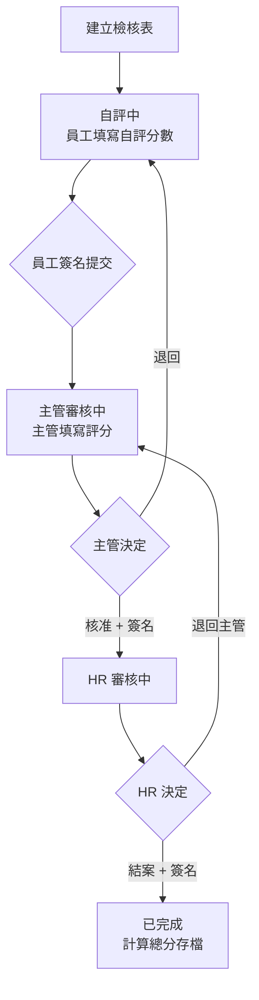
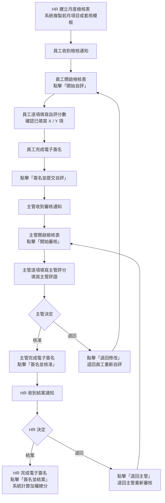
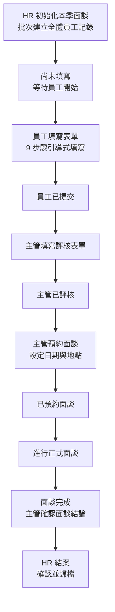
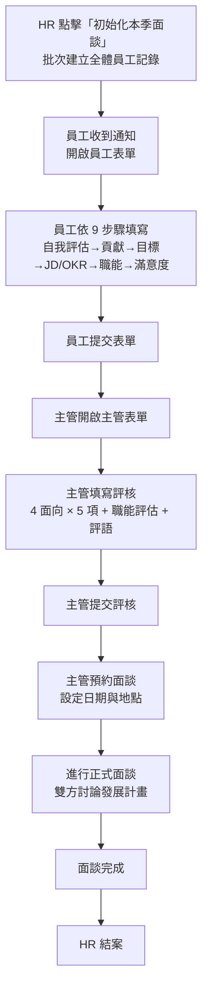
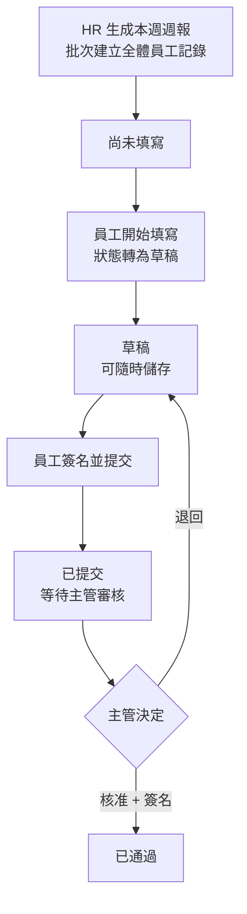
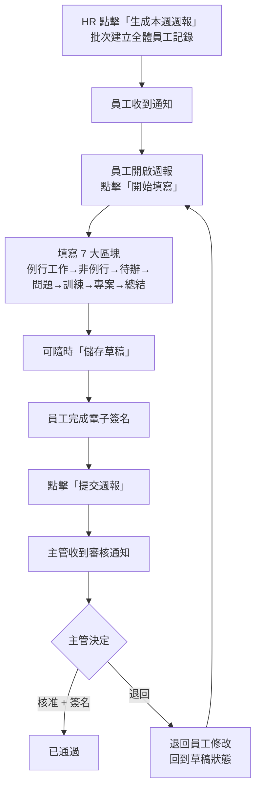
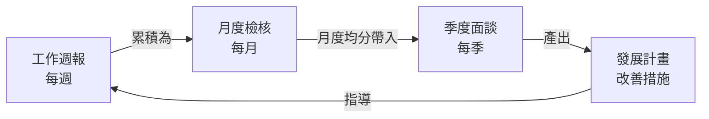

# Bombus 人力資源管理系統
# 功能說明書：職能評估 — 月度檢核、季度面談與工作週報

---

## 文件資訊

| 項目 | 內容 |
|------|------|
| 文件名稱 | 職能評估 — 月度檢核、季度面談與工作週報功能說明書 |
| 適用模組 | 職能管理（L2）> 職能評估 > 總覽、月度檢核、季度面談、工作週報 |
| 適用對象 | HR 人員、部門主管、一般員工 |
| 文件版本 | v1.0 |

---

## 目錄

1. [文件目的與適用範圍](#一文件目的與適用範圍)
2. [系統導覽與入口說明](#二系統導覽與入口說明)
3. [角色權責說明](#三角色權責說明)
4. [名詞定義](#四名詞定義)
5. [第一部分：HR 總覽儀表板](#第一部分hr-總覽儀表板)
6. [第二部分：月度檢核](#第二部分月度檢核)
7. [第三部分：季度面談](#第三部分季度面談)
8. [第四部分：工作週報](#第四部分工作週報)
9. [第五部分：完整職能評估流程總覽](#第五部分完整職能評估流程總覽)
10. [第六部分：AI 服務功能缺口分析](#第六部分ai-服務功能缺口分析)
11. [附錄](#附錄)

---

## 一、文件目的與適用範圍

### 1.1 文件目的

本說明書旨在介紹 Bombus 人力資源管理系統中「**職能評估**」功能的完整操作指引。職能評估是**職能管理（L2）**模組的核心功能之一，透過三個子系統實現員工績效的持續追蹤與回饋：

- **月度檢核**：每月進行的績效評估，含員工自評、主管審核、HR 結案三階段簽核
- **季度面談**：每季進行的深度績效面談，含目標檢核、職能評估、滿意度調查
- **工作週報**：每週工作回報，追蹤日常任務執行與進度

透過本文件，使用者可了解：

- 各評估流程的操作步驟與簽核機制
- 評分邏輯與加權計算方式
- 電子簽名的應用場景
- HR 儀表板的監控與統計功能
- 各角色在評估流程中的權責劃分

### 1.2 適用範圍

| 場景 | 說明 |
|------|------|
| 月度績效評估 | 每月對員工進行檢核項目評分（自評＋主管評分） |
| 季度績效面談 | 每季進行正式面談，含目標回顧、職能評估、發展計畫 |
| 週報管理 | 每週收集工作進度，追蹤任務完成率 |
| 績效數據分析 | HR 透過儀表板監控完成率、部門平均分數、個人趨勢 |
| 逾期預警 | 自動追蹤未完成的檢核、面談、週報項目 |

---

## 二、系統導覽與入口說明

### 2.1 主要功能入口

| 功能模組 | 導覽路徑 | 路由 | 說明 |
|----------|----------|------|------|
| 職能評估總覽 | 職能管理 → 職能評估 → 總覽 | `/competency/assessment` | HR 儀表板，KPI 與數據分析 |
| 月度檢核 | 職能管理 → 職能評估 → 月度檢核 | `/competency/assessment` | 月度績效評估管理 |
| 季度面談 | 職能管理 → 職能評估 → 季度面談 | `/competency/assessment` | 季度績效面談管理 |
| 工作週報 | 職能管理 → 職能評估 → 工作週報 | `/competency/assessment` | 週報提交與審核管理 |

> **操作提示**：職能評估頁面以頁籤（Tab）切換四大功能區塊，所有功能共用同一路由，透過「總覽」、「月度檢核」、「季度面談」、「工作週報」四個頁籤進入。

### 2.2 頁面功能架構

```
職能管理 (L2)
├── 職能框架
├── 職等職級
├── 職務說明書
├── 缺口分析
├── 模板管理
└── 職能評估 ← 本說明書範圍
    ├── 總覽（HR 儀表板）
    │   ├── KPI 卡片（月度完成率、季度完成率、週報提交率）
    │   ├── 月度未完成清單
    │   ├── 季度未完成清單
    │   ├── 週報未提交清單
    │   ├── 各部門平均分數圖表
    │   └── 績效分析儀表板（個人趨勢 / 同期比較 / 部門比較）
    ├── 月度檢核
    │   ├── 檢核列表（篩選、分頁、匯出）
    │   ├── KPI 統計列（評估總人數 / 已完成 / 進行中 / 完成率）
    │   └── 檢核詳情彈窗（自評 → 主管審核 → HR 結案 + 電子簽名）
    ├── 季度面談
    │   ├── 面談列表（篩選、分頁、匯出）
    │   ├── KPI 統計列（預計面談數 / 已完成 / 完成率）
    │   ├── 初始化本季面談（批次建立）
    │   └── 面談詳情彈窗（9 步驟表單 + 多角色簽核）
    └── 工作週報
        ├── 週報列表（篩選、分頁）
        ├── KPI 統計列（週報總數 / 已提交 / 提交率）
        ├── 生成本週週報（批次建立）
        └── 週報詳情彈窗（7 區塊填寫 + 電子簽名）
```

---

## 三、角色權責說明

### 3.1 一般員工

| 功能項目 | 操作權限 |
|----------|----------|
| 月度檢核 | 填寫自評分數、簽名提交自評 |
| 季度面談 | 填寫員工表單（自我評估、目標檢核、滿意度調查） |
| 工作週報 | 填寫週報、簽名提交 |
| 查看歷史 | 僅可查看自己的歷史記錄 |

### 3.2 部門主管

| 功能項目 | 操作權限 |
|----------|----------|
| 月度檢核 | 審核直屬部屬的自評、填寫主管評分、核准或退回、簽名 |
| 季度面談 | 填寫主管表單（評核員工、排定面談、填寫發展計畫） |
| 工作週報 | 審核直屬部屬週報、核准或退回 |
| 查看數據 | 可查看部門範圍內的評估數據 |

### 3.3 HR 人員

| 功能項目 | 操作權限 |
|----------|----------|
| 月度檢核 | 結案或退回主管、簽名結案、查看全公司數據 |
| 季度面談 | 初始化本季面談（批次建立）、結案、查看全公司數據 |
| 工作週報 | 批次生成本週週報、監控提交率 |
| 總覽儀表板 | 查看 KPI、未完成清單、部門統計、個人趨勢分析 |
| 匯出報表 | 匯出月度檢核與季度面談的 Excel 報表 |

---

## 四、名詞定義

| 名詞 | 說明 |
|------|------|
| 月度檢核 | 每月一次的績效評估，員工自評後由主管評分，最後 HR 結案確認 |
| 季度面談 | 每季一次的正式績效面談，涵蓋目標回顧、職能評估、滿意度調查與發展規劃 |
| 工作週報 | 每週提交的工作進度報告，記錄日常工作、待辦事項與問題回報 |
| 自評 | 員工對自己表現的評分（月度 1-10 分、季度 1-5 分） |
| 主管評分 | 直屬主管對員工表現的評分 |
| 加權分數 | 依各檢核項目的權重點數計算的加權後分數 |
| 電子簽名 | 使用手寫板元件進行的數位簽名，作為評估簽核的正式記錄 |
| 員工表單 | 季度面談中由員工填寫的表單，包含自我評估、目標檢核、滿意度調查等 |
| 主管表單 | 季度面談中由主管填寫的表單，包含員工評核、面談安排、發展計畫等 |
| 初始化 | HR 批次建立全體員工的季度面談記錄 |

---

## 第一部分：HR 總覽儀表板

### 1.1 功能總覽

總覽頁面是 HR 的營運監控中心，以 Bento Grid 佈局呈現三大評估系統的即時狀態。HR 可在此頁快速掌握完成率、追蹤逾期項目、分析部門與個人績效趨勢。

### 1.2 KPI 卡片

| KPI 指標 | 說明 | 呈現方式 |
|----------|------|----------|
| 月度檢核完成率 | 當月已完成 ÷ 評估總人數 × 100% | 大型強調卡片（百分比 + 完成/總數） |
| 季度面談完成率 | 當季已結案 ÷ 預計面談數 × 100% | 標準卡片 |
| 工作週報提交率 | 本週已提交 ÷ 週報總數 × 100% | 標準卡片 |

### 1.3 未完成清單

三個監控清單即時顯示需關注的逾期或未完成項目：

**月度未完成清單（顯示前 6 筆）**

| 欄位 | 說明 |
|------|------|
| 員工姓名 | 未完成員工名稱 |
| 部門 | 所屬部門 |
| 職位 | 擔任職位 |
| 狀態 | 目前停留的流程階段（自評中 / 主管審核中 / HR 審核中） |

**季度未完成清單（顯示前 10 筆）**

| 欄位 | 說明 |
|------|------|
| 員工姓名 | 未完成員工名稱 |
| 部門 / 職位 | 所屬部門與職位 |
| 狀態 | 目前停留的流程階段 |

**週報未提交清單（顯示前 10 筆）**

| 欄位 | 說明 |
|------|------|
| 員工姓名 | 未提交員工名稱 |
| 部門 / 職位 | 所屬部門與職位 |
| 狀態 | 尚未填寫 / 草稿 |

### 1.4 各部門平均分數圖表

以長條圖呈現各部門的平均績效分數，支援切換檢視：

| 檢視模式 | 說明 |
|----------|------|
| 月度平均 | 各部門當月月度檢核平均分數 |
| 季度平均 | 各部門當季季度面談平均分數 |

### 1.5 績效分析儀表板

| 設定項目 | 選項 | 說明 |
|----------|------|------|
| 員工選擇 | 下拉選單 | 選擇要分析的特定員工 |
| 檢視模式 | 月度趨勢 / 季度總覽 | 切換時間維度 |
| 比較模式 | 個人 / 同期比較 / 部門比較 | 切換分析角度 |

> **白話說明**：績效分析儀表板就像一位員工的「成績單追蹤器」。HR 可以選擇任何一位員工，查看他最近的分數變化趨勢，也可以跟去年同期或部門平均做比較，快速判斷這位員工的表現是進步還是退步。

### 1.6 篩選條件

| 篩選項 | 說明 |
|--------|------|
| 年度 | 篩選特定年度資料 |
| 月份 | 篩選特定月份（影響月度檢核與週報） |
| 週別 | 篩選特定週別（影響週報） |

---

## 第二部分：月度檢核

### 2.1 功能總覽

月度檢核是「每月一次」的績效評估機制。每位員工每月會收到一份檢核表，內含多個評估項目（如工作品質、團隊協作、專業技能等），需經三階段簽核完成。

> **白話說明**：月度檢核就像「月考」。員工先自己打分數（自評），主管再打一次分數（主管評分），最後 HR 確認無誤後蓋章存檔（結案）。三個關卡都需要電子簽名，確保每個人都正式確認了自己的評估。

### 2.2 狀態流程



### 2.3 狀態說明

| 狀態代碼 | 顯示名稱 | 說明 |
|----------|----------|------|
| self_assessment | 自評中 | 等待員工填寫自評分數並簽名提交 |
| manager_review | 主管審核中 | 等待主管填寫主管評分，可核准或退回 |
| hr_review | HR 審核中 | 等待 HR 最終確認，可結案或退回主管 |
| completed | 已完成 | 檢核已完成，總分已計算並存檔 |
| overdue | 逾期 | 超過截止日期仍未完成 |

### 2.4 列表頁面欄位

| 欄位 | 說明 |
|------|------|
| 員工 | 員工姓名 |
| 部門 / 職位 | 所屬部門與擔任職位 |
| 年月 | 評估所屬的年份與月份 |
| 自評日期 | 員工完成自評的日期 |
| 主管審核日期 | 主管完成審核的日期 |
| 狀態 | 目前所在的流程階段（顏色標示） |
| 總分 | HR 結案後的加權總分 |
| 操作 | 查看詳情按鈕 |

### 2.5 KPI 統計列

| 指標 | 說明 |
|------|------|
| 評估總人數 | 當月需進行檢核的員工人數 |
| 已完成 | 狀態為「已完成」的數量 |
| 進行中 | 狀態為「自評中」、「主管審核中」或「HR 審核中」的數量 |
| 完成率 | 已完成 ÷ 評估總人數 × 100% |

### 2.6 篩選條件

| 篩選項 | 類型 | 說明 |
|--------|------|------|
| 年度 | 下拉選單 | 篩選特定年度 |
| 月份 | 下拉選單 | 篩選特定月份 |
| 子公司 | 下拉選單 | 多組織架構時篩選子公司（視權限顯示） |
| 部門 | 下拉選單 | 篩選特定部門 |
| 狀態 | 下拉選單 | 篩選特定狀態 |

### 2.7 檢核項目評分機制

#### 檢核項目欄位規格

| 欄位 | 類型 | 說明 |
|------|------|------|
| 指標名稱 | 文字 | 評估項目名稱（如「工作品質」、「團隊協作」） |
| 說明 | 文字 | 該指標的詳細說明 |
| 衡量標準 | 文字 | 評分的參考基準 |
| 點數 | 整數 | 該項目的權重點數（用於加權計算） |
| 自評分數 | 整數（1-10） | 員工給自己的評分 |
| 主管分數 | 整數（1-10） | 主管給員工的評分 |
| 加權分 | 小數 | 系統自動計算：主管分數 × (點數 ÷ 總點數) |

#### 總分計算公式

> **加權總分** = Σ（主管分數 × 點數 ÷ 總點數）× 20

**計算範例**：假設有三個檢核項目，總點數 = 3 + 4 + 3 = 10

| 項目 | 點數 | 主管評分 | 加權計算 |
|------|------|----------|----------|
| 工作品質 | 3 | 8 | 8 × (3 ÷ 10) = 2.4 |
| 團隊協作 | 4 | 9 | 9 × (4 ÷ 10) = 3.6 |
| 專業技能 | 3 | 7 | 7 × (3 ÷ 10) = 2.1 |

加權和 = 2.4 + 3.6 + 2.1 = **8.1**
總分 = 8.1 × 20 = **162.0 分**

### 2.8 檢核詳情彈窗

開啟任一檢核記錄後，彈窗分為以下區塊：

**區塊一：員工基本資訊**

| 欄位 | 說明 |
|------|------|
| 員工姓名 | 被評估員工 |
| 部門 | 所屬部門 |
| 職位 | 擔任職位 |
| 狀態 | 當前流程階段 |
| 自評日期 | 員工完成自評的日期 |
| 主管審核日期 | 主管完成審核的日期 |

**區塊二：檢核項目評分表**

以表格呈現所有檢核項目，包含序號、指標名稱、點數、自評分數、主管分數、加權分。

- 員工自評階段：僅「自評分數」欄可編輯
- 主管審核階段：僅「主管分數」欄可編輯
- 已完成階段：所有欄位唯讀

**區塊三：主管評語**

主管可填寫文字評語，提供綜合回饋。

**區塊四：HR 備註**

HR 可填寫內部備註。

**區塊五：電子簽名記錄**

顯示三階段簽名的影像與日期（員工簽名、主管簽名、HR 簽名）。

**區塊六：電子簽名區（編輯模式）**

在對應的流程階段，顯示手寫板元件供簽名。

### 2.9 操作流程



### 2.10 匯出功能

HR 可將當前篩選條件下的月度檢核資料匯出為 Excel 報表，包含所有員工的評分明細與總分。

> **注意事項**：
> - 每位員工每月只能有一筆檢核記錄（系統以員工＋年月為唯一鍵）
> - 主管退回時會清除員工簽名，員工需重新自評並重新簽名
> - HR 退回時會清除主管簽名，主管需重新審核並重新簽名
> - 總分僅在 HR 結案時才會計算並存檔

---

## 第三部分：季度面談

### 3.1 功能總覽

季度面談是「每季一次」的深度績效面談機制。與月度檢核的「評分導向」不同，季度面談更注重「對話與發展」，透過員工自我回顧、主管評核、正式面談、發展規劃等環節，形成完整的績效發展循環。

> **白話說明**：如果月度檢核是「月考成績單」，季度面談就像「學期家長會」。不只是看分數，更要坐下來聊一聊——員工覺得自己哪裡做得好、主管怎麼評價、對公司滿不滿意、下一季要朝哪個方向發展。而且有兩種表單：員工填自己的（員工表單），主管填評核的（主管表單）。

### 3.2 雙表單設計

季度面談採用**雙表單**架構，員工與主管各自填寫不同的表單：

| 表單類型 | 填寫者 | 主要內容 |
|----------|--------|----------|
| 員工表單 | 員工本人 | 自我評估、貢獻與學習、目標檢核、職能自評、滿意度調查 |
| 主管表單 | 直屬主管 | 員工評核（4 大面向 × 5 項）、面談安排、主管評語、發展計畫 |

### 3.3 狀態流程



### 3.4 狀態說明

| 狀態代碼 | 顯示名稱 | 說明 |
|----------|----------|------|
| pending | 尚未填寫 | 記錄已建立，等待員工開始填寫 |
| employee_submitted | 員工已提交 | 員工已完成並提交表單 |
| manager_reviewed | 主管已評核 | 主管已完成評核表單 |
| interview_scheduled | 已預約面談 | 主管已設定面談日期與地點 |
| interview_completed | 面談完成 | 正式面談已進行完畢 |
| completed | 已結案 | HR 已確認結案 |

### 3.5 列表頁面欄位

| 欄位 | 說明 |
|------|------|
| 員工 | 員工姓名 |
| 部門 / 職位 | 所屬部門與擔任職位 |
| 表單類型 | 主管表單 / 員工表單 |
| 年度季度 | 評估所屬的年度與季度 |
| 月度均分 | 本季月度檢核的平均分數 |
| 面談日期 | 預約的面談日期 |
| 狀態 | 目前所在的流程階段 |
| 總分 | 評核後的總分 |
| 操作 | 查看詳情按鈕 |

### 3.6 篩選條件

| 篩選項 | 類型 | 說明 |
|--------|------|------|
| 年度 | 下拉選單 | 篩選特定年度 |
| 季度 | 下拉選單 | 篩選特定季度（Q1-Q4） |
| 子公司 | 下拉選單 | 多組織架構時篩選子公司 |
| 部門 | 下拉選單 | 篩選特定部門 |
| 狀態 | 下拉選單 | 篩選特定狀態 |

### 3.7 初始化本季面談

> **操作說明**：點擊「初始化本季面談」按鈕，系統將為所有在職員工批次建立本季的面談記錄（員工表單 + 主管表單）。操作完成後顯示統計：已建立 X 筆、跳過 Y 筆（已存在的記錄不重複建立）。

### 3.8 員工表單：9 步驟填寫內容

#### 步驟一：自我評估

| 欄位 | 類型 | 說明 |
|------|------|------|
| 階段性績效目標設定確認 | 文字區塊 | 確認本季績效目標 |
| 自我評估摘要 | 長文字 | 員工對自己本季整體表現的回顧 |

#### 步驟二：貢獻與學習

| 欄位 | 類型 | 說明 |
|------|------|------|
| 最有貢獻價值的三件事 | 長文字 | 員工列舉本季最具價值的三項貢獻 |
| 學習成長 | 長文字 | 員工描述本季的學習與成長 |

#### 步驟三：目標檢核

| 欄位 | 類型 | 必填 | 說明 |
|------|------|------|------|
| 目標 | 文字 | 是 | 工作目標名稱 |
| 狀態 | 選擇 | 是 | 已達成 / 部分達成 / 未達成 |
| 完成率 | 百分比 | 否 | 目標完成程度（0-100%） |
| 備註 | 文字 | 否 | 補充說明 |

#### 步驟四：JD 與 OKR 季檢核

| 區塊 | 說明 |
|------|------|
| JD 指標季檢核 | 檢視職務說明書中的關鍵指標達成情況 |
| OKR 目標季檢核 | 檢視本季 OKR 目標的完成狀態 |

#### 步驟五：職能評估

**核心職能（全員填寫，5 項）**

| 職能項目 | 說明 |
|----------|------|
| 問題解決 | 分析問題與提出解決方案的能力 |
| 溝通表達 | 清晰表達想法與有效傾聽的能力 |
| 專案思維 | 規劃與執行專案的系統性思考能力 |
| 客戶導向 | 以客戶需求為導向的服務意識 |
| 成長思維 | 持續學習與自我提升的態度 |

**管理職能（僅主管表單，3 項）**

| 職能項目 | 說明 |
|----------|------|
| 人才發展 | 培育部屬、發掘人才的能力 |
| 決策能力 | 在資訊不完整時做出合理判斷的能力 |
| 團隊領導 | 帶領團隊達成目標的領導力 |

每項職能含行為描述，評分為 1-5 分（員工自評、主管評分）。

#### 步驟六：直屬主管評價（僅主管表單）

主管從四大面向、每面向 5 個項目進行評核：

| 面向 | 評核項目範例 |
|------|-------------|
| 工作成果 | 目標達成度、品質、效率、創新、持續改善 |
| 專業能力 | 專業知識、問題分析、技術應用、學習能力、知識分享 |
| 團隊貢獻 | 協作、溝通、知識傳承、跨部門合作、衝突處理 |
| 工作態度與責任 | 主動性、責任感、抗壓、時間管理、職業道德 |

每項評分 1-5 分。

#### 步驟七：滿意度調查（僅員工表單）

12 題滿意度問卷，評分 1-5 分：

| 題號 | 問題內容（範例） |
|------|-----------------|
| 1 | 我清楚了解我的工作期望與目標 |
| 2 | 我有足夠的資源與工具完成工作 |
| 3 | 我在工作中有成長與發展的機會 |
| 4 | 我的努力與貢獻受到適當的認可 |
| 5 | 我的直屬主管提供有效的指導與支持 |
| 6 | 團隊內的溝通氛圍良好 |
| 7 | 公司的政策與制度是公平合理的 |
| 8 | 我對目前的工作內容感到滿意 |
| 9 | 我願意向他人推薦公司作為工作選擇 |
| 10 | 我對公司的未來發展有信心 |
| 11 | 工作與生活的平衡是可以接受的 |
| 12 | 整體而言，我對在這裡工作感到滿意 |

> **為什麼有滿意度調查？**：滿意度調查不計入績效分數，而是讓 HR 了解員工的「心聲」。例如如果多數員工在「資源與工具」這題分數偏低，HR 就知道要加強設備或系統投資。

#### 步驟八：主管評語（僅主管表單）

| 欄位 | 說明 |
|------|------|
| 最佳表現評語 | 主管對員工本季最佳表現的肯定 |
| 需改進評語 | 主管對員工需改進之處的建議 |
| 補充說明 | 其他主管想補充的內容 |

#### 步驟九：發展計劃

| 欄位 | 類型 | 說明 |
|------|------|------|
| 指標 | 文字 | 改善或發展的目標指標 |
| 措施 | 文字 | 具體的改善行動方案 |
| 截止日 | 日期 | 預計完成日期 |
| 所需資源 | 文字 | 達成目標需要的支援或資源 |

### 3.9 面談安排

| 欄位 | 類型 | 必填 | 說明 |
|------|------|------|------|
| 面談日期 | 日期 | 是 | 預約正式面談的日期 |
| 面談地點 | 文字 | 否 | 面談場所 |

### 3.10 操作流程



> **注意事項**：
> - 初始化操作不會重複建立已存在的記錄
> - 員工表單與主管表單可同步進行，不需等員工提交後主管才能開始
> - 面談日期由主管設定，員工會在面談列表中看到日期
> - 月度均分由系統自動計算（取本季三個月度檢核的平均總分）

---

## 第四部分：工作週報

### 4.1 功能總覽

工作週報是「每週一次」的工作進度回報機制，幫助主管掌握部屬的日常工作狀態、待辦事項、遭遇問題，以及專案進度。

> **白話說明**：工作週報就像「每週的工作日記」。員工記錄這一週做了什麼、遇到什麼問題、下週打算做什麼。主管看完後批一個核准或退回。對 HR 來說，可以從提交率知道哪些部門的回報機制比較落實。

### 4.2 狀態流程



### 4.3 狀態說明

| 狀態代碼 | 顯示名稱 | 說明 |
|----------|----------|------|
| not_started | 尚未填寫 | 週報記錄已建立，員工尚未開始填寫 |
| draft | 草稿 | 員工正在填寫中，可隨時儲存 |
| submitted | 已提交 | 員工已簽名並提交，等待主管審核 |
| approved | 已通過 | 主管已核准 |
| rejected | 已退回 | 主管退回，員工需修改後重新提交 |

### 4.4 列表頁面欄位

| 欄位 | 說明 |
|------|------|
| 員工 | 員工姓名 |
| 部門 / 職位 | 所屬部門與擔任職位 |
| 週別 | 該年度的第幾週 |
| 週期 | 該週的起迄日期範圍 |
| 提交日期 | 員工提交週報的日期 |
| 狀態 | 目前所在的流程階段 |
| 審核人 | 審核主管姓名 |
| 操作 | 查看詳情按鈕 |

### 4.5 KPI 統計列

| 指標 | 說明 |
|------|------|
| 週報總數 | 當選定週別的應提交週報數 |
| 已提交 | 狀態為「已提交」或「已通過」的數量 |
| 提交率 | 已提交 ÷ 週報總數 × 100% |

### 4.6 篩選條件

| 篩選項 | 類型 | 說明 |
|--------|------|------|
| 年度 | 下拉選單 | 篩選特定年度 |
| 月份 | 下拉選單 | 篩選特定月份（可選「全部月份」） |
| 週別 | 下拉選單 | 依月份自動帶出可選週別 |
| 狀態 | 下拉選單 | 篩選特定狀態 |

### 4.7 週報詳情：7 區塊填寫內容

#### 區塊一：例行工作

| 欄位 | 類型 | 說明 |
|------|------|------|
| 工作內容 | 文字 | 例行工作項目描述 |
| 預估時間（分鐘） | 數字 | 預計花費的時間 |
| 實際時間（分鐘） | 數字 | 實際花費的時間 |
| 完成日期 | 日期 | 實際完成的日期 |

系統自動計算「例行工作總分鐘數」。

#### 區塊二：非例行工作

| 欄位 | 類型 | 說明 |
|------|------|------|
| 工作內容 | 文字 | 非例行或專案型工作描述 |
| 預估時間（分鐘） | 數字 | 預計花費的時間 |
| 實際時間（分鐘） | 數字 | 實際花費的時間 |
| 完成日期 | 日期 | 實際完成的日期 |

系統自動計算「非例行工作總分鐘數」。

#### 區塊三：待辦事項

| 欄位 | 類型 | 說明 |
|------|------|------|
| 任務 | 文字 | 待辦事項描述 |
| 開始日期 | 日期 | 預計開始日期 |
| 截止日期 | 日期 | 預計完成日期 |
| 優先級 | 選擇 | 高 / 中 / 一般 |
| 狀態 | 選擇 | 進行中 / 已完成 / 待處理 |

#### 區塊四：問題與解決方案

| 欄位 | 類型 | 說明 |
|------|------|------|
| 問題描述 | 文字 | 本週遭遇的問題 |
| 解決方案 | 文字 | 已採取或計畫採取的解決方式 |
| 是否已解決 | 是/否 | 問題是否已解決 |

#### 區塊五：教育訓練進度

| 欄位 | 類型 | 說明 |
|------|------|------|
| 課程名稱 | 文字 | 正在進行的課程 |
| 狀態 | 選擇 | 進行中 / 已完成 / 待開始 |
| 總時數 | 數字 | 課程總時數 |
| 已完成時數 | 數字 | 目前已完成的時數 |
| 完成率 | 百分比 | 系統計算（已完成時數 ÷ 總時數） |

#### 區塊六：階段性任務進度

| 欄位 | 類型 | 說明 |
|------|------|------|
| 任務名稱 | 文字 | 專案或階段性任務名稱 |
| 進度 | 百分比 | 目前完成進度（0-100%） |
| 部門類型 | 選擇 | 部門內 / 跨部門 |
| 困難與挑戰 | 文字 | 目前遭遇的困難 |
| 預計完成日 | 日期 | 原訂完成日期 |
| 實際完成日 | 日期 | 實際完成日期 |

#### 區塊七：本週總結與下週計劃

| 欄位 | 類型 | 說明 |
|------|------|------|
| 本週工作總結 | 長文字 | 對本週工作的整體回顧 |
| 下週計劃 | 長文字 | 下週的工作規劃與重點 |

### 4.8 操作流程



> **注意事項**：
> - 每位員工每週只能有一筆週報記錄（系統以員工＋年＋週數為唯一鍵）
> - 系統會顯示提交截止日提醒
> - 退回後員工可修改內容後重新提交
> - 草稿狀態下可隨時儲存，不影響提交

---

## 第五部分：完整職能評估流程總覽

### 5.1 三大評估的時間節奏

| 評估類型 | 頻率 | 典型時間軸 |
|----------|------|------------|
| 工作週報 | 每週 | 週一至週五填寫 → 週五前提交 → 主管下週一審核 |
| 月度檢核 | 每月 | 每月初由 HR 建立 → 月中前完成自評 → 月底前結案 |
| 季度面談 | 每季 | 季初 HR 初始化 → 季中員工與主管填寫 → 季末前完成面談並結案 |

### 5.2 三者之間的關聯



> **白話說明**：三種評估互相串聯，形成一個完整的迴圈。員工每週的工作表現記錄在週報裡，每月彙整成月度檢核的評分，三個月的月度均分又會帶入季度面談作為參考。季度面談產出的發展計畫，會指導員工下一季的工作方向，形成「PDCA」持續改善循環。

---

## 第六部分：AI 服務功能缺口分析

### 6.1 已實現功能

| 功能 | 狀態 | 說明 |
|------|------|------|
| 自動加權計算 | ✅ 已實現 | 月度檢核的加權總分由系統自動計算 |
| 月度均分自動帶入 | ✅ 已實現 | 季度面談自動帶入本季的月度檢核平均分數 |
| 批次初始化 | ✅ 已實現 | 一鍵為全體員工建立季度面談與週報記錄 |
| 績效趨勢分析 | ✅ 已實現 | 個人月度/季度趨勢圖、同期比較、部門比較 |
| 部門統計 | ✅ 已實現 | 各部門月度/季度平均分數統計圖表 |
| 未完成追蹤 | ✅ 已實現 | HR 儀表板即時顯示未完成項目清單 |

### 6.2 待開發功能

| 功能 | 優先級 | 預期效益 |
|------|--------|----------|
| AI 自動草擬評語 | 高 | 根據評分數據自動生成主管評語建議，減少主管撰寫負擔 |
| AI 績效預警 | 高 | 自動偵測分數異常下滑的員工，提前通知主管關注 |
| AI 發展計劃建議 | 中 | 根據職能評估結果，自動推薦改善行動方案與訓練課程 |
| AI 滿意度分析 | 中 | 自動分析滿意度調查趨勢，歸納組織健康狀態 |
| AI 週報摘要 | 低 | 自動彙整全部門週報，產出部門週報摘要供主管快速瀏覽 |
| AI 逾期提醒 | 低 | 智能化提醒策略（依據歷史行為調整提醒時機） |

---

## 附錄

### 附錄 A：狀態碼對照表

**月度檢核狀態**

| 代碼 | 中文 | 英文 | 顏色 |
|------|------|------|------|
| self_assessment | 自評中 | Self Assessment | 灰色 |
| manager_review | 主管審核中 | Manager Review | 橙色 |
| hr_review | HR 審核中 | HR Review | 紫色 |
| completed | 已完成 | Completed | 綠色 |
| overdue | 逾期 | Overdue | 紅色 |

**季度面談狀態**

| 代碼 | 中文 | 英文 |
|------|------|------|
| pending | 尚未填寫 | Pending |
| employee_submitted | 員工已提交 | Employee Submitted |
| manager_reviewed | 主管已評核 | Manager Reviewed |
| interview_scheduled | 已預約面談 | Interview Scheduled |
| interview_completed | 面談完成 | Interview Completed |
| completed | 已結案 | Completed |

**工作週報狀態**

| 代碼 | 中文 | 英文 |
|------|------|------|
| not_started | 尚未填寫 | Not Started |
| draft | 草稿 | Draft |
| submitted | 已提交 | Submitted |
| approved | 已通過 | Approved |
| rejected | 已退回 | Rejected |

### 附錄 B：API 端點一覽

**月度檢核**

| 方法 | 端點 | 說明 |
|------|------|------|
| GET | `/api/monthly-checks` | 取得月度檢核列表（支援分頁、篩選） |
| GET | `/api/monthly-checks/:id` | 取得單筆月度檢核詳情 |
| POST | `/api/monthly-checks` | 建立月度檢核表 |
| PATCH | `/api/monthly-checks/:id/self-assessment` | 員工提交自評 |
| PATCH | `/api/monthly-checks/:id/manager-review` | 主管審核（核准/退回） |
| PATCH | `/api/monthly-checks/:id/hr-close` | HR 結案（結案/退回主管） |
| GET | `/api/export/monthly-checks` | 匯出月度檢核 Excel |

**季度面談**

| 方法 | 端點 | 說明 |
|------|------|------|
| GET | `/api/quarterly-reviews` | 取得季度面談列表（支援分頁、篩選） |
| GET | `/api/quarterly-reviews/:id` | 取得單筆季度面談詳情 |
| POST | `/api/quarterly-reviews` | 建立季度面談記錄 |
| POST | `/api/quarterly-reviews/initialize` | 批次初始化本季面談 |
| PATCH | `/api/quarterly-reviews/:id/employee-submit` | 員工提交表單 |
| PATCH | `/api/quarterly-reviews/:id/manager-review` | 主管提交評核 |
| PATCH | `/api/quarterly-reviews/:id/schedule-interview` | 預約面談日期 |
| PATCH | `/api/quarterly-reviews/:id/complete-interview` | 完成面談 |
| PATCH | `/api/quarterly-reviews/:id/hr-close` | HR 結案 |
| GET | `/api/quarterly-reviews/satisfaction-questions` | 取得滿意度問卷題目 |
| GET | `/api/export/quarterly-reviews` | 匯出季度面談 Excel |

**工作週報**

| 方法 | 端點 | 說明 |
|------|------|------|
| GET | `/api/weekly-reports` | 取得週報列表（支援分頁、篩選） |
| GET | `/api/weekly-reports/:id` | 取得單筆週報詳情 |
| POST | `/api/weekly-reports` | 建立週報記錄 |
| POST | `/api/weekly-reports/generate` | 批次生成本週週報 |
| PATCH | `/api/weekly-reports/:id` | 更新週報草稿 |
| PATCH | `/api/weekly-reports/:id/submit` | 員工提交週報 |
| PATCH | `/api/weekly-reports/:id/review` | 主管審核（核准/退回） |
| GET | `/api/weekly-reports/current-week` | 取得當前週資訊 |

**統計與分析**

| 方法 | 端點 | 說明 |
|------|------|------|
| GET | `/api/competency-stats/overview` | 總覽統計概覽 |
| GET | `/api/competency-stats/personal-trend` | 個人績效趨勢 |
| GET | `/api/competency-stats/monthly-incomplete` | 月度未完成清單 |
| GET | `/api/competency-stats/quarterly-incomplete` | 季度未完成清單 |
| GET | `/api/competency-stats/weekly-incomplete` | 週報未提交清單 |
| GET | `/api/competency-stats/department-avg` | 各部門月度平均分數 |
| GET | `/api/competency-stats/department-avg-quarterly` | 各部門季度平均分數 |
| GET | `/api/competency-stats/personal-history` | 個人歷史績效曲線 |
| GET | `/api/competency-stats/overdue-list` | 逾期/未完成名單（HR 專用） |
| GET | `/api/competency-stats/department` | 部門平均分數統計 |
| GET | `/api/employees/list` | 取得在職員工列表（下拉選單用） |

### 附錄 C：資料庫結構

**monthly_checks（月度檢核主表）**

| 欄位 | 類型 | 說明 |
|------|------|------|
| id | TEXT (PK) | 主鍵 |
| employee_id | TEXT (NOT NULL) | 關聯員工 ID |
| manager_id | TEXT | 直屬主管 ID |
| year | INTEGER (NOT NULL) | 年份 |
| month | INTEGER (NOT NULL) | 月份（1-12） |
| status | TEXT | 狀態（預設 self_assessment） |
| total_score | REAL | 加權總分（HR 結案時計算） |
| manager_comment | TEXT | 主管評語 |
| hr_comment | TEXT | HR 備註 |
| self_assessment_date | TEXT | 員工自評日期 |
| manager_review_date | TEXT | 主管審核日期 |
| hr_review_date | TEXT | HR 結案日期 |
| employee_signature | TEXT | 員工電子簽名（Base64 圖片） |
| manager_signature | TEXT | 主管電子簽名（Base64 圖片） |
| hr_signature | TEXT | HR 電子簽名（Base64 圖片） |
| employee_signature_date | TEXT | 員工簽名日期 |
| manager_signature_date | TEXT | 主管簽名日期 |
| hr_signature_date | TEXT | HR 簽名日期 |
| created_at | TEXT | 建立時間（預設 datetime('now')） |
| updated_at | TEXT | 最後更新時間 |

> 唯一約束：UNIQUE(employee_id, year, month)

**monthly_check_items（月度檢核項目）**

| 欄位 | 類型 | 說明 |
|------|------|------|
| id | TEXT (PK) | 主鍵 |
| monthly_check_id | TEXT (NOT NULL, FK) | 關聯月度檢核 ID |
| template_id | TEXT | 來源模板 ID |
| name | TEXT (NOT NULL) | 評估項目名稱 |
| points | INTEGER | 權重點數（預設 1） |
| description | TEXT | 項目描述 |
| measurement | TEXT | 衡量標準 |
| order_num | INTEGER | 顯示順序 |
| self_score | INTEGER | 員工自評分數 |
| manager_score | INTEGER | 主管評分 |
| weighted_score | REAL | 加權分數 |

**quarterly_reviews（季度面談主表）**

| 欄位 | 類型 | 說明 |
|------|------|------|
| id | TEXT (PK) | 主鍵 |
| employee_id | TEXT (NOT NULL) | 關聯員工 ID |
| manager_id | TEXT | 直屬主管 ID |
| year | INTEGER (NOT NULL) | 年份 |
| quarter | INTEGER (NOT NULL) | 季度（1-4） |
| form_type | TEXT | 表單類型（employee / manager） |
| status | TEXT | 狀態 |
| monthly_avg_score | REAL | 本季月度檢核平均分數 |
| interview_date | TEXT | 面談日期 |
| interview_location | TEXT | 面談地點 |
| total_score | REAL | 季度總分 |
| manager_comment | TEXT | 主管評語 |
| development_plan | TEXT | 發展計劃 |
| hr_comment | TEXT | HR 備註 |
| created_at | TEXT | 建立時間（預設 datetime('now')） |
| updated_at | TEXT | 最後更新時間 |

> 唯一約束：UNIQUE(employee_id, year, quarter, form_type)

**quarterly_review_sections（季度面談章節）**

| 欄位 | 類型 | 說明 |
|------|------|------|
| id | TEXT (PK) | 主鍵 |
| review_id | TEXT (NOT NULL, FK) | 關聯季度面談 ID |
| section_type | TEXT (NOT NULL) | 章節類型（對應 9 步驟） |
| content | TEXT | 章節內容（JSON 格式） |
| order_num | INTEGER | 顯示順序（預設 0） |
| created_at | TEXT | 建立時間 |

> 外鍵約束：REFERENCES quarterly_reviews(id) ON DELETE CASCADE

**satisfaction_surveys（滿意度調查回答）**

| 欄位 | 類型 | 說明 |
|------|------|------|
| id | TEXT (PK) | 主鍵 |
| review_id | TEXT (NOT NULL, FK) | 關聯季度面談 ID |
| question_id | INTEGER (NOT NULL) | 關聯問題 ID |
| score | INTEGER | 評分（1-5） |
| created_at | TEXT | 建立時間 |

> 唯一約束：UNIQUE(review_id, question_id)

**weekly_reports（工作週報主表）**

| 欄位 | 類型 | 說明 |
|------|------|------|
| id | TEXT (PK) | 主鍵 |
| employee_id | TEXT (NOT NULL) | 關聯員工 ID |
| reviewer_id | TEXT | 審核主管 ID |
| year | INTEGER (NOT NULL) | 年份 |
| week | INTEGER (NOT NULL) | ISO 週數 |
| week_start | TEXT | 週起始日期 |
| week_end | TEXT | 週結束日期 |
| status | TEXT | 狀態（預設 draft） |
| submit_date | TEXT | 提交日期 |
| review_date | TEXT | 審核日期 |
| reviewer_comment | TEXT | 審核人評語 |
| weekly_summary | TEXT | 本週總結 |
| next_week_plan | TEXT | 下週計劃 |
| routine_total_minutes | INTEGER | 例行工作總分鐘數 |
| non_routine_total_minutes | INTEGER | 非例行工作總分鐘數 |
| employee_signature | TEXT | 員工電子簽名 |
| manager_signature | TEXT | 主管電子簽名 |
| employee_signature_date | TEXT | 員工簽名日期 |
| manager_signature_date | TEXT | 主管簽名日期 |
| created_at | TEXT | 建立時間（預設 datetime('now')） |
| updated_at | TEXT | 最後更新時間 |

> 唯一約束：UNIQUE(employee_id, year, week)

**weekly_report_items（週報工作項目）**

| 欄位 | 類型 | 說明 |
|------|------|------|
| id | TEXT (PK) | 主鍵 |
| report_id | TEXT (NOT NULL, FK) | 關聯週報 ID |
| type | TEXT (NOT NULL) | 類型（routine / non_routine） |
| content | TEXT | 工作內容 |
| estimated_minutes | INTEGER | 預估時間（分鐘） |
| actual_minutes | INTEGER | 實際時間（分鐘） |
| completed_date | TEXT | 完成日期 |
| order_num | INTEGER | 顯示順序 |
| created_at | TEXT | 建立時間 |

**weekly_todo_items（週報待辦事項）**

| 欄位 | 類型 | 說明 |
|------|------|------|
| id | TEXT (PK) | 主鍵 |
| report_id | TEXT (NOT NULL, FK) | 關聯週報 ID |
| task | TEXT | 任務描述 |
| start_date | TEXT | 開始日期 |
| due_date | TEXT | 截止日期 |
| priority | TEXT | 優先級（high / medium / normal） |
| status | TEXT | 狀態 |
| created_at | TEXT | 建立時間 |

**weekly_problem_items（週報問題記錄）**

| 欄位 | 類型 | 說明 |
|------|------|------|
| id | TEXT (PK) | 主鍵 |
| report_id | TEXT (NOT NULL, FK) | 關聯週報 ID |
| problem | TEXT | 問題描述 |
| solution | TEXT | 解決方案 |
| is_resolved | INTEGER | 是否已解決（0/1） |
| created_at | TEXT | 建立時間 |

**weekly_training_items（週報訓練記錄）**

| 欄位 | 類型 | 說明 |
|------|------|------|
| id | TEXT (PK) | 主鍵 |
| report_id | TEXT (NOT NULL, FK) | 關聯週報 ID |
| course_name | TEXT | 課程名稱 |
| status | TEXT | 狀態 |
| total_hours | REAL | 總時數 |
| completed_hours | REAL | 已完成時數 |
| completion_rate | REAL | 完成率 |
| created_at | TEXT | 建立時間 |

**weekly_project_items（週報專案進度）**

| 欄位 | 類型 | 說明 |
|------|------|------|
| id | TEXT (PK) | 主鍵 |
| report_id | TEXT (NOT NULL, FK) | 關聯週報 ID |
| task_name | TEXT | 任務名稱 |
| progress | INTEGER | 進度百分比 |
| dept_type | TEXT | 部門類型（department / cross_dept） |
| challenges | TEXT | 困難與挑戰 |
| expected_date | TEXT | 預計完成日 |
| actual_date | TEXT | 實際完成日 |
| created_at | TEXT | 建立時間 |

### 附錄 D：權限需求

| 功能 | 所需權限 | 說明 |
|------|----------|------|
| 查看評估資料 | L2.assessment:view | 可查看自身或權限範圍內的評估資料 |
| 編輯評估資料 | L2.assessment:edit | 可進行自評、審核、結案等操作 |
| 查看統計數據 | L2.framework:view | 可查看總覽儀表板的統計與分析 |
| 匯出報表 | L2.assessment:edit | 可匯出月度檢核與季度面談的 Excel 報表 |

### 附錄 E：功能限制與邊界條件

| 限制項目 | 說明 |
|----------|------|
| 檢核唯一性 | 每位員工每月僅能有一筆月度檢核記錄 |
| 面談唯一性 | 每位員工每季每種表單類型僅能有一筆記錄 |
| 週報唯一性 | 每位員工每週僅能有一筆週報記錄 |
| 簽名退回清除 | 退回操作會清除該階段的電子簽名 |
| 總分計算時機 | 月度檢核總分僅在 HR 結案時計算 |
| 除以零防護 | 當點數總和為 0 時，加權總分回傳 0 |
