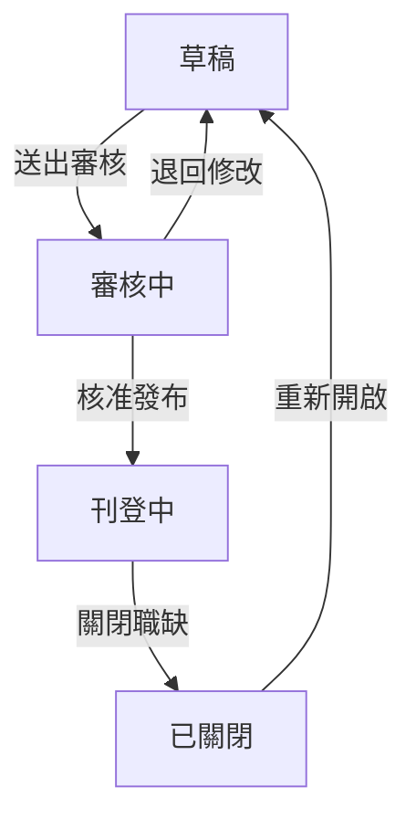
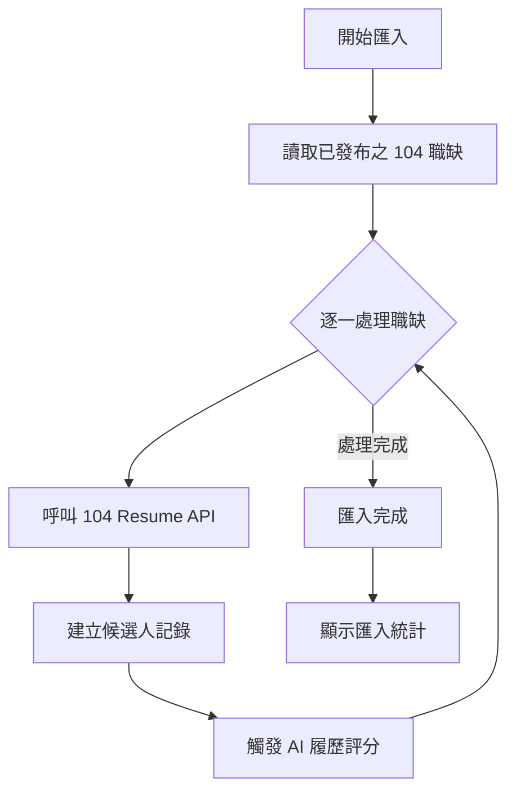
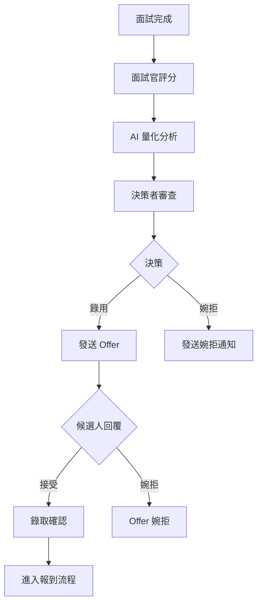
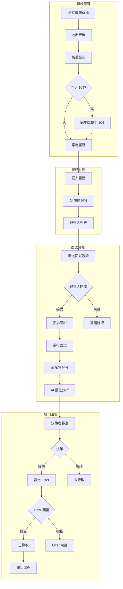

# Bombus 人力資源管理系統
# 功能說明書：招募職缺管理與 AI 智能面試

---

## 文件資訊

| 項目 | 內容 |
|------|------|
| 文件名稱 | 招募職缺管理與 AI 智能面試功能說明書 |
| 適用模組 | 員工管理 > 職缺管理、招募管理、人才庫 |
| 適用對象 | HR 人員、招募負責人、面試官、部門主管 |
| 文件版本 | v1.0 |

---

## 目錄

1. [文件目的與適用範圍](#一文件目的與適用範圍)
2. [系統導覽與入口說明](#二系統導覽與入口說明)
3. [角色權責說明](#三角色權責說明)
4. [名詞定義](#四名詞定義)
5. [第一部分：招募職缺管理](#第一部分招募職缺管理)
6. [第二部分：AI 智能面試](#第二部分ai-智能面試)
7. [附錄](#附錄)

---

## 一、文件目的與適用範圍

### 1.1 文件目的

本說明書旨在提供 Bombus 人力資源管理系統使用者完整的操作指引，涵蓋「招募職缺管理」與「AI 智能面試」兩大核心功能模組。透過本文件，使用者可了解：

- 各功能模組的操作方式與流程
- 系統欄位定義與資料規格
- 104 人力銀行整合機制
- AI 分析指標與評分邏輯

### 1.2 適用範圍

本說明書適用於以下業務場景：

- 職缺建立、審核與發布作業
- 104 人力銀行職缺同步與履歷匯入
- 候選人管理與 AI 履歷評分
- 面試評核與 AI 量化分析
- 錄用決策與 Offer 管理

---

## 二、系統導覽與入口說明

### 2.1 主要功能入口

| 功能模組 | 導覽路徑 | 說明 |
|----------|----------|------|
| 職缺管理 | 員工管理 → 職缺管理 | 建立、編輯、發布職缺；管理候選人 |
| 招募管理 | 員工管理 → 招募管理 | AI 智能面試評分與分析 |
| 人才庫 | 員工管理 → 人才庫 | 人才儲備與職缺媒合 |
| 候選人面試表單 | 由系統產生之 Token 連結或 QR Code | 候選人填寫面試前問卷 |

### 2.2 頁面功能對照

```
員工管理
├── 職缺管理
│   ├── 內部職缺列表
│   ├── 104 職缺列表
│   ├── 新增職缺
│   ├── 候選人列表（依職缺）
│   └── 職缺關鍵字管理
├── 招募管理（AI 智能面試）
│   ├── 候選人列表
│   ├── 面試評分
│   ├── AI 量化分析
│   └── 錄用決策
└── 人才庫
    ├── 人才列表
    ├── 標籤管理
    └── 職缺媒合
```

---

## 三、角色權責說明

### 3.1 HR／招募負責人

| 功能項目 | 操作權限 |
|----------|----------|
| 職缺管理 | 新增、編輯、刪除、送審、發布、關閉 |
| 104 整合 | 設定同步、匯入履歷、管理排程 |
| 候選人管理 | 查看履歷、變更狀態、發送面試邀請 |
| AI 評分 | 啟動履歷評分、查看評分報告 |
| 面試安排 | 設定面試時間、產生表單連結 |
| 錄用決策 | 發送 Offer、追蹤回覆狀態 |

### 3.2 面試官

| 功能項目 | 操作權限 |
|----------|----------|
| 候選人資料 | 查看履歷、面試表單填寫內容 |
| 面試評分 | 填寫 17 題評核、流程檢核、綜合評估 |
| 錄取建議 | 提供 Pass / Hold / Reject 建議 |
| AI 分析 | 查看 AI 量化分析結果 |

### 3.3 部門主管／決策者

| 功能項目 | 操作權限 |
|----------|----------|
| 候選人資料 | 查看履歷與評分結果 |
| AI 分析 | 查看三維分析與錄用建議 |
| 錄用決策 | 核定錄用或婉拒 |
| 狀態追蹤 | 追蹤 Offer 回覆與報到狀態 |

---

## 四、名詞定義

### 4.1 職缺相關名詞

| 名詞 | 定義 |
|------|------|
| 內部職缺 | 僅於系統內部使用之職缺，不同步至外部人力銀行，可手動新增候選人 |
| 104 職缺 | 已同步至 104 人力銀行之職缺，履歷可透過 API 自動匯入 |
| 職缺狀態 | 職缺於招募流程中的階段標記（草稿、審核中、刊登中、已關閉） |
| JD（Job Description） | 職務說明書，記載職缺之工作內容、資格條件、職能要求等 |

### 4.2 候選人相關名詞

| 名詞 | 定義 |
|------|------|
| 候選人狀態 | 候選人於招募流程中的階段標記，詳見 4.3 節 |
| AI 履歷評分 | 系統依據職缺需求自動分析履歷，產生匹配分數（0-100） |
| 匹配分數 | AI 評估候選人與職缺需求之吻合程度，分數越高代表越適合 |

### 4.3 候選人狀態定義

#### 招募流程狀態

| 狀態代碼 | 狀態名稱 | 說明 |
|----------|----------|------|
| new | 新進履歷 | 履歷剛匯入或新增，尚未處理 |
| invited | 已邀請 | 已發送面試邀請，等待候選人回覆 |
| pending-schedule | 待安排 | 候選人已回覆可參加，等待 HR 安排面試時間 |
| reschedule | 待改期 | 候選人要求更改面試時間 |
| interview | 已安排面試 | 面試時間已確定 |
| pending_ai | 待 AI 分析 | 面試官已完成評分，等待 AI 分析 |
| pending_decision | 待決策 | AI 分析完成，等待主管決策 |
| offered | 待回覆 Offer | 已發送錄取通知，等待候選人回覆 |
| offer_accepted | 已錄取同意 | 候選人接受 Offer |
| onboarded | 已報到 | 候選人已完成報到程序 |

#### 終止狀態（公司決定）

| 狀態代碼 | 狀態名稱 | 說明 |
|----------|----------|------|
| not_invited | 不邀請 | 履歷審查後決定不邀請面試 |
| not_hired | 未錄取 | 面試後決定不錄用 |

#### 終止狀態（候選人決定）

| 狀態代碼 | 狀態名稱 | 說明 |
|----------|----------|------|
| invite_declined | 邀請婉拒 | 候選人婉拒面試邀請 |
| interview_declined | 面試婉拒 | 候選人取消面試 |
| offer_declined | Offer 婉拒 | 候選人婉拒錄取通知 |

### 4.4 AI 分析相關名詞

| 名詞 | 定義 |
|------|------|
| 關鍵字匹配 | 分析候選人資料中與職缺需求關鍵字的匹配程度 |
| 語意分析 | 分析候選人回答內容的語意特徵，判斷溝通風格與態度 |
| JD 適配度 | 計算候選人技能與職缺需求條件的匹配程度 |
| 錄用建議 | 系統依據綜合分數產生之建議等級 |

---

# 第一部分：招募職缺管理

## 一、功能概述

招募職缺管理模組提供完整的職缺生命週期管理功能，包含職缺建立、審核、發布、候選人管理，以及與 104 人力銀行的整合功能。本模組為招募流程的起點，負責管理「從職缺建立到候選人進入面試」的前置作業。

### 1.1 主要功能項目

- 職缺 CRUD（新增、查詢、修改、刪除）
- 職缺狀態管理與審核流程
- 104 人力銀行職缺同步
- 104 履歷自動/手動匯入
- 候選人列表管理
- AI 履歷評分
- 手動新增候選人（內部職缺）

---

## 二、職缺管理功能

### 2.1 新增職缺

#### 操作步驟

1. 進入「職缺管理」頁面
2. 點擊「新增職缺」按鈕
3. 填寫職缺基本資訊
4. 選擇是否同步至 104（可選）
5. 若勾選同步 104，填寫 104 專屬欄位
6. 點擊「儲存草稿」

#### 基本資訊欄位

| 欄位名稱 | 必填 | 說明 |
|----------|------|------|
| 職缺名稱 | 是 | 職缺顯示名稱 |
| 部門 | 是 | 所屬部門 |
| 招募負責人 | 是 | 負責此職缺招募之人員 |
| 職務說明 | 否 | 職缺工作內容描述 |
| 關聯 JD | 否 | 可選擇已建立之職務說明書，自動帶入相關資訊 |
| 同步至 104 | 否 | 勾選後職缺將於發布時同步至 104 人力銀行 |

### 2.2 編輯職缺

已建立之職缺可進行編輯，修改基本資訊或 104 設定。若為已同步之 104 職缺，可使用「從 104 同步」功能取得最新資料。

#### 操作限制

- 「刊登中」狀態之職缺修改後將自動同步至 104
- 「已關閉」狀態之職缺需先重新開啟才能編輯

### 2.3 刪除職缺

僅「草稿」狀態之職缺可執行刪除操作。系統將顯示確認對話框，避免誤刪。

### 2.4 職缺狀態管理

#### 狀態定義

| 狀態 | 說明 | 可執行操作 |
|------|------|------------|
| 草稿（draft） | 職缺建立後的初始狀態 | 編輯、刪除、送出審核 |
| 審核中（review） | 等待主管或 HR 主管審核 | 核准發布、退回草稿 |
| 刊登中（published） | 職缺正式對外刊登 | 編輯、關閉職缺 |
| 已關閉（closed） | 職缺已停止招募 | 重新開啟 |

#### 狀態流程圖



#### 狀態變更觸發事件

| 狀態變更 | 觸發事件 |
|----------|----------|
| 草稿 → 審核中 | 無 |
| 審核中 → 刊登中 | 若有 104 設定，自動同步至 104 人力銀行 |
| 刊登中 → 已關閉 | 若已同步 104，自動下架 104 職缺 |

### 2.5 搜尋與篩選

#### 篩選條件

| 篩選項目 | 選項 |
|----------|------|
| 資料來源 | 內部職缺、104 職缺 |
| 關鍵字搜尋 | 職缺名稱、部門 |
| 部門篩選 | 依組織架構之部門清單 |
| 狀態篩選 | 草稿、審核中、刊登中、已關閉 |

---

## 三、104 人力銀行整合

### 3.1 同步職缺至 104

#### 啟用方式

於新增或編輯職缺時，勾選「同步至 104」選項，並填寫 104 專屬欄位。

#### 104 專屬欄位說明

| 欄位名稱 | 必填 | 說明 | 選項/格式 |
|----------|------|------|-----------|
| 職缺類型 | 是 | 工作性質 | 全職(1)、兼職(2)、高階主管(3) |
| 職務類別 | 是 | 104 職務分類代碼 | 依 104 職務分類表 |
| 薪資類型 | 是 | 薪資計算方式 | 面議(10)、月薪(50)、年薪(60) |
| 最低薪資 | 條件必填 | 薪資下限（非面議時必填） | 數字 |
| 最高薪資 | 條件必填 | 薪資上限（非面議時必填） | 數字 |
| 工作地點 | 是 | 104 地區代碼 | 依 104 地區分類表 |
| 學歷要求 | 是 | 最低學歷要求 | 高中以下(1)、高中職(2)、專科(4)、大學(8)、碩士(16)、博士(32) |
| 聯絡人 | 是 | 對外顯示之聯絡人姓名 | 文字 |
| 聯絡 Email | 是 | 接收應徵通知之信箱 | Email 格式 |
| 上班時段 | 否 | 工作時間設定 | 日班(1)、夜班(2)、大夜班(3)、假日班(4)、中班(5) |
| 回覆天數 | 否 | 預計回覆求職者天數 | 0(不限)、3、7、14、30 |

#### 薪資設定規則

| 職缺類型 | 薪資類型限制 |
|----------|--------------|
| 全職 | 可選擇面議、月薪、年薪 |
| 兼職 | 可選擇面議、月薪、年薪 |
| 高階主管 | 強制使用面議（104 API 規定） |

### 3.2 從 104 同步資料

對於已同步之 104 職缺，可使用「從 104 同步」功能，取得 104 端的最新職缺資料並更新至系統。

#### 同步欄位

- 職缺名稱
- 職務說明
- 薪資設定
- 職務類別
- 學歷要求
- 其他 104 專屬欄位

### 3.3 履歷匯入功能

#### 匯入方式

| 匯入方式 | 說明 |
|----------|------|
| 手動匯入 | 點擊「立即匯入」按鈕，即時從 104 同步最新履歷 |
| 自動匯入 | 設定排程，系統於指定時間自動執行匯入 |

#### 自動匯入排程設定

| 頻率 | 可設定項目 |
|------|------------|
| 每天 | 執行時間（00:00 ~ 23:00） |
| 每週 | 星期幾（可複選）+ 執行時間 |
| 每月 | 日期（1-31 號，可複選）+ 執行時間 |

#### 匯入流程



#### 匯入進度顯示

手動匯入時，系統將顯示即時進度：
- 目前處理中的職缺名稱
- 各職缺處理狀態（待處理、處理中、已完成、錯誤）
- 已匯入履歷數量
- 整體進度百分比

---

## 四、候選人管理

### 4.1 候選人列表

#### 進入方式

1. 於職缺管理頁面，點擊特定職缺的「查看候選人」按鈕
2. 系統導向該職缺之候選人列表頁面

#### 列表顯示資訊

| 欄位 | 說明 |
|------|------|
| 姓名 | 候選人姓名 |
| 應徵日期 | 履歷投遞或匯入日期 |
| 學歷 | 最高學歷 |
| 工作經驗 | 總工作年資 |
| 技能 | 主要技能標籤 |
| 匹配分數 | AI 履歷評分結果（0-100） |
| 狀態 | 候選人目前狀態 |

#### 篩選條件

| 篩選項目 | 說明 |
|----------|------|
| 關鍵字搜尋 | 姓名、學歷、技能 |
| 狀態篩選 | 依候選人狀態篩選 |
| 分數篩選 | 依匹配分數區間篩選 |

### 4.2 AI 履歷評分

#### 評分觸發方式

| 方式 | 說明 |
|------|------|
| 自動觸發 | 履歷匯入時自動執行 |
| 手動觸發 | 點擊候選人列表中的「AI 評分」按鈕 |
| 批量評分 | 勾選多位候選人後執行批量評分 |

#### 評分指標

| 指標 | 權重 | 說明 |
|------|------|------|
| 需求條件匹配 | 40% | 候選人條件與職缺需求的匹配程度 |
| 技能關鍵字 | 35% | 履歷中技能關鍵字與職缺需求的吻合度 |
| 經歷相關性 | 25% | 工作經歷與職缺需求的相關程度 |

#### 評分結果

| 分數區間 | 等級 | 說明 |
|----------|------|------|
| 80-100 | 高度匹配 | 強烈建議邀請面試 |
| 60-79 | 中度匹配 | 建議進一步評估 |
| 0-59 | 低度匹配 | 建議謹慎考慮 |

### 4.3 候選人操作

#### 可執行操作

| 操作 | 說明 | 前置條件 |
|------|------|----------|
| 查看履歷 | 檢視候選人完整履歷資料 | 無 |
| AI 評分 | 執行或重新執行 AI 履歷評分 | 無 |
| 發送邀請 | 發送面試邀請給候選人 | 狀態為 new |
| 不邀請 | 標記為不邀請面試 | 狀態為 new |
| 安排面試 | 設定面試時間與方式 | 候選人已回覆邀請 |
| 面試評分 | 進入面試評分頁面 | 狀態為 interview |

### 4.4 手動新增候選人

#### 適用條件

僅「內部職缺」可使用手動新增候選人功能。104 職缺之候選人由系統自動同步，不提供手動新增。

#### 表單結構

表單分為 4 個頁籤，包含完整的 104 履歷規格欄位：

**頁籤一：基本資料**

| 欄位 | 必填 | 說明 |
|------|------|------|
| 姓名 | 是 | 候選人中文姓名 |
| 英文姓名 | 是 | 候選人英文姓名 |
| 性別 | 是 | 男/女 |
| 生日 | 是 | 出生日期 |
| Email | 是 | 電子郵件 |
| 手機 | 是 | 行動電話 |
| 市話 | 否 | 住宅電話 |
| 聯絡方式 | 是 | 偏好聯絡方式 |
| 聯絡地址 | 是 | 通訊地址 |
| 國籍 | 是 | 國籍 |
| 兵役狀況 | 否 | 役畢/免役/未服役 |
| 駕照 | 否 | 持有駕照類型 |
| 交通工具 | 否 | 擁有交通工具 |

**頁籤二：求職條件**

| 欄位 | 必填 | 說明 |
|------|------|------|
| 希望性質 | 是 | 全職/兼職 |
| 上班時段 | 是 | 日班/夜班/輪班 |
| 輪班制度 | 是 | 是否接受輪班 |
| 可上班日 | 否 | 最快可到職日期 |
| 希望待遇 | 否 | 期望薪資 |
| 希望地點 | 否 | 期望工作地點 |
| 希望職稱 | 否 | 期望職務名稱 |
| 希望職類 | 否 | 期望職務類別 |
| 希望產業 | 否 | 期望產業類別 |
| 個人簡介 | 否 | 自我介紹 |
| 格言 | 否 | 個人座右銘 |
| 個人特色 | 否 | 特色描述 |
| 證照 | 否 | 持有證照 |

**頁籤三：學經歷**

| 欄位 | 必填 | 說明 |
|------|------|------|
| 學歷列表 | 是（至少一筆） | 學校、科系、學位、就學狀態 |
| 工作經歷 | 是（至少一筆） | 公司、職稱、產業、任職期間、工作內容 |
| 技能專長 | 否 | 技能描述 |

**頁籤四：附件與推薦人**

| 欄位 | 必填 | 說明 |
|------|------|------|
| 附件上傳 | 否 | 履歷附件（PDF、Word、圖片） |
| 推薦人 | 否 | 姓名、公司、職稱、電話、Email |

---

# 第二部分：AI 智能面試

## 一、功能概述

AI 智能面試模組整合「面試評分」、「候選人表單」與「AI 量化分析」三大功能，協助組織建立標準化的面試流程，降低主觀偏差，提升錄用決策的一致性與品質。

### 1.1 主要功能項目

- 面試官評分系統（17 題倒扣制）
- 面試流程檢核
- 綜合評估
- 候選人面試表單
- AI 三維量化分析
- 錄用決策管理
- 人才庫管理

---

## 二、面試評分系統

### 2.1 評分架構概述

面試評分採用「100 分倒扣制」，面試官依據候選人表現，針對各評核項目給予評分等級，系統自動計算扣分後得出總分。

#### 評分等級定義

| 等級 | 扣分 | 說明 |
|------|------|------|
| 優異 | 0 | 表現超越期望，無需改進 |
| 良好 | -1 | 表現符合期望，偶有小缺失 |
| 佳 | -2 | 表現尚可，有改進空間 |
| 尚可 | -3 | 表現略低於期望，需要培訓 |
| 差 | -4 | 表現明顯不足，不符合要求 |

#### 總分計算

```
總分 = 100 + Σ(各題扣分)
```

### 2.2 17 題評核項目

#### 第一類：個人修養（3 題）

| 編號 | 評核項目 | 評核重點 |
|------|----------|----------|
| 1 | 守時 | 是否準時到達面試地點 |
| 2 | 禮貌 | 言談舉止是否得體有禮 |
| 3 | 儀容 | 穿著打扮是否整潔適當 |

#### 第二類：求職意願（3 題）

| 編號 | 評核項目 | 評核重點 |
|------|----------|----------|
| 4 | 職業目標 | 是否有明確的職涯規劃 |
| 5 | 職位了解 | 是否了解應徵職位的工作內容 |
| 6 | 求職態度 | 對此職位的積極度與誠意 |

#### 第三類：綜合素質（6 題）

| 編號 | 評核項目 | 評核重點 |
|------|----------|----------|
| 7 | 執行力 | 完成任務的能力與效率 |
| 8 | 責任感 | 對工作的負責態度 |
| 9 | 反應能力 | 面對問題的應變能力 |
| 10 | 團隊意識 | 團隊合作的意願與能力 |
| 11 | 計畫性 | 工作規劃與組織能力 |
| 12 | 溝通能力 | 表達與傾聽的能力 |

#### 第四類：性格特質（2 題）

| 編號 | 評核項目 | 評核重點 |
|------|----------|----------|
| 13 | 外向親和 | 人際互動的主動性與親和力 |
| 14 | 自信心 | 對自我能力的信心程度 |

#### 第五類：專業技能（3 題）

| 編號 | 評核項目 | 評核重點 |
|------|----------|----------|
| 15 | 專業知識 | 職位所需專業知識的掌握程度 |
| 16 | 工作經驗 | 相關工作經驗的深度與廣度 |
| 17 | 解決問題能力 | 分析與解決問題的能力 |

### 2.3 面試流程檢核

面試官需勾選確認已完成以下面試流程項目：

| 編號 | 檢核項目 | 說明 |
|------|----------|------|
| 1 | 公司文化與願景介紹 | 說明公司文化、願景與工作環境 |
| 2 | 商業模式與品牌簡介 | 介紹公司業務、產品與品牌定位 |
| 3 | 組織架構與工作環境 | 說明部門架構與工作環境 |
| 4 | 職務內容與 JD 說明 | 詳細說明工作內容與職責 |
| 5 | 薪酬制度與福利 | 說明薪資結構與員工福利 |
| 6 | 管理工具說明 | 介紹使用的管理工具（如 OKR、專案報表等） |

### 2.4 綜合評估

除 17 題評核外，面試官需針對以下 10 個面向進行綜合評估：

| 編號 | 評估面向 | 說明 |
|------|----------|------|
| 1 | 整體儀態形象 | 外表、氣質、談吐的整體印象 |
| 2 | 對公司/職務了解程度 | 是否事先了解公司與職位 |
| 3 | 對應徵工作之熱誠 | 對此工作的熱情與投入意願 |
| 4 | 個人期望與公司發展方向 | 個人目標是否與公司方向契合 |
| 5 | 選擇新工作期望 | 換工作的動機與期望 |
| 6 | 人格特質與性格 | 性格是否適合團隊與工作 |
| 7 | 對問題的理解力（EQ） | 情緒智商與問題理解能力 |
| 8 | 表達能力 | 口語表達的清晰度與邏輯性 |
| 9 | 親和度 | 與人互動的親切感 |
| 10 | 專業技能評價 | 專業能力的整體評價 |

### 2.5 面試結果總評

#### 必填項目

| 項目 | 必填 | 說明 |
|------|------|------|
| 優點總評 | 是 | 候選人的主要優點與亮點 |
| 缺點總評 | 是 | 候選人的不足之處與風險 |
| 錄取建議 | 是 | Pass / Hold / Reject |
| 備註 | 否 | 其他補充說明 |

#### 錄取建議定義

| 建議 | 說明 |
|------|------|
| Pass | 建議錄取，符合職位需求 |
| Hold | 考慮中，可列入人才庫觀察 |
| Reject | 不予錄取，不符合職位需求 |

### 2.6 分數警示機制

當面試總分低於 65 分時，系統將顯示警示提醒，建議面試官審慎評估。

---

## 三、候選人面試表單

### 3.1 表單概述

候選人面試表單為面試前由候選人填寫之問卷，採 5 步驟分頁設計，共約 50 題。系統提供自動暫存與倒數計時功能，確保填寫過程順暢。

### 3.2 存取方式

| 方式 | 說明 |
|------|------|
| Token 連結 | HR 產生專屬連結，發送給候選人 |
| QR Code | HR 產生 QR Code，候選人掃描後進入表單 |

### 3.3 表單結構

**步驟一：基本資料與工作經歷**

- 基本個人資訊確認
- 工作經歷補充

**步驟二：應徵動機與一般印象（7 題）**

- 應徵此職位的動機
- 對公司的了解程度
- 對職位的期望
- 相關問題

**步驟三：工作經驗與態度**

- 經驗與潛能（11 題）
- 離職分析與期望（4 題）
- 工作態度（7 題）

**步驟四：人際互動與衝突解決**

- 人際互動（4 題）
- 衝突解決（4 題）

**步驟五：職涯規劃與願景**

- 協作、專業與挑戰（10 題）
- 職涯規劃與願景（7 題）

### 3.4 系統功能

| 功能 | 說明 |
|------|------|
| 自動暫存 | 系統每隔 1 秒自動儲存填寫進度，避免資料遺失 |
| 倒數計時 | 顯示剩餘填寫時間，預設 60 分鐘 |
| 時間鎖定 | 時間到達後自動鎖定表單，無法繼續填寫 |
| 進度追蹤 | 顯示目前填寫步驟與完成進度 |
| 資料預填 | 自動帶入候選人履歷中的基本資料 |

---

## 四、AI 量化分析

### 4.1 分析架構

AI 量化分析採用三維分析模型，分別針對「關鍵字匹配」、「語意分析」與「JD 適配度」進行評估，最終加權計算綜合分數。

#### 分析權重配置

| 分析維度 | 權重 | 說明 |
|----------|------|------|
| 關鍵字匹配 | 40% | 分析候選人資料中的關鍵字匹配情況 |
| 語意分析 | 30% | 分析回答內容的語意特徵 |
| JD 適配度 | 30% | 計算技能與職缺需求的匹配程度 |

### 4.2 關鍵字匹配分析（40%）

#### 分析內容

| 項目 | 說明 |
|------|------|
| 正向關鍵字統計 | 與職缺需求相關的正面關鍵字出現次數 |
| 負向關鍵字統計 | 可能的風險或負面關鍵字出現次數 |
| 各維度分數明細 | 各評估維度的關鍵字匹配分數 |
| 匹配關鍵字列表 | 詳列匹配到的關鍵字、所屬維度、分數、出現次數 |

#### 分數計算

```
關鍵字分數 = 基礎分(50) + 正向關鍵字加分 - 負向關鍵字扣分
```

### 4.3 語意分析（30%）

#### 分析內容

| 項目 | 說明 |
|------|------|
| 語意洞察 | 分析候選人回答的語意特徵 |
| 優勢項目 | 從回答中識別的正面特質 |
| 關注項目 | 從回答中識別的潛在風險 |
| 溝通風格 | 判斷候選人的溝通風格類型 |

#### 溝通風格類型

| 類型 | 特徵 |
|------|------|
| 自信積極型 | 表達自信、主動積極 |
| 團隊協作型 | 強調合作、重視團隊 |
| 學習成長型 | 願意學習、追求成長 |
| 中性平穩 | 表達平穩、無明顯傾向 |

#### 分數計算

```
語意分數 = 基礎分(60) + 優勢項目加分(每項+10) - 關注項目扣分(每項-10)
```

### 4.4 JD 適配度分析（30%）

#### 分析內容

| 項目 | 說明 |
|------|------|
| 匹配需求 | 候選人符合的職缺需求項目 |
| 缺少技能 | 候選人未具備的必要技能 |
| 額外技能 | 候選人具備的額外加分技能 |
| 匹配百分比 | 需求匹配度百分比 |

#### 分數計算

```
JD 適配分數 = (匹配需求數 / 總需求數) × 100 + 額外技能加分(每項+2，最高+10)
```

### 4.5 綜合評分與錄用建議

#### 綜合分數計算

```
綜合分數 = 關鍵字分數 × 0.4 + 語意分數 × 0.3 + JD 適配分數 × 0.3
```

#### 錄用建議對照表

| 分數區間 | 建議等級 | 說明 |
|----------|----------|------|
| ≥85 | 強烈推薦錄用 | 候選人高度符合職缺需求，建議優先錄用 |
| 70-84 | 推薦錄用 | 候選人符合大部分需求，建議錄用 |
| 55-69 | 待觀察 | 候選人部分符合需求，建議進一步評估或列入人才庫 |
| <55 | 不建議錄用 | 候選人與職缺需求差距較大，不建議錄用 |

### 4.6 視覺化呈現

系統提供以下視覺化分析結果：

| 項目 | 說明 |
|------|------|
| 能力雷達圖 | 以雷達圖呈現各維度評分 |
| 分數卡片 | 以卡片形式呈現三維分數與綜合分數 |
| 錄用建議卡片 | 以視覺化方式呈現錄用建議等級 |

---

## 五、錄用決策管理

### 5.1 決策選項

| 決策 | 說明 |
|------|------|
| 錄用（Offered） | 決定錄用候選人，發送 Offer |
| 婉拒（Rejected） | 決定不錄用候選人 |

### 5.2 決策流程



### 5.3 Offer 管理

#### 功能項目

| 項目 | 說明 |
|------|------|
| 發送 Offer | 系統產生 Offer 回覆連結並發送給候選人 |
| 追蹤狀態 | 追蹤候選人的 Offer 回覆狀態 |
| 回覆連結 | 候選人透過連結回覆接受或婉拒 |

---

## 六、人才庫管理

### 6.1 功能概述

人才庫用於儲存與管理潛在候選人，包含未錄取但值得保留的人才、主動投遞但暫無適合職缺的候選人等。

### 6.2 主要功能

| 功能 | 說明 |
|------|------|
| 人才列表 | 瀏覽與搜尋人才庫中的候選人 |
| 標籤管理 | 為候選人設定分類標籤 |
| 聯繫追蹤 | 記錄與候選人的聯繫歷史 |
| 職缺媒合 | AI 自動媒合適合的職缺 |

### 6.3 標籤分類

| 分類 | 說明 | 範例 |
|------|------|------|
| 技能 | 技術能力標籤 | Python、React、專案管理 |
| 經驗 | 工作經驗標籤 | 資深、主管級、跨國經驗 |
| 教育 | 學歷相關標籤 | 碩士、海外學歷 |
| 個性 | 性格特質標籤 | 積極主動、團隊合作 |
| 自訂 | 自定義標籤 | 依組織需求自行定義 |

### 6.4 聯繫狀態

| 狀態 | 說明 |
|------|------|
| 待聯繫 | 尚未聯繫的候選人 |
| 已聯繫 | 已進行聯繫的候選人 |
| 無意願 | 候選人表示無意願 |

---

# 附錄

## 附錄一：完整招募流程圖



## 附錄二：狀態對照快速參考表

### 職缺狀態

| 狀態 | 代碼 | 可執行操作 |
|------|------|------------|
| 草稿 | draft | 編輯、刪除、送審 |
| 審核中 | review | 核准、退回 |
| 刊登中 | published | 編輯、關閉 |
| 已關閉 | closed | 重新開啟 |

### 候選人狀態

| 狀態 | 代碼 | 下一步操作 |
|------|------|------------|
| 新進履歷 | new | 邀請面試/不邀請 |
| 已邀請 | invited | 等待回覆 |
| 待安排 | pending-schedule | 安排面試 |
| 已安排面試 | interview | 進行面試 |
| 待 AI 分析 | pending_ai | 等待分析 |
| 待決策 | pending_decision | 決策 |
| 待回覆 Offer | offered | 等待回覆 |
| 已錄取同意 | offer_accepted | 報到流程 |

## 附錄三：AI 分數解讀指引

| 分數 | 錄用建議 | 建議行動 |
|------|----------|----------|
| 85-100 | 強烈推薦 | 優先安排面試或錄用 |
| 70-84 | 推薦 | 正常流程評估 |
| 55-69 | 待觀察 | 深入面試或列入人才庫 |
| 0-54 | 不建議 | 謹慎評估是否繼續 |

---

## 文件結束

如有操作問題，請聯繫系統管理員或參閱線上說明。
