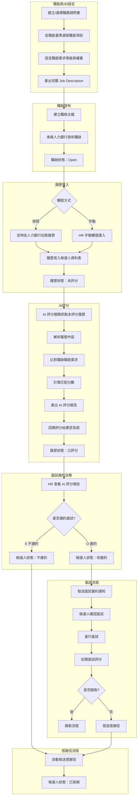
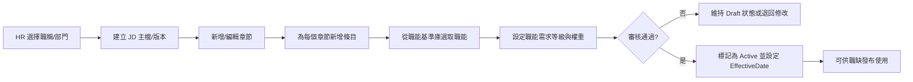
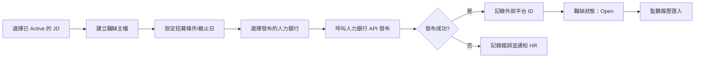
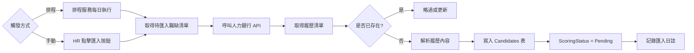
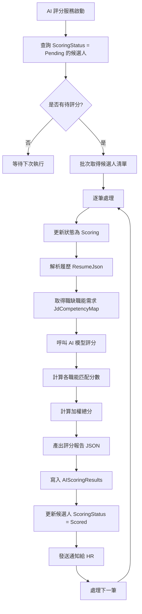
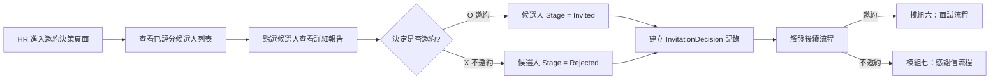
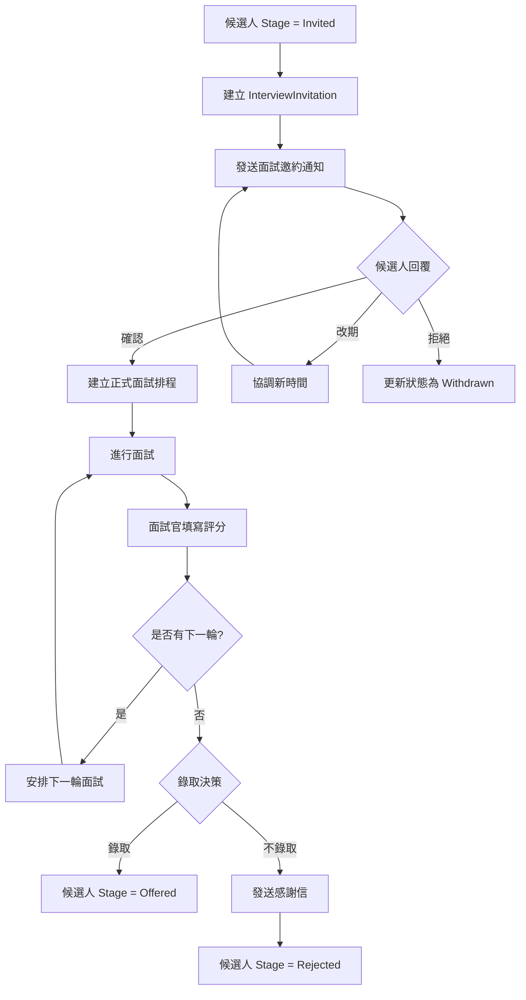
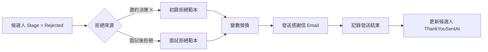
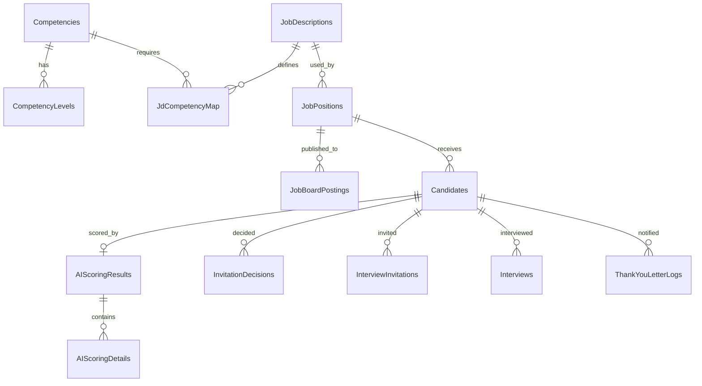

# AI 智慧招募流程模組規格書

系統版本：v1.0｜文件版次：v1.0｜更新：2025-01-02｜範圍：職務說明書 → 職能設定 → 職缺發布 → 履歷匯入 → AI 評分 → 面試邀約/感謝信

---

## 模組總覽

本模組涵蓋從職務說明書建立到招募流程完成的完整生命週期，主要流程包含：

1. **職務說明書與職能設定** — 從職務說明書選取已根據職能基準設定的職能
2. **JD 產出與職缺管理** — 根據職能產出 Job Description，發布至人力銀行
3. **履歷匯入** — 透過排程/手動方式從人力銀行匯入履歷
4. **AI 履歷評分** — 自動評分尚未評分的履歷，產出評分報告
5. **面試邀約決策** — HR 審閱 AI 評分報告，以 O/X 方式決定是否邀約
6. **後續流程** — 邀約者進入面試流程；未邀約者發送感謝信

---

## 開發原則

| 面向      | 規範                                                                                               |
|:----------|:---------------------------------------------------------------------------------------------------|
| 資料庫    | MS SQL，EF Core；主鍵 `UNIQUEIDENTIFIER`（`NEWSEQUENTIALID()`）；避免硬刪，採軟刪（`IsDeleted`）。 |
| API       | RESTful；版本前綴 `/api/v1`；JWT 認證；分頁 `?page=&pageSize=`；一致錯誤格式；審計日誌。           |
| 授權      | 角色/權限定義 + 列級過濾（RowScope）；以部門/使用者關聯動態限制資料可視。                          |
| 效能      | 履歷評分以非同步 Queue 處理；批次作業支援排程觸發。                                                |
| 備份/合規 | 履歷、評分報告版本化；操作留痕（Audits）。                                                         |

### 共通欄位規範

| 英文欄位   | 資料型態         | 屬性設定                           | 欄位描述                     |
|:-----------|:-----------------|:-----------------------------------|:-----------------------------|
| IsDeleted  | BIT              | NOT NULL, DEFAULT 0                | 軟刪除旗標（0=有效，1=已刪） |
| CreatedAt  | DATETIME2(3)     | NOT NULL, DEFAULT SYSUTCDATETIME() | 建立時間（UTC）              |
| CreatedBy  | UNIQUEIDENTIFIER | NULL, FK → Users.UserId            | 建立者                       |
| UpdatedAt  | DATETIME2(3)     | NULL                               | 最後更新時間（UTC）          |
| UpdatedBy  | UNIQUEIDENTIFIER | NULL, FK → Users.UserId            | 最後更新者                   |

---

## 完整流程圖



---

## 模組一：職務說明書與職能設定

### 1.1 模組概述

- **面向 HR/主管**：從職能基準庫選取適用職能，設定需求等級與權重，產出結構化 JD。
- **面向治理**：職能選取與 JD 版本皆可追溯，支援稽核需求。

### 1.2 必要主功能

| 功能                 | 理由                                                                 |
|:---------------------|:---------------------------------------------------------------------|
| 職能基準庫管理       | 統一管理公司核心職能定義，作為 JD 綁定的標準來源                     |
| JD 建立與版本管理    | 同一職稱可有多個版本，依生效日判斷現行版本                           |
| 職能需求綁定         | JD 中綁定「職能＋等級＋權重」，作為 AI 評分的標準依據                |
| JD 匯出              | 可匯出為 Word/PDF 供外部使用                                         |

### 1.3 功能細節

#### 1.3.1 職能基準庫（Competencies）

- **職能主檔**：
  - `CompetencyId`：主鍵
  - `Category`：職能類別（核心/專業/管理/通識）
  - `Name`：職能名稱
  - `Factors`：K/S/A（知識/技能/態度）要素，JSON 格式
  - `Description`：職能說明

- **職能等級描述（CompetencyLevels）**：
  - 每個職能對應多個等級（Level 1～Level 5）
  - 各等級有明確的能力期望描述

#### 1.3.2 職務說明書（JobDescriptions）

- **JD 主檔**：
  - `JdId`：主鍵
  - `JobTitleId`：職稱
  - `DepartmentId`：部門
  - `Version`：版本號（如 v1.0、v1.1）
  - `EffectiveDate`：生效日
  - `Status`：Draft / Active / Inactive
  - `Content`：摘要或補充描述

- **JD 章節（JobDescriptionManuals）**：
  - `SectionKey`：章節代碼（Purpose/Responsibilities/Authority/Requirements/Conditions）
  - `Title`：章節標題
  - `SortOrder`：章節排序

- **JD 條目（JobDescriptionManualItems）**：
  - `Content`：條列內容文字
  - `SortOrder`：條目排序

#### 1.3.3 職能需求綁定（JdCompetencyMap）

| 欄位           | 說明                                     |
|:---------------|:-----------------------------------------|
| JdId           | 所屬 JD                                  |
| CompetencyId   | 綁定的職能                               |
| ProficiencyReq | 需求等級（1～5）                         |
| Weight         | 權重（用於 AI 評分加權計算）             |

### 1.4 流程圖



### 1.5 資料庫設計

#### Competencies（職能主檔，具共通欄位）

| 中文欄名   | 英文欄名     | 資料型態         | Key/關聯                      | 欄位描述            |
|:-----------|:-------------|:-----------------|:------------------------------|:--------------------|
| 職能 ID    | CompetencyId | UNIQUEIDENTIFIER | PK, DEFAULT NEWSEQUENTIALID() | 主鍵                |
| 類別       | Category     | NVARCHAR(30)     | IX (Category, Name)           | 核心/專業/管理/通識 |
| 名稱       | Name         | NVARCHAR(150)    | IX                            | 職能名稱            |
| K/S/A 要素 | Factors      | NVARCHAR(800)    | NULL                          | 知識/技能/態度 JSON |
| 說明       | Description  | NVARCHAR(300)    | NULL                          | 簡述                |
| 是否啟用   | IsActive     | BIT              | IX                            | 啟用狀態            |

#### CompetencyLevels（職能等級描述，具共通欄位）

| 中文欄名   | 英文欄名     | 資料型態         | Key/關聯                                 | 欄位描述     |
|:-----------|:-------------|:-----------------|:-----------------------------------------|:-------------|
| 等級 ID    | LevelId      | UNIQUEIDENTIFIER | PK, DEFAULT NEWSEQUENTIALID()            | 主鍵         |
| 職能 ID    | CompetencyId | UNIQUEIDENTIFIER | FK → Competencies.CompetencyId, IX       | 所屬職能     |
| 等級       | Level        | TINYINT          | UQ (CompetencyId, Level)                 | 1～5         |
| 定義       | Definition   | NVARCHAR(500)    | NULL                                     | 等級能力期望 |

#### JobDescriptions（職務說明書主檔，具共通欄位）

| 中文欄名   | 英文欄名      | 資料型態         | Key/關聯                                          | 欄位描述              |
|:-----------|:--------------|:-----------------|:--------------------------------------------------|:----------------------|
| JD ID      | JdId          | UNIQUEIDENTIFIER | PK, DEFAULT NEWSEQUENTIALID()                     | 主鍵                  |
| 職稱 ID    | JobTitleId    | UNIQUEIDENTIFIER | FK → JobTitles.JobTitleId, IX                     | 職稱                  |
| 部門 ID    | DepartmentId  | UNIQUEIDENTIFIER | FK → Departments.DepartmentId, IX                 | 部門                  |
| 版本       | Version       | NVARCHAR(20)     | DEFAULT 'v1.0', IX (JobTitleId, DepartmentId, Version) | 版本號           |
| 生效日     | EffectiveDate | DATE             | IX                                                | 生效日期              |
| 狀態       | Status        | NVARCHAR(20)     | DEFAULT 'Draft', IX                               | Draft/Active/Inactive |
| 內容       | Content       | NVARCHAR(MAX)    | NULL                                              | HTML/Markdown         |

#### JdCompetencyMap（JD 職能需求綁定，具共通欄位）

| 中文欄名   | 英文欄名       | 資料型態         | Key/關聯                                           | 欄位描述       |
|:-----------|:---------------|:-----------------|:---------------------------------------------------|:---------------|
| 關聯 ID    | JdCompId       | UNIQUEIDENTIFIER | PK, DEFAULT NEWSEQUENTIALID()                      | 主鍵           |
| JD ID      | JdId           | UNIQUEIDENTIFIER | FK → JobDescriptions.JdId, IX (JdId, CompetencyId) | 所屬 JD        |
| 職能 ID    | CompetencyId   | UNIQUEIDENTIFIER | FK → Competencies.CompetencyId                     | 綁定的職能     |
| 需求等級   | ProficiencyReq | TINYINT          | IX                                                 | 1～5           |
| 權重       | Weight         | DECIMAL(5,2)     | DEFAULT 1.0                                        | AI 評分加權用  |

### 1.6 API 規格

#### POST /api/v1/jds

| 項目            | 說明                                                             |
|:----------------|:-----------------------------------------------------------------|
| 用途            | 建立職務說明書                                                   |
| 功能描述        | 新增 JD 主檔，設定職稱/部門/版本。                               |
| 輸入值          | Body：`{ jobTitleId, departmentId, version, effectiveDate, content }` |
| 輸出值          | `{ jdId, status: 'Draft' }`                                      |
| 主要資料表      | 寫：JobDescriptions                                              |

#### GET /api/v1/jds

| 項目            | 說明                                                   |
|:----------------|:-------------------------------------------------------|
| 用途            | 查詢 JD 列表（分頁）                                   |
| 功能描述        | 依 jobTitleId/departmentId/status 篩選。               |
| 輸入值          | Query：`jobTitleId, departmentId, status, page, pageSize` |
| 輸出值          | `{ items: [...], total, page, pageSize }`              |
| 主要資料表      | 讀：JobDescriptions                                    |

#### GET /api/v1/jds/{jdId}

| 項目            | 說明                                                        |
|:----------------|:------------------------------------------------------------|
| 用途            | 取得 JD 完整內容                                            |
| 功能描述        | 回傳主檔、章節、條目與職能需求。                            |
| 輸入值          | Path：`jdId`                                                |
| 輸出值          | `{ jd, manuals: [...], competencies: [...] }`               |
| 主要資料表      | 讀：JobDescriptions, JobDescriptionManuals, JdCompetencyMap |

#### POST /api/v1/jds/{jdId}/competencies

| 項目            | 說明                                                        |
|:----------------|:------------------------------------------------------------|
| 用途            | 綁定職能需求                                                |
| 功能描述        | 批次設定 JD 的職能需求等級與權重。                          |
| 輸入值          | Path：`jdId`；Body：`[{ competencyId, proficiencyReq, weight }]` |
| 輸出值          | `{ success: true, count }`                                  |
| 主要資料表      | 寫：JdCompetencyMap                                         |

#### GET /api/v1/competencies

| 項目            | 說明                                           |
|:----------------|:-----------------------------------------------|
| 用途            | 查詢職能基準庫（供 JD 選取）                   |
| 功能描述        | 依 category/關鍵字篩選可用職能。               |
| 輸入值          | Query：`category, q, isActive, page, pageSize` |
| 輸出值          | `{ items: [...], total }`                      |
| 主要資料表      | 讀：Competencies, CompetencyLevels             |

---

## 模組二：職缺發布與人力銀行串接

### 2.1 模組概述

- **面向 HR**：將 JD 轉化為職缺，一鍵發布至人力銀行（如 104）。
- **面向效率**：統一管理職缺狀態，自動同步人力銀行上的職缺資訊。

### 2.2 必要主功能

| 功能                     | 理由                                                     |
|:-------------------------|:---------------------------------------------------------|
| 職缺主檔管理             | 統一管理職缺資訊、狀態與截止日期                         |
| 人力銀行串接發布         | 透過 API 將職缺發布至 104 等人力銀行                     |
| 職缺狀態同步             | 即時同步人力銀行上的職缺狀態變更                         |
| 職缺關聯 JD              | 職缺與 JD 綁定，確保招募標準一致                         |

### 2.3 功能細節

#### 2.3.1 職缺主檔（JobPositions）

- **狀態流轉**：Draft → Open → Closed
- **關聯 JD**：每個職缺綁定一份 Active 狀態的 JD
- **人力銀行資訊**：記錄發布至外部平台的 ID 與狀態

#### 2.3.2 人力銀行串接（JobBoardIntegrations）

- **支援平台**：104、1111 等（可擴充）
- **串接方式**：
  - OAuth 2.0 認證
  - Webhook 接收履歷推送
  - 定時拉取（Polling）履歷

### 2.4 流程圖



### 2.5 資料庫設計

#### JobPositions（職缺主檔，具共通欄位）

| 中文欄名       | 英文欄名         | 資料型態         | Key/關聯                              | 欄位描述              |
|:---------------|:-----------------|:-----------------|:--------------------------------------|:----------------------|
| 職缺 ID        | JobId            | UNIQUEIDENTIFIER | PK, DEFAULT NEWSEQUENTIALID()         | 主鍵                  |
| JD ID          | JdId             | UNIQUEIDENTIFIER | FK → JobDescriptions.JdId, IX         | 關聯的 JD             |
| 職稱           | Title            | NVARCHAR(120)    | IX                                    | 職位名稱              |
| 部門 ID        | DepartmentId     | UNIQUEIDENTIFIER | FK → Departments.DepartmentId, IX     | 所屬部門              |
| 狀態           | Status           | NVARCHAR(30)     | DEFAULT 'Draft', IX                   | Draft/Open/Closed     |
| 招募說明       | Description      | NVARCHAR(MAX)    | NULL                                  | 任務/條件             |
| 開啟日期       | OpenDate         | DATE             | NULL                                  | 開始對外              |
| 截止日期       | CloseDate        | DATE             | NULL                                  | 招募截止              |
| 需求人數       | Headcount        | INT              | DEFAULT 1                             | 招募人數              |

#### JobBoardPostings（人力銀行發布記錄，具共通欄位）

| 中文欄名       | 英文欄名        | 資料型態         | Key/關聯                          | 欄位描述                 |
|:---------------|:----------------|:-----------------|:----------------------------------|:-------------------------|
| 發布 ID        | PostingId       | UNIQUEIDENTIFIER | PK, DEFAULT NEWSEQUENTIALID()     | 主鍵                     |
| 職缺 ID        | JobId           | UNIQUEIDENTIFIER | FK → JobPositions.JobId, IX       | 所屬職缺                 |
| 平台代碼       | Platform        | NVARCHAR(30)     | IX (JobId, Platform)              | 104/1111/LinkedIn 等     |
| 外部職缺 ID    | ExternalJobId   | NVARCHAR(100)    | IX                                | 人力銀行上的職缺 ID      |
| 發布狀態       | PostingStatus   | NVARCHAR(30)     | IX                                | Pending/Published/Closed |
| 發布時間       | PublishedAt     | DATETIME2(3)     | NULL                              | 成功發布的時間           |
| 最後同步時間   | LastSyncAt      | DATETIME2(3)     | NULL                              | 最後同步狀態的時間       |
| 錯誤訊息       | ErrorMessage    | NVARCHAR(500)    | NULL                              | 發布失敗時的錯誤訊息     |

#### JobBoardCredentials（人力銀行憑證設定，具共通欄位）

| 中文欄名       | 英文欄名       | 資料型態         | Key/關聯                      | 欄位描述         |
|:---------------|:---------------|:-----------------|:------------------------------|:-----------------|
| 憑證 ID        | CredentialId   | UNIQUEIDENTIFIER | PK, DEFAULT NEWSEQUENTIALID() | 主鍵             |
| 公司 ID        | CompanyId      | UNIQUEIDENTIFIER | FK → Companies.CompanyId, IX  | 所屬公司         |
| 平台代碼       | Platform       | NVARCHAR(30)     | IX (CompanyId, Platform)      | 104/1111 等      |
| 帳號           | Username       | NVARCHAR(200)    | NULL（加密儲存）              | 登入帳號         |
| 憑證/Token     | Credential     | NVARCHAR(MAX)    | NULL（加密儲存）              | OAuth Token 等   |
| 是否啟用       | IsActive       | BIT              | DEFAULT 1                     | 啟用狀態         |
| 驗證時間       | VerifiedAt     | DATETIME2(3)     | NULL                          | 最後驗證成功時間 |

### 2.6 API 規格

#### POST /api/v1/jobs

| 項目            | 說明                                                                |
|:----------------|:--------------------------------------------------------------------|
| 用途            | 建立職缺                                                            |
| 功能描述        | 建立職缺並關聯 JD。                                                 |
| 輸入值          | Body：`{ jdId, title, departmentId, description, openDate, closeDate, headcount }` |
| 輸出值          | `{ jobId, status: 'Draft' }`                                        |
| 主要資料表      | 寫：JobPositions                                                    |

#### PATCH /api/v1/jobs/{jobId}/status

| 項目            | 說明                                                |
|:----------------|:----------------------------------------------------|
| 用途            | 更新職缺狀態                                        |
| 功能描述        | Draft → Open → Closed 狀態流轉。                    |
| 輸入值          | Path：`jobId`；Body：`{ status }`                   |
| 輸出值          | `{ success: true }`                                 |
| 主要資料表      | 寫：JobPositions                                    |

#### POST /api/v1/jobs/{jobId}/publish

| 項目            | 說明                                                        |
|:----------------|:------------------------------------------------------------|
| 用途            | 發布職缺至人力銀行                                          |
| 功能描述        | 將職缺發布至指定的人力銀行平台。                            |
| 輸入值          | Path：`jobId`；Body：`{ platforms: ['104', '1111'] }`       |
| 輸出值          | `{ postings: [{ platform, postingId, status }] }`           |
| 主要資料表      | 寫：JobBoardPostings；讀：JobPositions, JobBoardCredentials |

#### POST /api/v1/jobs/{jobId}/sync

| 項目            | 說明                                           |
|:----------------|:-----------------------------------------------|
| 用途            | 同步人力銀行職缺狀態                           |
| 功能描述        | 從人力銀行拉取最新職缺狀態。                   |
| 輸入值          | Path：`jobId`                                  |
| 輸出值          | `{ postings: [{ platform, status, lastSyncAt }] }` |
| 主要資料表      | 讀/寫：JobBoardPostings                        |

---

## 模組三：履歷匯入

### 3.1 模組概述

- **面向效率**：透過排程或手動方式從人力銀行批次匯入履歷。
- **面向治理**：所有履歷統一進入候選人資料表，初始狀態為「未評分」。

### 3.2 必要主功能

| 功能                     | 理由                                             |
|:-------------------------|:-------------------------------------------------|
| 排程匯入                 | 定時從人力銀行拉取新履歷，降低人工作業           |
| 手動觸發匯入             | 支援 HR 即時匯入特定職缺的履歷                   |
| 履歷解析                 | 將人力銀行格式轉換為系統標準格式                 |
| 狀態管理                 | 新匯入履歷預設為「未評分」狀態                   |

### 3.3 功能細節

#### 3.3.1 履歷匯入流程

1. **排程觸發**：系統排程每日（可設定）檢查人力銀行是否有新履歷
2. **手動觸發**：HR 可針對特定職缺點擊「匯入履歷」
3. **呼叫人力銀行 API**：使用已設定的憑證拉取履歷
4. **履歷解析**：將履歷內容解析為標準 JSON 格式
5. **寫入資料庫**：建立 Candidates 記錄，初始 `ScoringStatus = 'Pending'`

#### 3.3.2 履歷狀態定義

| 狀態代碼       | 說明                       |
|:---------------|:---------------------------|
| Pending        | 未評分（剛匯入）           |
| Scoring        | 評分中（AI 正在處理）      |
| Scored         | 已評分                     |
| Reviewed       | 已審閱（HR 已查看報告）    |
| Invited        | 已邀約面試                 |
| Rejected       | 已拒絕（已發送感謝信）     |

### 3.4 流程圖



### 3.5 資料庫設計

#### Candidates（候選人主檔，具共通欄位）

| 中文欄名       | 英文欄名         | 資料型態         | Key/關聯                                | 欄位描述                 |
|:---------------|:-----------------|:-----------------|:----------------------------------------|:-------------------------|
| 候選人 ID      | CandidateId      | UNIQUEIDENTIFIER | PK, DEFAULT NEWSEQUENTIALID()           | 主鍵                     |
| 關聯職缺       | JobId            | UNIQUEIDENTIFIER | FK → JobPositions.JobId, IX             | 來源職缺                 |
| 姓名           | FullName         | NVARCHAR(120)    | IX                                      | 候選人姓名               |
| 電子郵件       | Email            | NVARCHAR(200)    | IX                                      | 聯絡信箱                 |
| 手機           | Mobile           | NVARCHAR(40)     | NULL                                    | 聯絡電話                 |
| 來源           | Source           | NVARCHAR(60)     | IX                                      | 104/1111/內推            |
| 外部履歷 ID    | ExternalResumeId | NVARCHAR(100)    | IX (Source, ExternalResumeId)           | 人力銀行上的履歷 ID      |
| 履歷 JSON      | ResumeJson       | NVARCHAR(MAX)    | NULL                                    | 解析後的結構化履歷       |
| 履歷原始檔 ID  | ResumeDocId      | UNIQUEIDENTIFIER | FK → Documents.DocumentId               | 原始履歷檔案             |
| 評分狀態       | ScoringStatus    | NVARCHAR(30)     | DEFAULT 'Pending', IX                   | Pending/Scoring/Scored   |
| 面試狀態       | Stage            | NVARCHAR(40)     | DEFAULT 'Collected', IX                 | Collected/Invited/Rejected |
| 匯入時間       | ImportedAt       | DATETIME2(3)     | IX                                      | 從人力銀行匯入的時間     |
| 備註           | Remark           | NVARCHAR(MAX)    | NULL                                    | HR 註記                  |

#### ResumeImportLogs（履歷匯入日誌，具共通欄位）

| 中文欄名       | 英文欄名       | 資料型態         | Key/關聯                          | 欄位描述           |
|:---------------|:---------------|:-----------------|:----------------------------------|:-------------------|
| 日誌 ID        | LogId          | UNIQUEIDENTIFIER | PK, DEFAULT NEWSEQUENTIALID()     | 主鍵               |
| 職缺 ID        | JobId          | UNIQUEIDENTIFIER | FK → JobPositions.JobId, IX       | 匯入的職缺         |
| 平台代碼       | Platform       | NVARCHAR(30)     | IX                                | 104/1111 等        |
| 觸發類型       | TriggerType    | NVARCHAR(20)     | IX                                | Scheduled/Manual   |
| 開始時間       | StartAt        | DATETIME2(3)     | IX                                | 匯入開始時間       |
| 結束時間       | EndAt          | DATETIME2(3)     | NULL                              | 匯入結束時間       |
| 新增筆數       | NewCount       | INT              | DEFAULT 0                         | 新匯入的履歷數     |
| 更新筆數       | UpdateCount    | INT              | DEFAULT 0                         | 更新的履歷數       |
| 失敗筆數       | FailedCount    | INT              | DEFAULT 0                         | 處理失敗的筆數     |
| 狀態           | Status         | NVARCHAR(20)     | IX                                | Running/Completed/Failed |
| 錯誤訊息       | ErrorMessage   | NVARCHAR(MAX)    | NULL                              | 失敗時的錯誤訊息   |

### 3.6 API 規格

#### POST /api/v1/jobs/{jobId}/import-resumes

| 項目            | 說明                                                     |
|:----------------|:---------------------------------------------------------|
| 用途            | 手動觸發履歷匯入                                         |
| 功能描述        | 從人力銀行匯入指定職缺的新履歷。                         |
| 輸入值          | Path：`jobId`；Body：`{ platforms: ['104'] }`（可選）    |
| 輸出值          | `{ logId, status: 'Running' }`                           |
| 主要資料表      | 寫：Candidates, ResumeImportLogs                         |

#### GET /api/v1/jobs/{jobId}/import-logs

| 項目            | 說明                                           |
|:----------------|:-----------------------------------------------|
| 用途            | 查詢履歷匯入日誌                               |
| 功能描述        | 查詢特定職缺的匯入歷史記錄。                   |
| 輸入值          | Path：`jobId`；Query：`page, pageSize`         |
| 輸出值          | `{ items: [...], total }`                      |
| 主要資料表      | 讀：ResumeImportLogs                           |

#### GET /api/v1/candidates

| 項目            | 說明                                                    |
|:----------------|:--------------------------------------------------------|
| 用途            | 查詢候選人列表                                          |
| 功能描述        | 依 jobId/scoringStatus/stage 篩選候選人。               |
| 輸入值          | Query：`jobId, scoringStatus, stage, q, page, pageSize` |
| 輸出值          | `{ items: [...], total }`                               |
| 主要資料表      | 讀：Candidates                                          |

---

## 模組四：AI 履歷評分

### 4.1 模組概述

- **面向效率**：自動評分尚未評分的履歷，大幅縮短 HR 篩選時間。
- **面向品質**：依據職缺綁定的職能需求，客觀計算候選人匹配度。

### 4.2 必要主功能

| 功能                     | 理由                                                   |
|:-------------------------|:-------------------------------------------------------|
| 自動抓取未評分履歷       | 批次處理待評分履歷，提升效率                           |
| 履歷內容解析             | 提取學歷、經歷、技能等關鍵資訊                         |
| 職能匹配計算             | 比對履歷與職缺職能需求，計算加權匹配分數               |
| 評分報告產出             | 產出結構化報告，包含總分、各職能分數、優缺點分析       |
| 結果回傳與狀態更新       | 將評分結果寫入系統，更新候選人狀態為「已評分」         |

### 4.3 功能細節

#### 4.3.1 AI 評分流程

1. **抓取待評分履歷**：查詢 `ScoringStatus = 'Pending'` 的候選人
2. **更新狀態為 Scoring**：標記正在處理中，避免重複處理
3. **解析履歷內容**：
   - 提取基本資料（學歷、年資、證照）
   - 提取工作經歷與專案經驗
   - 提取技能關鍵字
4. **取得職缺職能需求**：從 JdCompetencyMap 取得需求職能與權重
5. **計算匹配分數**：
   - 對每個職能計算候選人的推估等級（0～5）
   - 依公式計算加權總分：`Σ(推估等級 × 權重) / Σ(需求等級 × 權重) × 100`
6. **產出評分報告**：
   - 總匹配分數（0～100）
   - 各職能分項得分
   - 優勢分析
   - 待確認事項
   - AI 建議
7. **寫入評分結果**：更新 `ScoringStatus = 'Scored'`

#### 4.3.2 評分報告結構

```json
{
  "overallScore": 78.5,
  "competencyScores": [
    {
      "competencyId": "xxx",
      "competencyName": "專案管理",
      "requiredLevel": 3,
      "estimatedLevel": 4,
      "score": 133.3,
      "evidence": ["5年PM經驗", "PMP證照"]
    }
  ],
  "strengths": ["豐富的專案管理經驗", "具備相關證照"],
  "concerns": ["行業經驗較少", "管理團隊規模不明"],
  "recommendation": "建議邀約面試，需進一步確認行業經驗與團隊管理經歷",
  "scoredAt": "2025-01-02T10:30:00Z"
}
```

### 4.4 流程圖



### 4.5 資料庫設計

#### AIScoringResults（AI 評分結果，具共通欄位）

| 中文欄名       | 英文欄名        | 資料型態         | Key/關聯                              | 欄位描述             |
|:---------------|:----------------|:-----------------|:--------------------------------------|:---------------------|
| 評分 ID        | ScoringId       | UNIQUEIDENTIFIER | PK, DEFAULT NEWSEQUENTIALID()         | 主鍵                 |
| 候選人 ID      | CandidateId     | UNIQUEIDENTIFIER | FK → Candidates.CandidateId, IX       | 受評候選人           |
| 職缺 ID        | JobId           | UNIQUEIDENTIFIER | FK → JobPositions.JobId, IX           | 評分依據的職缺       |
| 總分           | OverallScore    | DECIMAL(5,2)     | IX                                    | 0～100               |
| 評分報告       | ReportJson      | NVARCHAR(MAX)    | NULL                                  | 完整評分報告 JSON    |
| AI 模型版本    | ModelVersion    | NVARCHAR(50)     | IX                                    | 使用的 AI 模型版本   |
| 評分時間       | ScoredAt        | DATETIME2(3)     | IX                                    | 完成評分的時間       |
| 處理耗時(ms)   | ProcessingMs    | INT              | NULL                                  | 評分處理時間         |

#### AIScoringDetails（AI 評分明細，具共通欄位）

| 中文欄名       | 英文欄名        | 資料型態         | Key/關聯                                      | 欄位描述         |
|:---------------|:----------------|:-----------------|:----------------------------------------------|:-----------------|
| 明細 ID        | DetailId        | UNIQUEIDENTIFIER | PK, DEFAULT NEWSEQUENTIALID()                 | 主鍵             |
| 評分 ID        | ScoringId       | UNIQUEIDENTIFIER | FK → AIScoringResults.ScoringId, IX           | 所屬評分         |
| 職能 ID        | CompetencyId    | UNIQUEIDENTIFIER | FK → Competencies.CompetencyId                | 評分的職能       |
| 需求等級       | RequiredLevel   | TINYINT          | NULL                                          | JD 要求的等級    |
| 推估等級       | EstimatedLevel  | DECIMAL(3,1)     | NULL                                          | AI 推估的等級    |
| 分項得分       | Score           | DECIMAL(5,2)     | NULL                                          | 該職能的得分     |
| 證據           | EvidenceJson    | NVARCHAR(MAX)    | NULL                                          | 評分依據 JSON    |

### 4.6 API 規格

#### POST /api/v1/ai-scoring/trigger

| 項目            | 說明                                                     |
|:----------------|:---------------------------------------------------------|
| 用途            | 手動觸發 AI 評分                                         |
| 功能描述        | 觸發 AI 評分服務處理待評分履歷。                         |
| 輸入值          | Body：`{ jobId }`（可選，不指定則處理所有職缺）          |
| 輸出值          | `{ triggered: true, pendingCount }`                      |
| 主要資料表      | 讀：Candidates                                           |

#### GET /api/v1/candidates/{candidateId}/scoring

| 項目            | 說明                                                     |
|:----------------|:---------------------------------------------------------|
| 用途            | 取得候選人 AI 評分結果                                   |
| 功能描述        | 回傳完整評分報告與分項明細。                             |
| 輸入值          | Path：`candidateId`                                      |
| 輸出值          | `{ scoring: {...}, details: [...] }`                     |
| 主要資料表      | 讀：AIScoringResults, AIScoringDetails                   |

#### GET /api/v1/jobs/{jobId}/scored-candidates

| 項目            | 說明                                                     |
|:----------------|:---------------------------------------------------------|
| 用途            | 查詢已評分的候選人列表（依分數排序）                     |
| 功能描述        | 取得特定職缺已評分的候選人，依總分降序排列。             |
| 輸入值          | Path：`jobId`；Query：`minScore, page, pageSize`         |
| 輸出值          | `{ items: [{ candidate, scoring }], total }`             |
| 主要資料表      | 讀：Candidates, AIScoringResults                         |

---

## 模組五：面試邀約決策

### 5.1 模組概述

- **面向 HR**：提供簡潔的 O/X 介面，快速決定是否邀約面試。
- **面向效率**：批次操作支援，一次處理多位候選人。

### 5.2 必要主功能

| 功能                     | 理由                                                   |
|:-------------------------|:-------------------------------------------------------|
| AI 評分報告檢視          | HR 可查看候選人的完整評分報告                          |
| O/X 邀約決策             | 簡單的二元選擇介面，快速決定                           |
| 批次決策                 | 支援一次選取多位候選人進行決策                         |
| 決策記錄與稽核           | 記錄決策者、時間與理由                                 |

### 5.3 功能細節

#### 5.3.1 決策介面設計

- **列表顯示**：候選人姓名、總分、關鍵職能分數、AI 建議
- **排序**：依分數高低排序，方便 HR 優先處理高分候選人
- **篩選**：可依分數區間、職能分項篩選
- **決策按鈕**：每位候選人旁有 O（邀約）/ X（不邀約）按鈕
- **批次操作**：可勾選多位候選人，一次執行相同決策

#### 5.3.2 決策流程

| 決策 | 後續動作                                               |
|:-----|:-------------------------------------------------------|
| O    | Stage → Invited，觸發面試邀約流程                      |
| X    | Stage → Rejected，觸發感謝信流程                       |

### 5.4 流程圖



### 5.5 資料庫設計

#### InvitationDecisions（邀約決策記錄，具共通欄位）

| 中文欄名       | 英文欄名       | 資料型態         | Key/關聯                              | 欄位描述           |
|:---------------|:---------------|:-----------------|:--------------------------------------|:-------------------|
| 決策 ID        | DecisionId     | UNIQUEIDENTIFIER | PK, DEFAULT NEWSEQUENTIALID()         | 主鍵               |
| 候選人 ID      | CandidateId    | UNIQUEIDENTIFIER | FK → Candidates.CandidateId, IX       | 決策對象           |
| 決策結果       | Decision       | NVARCHAR(20)     | IX                                    | Invited/Rejected   |
| 決策者 ID      | DecidedBy      | UNIQUEIDENTIFIER | FK → Users.UserId, IX                 | 做出決策的 HR      |
| 決策時間       | DecidedAt      | DATETIME2(3)     | IX                                    | 決策時間           |
| 決策理由       | Reason         | NVARCHAR(500)    | NULL                                  | 選填的理由說明     |
| 評分參考       | ScoringId      | UNIQUEIDENTIFIER | FK → AIScoringResults.ScoringId       | 決策時參考的評分   |

### 5.6 API 規格

#### POST /api/v1/candidates/{candidateId}/decision

| 項目            | 說明                                                     |
|:----------------|:---------------------------------------------------------|
| 用途            | 對單一候選人做邀約決策                                   |
| 功能描述        | 記錄決策並更新候選人狀態。                               |
| 輸入值          | Path：`candidateId`；Body：`{ decision: 'Invited'|'Rejected', reason }` |
| 輸出值          | `{ decisionId, nextAction }`                             |
| 主要資料表      | 寫：InvitationDecisions, Candidates                      |

#### POST /api/v1/candidates/batch-decision

| 項目            | 說明                                                     |
|:----------------|:---------------------------------------------------------|
| 用途            | 批次邀約決策                                             |
| 功能描述        | 一次對多位候選人做相同決策。                             |
| 輸入值          | Body：`{ candidateIds: [...], decision, reason }`        |
| 輸出值          | `{ processed: count, decisions: [...] }`                 |
| 主要資料表      | 寫：InvitationDecisions, Candidates                      |

---

## 模組六：面試流程

### 6.1 模組概述

- **面向 HR/主管**：管理面試排程、評分與錄取決策。
- **面向候選人**：收到面試邀約、確認時間、取得面試結果。

### 6.2 必要主功能

| 功能                     | 理由                                                   |
|:-------------------------|:-------------------------------------------------------|
| 面試邀約發送             | 自動發送面試邀約通知（Email/簡訊）                     |
| 面試排程管理             | 安排面試時間、地點、面試官                             |
| 面試評分紀錄             | 面試官填寫評分與建議                                   |
| 錄取決策                 | 彙總面試結果，決定是否錄取                             |

### 6.3 功能細節

#### 6.3.1 面試邀約流程

1. **決策 O 觸發**：候選人 Stage 改為 Invited
2. **建立面試邀約**：系統自動建立 InterviewInvitations 記錄
3. **發送通知**：透過 Email/簡訊發送邀約
4. **候選人回覆**：確認/改期/拒絕
5. **確認面試**：雙方確認後，建立正式面試排程

#### 6.3.2 面試評分結構

```json
{
  "dimensions": [
    { "name": "專業能力", "score": 4, "comment": "技術能力符合需求" },
    { "name": "溝通表達", "score": 3, "comment": "表達尚可" },
    { "name": "團隊合作", "score": 4, "comment": "態度積極" }
  ],
  "overallScore": 3.7,
  "recommendation": "建議錄取",
  "comments": "整體表現良好，建議進入下一輪面試"
}
```

### 6.4 流程圖



### 6.5 資料庫設計

#### InterviewInvitations（面試邀約，具共通欄位）

| 中文欄名       | 英文欄名         | 資料型態         | Key/關聯                              | 欄位描述                   |
|:---------------|:-----------------|:-----------------|:--------------------------------------|:---------------------------|
| 邀約 ID        | InvitationId     | UNIQUEIDENTIFIER | PK, DEFAULT NEWSEQUENTIALID()         | 主鍵                       |
| 候選人 ID      | CandidateId      | UNIQUEIDENTIFIER | FK → Candidates.CandidateId, IX       | 受邀候選人                 |
| 職缺 ID        | JobId            | UNIQUEIDENTIFIER | FK → JobPositions.JobId, IX           | 應徵的職缺                 |
| 邀約狀態       | Status           | NVARCHAR(30)     | DEFAULT 'Pending', IX                 | Pending/Confirmed/Cancelled |
| 建議時段       | ProposedSlots    | NVARCHAR(MAX)    | NULL                                  | 建議的面試時段 JSON        |
| 確認時間       | ConfirmedAt      | DATETIME2(3)     | NULL                                  | 候選人確認的時間           |
| 回覆期限       | ReplyDeadline    | DATETIME2(3)     | NULL                                  | 回覆截止時間               |
| 邀約訊息       | Message          | NVARCHAR(MAX)    | NULL                                  | 發送給候選人的訊息         |

#### Interviews（面試記錄，具共通欄位）

| 中文欄名       | 英文欄名        | 資料型態         | Key/關聯                          | 欄位描述         |
|:---------------|:----------------|:-----------------|:----------------------------------|:-----------------|
| 面試 ID        | InterviewId     | UNIQUEIDENTIFIER | PK, DEFAULT NEWSEQUENTIALID()     | 主鍵             |
| 候選人 ID      | CandidateId     | UNIQUEIDENTIFIER | FK → Candidates.CandidateId, IX   | 面試對象         |
| 職缺 ID        | JobId           | UNIQUEIDENTIFIER | FK → JobPositions.JobId, IX       | 應徵的職缺       |
| 面試官 ID      | InterviewerId   | UNIQUEIDENTIFIER | FK → Users.UserId, IX             | 面試官           |
| 面試輪次       | Round           | INT              | DEFAULT 1                         | 第幾輪面試       |
| 面試時間       | InterviewAt     | DATETIME2(3)     | IX                                | 面試日期時間     |
| 面試地點       | Location        | NVARCHAR(200)    | NULL                              | 實體/線上地址    |
| 評核表 JSON    | EvaluationJson  | NVARCHAR(MAX)    | NULL                              | 評分與建議       |
| 結果           | Result          | NVARCHAR(30)     | DEFAULT 'Pending', IX             | Pending/Pass/Hold/Fail |
| 備註           | Remark          | NVARCHAR(MAX)    | NULL                              | 補充說明         |

### 6.6 API 規格

#### POST /api/v1/candidates/{candidateId}/interviews

| 項目            | 說明                                                     |
|:----------------|:---------------------------------------------------------|
| 用途            | 建立面試排程                                             |
| 功能描述        | 為候選人安排面試。                                       |
| 輸入值          | Path：`candidateId`；Body：`{ interviewerId, interviewAt, location, round }` |
| 輸出值          | `{ interviewId }`                                        |
| 主要資料表      | 寫：Interviews                                           |

#### PATCH /api/v1/interviews/{interviewId}/evaluation

| 項目            | 說明                                                     |
|:----------------|:---------------------------------------------------------|
| 用途            | 更新面試評分                                             |
| 功能描述        | 面試官填寫評分與建議。                                   |
| 輸入值          | Path：`interviewId`；Body：`{ evaluationJson, result, remark }` |
| 輸出值          | `{ success: true }`                                      |
| 主要資料表      | 寫：Interviews                                           |

---

## 模組七：感謝信流程

### 7.1 模組概述

- **面向候選人**：收到婉拒通知，保持良好雇主品牌形象。
- **面向效率**：自動化發送，降低 HR 行政負擔。

### 7.2 必要主功能

| 功能                     | 理由                                                   |
|:-------------------------|:-------------------------------------------------------|
| 感謝信範本管理           | 預設範本，支援變數替換（姓名、職缺等）                 |
| 自動發送觸發             | 當候選人被標記為 Rejected 時自動發送                   |
| 發送記錄與追蹤           | 記錄發送時間、狀態、開信追蹤（可選）                   |

### 7.3 功能細節

#### 7.3.1 感謝信範本

- **變數支援**：`{{candidateName}}`、`{{jobTitle}}`、`{{companyName}}`
- **多語系支援**：依候選人偏好語言選擇範本
- **範本分類**：依拒絕階段使用不同範本
  - 初篩拒絕
  - 面試後拒絕

#### 7.3.2 發送流程

1. **觸發條件**：候選人 Stage 改為 Rejected
2. **選取範本**：依拒絕階段選擇適當範本
3. **變數替換**：將範本中的變數替換為實際值
4. **發送通知**：透過 Email 發送
5. **記錄結果**：寫入發送日誌

### 7.4 流程圖



### 7.5 資料庫設計

#### ThankYouLetterTemplates（感謝信範本，具共通欄位）

| 中文欄名       | 英文欄名       | 資料型態         | Key/關聯                      | 欄位描述             |
|:---------------|:---------------|:-----------------|:------------------------------|:---------------------|
| 範本 ID        | TemplateId     | UNIQUEIDENTIFIER | PK, DEFAULT NEWSEQUENTIALID() | 主鍵                 |
| 範本名稱       | Name           | NVARCHAR(100)    | IX                            | 範本名稱             |
| 類別           | Category       | NVARCHAR(30)     | IX                            | Screening/Interview  |
| 語言           | Language       | NVARCHAR(10)     | DEFAULT 'zh-TW'               | zh-TW/en-US          |
| 主旨           | Subject        | NVARCHAR(200)    | NULL                          | Email 主旨           |
| 內容           | Content        | NVARCHAR(MAX)    | NULL                          | Email 內容（HTML）   |
| 是否啟用       | IsActive       | BIT              | DEFAULT 1, IX                 | 啟用狀態             |

#### ThankYouLetterLogs（感謝信發送記錄，具共通欄位）

| 中文欄名       | 英文欄名       | 資料型態         | Key/關聯                              | 欄位描述             |
|:---------------|:---------------|:-----------------|:--------------------------------------|:---------------------|
| 日誌 ID        | LogId          | UNIQUEIDENTIFIER | PK, DEFAULT NEWSEQUENTIALID()         | 主鍵                 |
| 候選人 ID      | CandidateId    | UNIQUEIDENTIFIER | FK → Candidates.CandidateId, IX       | 收件候選人           |
| 範本 ID        | TemplateId     | UNIQUEIDENTIFIER | FK → ThankYouLetterTemplates.TemplateId | 使用的範本         |
| 發送時間       | SentAt         | DATETIME2(3)     | IX                                    | 發送時間             |
| 發送狀態       | Status         | NVARCHAR(20)     | IX                                    | Sent/Failed/Bounced  |
| Email          | Email          | NVARCHAR(200)    | NULL                                  | 發送到的 Email       |
| 錯誤訊息       | ErrorMessage   | NVARCHAR(500)    | NULL                                  | 發送失敗的錯誤訊息   |

### 7.6 API 規格

#### GET /api/v1/thank-you-templates

| 項目            | 說明                                           |
|:----------------|:-----------------------------------------------|
| 用途            | 查詢感謝信範本                                 |
| 功能描述        | 列出可用的感謝信範本。                         |
| 輸入值          | Query：`category, language, isActive`          |
| 輸出值          | `{ items: [...] }`                             |
| 主要資料表      | 讀：ThankYouLetterTemplates                    |

#### POST /api/v1/candidates/{candidateId}/send-thank-you

| 項目            | 說明                                                     |
|:----------------|:---------------------------------------------------------|
| 用途            | 手動發送感謝信                                           |
| 功能描述        | 手動觸發發送感謝信（自動發送失敗時可用）。               |
| 輸入值          | Path：`candidateId`；Body：`{ templateId }`（可選）      |
| 輸出值          | `{ logId, status }`                                      |
| 主要資料表      | 寫：ThankYouLetterLogs                                   |

---

## 外部整合規格

### 人力銀行 API 整合

#### 104 人力銀行

| 整合項目         | 說明                                                     |
|:-----------------|:---------------------------------------------------------|
| 認證方式         | OAuth 2.0                                                |
| 職缺發布         | POST /jobs                                               |
| 職缺更新         | PUT /jobs/{jobId}                                        |
| 職缺關閉         | DELETE /jobs/{jobId}                                     |
| 履歷拉取         | GET /resumes?jobId={jobId}&since={timestamp}             |
| Webhook          | 新履歷通知 → POST /api/v1/webhooks/104/new-resume        |

#### Webhook 簽章驗證

所有來自人力銀行的 Webhook 請求需驗證簽章：

```
X-Signature: HMAC-SHA256(payload, secret)
```

### AI 評分服務整合

| 整合項目         | 說明                                                     |
|:-----------------|:---------------------------------------------------------|
| 服務類型         | 外部 AI 引擎（Anthropic Claude / OpenAI GPT）            |
| 呼叫方式         | RESTful API                                              |
| 輸入             | 履歷 JSON + 職能需求                                     |
| 輸出             | 評分報告 JSON                                            |
| 錯誤處理         | 重試機制（最多 3 次）+ 降級處理                          |

---

## 排程作業

| 排程名稱               | 執行頻率     | 說明                                         |
|:-----------------------|:-------------|:---------------------------------------------|
| ResumeImportJob        | 每日 06:00   | 從人力銀行拉取新履歷                         |
| AIScoringJob           | 每 30 分鐘   | 處理待評分履歷                               |
| ThankYouLetterJob      | 每小時       | 發送待發送的感謝信                           |
| JobBoardSyncJob        | 每日 00:00   | 同步人力銀行職缺狀態                         |

---

## 錯誤碼一覽

| HTTP | code                 | 說明                   | 常見情境                       |
|:-----|:---------------------|:-----------------------|:-------------------------------|
| 400  | VALIDATION_ERROR     | 請求格式或參數不合法   | 必填欄位缺失                   |
| 401  | UNAUTHORIZED         | 未登入或 Token 無效    | JWT 過期                       |
| 403  | FORBIDDEN            | 已登入但無權存取       | 非 HR 角色存取招募功能         |
| 404  | NOT_FOUND            | 資源不存在             | 候選人/職缺不存在              |
| 409  | CONFLICT             | 資源衝突               | 重複匯入履歷                   |
| 422  | BUSINESS_RULE_ERROR  | 業務規則不滿足         | 職缺狀態不允許發布             |
| 429  | RATE_LIMITED         | 觸發頻率限制           | AI 評分呼叫過於頻繁            |
| 500  | INTERNAL_ERROR       | 伺服器內部錯誤         | 未預期例外                     |
| 502  | EXTERNAL_API_ERROR   | 外部 API 錯誤          | 人力銀行 API 異常              |

---

## 附錄：資料表關聯圖



---

## 版本歷史

| 版本   | 日期       | 修改內容           | 修改者 |
|:-------|:-----------|:-------------------|:-------|
| v1.0   | 2025-01-02 | 初版建立           | Claude |
