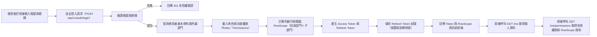
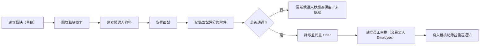
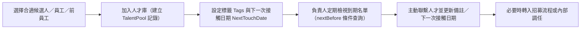
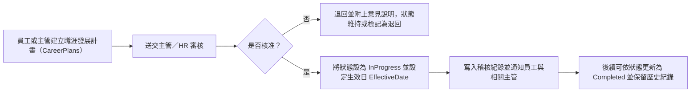

# Bombus Sass 管理系統（L0 → L5）

系統版本：v5.3.31｜文件版次：v5.3.31｜更新：2025-12-11｜範圍：
L0（核心/治理）→ L1（員工生命週期）→ L2（職能管理）→ L3（教育訓練管理）→ L4（專案管理模組）→ L5（績效管理模組）→ L6（文化管理與獎項申請支援模組）

## 開發原則

| 面向      | 規範                                                                                               |
|:----------|:---------------------------------------------------------------------------------------------------|
| 資料庫    | MS SQL，EF Core；主鍵 `UNIQUEIDENTIFIER`（`NEWSEQUENTIALID()`）；避免硬刪，採軟刪（`IsDeleted`）。 |
| API       | RESTful；版本前綴 `/api/v1`；JWT 認證；分頁 `?page=&pageSize=`；一致錯誤格式；審計日誌。           |
| 授權      | 角色/權限定義 + 列級過濾（RowScope）；以部門/使用者關聯動態限制資料可視。                          |
| 效能      | KPI/Gap/ROI 以快照或資料源快取；儀表資料源支援 SQL/API 並設定 `CacheSeconds`。                     |
| 備份/合規 | 文件（制度、面試表）版本化；文件路徑與雜湊紀錄；操作留痕（Audits）。                               |

### 共通欄位規範（通用欄位）

| 英文欄位   | 資料型態         | 屬性設定                           | 欄位描述                     |
|:-----------|:-----------------|:-----------------------------------|:-----------------------------|
| IsDeleted  | BIT              | NOT NULL, DEFAULT 0                | 軟刪除旗標（0=有效，1=已刪） |
| CreatedAt  | DATETIME2(3)     | NOT NULL, DEFAULT SYSUTCDATETIME() | 建立時間（UTC）              |
| CreatedBy  | UNIQUEIDENTIFIER | NULL, FK → Users.UserId            | 建立者                       |
| UpdatedAt  | DATETIME2(3)     | NULL                               | 最後更新時間（UTC）          |
| UpdatedBy  | UNIQUEIDENTIFIER | NULL, FK → Users.UserId            | 最後更新者                   |

**註：**下列所有標題標註「（具共通欄位）」者，皆自動包含以上欄位，為避免重複不再逐表列出。

### SQL Server 常見命名
| 前綴 | 範例 | 說明 |
|---|---|---|
| PK_ | PK_Documents_DocumentId | 主鍵 |
| FK_ | FK_DashboardCardBindings_Roles_RoleId | 外鍵 |
| UQ_ | UQ_Documents_StoragePath | 唯一索引 |
| IX_ | IX_ApiLogs_Provider_Endpoint_At | 一般索引 |
| CK_ | CK_DashboardCards_CacheSeconds_Range | 檢查約束 |
| DF_ | DF_Documents_Version_v1 | 預設值 |

### 錯誤碼一覽（最小版）
所有 API 以 `{ "code":"字符串", "message":"描述", "details":{...} }` 回應錯誤。HTTP 狀態碼與 `code` 對照如下：

| HTTP | code | 說明 | 常見情境 |
|---|---|---|---|
| 400 | VALIDATION_ERROR | 請求格式或參數不合法 | ParamSchema 驗證失敗、JSON 結構錯誤 |
| 401 | UNAUTHORIZED | 未登入或 Token 無效 | Access Token 過期或缺失 |
| 403 | FORBIDDEN | 已登入但無權存取 | ACL 拒絕、RowScope 限制 |
| 404 | NOT_FOUND | 資源不存在 | 卡片／文件／版本不存在 |
| 409 | CONFLICT | 資源衝突 | 重複名稱／版本競態 |
| 422 | UNPROCESSABLE_ENTITY | 業務規則不滿足 | 上傳雜湊不符、檔案型別不允許 |
| 429 | RATE_LIMITED | 觸發頻率限制 | 刷新／下載過於頻繁 |
| 500 | INTERNAL_ERROR | 伺服器內部錯誤 | 未預期例外 |
| 502 | DEPENDENCY_BAD_GATEWAY | 下游依賴錯誤 | 外部 API/儲存提供者異常 |
| 503 | DEPENDENCY_UNAVAILABLE | 依賴暫時不可用 | DB/外部服務暫停 |

> **CorrelationId**：錯誤回應頭會包含 `X-Correlation-Id`（或 `traceparent`），以便追蹤至 `ApiLogs`／`Audits`。

### 備註建議

| 主題          | 建議                                                                                            |
|:--------------|:------------------------------------------------------------------------------------------------|
| 索引/約束     | 依上表 UQ/IX 定義以 EF Fluent API 建立複合索引與唯一鍵。                                        |
| 交易一致性    | /offers/accept 與 /gaps/persist 等用 TransactionScope；任一步驟失敗即回滾。                     |
| 權限/列級過濾 | 基於 Roles/Permissions 的 RowScope 於查詢期注入（例如部門限定）。                               |
| 審計與遮罩    | 寫入操作必記錄 Audits；個資（Email、Mobile）必要時局部遮罩存檔。                                |
| 儀表資料源    | 避免重算，`DashboardDataSources.CacheSeconds` 建議 ≥ 60；必要時以 SQL View/Materialized Table。 |


## L0-L5 跨層流程總覽（Mermaid）

> 說明：  
> 本區整理常見的跨模組主流程，涵蓋 L0 ~ L5。  
> 各流程可視實際導入範圍選擇是否納入正式規格書。

---

### Flow 1：從招募→入職→職能評估→訓練→績效與配利

**說明：**  
描述一位新員工從招募開始，到入職、職能評估、Gap 分析、教育訓練、年度績效與配利的完整生命週期。

**涵蓋模組：**  
- L0：帳號 / 權限、通知、儀表板  
- L1：招募與候選人管理、員工檔案與歷程  
- L2：職務說明書（JD）、職能架構、職能評估與 Gap  
- L3：訓練計畫與課程、訓練成效  
- L5：考核週期與考核表、毛利與配利管理、績效儀表板  

```mermaid
flowchart LR
    A[應徵與投遞履歷\n(L1.1 招募)] --> B[面試與錄取\n(L1.1)]
    B --> C[建立員工檔案\n(L1.2 員工檔案與歷程)]
    C --> D[綁定職稱與 JD/職能需求\n(L2.2/2.3)]
    D --> E[初次職能評估與 Gap 分析\n(L2.4/2.5)]
    E --> F[建立訓練計畫與課程\n(L3.1/3.2)]
    F --> G[執行訓練與成效評估\n(L3.3/3.4)]
    G --> H[月度/年度績效考核\n(L5.3)]
    H --> I[計算年度配利與獎金\n(L5.2)]
    I --> J[管理決策儀表板檢視\n(L0.0 儀表板)]
```

### Flow 2：職務設計與 JD/職能→工作檢查清單→日常執行→績效改善

**說明：**  
描述 HR/主管如何設計職務說明書與職能要求，衍生工作檢查項目模板，最後透過日常執行與績效改善循環。

**涵蓋模組：**  
- L0：文件庫（制度文件、範本）
- L1：工作檢查清單執行與歷程
- L2：職務說明書（JD）、職能架構、工作檢查項目模板
- L3：訓練需求與課程（因應缺失）
- L5：考核構面設計、績效改善計畫 

```mermaid
flowchart LR
    A[制定職務與職等策略\n(公司政策/L0 文件庫)] --> B[設計 JD 內容\n(L2.2)]
    B --> C[定義職能需求與等級\n(L2.3/2.5)]
    C --> D[設計工作檢查項目模板\n(L2.7 Job_WorkCheckItem)]
    D --> E[排程產生工作檢查清單\n(L1.6 Job_WorkCheckList)]
    E --> F[一線人員日常執行與填寫\n(L1.6 History)]
    F --> G[統計完成率與異常趨勢\n(View or 報表)]
    G --> H[產生訓練需求與改善計畫\n(L3 + L5)]
    H --> I[調整 JD / 職能 / 檢查項目\n(L2 回寫)]
```
### Flow 3：年度訓練計畫：從職能 Gap / 戰略目標到 TTQS 執行

**說明：**  
從公司年度戰略與職能 Gap 出發，形成年度訓練計畫與課程，並依 TTQS 流程追蹤成效。

**涵蓋模組：**  
- L0：文件庫（訓練制度、戰略簡報）、儀表板
- L2：職能落差分析（Gap）
- L3：訓練需求、訓練計畫、課程、出勤與成效
- L5：訓練相關績效指標（納入考核/配利）

```mermaid
flowchart LR
    A[年度戰略與經營目標\n(L0 文件庫: 戰略簡報)] --> B[盤點關鍵職能 Gap\n(L2.5 GapAnalyses)]
    B --> C[彙整訓練需求\n(L3.1 訓練需求)]
    C --> D[制定年度訓練計畫\n(L3.1 TrainingPlans)]
    D --> E[設計與排程課程\n(L3.2 Courses)]
    E --> F[報名/出席與學習成效\n(L3.3/3.4)]
    F --> G[TTQS 文件與佐證整理\n(L3 + L0 文件庫)]
    G --> H[訓練成果回饋至職能與績效\n(L2, L5)]

```

### Flow 4：專案立案→人力安排→執行→毛利→配利

**說明：**  
描述從專案立案、人力與成本計畫，到執行過程中的 EVM 管理，最後成果進入配利計算。

**涵蓋模組：**  
- L0：專案管理辦法、報表樣板文件
- L1：員工與部門、工時記錄（若有連動）
- L2：職等 / 職能（用於人力成本與角色）
- L4：專案立案、任務管理、工時與成本、毛利/EVM
- L5：專案成果與毛利導入配利

```mermaid
flowchart LR
    A[建立專案主檔\n(L4 Projects)] --> B[設定專案預算與目標毛利\n(L4)]
    B --> C[指派專案成員與角色\n(L4 + L1 + L2)]
    C --> D[建立任務與排程\n(L4 Tasks)]
    D --> E[回報工時與成本\n(L4 工時/成本)]
    E --> F[計算 EVM 與毛利\n(L4 EVM/Margin)]
    F --> G[專案毛利匯總到部門/個人績效\n(L5)]
    G --> H[計算配利與獎金\n(L5.2)]

```
### Flow 5：風險與利害關係人管理→影響專案與績效

**說明：**  
描述專案風險與利害關係人的管理，如何在系統中被記錄、追蹤，並影響專案績效與個人績效。

**涵蓋模組：**  
- L0：風險管理政策文件、通報機制
- L4：專案風險與利害關係人、問題管理
- L5：績效評估中加入風險管理構面


```mermaid
flowchart LR
    A[建立專案風險登錄表\n(L4 Risks)] --> B[設定風險指標與應對策略\n(L4)]
    B --> C[追蹤風險狀態與問題解決紀錄\n(L4 Issues)]
    C --> D[風險狀況反映在專案績效與毛利\n(L4 KPI/EVM)]
    D --> E[專案績效指標寫入考核構面\n(L5.3 PerformanceItems)]
    E --> F[個人/團隊績效結果與配利\n(L5.2/5.3)]
```


### Flow 6：年度考核週期設定→月度考核→年度總評→獎金與調薪

**說明：**  
描述 HR 設定年度考核週期與表單，月度/季度考核累積，最後形成年度總評與調薪、獎金決策。

**涵蓋模組：**  
- L0：制度文件（考核辦法、獎金辦法）
- L1：員工與組織架構
- L5：考核週期管理、考核表、360、配利與調薪


```mermaid
flowchart LR
    A[設定年度 Performance Cycle\n(L5.3)] --> B[建立各職務考核表模板\n(L5.3)]
    B --> C[每月/每季啟動考核任務\n(L5.3 通知 + L0 通知)]
    C --> D[主管/同儕/自評填寫考核表\n(L5.3 + 5.4)]
    D --> E[系統彙總月度/季度分數\n(L5.3)]
    E --> F[年度評核會議與最終等第\n(L5)]
    F --> G[計算配利與獎金建議\n(L5.2)]
    G --> H[調薪與人事決策\n(L1 員工歷程回寫)]

```

### Flow 7：制度文件從起草→審核→公告→稽核

**說明：**  
描述新制度（如獎金辦法、考核制度、訓練辦法）在系統中起草、審核、公告與後續稽核的流程。

**涵蓋模組：**  
- L0：文件與版本管理、審核與公告、通知
- L3：教育訓練內容更新（對應新制度）
- L5：考核/配利邏輯更新


```mermaid
flowchart LR
    A[起草制度文件草案\n(L0 Documents Draft)] --> B[送審與核准流程\n(L0 Approvals)]
    B --> C[核准後產生正式版\n(L0 FileVersions)]
    C --> D[透過通知公告給相關人員\n(L0 Notifications)]
    D --> E[更新訓練與考核設定\n(L3/L5)]
    E --> F[稽核資料與執行符合度\n(L0 AuditTrails)]
```

### Flow 8：職涯發展路徑

**說明：**  
描述員工的職涯發展路徑：系統提供建議→執行培訓→晉升或調職→更新 JD 與職能要求→新一輪績效期望。

**涵蓋模組：**  
- L1：員工檔案、組織/職稱變更
- L2：職等職級、職涯助手、JD 與職能
- L3：發展型訓練計畫
- L5：發展目標與績效關聯


```mermaid
flowchart LR
    A[員工查看職涯建議\n(L2 AI 職涯助手)] --> B[選定目標職務/職級\n(L2 JobGrades/JobTitles)]
    B --> C[確認須強化的職能與 Gap\n(L2 GapAnalyses)]
    C --> D[建立個人發展計畫\n(L3 發展型訓練計畫)]
    D --> E[完成訓練與實務歷練\n(L3 + L4 專案)]
    E --> F[晉升/調職核准與異動\n(L1 EmployeeChanges)]
    F --> G[更新 JD 與職能需求\n(L2.2/2.3)]
    G --> H[新角色下的績效與配利期望\n(L5)]

```

### Flow 9：問題員工改善：從檢查清單/績效異常→改善計畫→追蹤與再評估

**說明：**  
描述當員工在工作檢查清單或績效上出現異常時，如何形成改善計畫並追蹤結果。

**涵蓋模組：**  
- L1：工作檢查清單歷程、員工出勤/異動
- L2：職能 Gap（能力不足部分）
- L3：改善用訓練措施
- L5：績效考核與改善記錄、績效事件日誌


```mermaid
flowchart LR
    A[發現工作檢查清單長期 Fail/未完成\n(L1 Job_WorkCheckList_History)] --> B[同時間績效考核偏低\n(L5.3)]
    B --> C[主管與 HR 檢視職能與行為 Gap\n(L2/ L5)]
    C --> D[建立個人改善計畫\n(L5 改善計畫 + L3 訓練)]
    D --> E[執行訓練與行為改善活動\n(L3)]
    E --> F[持續追蹤檢查清單改善狀況\n(L1 Checklist KPI)]
    F --> G[於下一次考核週期重新評估\n(L5.3)]

```

### Flow 10：系統導入初期：資料匯入→職能/職務建置→專案與績效接軌

**說明：**  
描述系統導入時，如何透過批次匯入與設定快速建立基本資料、職能與專案，再接上績效流程。

**涵蓋模組：**  
- L0：匯入 Job、設定公司主檔
- L1：Dep&Member 匯入、員工檔案
- L2：職能架構、職務說明書、檢查項目模板
- L4：現有專案與毛利歷史匯入（選擇性）
- L5：導入前期績效資料（選擇性）


```mermaid
flowchart LR
    A[設定公司主檔與系統參數\n(L0 Companies/Settings)] --> B[匯入部門與員工 Dep&Member\n(L1)]
    B --> C[建立職等/職級與職稱\n(L2.1)]
    C --> D[建立或匯入 JD 與職能架構\n(L2.2/2.3)]
    D --> E[建立工作檢查項目模板\n(L2.7)]
    E --> F[匯入現有專案與成本/毛利資料\n(L4 選用)]
    F --> G[匯入歷史績效或僅從導入年度開始\n(L5 選用)]
    G --> H[啟動首個年度考核與配利週期\n(L5)]

```

### Flow 11：管理者從儀表板 Drill-down：從公司級 KPI → 單位 → 專案 → 個人

**說明：**  
描述高階管理者如何從 L0 儀表板往下鑽，到部門、專案與個人績效，並查看背後的職能、訓練與日常執行數據。

**涵蓋模組：**  
- L0：公司級儀表板、KPI Snapshots
- L4：專案績效與毛利
- L5：部門與個人績效、配利結果
- L2 / L3 / L1：支撐績效的職能、訓練與日常執行資料

```mermaid
flowchart LR
    A[公司級儀表板 KPI\n(L0 Dashboard)] --> B[點選特定部門績效卡\n(L5 部門績效)]
    B --> C[查看該部門專案群績效與毛利\n(L4 Projects)]
    C --> D[選擇單一專案 Drill-down\n(L4 專案報表)]
    D --> E[檢視專案成員與個人績效/配利\n(L5 個人績效)]
    E --> F[查看個人職能/訓練/檢查清單記錄\n(L2/L3/L1)]

```

## L0 核心與共用模組（Core & Shared Services）

### 0.0 L0 模組定位與跨層關聯

L0 作為整個 Bombus 系統的「核心與共用層」，主要負責：

- **身分與權限（IAM）**：統一使用者／角色／權限與部門樹，為 L1～L6 所有 API 提供登入、授權與 RowScope（列級可視範圍）控制。
- **企業管理儀表板**：以「儀表卡」為單位，聚合 L1～L6 的關鍵指標，依角色／部門提供不同視角的 KPI 與趨勢圖。
- **文件管理與備份**：集中管理所有制度文件、模板、報表樣板與輸出檔，提供版本控管、權限（ACL）與 NAS／Blob 備援；L1～L6 僅做「情境使用」，不再重複實作檔案儲存。
- **系統健康監控與稽核／外部 API 日誌**：記錄誰在何時對哪個資源做了什麼操作，以及對外部服務（Google、104、AI 引擎等）的呼叫狀態與耗時，作為營運與資安稽核依據。

> **Cross-layer 關聯重點**
> - L1～L2：大量依賴 L0 的 使用者／角色／部門／RowScope，確保 HR／職能資料的存取安全。
> - L3：訓練教材、TTQS 佐證、測驗題本等，皆透過 L0 文件中心管理；課程成效與 ROI 可透過 L0 儀表板呈現。
> - L4：專案報表樣板、結案報告、配利計算表，皆以 L0 文管做版本與權限控管；專案 KPI 也會掛在 L0 儀表板。
  - L5：績效報表、配利辦法、獎金規則表單等，透過 L0 文件中心與儀表板整合。
> - L6：文化手冊、獎項申請文件與簡報範本實際檔案都存放於 L0 文件中心，L6 僅提供文化情境與獎項流程。

#### 0.0.1 L0 系統技術架構概述

- **架構分層**
  - 前端：採 Web SPA（React / Vue）與 RWD，透過 REST API 連接後端。
  - 後端：C#/.NET Core 分層架構（API 層 / Domain / Infrastructure），以模組（L0〜L6）為邏輯邊界。
  - 資料庫：MS SQL（EF Core），所有主鍵以 `UNIQUEIDENTIFIER`（`NEWSEQUENTIALID()`）為原則，採軟刪（`IsDeleted`）。

- **服務與模組劃分**
  - 單體服務階段：以模組為資料表與程式命名空間的邏輯分區（L0.Core、L1.Employees、L2.Competencies…），共用一個 DB。
  - 若未來拆分微服務：優先切出高變動區域（L1 招募 / L3 線上訓練 / L4 專案管理），L0 保持為共用核心服務（Auth / Files / Approvals / Notifications）。

- **授權與稽核實作**
  - 採 Role + RowScope 模型，由 L0 提供共用的授權中介層（Middleware）攔截 API，依使用者角色／部門／職務套用列級過濾。
  - 所有關鍵 API 寫入 `Audits`：記錄 UserId、Action、ResourceType、ResourceId、Payload 摘要與時間戳，用於事後稽核。

- **第三方服務整合**
  - 對外服務（Google、104、AI 引擎等）以 L0 的 Integration 模組統一封裝成 API Client，不在各子模組各自實作，避免重複維護。

---

### 0.1 L0 模組摘要表

| 模組代號 | 模組名稱                               | 模組描述                                                          | 主要資料表名稱                                                                                 | 代表 API（群組）                                                                                                                                                                                                                                                                                                                                       |
|:--------|:----------------------------------------|:------------------------------------------------------------------|:-----------------------------------------------------------------------------------------------|:--------------------------------------------------------------------------------------------------------------------------------------------------------------------------------------------------------------------------------------------------------------------------------------------------------------------------------------------------------|
| 0.2.1   | 企業管理儀表板（Dashboard）             | 依角色/部門產生 KPI 圖卡，執行資料源（SQL/API），支援參數與快取。 | DashboardCards / DashboardDataSources / DashboardCardBindings / Roles / Departments            | `GET /api/v1/dashboard/cards`；`GET /api/v1/dashboard/cards/{cardId}/data`；`POST /api/v1/dashboard/cards`；`POST /api/v1/dashboard/datasources`；`POST /api/v1/dashboard/bindings`                                                                                                                                                                       |
| 0.2.2   | 使用者／角色／權限（含部門樹，IAM）     | 帳號、角色、權限（含列級過濾）、登入/刷新令牌與部門組織管理。     | Users / Roles / Permissions / UserRoles / RolePermissions / RefreshTokens / Departments        | Auth：`POST /api/v1/auth/login`；`POST /api/v1/auth/refresh`；`POST /api/v1/auth/logout`；User/Role：`GET/POST /api/v1/users`，`GET/POST /api/v1/roles`，`GET/POST /api/v1/permissions`；`GET /api/v1/me`；`GET /api/v1/me/permissions`；部門：`GET /api/v1/departments/tree`；`POST /api/v1/departments`                |
| 0.2.3   | 文件管理與備份（Documents & Backup）    | 文件上傳/版本/權限/下載/刪除，與 NAS/Blob 儲存對接。              | Documents / FileVersions / DocAcl                                                              | `POST /docs/presign`；`POST /docs/{id}/versions`；`GET /docs`；`GET /docs/{id}`；`GET /docs/{id}/download-url`；`PATCH /docs/{id}/meta`；`PATCH /docs/{id}/acl`；`DELETE /docs/{id}`；`POST /docs/backup`                                                                                                                                                |
| 0.2.4   | 系統健康監控與稽核／外部 API 日誌       | 健康檢查、操作稽核查詢、第三方 API 呼叫監控。                     | Audits / ApiLogs                                                                               | `GET /healthz`；`GET /api/v1/audits`；`GET /api/v1/api-logs`                                                                                                                                                                                                                                                                                            |

---

#### 0.2 L0 各模組流程說明與 Flowchart

##### 0.2.1 企業管理儀表板

##### 簡要概述

- 面向管理層：以「卡片」快速呈現關鍵 KPI 與趨勢；不同角色/部門看到不同內容。  
- 面向使用者：卡片內容自動更新，可手動刷新；資料來自內部 SQL 或外部 API。  
- 安全與治理：卡片與資料源皆綁定權限與部門範圍，敏感資料不外露。

**Module goal**：Provide role/department-based KPI cards and charts powered by SQL or external APIs with parameterization and caching.  
**Updated on**：2025-11-16  

**模組目標**：以「儀表卡」為單位，依角色／部門顯示 KPI 與圖表；資料來源可為 SQL 或外部 API，支援參數化與快取。  
**更新日期**：2025-11-16  

##### 必要主功能

- **卡片 CRUD 與排序** — 保持儀表板一致且可維護；業務方需要依角色策展的卡片集合。  
- **資料來源設定（SQL／API）與參數結構** — 強制輸入驗證並避免注入或誤用。  
- **參數綁定與執行** — 標準化參數如何綁定到 SQL／API 呼叫，並支援測試執行。  
- **快取與手動刷新** — 避免即時重負載查詢，同時允許擁有者按需刷新。  
- **可見性綁定（角色／部門）** — 確保以最小權限存取敏感指標。  
- **時間與錯誤遙測** — 將耗時／狀態寫入 L0.3 的 ApiLogs 以利除錯，且不擴增功能。

##### 功能細節

- **卡片 CRUD 與排序**：Create/update/delete dashboard cards；維護 `SortOrder` 與 `IsActive`。  
- **資料來源設定**：定義 `SourceType=SQL|API`、`SourceText`、`ParamSchemaJson`、`CacheSeconds`。Secrets 以 Key Vault ID 參照，不允許明文。  
- **參數綁定與執行**：依 `ParamSchemaJson` 驗證參數（型別、必填、enum）；綁定成 SQL 參數或 API query/body；支援擁有者預覽。  
- **快取與手動刷新**：依 `CacheSeconds` 快取最後 payload；`POST /dashboard/cards/{cardId}/refresh` 由擁有者／管理員強制刷新。  
- **可見性綁定**：`DashboardCardBindings` 綁定卡片與 Roles／Departments；查詢時依使用者角色／部門過濾。  
- **遙測**：每次取卡片資料時，將 provider、latency、status 寫入 `ApiLogs`（交由 L0.2.4 查詢）。  

##### 主要資料表（建議命名）

- `DashboardCards`  
- `DashboardDataSources`  
- `DashboardCardBindings`  
- 共用：`Roles`、`Departments`

##### 關鍵 API（不擴大範圍）

- `GET /api/v1/dashboard/cards` — 列出當前使用者可見卡片。  
- `GET /api/v1/dashboard/cards/{cardId}/data` — 取得卡片資料（若快取有效則使用）。  
- `POST /api/v1/dashboard/cards` — 建立／更新卡片（僅管理員）。  
- `POST /api/v1/dashboard/datasources` — 建立／更新資料來源（僅管理員）。  
- `POST /api/v1/dashboard/bindings` — 綁定卡片至角色／部門（僅管理員）。  
- `POST /api/v1/dashboard/cards/{cardId}/refresh` — 手動刷新（擁有者／管理員）。  

##### 流程（Mermaid）— Flow L0.0：儀表板卡片資料讀取與快取流程

```mermaid
flowchart LR
    A[前端請求：取得儀表板卡片資料（GET /dashboard/cards/{id}/data）] --> B[權限驗證中介層]
    B --> C[載入卡片與綁定設定]
    C --> D[依角色與部門檢查可見範圍]
    D -->|拒絕| X[拒絕存取（HTTP 403）]
    D -->|通過| E[檢查快取是否仍有效]
    E -->|命中| R[回傳已快取的卡片資料]
    E -->|未命中| F[載入資料來源設定]
    F --> G[依參數設定驗證請求參數]
    G --> H{資料來源型別}
    H -->|SQL| I[執行參數化 SQL 查詢]
    H -->|API| J[呼叫外部 API]
    I --> K[整理與轉換為卡片資料格式]
    J --> K[整理與轉換為卡片資料格式]
    K --> L[寫入快取並設定 TTL]
    L --> R[回傳卡片資料給前端]
```

### 0.2 L0 各模組流程說明與 Flowchart

#### 0.2.2 使用者／角色／權限

##### 簡要概述

- 面向管理層：掌控誰能登入、看到什麼資料；權限依角色與部門規則自動生效。  
- 面向使用者：單一帳號登入即可使用所有授權功能；權限變更即時生效。  
- 安全與治理：登入採 JWT，敏感操作都有稽核；資料可視性受部門層級（RowScope）限制。

**模組目標**：提供核心身分與存取管理（IAM）：登入／刷新／登出、使用者／角色／權限管理，以及結合部門樹的 RowScope（列級）管控。  
**更新日期**：2025-11-16  

##### 必要主功能

- **Authentication (Login/Refresh/Logout)** — 建立安全 Session，並支援 Refresh Token。  
- **User CRUD & Status Toggle** — 新到職／離職管理；被盜帳號可快速鎖定。  
- **Role & Permission Management** — 集中管理模組／功能授權。  
- **RowScope Enforcement** — 依部門層級實作列級可視範圍，是 HR/職能的關鍵機制。  
- **Department Tree** — 維護組織樹，作為 RowScope 與報表基礎。  
- **Me & Permissions Introspection** — 讓前端依實際權限動態顯示／隱藏功能。  

##### 功能細節

- **Authentication**：  
  - 密碼雜湊儲存（不可明文）。  
  - 登入成功後發出 Access Token + 雜湊後的 Refresh Token。  
  - `RefreshTokens` 表記錄：UserId、到期時間、裝置指紋與 IP 等。  

- **User CRUD**：  
  - 建立／更新使用者，指定部門。  
  - `PATCH /users/{id}/status` 可鎖／解鎖帳號而不刪除。  

- **Role & Permission**：  
  - 角色（Roles）為權限集合單位。  
  - 權限（Permissions）以 `Module + Action + RowScope` 定義。  
  - 透過 `RolePermissions` 綁定角色與權限。  

- **RowScope**：  
  - 查詢時依使用者部門樹（自身部門＋子部門）注入列級過濾條件。  
  - 若請求資源超出授權 RowScope，直接拒絕。  

- **Department Tree**：  
  - `Departments` 維護 `ParentDepartmentId`、`Path`、`Depth`、`SortOrder`。  
  - 透過 `Path` 或 `Depth` 快速查詢整棵子樹。  

- **Me & Permissions**：  
  - `GET /me` 取得個人基本資料與部門。  
  - `GET /me/permissions` 回傳展開後的權限清單（模組／動作／RowScope）。  
  - 前端可快取，用來控制頁面按鈕與功能顯示。  

##### 主要資料表（建議命名）

- `Users`  
- `Roles`  
- `Permissions`  
- `UserRoles`  
- `RolePermissions`  
- `RefreshTokens`  
- `Departments`  

##### 關鍵 API（不擴大範圍）

- Auth：  
  - `POST /api/v1/auth/login`  
  - `POST /api/v1/auth/refresh`  
  - `POST /api/v1/auth/logout`  

- Users & Roles：  
  - `GET /api/v1/users`  
  - `POST /api/v1/users`  
  - `PATCH /api/v1/users/{id}/status`  
  - `GET /api/v1/roles`  
  - `POST /api/v1/roles`  
  - `GET /api/v1/permissions`  
  - `POST /api/v1/permissions`  
  - `GET /api/v1/roles/{id}/permissions`  
  - `PUT /api/v1/roles/{id}/permissions`  

- Me & Departments：  
  - `GET /api/v1/me`  
  - `GET /api/v1/me/permissions`  
  - `GET /api/v1/departments/tree`  
  - `POST /api/v1/departments`  

##### Flow L0.01：登入與 RowScope 權限取得流程（Mermaid）



#### 0.2.3 文件管理與備份（模組小節｜整併最終版）
#####  簡要概述
- 目的：統一文件儲存、版本控制、權限治理與安全下載；支援 NAS / Azure Blob 等多儲存提供者。
- 原則：版本不可覆寫；ACL 可審計；提供手動備份端點（排程備份另案實作）。
- 作為全系統唯一的「文件中心」，L1～L6 的所有附件（HR 規章、職能樣板、訓練教材、專案報表、績效工具、文化文件、獎項申請書等）皆透過本模組管理，不各自落地檔案。

**模組目標**：提供全系統共用的文件管理中心，涵蓋上傳、版本控管、權限（ACL）、安全下載與備份觸發，避免各模組重複實作檔案儲存機制。
**更新日期**：2025-11-16

##### 必要主功能

- **文件上傳與版本管理** — 確保所有制度／範本／輸出檔有歷史可追蹤，不被覆寫。
- **權限（ACL）管理** — 文件可依 Role / Dept / User 控管存取，滿足資安／合規需求。
- **安全下載與短時效連結** — 避免固定 URL 洩漏與越權存取。
- **Meta / 標籤管理** — 以 Category / BusinessCode / 標籤管理大量文件，支援搜尋與對照。
- **手動備份觸發** — 提供 API 讓管理者可手動觸發一次備份／同步至 NAS。
- **與 L6 文化／獎項模組的分類勾稽** — 文化／獎項相關檔案在實體上仍走 L0 文件中心，只在 L6 以分類／情境呈現。


##### 功能細節

- **兩階段上傳流程**
  1. POST /docs/presign：建立暫存文件並回傳 docId，同時取得預簽名上傳資訊（uploadUrl, storageKey, expiresIn）。
  2. 前端將檔案 PUT 至實際 Storage；完成後呼叫 POST /docs/{id}/versions 建立版本紀錄。

- **版本管理**
  1. Documents：只保留最新摘要（Category, BusinessCode, Title, LatestVersionNo, UploaderId, UploadedAt）。
  2. FileVersions：紀錄每一版的 VersionNo, StorageKey, HashSHA256, Mime, SizeBytes, 備註。
  3. 版本號以整數累加（1, 2, 3…），不可覆寫；需要回滾時改以「指定版本下載」或「再發佈新版本」實作。

- **ACL 管理**
  1. DocAcl：ScopeType = Role / Dept / User；ScopeId = 對應 ID；Perms = Read / Write / Manage。
  2. 實作唯一約束 UQ(DocId, ScopeType, ScopeId) 避免重複授權。
  3. 如需相容舊欄位，可保留 Documents.AllowedRolesJson 作為暫時參考，但新的 ACL 一律以 DocAcl 為主。

- **下載與權限檢查**
  1. GET /docs/{id}/download-url：
    - 先依 DocId + 使用者身分套用 ACL 檢查。
    - 通過後產生短時效簽名 URL（例如 5～15 分鐘），前端以該 URL 直接下載，避免長期暴露路徑。
  2. 可選擇指定版本 ?version=3 下載歷史版本。

- **Meta / 標籤管理**
  1. 支援更新 Title / 描述 / 標籤（Tag）等 Meta 資訊，不影響實際檔案版本。
  2. Category / BusinessCode 規範如下段落「HR／職能附件與 Category／BusinessCode 對應」。

- **備份觸發**
  1. POST /docs/backup：供系統管理者手動觸發一次備份工作（實際備份由後端 Worker 或排程任務處理）。
  2. 備份紀錄可寫入 Audits（Action = DOC_BACKUP_TRIGGER）。

##### 主要資料表（建議命名）
  - Documents — 文件主檔／最新摘要。
  - FileVersions — 文件歷史版本。
  - DocAcl — 文件權限設定。

##### 關鍵 API（不擴大範圍）
- 上傳與版本：
  1. POST /api/v1/docs/presign
  2. POST /api/v1/docs/{id}/versions
  3. GET /api/v1/docs
  4. GET /api/v1/docs/{id}
  5. GET /api/v1/docs/{id}/versions

- 權限與下載：
  1. GET /api/v1/docs/{id}/download-url
  2. PATCH /api/v1/docs/{id}/meta
  3. PATCH /api/v1/docs/{id}/acl
  4. DELETE /api/v1/docs/{id}（軟刪）

- 備份：
  1. POST /api/v1/docs/backup

##### Flow L0.02：文件上傳、版本建立與下載流程
```mermaid
flowchart LR
    A[畫面：建立新文件] --> B[送出預先簽名請求（POST /docs/presign）]
    B --> C{ACL 權限檢查}
    C -- 通過 --> D[回傳 uploadUrl, storageKey, expiresIn, docId]
    C -- 拒絕 --> X[拒絕存取（HTTP 403）]
    D --> E[前端上傳檔案至儲存空間（PUT uploadUrl）]
    E --> F[回報建立版本（POST /docs/{docId}/versions）]
    F --> G[建立版本紀錄（版號、檔案雜湊、大小、建立者）並更新 Documents.LatestVersionNo]
    G --> H[前端請求下載網址（GET /docs/{docId}/download-url?version=latest）]
    H --> I{ACL 權限檢查}
    I -- 通過 --> J[產生短時效簽名網址並回傳]
    I -- 拒絕 --> X
```
##### HR／職能附件與 Category／BusinessCode 對應（與 L1～L6 關聯）
- 為了讓原廠提供的 HR／職能／績效相關附件能直接落到系統文件庫，本模組對 Category 與 BusinessCode 約定如下（實際欄位在 Documents 表中）：
  - Category 使用建議（
    - HR-Policy：HR 規章制度、管理辦法類 PDF，例如「招募任用管理辦法」、「職能基準管理辦法」等。
    - HR-Form：HR 作業表單樣板（請假單、面談紀錄表…）。
    - HR-Competency：職能相關樣板（由 職能相關資料.zip／Competency.zip 匯入的說明文件或示意表）。
    - HR-Training：教育訓練相關附件（例如 L03教育訓練管理.zip 中的講義、TTQS 佐證範例）。
    - PERF-Tool：績效與配利工具類檔案，例如「績效考核制度與工具 企業主分享會.pdf」、「配利統計總表.xlsx」、「BS_獎金辦法2025年.xlsx」等。
    - PERF-ReportTpl：報表樣板與示例，例如「邦鉑專案管理系統_20250626.xlsx」、「從零開始的專案報表術 講義印刷版.pdf」。
    - JD_EXPORT：由 L2「職務說明書」模組匯出的 JD PDF/Word。
    - WORKCHECKLIST_EXPORT：由 L1/L2「工作檢查清單」模組匯出的檢查清單 PDF/報表。
    - CULTURE-Guide：文化管理與企業價值相關簡報／講義，例如 L6 文化管理模組說明、文化推動手冊等。
    - CULTURE-Case：內部文化案例彙編、故事集，作為後續撰寫獎項申請書或文化報告的素材來源。
    - AWARD-List：公司彙整之可申請獎項列表，例如「台灣企業獎項_勝威光電.xlsx」等。
    - AWARD-Checklist：各獎項申請文件與負責單位的對照清單，例如「邦鉑科技_2025年度各類獎項申請文件 對照清單.xlsx」。
    - AWARD-Schedule：獎項年度時程與重要截止日，例如「獎項時程.xlsx」。
    - AWARD-Template：各獎項申請表問題彙整、回答結構樣板（例如 Word/Excel 版題目列表與回答欄位）。

##### BusinessCode 使用建議

- 若原文件已有正式編號（例如 HR 規章的 Bombus-ISMS-HR-2-003），則填入 BusinessCode，以利查詢與跨文件對照。
-  沒有正式編號時可留白，或依公司慣例填入自訂代碼（例如 PERF-TOOL-2025-01、REPORT-TRAINING-0001）。

##### 匯入原廠附件的實務建議

- 導入時由管理者將原廠提供之 PDF／簡報／Excel 逐一上傳至文件庫，並依上列規則設定 Category 與（若有）BusinessCode。
- 若附件以壓縮檔提供（如 職能相關資料.zip、Dep&Member.zip 等），先解壓並分類：
  - 結構化資料（部門、人員、職能定義 Excel）由 L1/L2 提供匯入功能；
  - 說明／範例文件則上傳至 Documents 以對應 Category 管理。
- L1～L5 在說明「依某項管理辦法／工具設計」時，可直接引用 Documents 中的 BusinessCode 與 Title，維持制度與系統的一致性。

##### 與其他模組的關聯

- L1 員工模組：員工相關制度、表單、簽核書面文件皆透過本模組上傳與管理。
- L2 職能模組：職能說明文件、職務說明書輸出（JD_EXPORT）、工作檢查清單輸出（WORKCHECKLIST_EXPORT）皆依此模組的檔案機制。
- L3 教育訓練：課程講義、教材、TTQS 佐證文件等使用 HR-Training / PERF-ReportTpl 類別統一管理。
- L4 專案管理：專案報表匯出、里程碑簡報檔可分類為 PERF-ReportTpl 或專案自訂類別。
- L5 績效與配利：績效工具、配利 Excel 模板以 PERF-Tool 類別儲存。
- L6 文化與獎項：文化案例彙編、獎項申請書與題目模板等，依 CULTURE-*、AWARD-* 類別落在本模組。

#### 0.2.4 系統健康監控與稽核／外部 API 日誌

##### 簡要概述

- 面向管理層：可一眼看服務是否運行正常；快速定位異常。  
- 面向使用者：錯誤能被快速發現與修復，降低服務中斷。  
- 安全與治理：所有關鍵操作與外部依賴呼叫都有記錄，可追蹤到個別請求。  

**Module goal**：Provide operational visibility via health checks, audit log queries, and external API call logs.  
**Updated on**：2025-11-16  

**模組目標**：提供最小可用的營運可視性：健康檢查、操作稽核查詢、外部 API 呼叫日誌，並串接 CorrelationId 以完整追蹤請求。  
**更新日期**：2025-11-16  

##### 必要主功能

- **Health Check Endpoint** — 為負載平衡器與監控工具提供 liveness/readiness 訊號。  
- **Audit Log Query** — 追蹤「誰在什麼時候對什麼資源做了什麼」，支援資安稽核與事故調查。  
- **API Log Query** — 觀察對外服務（Google、104、AI 引擎等）的呼叫狀態與耗時，快速發現外部依賴問題。  
- **Correlation Id Propagation** — 將前端一個請求的全鏈路操作（內部 API、外部 API）串起來。  
- **Time-window Filtering & Paging** — 以時間區間與分頁查詢，避免全表掃描造成效能問題。  

##### 功能細節

- **健康檢查 Health Check**
  - `GET /healthz`：回報系統基本狀態。  
  - 若關鍵依賴（DB、檔案儲存、訊息佇列…）不可用，可回傳 500 供 LB 下線節點。  

- **操作稽核 Audit Logs**
  - 每一個關鍵業務操作（例如：新增/修改/刪除人員、職能、專案、績效調整、獎金結算觸發、獎項申請書產出等）皆寫入 `Audits`。  
  - 欄位包含：`UserId, Module, Action, ResourceType, ResourceId, Payload 摘要, CorrelationId, IpAddress, UserAgent, CreatedAt`。  
  - Payload 僅保留必要的變更摘要，敏感字段須遮罩或省略（例如薪資、身分證字號等）。  

- **外部 API 日誌 ApiLogs**
  - 針對所有對外呼叫（如 104、Google、AI 引擎）記錄：`Provider, Endpoint, RequestPayload, ResponsePayload, StatusCode, DurationMs, ErrorMessage, CorrelationId`。  
  - `RequestPayload` / `ResponsePayload` 實作前必須先經過敏感資料遮罩（PII masking），具體規則可由 `SystemSettings.SensitiveFieldName` 或設定檔提供。  
  - 透過 `CorrelationId` 連回對應的 `Audits` 與前端請求。  

- **CorrelationId 規則**
  - 若前端已在 Header 帶入 `X-Correlation-Id` 則沿用；否則由 API Gateway 或後端產生新的 GUID。  
  - 在回應 Header 也帶出 `X-Correlation-Id`，方便前端與運維查詢。  
  - 對外呼叫時將此 `CorrelationId` 一併寫入 `ApiLogs`，必要時也可以加入對外 Header（若合規）。  

- **查詢與分頁**
  - 查詢 Audit/API Logs 時，需要至少提供 `from` / `to`（時間區間）與分頁參數 `page, pageSize`；若無時間區間則限制可查詢的最長期間（例如預設 7 日）。  
  - 支援依 `Module`、`UserId`、`Provider`、`StatusCode` 等條件組合篩選，避免一次撈出大量資料。  

##### 主要資料表（建議命名）

- `Audits` — 操作稽核紀錄。  
- `ApiLogs` — 對外 API 呼叫紀錄。  

> 註：兩者皆具「共通欄位」（`CreatedAt, CreatedBy, IsDeleted` 等），符合全系統一致性。  

###### Audits（具共通欄位）

| 中文欄名   | 英文欄名      | 資料型態         | Key/關聯                      | 欄位描述                  |
|:-----------|:--------------|:-----------------|:------------------------------|:--------------------------|
| 稽核 ID    | AuditId       | UNIQUEIDENTIFIER | PK, DEFAULT NEWSEQUENTIALID() | 主鍵                      |
| 使用者 ID  | UserId        | UNIQUEIDENTIFIER | FK → Users.UserId, IX         | 操作人                    |
| 模組       | Module        | NVARCHAR(40)     | IX                            | L0/L1/L2/L3/L4/L5/L6      |
| 動作       | Action        | NVARCHAR(40)     | IX                            | Create/Update/Delete/View |
| 資源類型   | ResourceType  | NVARCHAR(80)     | IX                            | 例如 Employee, Project    |
| 資源 ID    | ResourceId    | NVARCHAR(64)     | IX                            | 對應實體主鍵或業務代碼    |
| 內容摘要   | Payload       | NVARCHAR(MAX)    | NULL                          | JSON 變更摘要（已遮罩）   |
| 關聯 ID    | CorrelationId | NVARCHAR(64)     | IX                            | 追蹤請求                  |
| IP         | IpAddress     | NVARCHAR(64)     | -                             | 來源 IP                   |
| User-Agent | UserAgent     | NVARCHAR(200)    | -                             | 裝置資訊                  |

###### ApiLogs（具共通欄位）

| 中文欄名   | 英文欄名        | 資料型態         | Key/關聯                      | 欄位描述             |
|:-----------|:----------------|:-----------------|:------------------------------|:---------------------|
| 日誌 ID    | LogId           | UNIQUEIDENTIFIER | PK, DEFAULT NEWSEQUENTIALID() | 主鍵                 |
| API 提供者 | Provider        | NVARCHAR(50)     | IX                            | Google/104/AI-Engine |
| 端點       | Endpoint        | NVARCHAR(200)    | -                             | 呼叫 URL 或路由識別 |
| 請求內容   | RequestPayload  | NVARCHAR(MAX)    | NULL                          | JSON 請求（已遮罩） |
| 回應內容   | ResponsePayload | NVARCHAR(MAX)    | NULL                          | JSON 回應（已遮罩） |
| 狀態碼     | StatusCode      | INT              | IX                            | HTTP 狀態碼          |
| 持續時間   | DurationMs      | INT              | -                             | 毫秒                 |
| 錯誤訊息   | ErrorMessage    | NVARCHAR(500)    | NULL                          | 若失敗               |
| 關聯 ID    | CorrelationId   | NVARCHAR(64)     | IX                            | 與 Audits 對應       |

> 🔐 **安全性要求：RequestPayload / ResponsePayload 敏感資料遮罩**  
> - 實作時，寫入 `ApiLogs` 與 `Audits.Payload` 之前，系統必須對下列資訊進行遮罩或移除：  
>   - 密碼欄位（如 `password`、`pinCode` 等）  
>   - 身分證字號、護照號碼、銀行帳號等個資  
>   - 其他由 `SystemSettings.SensitiveFieldName` 清單所定義的欄位  
> - Logs 中僅保留必要的欄位名稱與結構，用於除錯與稽核，不得保留可直接識別個人的明文資料。  

##### 關鍵 API（不擴大範圍）

- 健康檢查：
  - `GET /healthz`  

- 稽核查詢：
  - `GET /api/v1/audits?userId=&module=&action=&from=&to=&page=&pageSize=`  

- 外部 API 日誌查詢：
  - `GET /api/v1/api-logs?provider=&endpoint=&status=&from=&to=&page=&pageSize=`  

> 註：實際路徑可依整體 API 命名風格調整，例如將 `/healthz` 放在根路徑或 `/api/v1/healthz`。  

##### Flow L0.03：Audit & External API Logs Search

```mermaid
flowchart TD
    A[管理者開啟 稽核/外部 API 日誌畫面] --> B[/GET /api/v1/audits?filters.../]
    A --> C[/GET /api/v1/api-logs?filters.../]
    B --> D[伺服器依時間區間與條件查詢 Audits（分頁）]
    C --> E[伺服器依時間區間與條件查詢 ApiLogs（分頁）]
    D --> F[回傳稽核列表（已遮罩敏感欄位）]
    E --> G[回傳外部 API 日誌列表（含狀態與耗時）]
    F --> H[管理者選取某筆紀錄 /GET /api/v1/audits/{id}]
    G --> I[管理者選取某筆紀錄 /GET /api/v1/api-logs/{id}]
    H --> J[顯示單筆稽核詳情（含 Payload 摘要與 CorrelationId）]
    I --> K[顯示單筆 API 呼叫詳情（含錯誤訊息與 CorrelationId）]
    J --> L[若需要，依 CorrelationId 交叉查詢相關 API Logs]
    K --> L
```

### 0.3 L0 系統技術架構概述

#### 簡要概述

- **架構分層**  
  - 前端：採 Web SPA（React / Vue）與 RWD，透過 REST API 連接後端。  
  - 後端：C#/.NET Core 分層架構（API 層 / Domain / Infrastructure），以模組（L0〜L6）為邏輯邊界。  
  - 資料庫：MS SQL（EF Core），所有主鍵以 `UNIQUEIDENTIFIER`（`NEWSEQUENTIALID()`）為原則，採軟刪（`IsDeleted`）。  

- **服務與模組劃分**  
  - **單體服務階段**：  
    - 以模組為資料表與程式命名空間的邏輯分區（如 `L0.Core`, `L1.Employees`, `L2.Competencies`…），共用一個 DB。  
  - **未來微服務演進（選項，非當前必須）**：  
    - 優先切出高變動區域（L1 招募 / L3 線上訓練 / L4 專案管理），L0 保持為共用核心服務（Auth / Files / Approvals / Notifications）。  

- **授權與稽核實作**  
  - 採 Role + RowScope 模型，由 L0 提供共用的授權中介層（Middleware）攔截 API，依使用者角色／部門／職務套用列級過濾。  
  - 所有關鍵 API 寫入 `Audits`：記錄 UserId、Action、ResourceType、ResourceId、Payload 摘要與時間戳，用於事後稽核。  

- **第三方服務整合**  
  - 對外服務（Google、104、AI 引擎等）以 L0 的 Integration 模組統一封裝成 API Client，不在各子模組各自實作，避免重複維護。  

---

### L0.4 資料庫設計（MSSQL）

> 說明：本節列出 L0 共用資料表，皆遵守「共通欄位」規範（`CreatedAt, CreatedBy, UpdatedAt, UpdatedBy, IsDeleted` 等）。  
> 各模組（L1〜L6）於自身章節引用時不再重複細節。

#### 0.4.1 Departments（部門樹）

| 中文欄名      | 英文欄名           | 資料型態         | Key/關聯                      | 欄位描述             |
|:--------------|:-------------------|:-----------------|:------------------------------|:---------------------|
| 部門 ID       | DepartmentId       | UNIQUEIDENTIFIER | PK, DEFAULT NEWSEQUENTIALID() | 部門主鍵             |
| 上層部門 ID   | ParentDepartmentId | UNIQUEIDENTIFIER | FK → Departments.DepartmentId | 樹狀父節點           |
| 代碼          | DeptCode           | NVARCHAR(30)     | UQ                            | 人資/財會代碼        |
| 名稱          | DeptName           | NVARCHAR(120)    | IX                            | 顯示名稱             |
| 主管使用者 ID | ManagerUserId      | UNIQUEIDENTIFIER | FK → Users.UserId             | 部門主管             |
| 路徑          | Path               | NVARCHAR(400)    | IX                            | 如 `/HQ/HR/Recruit`  |
| 深度          | Depth              | INT              | DEFAULT 0                     | 樹深                 |
| 排序          | SortOrder          | INT              | DEFAULT 0                     | 顯示順序             |
| 啟用          | IsActive           | BIT              | DEFAULT 1                     | 是否啟用             |

---

#### 0.4.2 Users（使用者）

| 中文欄名   | 英文欄名     | 資料型態         | Key/關聯                      | 欄位描述           |
|:-----------|:-------------|:-----------------|:------------------------------|:-------------------|
| 使用者 ID  | UserId       | UNIQUEIDENTIFIER | PK, DEFAULT NEWSEQUENTIALID() | 主鍵               |
| 姓名       | FullName     | NVARCHAR(100)    | IX                            | 顯示姓名           |
| 信箱       | Email        | NVARCHAR(200)    | UQ                            | 登入帳號           |
| 驗證提供者 | AuthProvider | NVARCHAR(20)     | DEFAULT 'LOCAL'               | LOCAL / OIDC 等    |
| 密碼雜湊   | PasswordHash | NVARCHAR(200)    | NULL                          | LOCAL 才用         |
| 部門 ID    | DepartmentId | UNIQUEIDENTIFIER | FK → Departments.DepartmentId | 所屬部門           |
| 啟用       | IsActive     | BIT              | DEFAULT 1                     | 是否啟用           |

---

#### 0.4.3 Roles（角色）

| 中文欄名 | 英文欄名    | 資料型態         | Key/關聯                      | 欄位描述      |
|:---------|:------------|:-----------------|:------------------------------|:--------------|
| 角色 ID  | RoleId      | UNIQUEIDENTIFIER | PK, DEFAULT NEWSEQUENTIALID() | 主鍵          |
| 角色名稱 | RoleName    | NVARCHAR(80)     | UQ                            | 如 HR_MANAGER |
| 說明     | Description | NVARCHAR(200)    | NULL                          | 角色用途      |

---

#### 0.4.4 Permissions（權限定義）

| 中文欄名 | 英文欄名     | 資料型態         | Key/關聯                      | 欄位描述         |
|:---------|:-------------|:-----------------|:------------------------------|:-----------------|
| 權限 ID  | PermissionId | UNIQUEIDENTIFIER | PK, DEFAULT NEWSEQUENTIALID() | 主鍵             |
| 模組     | Module       | NVARCHAR(40)     | IX                            | L0/L1/L2…       |
| 功能     | Action       | NVARCHAR(80)     | -                             | View/Edit/Delete |
| 列級條件 | RowScope     | NVARCHAR(400)    | NULL                          | JSON 規則        |

---

#### 0.4.5 UserRoles（使用者角色）

| 中文欄名      | 英文欄名   | 資料型態         | Key/關聯                               | 欄位描述 |
|:--------------|:-----------|:-----------------|:---------------------------------------|:---------|
| 使用者角色 ID | UserRoleId | UNIQUEIDENTIFIER | PK, DEFAULT NEWSEQUENTIALID()          | 主鍵     |
| 使用者 ID     | UserId     | UNIQUEIDENTIFIER | FK → Users.UserId, IX (UserId, RoleId) | -        |
| 角色 ID       | RoleId     | UNIQUEIDENTIFIER | FK → Roles.RoleId                      | -        |

---

#### 0.4.6 RolePermissions（角色權限）

| 中文欄名    | 英文欄名         | 資料型態         | Key/關聯                                     | 欄位描述 |
|:------------|:-----------------|:-----------------|:---------------------------------------------|:---------|
| 角色權限 ID | RolePermissionId | UNIQUEIDENTIFIER | PK, DEFAULT NEWSEQUENTIALID()                | 主鍵     |
| 角色 ID     | RoleId           | UNIQUEIDENTIFIER | FK → Roles.RoleId, IX (RoleId, PermissionId) | -        |
| 權限 ID     | PermissionId     | UNIQUEIDENTIFIER | FK → Permissions.PermissionId                | -        |

---

#### 0.4.7 RefreshTokens（刷新令牌）

| 中文欄名   | 英文欄名          | 資料型態         | Key/關聯                      | 欄位描述   |
|:-----------|:------------------|:-----------------|:------------------------------|:-----------|
| 令牌 ID    | TokenId           | UNIQUEIDENTIFIER | PK, DEFAULT NEWSEQUENTIALID() | 主鍵       |
| 使用者 ID  | UserId            | UNIQUEIDENTIFIER | FK → Users.UserId, IX         | -          |
| 刷新令牌   | RefreshToken      | NVARCHAR(300)    | UQ                            | 已雜湊     |
| 到期時間   | ExpiresAt         | DATETIME2(3)     | IX                            | -          |
| 註銷時間   | RevokedAt         | DATETIME2(3)     | NULL                          | 失效時間   |
| 裝置指紋   | DeviceFingerprint | NVARCHAR(200)    | NULL                          | 客戶端識別 |
| IP         | IpAddress         | NVARCHAR(64)     | NULL                          | 來源 IP    |
| User-Agent | UserAgent         | NVARCHAR(200)    | NULL                          | 瀏覽器     |

---

#### 0.4.8 Audits（操作稽核）

> Schema 已在 0.2.4 描述，於此重列供資料庫設計參考。

| 中文欄名   | 英文欄名      | 資料型態         | Key/關聯                      | 欄位描述                  |
|:-----------|:--------------|:-----------------|:------------------------------|:--------------------------|
| 稽核 ID    | AuditId       | UNIQUEIDENTIFIER | PK, DEFAULT NEWSEQUENTIALID() | 主鍵                      |
| 使用者 ID  | UserId        | UNIQUEIDENTIFIER | FK → Users.UserId, IX         | 操作人                    |
| 模組       | Module        | NVARCHAR(40)     | IX                            | L0/L1/L2/L3/L4/L5/L6      |
| 動作       | Action        | NVARCHAR(40)     | IX                            | Create/Update/Delete/View |
| 資源類型   | ResourceType  | NVARCHAR(80)     | IX                            | 如 Employee, Project      |
| 資源 ID    | ResourceId    | NVARCHAR(64)     | IX                            | 實體主鍵或業務代碼        |
| 內容摘要   | Payload       | NVARCHAR(MAX)    | NULL                          | JSON 變更摘要（已遮罩）   |
| 關聯 ID    | CorrelationId | NVARCHAR(64)     | IX                            | 追蹤請求                  |
| IP         | IpAddress     | NVARCHAR(64)     | -                             | 來源 IP                   |
| User-Agent | UserAgent     | NVARCHAR(200)    | -                             | 裝置資訊                  |

---

#### 0.4.9 Documents（文件摘要）

> 搭配 `FileVersions` 與 `DocAcl` 統一管理全系統文件（含 HR 規章、JD 匯出、獎項文件等）。

| 欄位           | 型別             | 約束/索引                      | 說明                                                                 |
|:---------------|:-----------------|:------------------------------|:---------------------------------------------------------------------|
| DocumentId     | UNIQUEIDENTIFIER | PK, DEFAULT NEWSEQUENTIALID() | 主鍵                                                                 |
| Category       | NVARCHAR(60)     | IX                            | 文件分類（HR-Policy/HR-Form/HR-Training/PERF-Tool…）                 |
| BusinessCode   | NVARCHAR(60)     | IX                            | 對應文件編號或業務代碼（可空）                                      |
| Title          | NVARCHAR(200)    | IX                            | 文件顯示名稱                                                         |
| LatestVersionNo| INT              | IX                            | 最新版本號（快取）                                                   |
| UploaderId     | UNIQUEIDENTIFIER | FK → Users.UserId             | 建立人                                                               |
| UploadedAt     | DATETIME2(3)     | IX                            | 建立時間                                                             |

---

#### 0.4.10 FileVersions（文件歷史版本）

| 欄位       | 型別             | 約束/索引                           | 說明               |
|:-----------|:-----------------|:-------------------------------------|:-------------------|
| VersionId  | UNIQUEIDENTIFIER | PK, DEFAULT NEWSEQUENTIALID()        | 主鍵               |
| DocId      | UNIQUEIDENTIFIER | FK → Documents.DocumentId, IX        | 所屬文件           |
| VersionNo  | INT              | **UQ(DocId, VersionNo)**             | 版本號（1,2,3…）   |
| StorageKey | NVARCHAR(400)    | IX                                   | 實體路徑/Blob Key  |
| HashSHA256 | NVARCHAR(128)    | -                                    | 完整性驗證         |
| Mime       | NVARCHAR(100)    | -                                    | 檔案型態           |
| SizeBytes  | BIGINT           | -                                    | 大小（Byte）       |
| Note       | NVARCHAR(500)    | NULL                                 | 變更註記           |

---

#### 0.4.11 DocAcl（文件權限 ACL）

| 欄位      | 型別             | 約束/索引                                 | 說明                        |
|:----------|:-----------------|:------------------------------------------|:----------------------------|
| AclId     | UNIQUEIDENTIFIER | PK, DEFAULT NEWSEQUENTIALID()             | 主鍵                        |
| DocId     | UNIQUEIDENTIFIER | FK → Documents.DocumentId, IX             | 文件                        |
| ScopeType | NVARCHAR(10)     | IX                                        | Role/Dept/User              |
| ScopeId   | NVARCHAR(120)    | IX                                        | 角色ID/部門ID/使用者ID      |
| Perms     | NVARCHAR(12)     | -                                         | Read/Write/Manage           |
| （唯一）  | -                | **UQ(DocId, ScopeType, ScopeId)**         | 避免同一範圍重複授權        |

---

#### 0.4.12 DashboardCards（儀表卡定義）

| 中文欄名 | 英文欄名    | 資料型態         | Key/關聯                      | 欄位描述              |
|:---------|:------------|:-----------------|:------------------------------|:----------------------|
| 卡片 ID  | CardId      | UNIQUEIDENTIFIER | PK, DEFAULT NEWSEQUENTIALID() | 主鍵                  |
| 標題     | Title       | NVARCHAR(100)    | -                             | 顯示名稱              |
| 類型     | Type        | NVARCHAR(50)     | -                             | KPI/Chart/Table/Alert |
| 描述     | Description | NVARCHAR(200)    | NULL                          | 補充說明              |
| 排序     | SortOrder   | INT              | DEFAULT 0                     | 顯示順序              |
| 是否啟用 | IsActive    | BIT              | DEFAULT 1                     | 啟用狀態              |

---

#### 0.4.13 DashboardDataSources（儀表卡資料源）

| 中文欄名  | 英文欄名     | 資料型態         | Key/關聯                      | 欄位描述                                                                                                                                   |
|:----------|:-------------|:-----------------|:------------------------------|:-------------------------------------------------------------------------------------------------------------------------------------------|
| 資料源 ID | DataSourceId | UNIQUEIDENTIFIER | PK, DEFAULT NEWSEQUENTIALID() | 主鍵                                                                                                                                       |
| 名稱      | Name         | NVARCHAR(100)    | UQ                            | 顯示名稱                                                                                                                                   |
| 類型      | SourceType   | NVARCHAR(20)     | -                             | SQL/API                                                                                                                                    |
| 來源文本  | SourceText   | NVARCHAR(MAX)    | -                             | 若 `SQL`，僅允許填寫**已註冊的 Stored Procedure 名稱**；若 `API`，則為後端 API Route 名稱或代碼，由後端白名單解析並執行，避免任意 SQL。 |
| 快取秒數  | CacheSeconds | INT              | DEFAULT 60                    | 快取時間（秒）                                                                                                                             |
| 備註      | Note         | NVARCHAR(200)    | NULL                          | 補充說明                                                                                                                                   |

---

#### 0.4.14 DashboardCardBindings（儀表卡綁定）

| 中文欄名  | 英文欄名     | 資料型態         | Key/關聯                                | 欄位描述                |
|:----------|:-------------|:-----------------|:----------------------------------------|:------------------------|
| 綁定 ID   | BindingId    | UNIQUEIDENTIFIER | PK, DEFAULT NEWSEQUENTIALID()           | 主鍵                    |
| 卡片 ID   | CardId       | UNIQUEIDENTIFIER | FK → DashboardCards.CardId, IX (CardId) | 卡片                    |
| 資料源 ID | DataSourceId | UNIQUEIDENTIFIER | FK → DashboardDataSources.DataSourceId  | 資料源                  |
| 角色 ID   | RoleId       | UNIQUEIDENTIFIER | FK → Roles.RoleId, IX (RoleId)          | 限制角色（可 NULL）     |
| 部門 ID   | DepartmentId | UNIQUEIDENTIFIER | FK → Departments.DepartmentId           | 限制部門（可 NULL）     |
| 參數 JSON | ParamsJson   | NVARCHAR(400)    | NULL                                    | 如 `{"period":"yyyy-MM"}` |

---

#### 0.4.15 ApiLogs（外部 API 日誌）

> Schema 已在 0.2.4 描述，於此重列供資料庫設計參考。

| 中文欄名   | 英文欄名        | 資料型態         | Key/關聯                      | 欄位描述             |
|:-----------|:----------------|:-----------------|:------------------------------|:---------------------|
| 日誌 ID    | LogId           | UNIQUEIDENTIFIER | PK, DEFAULT NEWSEQUENTIALID() | 主鍵                 |
| API 提供者 | Provider        | NVARCHAR(50)     | IX                            | Google/104/AI-Engine |
| 端點       | Endpoint        | NVARCHAR(200)    | -                             | 呼叫 URL 或路由識別 |
| 請求內容   | RequestPayload  | NVARCHAR(MAX)    | NULL                          | JSON 請求（已遮罩） |
| 回應內容   | ResponsePayload | NVARCHAR(MAX)    | NULL                          | JSON 回應（已遮罩） |
| 狀態碼     | StatusCode      | INT              | IX                            | HTTP 狀態碼          |
| 持續時間   | DurationMs      | INT              | -                             | 毫秒                 |
| 錯誤訊息   | ErrorMessage    | NVARCHAR(500)    | NULL                          | 若失敗               |
| 關聯 ID    | CorrelationId   | NVARCHAR(64)     | IX                            | 與 Audits 對應       |

---

### L0.5 API 規格（RESTful, .NET Core MVC）

> 說明：本節僅列出 L0 關鍵 API 之用途與對應資料表。詳細 Request/Response Schema 可於 Swagger 或後續技術文件補充。

#### 0.5.1 Auth 與使用者／角色／權限 API（對應 0.2.2）

##### POST /api/v1/auth/login

| 項目            | 說明                                                                                     |
|:----------------|:-----------------------------------------------------------------------------------------|
| 用途            | 使用者登入，產生 JWT 與刷新令牌                                                          |
| 位置            | 0.2.2 使用者／角色／權限                                                                 |
| 功能描述        | 驗證信箱/密碼，回傳 access token 與 refresh token。                                      |
| 輸入值          | Body：`Email`, `Password`                                                                |
| 主要資料表讀/寫 | 讀：`Users(Email,PasswordHash,IsActive)`；寫：`RefreshTokens(UserId,RefreshToken,ExpiresAt)` |

##### POST /api/v1/auth/refresh

| 項目            | 說明                                                   |
|:----------------|:-------------------------------------------------------|
| 用途            | 以刷新令牌換發 JWT                                     |
| 位置            | 0.2.2 使用者／角色／權限                               |
| 功能描述        | 避免重登入，延長會話。                                 |
| 輸入值          | Body：`RefreshToken`                                   |
| 主要資料表讀/寫 | 讀/寫：`RefreshTokens(RefreshToken,ExpiresAt,RevokedAt)` |

##### POST /api/v1/auth/logout

| 項目            | 說明                                                       |
|:----------------|:-----------------------------------------------------------|
| 用途            | 登出（註銷當前裝置令牌）                                   |
| 位置            | 0.2.2 使用者／角色／權限                                   |
| 功能描述        | 將該刷新令牌標記失效。                                     |
| 輸入值          | Header：`Authorization: Bearer`；Body：`RefreshToken`(optional) |
| 主要資料表讀/寫 | 寫：`RefreshTokens(RevokedAt)`                             |

##### GET /api/v1/me

| 項目            | 說明                                                          |
|:----------------|:--------------------------------------------------------------|
| 用途            | 取得個人資訊                                                  |
| 位置            | 0.2.2 使用者／角色／權限                                      |
| 功能描述        | 回傳姓名、信箱、部門資訊。                                    |
| 輸入值          | Header：`Authorization`                                       |
| 主要資料表讀/寫 | 讀：`Users(FullName,Email,DepartmentId)`, `Departments(DeptName)` |

##### GET /api/v1/me/permissions

| 項目            | 說明                                                      |
|:----------------|:----------------------------------------------------------|
| 用途            | 取得個人權限範圍                                          |
| 位置            | 0.2.2 使用者／角色／權限                                  |
| 功能描述        | 回傳模組/功能/列級規則。                                  |
| 輸入值          | Header：`Authorization`                                   |
| 主要資料表讀/寫 | 讀：`Users, Roles, UserRoles, Permissions, RolePermissions` |

##### GET /api/v1/roles

| 項目            | 說明                                   |
|:----------------|:---------------------------------------|
| 用途            | 查詢角色清單（分頁）                   |
| 位置            | 0.2.2 使用者／角色／權限               |
| 功能描述        | 支援關鍵字查詢。                       |
| 輸入值          | Query：`page`, `pageSize`, `q`         |
| 主要資料表讀/寫 | 讀：`Roles(RoleId,RoleName,Description)` |

##### POST /api/v1/roles

| 項目            | 說明                            |
|:----------------|:--------------------------------|
| 用途            | 新增角色                        |
| 位置            | 0.2.2 使用者／角色／權限        |
| 功能描述        | 建立角色名稱與說明。            |
| 輸入值          | Body：`RoleName`, `Description` |
| 主要資料表讀/寫 | 寫：`Roles(RoleName,Description)` |

##### GET /api/v1/roles/{id}/permissions

| 項目            | 說明                                                  |
|:----------------|:------------------------------------------------------|
| 用途            | 查角色綁定權限                                        |
| 位置            | 0.2.2 使用者／角色／權限                              |
| 功能描述        | 列出該角色擁有的權限集合。                            |
| 輸入值          | Path：`id`                                            |
| 主要資料表讀/寫 | 讀：`RolePermissions(RoleId,PermissionId)`, `Permissions` |

##### PUT /api/v1/roles/{id}/permissions

| 項目            | 說明                                     |
|:----------------|:-----------------------------------------|
| 用途            | 設定角色權限（批次）                     |
| 位置            | 0.2.2 使用者／角色／權限                 |
| 功能描述        | 批次新增/移除綁定。                      |
| 輸入值          | Path：`id`；Body：`PermissionIds[]`      |
| 主要資料表讀/寫 | 寫：`RolePermissions(RoleId,PermissionId)` |

##### GET /api/v1/permissions

| 項目            | 說明                                    |
|:----------------|:----------------------------------------|
| 用途            | 查權限定義                              |
| 位置            | 0.2.2 使用者／角色／權限                |
| 功能描述        | 列出模組/功能與列級規則。               |
| 輸入值          | Query：`page`, `pageSize`, `module`     |
| 主要資料表讀/寫 | 讀：`Permissions(Module,Action,RowScope)` |

##### POST /api/v1/permissions

| 項目            | 說明                                     |
|:----------------|:-----------------------------------------|
| 用途            | 新增權限                                 |
| 位置            | 0.2.2 使用者／角色／權限                 |
| 功能描述        | 建立權限定義。                           |
| 輸入值          | Body：`Module`, `Action`, `RowScope`(optional) |
| 主要資料表讀/寫 | 寫：`Permissions`                        |

##### GET /api/v1/users

| 項目            | 說明                          |
|:----------------|:------------------------------|
| 用途            | 查使用者（分頁）              |
| 位置            | 0.2.2 使用者／角色／權限      |
| 功能描述        | 支援部門與關鍵字篩選。        |
| 輸入值          | Query：`page`, `pageSize`, `deptId`, `q` |
| 主要資料表讀/寫 | 讀：`Users`, `Departments`    |

##### POST /api/v1/users

| 項目            | 說明                                           |
|:----------------|:-----------------------------------------------|
| 用途            | 建立使用者並派角色                             |
| 位置            | 0.2.2 使用者／角色／權限                       |
| 功能描述        | 新增使用者基礎資料與角色。                     |
| 輸入值          | Body：`FullName`, `Email`, `DepartmentId`, `RoleIds[]` |
| 主要資料表讀/寫 | 寫：`Users`, `UserRoles`                       |

##### PATCH /api/v1/users/{id}/status

| 項目            | 說明                     |
|:----------------|:-------------------------|
| 用途            | 啟停用使用者             |
| 位置            | 0.2.2 使用者／角色／權限 |
| 功能描述        | 切換 `IsActive`。        |
| 輸入值          | Path：`id`；Body：`IsActive` |
| 主要資料表讀/寫 | 寫：`Users(IsActive)`    |

##### GET /api/v1/departments/tree

| 項目            | 說明                                                        |
|:----------------|:------------------------------------------------------------|
| 用途            | 取得部門樹                                                  |
| 位置            | 0.2.2 使用者／角色／權限                                    |
| 功能描述        | 回傳樹狀結構。                                              |
| 輸入值          | -                                                           |
| 主要資料表讀/寫 | 讀：`Departments(ParentDepartmentId, Path, Depth, SortOrder)` |

##### POST /api/v1/departments

| 項目            | 說明                                                                   |
|:----------------|:-----------------------------------------------------------------------|
| 用途            | 新增部門                                                               |
| 位置            | 0.2.2 使用者／角色／權限                                               |
| 功能描述        | 指定父節點建立部門。                                                   |
| 輸入值          | Body：`ParentDepartmentId`, `DeptCode`, `DeptName`, `ManagerUserId`, `SortOrder` |
| 主要資料表讀/寫 | 寫：`Departments`                                                      |

---

#### 0.5.2 文件管理與備份 API（對應 0.2.3）

##### POST /api/v1/docs/presign

| 項目            | 說明                                                                                |
|:----------------|:------------------------------------------------------------------------------------|
| 用途            | 建立暫存文件並取得預簽名上傳資訊                                                   |
| 位置            | 0.2.3 文件管理與備份                                                                |
| 功能描述        | 建立 `Documents` 草稿紀錄，並由儲存服務產生 `uploadUrl`, `storageKey`, `expiresIn`。 |
| 輸入值          | Body：`Category`, `Title`, `BusinessCode`(optional), `InitialAcl`(optional)         |
| 主要資料表讀/寫 | 寫：`Documents`（初始 LatestVersionNo = 0）                                         |

##### POST /api/v1/docs/{id}/versions

| 項目            | 說明                                                                 |
|:----------------|:---------------------------------------------------------------------|
| 用途            | 提交／建立新版本                                                    |
| 位置            | 0.2.3 文件管理與備份                                                |
| 功能描述        | 前端完成 PUT 上傳後，告知系統儲存 `storageKey/hash/size` 等資訊。   |
| 輸入值          | Path：`id`；Body：`StorageKey`, `HashSHA256`, `Mime`, `SizeBytes`, `Note` |
| 主要資料表讀/寫 | 寫：`FileVersions`（新增版本）、`Documents.LatestVersionNo`（+1）   |

##### GET /api/v1/docs

| 項目            | 說明                                             |
|:----------------|:-------------------------------------------------|
| 用途            | 查文件清單（分頁）                               |
| 位置            | 0.2.3 文件管理與備份                             |
| 功能描述        | 依類別/標題/BusinessCode 查詢；支援篩選文化/獎項文件。 |
| 輸入值          | Query：`category`, `title`, `businessCode`, `page`, `pageSize` |
| 主要資料表讀/寫 | 讀：`Documents`                                  |

##### GET /api/v1/docs/{id}

| 項目            | 說明                              |
|:----------------|:----------------------------------|
| 用途            | 取得文件基本資訊與版本列表       |
| 位置            | 0.2.3 文件管理與備份             |
| 功能描述        | 回傳 `Documents` 與 `FileVersions` 摘要。 |
| 輸入值          | Path：`id`                        |
| 主要資料表讀/寫 | 讀：`Documents`, `FileVersions`   |

##### GET /api/v1/docs/{id}/download-url

| 項目            | 說明                                        |
|:----------------|:--------------------------------------------|
| 用途            | 取得下載用短時效簽名網址                    |
| 位置            | 0.2.3 文件管理與備份                        |
| 功能描述        | 檢查 ACL 後產生簽名 URL，可指定版本。       |
| 輸入值          | Path：`id`；Query：`versionNo`(optional)    |
| 主要資料表讀/寫 | 讀：`DocAcl`, `FileVersions(StorageKey)`    |

##### PATCH /api/v1/docs/{id}/meta

| 項目            | 說明                               |
|:----------------|:-----------------------------------|
| 用途            | 更新文件標題／描述／標籤等 Metadata|
| 位置            | 0.2.3 文件管理與備份              |
| 功能描述        | 不產生新版本，只調整摘要欄位。    |
| 輸入值          | Path：`id`；Body：`Title`, `BusinessCode`, `Category` |
| 主要資料表讀/寫 | 寫：`Documents`                   |

##### PATCH /api/v1/docs/{id}/acl

| 項目            | 說明                                      |
|:----------------|:------------------------------------------|
| 用途            | 設定或調整文件 ACL                        |
| 位置            | 0.2.3 文件管理與備份                      |
| 功能描述        | 批次覆寫或增減 ACL（Role/Dept/User）。    |
| 輸入值          | Path：`id`；Body：AclEntries[]            |
| 主要資料表讀/寫 | 寫：`DocAcl`                              |

##### DELETE /api/v1/docs/{id}

| 項目            | 說明                     |
|:----------------|:-------------------------|
| 用途            | 刪除文件（軟刪）         |
| 位置            | 0.2.3 文件管理與備份     |
| 功能描述        | 將 `IsDeleted=1`。       |
| 輸入值          | Path：`id`               |
| 主要資料表讀/寫 | 寫：`Documents(IsDeleted)` |

---

#### 0.5.3 儀表卡 API（對應 0.2.1）

##### GET /api/v1/dashboard/cards

| 項目            | 說明                                      |
|:----------------|:------------------------------------------|
| 用途            | 取得儀表卡定義                            |
| 位置            | 0.2.1 企業管理儀表板                      |
| 功能描述        | 依角色/部門回傳卡片清單（已經 RowScope 過濾）。 |
| 輸入值          | Header：`Authorization`                   |
| 主要資料表讀/寫 | 讀：`DashboardCards`, `DashboardCardBindings`, `Roles`, `Departments` |

##### GET /api/v1/dashboard/cards/{cardId}/data

| 項目            | 說明                                                                      |
|:----------------|:--------------------------------------------------------------------------|
| 用途            | 取得儀表卡資料                                                            |
| 位置            | 0.2.1 企業管理儀表板                                                      |
| 功能描述        | 執行綁定資料源（Stored Proc / API）並帶入參數，支援快取。                 |
| 輸入值          | Path：`cardId`；Query：`period` 等參數                                   |
| 主要資料表讀/寫 | 讀：`DashboardDataSources`, `DashboardCardBindings`；（跨模組查詢 L1/L2 KPI） |

##### POST /api/v1/dashboard/cards

| 項目            | 說明                                                |
|:----------------|:----------------------------------------------------|
| 用途            | 新增或更新儀表卡                                    |
| 位置            | 0.2.1 企業管理儀表板                                |
| 功能描述        | 管理卡片基本資訊，僅限系統管理員。                  |
| 輸入值          | Body：`Title`, `Type`, `Description`, `SortOrder`, `IsActive` |
| 主要資料表讀/寫 | 寫：`DashboardCards`                                |

##### POST /api/v1/dashboard/datasources

| 項目            | 說明                                                      |
|:----------------|:----------------------------------------------------------|
| 用途            | 新增或更新儀表資料源                                      |
| 位置            | 0.2.1 企業管理儀表板                                      |
| 功能描述        | 定義 Stored Proc 或 API 資料來源。                        |
| 輸入值          | Body：`Name`, `SourceType(SQL|API)`, `SourceText`, `CacheSeconds` |
| 主要資料表讀/寫 | 寫：`DashboardDataSources`                                |

##### POST /api/v1/dashboard/bindings

| 項目            | 說明                                                                             |
|:----------------|:---------------------------------------------------------------------------------|
| 用途            | 綁定卡片與資料源/角色/部門                                                       |
| 位置            | 0.2.1 企業管理儀表板                                                             |
| 功能描述        | 設定卡片資料源與可視範圍。                                                       |
| 輸入值          | Body：`CardId`, `DataSourceId`, `RoleId`(optional), `DepartmentId`(optional), `ParamsJson` |
| 主要資料表讀/寫 | 寫：`DashboardCardBindings`                                                      |

##### POST /api/v1/dashboard/cards/{cardId}/refresh

| 項目            | 說明                                  |
|:----------------|:--------------------------------------|
| 用途            | 手動刷新儀表卡快取                    |
| 位置            | 0.2.1 企業管理儀表板                  |
| 功能描述        | 由擁有者或管理員強制重新載入資料。    |
| 輸入值          | Path：`cardId`                        |
| 主要資料表讀/寫 | 讀：`DashboardDataSources`（執行）；寫：快取層（非 DB 表） |

---

#### 0.5.4 系統健康與日誌 API（對應 0.2.4）

##### GET /healthz

| 項目            | 說明                                 |
|:----------------|:-------------------------------------|
| 用途            | 系統健康檢查                         |
| 位置            | 0.2.4 系統健康監控與稽核／外部 API 日誌 |
| 功能描述        | 回傳系統與依賴狀態。                 |
| 輸入值          | -                                    |
| 主要資料表讀/寫 | -                                    |

##### GET /api/v1/audits

| 項目            | 說明                                       |
|:----------------|:-------------------------------------------|
| 用途            | 查詢操作稽核（分頁）                       |
| 位置            | 0.2.4 系統健康監控與稽核／外部 API 日誌     |
| 功能描述        | 依期間/模組/使用者查詢。                   |
| 輸入值          | Query：`from`, `to`, `module`, `userId`, `page`, `pageSize` |
| 主要資料表讀/寫 | 讀：`Audits`, `Users`                      |

##### GET /api/v1/api-logs

| 項目            | 說明                                  |
|:----------------|:--------------------------------------|
| 用途            | 第三方 API 呼叫日誌（分頁）           |
| 位置            | 0.2.4 系統健康監控與稽核／外部 API 日誌 |
| 功能描述        | 依提供者/時間/狀態碼查詢。            |
| 輸入值          | Query：`provider`, `endpoint`, `status`, `from`, `to`, `page`, `pageSize` |
| 主要資料表讀/寫 | 讀：`ApiLogs`                         |


---


## L1 員工管理模組（Employee Lifecycle Management）
> -本章節說明 L1 員工管理模組之整體架構、各子模組功能、關聯流程、資料庫設計與 API 規格。
> -實作技術棧：MSSQL、C# .NET Core Web API（RESTful），前端實作細節不在本章範圍內。
> -目標讀者：後端工程師（資料庫 / API）、產品負責人、客戶與管理階層。

### 1.0 L1 模組定位與跨層關聯

#### L1 員工管理模組（Employee Lifecycle Management, 以下簡稱 L1），涵蓋以下責任範圍：

- 管理員工從**招募、面試、錄取、報到、在職異動到離職**的完整生命週期。
- 作為全系統**人員資料的權威來源（Single Source of Truth）**，提供組織架構（部門）與職務資訊。
- 涵蓋日常行政管理，如會議安排、工作檢查清單執行與人才庫維護。
- 提供員工 ROI 分析，連結薪資成本與產出貢獻。

#### L1 與其他層級關聯如下：

- **L0 核心層**
  - 使用 L0 的 `Users` 綁定員工登入帳號，使用 `Departments` 定義組織樹。
  - 招募與人事檔案（履歷、Offer、人事資料表）存放於 L0 文件中心（Documents）。
  - 使用 L0 的權限控管（RowScope）確保敏感人事資料僅限授權者（HR/主管）檢視。
- **L2 職能管理模組**
  - L1 的職稱（JobTitle）與員工 ID 是 L2 進行職能評估與 JD 對應的主體。
  - 員工的職涯發展建議（L2 AI 助手）需參考 L1 的異動歷程。
- **L3 教育訓練模組**
  - 員工資料是 L3 報名、派訓與證書發放的基礎。
  - 新進人員的 Onboarding 狀態（L3.5）與 L1 的到職流程緊密結合。
- **L4 專案管理模組**
  - L1 提供專案成員名單；L4 專案工時與專案角色回饋至 L1 進行員工 ROI 計算。
- **L5 績效管理模組**
  - L1 的在職狀態、職等、薪資基準是 L5 計算配利與獎金的基礎參數。
  - L1 工作檢查清單（Checklist）的執行結果，可彙總為 L5 的績效評分構面。
- **L6 文化管理模組**
  - 員工的行為紀錄與參與度可作為文化案例的素材。

---

### 1.1 L1 模組摘要表

| 小節 | 模組名稱 | 主要對象 | 核心目的 |
|:---|:---|:---|:---|
| 1.2.1 | 招募與候選人管理 | HR / 用人主管 | 管理職缺發布、履歷收集、面試評核流程與一鍵錄取轉正。 |
| 1.2.2 | 員工檔案與歷程管理（含 ROI） | HR / 管理者 | 維護員工主檔、異動紀錄（升遷/調薪/轉調）與計算員工投資報酬率。 |
| 1.2.3 | 人才庫與再接觸管理 | HR | 管理未錄取但優秀的候選人，設定標籤與定期聯繫提醒。 |
| 1.2.4 | 職涯晉升與接班規劃 | HR / 主管 | 規劃員工職涯路徑（管理/專業），設定目標職級與生效時間。 |
| 1.2.5 | 會議管理 | 全體員工 | 安排會議、管理參與者、紀錄與附件，支援期間檢索。 |
| 1.2.6 | 工作檢查清單執行與歷程 | 員工 / 主管 | 依 L2 模板產生日常工作檢查項目，員工線上執行，主管追蹤完成率。 |

---

### 1.2 L1 各模組流程說明與 Flowchart

#### 1.2.1 招募與候選人管理

##### 簡要概述
- 面向 HR 與用人主管：管理職缺、候選人與面試評核，並可一鍵錄取轉員工。
- 面向治理：全程留痕、文件（履歷/評核表）與稽核綁定，權限依部門生效（RowScope）。

##### 必要主功能
- **職缺維護與狀態流轉**
  - 理由：控制招募公開範圍與進度（Draft/Open/Closed），可量測招募漏斗。
- **候選人建檔與保護**
  - 理由：統一管理來源與履歷 JSON，降低個資外洩風險，並保留外部平台整合介面。
- **面試流程與評核紀錄**
  - 理由：留存可追溯的評分與意見，確保錄用決策公平性。
- **錄取轉正（Offer Accept）**
  - 理由：自動建立員工主檔與關聯帳號，減少 HR 手動重複輸入錯誤。

##### 功能細節
- **職缺**：狀態流轉（Draft → Open → Closed）；關聯 `DepartmentId` 以便 RowScope 管控。
- **候選人**：`ResumeJson` 保存解析後欄位；`Stage` 以 Collected / Interview / Offer / Hired / Rejected 控制。
- **面試**：`EvaluationJson` 保存題項與分數；可附 `DocumentId`（面試表/測驗結果）。
- **錄取轉正**：透過 `/offers/{candidateId}/accept` API 於交易內建立 `Employees` 並關聯 `Users`。

##### 主要資料表
- `JobPositions`、`Candidates`、`Interviews`
- 關聯：`Documents`、`Users`、`Departments`

##### 關鍵 API
- `POST /api/v1/jobs`, `GET /api/v1/jobs`
- `POST /api/v1/candidates`, `GET /api/v1/candidates`
- `POST /api/v1/interviews`
- `POST /api/v1/offers/{candidateId}/accept`

##### 流程（Mermaid）— 1.2.1 招募流程



#### 1.2.2 員工檔案與歷程管理

##### 簡要概述

- 面向 HR：管理員工主檔、異動紀錄與 ROI 月快照，追蹤人事成本與產出。  
- 面向治理：異動採交易寫入，歷程可回溯；所有查詢受 RowScope 約束。  

**模組目標**：提供「員工主檔＋異動歷程＋ROI 快照」的一致資料來源，支援部門列級存取管控。  

##### 必要主功能

- **員工主檔維護** —— 單一權威來源；錄取轉正自動建立，避免重複建檔與版本不一致。  
- **異動歷程** —— 職稱／部門／薪資等重要欄位以 `EffectiveDate` 生效並完整留痕，可供稽核與回溯。  
- **ROI 月快照** —— 以月為單位寫入成本與產值，利於觀察個人與部門趨勢。  
- **列級過濾（RowScope）** —— 僅可見本部門（含子部門）員工資料，避免跨部門過度曝光。  
- **稽核與遮罩** —— 個資欄位讀取時在稽核摘要中遮罩（如 Email/Mobile），兼顧除錯與隱私。  

##### 功能細節

- **建立員工主檔**  
  - 優先由 1.1 招募模組「錄取轉正」流程自動建立 `Employees`。  
  - 若手動建立，需檢查是否已有對應 `Users` 或重複的 `EmployeeNo`，避免建立多個主檔。  

- **異動紀錄（EmployeeChanges）**  
  - 重要欄位（部門、職稱、薪資等）變更一律透過異動 API 新增記錄。  
  - `DetailJson` 內保存前後差異（Before/After），並記錄 `ApprovedBy` 審核人。  
  - 查詢員工詳情時，預設回傳最近一次有效異動之資料，以便前端顯示。  

- **ROI 月快照（EmployeeRoiSnapshots）**  
  - 以 `(EmployeeId, Period)` 為唯一約束，一個人一個月份最多一筆快照。  
  - 可由批次程式（排程）或 HR 手動寫入／覆寫。  
  - 主要欄位：`Cost`（成本）、`OutputValue`（產值估算）、`Roi`。  

- **查詢與 RowScope**  
  - 所有員工與 ROI 查詢皆需依照使用者的部門範圍套用 RowScope：  
    - 僅可查詢 `DepartmentId` 在「自身部門 + 子部門」內之員工。  
  - 支援依 `deptId/status/q` 篩選與分頁。  

- **員工 ROI 初始計算方式（系統預設）**  
  - 年度產出（可由「負責專案毛利加權＋績效等第折算分數」組成）：
    - `OutputScore = Σ(專案毛利 × 參與權重) + PerformanceScore × PerformanceWeight`
  - 年度成本：
    - `TotalCost = 年度薪資 + 固定福利成本（可選）`
  - ROI 基本公式：  
    - `EmployeeROI = (OutputScore / TotalCost) × 100%`
  - **客製化設定**：上述公式的權重與構成項目，於系統後台提供可設定欄位，讓企業可依產業特性調整  
    （例如改以營收貢獻或 KPI 達成率作為 `OutputValue` 來源）。  

##### 主要資料表

- `Employees`  
- `EmployeeChanges`  
- `EmployeeRoiSnapshots`  
- （關聯）`Users`、`Departments`、`Documents`  

##### 欄位與驗證／限制

- `EmployeeRoiSnapshots`  
  - 建立唯一鍵 `UQ_EmployeeRoiSnapshots_EmployeeId_Period (EmployeeId, Period)`，避免同一員工同一期間有多筆快照。  
- `EmployeeChanges`  
  - 建議索引 `IX_EmployeeChanges_EmployeeId_EffectiveDate`，以便依員工與生效日排序查詢異動歷程。  

##### 初始化匯入（Dep&Member 樣板）（新增）

- **目的**  
  - 專案導入初期，支援透過原廠提供的 Dep&Member 樣板，一次建立部門與員工主檔，避免手動逐筆輸入。  

- **適用情境**  
  - 客戶已有人事資料 Excel（依原廠樣板欄位），希望第一版系統資料與既有組織／員工一致。  

- **匯入範圍（建議欄位對應）**  
  - 部門資料（Dep）：  
    - `DeptCode`、`DeptName`、`ParentDeptCode` → 對應 `Departments` 的部門代碼／名稱／上層部門。  
  - 員工資料（Member）：  
    - `EmpNo`（員工編號）、姓名、職稱、`DeptCode`、到職日、在職狀態… → 對應 `Employees` 主檔欄位。  

- **匯入流程（建議實作，不限制框架）**  
  1. HR 於後台上傳 Dep&Member 樣板（Excel），檔案先寫入「匯入暫存表」（例如 `Import_DepartmentMember`），**不直接寫正式表**。  
  2. 系統執行格式與必填欄位檢核：  
     - 部門：檢查 `DeptCode` 是否重複、`ParentDeptCode` 是否存在（或允許為空）。  
     - 對應到正式 `Departments` 時，如已有相同 `DeptCode` 可選擇更新或忽略。  
     - 員工：檢查 `EmpNo` 是否重複、對應的 `DeptCode` 是否存在於正式或暫存部門資料。  
  3. 檢核通過後，由 HR 一鍵「正式匯入」：  
     - 建立／更新 `Departments` 與 `Employees` 資料。  
     - 將建立人（Uploader/Operator）、匯入批次 ID、時間寫入 `Audits`，便於日後追溯。  
  4. 如該員工後續由 1.1 錄取流程建檔，系統需透過 `EmpNo` 或身分證／護照號碼去重，避免重複主檔。  

- **注意事項**  
  - Dep&Member 樣板僅作為**初始化與大量更新工具**；日常維護仍以 1.1 錄取流程與 1.2 異動流程為主。  
  - 若客戶不使用 Dep&Member 樣板，本小節可視為選用功能，不影響核心流程。  

##### Flow L1.2：員工異動與 ROI 月快照產生流程


#### 1.2.3 人才庫與再接觸管理

##### 簡要概述
- 面向 HR：將合適但尚未入職、或未來有合作潛力的人才入庫，標籤化管理並設定下一次接觸時間。  
- 面向效率：提供「到期名單」檢索與負責人視角，利於主動關係維繫與再招募。  
- **模組目標**：建立集中式人才庫，支援標籤分群與下一次接觸日期，方便 HR 持續追蹤與再接觸。  

##### 必要主功能
- **入庫/出庫管理**：定義人才名單的生命週期，將分散的履歷資料集中管理，避免資料散落。
- **標籤管理**：利用 Tags（如「高潛力」、「具海外經驗」）對人才進行分類，支援快速篩選與精準搜尋。
- **再接觸提醒**：設定 `NextTouchDate`，系統自動產出「即將到期需聯繫」的名單，協助 HR 主動維繫關係。
- **權限控管**：僅限負責的 HR 或特定部門主管檢視，保障候選人隱私。
- **稽核紀錄**：所有的入庫、標籤修改與異動操作皆須寫入 Audit Log。

##### 功能細節
- **入庫來源類型**（概念）  
  - 外部候選人庫：來自各招募管道但暫未錄取之候選人。  
  - 內部高潛力人才庫：績效優異、具發展潛力的在職員工。  
  - 前員工庫（可再僱用人才）：離職表現良好且具再聘可能者。  

- **入庫操作**  
  - 必填 `CandidateId` 與 `OwnerUserId`（負責 HR 或主管）。  
  - `Tags` 可採逗號分隔或 JSON 陣列儲存，支援全文搜尋或 LIKE 查詢。  
  - 可從 1.1 招募模組或 1.2 員工資料直接轉入人才庫（例如「轉為前員工庫」）。  

- **到期名單與再接觸**  
  - `GET /talent-pool?nextBefore=YYYY-MM-DD` 回傳下一觸點日期早於指定日的名單。  
  - 前端可依此產出「本週需再接觸的人才清單」，顯示 `Tags` 與過往備註。  
  - 再接觸後可更新 `NextTouchDate` 與備註，形成關係追蹤歷程。  

- **權限與 RowScope**  
  - 一般情境下，HR 擁有全公司人才庫檢視權限；部門主管僅能看到自己部門相關的人才。  
  - 權限細節由 L0 RowScope 規則統一管理，L1 僅依 `OwnerUserId` 或部門關聯套用過濾。  

##### 主要資料表（建議命名）
* `TalentPool`（人才庫主檔）
* 關聯表：`Candidates`、`Users`

##### 關鍵 API
- `POST /api/v1/talent-pool` — 人才入庫／更新  
- `GET /api/v1/talent-pool` — 分頁查詢人才庫 

##### 流程（Mermaid）— 1.2.3 人才庫入庫與再接觸流程


#### 1.2.4 職涯晉升與接班規劃

##### 簡要概述
- 面向 HR 與主管：建立員工的職涯發展路徑（管理／專業路徑），設定目標職級，並可經核准後生效與追蹤。  
- 面向接班策略：可蒐集關鍵職位的潛在接班人選與其發展進度，作為中長期人力規劃依據。  
- **模組目標**：提供最小可用的職涯與接班規劃管理機制，將個人職涯目標、路徑與核准紀錄結構化保存。  

##### 必要主功能
- **職涯規劃建立** —— 設定路徑（管理／專業）、目標職級與預計生效日，形成正式紀錄。  
- **核准與狀態更新** —— 由主管／HR 簡單核准即可生效，避免流程過重但仍有治理軌跡。  
- **進度追蹤** —— 查詢進行中與已完成之職涯規劃，可後續與 L3 訓練、L5 績效做關聯（本版不擴大）。  
- **權限與稽核** —— 僅主管／HR 得以核准與調整，所有建立與變更寫入 `Audits`。  

##### 功能細節
- **狀態管理**  
  - `Status`：`InProgress`／`Completed`。  
  - 送出規劃後預設為 `InProgress`，核准可設定 `EffectiveDate`。  
  - 完成時將狀態設為 `Completed`，可保留多筆歷史職涯規劃。  

- **查詢與篩選**  
  - 可依 `employeeId`、`status`、`pathType` 等條件查詢。  
  - HR 可檢視公司整體職涯規劃分布，主管可檢視自己部門的情況（依 RowScope）。  

- **接班規劃的最小連結**  
  - 本版不強制實作完整接班矩陣工具，但保留欄位讓 HR 能以報表方式串接  
    （例如透過 `EmployeeId` 與目標職級，推導出「潛在接班人清單」）。  

##### 主要資料表（建議命名）
* `CareerPlans`（職涯規劃主檔）
* 關聯表：`Employees`、`Users`

##### 關鍵 API
- `POST /api/v1/career-plans` — 建立職涯規劃  
- `PATCH /api/v1/career-plans/{id}` — 調整狀態或目標  

##### 流程（Mermaid）— 1.2.4 職涯發展計畫申請與核准流程



#### 1.2.5 會議管理

##### 簡要概述
- 面向全員：安排會議、管理參與者、紀錄與附件，支援依期間或主持人進行檢索。  
- 面向治理與效率：會議紀錄與決議可被追蹤，行動項得以與專案／目標管理串連（未在本版內強制實作）。  
- **模組目標**：提供最小可用的會議管理工具，集中會議資訊、附件與紀錄，便於查詢與追蹤。  

##### 必要主功能

- **會議建立與基本資訊** —— 主題／時間／主持人與參與者一次就緒，避免資訊分散。  
- **參與者管理** —— 以 `AttendeesJson` 保存清單與角色（主持／必到／選到），後續可擴充簽到與通知。  
- **期間檢索與主持人視角** —— 依時間窗與主持人查詢，方便追蹤特定領域會議。  
- **附件文件管理** —— 連結 L0 `Documents` 存證議程與會議紀錄，利於事後回溯。  
- **稽核紀錄** —— 會議建立與重要變更皆寫入 `Audits`，作為治理依據。  

##### 功能細節

- **會議基本資訊管理**  
  - 包含會議主題、日期時間、地點／線上連結（實體或線上）、主持人、參與角色（必到／選到）。  
  - 支援設定主會議與子議程（可透過 `AttendeesJson` 或後續擴充表格記錄）。  

- **議程與附件**  
  - 多個議程項目（開始時間、主講人、預估時長）可用 JSON 結構存於 `備註` 或另建欄位。  
  - 附件（簡報、文件）透過 `DocumentId` 與 L0 文件模組管理，以確保版本與權限控管一致。  

- **通知與行事曆（擴充空間）**  
  - 建立會議後，系統可寄出 Email／內部通知（不在本版強制實作，只預留欄位）。  
  - 必要時可匯出 iCal，讓使用者加入個人行事曆。  

- **會議記錄與任務追蹤（概念層級）**  
  - 可於會議中記錄決議、待辦事項（Action Items）、負責人與期限。  
  - 待辦事項可在後續版本連結 L4 專案任務或 L5 個人目標，建立全鏈路追蹤。  

- **會議效能分析（選配）**  
  - 統計會議數量、平均時長、準時率、出席率、Action Item 完成率，作為管理改善依據。  
  - 本版僅在資料結構與欄位上預留空間，不強制提供前台分析報表。  

##### 主要資料表（建議命名）
* `Meetings`（會議主檔）
* 關聯表：`Users`、`Documents`

##### 關鍵 API
- `POST /api/v1/meetings` — 建立會議  
- `GET /api/v1/meetings` — 依條件查詢會議列表 

##### 流程（Mermaid）— 1.2.5 會議建立與查詢流程\


#### 1.2.6 工作檢查清單執行與歷程

##### 簡要概述

- 面向一線同仁與部門主管：依 L2 定義好的「工作檢查項目模板」，定期產生待辦檢查清單（每日／週／月／季／年），並在系統內勾選完成、填寫佐證與備註。  
- 面向治理與稽核：所有檢查執行紀錄與異常情況都寫入歷史表，可作為 SOP 落實情況、訓練需求與績效構面的依據。  
- **模組目標**：將 L2 中「工作檢查項目模板」落實為可排程產生與線上勾選的工作檢查清單，並完整保存執行歷程與佐證。  


##### 必要主功能

- **排程產生檢查清單** —— 依職稱／部門與頻率設定，自動產生本期（例如本週、本月）的檢查清單，避免人工遺漏。  
- **線上填寫與佐證上傳** —— 行動裝置即可勾選完成／未完成，並依項目需求填寫文字、數值或上傳照片等 Evidence。  
- **主管查核與補簽** —— 主管可檢視本部門各職稱在某段時間的完成率與未完成項目，必要時加註評論或要求補交。  
- **歷史留痕與分析** —— 每次填寫都寫入歷史表，利於日後稽核與分析（例如某職位長期在特定項目失敗）。  

##### 功能細節（邏輯）

- **排程產生清單（Job_WorkCheckList）**  
  - 系統排程服務每日（或設定時間）掃描 L2 `Job_WorkCheckItem`（工作檢查項目模板）：  
    - 依 `FrequencyType` 判斷是否需要在當期為某職稱／部門產生清單。  
    - 為每個適用的職稱＋部門產生一筆 `Job_WorkCheckList` 主檔，包含：  
      - 期間（`PeriodStart`／`PeriodEnd`，例如 2025-07-01 ～ 2025-07-31）  
      - 預期執行人 `ExecutorUserId`  
      - 初始狀態 `Status = NotStarted`  

- **執行與填寫（Job_WorkCheckList_History）**  
  - 執行人登入後，在「我的工作檢查清單」中看到自己本期的清單。  
  - 對每一個項目，勾選結果（`Pass`／`Fail`／`NA`），並視需要填寫文字說明或上傳照片等 Evidence。  
  - 每次提交都寫入 `Job_WorkCheckList_History`：  
    - 清單 ID、項目 ID、執行人、執行時間、結果、佐證內容（文字／數值）、佐證文件 ID（照片、PDF 等）。  

- **主管查核與追蹤**  
  - 主管依部門／職稱／期間查詢清單，查看：  
    - 本期完成率（完成件數／應該執行件數）。  
    - 失敗或未執行的項目明細與歷史；可於 `Comment` 欄位加註意見。  
  - 若公司政策有規定，可將「長期未達標」的項目轉為：  
    - L3 教育訓練需求，或  
    - L5 績效改善指標（在對應章節中補充說明即可）。  

##### 主要資料表（重點欄位）

> 下列為與 L1 相關之**執行層**資料表（模板定義請於 L2 說明）。

###### 1. **Job_WorkCheckList**（某職稱＋部門＋期間的一張清單）

| 欄位           | 型別             | 說明                                             |
|:---------------|:-----------------|:-------------------------------------------------|
| ListId         | UNIQUEIDENTIFIER | 主鍵                                             |
| JobTitleId     | UNIQUEIDENTIFIER | 適用職稱（FK → JobTitles）                      |
| DepartmentId   | UNIQUEIDENTIFIER | 部門（FK → Departments）                        |
| PeriodStart    | DATE             | 期間起始日期（例如 2025-07-01）                 |
| PeriodEnd      | DATE             | 期間結束日期                                    |
| ExecutorUserId | UNIQUEIDENTIFIER | 預期執行人（FK → Users）                        |
| Status         | NVARCHAR(20)     | NotStarted/InProgress/Completed/Overdue         |
| CreatedAt      | DATETIME2(3)     | 建立時間                                        |

###### 2. **Job_WorkCheckList_History**（每次執行記錄）

| 欄位           | 型別             | 說明                                                                 |
|:---------------|:-----------------|:---------------------------------------------------------------------|
| HistoryId      | UNIQUEIDENTIFIER | 主鍵                                                                 |
| ListId         | UNIQUEIDENTIFIER | 所屬清單（FK → Job_WorkCheckList）                                  |
| ItemId         | UNIQUEIDENTIFIER | 對應 L2 `Job_WorkCheckItem`（模板項目 ID）                          |
| ExecutorUserId | UNIQUEIDENTIFIER | 實際執行人（FK → Users）                                            |
| ExecutedAt     | DATETIME2(3)     | 執行時間                                                             |
| Result         | NVARCHAR(20)     | Pass/Fail/NA                                                         |
| EvidenceValue  | NVARCHAR(MAX)    | 證據內容值：證據文字或數值說明（例如「完成 10 份訪談」）            |
| EvidenceDocId  | UNIQUEIDENTIFIER | 證據文件 ID（FK → `Documents.DocumentId`），用於存放照片、PDF 等附件 |
| Comment        | NVARCHAR(MAX)    | 主管或稽核人員的評論（選填）                                       |

##### 關鍵 API（不擴大範圍）

> 詳細 URL 與欄位可於 L1 API 區補充，本模組最小需求如下（示意）：

- `GET /api/v1/work-check-lists` — 依期間／部門／職稱／執行人查詢清單  
- `POST /api/v1/work-check-lists/{listId}/items/{itemId}/execute` — 填寫單一檢查項目的執行結果與佐證  

##### Flow L1.6：工作檢查清單排程與執行流程

```mermaid
flowchart LR
    A[排程服務掃描工作檢查項目模板（Job_WorkCheckItem）] --> B[依職稱／部門產生本期工作檢查清單（Job_WorkCheckList）]
    B --> C[通知預期執行人登入系統填寫]
    C --> D[執行人勾選結果並寫入歷史表（Job_WorkCheckList_History）]
    D --> E[系統依完成度更新清單狀態（Completed／Overdue）]
    E --> F[主管依期間／部門／職稱檢視完成率與未完成項目]
    F --> G[必要時轉為訓練需求（L3）或績效改善項目（L5）]
```


### L1 資料庫設計（MSSQL）

> 說明：以下各表皆沿用全系統共通欄位（例如：IsDeleted、CreatedAt、CreatedBy、UpdatedAt、UpdatedBy、RowVersion 等），此處僅列出與 L1 業務邏輯相關之主欄位。

---

#### JobPositions（具共通欄位）

| 中文欄名 | 英文欄名     | 資料型態         | Key/關聯                          | 欄位描述          |
|:---------|:-------------|:-----------------|:----------------------------------|:------------------|
| 職缺 ID  | JobId        | UNIQUEIDENTIFIER | PK, DEFAULT NEWSEQUENTIALID()     | 主鍵              |
| 職稱     | Title        | NVARCHAR(120)    | IX (Title)                        | 職位名稱          |
| 部門 ID  | DepartmentId | UNIQUEIDENTIFIER | FK → Departments.DepartmentId, IX | 所屬部門          |
| 狀態     | Status       | NVARCHAR(30)     | DEFAULT 'Draft', IX (Status)      | Draft/Open/Closed |
| 招募說明 | Description  | NVARCHAR(MAX)    | NULL                              | 任務/條件         |
| 開啟日期 | OpenDate     | DATE             | NULL                              | 開始對外          |
| 截止日期 | CloseDate    | DATE             | NULL                              | 招募截止          |

---

#### Candidates（具共通欄位）

| 中文欄名  | 英文欄名   | 資料型態         | Key/關聯                            | 欄位描述                  |
|:----------|:-----------|:-----------------|:------------------------------------|:--------------------------|
| 候選人 ID | CandidateId| UNIQUEIDENTIFIER | PK, DEFAULT NEWSEQUENTIALID()       | 主鍵                      |
| 姓名      | FullName   | NVARCHAR(120)    | IX (FullName)                       | -                         |
| 電子郵件  | Email      | NVARCHAR(200)    | IX (Email)                          | 聯絡信箱                  |
| 手機      | Mobile     | NVARCHAR(40)     | -                                   | 聯絡電話                  |
| 來源      | Source     | NVARCHAR(60)     | IX (Source)                         | 內推/求職網               |
| 履歷 JSON | ResumeJson | NVARCHAR(MAX)    | NULL                                | 解析結果                  |
| 目前狀態  | Stage      | NVARCHAR(40)     | DEFAULT 'Collected', IX (Stage)     | Collected/Interview/Offer |
| 關聯職缺  | JobId      | UNIQUEIDENTIFIER | FK → JobPositions.JobId, IX (JobId) | 來源職缺                  |
| 備註      | Remark     | NVARCHAR(MAX)    | NULL                                | HR 註記                   |

---

#### Interviews（具共通欄位）

| 中文欄名    | 英文欄名       | 資料型態         | Key/關聯                        | 欄位描述       |
|:------------|:---------------|:-----------------|:--------------------------------|:---------------|
| 面試 ID     | InterviewId    | UNIQUEIDENTIFIER | PK, DEFAULT NEWSEQUENTIALID()   | 主鍵           |
| 候選人 ID   | CandidateId    | UNIQUEIDENTIFIER | FK → Candidates.CandidateId, IX | -              |
| 職缺 ID     | JobId          | UNIQUEIDENTIFIER | FK → JobPositions.JobId, IX     | -              |
| 面試官      | InterviewerId  | UNIQUEIDENTIFIER | FK → Users.UserId, IX           | -              |
| 評核表      | EvaluationJson | NVARCHAR(MAX)    | -                               | JSON 評分/建議 |
| 結果        | Result         | NVARCHAR(30)     | IX (Result)                     | Pass/Hold/Fail |
| 面試時間    | InterviewAt    | DATETIME2(3)     | IX                              | -              |
| 附件文件 ID | DocumentId     | UNIQUEIDENTIFIER | FK → Documents.DocumentId       | 備份           |
| 備註        | Remark         | NVARCHAR(MAX)    | NULL                            | -              |

---

#### Employees（具共通欄位）

| 中文欄名   | 英文欄名     | 資料型態         | Key/關聯                          | 欄位描述     |
|:-----------|:-------------|:-----------------|:----------------------------------|:-------------|
| 員工 ID    | EmployeeId   | UNIQUEIDENTIFIER | PK, DEFAULT NEWSEQUENTIALID()     | 主鍵         |
| 使用者 ID  | UserId       | UNIQUEIDENTIFIER | FK → Users.UserId, UQ             | 對應登入     |
| 工號       | EmployeeNo   | NVARCHAR(30)     | UQ                                | -            |
| 部門 ID    | DepartmentId | UNIQUEIDENTIFIER | FK → Departments.DepartmentId, IX | -            |
| 職稱       | Title        | NVARCHAR(100)    | -                                 | -            |
| 入職日     | HireDate     | DATE             | IX                                | -            |
| 狀態       | Status       | NVARCHAR(30)     | DEFAULT 'Active', IX (Status)     | Active/Leave |
| 導師 ID    | MentorUserId | UNIQUEIDENTIFIER | FK → Users.UserId                 | 新人導師     |
| 檔案文件 ID| DocumentId   | UNIQUEIDENTIFIER | FK → Documents.DocumentId         | 人事檔案     |
| 備註       | Remark       | NVARCHAR(MAX)    | NULL                              | -            |

---

#### EmployeeChanges（具共通欄位）

| 中文欄名 | 英文欄名      | 資料型態         | Key/關聯                      | 欄位描述       |
|:---------|:--------------|:-----------------|:------------------------------|:---------------|
| 異動 ID  | ChangeId      | UNIQUEIDENTIFIER | PK, DEFAULT NEWSEQUENTIALID() | 主鍵           |
| 員工 ID  | EmployeeId    | UNIQUEIDENTIFIER | FK → Employees.EmployeeId, IX | -              |
| 異動類型 | ChangeType    | NVARCHAR(40)     | IX (ChangeType)               | 職稱/部門/薪資 |
| 前後差異 | DetailJson    | NVARCHAR(MAX)    | -                             | 前後值 JSON    |
| 生效日   | EffectiveDate | DATE             | IX                            | -              |
| 批示人   | ApprovedBy    | UNIQUEIDENTIFIER | FK → Users.UserId             | 批准者         |
| 備註     | Remark        | NVARCHAR(MAX)    | NULL                          | -              |

> 索引建議：`IX_EmployeeChanges_EmployeeId_EffectiveDate` 以利依員工與生效日查詢歷程。

---

#### EmployeeRoiSnapshots（具共通欄位）

| 中文欄名 | 英文欄名    | 資料型態         | Key/關聯                                           | 欄位描述           |
|:---------|:------------|:-----------------|:---------------------------------------------------|:-------------------|
| 快照 ID  | RoiId       | UNIQUEIDENTIFIER | PK, DEFAULT NEWSEQUENTIALID()                      | 主鍵               |
| 員工 ID  | EmployeeId  | UNIQUEIDENTIFIER | FK → Employees.EmployeeId, IX (EmployeeId, Period) | -                  |
| 期間     | Period      | CHAR(7)          | IX, yyyy-MM                                        | -                  |
| 成本     | Cost        | DECIMAL(18,2)    | -                                                  | 薪資/工時          |
| 產出     | OutputValue | DECIMAL(18,2)    | -                                                  | 產值估算           |
| ROI      | Roi         | DECIMAL(9,4)     | IX (Roi)                                           | (Output-Cost)/Cost |

> 唯一鍵：`UQ_EmployeeRoiSnapshots_EmployeeId_Period (EmployeeId, Period)`，避免同一期間重複快照。

---

#### TalentPool（具共通欄位）

| 中文欄名 | 英文欄名      | 資料型態         | Key/關聯                        | 欄位描述   |
|:---------|:--------------|:-----------------|:--------------------------------|:-----------|
| 人才 ID  | TalentId      | UNIQUEIDENTIFIER | PK, DEFAULT NEWSEQUENTIALID()   | 主鍵       |
| 候選人 ID| CandidateId   | UNIQUEIDENTIFIER | FK → Candidates.CandidateId, IX | -          |
| 標籤     | Tags          | NVARCHAR(300)    | IX (Tags)                       | 逗號分隔   |
| 下一觸點 | NextTouchDate | DATE             | IX                              | 再接觸日期 |
| 負責人   | OwnerUserId   | UNIQUEIDENTIFIER | FK → Users.UserId               | 負責 HR    |
| 備註     | Remark        | NVARCHAR(MAX)    | NULL                            | -          |

---

#### CareerPlans（具共通欄位）

| 中文欄名 | 英文欄名      | 資料型態         | Key/關聯                          | 欄位描述             |
|:---------|:--------------|:-----------------|:----------------------------------|:---------------------|
| 規劃 ID  | PlanId        | UNIQUEIDENTIFIER | PK, DEFAULT NEWSEQUENTIALID()     | 主鍵                 |
| 員工 ID  | EmployeeId    | UNIQUEIDENTIFIER | FK → Employees.EmployeeId, IX     | -                    |
| 路徑     | PathType      | NVARCHAR(30)     | IX (PathType)                     | 管理/專業            |
| 目標職級 | TargetGrade   | NVARCHAR(30)     | NULL                              | 如 G5/L3             |
| 狀態     | Status        | NVARCHAR(20)     | DEFAULT 'InProgress', IX (Status) | InProgress/Completed |
| 生效日   | EffectiveDate | DATE             | IX                                | -                    |
| 核准人   | ApprovedBy    | UNIQUEIDENTIFIER | FK → Users.UserId                 | -                    |
| 備註     | Remark        | NVARCHAR(MAX)    | NULL                              | -                    |

---

#### Meetings（具共通欄位）

| 中文欄名    | 英文欄名      | 資料型態         | Key/關聯                      | 欄位描述         |
|:------------|:--------------|:-----------------|:------------------------------|:-----------------|
| 會議 ID     | MeetingId     | UNIQUEIDENTIFIER | PK, DEFAULT NEWSEQUENTIALID() | 主鍵             |
| 主題        | Subject       | NVARCHAR(200)    | IX (Subject)                  | -                |
| 主持人 ID   | HostUserId    | UNIQUEIDENTIFIER | FK → Users.UserId, IX         | -                |
| 開始時間    | StartAt       | DATETIME2(3)     | IX                            | -                |
| 結束時間    | EndAt         | DATETIME2(3)     | -                             | -                |
| 參與者 JSON | AttendeesJson | NVARCHAR(MAX)    | NULL                          | 參與者清單       |
| 紀錄/行動項 | Remark        | NVARCHAR(MAX)    | NULL                          | JSON 或 Markdown |
| 附件文件 ID | DocumentId    | UNIQUEIDENTIFIER | FK → Documents.DocumentId     | -                |

---

#### Job_WorkCheckList（具共通欄位）

> 說明：對應 1.6「工作檢查清單執行與歷程」，為某職稱＋部門＋期間的一張清單主檔。

| 中文欄名       | 英文欄名      | 資料型態         | Key/關聯                          | 欄位描述                                           |
|:---------------|:--------------|:-----------------|:----------------------------------|:---------------------------------------------------|
| 清單 ID        | ListId        | UNIQUEIDENTIFIER | PK, DEFAULT NEWSEQUENTIALID()     | 主鍵                                               |
| 職稱 ID        | JobTitleId    | UNIQUEIDENTIFIER | FK → JobTitles.JobTitleId         | 適用職稱                                           |
| 部門 ID        | DepartmentId  | UNIQUEIDENTIFIER | FK → Departments.DepartmentId, IX | 部門                                               |
| 期間起始日期   | PeriodStart   | DATE             | IX                                | 例如 2025-07-01                                    |
| 期間結束日期   | PeriodEnd     | DATE             | IX                                | -                                                  |
| 預期執行人 ID  | ExecutorUserId| UNIQUEIDENTIFIER | FK → Users.UserId                 | 預期執行人                                         |
| 狀態           | Status        | NVARCHAR(20)     | IX (Status)                       | NotStarted/InProgress/Completed/Overdue            |

---

#### Job_WorkCheckList_History（具共通欄位）

> 說明：每次實際填寫工作檢查清單時的歷史紀錄，供稽核與後續分析使用。

| 中文欄名      | 英文欄名     | 資料型態         | Key/關聯                                   | 欄位描述                                                                                     |
|:--------------|:-------------|:-----------------|:-------------------------------------------|:---------------------------------------------------------------------------------------------|
| 歷史 ID       | HistoryId    | UNIQUEIDENTIFIER | PK, DEFAULT NEWSEQUENTIALID()              | 主鍵                                                                                         |
| 清單 ID       | ListId       | UNIQUEIDENTIFIER | FK → Job_WorkCheckList.ListId, IX          | 所屬清單                                                                                     |
| 項目 ID       | ItemId       | UNIQUEIDENTIFIER | - （FK → L2.Job_WorkCheckItem.JobWorkItemId） | 對應 L2 定義之工作檢查項目 ID（於 L2 資料庫設計中說明）                                      |
| 實際執行人 ID | ExecutorUserId| UNIQUEIDENTIFIER| FK → Users.UserId                          | 實際執行人                                                                                   |
| 執行時間      | ExecutedAt   | DATETIME2(3)     | IX                                         | 執行時間                                                                                     |
| 結果          | Result       | NVARCHAR(20)     | IX (Result)                                | Pass/Fail/NA                                                                                |
| 證據內容值    | EvidenceValue| NVARCHAR(MAX)    | NULL                                       | 證據文字或數值說明（例如「完成 10 份訪談」，不再存放檔案 URL）                               |
| 證據文件 ID   | EvidenceDocId| UNIQUEIDENTIFIER | FK → Documents.DocumentId                  | 證據文件 ID（照片、PDF 等附件，交由 L0 文件管理模組控管與備份）                              |
| 評語          | Comment      | NVARCHAR(MAX)    | NULL                                       | 主管或稽核人員評論（選填）                                                                  |

---

### L1 API 規格（RESTful, .NET Core MVC）

> 說明：路徑統一以 `/api/v1/...` 命名；以下依 L1.1～L1.6 模組劃分列出主要 API 規格。輸入/輸出中提及之資料表欄位，對應前述「L1 資料庫設計」定義。

---

#### 1.1 招募與候選人管理相關 API

##### POST /api/v1/jobs

| 項目            | 說明                                                                |
|:----------------|:--------------------------------------------------------------------|
| 用途            | 新增職缺                                                            |
| 位置            | 1.1 招募與候選人管理                                                |
| 功能描述        | 建立職缺並設定部門/狀態。                                           |
| 輸入值          | Body：Title, DepartmentId, Status, Description, OpenDate, CloseDate |
| 主要資料表讀/寫 | 寫：JobPositions                                                    |

##### GET /api/v1/jobs

| 項目            | 說明                                     |
|:----------------|:-----------------------------------------|
| 用途            | 查職缺（分頁）                           |
| 位置            | 1.1 招募與候選人管理                     |
| 功能描述        | 依 status/deptId/q 篩選。                |
| 輸入值          | Query：status, deptId, q, page, pageSize |
| 主要資料表讀/寫 | 讀：JobPositions                         |

##### PATCH /api/v1/jobs/{jobId}/status

| 項目            | 說明                      |
|:----------------|:--------------------------|
| 用途            | 更新職缺狀態              |
| 位置            | 1.1 招募與候選人管理      |
| 功能描述        | Draft → Open → Closed。   |
| 輸入值          | Path：jobId；Body：Status |
| 主要資料表讀/寫 | 寫：JobPositions(Status)  |

##### POST /api/v1/candidates

| 項目            | 說明                                                                                |
|:----------------|:------------------------------------------------------------------------------------|
| 用途            | 新增候選人                                                                          |
| 位置            | 1.1 招募與候選人管理                                                                |
| 功能描述        | 建檔/關聯職缺/履歷 JSON。                                                           |
| 輸入值          | Body：FullName, Email, Mobile, Source, ResumeJson, Stage(optional), JobId(optional) |
| 主要資料表讀/寫 | 寫：Candidates                                                                      |

##### GET /api/v1/candidates

| 項目            | 說明                                   |
|:----------------|:---------------------------------------|
| 用途            | 查候選人（分頁）                       |
| 位置            | 1.1 招募與候選人管理                   |
| 功能描述        | 依 jobId/stage/q 篩選。                |
| 輸入值          | Query：jobId, stage, q, page, pageSize |
| 主要資料表讀/寫 | 讀：Candidates                         |

##### POST /api/v1/interviews

| 項目            | 說明                                                                                               |
|:----------------|:---------------------------------------------------------------------------------------------------|
| 用途            | 建立面試評核                                                                                       |
| 位置            | 1.1 招募與候選人管理                                                                               |
| 功能描述        | 記錄評核 JSON/結果與附件。                                                                         |
| 輸入值          | Body：CandidateId, JobId, InterviewerId, EvaluationJson, Result, InterviewAt, DocumentId(optional) |
| 主要資料表讀/寫 | 寫：Interviews；讀：Candidates, JobPositions, Users, Documents                                     |

##### POST /api/v1/offers/{candidateId}/accept

| 項目            | 說明                                                                           |
|:----------------|:-------------------------------------------------------------------------------|
| 用途            | 錄取轉員工                                                                     |
| 位置            | 1.1 招募與候選人管理                                                           |
| 功能描述        | 於同一交易內建立員工主檔，並可指定導師。                                       |
| 輸入值          | Path：candidateId；Body：DepartmentId, Title, HireDate, MentorUserId(optional) |
| 主要資料表讀/寫 | 讀：Candidates；寫：Employees, Users(optional)                                 |

---

#### 1.2 員工檔案與歷程（含 ROI）相關 API

##### GET /api/v1/employees

| 項目            | 說明                                     |
|:----------------|:-----------------------------------------|
| 用途            | 查員工清單（分頁）                       |
| 位置            | 1.2 員工檔案與歷程                       |
| 功能描述        | 依 deptId/status/q 篩選並套用 RowScope。 |
| 輸入值          | Query：deptId, status, q, page, pageSize |
| 主要資料表讀/寫 | 讀：Employees, Users, Departments        |

##### GET /api/v1/employees/{id}

| 項目            | 說明                                                        |
|:----------------|:------------------------------------------------------------|
| 用途            | 查員工詳情                                                  |
| 位置            | 1.2 員工檔案與歷程                                          |
| 功能描述        | 回傳主檔與最近一次異動概況。                                |
| 輸入值          | Path：id                                                    |
| 主要資料表讀/寫 | 讀：Employees, EmployeeChanges(Top 1 by EffectiveDate DESC) |

##### POST /api/v1/employees/{id}/changes

| 項目            | 說明                                                                        |
|:----------------|:----------------------------------------------------------------------------|
| 用途            | 新增異動                                                                    |
| 位置            | 1.2 員工檔案與歷程                                                          |
| 功能描述        | 建立職稱/部門/薪資等變更紀錄，含生效日與批示人。                           |
| 輸入值          | Path：id；Body：ChangeType, DetailJson, EffectiveDate, ApprovedBy(optional) |
| 主要資料表讀/寫 | 寫：EmployeeChanges；讀：Employees, Users                                   |

##### GET /api/v1/employees/{id}/roi

| 項目            | 說明                       |
|:----------------|:---------------------------|
| 用途            | 取得員工 ROI 快照/趨勢     |
| 位置            | 1.2 員工檔案與歷程（含 ROI）|
| 功能描述        | 依 period（可選）回傳快照。|
| 輸入值          | Path：id；Query：period    |
| 主要資料表讀/寫 | 讀：EmployeeRoiSnapshots   |

##### POST /api/v1/employees/{id}/roi

| 項目            | 說明                                                                 |
|:----------------|:---------------------------------------------------------------------|
| 用途            | 寫入或更新員工 ROI 月快照                                            |
| 位置            | 1.2 員工檔案與歷程（含 ROI）                                         |
| 功能描述        | 由批次程式或手動計算後，寫入 cost/outputValue/roi。                 |
| 輸入值          | Path：id；Body：period, cost, outputValue                            |
| 主要資料表讀/寫 | 寫：EmployeeRoiSnapshots(EmployeeId, Period, Cost, OutputValue, Roi) |

---

#### 1.3 人才庫與再接觸管理相關 API

##### POST /api/v1/talent-pool

| 項目            | 說明                                                  |
|:----------------|:------------------------------------------------------|
| 用途            | 將候選人加入人才庫                                    |
| 位置            | 1.3 人才庫與再接觸管理                                |
| 功能描述        | 設定標籤/下一觸點/負責人，形成可追蹤的人才清單。      |
| 輸入值          | Body：CandidateId, Tags\[\], NextTouchDate, OwnerUserId |
| 主要資料表讀/寫 | 寫：TalentPool；讀：Candidates, Users                 |

##### GET /api/v1/talent-pool

| 項目            | 說明                                                 |
|:----------------|:-----------------------------------------------------|
| 用途            | 篩選人才庫（分頁）                                   |
| 位置            | 1.3 人才庫與再接觸管理                               |
| 功能描述        | 依 tags/nextBefore/ownerUserId 篩選人才庫名單。      |
| 輸入值          | Query：tags, nextBefore, ownerUserId, page, pageSize |
| 主要資料表讀/寫 | 讀：TalentPool, Candidates                           |

---

#### 1.4 職涯晉升與接班規劃相關 API

##### POST /api/v1/career-plans

| 項目            | 說明                                                                                   |
|:----------------|:---------------------------------------------------------------------------------------|
| 用途            | 建立職涯規劃                                                                           |
| 位置            | 1.4 職涯晉升與接班規劃                                                                 |
| 功能描述        | 設定職涯路徑/目標職級/預計生效日與核准人。                                             |
| 輸入值          | Body：EmployeeId, PathType, TargetGrade, EffectiveDate(optional), ApprovedBy(optional) |
| 主要資料表讀/寫 | 寫：CareerPlans；讀：Employees, Users                                                  |

##### PATCH /api/v1/career-plans/{id}

| 項目            | 說明                                                                   |
|:----------------|:-----------------------------------------------------------------------|
| 用途            | 更新職涯規劃狀態或目標                                                |
| 位置            | 1.4 職涯晉升與接班規劃                                                 |
| 功能描述        | 調整目標職級或將計畫由 InProgress 更新為 Completed 等。               |
| 輸入值          | Path：id；Body：Status, TargetGrade(optional), EffectiveDate(optional) |
| 主要資料表讀/寫 | 寫：CareerPlans                                                        |

---

#### 1.5 會議管理相關 API

##### POST /api/v1/meetings

| 項目            | 說明                                                                                  |
|:----------------|:--------------------------------------------------------------------------------------|
| 用途            | 建立會議                                                                              |
| 位置            | 1.5 會議管理                                                                          |
| 功能描述        | 建立會議主題/時間/主持人/參與者清單與紀錄/附件。                                     |
| 輸入值          | Body：Subject, HostUserId, StartAt, EndAt, AttendeesJson, Remark, DocumentId(optional) |
| 主要資料表讀/寫 | 寫：Meetings；讀：Users, Documents                                                    |

##### GET /api/v1/meetings

| 項目            | 說明                                        |
|:----------------|:--------------------------------------------|
| 用途            | 查會議（分頁）                              |
| 位置            | 1.5 會議管理                                |
| 功能描述        | 依 from/to/hostUserId 篩選會議清單。        |
| 輸入值          | Query：from, to, hostUserId, page, pageSize |
| 主要資料表讀/寫 | 讀：Meetings                                |

---

#### 1.6 工作檢查清單執行與歷程相關 API

> 說明：排程產生清單的背景作業可由獨立服務實作，本節僅定義前端查詢與回寫歷史的最小 API。

##### GET /api/v1/work-check-lists

| 項目            | 說明                                                                 |
|:----------------|:---------------------------------------------------------------------|
| 用途            | 查詢工作檢查清單（分頁）                                             |
| 位置            | 1.6 工作檢查清單執行與歷程                                           |
| 功能描述        | 依期間/部門/職稱/執行人與狀態查詢清單，預設只回傳目前登入者可見資料。 |
| 輸入值          | Query：periodStart, periodEnd, deptId, jobTitleId, executorUserId, status, page, pageSize |
| 主要資料表讀/寫 | 讀：Job_WorkCheckList, Departments, Users                            |

##### POST /api/v1/work-check-lists/{listId}/history

| 項目            | 說明                                                                                   |
|:----------------|:---------------------------------------------------------------------------------------|
| 用途            | 送出某一張工作檢查清單的執行結果（新增歷史紀錄）                                       |
| 位置            | 1.6 工作檢查清單執行與歷程                                                             |
| 功能描述        | 對指定清單一次送出多個項目的結果（Pass/Fail/NA）、證據與評論，寫入歷史表。             |
| 輸入值          | Path：listId；Body：\[ { ItemId, Result, EvidenceValue(optional), EvidenceDocId(optional), Comment(optional) } ... ] |
| 主要資料表讀/寫 | 寫：Job_WorkCheckList_History；讀：Job_WorkCheckList, Documents, Users                 |


---


## L2 職能管理模組（Competency Management）

### 2.0 L2 模組定位與跨層關聯

L2 職能管理模組（Competency Management），作為整個 Bombus 系統的「知識與標準中心」，涵蓋以下責任範圍：

- **標準化定義**：建立職等、職級、職能框架（KSA：知識、技能、態度）與工作檢查項目等標準。
- **評估與分析**：執行員工職能的自評、他評、主管評估，並對比 JD 要求進行職能落差（Gap）分析。
- **AI 輔助**：運用 AI 輔助產生職能描述、工作說明書（JD），提升 HR 制度建置效率。
- **動態數據中心**：儲存員工現有的職能熟練度等級（CurrentLevel），作為 L3 訓練和 L5 績效的基礎數據。

L2 與其他層級關聯如下：

- **L0 核心層**
    * 使用 L0 的 **使用者／權限** 模組，對職能框架與 JD 進行 CRUD 權限控制（Admin/HR Manager）。
    * L2 的所有制度文件（如職能手冊、晉升標準）皆儲存於 L0 **文件管理（Documents）**。
- **L1 員工生命週期模組**
    * L2 的評估結果會儲存員工的 **職能現況**，作為 L1 **職涯晉升規劃** 的依據。
    * L1 的 **員工主檔（Employees）** 是 L2 進行職能評估與落差分析的對象。
    * L2 定義的 **工作檢查項目模板**，會自動排程給 L1 **工作檢查清單** 模組執行。
- **L3 教育訓練模組**
    * L2 **職能落差分析（Gap Analyses）** 的結果，是 L3 建立 **訓練需求分析（TNA）** 與 **課程／訓練計畫** 的主要輸入。
    * L3 的 **測驗** 需關聯 L2 的 **職能**，以證明訓練對職能的提升成效。
- **L4 專案管理模組**
    * L2 的 **職能數據** 可用於 L4 **專案組隊** 的人才搜尋與技能匹配（例如：找出具備特定專業技能的員工）。
- **L5 績效管理模組**
    * L2 **職能評估結果** 可作為 L5 **360 度回饋系統** 與 **績效考核** 的一個評分維度（例如：行為職能評分）。
- **L6 文化管理模組**
    * L2 定義的 **行為職能** 可作為 L6 **文化案例** 的分類依據。

### 2.1 L2 模組摘要表

| 小節 | 模組名稱 | 主要對象 | 核心目的 |
| :--- | :--- | :--- | :--- |
| 2.2.1 | 職等職級與矩陣管理 | HR / 制度制定者 | 定義企業的薪酬與晉升路徑（Grade/Level），並建立對應矩陣。 |
| 2.2.2 | 職務說明書（JD）管理 | HR / 主管 | 建立、版本化管理 JD，並關聯所需職能與要求等級。 |
| 2.2.3 | 職能框架開發 | HR / 制度制定者 | 定義 KSA 職能分類、名稱、等級與描述，作為評估基礎。 |
| 2.2.4 | 職能評估系統 | 員工 / 主管 / HR | 執行自評、主管評，將評估結果轉換為員工現有職能等級。 |
| 2.2.5 | 職能落差分析 | HR / 主管 | 比對員工現況與 JD 要求，計算落差分數與權重，並預留 L3 介面。 |
| 2.2.6 | 工作檢查項目模板 | HR / 制度制定者 | 定義重複性的日常工作檢查項目，供 L1 進行排程與執行。 |
| 2.2.7 | AI 職能生成引擎 | HR / 制度制定者 | 運用外部 LLM 從 JD 文字生成結構化的職能指標與KSA內容。 |


### 2.2 L2 各模組流程說明與 Flowchart

#### 2.2.1 職等職級管理（含 AI 職涯助手）

##### 簡要概述
- 管理公司職等／職級體系（如 Grade／Level／Band），建立清楚的晉遷規則。  
- 內建「AI 職涯助手」：依員工現況與職能評估，建議下一步可行職級與學習方向（僅做建議，不自動變更資料）。

##### 必要主功能
- **職等／職級字典維護** —— 作為全公司統一標準，避免各系統定義不一致。  
- **晉遷規則設定** —— 以職能等級／績效門檻作為晉遷條件，支援生效日。  
- **職級映射** —— 職務（JD）／職位（Job）對應內部職級，利於薪酬與職涯對齊。  
- **AI 職涯建議** —— 依職能落差與歷史績效回饋學習路徑，增加員工參與感。

##### 功能細節
- **JobGrades**  
  - 欄位示意：`GradeId`, `GradeCode`, `Description`, `IsActive`。  
  - `GradeCode` 唯一，例如 G1～G10 等。
- **PromotionRules**  
  - 用來設定「從哪個職等到哪個職等」的晉遷規則：  
    - `FromGradeId` → `ToGradeId`  
    - `MinCompetencyLevel`（最小職能等級門檻）  
    - `MinPerfScore`（最小績效分數門檻）  
    - `EffectiveDate`（開始生效日）  
  - 可支援「同一路徑多條規則」以因應不同批次或過渡時期。
- **JobGradeMappings**  
  - `JobTitleId` 對應 `GradeId`，並含 `EffectiveDate`。  
  - 查詢時以「職稱＋日期」取得當時有效的職級（取最近不晚於查詢日的版本）。
- **AI 職涯建議（CareerAdvisorSuggestions）**  
  - 由 API `POST /api/v1/ai/career-advisor/plan` 聚合：  
    - L2 職能結果（如 `EmployeeCompetencies`／`CompetencyResults`）  
    - L5 或其他模組提供的績效分數（如 `Assessments`）  
  - 產出建議 JSON，例如：  
    - 建議下一職等／職級  
    - 目前匹配度（％）  
    - 主要職能差距清單  
    - 建議完成時間或預估達標月份  
  - 僅寫入建議表 `CareerAdvisorSuggestions`，不直接變更員工職等／職級。  
  - 若 HR／主管決定採納，實際職等調整與訓練／發展計畫需由 L1／L5 的流程執行。

##### 主要資料表
- `JobGrades`  
- `JobLevels`（若有分管理／專業路徑，可搭配使用）  
- `GradeLevelMap`（選配，用於矩陣視圖）  
- `PromotionRules`  
- `JobGradeMappings`（關聯：`JobTitles`、`Departments`）  
- `CareerAdvisorSuggestions`（關聯：`Employees`）

##### 關鍵 API（不擴大範圍）
- `GET /api/v1/job-grades`：查詢職等清單。  
- `POST /api/v1/job-grades`：新增職等。  
- `POST /api/v1/job-grades/mappings`：維護「職務 ↔ 職級」對應。  
- `POST /api/v1/promotion-rules`、`GET /api/v1/promotion-rules`：維護與查詢晉遷規則。  
- `POST /api/v1/ai/career-advisor/plan`（或 `POST /api/v1/ai/career/suggest`）：產生職涯建議（僅產生建議，不直接落庫到職等／職級主檔）。

##### Flow L2.1：職等職級建置與職涯建議流程
- 對應模組：2.1 職等職級管理（含 AI 職涯助手）  
- 說明：從建立職等／職級架構，到依員工職能結果產出職涯建議，再由 HR／主管決定是否採納。

```mermaid
flowchart LR
    A[HR 建立職等/職級 JobGrades] --> B[設定晉遷規則 PromotionRules]
    B --> C[為各職務綁定職級 JobGradeMappings]
    C --> D[定期彙總員工職能與績效結果\nCompetencyResults + PerformanceScores]
    D --> E[呼叫 AI 職涯助手 /api/v1/ai/career-advisor/plan\n產生職涯建議 JSON 寫入 CareerAdvisorSuggestions]
    E --> F[員工與主管檢視建議\n討論可能職涯路徑與發展方向]
    F --> G[若決定採納\n由 HR/主管於 L1/L5 建立實際職等調整或訓練/發展計畫]

```

#### 2.2.2 職務說明書管理（JD）

##### 簡要概述
- 以職稱（JobTitle）為主，集中管理公司所有職務說明書（Job Description, JD）。  
- JD 管理負責建立、版本化與維護職務說明書。關鍵在於 JD 必須與 L2 職能框架 進行關聯，定義該職務所需的 職能項目、需求等級 與 權重，作為後續評估的標準依據。
- JD 內容由系統表單維護，不是單純上傳 Word／PDF：  
  以「章節（Manual List）＋條目（Manual_Item）」的方式輸入，例如：
  - 工作目的、主要職責、工作內容、權責範圍  
  - 任職資格（學歷、經驗、證照）、工作條件（輪班、出差等）
- 每個職務說明書可設定版本與生效日，並綁定職能需求（Competency＋等級），作為 Gap 分析、訓練需求與績效考核的共同依據。

##### 必要主功能
- **JD 建立與版本管理**  
  - 同一職稱可有多個版本，依 `EffectiveDate` 判斷「現行版本」。  
  - 滿足法遵與稽核需求：可追溯「特定時間點實際生效的 JD 版本」。
- **結構化欄位維護（Manual List／Item）**  
  - HR 以統一章節結構填寫（Purpose／Responsibilities／Authority／Requirements／Conditions…），避免自由格式導致品質不一。  
  - 便於系統後續進行比對、統計與匯出。
- **職能需求綁定**  
  - JD 中直接綁定「該職位必備職能＋等級」與「權重」，存於 `JdCompetencyMap`。  
  - 為 L2.5 職能落差分析、L3 訓練規劃與 L5 績效考核提供統一標準。
- **匯出文件（非主資料）**  
  - 可依公司樣板匯出 JD 為 Word／PDF，並將匯出檔案寫入 L0 `Documents`（Category=`JD_EXPORT`）。  
  - 使用者只需下載檔案，正式結構化資料仍維持在 L2。
- **外部職能標準參照（選配）**  
  - 可匯入國家／產業職能標準（儲存於 `StdCompetencies` 等表），在 JD 編輯時顯示對照列表。  
  - 協助 HR 檢核公司職能定義是否與外部標準接軌，或刻意做出差異化。

##### 功能細節
- **JD 管理三層結構**

  1. **JD 主檔（JobDescriptions）**  
     - 主要欄位與行為：
       - `JobTitleId`（職稱）、`DepartmentId`（部門）  
       - `Version`（如 v1.0／v1.1）、`EffectiveDate`（生效日）、`Status`（Draft／Active／Inactive）  
       - `Content`：可存放摘要或補充描述（例如簡述職務目的）。  
     - 同一職稱／部門允許多版本，僅一個「現行 Active 版本」；舊版改為 `Inactive`。
  
  2. **JD 章節（JobDescriptionManuals）**  
     - 對應原附件的「Manual List」。  
     - 主要欄位：
       - `JdId`：所屬 JD 主檔。  
       - `SectionKey`：系統用章節代碼（如 Purpose／Responsibilities／Authority／Requirements／Conditions）。  
       - `Title`：畫面顯示用中文標題（可與 `SectionKey` 不同）。  
       - `SortOrder`：章節排序。  

  3. **JD 條目（JobDescriptionManualItems）**  
     - 對應原附件的「Manual_Item」。  
     - 主要欄位：
       - `ManualId`：所屬章節。  
       - `Content`：條列內容文字。  
       - `SortOrder`：條目排序。  
     - 匯出 PDF／Word 時，系統依 `Manuals.SortOrder` → `Items.SortOrder` 裝配完整 JD 內容。

- **職能需求綁定（JdCompetencyMap）**
  - 每個 JD 可綁多筆需求職能：
    - `JdId`、`CompetencyId`  
    - `ProficiencyReq`（需求等級，如 1～3 或 1～5）  
    - `Weight`（此職能在本職務中的重要度，加權計算 Gap 與總分）  
  - 提供 L2.5 計算 Gap（需 vs 現況）、L3 產生訓練需求與 L5 進行職能導向績效評核的基礎。

- **與文件庫 L0 的關係**
  - L2：維護 JD 的結構化主資料（JobDescriptions＋Manuals＋Items＋JdCompetencyMap）。  
  - L0：存放匯出結果（Word／PDF）的檔案：  
    - 新增記錄於 `Documents`：`Category = 'JD_EXPORT'`，並帶入 `BizKey`／`BizType`（例如 JdId 或職稱代碼），方便查詢。  

##### 主要資料表（摘要）
> 欄位細節與索引配置，統一於「L2 資料庫設計」章節描述，這裡只標示與本模組關聯之主表。

- **JobDescriptions**
  - 欄位重點：`JdId`, `JobTitleId`, `DepartmentId`, `Version`, `EffectiveDate`, `Status`, `Content`。
- **JobDescriptionManuals**
  - 欄位重點：`ManualId`, `JdId`, `SectionKey`, `Title`, `SortOrder`。
- **JobDescriptionManualItems**
  - 欄位重點：`ItemId`, `ManualId`, `Content`, `SortOrder`。
- **JdCompetencyMap**
  - 欄位重點：`JdCompId`, `JdId`, `CompetencyId`, `ProficiencyReq`, `Weight`。
- （關聯）`Competencies`、`Documents`、`JobTitles`、`Departments`。

##### 關鍵 API（不擴大範圍）
- `GET /api/v1/jds?jobTitleId=&departmentId=`  
  - 查詢某職稱／部門的 JD 列表與現行版本，支援分頁與關鍵字搜尋。  
- `GET /api/v1/jds/{jdId}`  
  - 取得某 JD 的完整內容：含主檔、章節、條目與職能需求。  
- `POST /api/v1/jds`  
  - 建立 JD 主檔與基本內容（可先建 Draft 狀態）。  
- `PATCH /api/v1/jds/{jdId}`  
  - 更新版本資訊、狀態與生效日。  
- `POST /api/v1/jds/{jdId}/manuals`  
  - 維護 JD 章節（新增／更新）。  
- `POST /api/v1/jds/{jdId}/items`  
  - 維護 JD 條目（新增／更新）。  
- `POST /api/v1/jds/{jdId}/competencies`  
  - 綁定或更新 JD 的職能需求（批次寫入 `JdCompetencyMap`）。  
- `POST /api/v1/jds/{jdId}/export`  
  - 依公司樣板匯出 Word／PDF，並在 L0 `Documents` 建立 `JD_EXPORT` 記錄。

##### Flow L2.2：職務說明書（JD）建置與生效流程
- 對應模組：2.2 職務說明書管理（JD）  
- 說明：HR 選擇職稱／部門 → 建立 JD 主檔與章節／條目 → 綁定職能需求 → 審核生效 → 前端查詢與匯出。

```mermaid
flowchart LR
    A[HR 選擇職稱/部門] --> B[建立 JD 主檔/版本\n(JobDescriptions)]
    B --> C[新增/編輯章節\n(JobDescriptionManuals)]
    C --> D[為每個章節新增條目\n(JobDescriptionManualItems)]
    D --> E[綁定職能需求\n(JdCompetencyMap)]
    E --> F{審核通過?}
    F -- 否 --> G[維持 Draft 狀態\n或退回修改內容]
    F -- 是 --> H[標記為 Active 並設定 EffectiveDate]
    H --> I[前端查詢顯示現行版本\n給主管/員工查看]
    H --> J[必要時匯出 JD PDF/Word\n寫入 Documents(Category=JD_EXPORT)]
```


#### 2.2.3 職能框架開發

##### 簡要概述
- 建立公司統一的「職能框架」：職能 → 等級描述 → 行為指標，作為評估、訓練與績效的共同語言。  
- 可參照外部職能標準（如國家職能辭典、產業模型），在系統內建立公司自有版本與差異說明。
- 本模組用於定義企業的核心職能。職能（Competencies）通常按分類（Category）進行管理，包含 KSA（知識/技能/態度）要素與等級描述。

##### 必要主功能
- **職能字典維護**  
  - 建立職能分類與名稱（例如：核心／專業／管理／通識），作為全系統共用基礎。  
  - 避免各模組自行命名，導致定義不一致。
- **等級描述管理**  
  - 每個職能需對應多個等級（如 Level 1～Level 5），清楚說明各等級的能力期望。  
  - 提供評估與職級對齊時的客觀參考。
- **行為指標定義**  
  - 為每個「職能 × 等級」定義可觀察的行為指標（Behavior Indicators），協助評估者做一致判斷。  
  - 減少只看主觀印象。
- **版本與生效控制**  
  - 職能框架可滾動修訂（新增職能、調整敘述），但需保留舊版本以供歷史查詢。  
  - 避免修改現行職能時影響既有的評估結果解讀。
- **外部標準對照（選配）**  
  - 可匯入國家／產業職能標準（儲存於 `StdCompetencies`），在設計公司職能時顯示參考對照。  
  - 協助 HR 檢查自家職能是否缺漏或需要補充說明。

##### 功能細節
- **職能主檔（Competencies）**
  - 主要欄位：
    - `CompetencyId`：主鍵。  
    - `Category`：職能類別（核心／專業／管理／通識…）。  
    - `Name`：職能名稱。  
    - `Factors`：K/S/A（Knowledge／Skill／Attitude）要素，採 JSON 儲存。  
    - `Description`：職能簡要說明。  
    - 共通欄位：`IsActive`、`CreatedAt`、`UpdatedAt`、`CreatedBy`、`UpdatedBy` 等。  
  - 行為：
    - HR 可新增、修改、停用職能。  
    - 停用職能不再提供前台綁定，但歷史評估與 JD 維持關聯。

- **職能等級描述（CompetencyLevels）**
  - 主要欄位：
    - `CompetencyId`：對應 `Competencies`。  
    - `Level`：等級（例如 1～5），唯一鍵 `(CompetencyId, Level)`。  
    - `Definition`：對該等級的完整敘述。  
  - 行為：
    - 建議每個職能至少定義 3～5 個等級。  
    - 當職能等級定義更新時，應配合版本控制（可使用共通欄位或額外 version 設計，在 DB 設計章節擴展）。

- **行為指標（BehaviorIndicators）**
  - 主要欄位：
    - `CompetencyId`、`Level`：對應職能與等級。  
    - `IndicatorText`：行為指標文字（一筆一條）。  
  - 行為：
    - 支援每個「職能 × 等級」設定多條行為指標。  
    - 供 L2.4 評估問卷與 L5 行為評核題目參考使用。

- **外部標準職能（StdCompetencies，選配）**
  - 儲存各類外部職能模型：
    - `Source`（來源，如：國家職能、ISO 或內部參考模型）。  
    - `SourceVersion`（版本，如 v2024）。  
    - `ExternalCode`、`Category`、`Name`、`Factors`、`Description`、`IsActive`。  
  - 於職能維護畫面提供對照：
    - 可從標準清單勾選「參照自某外部職能」，並在 `Competencies` 加註備註或連結欄位。  
    - 提供 HR 文件化說明：例如「本公司此職能係參照××國家職能模型，略作調整」。

##### 主要資料表
- `Competencies`  
- `CompetencyLevels`  
- `BehaviorIndicators`  
- `StdCompetencies`（選配，用於外部標準對照）  

（共通欄位與索引細節統一於「L2 資料庫設計」章節說明。）

##### 關鍵 API（不擴大範圍）
- `POST /api/v1/competencies`  
  - 建立職能主檔（分類／名稱／KSA／說明）。  
- `GET /api/v1/competencies`  
  - 查詢職能清單，可依 `category`／關鍵字／是否啟用等條件篩選。  
- `POST /api/v1/competencies/{id}/levels`  
  - 建立或更新指定職能的各等級描述（可一次送多筆）。  
- `GET /api/v1/competencies/{id}/levels`  
  - 查詢指定職能的等級設定。  
- `POST /api/v1/competencies/{id}/indicators`  
  - 維護指定職能／等級的行為指標清單。  

> 與 `StdCompetencies` 相關的匯入／對照 API 可視實作範圍延伸，本版不強制定義。

##### Flow L2.3：職能框架建置與發布流程
- 對應模組：2.3 職能框架開發  
- 說明：建立職能主檔 → 設定等級與行為指標 → 內部審查 → 發布並設定生效日期。

```mermaid
flowchart LR
    A[HR/制度制定者建立職能主檔\n(Competencies)] --> B[為每一職能設定等級描述\n(CompetencyLevels)]
    B --> C[新增對應等級的行為指標\n(BehaviorIndicators)]
    C --> D[內部審查職能框架的完整性與一致性]
    D --> E{審查是否通過?}
    E -- 否 --> F[退回修改職能名稱/等級/指標\n可重複審查循環]
    E -- 是 --> G[標記職能框架為 Active\n並設定生效日期/版本]
    G --> H[提供 L2.4 評估\nL2.5 Gap / L3 訓練 / L5 績效 使用]
```

#### 2.2.4 職能評估系統

##### 簡要概述
- 以職能框架為基礎，執行評估（自評/主管評/360），產生個人職能等級與證據。
- 透過結構化問卷與評分規則，將各題結果彙整為「員工職能等級／分數」，並寫入統一的結果表，並觸發更新員工的 職能現況（EmployeeCompetencies），供 Gap、訓練與績效後續使用。  
- 所有評估問題都必須從 L2 的核心資料表 `Competencies`（職能主檔）中獲取依據
- 核心要素
  - 職能（Competencies）：例如：「溝通協調能力」、「專案管理技能」、「數據分析知識」。
  - 等級描述（Level Descriptions）：這是建立問題的關鍵。`Competencies` 表的 `LevelDescriptions` 欄位會儲存 JSON 格式的數據，明確定義該職能從 Level 1 到 Level 5 的行為標準。### 2.4 職能評估系統（模組小節）

##### 必要主功能（含理由）
- **職能評估樣板（Template）管理**  
  - 將常用職能評估問卷設計為樣板，可重複使用，降低 HR 設定成本。  
  - 支援依職等／職務類型定義不同樣板，避免所有人吃同一套問卷。
- **指派與提醒機制**  
  - 清楚指定「被評估者（Subject）」與「評估者（Rater）」及截止日期。  
  - 逾期前後可由排程或前端提醒使用者，避免評估遺漏。
- **填寫與佐證上傳**  
  - 評估者可在系統中填寫各項評分，並上傳附件／連結作為佐證（如工作成果檔案）。  
  - 重要職能可要求必填佐證，提升評估品質。
- **鎖定與彙總**  
  - 評估送出後即鎖定，不得自行修改，除非由 HR 退回重填（保留稽核軌跡）。  
  - 系統依題目設定的權重／對應職能，彙總計算為各職能的等級或分數，寫入統一的 `CompetencyResults` 或對應結果表。

##### 功能細節
- **權限與資料切分**
  - 所有查詢預設套用 L0 的 RowScope（依部門／角色控制可見範圍）。  
  - 評估樣板與任務的新增與維護，限具備 HR Manager 或特定管理角色的使用者。  
  - 評估結果僅可由：本人、直屬主管、HR（或授權角色）查閱。

- **評估樣板（AssessmentTemplates）**
  - 基本屬性：
    - `TemplateId`：主鍵。  
    - `Name`、`Description`：樣板名稱與說明。  
    - `TargetType`：適用對象類型（例如：一般職員／主管／特定職系）。  
    - `IsActive`：啟用／停用。  
  - 題目結構（可採 JSON 儲存於 `TemplateJson` 或拆表）：  
    - 每題對應：
      - 一個或多個 `CompetencyId`。  
      - 建議等級或參考等級（`LevelHint`）。  
      - 評分類型（Likert Scale、1～5 分、是／否等）。  
      - 權重（Weight）。  

- **評估指派（AssessmentAssignments）**
  - 基本欄位（摘要）：
    - `AssignmentId`：主鍵。  
    - `TemplateId`：使用的樣板 ID。  
    - `SubjectEmployeeId`：被評估員工 ID。  
    - `RaterUserId`：評估者（UserId）。  
    - `DueDate`：截止日期。  
    - `Status`：NotStarted / InProgress / Submitted / Returned / Cancelled。  
  - 邏輯：
    - 建立指派時，檢查 `SubjectEmployeeId` 與 `RaterUserId` 是否具備合理關係（例如：主管關係、同部門，依公司規則）。  
    - 可由 HR 一次為多位員工批量指派同一樣板。

- **評估作答與佐證（AssessmentResponses）**
  - 可用設計：
    - 每一筆作答紀錄對應一份指派（Assignment），把整張問卷作為一筆 JSON（便於重放）；  
      或將每題作為一筆 row（更利於統計），實作時可選其中一種或混合。
  - 關鍵欄位：
    - `AssignmentId`：所屬指派。  
    - `ResponseJson` 或（QuestionId, Score, Comment, EvidenceDocId 等明細）。  
    - `SubmittedAt`：送出時間。  
  - 佐證檔案：
    - 若有上傳檔案，透過 L0 的 `Documents` 儲存檔案本體，`EvidenceDocId` 存 FK。  

- **評估結果彙整（CompetencyResults）**
  - 當指派狀態從 InProgress → Submitted 時，由後端服務進行彙總：
    - Pull 該 Assignment 對應的問卷答案與題目設定。  
    - 依題目對應之 `CompetencyId` 與權重，計算各職能的分數與建議等級。  
    - 寫入 `CompetencyResults` 或更新 `EmployeeCompetencies`（依本版設計，建議先寫入 `CompetencyResults` 作為歷史紀錄，另由排程更新 `EmployeeCompetencies` 現況值）。  
  - 主要欄位：
    - `EmployeeId`、`CompetencyId`、`Level`（評估後等級）、`Score`、`AsOfDate`（評估基準日）。  
  - 限制：
    - 建立唯一鍵：  
      `UQ_CompetencyResults_EmployeeId_CompetencyId_AsOfDate (EmployeeId, CompetencyId, AsOfDate)`  
      以避免同一員工／同一職能／同一天產生重複結果（如重新計算則覆蓋）。  

##### 主要資料表（摘要）
- `AssessmentTemplates`  
- `AssessmentAssignments`  
- `AssessmentResponses`  
- `CompetencyResults`  
- （關聯）`Documents`、`Employees`、`Users`、`Competencies`  

> 各表詳細欄位與索引配置，統一收斂於「L2 資料庫設計」章節。

##### 關鍵 API（不擴大範圍）
- **樣板與指派**
  - `POST /api/v1/assessments/templates`  
    - 建立評估樣板。  
  - `GET /api/v1/assessments/templates`  
    - 查詢可用樣板清單。  
  - `POST /api/v1/assessments/assignments`  
    - 建立評估指派，可支援批量指派。  
  - `GET /api/v1/assessments/assignments`  
    - 查詢指派清單（依 subject/rater/status/period 篩選）。

- **作答與送出**
  - `GET /api/v1/assessments/assignments/{assignmentId}`  
    - 取得單一指派對應的問卷（合併樣板＋目前填答情況）。  
  - `POST /api/v1/assessments/{assignmentId}/submit`  
    - 送出評估答案並鎖定指派，觸發彙總邏輯寫入 `CompetencyResults`。  

- **結果查詢**
  - `GET /api/v1/competency-results/{employeeId}`  
    - 查詢某員工在各職能的評估結果（可加上期間、職能群組等查詢條件）。  

> 若需支援「退回重填」、「多輪評估」等進階流程，可在 `Status` 與 API 上再擴充，保留 Audits 記錄。

##### Flow L2.4：職能評估作業與結果入庫流程
- 對應模組：2.4 職能評估系統  
- 說明：建立評估樣板 → 指派評估者與對象 → 填寫與上傳證據 → 送出鎖定 → 彙總寫入職能結果，供 Gap 與 IDP 使用。

```mermaid
flowchart LR
    A[HR 建立評估樣板\n(AssessmentTemplates)] --> B[依職務/職等\n指派評估作業\n(AssessmentAssignments)]
    B --> C[評估者登入系統\n開啟問卷並填寫答案\n上傳佐證檔案/連結\n(AssessmentResponses)]
    C --> D[評估者確認後送出\n指派狀態改為 Submitted\n(鎖定不得自行修改)]
    D --> E[系統依題目設定\n彙總各職能分數與等級]
    E --> F[將結果寫入\nCompetencyResults\n(含 EmployeeId/CompetencyId/Level/Score/AsOfDate)]
    F --> G[提供後續\nL2.5 職能落差分析\nL3 訓練需求\nL5 績效考核 使用]

```

#### 2.2.5 職能落差分析（Gap）

##### 簡要概述
- 以「職務說明書 JD 中定義的職能需求」為標準，對照員工實際職能評估結果，計算職能落差（Gap）。  
- 產出員工／部門層級的 Gap 報表，並自動生成個人發展計畫（IDP）草案，供主管與 HR 調整後採用。  
- 比對 員工現況（EmployeeCompetencies.CurrentLevel） 與 JD 要求（JdCompetencyMap.ProficiencyReq），計算 Gap Score，並生成快照（GapAnalyses），作為 L3 訓練建議的依據。

##### 必要主功能（含理由）
- **需求對齊（JD → 職能需求標準）**  
  - 將每個 JD 綁定的 `JdCompetencyMap` 視為「此職務的標準職能需求」。  
  - 確保 Gap 計算有明確、可追溯的標準來源，而不是臨時主觀設定。
- **落差計算（需求 vs 現況）**  
  - 依照員工實際職能結果（來自 `CompetencyResults` 或 `EmployeeCompetencies`），計算與 JD 需求等級的差距。  
  - 支援加權，將較重要的職能給予較高權重，反映在綜合 Gap 分數中。
- **結果持久化與查詢**  
  - 將每次計算結果以報表形式寫入資料表，保留「當下」對應的 JD／職能框架版本。  
  - 支援以員工、部門、期間等條件查詢歷史 Gap 趨勢。
- **IDP（Individual Development Plan）草案生成**  
  - 根據 Gap 結果自動建議「訓練課程／實務任務／自學資源」等發展活動，產生 IDP 草案。  
  - 草案須經主管／員工共同檢視與調整後，才成為正式發展計畫（可延伸由 L3/L5 管理）。  

##### 功能細節
- **權限與資料切分**
  - Gap 與 IDP 查詢一律套用 L0 RowScope 規則：  
    - 員工本人：可看自己的 Gap 與 IDP。  
    - 主管：可看所轄部門員工資料。  
    - HR：依角色可看全公司或特定事業群。  
  - IDP 草案內容屬於敏感個人發展資訊，僅本人、直屬主管與授權 HR 可看。

- **Gap 計算邏輯（概念）**
  1. 指定目標：輸入 `EmployeeId` 與 `JdId`（通常來自員工主職務）。  
  2. 讀取 JD 需求：
     - 從 `JdCompetencyMap` 取得此 JD 要求的職能集合：  
       - `CompetencyId`  
       - `ProficiencyReq`（需求等級，如 1～3）  
       - `Weight`（影響權重，預設 1.0）  
  3. 讀取員工現況：
     - 從 `CompetencyResults` 或 `EmployeeCompetencies` 取得員工最新的職能等級：  
       - `CurrentLevel`  
       - 沒有資料時，可視為 0 或「未評估」，由系統設定。  
  4. 計算每一職能的 Gap：
     - `GapValue = ProficiencyReq - CurrentLevel`（不足為正數，超過可為負數或 0）。  
     - `GapScore = GapValue * Weight`。  
  5. 綜合 Gap 指標：
     - 可計算加權平均 Gap、最大 Gap、重要職能（特定 Category）平均 Gap 等指標。  
     - 這些摘要資訊寫入報表摘要區，供儀表板與管理報表使用。

- **結果持久化（GapReports / GapAnalyses 類表）**
  - 建議兩層結構：
    1. **GapReports**（報表主檔）：  
       - `ReportId`、`EmployeeId`、`JdId`、`Period`（如 yyyy-MM）或 `ComputedAt`。  
       - 摘要指標（例如：OverallGapScore、MaxGap、KeyCompetencySummary 等）。  
       - 用於列表與趨勢分析。  
    2. **GapReportDetails / GapAnalyses**（明細）：  
       - 每一筆代表一個職能在當次計算中的詳細資訊：  
         - `CompetencyId`、`RequiredLevel`、`CurrentLevel`、`Weight`、`GapScore`。  
       - 可對照「L2 資料庫設計」中的 `GapAnalyses` 表（若已定義）。

- **IDP 草案生成（IdpDrafts）**
  - 當完成 Gap 計算後，由系統根據規則產生 IDP 草案：
    - 對 GapValue > 0 且 Weight 較高的職能，優先產生改善建議。  
    - 每一項建議包含：職能名稱、建議活動類型（例如：課程／專案任務／指導／自學）與簡要說明。  
  - `IdpDrafts` 建議欄位：
    - `IdpId`、`EmployeeId`、`ReportId`（對應 Gap 報表）、`DraftJson`（包含建議清單）、`Status`（Draft/Approved/Archived）等。  
  - 主管在前端可：
    - 檢視草案、增修或刪除建議項目。  
    - 核准後將 IDP 狀態改為 Approved，後續可由 L3 訓練模組建立實際課程與追蹤。

##### 主要資料表（摘要）
> 以下為與本模組直接相關之資料表；實際欄位與索引配置統一收斂於「L2 資料庫設計」章節。

- **GapReports**（或等價主檔表）
  - 關鍵欄位：`ReportId`、`EmployeeId`、`JdId`、`Period/ComputedAt`、`SummaryMetricsJson`（可選）。  
- **GapAnalyses / GapReportDetails**
  - 關鍵欄位：`EmployeeId`、`JdId`、`CompetencyId`、`RequiredLevel`、`CurrentLevel`、`Weight`、`GapScore`、`Period`。  
- **IdpDrafts**
  - 關鍵欄位：`IdpId`、`EmployeeId`、`ReportId`、`DraftJson`、`Status`、`CreatedAt`、`ApprovedBy`、`ApprovedAt`。  

##### 關鍵 API（不擴大範圍）
- **Gap 計算與查詢**
  - `POST /api/v1/gaps/compute`
    - 用途：即時計算指定員工＋JD 的職能落差，並視需要選擇是否落庫。  
    - 輸入：Body：`{ employeeId, jdId, period(optional), persist(optional: false) }`。  
    - 輸出：Gap 結果 JSON（包含每職能的需求／現況／差距）。  
    - 若 `persist=true`，則同時寫入 `GapReports`＋`GapAnalyses`。
  - `GET /api/v1/gaps/{employeeId}`
    - 用途：查詢某員工的歷史 Gap 報表列表。  
    - 可支援 Query：`jdId`、`period` 等條件。

- **IDP 草案管理**
  - `POST /api/v1/idp-drafts`
    - 用途：依指定的 Gap 報表產生 IDP 草案（或由 Gap 計算 API 連動產生）。  
    - 輸入：Body：`{ employeeId, reportId }` 或 `{ employeeId, jdId }`。  
  - `GET /api/v1/idp-drafts?employeeId=&status=`
    - 用途：查詢 IDP 草案列表。  
  - `PATCH /api/v1/idp-drafts/{id}`
    - 用途：更新草案內容（例如修改建議項目、改為 Approved 狀態）。  

> 正式 IDP（發展計畫）的執行與追蹤，可由 L3/L5 擴充，L2 僅負責產生與維護「草案」。

##### Flow L2.5：職能落差分析與 IDP 草案產出流程
- 對應模組：2.5 職能落差分析（Gap）  
- 說明：從選定員工與 JD → 計算 Gap → 寫入報表 → 產出 IDP 草案 → 主管調整與核准，成為正式發展計畫的前置步驟。

```mermaid
flowchart LR
    A[選擇員工與對應 JD\n(EmployeeId + JdId)] --> B[讀取 JD 需求職能\n(JdCompetencyMap)]
    B --> C[讀取員工職能現況\n(CompetencyResults / EmployeeCompetencies)]
    C --> D[逐一計算職能落差 Gap\n(RequiredLevel - CurrentLevel, 乘以 Weight)]
    D --> E[彙總結果並寫入\nGapReports + GapAnalyses\n(若 persist=true)]
    E --> F[依 Gap 結果產生\n個人發展計畫草案\n(IdpDrafts)]
    F --> G[主管與員工共同檢視草案\n調整建議項目]
    G --> H{是否核准 IDP?}
    H -- 否 --> I[維持 Draft 狀態\n或重新計算/修正 Gap]
    H -- 是 --> J[標記為 Approved\n交由 L3/L5 建立正式發展計畫與訓練追蹤]

```

#### 2.2.6 AI 職能生成引擎

##### 簡要概述
- 以現有 JD 與職能框架為基底，提供「AI 輔助生成功能」，協助 HR/制度制定者草擬職能需求、行為指標與等級建議。  
- **AI 只負責產出草案**，所有內容須經人工審核後才可入庫為正式職能或 JD 職能需求。
- 利用 AI 服務（如 Anthropic/GPT）解析輸入的 JD 文本，自動生成建議的職能項目、KSA 描述或等級定義。
- 結果寫入 AiGeneratedCompetencies 供 HR 審核，不直接修改正式職能框架。


##### 必要主功能
- **兩段式入庫控制**  
  - 確保 AI 僅產生建議草案（Draft），不得直接覆蓋正式職能設定，避免制度被誤改。
- **輸入限制與範圍控管**  
  - 僅針對已存在之 JD 文字或明確的職務敘述進行分析，降低隨意輸入造成品質不穩的風險。
- **草案結構化輸出**  
  - 輸出內容包含職能名稱、類別、等級描述與行為指標，以 JSON 結構保存，方便人工比對與調整。
- **審核流程與稽核紀錄**  
  - 每筆草案都需由具權限的人員審核（核准/退回），並保留原始輸入與模型回覆摘要，以利後續稽核與檢討。

##### 功能細節
- **草案產生（AiCompetencyDrafts）**
  - 呼叫時可選擇：
    - 指定既有 JD：`InputJdId`  
    - 自由輸入職務說明文字：`InputText`
  - 主要欄位概念：
    - `DraftId`：AI 草案 ID  
    - `InputJdId` / `InputText`：來源 JD 或文字  
    - `DraftJson`：AI 回傳的結構化職能草案（包含職能名稱、等級、行為指標等）  
    - `ModelInfo`：所使用模型與版本等描述  
    - `Status`：Draft / Approved / Rejected / Archived  
    - `CreatedBy` / `ReviewedBy` / `ReviewedAt`：建立與審核者資訊

- **草案審核與映射**
  - 審核畫面應協助管理者：
    - 將 AI 產生的新職能與現有 `Competencies` 比對（相似名稱提示）。  
    - 決定是「引用既有職能」或「建立新職能」。  
    - 對等級與行為指標作調整（例如刪除不合適描述、修改等級數量等）。
  - 審核通過後：
    - 若為「新增職能」：將資料寫入 `Competencies`、`CompetencyLevels`、`BehaviorIndicators`。  
    - 若為「更新 JD 需求」：寫入或更新 `JdCompetencyMap`。  
    - 草案狀態更新為 `Approved`，並保留原始草案內容。

- **安全與稽核**
  - 每筆 AI 呼叫與審核結果，皆應寫入稽核表（可共用 L0 的 Audits）：
    - 包含：呼叫者、時間、輸入長度、模型名稱、審核決議等。  
  - 系統管理員可定期檢視 AI 使用狀況，以確保符合公司治理要求。

##### 主要資料表（摘要）
- **AiCompetencyDrafts**
  - 儲存 AI 產生的職能草案與相關中繼資料。
- （審核通過後映射至）  
  - `Competencies`  
  - `CompetencyLevels`  
  - `BehaviorIndicators`  
  - `JdCompetencyMap`  

> 欄位詳細定義統一見「L2 資料庫設計」章節。

##### 關鍵 API（不擴大範圍）
- `POST /api/v1/ai/competencies/draft`
  - 用途：產生職能草案（不直接入庫正式職能）。  
  - 輸入：Body：`{ inputJdId(optional), inputText(optional) }`。  
  - 輸出：AI 草案內容與 `DraftId`。
- `GET /api/v1/ai/competencies/drafts`
  - 用途：查詢草案列表（可依狀態、建立人、時間篩選）。  
- `POST /api/v1/ai/competencies/drafts/{id}/approve`
  - 用途：將草案審核通過，映射到正式職能或 JD 需求。  
  - 輸入：Body 可包含人工調整結果（例如：對應既有 `CompetencyId` 或需新增的職能明細）。

##### Flow L2.6：AI 職能草案產生與審核入庫流程
- 對應模組：2.6 AI 職能生成引擎  
- 說明：輸入 JD/職務說明 → AI 產生職能草案 → 管理者審查與調整 → 核准後寫入正式職能／JD 需求，草案則標記完成。

```mermaid
flowchart LR
    A[選擇 JD 或輸入職務說明文字\n(InputJdId / InputText)] --> B[呼叫 AI 產生職能草案 JSON\n寫入 AiCompetencyDrafts.DraftJson]
    B --> C[管理者檢視草案內容\n比對既有職能並調整等級/指標]
    C --> D{是否核准入庫?}
    D -- 否 --> E[標記草案為 Rejected/Archived\n並填寫原因保留稽核記錄]
    D -- 是 --> F[映射至正式職能/需求\n寫入 Competencies / CompetencyLevels / BehaviorIndicators / JdCompetencyMap]
    F --> G[標記草案狀態為 Approved/Archived\n完成 AI 草案處理]
```

#### 2.2.7 工作檢查項目模板（Job_WorkCheckItem）

##### 簡要概述

- 由 HR／部門主管定義「日常工作檢查項目」的模板，例如：
  - 開店前環境檢查
  - 每週庫存盤點
  - 每月設備保養確認
- 每一個模板綁定到職稱（JobTitle）與可選的部門（Department），對應執行頻率與證據類型。  
- L1「工作檢查清單執行與歷程」模組會依此模板與排程，為各職稱／部門產生實際要執行的清單。

##### 必要主功能

- **依職稱維護檢查項目模板** —— 確保同職位、同部門之檢查標準一致，降低作業差異。  
- **設定頻率與執行角色** —— 明確規範「誰在什麼時候應該做什麼檢查」，避免人與時間不清導致漏檢。  
- **規範證據型態** —— 文字、數值或照片證據，有利後續稽核。  
- **啟用/停用控制** —— SOP 更新時，可停用舊項目、啟用新項目，不影響歷史紀錄。

##### 功能細節

- 新增／維護畫面對應原廠附件中的：
  - `Competency - CheckList`
  - `Competency - CheckNew&Edit`
- 主要欄位概念：
  - `JobTitleId`：適用職稱。
  - `DepartmentId`（選填）：若只適用特定部門可填入。
  - `ItemName`：檢查項目名稱（例如「收銀機金額核對」）。
  - `Description`：執行說明與判斷標準。
  - `FrequencyType`：Daily / Weekly / Monthly / Quarterly / Yearly / AdHoc。
  - `ExecutorRole`：建議執行角色（例如：值班主管）。
  - `EvidenceType`：None / Text / Number / Photo。
  - `IsActive`：啟用/停用。
- 與 L1 模組互動 (L1 排程服務，例如每日凌晨執行) :
  - 讀取所有 IsActive = 1 的 Job_WorkCheckItem。
  - 依照 FrequencyType 判斷是否在本期需要產生清單。
  - 為符合條件的職稱／部門建立 L1 的 Job_WorkCheckList 及其明細，指派給 ExecutorUserId 或對應角色。

##### 主要資料表（摘要，欄位細節於 L2 資料庫設計）

- **Job_WorkCheckItem**

  | 中文欄名       | 英文欄名      | 說明                                                         |
  |:---------------|:--------------|:-------------------------------------------------------------|
  | 項目 ID        | ItemId        | 主鍵。                                                       |
  | 職稱 ID        | JobTitleId    | 適用職稱（FK → JobTitles）。                                |
  | 部門 ID        | DepartmentId  | 適用部門（可為 NULL，FK → Departments）。                   |
  | 項目名稱       | ItemName      | 檢查項目名稱。                                               |
  | 項目說明       | Description   | 執行方法／判斷標準。                                         |
  | 頻率類型       | FrequencyType | Daily/Weekly/Monthly/Quarterly/Yearly/AdHoc。               |
  | 建議執行角色   | ExecutorRole  | 例如「班長」「店長」。                                      |
  | Evidence 類型  | EvidenceType  | None/Text/Number/Photo。                                    |
  | 是否啟用       | IsActive      | 啟用=1／停用=0，停用後不再產出新清單，但歷史資料保留。     |

##### 關鍵 API（不擴大範圍）

- `POST /api/v1/work-check-items`：新增工作檢查項目模板。  
- `PATCH /api/v1/work-check-items/{itemId}`：修改模板內容或啟用狀態。  
- `GET /api/v1/work-check-items?jobTitleId=&departmentId=&isActive=`：查詢某職稱／部門的模板。  

##### 流程（Mermaid）

```mermaid
flowchart LR
    A[HR/主管選擇職稱/部門] --> B[新增/編輯 Job_WorkCheckItem\n(項目名稱/說明/頻率/EvidenceType)]
    B --> C[標記 IsActive = 1\n啟用模板]
    C --> D[排程服務 (L1) 定期讀取\nIsActive = 1 的工作檢查項目模板]
    D --> E[依職稱/部門與 FrequencyType\n產生 Job_WorkCheckList (L1)]
    E --> F[指派給對應執行人員\n由 L1 模組執行與回報結果]
```

### 2.3 L2 資料庫設計（MSSQL）

#### JobGrades（具共通欄位）

| 中文欄名   | 英文欄名    | 資料型態         | Key/關聯                      | 欄位描述   |
|:-----------|:------------|:-----------------|:------------------------------|:-----------|
| 職等 ID    | GradeId     | UNIQUEIDENTIFIER | PK, DEFAULT NEWSEQUENTIALID() | 主鍵       |
| 職等代碼   | GradeCode   | NVARCHAR(30)     | UQ                            | 如 G5      |
| 敘述       | Description | NVARCHAR(200)    | NULL                          | 文字敘述   |

#### JobLevels（具共通欄位）

| 中文欄名   | 英文欄名    | 資料型態         | Key/關聯                      | 欄位描述   |
|:-----------|:------------|:-----------------|:------------------------------|:-----------|
| 職級 ID    | LevelId     | UNIQUEIDENTIFIER | PK, DEFAULT NEWSEQUENTIALID() | 主鍵       |
| 級別代碼   | LevelCode   | NVARCHAR(30)     | UQ                            | 如 L3      |
| 路徑類型   | TrackType   | NVARCHAR(20)     | IX (TrackType)                | 管理/專業  |
| 敘述       | Description | NVARCHAR(200)    | NULL                          | -          |

#### GradeLevelMap（具共通欄位）

| 中文欄名   | 英文欄名     | 資料型態         | Key/關聯                                      | 欄位描述   |
|:-----------|:-------------|:-----------------|:----------------------------------------------|:-----------|
| 關聯 ID    | GradeLevelId | UNIQUEIDENTIFIER | PK, DEFAULT NEWSEQUENTIALID()                 | 主鍵       |
| 職等 ID    | GradeId      | UNIQUEIDENTIFIER | FK → JobGrades.GradeId, IX (GradeId, LevelId) | -          |
| 職級 ID    | LevelId      | UNIQUEIDENTIFIER | FK → JobLevels.LevelId                        | -          |
| 備註       | 備註        | NVARCHAR(200)    | NULL                                          | -          |

#### JobDescriptions（具共通欄位）

| 中文欄名   | 英文欄名     | 資料型態         | Key/關聯                                          | 欄位描述      |
|:-----------|:-------------|:-----------------|:--------------------------------------------------|:--------------|
| JD ID      | JdId         | UNIQUEIDENTIFIER | PK, DEFAULT NEWSEQUENTIALID()                     | 主鍵          |
| 職務名稱   | Title        | NVARCHAR(150)    | IX (Title)                                        | -             |
| 部門 ID    | DepartmentId | UNIQUEIDENTIFIER | FK → Departments.DepartmentId, IX                 | -             |
| 版本       | Version      | NVARCHAR(20)     | DEFAULT 'v1.0', IX (Title, DepartmentId, Version) | -             |
| 內容       | Content      | NVARCHAR(MAX)    | -                                                 | HTML/Markdown |

#### JobDescriptionManuals（具共通欄位｜新增）

| 中文欄名   | 英文欄名   | 資料型態         | Key/關聯                                      | 欄位描述                                   |
|:-----------|:-----------|:-----------------|:----------------------------------------------|:-------------------------------------------|
| 章節 ID    | ManualId   | UNIQUEIDENTIFIER | PK, DEFAULT NEWSEQUENTIALID()                 | 主鍵                                       |
| JD ID      | JdId       | UNIQUEIDENTIFIER | FK → JobDescriptions.JdId, IX (JdId, SortOrder) | 所屬職務說明書                             |
| 章節代碼   | SectionKey | NVARCHAR(50)     | IX (JdId, SectionKey)                         | 如 Purpose/Responsibilities/Authority 等   |
| 章節標題   | Title      | NVARCHAR(200)    | NULL                                          | 顯示用標題（可與 SectionKey 不同）        |
| 排序       | SortOrder  | INT              | IX (JdId, SortOrder)                          | 顯示順序                                   |

#### JobDescriptionManualItems（具共通欄位｜新增）

| 中文欄名   | 英文欄名 | 資料型態         | Key/關聯                                       | 欄位描述               |
|:-----------|:---------|:-----------------|:-----------------------------------------------|:-----------------------|
| 條目 ID    | ItemId   | UNIQUEIDENTIFIER | PK, DEFAULT NEWSEQUENTIALID()                  | 主鍵                   |
| 章節 ID    | ManualId | UNIQUEIDENTIFIER | FK → JobDescriptionManuals.ManualId, IX        | 所屬章節               |
| 內容       | Content  | NVARCHAR(MAX)    | NULL                                           | 條列內容文字           |
| 排序       | SortOrder| INT              | IX (ManualId, SortOrder)                       | 顯示順序               |


#### Competencies（具共通欄位）

| 中文欄名   | 英文欄名     | 資料型態         | Key/關聯                      | 欄位描述            |
|:-----------|:-------------|:-----------------|:------------------------------|:--------------------|
| 職能 ID    | CompetencyId | UNIQUEIDENTIFIER | PK, DEFAULT NEWSEQUENTIALID() | 主鍵                |
| 類別       | Category     | NVARCHAR(30)     | IX (Category, Name)           | 核心/專業/管理/通識 |
| 名稱       | Name         | NVARCHAR(150)    | IX                            | 職能名稱            |
| K/S/A 要素 | Factors      | NVARCHAR(800)    | NULL                          | 知識/技能/態度 JSON |
| 說明       | Description  | NVARCHAR(300)    | NULL                          | 簡述                |

#### StdCompetencies（具共通欄位）
| 中文欄名     | 英文欄名            | 資料型態             | Key/關聯                        | 欄位描述                   |
| :------- | :-------------- | :--------------- | :---------------------------- | :--------------------- |
| 標準職能 ID  | StdCompetencyId | UNIQUEIDENTIFIER | PK, DEFAULT NEWSEQUENTIALID() | 主鍵                     |
| 來源       | Source          | NVARCHAR(50)     | IX (Source, ExternalCode)     | 例如：國家職能辭典、ISO 標準、內部範本等 |
| 來源版本     | SourceVersion   | NVARCHAR(50)     | NULL                          | 例如：v2024、2023Q4 等      |
| 外部代碼     | ExternalCode    | NVARCHAR(100)    | IX                            | 外部標準職能代碼               |
| 類別       | Category        | NVARCHAR(30)     | IX (Category, Name)           | 核心/專業/管理/通識 等          |
| 名稱       | Name            | NVARCHAR(150)    | IX                            | 標準職能名稱                 |
| K/S/A 要素 | Factors         | NVARCHAR(800)    | NULL                          | 知識/技能/態度 JSON，依原標準保留   |
| 說明       | Description     | NVARCHAR(300)    | NULL                          | 簡述或備註                  |
| 是否啟用     | IsActive        | BIT              | IX (IsActive)                 | 1=使用中、0=僅保留歷史          |


#### JdCompetencyMap（具共通欄位）

| 中文欄名   | 英文欄名       | 資料型態         | Key/關聯                                           | 欄位描述   |
|:-----------|:---------------|:-----------------|:---------------------------------------------------|:-----------|
| 關聯 ID    | JdCompId       | UNIQUEIDENTIFIER | PK, DEFAULT NEWSEQUENTIALID()                      | 主鍵       |
| JD ID      | JdId           | UNIQUEIDENTIFIER | FK → JobDescriptions.JdId, IX (JdId, CompetencyId) | -          |
| 職能 ID    | CompetencyId   | UNIQUEIDENTIFIER | FK → Competencies.CompetencyId                     | -          |
| 需求等級   | ProficiencyReq | TINYINT          | IX                                                 | 1/2/3      |
| 權重       | Weight         | DECIMAL(5,2)     | DEFAULT 1.0                                        | Gap 加權   |

#### Job_WorkCheckItem（具共通欄位｜新增）

| 中文欄名       | 英文欄名      | 資料型態         | Key/關聯                                                | 欄位描述                                                    |
|:---------------|:--------------|:-----------------|:--------------------------------------------------------|:------------------------------------------------------------|
| 項目 ID        | ItemId        | UNIQUEIDENTIFIER | PK, DEFAULT NEWSEQUENTIALID()                           | 主鍵                                                        |
| 職稱 ID        | JobTitleId    | UNIQUEIDENTIFIER | FK → JobTitles.JobTitleId, IX (JobTitleId, IsActive)    | 適用職稱                                                    |
| 部門 ID        | DepartmentId  | UNIQUEIDENTIFIER | FK → Departments.DepartmentId, NULL                     | 適用部門（可為 NULL，表示所有部門通用）                    |
| 項目名稱       | ItemName      | NVARCHAR(200)    | IX (JobTitleId, ItemName)                               | 檢查項目名稱                                                |
| 項目說明       | Description   | NVARCHAR(MAX)    | NULL                                                   | 執行方式／判斷標準                                          |
| 頻率類型       | FrequencyType | NVARCHAR(20)     | IX (FrequencyType)                                      | Daily/Weekly/Monthly/Quarterly/Yearly/AdHoc                |
| 建議執行角色   | ExecutorRole  | NVARCHAR(50)     | NULL                                                   | 例如：值班主管、店長等                                     |
| Evidence 類型  | EvidenceType  | NVARCHAR(20)     | NULL                                                   | None/Text/Number/Photo                                     |
| 是否啟用       | IsActive      | BIT              | IX (JobTitleId, IsActive)                               | 啟用=1/停用=0；停用後不再產出新清單，歷史資料仍保留       |


#### EmployeeCompetencies（具共通欄位）

| 中文欄名   | 英文欄名     | 資料型態         | Key/關聯                                                 | 欄位描述   |
|:-----------|:-------------|:-----------------|:---------------------------------------------------------|:-----------|
| 記錄 ID    | EmpCompId    | UNIQUEIDENTIFIER | PK, DEFAULT NEWSEQUENTIALID()                            | 主鍵       |
| 員工 ID    | EmployeeId   | UNIQUEIDENTIFIER | FK → Employees.EmployeeId, IX (EmployeeId, CompetencyId) | -          |
| 職能 ID    | CompetencyId | UNIQUEIDENTIFIER | FK → Competencies.CompetencyId                           | -          |
| 現況等級   | CurrentLevel | TINYINT          | IX (CurrentLevel)                                        | 1/2/3      |
| 最近更新   | UpdatedAt    | DATETIME2(3)     | IX                                                       | 月檢核時間 |
| 註記       | 備註        | NVARCHAR(300)    | NULL                                                     | -          |

#### Assessments（具共通欄位）

| 中文欄名   | 英文欄名     | 資料型態         | Key/關聯                                                 | 欄位描述     |
|:-----------|:-------------|:-----------------|:---------------------------------------------------------|:-------------|
| 評估 ID    | AssessmentId | UNIQUEIDENTIFIER | PK, DEFAULT NEWSEQUENTIALID()                            | 主鍵         |
| 員工 ID    | EmployeeId   | UNIQUEIDENTIFIER | FK → Employees.EmployeeId, IX (EmployeeId, Period, Type) | -            |
| 類型       | Type         | NVARCHAR(20)     | IX (Type)                                                | Self/Manager |
| 期間       | Period       | CHAR(7)          | IX (Period), yyyy-MM                                     | -            |
| 表單 JSON  | FormJson     | NVARCHAR(MAX)    | -                                                        | 題項/分數    |
| 總分       | TotalScore   | DECIMAL(5,2)     | NULL                                                     | 匯總分       |
| 備註       | 備註        | NVARCHAR(300)    | NULL                                                     | -            |

#### GapAnalyses（具共通欄位）

| 中文欄名   | 英文欄名      | 資料型態         | Key/關聯                                                       | 欄位描述                  |
|:-----------|:--------------|:-----------------|:---------------------------------------------------------------|:--------------------------|
| 分析 ID    | GapId         | UNIQUEIDENTIFIER | PK, DEFAULT NEWSEQUENTIALID()                                  | 主鍵                      |
| 員工 ID    | EmployeeId    | UNIQUEIDENTIFIER | FK → Employees.EmployeeId                                      | -                         |
| JD ID      | JdId          | UNIQUEIDENTIFIER | FK → JobDescriptions.JdId, IX (EmployeeId, JdId, CompetencyId) | -                         |
| 職能 ID    | CompetencyId  | UNIQUEIDENTIFIER | FK → Competencies.CompetencyId                                 | -                         |
| 要求等級   | RequiredLevel | TINYINT          | -                                                              | 來自 JdCompetencyMap      |
| 現況等級   | CurrentLevel  | TINYINT          | -                                                              | 來自 EmployeeCompetencies |
| 加權       | Weight        | DECIMAL(5,2)     | -                                                              | 來自 JdCompetencyMap      |
| 落差分數   | GapScore      | DECIMAL(6,3)     | IX (GapScore)                                                  | (Req-Cur)*Weight          |
| 期間       | Period        | CHAR(7)          | IX                                                             | 產出時間                  |

#### AiGeneratedCompetencies（具共通欄位）

| 中文欄名   | 英文欄名      | 資料型態         | Key/關聯                      | 欄位描述   |
|:-----------|:--------------|:-----------------|:------------------------------|:-----------|
| 生成 ID    | GenCompId     | UNIQUEIDENTIFIER | PK, DEFAULT NEWSEQUENTIALID() | 主鍵       |
| 來源類型   | SourceType    | NVARCHAR(20)     | IX (SourceType)               | JD/職敘    |
| 原始文本   | SourceText    | NVARCHAR(MAX)    | -                             | 輸入內容   |
| 產生 JSON  | GeneratedJson | NVARCHAR(MAX)    | -                             | 職能/指標  |
| 版本       | Version       | NVARCHAR(20)     | DEFAULT 'v1.0', IX            | -          |

#### CareerAdvisorSuggestions（具共通欄位）

| 中文欄名   | 英文欄名       | 資料型態         | Key/關聯                      | 欄位描述       |
|:-----------|:---------------|:-----------------|:------------------------------|:---------------|
| 建議 ID    | SuggestionId   | UNIQUEIDENTIFIER | PK, DEFAULT NEWSEQUENTIALID() | 主鍵           |
| 員工 ID    | EmployeeId     | UNIQUEIDENTIFIER | FK → Employees.EmployeeId, IX | -              |
| 建議 JSON  | SuggestionJson | NVARCHAR(MAX)    | -                             | 訓練/發展/模擬 |
| 產生時間   | CreatedAt      | DATETIME2(3)     | IX                            | 生成時間       |
| 版本       | Version        | NVARCHAR(20)     | DEFAULT 'v1.0'                | 引擎版本       |

### 2.4 L2 API 規格（RESTful, .NET Core MVC）

#### POST /grades

| 項目            | 說明                                   |
|:----------------|:---------------------------------------|
| 用途            | 建立職等                               |
| 位置            | 2.1 職等職級管理                       |
| 功能描述        | 新增職等代碼與說明。                   |
| 輸入值          | Body：GradeCode, Description(optional) |
| 主要資料表讀/寫 | 寫：JobGrades                          |

#### POST /levels

| 項目            | 說明                                                         |
|:----------------|:-------------------------------------------------------------|
| 用途            | 建立職級                                                     |
| 位置            | 2.1 職等職級管理                                             |
| 功能描述        | 新增職級代碼與路徑類型。                                     |
| 輸入值          | Body：LevelCode, TrackType(管理|專業), Description(optional) |
| 主要資料表讀/寫 | 寫：JobLevels                                                |

#### POST /grade-level-map

| 項目            | 說明                                        |
|:----------------|:--------------------------------------------|
| 用途            | 建立 G×L 對應                               |
| 位置            | 2.1 職等職級管理                            |
| 功能描述        | 建立職等與職級對應關係。                    |
| 輸入值          | Body：GradeId, LevelId, 備註(optional)     |
| 主要資料表讀/寫 | 寫：GradeLevelMap；讀：JobGrades, JobLevels |

#### GET /grade-level-map

| 項目            | 說明                                           |
|:----------------|:-----------------------------------------------|
| 用途            | 查矩陣對應                                     |
| 位置            | 2.1 職等職級管理                               |
| 功能描述        | 依 G/L 篩選或列出全部。                        |
| 輸入值          | Query：gradeId(optional), levelId(optional)    |
| 主要資料表讀/寫 | 讀：GradeLevelMap（join JobGrades, JobLevels） |

#### POST /jds

| 項目            | 說明                                                  |
|:----------------|:------------------------------------------------------|
| 用途            | 建立 JD                                               |
| 位置            | 2.2 職務說明書管理                                    |
| 功能描述        | 新增職稱/部門/版本/內容。                             |
| 輸入值          | Body：Title, DepartmentId, Version(optional), Content |
| 主要資料表讀/寫 | 寫：JobDescriptions                                   |

#### GET /jds

| 項目            | 說明                             |
|:----------------|:---------------------------------|
| 用途            | 查 JD（分頁）                    |
| 位置            | 2.2 職務說明書管理               |
| 功能描述        | 依 deptId/q 篩選。               |
| 輸入值          | Query：deptId, q, page, pageSize |
| 主要資料表讀/寫 | 讀：JobDescriptions              |

#### GET /jds/{id}

| 項目            | 說明                         |
|:----------------|:-----------------------------|
| 用途            | JD 詳情                      |
| 位置            | 2.2 職務說明書管理           |
| 功能描述        | 回傳內容與變更記錄（如需）。 |
| 輸入值          | Path：id                     |
| 主要資料表讀/寫 | 讀：JobDescriptions          |

#### POST /jds/{id}/competencies

| 項目            | 說明                                                     |
|:----------------|:---------------------------------------------------------|
| 用途            | 綁定職能需求                                             |
| 位置            | 2.2 職務說明書管理                                       |
| 功能描述        | 批次設定需求等級與權重。                                 |
| 輸入值          | Path：id；Body：[{CompetencyId, ProficiencyReq, Weight}] |
| 主要資料表讀/寫 | 寫：JdCompetencyMap；讀：Competencies, JobDescriptions   |

#### POST /competencies

| 項目            | 說明                                                           |
|:----------------|:---------------------------------------------------------------|
| 用途            | 建立職能                                                       |
| 位置            | 2.3 職能框架開發                                               |
| 功能描述        | 新增分類/名稱/KSA/說明。                                       |
| 輸入值          | Body：Category, Name, Factors(optional), Description(optional) |
| 主要資料表讀/寫 | 寫：Competencies                                               |

#### GET /competencies

| 項目            | 說明                               |
|:----------------|:-----------------------------------|
| 用途            | 查職能（分頁）                     |
| 位置            | 2.3 職能框架開發                   |
| 功能描述        | 依 category/q 篩選。               |
| 輸入值          | Query：category, q, page, pageSize |
| 主要資料表讀/寫 | 讀：Competencies                   |

#### GET /employees/{id}/competencies

| 項目            | 說明                                          |
|:----------------|:----------------------------------------------|
| 用途            | 員工職能現況                                  |
| 位置            | 2.3/2.4 職能                                  |
| 功能描述        | 列出員工的職能等級。                          |
| 輸入值          | Path：id                                      |
| 主要資料表讀/寫 | 讀：EmployeeCompetencies（join Competencies） |

#### PUT /employees/{id}/competencies/{compId}

| 項目            | 說明                                                  |
|:----------------|:------------------------------------------------------|
| 用途            | 更新員工職能等級                                      |
| 位置            | 2.3/2.4 職能                                          |
| 功能描述        | 調整現況等級與註記。                                  |
| 輸入值          | Path：id, compId；Body：CurrentLevel, 備註(optional) |
| 主要資料表讀/寫 | 寫：EmployeeCompetencies                              |

#### POST /assessments

| 項目            | 說明                                                                                                   |
|:----------------|:-------------------------------------------------------------------------------------------------------|
| 用途            | 建立職能評估                                                                                           |
| 位置            | 2.4 職能評估系統                                                                                       |
| 功能描述        | 自評/主管評估表單 JSON。                                                                               |
| 輸入值          | Body：EmployeeId, Type(Self|Manager), Period(yyyy-MM), FormJson, TotalScore(optional), 備註(optional) |
| 主要資料表讀/寫 | 寫：Assessments；讀：Employees                                                                         |

#### GET /assessments

| 項目            | 說明                                            |
|:----------------|:------------------------------------------------|
| 用途            | 查職能評估（分頁）                              |
| 位置            | 2.4 職能評估系統                                |
| 功能描述        | 依 employeeId/period/type 篩選。                |
| 輸入值          | Query：employeeId, period, type, page, pageSize |
| 主要資料表讀/寫 | 讀：Assessments                                 |

#### GET /gaps

| 項目            | 說明                                                                                        |
|:----------------|:--------------------------------------------------------------------------------------------|
| 用途            | 計算或查詢 Gap                                                                              |
| 位置            | 2.5 職能落差分析                                                                            |
| 功能描述        | 以 JD vs 現況計算落差；若 persist=false 僅回傳不落庫。                                      |
| 輸入值          | Query：employeeId, jdId, period(optional), persist(optional=false)                          |
| 主要資料表讀/寫 | 讀：JdCompetencyMap, EmployeeCompetencies, Competencies；（若 persist=true）寫：GapAnalyses |

#### POST /gaps/persist

| 項目            | 說明                                                                                            |
|:----------------|:------------------------------------------------------------------------------------------------|
| 用途            | 持久化 Gap 結果                                                                                 |
| 位置            | 2.5 職能落差分析                                                                                |
| 功能描述        | 批量寫入分析結果。                                                                              |
| 輸入值          | Body：[{EmployeeId, JdId, CompetencyId, RequiredLevel, CurrentLevel, Weight, GapScore, Period}] |
| 主要資料表讀/寫 | 寫：GapAnalyses                                                                                 |

#### POST /ai/competencies/generate

| 項目            | 說明                                  |
|:----------------|:--------------------------------------|
| 用途            | AI 產生職能草稿                       |
| 位置            | 2.6 AI 職能生成引擎                   |
| 功能描述        | 輸入文本，輸出職能/指標 JSON。        |
| 輸入值          | Body：SourceType(JD|職敘), SourceText |
| 主要資料表讀/寫 | 寫：AiGeneratedCompetencies           |

#### POST /ai/career-advisor/plan

| 項目       | 說明                                                                                |
| :------- | :-------------------------------------------------------------------------------- |
| 用途       | AI 產生職涯建議                                                                         |
| 位置       | 2.1 職等職級管理（AI 助手）                                                                 |
| 功能描述     | 依員工現況產出職涯建議/訓練清單，並回傳下一職級匹配度、預估達標月份等量化指標。                                          |
| 輸入值      | Body：`EmployeeId`；(系統內部) 聚合 `Assessments`/`EmployeeCompetencies` 等資料              |
| 主要資料表讀/寫 | 寫：`CareerAdvisorSuggestions`；讀：`Employees`, `EmployeeCompetencies`, `Assessments` |

#### POST /work-check-items

| 項目       | 說明                                                                                                                                      |
| :------- | :-------------------------------------------------------------------------------------------------------------------------------------- |
| 用途       | 新增工作檢查項目模板                                                                                                                              |
| 位置       | 2.7 工作檢查項目模板                                                                                                                            |
| 功能描述     | 依職稱／部門建立檢查項目與頻率、證據類型設定。                                                                                                                 |
| 輸入值      | Body：JobTitleId, DepartmentId(optional), ItemName, Description, FrequencyType, ExecutorRole(optional), EvidenceType, IsActive(optional) |
| 主要資料表讀/寫 | 寫：Job_WorkCheckItem                                                                                                                     |

#### PATCH /work-check-items/{itemId}

| 項目       | 說明                    |
| :------- | :-------------------- |
| 用途       | 修改工作檢查項目模板            |
| 位置       | 2.7 工作檢查項目模板          |
| 功能描述     | 調整項目內容、頻率或啟用狀態。       |
| 輸入值      | Path：itemId；Body：部分欄位 |
| 主要資料表讀/寫 | 寫：Job_WorkCheckItem   |

#### GET /work-check-items
| 項目       | 說明                                       |
| :------- | :--------------------------------------- |
| 用途       | 查詢工作檢查項目模板                               |
| 位置       | 2.7 工作檢查項目模板                             |
| 功能描述     | 依 jobTitleId/departmentId/isActive 篩選。   |
| 輸入值      | Query：jobTitleId, departmentId, isActive |
| 主要資料表讀/寫 | 讀：Job_WorkCheckItem                      |


---

## L3 教育訓練管理模組（Learning & Development）

> 本章節說明 L3 教育訓練管理模組之整體架構、各子模組功能、關聯流程、資料庫設計與 API 規格。  
> 實作技術棧：MSSQL、C# .NET Core Web API（RESTful），前端實作細節不在本章範圍內。  
> 目標讀者：後端工程師（資料庫 / API）、產品負責人、客戶與管理階層。

---

### 3.0 L3 模組定位與跨層關聯

L3 教育訓練管理模組（Learning & Development, 以下簡稱 L3），涵蓋以下責任範圍：

- 承接 L2 職能管理產出的 **職能落差（Gap）與發展需求**。
- 規劃並執行 **年度 / 專案型訓練計畫**，涵蓋：
  - 訓練計畫管理（3.2.1）
  - 課程與報名管理（3.2.2）
  - 線上測驗與認證（3.2.3）
  - 培訓成效與 TTQS / ROI（3.2.4）
  - 新進人員入職訓練管理（3.2.5）

L3 與其他層級關聯如下：

- **L0 核心層**
  - 使用 L0 的檔案中心（Documents）作為教材、簽到表、教室日誌、證書等文件的統一儲存位置。
  - 使用 L0 的核准流程與通知模組進行訓練計畫與外訓申請審核。
  - 將訓練 ROI、完成率等指標回寫給 L0 儀表板作為看板資料源之一。

- **L1 員工管理（Employee Hub）**
  - 員工主檔與組織 / 職務資訊作為 L3 受訓對象、講師、主管審核等的基本來源。
  - 員工個人的訓練歷程、證書紀錄會回寫到 L1（員工歷程）。

- **L2 職能管理（Competency）**
  - L3 的訓練計畫與課程，可透過關聯表對應到 L2 的職能（例如：此課程強化「溝通協調」「系統性思考」）。
  - 線上測驗系統（Quizzes）亦可透過 Mapping Table 對應到職能，後續在 L5 / L6 作成效與文化分析。
  - 職能 Gap 的結果會輸入 L3，作為規劃訓練課程與計畫的依據。

- **L4 專案管理**
  - 專案型訓練（例如專案啟動訓練、系統導入訓練）可關聯至特定專案。
  - 新進人員入職訓練完成度可作為專案團隊人力準備狀態之一（例如專案成員是否完成必要訓練）。

- **L5 績效管理**
  - 訓練完成與測驗結果可回饋至 L5 作為績效考核與能力提升證據。
  - 訓練 ROI 與成效分析可與獎金 / 績效目標達成度關聯。

- **L6 文化管理與獎項申請**
  - L3 的訓練活動與證書紀錄，是文化落地（如核心價值研習會、ESG 訓練）的主要證據來源。
  - L6 報獎助手可調用 L3 的課程成果、證書、TTQS 相關紀錄作為申請書素材。

---

### 3.1 L3 模組摘要表

| 小節 | 模組名稱                                   | 主要對象             | 核心目的                                               |
|:----|:-------------------------------------------|:---------------------|:-------------------------------------------------------|
| 3.2.1 | 培訓計畫管理            | HR / 部門主管        | 由職能 Gap / 策略目標出發，規劃年度 / 專案訓練計畫     |
| 3.2.2 | 課程與報名管理          | HR / 講師 / 員工     | 維護課程、梯次、講師、教材；處理內/外訓報名與審核流程 |
| 3.2.3 | 線上測驗與證書管理        | HR / 講師 / 員工     | 建立題庫、測驗、指派與作答紀錄、題目與職能 Mapping、證書發放  |
| 3.2.4 | 培訓成效與 ROI 分析       | HR / 管理者          | 蒐集各層次評估、計算 ROI、對應 TTQS、產出改善建議     |
| 3.2.5 | 新進人員入職教育訓練管理  | HR / 部門主管 / 新人 |  入職訓練範本、個人訓練清單、完成率與審核  |

---

### 3.2 L3 各模組流程說明與 Flowchart

#### 3.2.1 培訓計畫管理

##### 簡要概述
- 由 L2 職能 Gap、L5 績效結果、公司年度策略與專案需求，整合為 **年度 / 專案型訓練計畫**。
- 管理不同層級的訓練文件（政策、年度計畫、課程清單），與 L0 檔案中心結合。
- 提供預算與執行進度儀表板，作為後續 ROI 分析與 TTQS「計畫」構面的主要來源。

##### 必要主功能
- **年度 / 專案訓練計畫主檔管理**
  - 理由：集中管理年度公司訓練策略與預算，避免各部門自行維護 Excel。
- **計畫明細（TrainingPlanItems）**
  - 理由：細到課程 / 專案層級，能追蹤每個訓練活動的預算與人數。
- **多層級核准與版本控管**
  - 理由：訓練計畫常需反覆修正與高階核准，必須保留歷史版本。
- **預算與執行進度儀表板**
  - 理由：HR / 財務 /主管可即時掌握「已執行 vs 計畫」、「預算 vs 實際」。

##### 功能細節

- **TrainingPlans**
  - 支援多種 `PlanType`：Annual / Project / Dept。
  - 可附加 `StrategyTags`，例如對應公司策略、部門 KPI。
  - 計畫狀態：Draft / InReview / Approved / Closed。

- **TrainingPlanItems**
  - 每一筆對應一個「課程 or 訓練專案」在此計畫中的角色，紀錄預估人數、預算、預期成效等。
  - 藉由 `TrainingPlanCompetencyMap` 對應到 L2 職能，以利之後分析「某職能年度投入的訓練資源」。

- **核准流程與版本控管**
  - 使用 L0 的 ApprovalInstances 管理核准紀錄。
  - 計畫修改後產生新版本，保留歷史版本（可透過 VersionNo 區分）。

##### 與其他模組關聯

- 與 L2：透過 `TrainingPlanCompetencyMap` 對應職能。
- 與 L3.2：TrainingPlanItems 會引用 `Courses` 與 `CourseSessions`。
- 與 L3.4：完成情況與評估結果回寫到計畫成效。
- 與 L0：利用 L0 檔案中心存放計畫文件 PDF / Excel 等。

##### 主要資料表（建議命名）
- `TrainingPlans`（訓練計畫主檔）  
- `TrainingPlanItems`（訓練計畫明細，對應課程 / 主題 / 目標職能）  
- `DocumentLinks`（與 `Documents`、NAS 備份機制共用，由 L0 文件管理模組實作）  
- 關聯既有表：`Departments`、`Courses`、`Projects`、`Employees`、L2 職能與職能落差相關資料表。

##### 關鍵 API
- GET/POST/PUT `TrainingPlans`
- POST `TrainingPlans/{id}/items`
- GET `TrainingPlans/{id}/dashboard`
- 新增 Mapping API（詳見 3.4.1）：
  - `GET /training-plan-items/{itemId}/competencies`
  - `POST /training-plan-items/{itemId}/competencies`
  - `DELETE /training-plan-items/{itemId}/competencies/{competencyId}`

##### 流程（Mermaid）— 3.2.1 培訓計畫管理 Flow

```mermaid
flowchart LR
    A[HR 匯總訓練需求\n(來自 L2 職能 Gap / L5 績效 / 專案需求)] --> B[建立年度/專案訓練計畫\nTrainingPlans]
    B --> C[新增訓練計畫明細\nTrainingPlanItems]
    C --> D[檢查預算與人數\n(系統顯示預估總預算)]
    D --> E[送審\nPlanApprovals]
    E --> F{核准通過?}
    F -- 否 --> G[退回 HR 修正計畫內容]
    F -- 是 --> H[標記計畫為 Approved\n可供課程/梯次建立參考]
    H --> I[Dashboard 顯示\n已核准訓練計畫與預算概況]
```

#### 3.2.2 課程與報名管理

##### 簡要概述
- 管理公司內部課程、開課梯次與報名流程。
- 支援：
  - 員工自助報名 / HR 指派
  - 主管審核機制
  - 出勤紀錄與簽到表匯出
  - 外訓申請與費用控管

##### 必要主功能
- **課程主檔管理**
  - 理由：避免課程資訊散落在多個試算表或簡報中。
- **開課梯次管理（CourseSessions）**
  - 理由：一門課程可能在不同時間多次開課，需要各自追蹤人數與出勤。
- **報名與審核流程**
  - 理由：控制人數與預算，確保訓練資源投入在正確對象。
- **外訓申請與核准**
  - 理由：外部課程費用較高，需有清楚的申請與核准流程。
- **文件與行政待辦整合**
  - 理由：結合通知單、簽到表、教室日誌等行政作業，形成可追蹤的 workflow。

##### 功能細節
- **課程主檔（Courses）**
  - 基本欄位：CourseCode、CourseName、Category、TargetAudience、DurationHours、IsInternal。
  - 關聯：CourseCompetencyMap 連結 L2 職能（本課程主要提升哪些職能）。

- **梯次（CourseSessions）**
  - 欄位：CourseSessionId、CourseId、ScheduleStart/End、Location（含線上連結）、Capacity、Status。
  - 可連結訓練計畫明細 PlanItemId。

- **講師庫（Lecturers）**
  - 欄位：LecturerId、Name、Type（Internal/External）、ExpertiseTags、ContactInfo。
  - CourseLecturers 關聯課程/梯次與講師。

- **教材管理（CourseMaterials）**
  - 透過 Documents + CourseMaterials 關聯實體檔案，標記用途（學員講義、講師手冊、SOP 等）、版本。

- **報名流程**
  - 內訓：員工在課程列表中選課 → 送出報名 → （若課程設為需主管同意）→ 主管審核 → HR 排班確認。
  - 外訓：員工提出外訓申請，需填寫課程資訊、預算、預期效益 → 主管同意 → HR 審核（預算 / 供應商）→ 核准後記錄為 ExternalTraining 條目。

##### 與其他模組關聯

- 與 L1：員工、部門、主管資訊作為報名與審核的基礎。
- 與 L3.3：可指定課前 / 課後測驗。
- 與 L3.4：課後評估與成效分析會回寫 CourseSessions。

##### 主要資料表（建議命名）
- `Courses`、`CourseSessions`、`CourseLecturers、`CourseMaterials`
- `TrainingRegistrations（報名主檔）`  
- `TrainingRegistrationApprovals（報名核准歷程）`
- `ExternalTrainings（外訓主檔，可選）`

##### 關鍵 API（詳見 3.4.2）

- GET/POST/PUT `Courses`、`CourseSessions`
- POST/PATCH `Enrollments`
- POST/PATCH `ExternalTrainings`
- GET 各種報表與匯出（簽到表、出勤統計等）

##### 流程（Mermaid）— 3.2.2 課程與報名管理 Flow

```mermaid
flowchart LR
    A[HR/訓練人員\n維護課程主檔 Courses] --> B[依 TrainingPlan 建立\nCourseSessions 開課梯次]
    B --> C[開放報名\n或 HR 指派 Enrollments]
    C --> D{是否需主管/HR 審核?}
    D -- 是 --> E[主管/HR 審核\n更新 ApprovalStatus]
    D -- 否 --> F[直接 Registered]

    F --> G[課前：產生文件實例\nCourseSessionDocuments\n(通知單/簽到表/教室日誌)]
    G --> H[課中：簽到 & 教室日誌\nCheck-in + TrainingSessionLogs]
    H --> I[課後：掃描/上傳文件\n更新 Documents & Tasks 狀態]

    H --> J[串接 3.3 測驗\n前/後測 QuizAssignments]
    J --> K[串接 3.4 成效\nTrainingEvaluations + Summaries]
    K --> L[回寫 3.1 TrainingPlans\n與 L2 職能規劃]
```

#### 3.2.3 線上測驗系統

##### 簡要概述
- 建立題庫、組卷規則與線上測驗（含課前、課後測驗），搭配簡單防作弊機制。
- 測驗結果可用於：
  - 判斷是否通過課程
  - 作為 TTQS「學習成效」與 L5 績效評核的一部分
  - 發放證書的判斷依據

##### 必要主功能
- **測驗主檔與題庫管理**
  - 理由：集中管理題目與測驗設定，避免散落多處。
- **測驗與職能 Mapping（QuizCompetencyMap）**
  - 理由：讓每份測驗可對應到一個或多個 L2 職能，後續分析「此測驗主要驗證哪些能力」。
- **測驗指派與作答紀錄**
  - 理由：追蹤誰在什麼時間點解了哪份測驗、是否通過。
- **防作弊機制**
  - 理由：避免測驗分數失真，例如限制作答時間、隨機題目順序。


##### 功能細節
- **題庫**  
  - `Quizzes`：測驗主檔（名稱、用途、關聯課程/職能）。
  - `QuizQuestions`：定義題目與選項（題型、題幹、正解、難度等）。
  - `QuizOptions`：選項（對於選擇題）。
  
- **測驗設定**  
  - `QuizSettings`：測驗層級參數（限時分鐘數、起迄時間、是否允許補考、及格分數等）。
  - `QuizAssignments` 管理指派對象與作答期限。
  - `QuizSubmissions` / `QuizAnswers` 紀錄作答內容與分數。

- **防作弊**  
  - 限定測驗開放期間與作答時限。
  - 題目與選項順序亂數排列。
  - 記錄前端視窗切換事件（可選），多次切出可發警示或標記。

- **評分與證書**  
  - 客觀題（選擇 / 部分填空）由系統自動評分。
  - 簡答題需講師人工評分補齊。
  - 通過門檻達成後，建立 Certificates 記錄，可匯出 PDF 或於員工檔案顯示。

##### 與其他模組關聯

- 與 L2：Quizzes ↔ Competencies 透過 Mapping Table 建立關聯。
- 與 L3.2：CourseSessions 可關聯 PreTest / PostTest 測驗。
- 與 L3.4、L5：測驗結果作為成效與績效的量化指標。
- 與 L6：高分測驗可成為文化落實成效證據之一。  

##### 主要資料表（建議命名）
- `Quizzes`、`QuizQuestions`、`QuizOptions`  
- `QuizAssignments`、`QuizSubmissions`、`QuizAnswers`  
- `Certificates`

##### 關鍵 API（不擴大範圍）（詳見 3.4.3）
- `POST /api/v1/quizzes`（建立 / 編輯測驗與題庫）  
- `POST /api/v1/quizzes/{id}/publish`（發布可供指定對象作答）  
- `POST /api/v1/quizzes/{id}/assign`（建立 `QuizAssignments`）  
- `GET /api/v1/quizzes/{id}`（取得測驗內容）  
- `POST /api/v1/quizzes/{id}/submit`（學員交卷）  
- `GET /api/v1/quizzes/{id}/results?sessionId=&employeeId=`（查詢成績與分析）  
- `GET /api/v1/certificates?employeeId=&year=`

##### 流程（Mermaid）— 3.3 線上測驗系統 Flow

```mermaid
flowchart LR
    A[HR/講師建立測驗\nQuizzes] --> B[建立題目與選項\nQuizQuestions/Options]
    B --> C[設定測驗規則與時間\nQuizSettings]
    C --> D[指派受測對象\nQuizAssignments]
    D --> E[受測者登入系統作答]
    E --> F[提交答案\nQuizSubmissions/Answers]
    F --> G[系統自動評分客觀題]
    G --> H{是否有簡答題?}
    H -- 是 --> I[講師人工評分]
    H -- 否 --> J[直接產生成績]
    I --> J
    J --> K{Score >= PassScore?}
    K -- 是 --> L[標記通過\n產生 Certificates]
    K -- 否 --> M[標記未通過\n視規則是否允許補考]
```

#### 3.2.4 培訓成效追蹤與回饋循環
> 本小節延續原規格說明：包含 Kirkpatrick Level 1~4 評估、TTQS 對應表單、ROI Snapshot 等。  
> 此處不重複詳細描述，維持原有結構，僅補充與 Mapping Table 的關聯說明。

##### 簡要概述
- 將訓練相關的「需求、計畫、執行、評估、改善」資料結合，形成閉環。
- 提供 TTQS 對應報表、訓練 ROI 指標，以及針對未達標情況的改善建議。
- 連結 L5 績效與 L2 職能 Gap，形成「訓練 → 職能提升 → 績效改善」循環。

##### 必要主功能
- **多層次訓練評估與問卷**
  - 理由：符合 TTQS 的 Level 1–4 評估（滿意度、學習、行為、結果）。

- **訓練 ROI 與成效分析**
  - 理由：建立「投入 vs 效益」基本指標，支援訓練決策。

- **TTQS 對應報表**
  - 理由：讓 HR 可以直接匯出 TTQS 所需的核心欄位與文件連結。

- **改善建議與追蹤**
  - 理由：對未達標課程或對象提出改善行動，並引導下一輪訓練計畫。

##### 功能細節

- **訓練評估
  - TrainingEvaluations：存放不同評估層級（滿意度問卷、前後測績效差異、主管觀察等）。
  - 評估表可由樣板產生（例如滿意度問卷模板）。

- **訓練成效彙總與 ROI
  - TrainingEffectSummaries：以課程/梯次/部門/員工為單位彙總成效。
  - TrainingRoiSnapshots：每一段時間（例如年 / 季）對「訓練成本 vs 效益」取快照：
    - 成本：課程成本、外訓費用、講師費、學員工時成本（可選）。
    - 效益：職能等級提升、測驗通過率、關聯 KPI 提升等。

- **TTQS 對應（最小版本）**
  - 需求：來自 TrainingNeeds / L2 Gap。
  - 計畫：TrainingPlans / TrainingPlanItems。
  - 執行：CourseSessions、出席紀錄、教材檔案等（透過 L0 Documents）。
  - 評估：TrainingEvaluations（滿意度、前後測、行為改變）。
  - 改善：ImprovementSuggestions，記錄未達標原因與後續行動。

##### 與 Mapping Table 關聯
- `TrainingPlanCompetencyMap` 讓系統能彙總「某一職能」在特定年度 / 部門上的訓練投資（課程數量、時數、預算）。
- `QuizCompetencyMap` 讓系統在分析測驗結果時，可回溯到職能層級，例如計算：
  - 某職能對應測驗的平均得分
  - 受訓前後該職能測驗得分差異

##### 主要資料表（建議命名）
- `TrainingEvaluations`（四層級評估記錄）  
- `TrainingEffectSummaries`（成效彙總）  
- `TrainingRoiSnapshots`（ROI 快照）  
- `ImprovementSuggestions`（改善建議與後續追蹤）

##### 關鍵 API（不擴大範圍）
- `POST /api/v1/training-evaluations`（寫入 L1–L4 評估結果）  
- `GET /api/v1/training-analytics/overview?year=&deptId=&competencyId=`  
  - 彙總各層級平均分數與成效指標。  
- `GET /api/v1/training-analytics/ttqs-report?year=`  
  - 匯出 TTQS 所需主要欄位與附件連結（實際格式需與顧問確認）。  
- `GET /api/v1/training-roi/dashboard?scopeType=&scopeRefId=`  
- `POST /api/v1/training-improvements`（建立或更新改善建議）

##### 流程（Mermaid）— 3.4 培訓成效追蹤與回饋循環 Flow

```mermaid
flowchart LR
    A[訓練執行完成\n(課程/外訓/Onboarding)] --> B[收集資料\n出席紀錄/測驗/問卷/主管觀察]
    B --> C[寫入 TrainingEvaluations]
    C --> D[系統彙總為 TrainingEffectSummaries]
    D --> E[計算 ROI 快照\nTrainingRoiSnapshots]
    E --> F{是否達成門檻?}
    F -- 否 --> G[建立改善建議\nImprovementSuggestions]
    G --> H[回饋至下一輪訓練計畫\n影響 TrainingPlans]
    F -- 是 --> I[標記為成功案例\n可作為獎項/文化成果素材]
```

#### 3.2.5 新進人員入職教育訓練管理

##### 簡要概述
- 管理「新進人員入職訓練」的範本、任務與追蹤紀錄。
- 支援跨部門協同（HR、直屬主管、資安/設備等），將 Onboarding 任務分派到對應人員。
- 與 L1 員工資料、L2 職能、L3 課程與 L5 績效有所串接。

##### 必要主功能
- **Onboarding 範本管理（依部門 / 職務）**  
  - 理由：不同部門與職務需要不同的入職訓練內容與順序，需可在系統中預先定義範本，減少重複設定。
- **新人入職訓練清單自動展開**  
  - 理由：新人報到時，系統可依部門與職務自動套用 Onboarding 範本，產生個人化的訓練項目清單。
- **逐項完成與簽核追蹤**  
  - 理由：需清楚記錄訓練人、受訓人、主管與 HR 的確認時間，符合「入職教育訓練紀錄確認表」與稽核要求。
- **課程 / 測驗 / 文件串聯**  
  - 理由：部分入職訓練會對應 L3 課程（Courses / Sessions）、線上測驗或必讀文件，需要在同一清單中集中管理。
- **儀表板與逾期提醒**  
  - 理由：HR 與主管需要隨時掌握各新人入職訓練完成率與逾期項目，避免疏漏關鍵訓練。

##### 功能細節
- **OnboardingTemplates**：入職範本主檔；依職務/部門/職等設計。
- **OnboardingTemplateItems**：每範本底下的任務，例如：
  - 完成某課程（CourseSession）
  - 閱讀某份文件（Document）
  - 完成某表單（外部連結）
  - 完成職能自評
- **EmployeeOnboardings**：針對每位員工，從範本產生具體入職清單。
- **EmployeeOnboardingItems**：實際任務條目，含負責人、截止日、狀態。

##### 主要資料表（建議命名）
- `OnboardingTemplates`（入職訓練範本主檔）  
- `OnboardingTemplateItems`（入職訓練範本明細）  
- `EmployeeOnboardings`（員工入職訓練主檔）  
- `EmployeeOnboardingItems`（員工入職訓練項目）  
- 關聯既有表：`Employees`、`Departments`、`JobTitles`、`Courses`、`Documents`。

##### 關鍵 API（不擴大範圍）
- `GET /api/v1/onboarding-templates?deptId=&jobTitleId=`  
  - 查詢 Onboarding 範本清單。  
- `GET /api/v1/onboarding-templates/{id}`  
  - 取得單一範本與其明細。  
- `POST /api/v1/onboarding-templates`  
  - 建立 Onboarding 範本。  
- `PUT /api/v1/onboarding-templates/{id}`  
  - 更新 Onboarding 範本與項目。
- `POST /api/v1/employees/{employeeId}/onboarding/start`  
  - 依員工部門 / 職務啟動入職訓練（建立 `EmployeeOnboardings` + Items）。  
- `GET /api/v1/employees/{employeeId}/onboarding`  
  - 查詢單一員工入職訓練主檔與所有項目。  
- `PATCH /api/v1/onboarding-items/{itemId}`  
  - 更新入職訓練項目進度（ActualTrainingDate, TrainerId, Result, Comments 等）。  
- `PATCH /api/v1/onboardings/{id}/manager-approval`  
  - 主管整體核准入職訓練結果。  
- `PATCH /api/v1/onboardings/{id}/hr-approval`  
  - HR 終審。  
- `GET /api/v1/onboarding/dashboard?deptId=&status=`  
  - 顯示各部門新人入職訓練完成率與逾期統計。

##### 流程（Mermaid）— 3.2.5 新進人員入職教育訓練管理 Flow

```mermaid
flowchart LR
    A[HR 為職務/部門<br>建立 OnboardingTemplates] --> B[定義範本任務<br>OnboardingTemplateItems]
    B --> C[新員工報到<br>建立 EmployeeOnboardings]
    C --> D[依範本產生個人任務清單<br>EmployeeOnboardingItems]
    D --> E[系統依截止日與負責人<br>發送提醒通知]
    E --> F[員工/負責人逐項完成任務<br>更新狀態]
    F --> G[全部完成後<br>標記 Onboarding 完成<br>資料可回寫至 L5 績效/備註]
```


### 3.3 L3 資料庫設計（MSSQL）

#### 3.3.1 表：TrainingPlans（訓練計畫主檔）

| 欄位名稱(中文)  | 欄位代碼                | 型別               | PK | FK | NotNull | 預設值               | 說明                                |
| :-------- | :------------------ | :--------------- | :- | :- | :------ | :---------------- | :-------------------------------- |
| 計畫 ID     | PlanId              | UNIQUEIDENTIFIER | Y  |    | Y       | NEWSEQUENTIALID() | 主鍵                                |
| 年度        | Year                | INT              |    |    | Y       |                   | 計畫年度（西元）                          |
| 計畫名稱      | PlanName            | NVARCHAR(200)    |    |    | Y       |                   | 年度/專案訓練計畫名稱                       |
| 計畫類型      | PlanType            | NVARCHAR(30)     |    |    | Y       | 'Annual'          | Annual / Project / Dept           |
| 負責部門 ID   | OwnerDeptId         | UNIQUEIDENTIFIER |    | Y  | Y       |                   | FK → Departments                  |
| 狀態        | Status              | NVARCHAR(20)     |    |    | Y       | 'Draft'           | Draft/InReview/Approved/Archived  |
| 文件編號      | DocumentNo          | NVARCHAR(50)     |    |    | N       |                   | 如 HR-TR-2025-001                  |
| 版本號       | VersionString       | NVARCHAR(10)     |    |    | Y       | '1.0'             | 顯示用版本號                            |
| 策略目標 ID   | StrategyObjectiveId | UNIQUEIDENTIFIER |    | Y  | N       |                   | FK → StrategyObjectives（3.1 策略連結） |
| 預算總額      | BudgetTotal         | DECIMAL(18,2)    |    |    | N       | 0                 | 計畫預算上限                            |
| 已保留預算     | BudgetReserved      | DECIMAL(18,2)    |    |    | N       | 0                 | 已被課程預留                            |
| 已用預算      | BudgetUsed          | DECIMAL(18,2)    |    |    | N       | 0                 | 實際支出金額                            |
| 目標指標 JSON | TargetMetrics       | NVARCHAR(MAX)    |    |    | N       |                   | JSON 格式，記錄多個 KPI 目標               |

#### 3.3.2 表：TrainingPlanItems（訓練計畫明細）
| 欄位名稱(中文)    | 欄位代碼                | 型別               | PK | FK | NotNull | 預設值               | 說明                                   |
| :---------- | :------------------ | :--------------- | :- | :- | :------ | :---------------- | :----------------------------------- |
| 項目 ID       | ItemId              | UNIQUEIDENTIFIER | Y  |    | Y       | NEWSEQUENTIALID() | 主鍵                                   |
| 計畫 ID       | PlanId              | UNIQUEIDENTIFIER |    | Y  | Y       |                   | FK → TrainingPlans.PlanId            |
| 主題          | Topic               | NVARCHAR(200)    |    |    | Y       |                   | 訓練主題名稱                               |
| 目標對象        | TargetAudience      | NVARCHAR(100)    |    |    | N       |                   | 新人/主管/全體員工等                          |
| 職能群         | CompetencyGroup     | NVARCHAR(30)     |    |    | N       |                   | Core/Professional/Managerial/General |
| 預計時數        | ExpectedHours       | DECIMAL(10,2)    |    |    | N       | 0                 | 訓練總時數預估                              |
| 預計人數        | ExpectedPeople      | INT              |    |    | N       | 0                 | 預計參訓人次                               |
| 預計時段        | ExpectedPeriod      | NVARCHAR(20)     |    |    | N       |                   | Q1/Q2/全年…                            |
| 預估費用        | EstimatedCost       | DECIMAL(18,2)    |    |    | N       | 0                 | 該項目預估費用                              |

##### 3.3.3 表：TrainingPlanCompetencyMap（訓練計畫與職能對應）

用來描述「某一訓練項目」希望強化哪些職能，作為日後 L5 / L6 分析「職能投資強度」的依據。

| 欄位名稱     | 欄位代碼               | 型別              | PK | NN | FK | 備註                                        |
|--------------|------------------------|-------------------|----|----|----|---------------------------------------------|
| 對應ID       | MapId                  | UNIQUEIDENTIFIER  | PK | Y  |    | 主鍵，使用 NEWSEQUENTIALID()。             |
| 訓練項目ID   | TrainingPlanItemId     | UNIQUEIDENTIFIER  |    | Y  | FK | 對應 `TrainingPlanItems.TrainingPlanItemId`。 |
| 職能ID       | CompetencyId           | UNIQUEIDENTIFIER  |    | Y  | FK | 對應 L2 `Competencies.CompetencyId`。      |
| 目標強度     | TargetLevel            | TINYINT           |    |    |    | 選填，0–5 級，表示此訓練對該職能提升強度。   |
| 建立時間     | CreatedAt              | DATETIME2(0)      |    | Y  |    | 建立時間。                                  |
| 建立者       | CreatedBy              | UNIQUEIDENTIFIER  |    |    | FK | 建立人員。                                  |

> 索引建議：  
> - `IX_TrainingPlanCompetencyMap_TrainingPlanItemId`  
> - `IX_TrainingPlanCompetencyMap_CompetencyId`
> 本資料表用意為 : 
> - 取得「公司在『溝通能力』這個職能上，這一年排了哪幾堂課？花了多少預算？」


#### 3.3.3 表：Courses（課程主檔）
| 欄位名稱(中文)    | 欄位代碼                  | 型別               | PK | FK | NotNull | 預設值               | 說明                                         |
| :---------- | :-------------------- | :--------------- | :- | :- | :------ | :---------------- | :----------------------------------------- |
| 課程 ID       | CourseId              | UNIQUEIDENTIFIER | Y  |    | Y       | NEWSEQUENTIALID() | 主鍵                                         |
| 課程代碼        | CourseCode            | NVARCHAR(50)     |    |    | Y       |                   | 唯一課程代碼                                     |
| 課程名稱        | CourseName            | NVARCHAR(200)    |    |    | Y       |                   | 課程名稱                                       |
| 課程類型        | CourseType            | NVARCHAR(20)     |    |    | Y       | 'OffJT'           | OJT/OffJT/SD                               |
| 課程分類        | Category              | NVARCHAR(30)     |    |    | N       |                   | General/Professional/Managerial/Compliance |
| 授課方式        | DeliveryMode          | NVARCHAR(20)     |    |    | N       |                   | Physical/Online/Hybrid                     |
| 標準時數        | StandardDurationHours | DECIMAL(10,2)    |    |    | N       | 0                 | 建議課程時數                                     |
| 標準名額        | StandardCapacity      | INT              |    |    | N       | 0                 | 建議名額                                       |
| 是否必修        | IsMandatory           | BIT              |    |    | Y       | 0                 | 1=必修                                       |
| 職能 IDs JSON | LinkedCompetencyIds   | NVARCHAR(MAX)    |    |    | N       |                   | 對應職能 ID 清單                                 |
| 描述          | Description           | NVARCHAR(MAX)    |    |    | N       |                   | 課程說明                                       |
| 備註          | Remark                | NVARCHAR(MAX)    |    |    | N       |                   | 補充說明                                       |

#### 3.3.4 表：CourseSessions（開課梯次）
| 欄位名稱(中文) | 欄位代碼             | 型別               | PK | FK | NotNull | 預設值               | 說明                              |
| :------- | :--------------- | :--------------- | :- | :- | :------ | :---------------- | :------------------------------ |
| 梯次 ID    | SessionId        | UNIQUEIDENTIFIER | Y  |    | Y       | NEWSEQUENTIALID() | 主鍵                              |
| 課程 ID    | CourseId         | UNIQUEIDENTIFIER |    | Y  | Y       |                   | FK → Courses                    |
| 訓練計畫 ID  | PlanId           | UNIQUEIDENTIFIER |    | Y  | N       |                   | FK → TrainingPlans，可為 null      |
| 開課日期時間   | StartDateTime    | DATETIME2(0)     |    |    | Y       |                   | 開課起始日時                          |
| 結束日期時間   | EndDateTime      | DATETIME2(0)     |    |    | Y       |                   | 結束日時                            |
| 地點       | Location         | NVARCHAR(200)    |    |    | N       |                   | 教室/線上會議連結                       |
| 容量       | Capacity         | INT              |    |    | N       | 0                 | 正式名額                            |
| 候補容量     | WaitlistCapacity | INT              |    |    | N       | 0                 | 候補名額                            |
| 狀態       | Status           | NVARCHAR(20)     |    |    | Y       | 'Scheduled'       | Scheduled/Open/Closed/Cancelled |
| QR Token | QrCodeToken      | NVARCHAR(100)    |    |    | N       |                   | 簽到用一次性 token                    |
| 備註       | Remark           | NVARCHAR(MAX)    |    |    | N       |                   | 補充說明                            |

#### 3.3.5 表：CourseEnrollments（課程報名與出席）
| 欄位名稱(中文) | 欄位代碼                  | 型別               | PK | FK | NotNull | 預設值               | 說明                                        |
| :------- | :-------------------- | :--------------- | :- | :- | :------ | :---------------- | :---------------------------------------- |
| 報名 ID    | EnrollmentId          | UNIQUEIDENTIFIER | Y  |    | Y       | NEWSEQUENTIALID() | 主鍵                                        |
| 梯次 ID    | SessionId             | UNIQUEIDENTIFIER |    | Y  | Y       |                   | FK → CourseSessions                       |
| 員工 ID    | EmployeeId            | UNIQUEIDENTIFIER |    | Y  | Y       |                   | FK → Employees                            |
| 報名來源     | ApplySource           | NVARCHAR(20)     |    |    | Y       | 'SelfApply'       | SelfApply/Assigned/Onboarding             |
| 審核狀態     | ApprovalStatus        | NVARCHAR(20)     |    |    | Y       | 'Pending'         | Pending/Approved/Rejected/Waitlisted      |
| 出席狀態     | AttendanceStatus      | NVARCHAR(20)     |    |    | Y       | 'Registered'      | Registered/Attended/NoShow/Late/LeftEarly |
| 簽到時間     | CheckInTime           | DATETIME2(0)     |    |    | N       |                   | 簽到時間                                      |
| 簽退時間     | CheckOutTime          | DATETIME2(0)     |    |    | N       |                   | 簽退時間                                      |
| 出席時段     | AttendanceSessionSlot | NVARCHAR(50)     |    |    | N       |                   | 若有分節次可記錄                                  |
| 備註       | Remark                | NVARCHAR(MAX)    |    |    | N       |                   | 缺席原因等                                     |


#### 3.3.6 表：ExternalTrainingApplications（外訓申請）
| 欄位名稱(中文)  | 欄位代碼                  | 型別               | PK | FK | NotNull | 預設值               | 說明                                                            |
| :-------- | :-------------------- | :--------------- | :- | :- | :------ | :---------------- | :------------------------------------------------------------ |
| 申請 ID     | ApplicationId         | UNIQUEIDENTIFIER | Y  |    | Y       | NEWSEQUENTIALID() | 主鍵                                                            |
| 員工 ID     | EmployeeId            | UNIQUEIDENTIFIER |    | Y  | Y       |                   | 申請人                                                           |
| 部門 ID     | DepartmentId          | UNIQUEIDENTIFIER |    | Y  | Y       |                   | 申請人所屬部門                                                       |
| 職稱 ID     | JobTitleId            | UNIQUEIDENTIFIER |    | Y  | N       |                   | 可為 null                                                       |
| 課程名稱(文字)  | CourseNameText        | NVARCHAR(200)    |    |    | Y       |                   | 外部課程名稱                                                        |
| 訓練機構名稱    | ProviderName          | NVARCHAR(200)    |    |    | N       |                   | 外部訓練單位                                                        |
| 課程網址      | CourseUrl             | NVARCHAR(500)    |    |    | N       |                   | 課程連結                                                          |
| 開始時間      | TrainingStartDateTime | DATETIME2(0)     |    |    | Y       |                   | 訓練起始時間                                                        |
| 結束時間      | TrainingEndDateTime   | DATETIME2(0)     |    |    | Y       |                   | 訓練結束時間                                                        |
| 訓練地點      | TrainingLocation      | NVARCHAR(200)    |    |    | N       |                   | 訓練地點                                                          |
| 學費        | TuitionFee            | DECIMAL(18,2)    |    |    | N       | 0                 | 課程費用                                                          |
| 其他費用      | OtherFee              | DECIMAL(18,2)    |    |    | N       | 0                 | 交通/住宿等                                                        |
| 總費用       | TotalCost             | DECIMAL(18,2)    |    |    | N       | 0                 | 合計費用                                                          |
| 假別        | LeaveType             | NVARCHAR(20)     |    |    | N       |                   | 公假/特休/其他                                                      |
| 是否假日訓練    | IsHolidayTraining     | BIT              |    |    | Y       | 0                 | 1=假日上課                                                        |
| 申請狀態      | Status                | NVARCHAR(20)     |    |    | Y       | 'Draft'           | Draft/Submitted/ManagerApproved/HRApproved/Rejected/Cancelled |
| 報價單檔案 ID  | QuoteFileId           | UNIQUEIDENTIFIER |    | Y  | N       |                   | FK → Documents                                                |
| 課程資訊檔案 ID | CourseInfoFileId      | UNIQUEIDENTIFIER |    | Y  | N       |                   | FK → Documents                                                |
| 備註        | Remark                | NVARCHAR(MAX)    |    |    | N       |                   |                                                               |

#### 3.3.7 表：TrainingFormDefinitions（L3 常用層級表單範本）
| 欄位名稱(中文) | 欄位代碼                 | 型別               | PK | FK | NotNull | 預設值               | 說明                                   |
| :------- | :------------------- | :--------------- | :- | :- | :------ | :---------------- | :----------------------------------- |
| 表單 ID    | FormId               | UNIQUEIDENTIFIER | Y  |    | Y       | NEWSEQUENTIALID() | 主鍵                                   |
| 表單代碼     | FormCode             | NVARCHAR(50)     |    |    | Y       |                   | 如 CLASSROOM_JOURNAL/ATTENDANCE_LIST  |
| 表單名稱     | FormName             | NVARCHAR(100)    |    |    | Y       |                   | 如 教室日誌、學員出席簽到表                       |
| 使用層級     | Level                | NVARCHAR(10)     |    |    | Y       | 'L3'              | 固定 L3                                |
| 使用階段     | UsageStage           | NVARCHAR(20)     |    |    | N       |                   | BeforeClass/InClass/AfterClass/Admin |
| 是否必備     | IsMandatory          | BIT              |    |    | Y       | 0                 | 1=必備                                 |
| 適用課程類型   | DefaultForCourseType | NVARCHAR(50)     |    |    | N       |                   | 例如 OffJT;General                     |
| 範本檔案 ID  | TemplateFileId       | UNIQUEIDENTIFIER |    | Y  | N       |                   | FK → Documents（原 Word/PDF 範本）        |
| 自動帶入設定   | AutoFillConfig       | NVARCHAR(MAX)    |    |    | N       |                   | JSON，描述自動帶入欄位來源                      |

#### 3.3.8 表：CourseSessionDocuments（課程梯次文件實例）
| 欄位名稱(中文) | 欄位代碼              | 型別               | PK | FK | NotNull | 預設值               | 說明                                        |
| :------- | :---------------- | :--------------- | :- | :- | :------ | :---------------- | :---------------------------------------- |
| 梯次文件 ID  | SessionDocumentId | UNIQUEIDENTIFIER | Y  |    | Y       | NEWSEQUENTIALID() | 主鍵                                        |
| 梯次 ID    | SessionId         | UNIQUEIDENTIFIER |    | Y  | Y       |                   | FK → CourseSessions                       |
| 表單 ID    | FormId            | UNIQUEIDENTIFIER |    | Y  | Y       |                   | FK → TrainingFormDefinitions              |
| 檔案 ID    | DocumentFileId    | UNIQUEIDENTIFIER |    | Y  | N       |                   | FK → Documents（實際檔案）                      |
| 填寫狀態     | FillStatus        | NVARCHAR(20)     |    |    | Y       | 'NotStarted'      | NotStarted/InProgress/Completed/Cancelled |
| 填寫人 ID   | FilledBy          | UNIQUEIDENTIFIER |    | Y  | N       |                   | 實際填寫人                                     |
| 填寫時間     | FilledAt          | DATETIME2(0)     |    |    | N       |                   |                                           |
| 核對人 ID   | VerifiedBy        | UNIQUEIDENTIFIER |    | Y  | N       |                   | 檢核/覆核人員                                   |
| 核對時間     | VerifiedAt        | DATETIME2(0)     |    |    | N       |                   |                                           |
| 備註       | Remark            | NVARCHAR(MAX)    |    |    | N       |                   |                                           |

#### 3.3.9 表：TrainingSessionLogs（教室日誌/班務紀錄）
| 欄位名稱(中文)  | 欄位代碼                       | 型別               | PK | FK | NotNull | 預設值               | 說明                            |
| :-------- | :------------------------- | :--------------- | :- | :- | :------ | :---------------- | :---------------------------- |
| 日誌 ID     | LogId                      | UNIQUEIDENTIFIER | Y  |    | Y       | NEWSEQUENTIALID() | 主鍵                            |
| 梯次 ID     | SessionId                  | UNIQUEIDENTIFIER |    | Y  | Y       |                   | FK → CourseSessions           |
| 應到人數      | ExpectedAttendees          | INT              |    |    | N       | 0                 |                               |
| 實到人數      | ActualAttendees            | INT              |    |    | N       | 0                 |                               |
| 請假人數      | LeaveCount                 | INT              |    |    | N       | 0                 |                               |
| 遲到人數      | LateCount                  | INT              |    |    | N       | 0                 |                               |
| 缺席人數      | AbsentCount                | INT              |    |    | N       | 0                 |                               |
| 學員表現記錄    | StudentPerformanceNote     | NVARCHAR(MAX)    |    |    | N       |                   |                               |
| 講師表現記錄    | InstructorPerformanceNote  | NVARCHAR(MAX)    |    |    | N       |                   |                               |
| 課程適切性記錄   | ContentAppropriatenessNote | NVARCHAR(MAX)    |    |    | N       |                   |                               |
| 特殊狀況記錄    | SpecialEventsNote          | NVARCHAR(MAX)    |    |    | N       |                   |                               |
| 行政觀察記錄    | AdminObservationNote       | NVARCHAR(MAX)    |    |    | N       |                   |                               |
| 待辦事項 JSON | TodoItems                  | NVARCHAR(MAX)    |    |    | N       |                   | JSON 陣列，對應 TrainingAdminTasks |


#### 3.3.10 表：TrainingAdminTasks（訓練行政待辦）

| 欄位名稱(中文) | 欄位代碼        | 型別               | PK | FK | NotNull | 預設值               | 說明                                                                                  |
| :------- | :---------- | :--------------- | :- | :- | :------ | :---------------- | :---------------------------------------------------------------------------------- |
| 任務 ID    | TaskId      | UNIQUEIDENTIFIER | Y  |    | Y       | NEWSEQUENTIALID() | 主鍵                                                                                  |
| 梯次 ID    | SessionId   | UNIQUEIDENTIFIER |    | Y  | Y       |                   | FK → CourseSessions                                                                 |
| 任務類型     | TaskType    | NVARCHAR(30)     |    |    | Y       |                   | ScanDocuments/ArchivePhotos/RemindHomework/InvoiceRequest/ReimbursementReport/Other |
| 任務描述     | Description | NVARCHAR(MAX)    |    |    | Y       |                   | 詳細內容                                                                                |
| 截止日期     | DueDate     | DATE             |    |    | N       |                   |                                                                                     |
| 狀態       | Status      | NVARCHAR(20)     |    |    | Y       | 'Open'            | Open/InProgress/Done/Cancelled                                                      |
| 負責人 ID   | AssigneeId  | UNIQUEIDENTIFIER |    | Y  | N       |                   | FK → Users/Employees                                                                |
| 完成時間     | CompletedAt | DATETIME2(0)     |    |    | N       |                   |                                                                                     |

#### 3.3.11 表：Quizzes（測驗主檔）
| 欄位名稱(中文) | 欄位代碼                | 型別               | PK | FK | NotNull | 預設值               | 說明                           |
| :------- | :------------------ | :--------------- | :- | :- | :------ | :---------------- | :--------------------------- |
| 測驗 ID    | QuizId              | UNIQUEIDENTIFIER | Y  |    | Y       | NEWSEQUENTIALID() | 主鍵                           |
| 測驗名稱     | QuizName            | NVARCHAR(200)    |    |    | Y       |                   |                              |
| 測驗類型     | QuizType            | NVARCHAR(20)     |    |    | Y       | 'Exam'            | PreTest/PostTest/Exam/Survey |
| 目標課程 ID  | TargetCourseId      | UNIQUEIDENTIFIER |    | Y  | N       |                   | FK → Courses，可為 null         |
| 時間限制(分)  | TimeLimitMinutes    | INT              |    |    | N       |                   |                              |
| 最多作答次數   | MaxAttempts         | INT              |    |    | N       | 1                 |                              |
| 及格分數     | PassScore           | DECIMAL(10,2)    |    |    | N       | 0                 |                              |
| TTQS 構面  | TtqsDimension       | NVARCHAR(20)     |    |    | N       |                   | Input/Process/Output/Outcome |
| 啟用狀態     | IsPublished         | BIT              |    |    | Y       | 0                 | 1=可指派作答                      |
| 說明       | Description         | NVARCHAR(MAX)    |    |    | N       |                   |                              |

#### 3.3.12 表：QuizQuestions（測驗題目）
| 欄位名稱(中文) | 欄位代碼         | 型別               | PK | FK | NotNull | 預設值               | 說明                                                |
| :------- | :----------- | :--------------- | :- | :- | :------ | :---------------- | :------------------------------------------------ |
| 題目 ID    | QuestionId   | UNIQUEIDENTIFIER | Y  |    | Y       | NEWSEQUENTIALID() | 主鍵                                                |
| 測驗 ID    | QuizId       | UNIQUEIDENTIFIER |    | Y  | Y       |                   | FK → Quizzes                                      |
| 題型       | QuestionType | NVARCHAR(20)     |    |    | Y       | 'SingleChoice'    | SingleChoice/MultipleChoice/ShortText/FillInBlank |
| 題目內容     | QuestionText | NVARCHAR(MAX)    |    |    | Y       |                   |                                                   |
| 難度       | Difficulty   | NVARCHAR(20)     |    |    | N       |                   | Easy/Medium/Hard                                  |
| 配分       | Score        | DECIMAL(10,2)    |    |    | Y       | 1                 |                                                   |


#### 3.3.13 表：QuizCompetencyMap（測驗與職能對應）
用來描述「某一份測驗」對應到「哪些職能」及其權重，以支援之後在 L2 / L5 / L6 做職能成效分析。

| 欄位名稱     | 欄位代碼          | 型別              | PK | NN | FK | 備註                                   |
|--------------|-------------------|-------------------|----|----|----|----------------------------------------|
| 對應ID       | MapId             | UNIQUEIDENTIFIER  | PK | Y  |    | 主鍵，使用 NEWSEQUENTIALID()。        |
| 測驗ID       | QuizId            | UNIQUEIDENTIFIER  |    | Y  | FK | 對應 `Quizzes.QuizId`。               |
| 職能ID       | CompetencyId      | UNIQUEIDENTIFIER  |    | Y  | FK | 對應 L2 `Competencies.CompetencyId`。 |
| 職能權重     | Weight            | DECIMAL(5,2)      |    |    |    | 預設 1.0，用於表達此測驗對該職能的重要性。 |
| 建立時間     | CreatedAt         | DATETIME2(0)      |    | Y  |    | 建立時間。                             |
| 建立者       | CreatedBy         | UNIQUEIDENTIFIER  |    |    | FK | 建立人員。                             |

> 索引建議：  
> - `IX_QuizCompetencyMap_QuizId`（加速由測驗查職能）  
> - `IX_QuizCompetencyMap_CompetencyId`（加速由職能查相關測驗）
> 以關聯表取代 JSON，可以做到：
> - 找出特定職能對應的所有測驗
> - 計算「某職能相關訓練／測驗的投入與成效」


#### 3.3.14 表：QuizOptions（選項）
| 欄位名稱(中文) | 欄位代碼        | 型別               | PK | FK | NotNull | 預設值               | 說明                 |
| :------- | :---------- | :--------------- | :- | :- | :------ | :---------------- | :----------------- |
| 選項 ID    | OptionId    | UNIQUEIDENTIFIER | Y  |    | Y       | NEWSEQUENTIALID() | 主鍵                 |
| 題目 ID    | QuestionId  | UNIQUEIDENTIFIER |    | Y  | Y       |                   | FK → QuizQuestions |
| 選項序號     | OptionOrder | INT              |    |    | Y       | 0                 |                    |
| 選項內容     | OptionText  | NVARCHAR(MAX)    |    |    | Y       |                   |                    |
| 是否正解     | IsCorrect   | BIT              |    |    | Y       | 0                 | 1=正確答案             |

#### 3.3.15 表：QuizAssignments（測驗指派）
| 欄位名稱(中文) | 欄位代碼         | 型別               | PK | FK | NotNull | 預設值               | 說明                         |
| :------- | :----------- | :--------------- | :- | :- | :------ | :---------------- | :------------------------- |
| 指派 ID    | AssignmentId | UNIQUEIDENTIFIER | Y  |    | Y       | NEWSEQUENTIALID() | 主鍵                         |
| 測驗 ID    | QuizId       | UNIQUEIDENTIFIER |    | Y  | Y       |                   | FK → Quizzes               |
| 員工 ID    | EmployeeId   | UNIQUEIDENTIFIER |    | Y  | Y       |                   | 對象                         |
| 梯次 ID    | SessionId    | UNIQUEIDENTIFIER |    | Y  | N       |                   | 若綁定課程梯次                    |
| 開始時間     | StartAt      | DATETIME2(0)     |    |    | N       |                   | 作答可用時間起                    |
| 結束時間     | EndAt        | DATETIME2(0)     |    |    | N       |                   | 作答可用時間迄                    |
| 狀態       | Status       | NVARCHAR(20)     |    |    | Y       | 'Assigned'        | Assigned/Completed/Expired |
| 備註       | Remark       | NVARCHAR(MAX)    |    |    | N       |                   |                            |

#### 3.3.16 表：QuizSubmissions（作答紀錄）
| 欄位名稱(中文) | 欄位代碼         | 型別               | PK | FK | NotNull | 預設值               | 說明                   |
| :------- | :----------- | :--------------- | :- | :- | :------ | :---------------- | :------------------- |
| 提交 ID    | SubmissionId | UNIQUEIDENTIFIER | Y  |    | Y       | NEWSEQUENTIALID() | 主鍵                   |
| 指派 ID    | AssignmentId | UNIQUEIDENTIFIER |    | Y  | Y       |                   | FK → QuizAssignments |
| 提交時間     | SubmittedAt  | DATETIME2(0)     |    |    | Y       |                   |                      |
| 分數       | Score        | DECIMAL(10,2)    |    |    | N       |                   | 總分                   |
| 是否通過     | IsPassed     | BIT              |    |    | N       |                   | 1=及格                 |
| 裝置資訊     | DeviceInfo   | NVARCHAR(500)    |    |    | N       |                   | IP/UserAgent 等簡要資訊   |
| 異常備註     | AnomalyNote  | NVARCHAR(MAX)    |    |    | N       |                   | 防作弊疑慮紀錄              |

#### 3.3.17 表：QuizAnswers（作答明細）
| 欄位名稱(中文) | 欄位代碼         | 型別               | PK | FK | NotNull | 預設值               | 說明                   |
| :------- | :----------- | :--------------- | :- | :- | :------ | :---------------- | :------------------- |
| 答案 ID    | AnswerId     | UNIQUEIDENTIFIER | Y  |    | Y       | NEWSEQUENTIALID() | 主鍵                   |
| 提交 ID    | SubmissionId | UNIQUEIDENTIFIER |    | Y  | Y       |                   | FK → QuizSubmissions |
| 題目 ID    | QuestionId   | UNIQUEIDENTIFIER |    | Y  | Y       |                   | FK → QuizQuestions   |
| 作答內容     | AnswerText   | NVARCHAR(MAX)    |    |    | N       |                   | 選項 ID 清單或文字作答        |
| 是否正確     | IsCorrect    | BIT              |    |    | N       |                   | 系統計算結果               |
| 得分       | Score        | DECIMAL(10,2)    |    |    | N       |                   | 該題得分                 |

#### 3.3.18 表：Certificates（證書）
| 欄位名稱(中文) | 欄位代碼           | 型別               | PK | FK | NotNull | 預設值               | 說明             |
| :------- | :------------- | :--------------- | :- | :- | :------ | :---------------- | :------------- |
| 證書 ID    | CertificateId  | UNIQUEIDENTIFIER | Y  |    | Y       | NEWSEQUENTIALID() | 主鍵             |
| 員工 ID    | EmployeeId     | UNIQUEIDENTIFIER |    | Y  | Y       |                   |                |
| 課程 ID    | CourseId       | UNIQUEIDENTIFIER |    | Y  | N       |                   |                |
| 測驗 ID    | QuizId         | UNIQUEIDENTIFIER |    | Y  | N       |                   | 可為 null        |
| 證書編號     | CertificateNo  | NVARCHAR(100)    |    |    | Y       |                   |                |
| 發證日期     | IssueDate      | DATE             |    |    | Y       |                   |                |
| 檔案 ID    | DocumentFileId | UNIQUEIDENTIFIER |    | Y  | N       |                   | FK → Documents |
| 備註       | Remark         | NVARCHAR(MAX)    |    |    | N       |                   |                |

#### 3.3.19 表：TrainingEvaluations（訓練評估紀錄）
| 欄位名稱(中文) | 欄位代碼          | 型別               | PK | FK | NotNull | 預設值               | 說明                                             |
| :------- | :------------ | :--------------- | :- | :- | :------ | :---------------- | :--------------------------------------------- |
| 評估 ID    | EvaluationId  | UNIQUEIDENTIFIER | Y  |    | Y       | NEWSEQUENTIALID() | 主鍵                                             |
| 層級       | Level         | NVARCHAR(20)     |    |    | Y       |                   | Reaction/Learning/Behavior/Result/NeedAnalysis |
| 員工 ID    | EmployeeId    | UNIQUEIDENTIFIER |    | Y  | N       |                   | 可為 null（某些結果可能以部門為單位）                          |
| 梯次 ID    | SessionId     | UNIQUEIDENTIFIER |    | Y  | N       |                   |                                                |
| 訓練計畫 ID  | PlanId        | UNIQUEIDENTIFIER |    | Y  | N       |                   |                                                |
| 來源       | Source        | NVARCHAR(30)     |    |    | Y       |                   | Survey/Quiz/PerformanceKpi/ManagerReview       |
| 分數       | Score         | DECIMAL(10,2)    |    |    | N       |                   |                                                |
| 滿分       | MaxScore      | DECIMAL(10,2)    |    |    | N       |                   |                                                |
| 結果狀態     | ResultStatus  | NVARCHAR(20)     |    |    | N       |                   | Pass/Fail/Neutral                              |
| TTQS 構面  | TtqsDimension | NVARCHAR(20)     |    |    | N       |                   | Input/Process/Output/Outcome                   |
| 追蹤月數     | FollowUpMonth | INT              |    |    | N       |                   | 如 3/6                                          |
| 問卷/評估資料  | SurveyData    | NVARCHAR(MAX)    |    |    | N       |                   | JSON 格式保存問卷題目與答案                               |
| 備註       | Remark        | NVARCHAR(MAX)    |    |    | N       |                   |                                                |

#### 3.3.20 表：TrainingEffectSummaries（訓練成效彙總）

| 欄位名稱(中文) | 欄位代碼          | 型別               | PK | FK | NotNull | 預設值               | 說明                                             |
| :------- | :------------ | :--------------- | :- | :- | :------ | :---------------- | :--------------------------------------------- |
| 評估 ID    | EvaluationId  | UNIQUEIDENTIFIER | Y  |    | Y       | NEWSEQUENTIALID() | 主鍵                                             |
| 層級       | Level         | NVARCHAR(20)     |    |    | Y       |                   | Reaction/Learning/Behavior/Result/NeedAnalysis |
| 員工 ID    | EmployeeId    | UNIQUEIDENTIFIER |    | Y  | N       |                   | 可為 null（某些結果可能以部門為單位）                          |
| 梯次 ID    | SessionId     | UNIQUEIDENTIFIER |    | Y  | N       |                   |                                                |
| 訓練計畫 ID  | PlanId        | UNIQUEIDENTIFIER |    | Y  | N       |                   |                                                |
| 來源       | Source        | NVARCHAR(30)     |    |    | Y       |                   | Survey/Quiz/PerformanceKpi/ManagerReview       |
| 分數       | Score         | DECIMAL(10,2)    |    |    | N       |                   |                                                |
| 滿分       | MaxScore      | DECIMAL(10,2)    |    |    | N       |                   |                                                |
| 結果狀態     | ResultStatus  | NVARCHAR(20)     |    |    | N       |                   | Pass/Fail/Neutral                              |
| TTQS 構面  | TtqsDimension | NVARCHAR(20)     |    |    | N       |                   | Input/Process/Output/Outcome                   |
| 追蹤月數     | FollowUpMonth | INT              |    |    | N       |                   | 如 3/6                                          |
| 問卷/評估資料  | SurveyData    | NVARCHAR(MAX)    |    |    | N       |                   | JSON 格式保存問卷題目與答案                               |
| 備註       | Remark        | NVARCHAR(MAX)    |    |    | N       |                   |                                                |


#### 3.3.21 表：TrainingRoiSnapshots（教育訓練 ROI 快照）

| 欄位名稱(中文) | 欄位代碼             | 型別               | PK | FK | NotNull | 預設值               | 說明                            |
| :------- | :--------------- | :--------------- | :- | :- | :------ | :---------------- | :---------------------------- |
| ROI ID   | SnapshotId       | UNIQUEIDENTIFIER | Y  |    | Y       | NEWSEQUENTIALID() | 主鍵                            |
| 範圍類型     | ScopeType        | NVARCHAR(20)     |    |    | Y       |                   | Course/Plan/Dept              |
| 範圍參考 ID  | ScopeRefId       | UNIQUEIDENTIFIER |    |    | N       |                   |                               |
| 期間       | Period           | NVARCHAR(20)     |    |    | N       |                   | Year/Quarter 等                |
| 總成本      | TotalCost        | DECIMAL(18,2)    |    |    | N       | 0                 | 包含訓練費用、工時成本等                  |
| 預估效益     | EstimatedBenefit | DECIMAL(18,2)    |    |    | N       | 0                 | 以收益或成本降低估算                    |
| ROI (%)  | RoiPercent       | DECIMAL(10,2)    |    |    | N       |                   | (Benefit - Cost) / Cost * 100 |

#### 3.3.22 表：ImprovementSuggestions（改善建議）
| 欄位名稱(中文) | 欄位代碼                | 型別               | PK | FK | NotNull | 預設值               | 說明                    |
| :------- | :------------------ | :--------------- | :- | :- | :------ | :---------------- | :-------------------- |
| 建議 ID    | SuggestionId        | UNIQUEIDENTIFIER | Y  |    | Y       | NEWSEQUENTIALID() | 主鍵                    |
| 範圍類型     | ScopeType           | NVARCHAR(20)     |    |    | Y       |                   | Course/Plan/Dept      |
| 範圍參考 ID  | ScopeRefId          | UNIQUEIDENTIFIER |    |    | N       |                   |                       |
| 問題說明     | IssueDescription    | NVARCHAR(MAX)    |    |    | Y       |                   |                       |
| 可能原因     | RootCauseHypothesis | NVARCHAR(MAX)    |    |    | N       |                   |                       |
| 建議行動     | SuggestedActions    | NVARCHAR(MAX)    |    |    | Y       |                   |                       |
| 是否採納     | IsAdopted           | BIT              |    |    | Y       | 0                 |                       |
| 採納後計畫 ID | NewPlanId           | UNIQUEIDENTIFIER |    | Y  | N       |                   | 若產生新的 TrainingPlan 項目 |
| 備註       | Remark              | NVARCHAR(MAX)    |    |    | N       |                   |                       |

#### 3.3.23 表：OnboardingTemplates（入職訓練範本主檔）
 | 欄位名稱(中文)  | 欄位代碼                 | 型別               | PK | FK | NotNull | 預設值               | 說明             |
| :-------- | :------------------- | :--------------- | :- | :- | :------ | :---------------- | :------------- |
| 範本 ID     | TemplateId           | UNIQUEIDENTIFIER | Y  |    | Y       | NEWSEQUENTIALID() | 主鍵             |
| 範本名稱      | TemplateName         | NVARCHAR(200)    |    |    | Y       |                   | 如「人資部新進入職訓練範本」 |
| 部門 ID     | DepartmentId         | UNIQUEIDENTIFIER |    | Y  | Y       |                   | 適用部門           |
| 職稱 ID     | JobTitleId           | UNIQUEIDENTIFIER |    | Y  | N       |                   | 適用職務，可為 null   |
| 是否預設      | IsDefault            | BIT              |    |    | Y       | 0                 | 該部門/職務預設範本     |
| 生效起日      | ValidFrom            | DATE             |    |    | N       |                   |                |
| 生效迄日      | ValidTo              | DATE             |    |    | N       |                   |                |
| 範本來源檔案 ID | SourceDocumentFileId | UNIQUEIDENTIFIER |    | Y  | N       |                   | 對應原紙本 Word 檔   |
| 備註        | Remark               | NVARCHAR(MAX)    |    |    | N       |                   |                |

#### 3.3.24 表：OnboardingTemplateItems（入職訓練範本明細）
| 欄位名稱(中文) | 欄位代碼             | 型別               | PK | FK | NotNull | 預設值               | 說明                                                          |
| :------- | :--------------- | :--------------- | :- | :- | :------ | :---------------- | :---------------------------------------------------------- |
| 項目 ID    | ItemId           | UNIQUEIDENTIFIER | Y  |    | Y       | NEWSEQUENTIALID() | 主鍵                                                          |
| 範本 ID    | TemplateId       | UNIQUEIDENTIFIER |    | Y  | Y       |                   | FK → OnboardingTemplates                                    |
| 階段       | Stage            | NVARCHAR(20)     |    |    | N       |                   | Day1/Week1/Month1/ProbationEnd 等                            |
| 類別       | Category         | NVARCHAR(30)     |    |    | N       |                   | CompanyCommon/Department/OJT/Compliance/InfoSecurity/Safety |
| 項目名稱     | ItemName         | NVARCHAR(200)    |    |    | Y       |                   | 如「公司簡介與文化」                                                  |
| 項目說明     | Description      | NVARCHAR(MAX)    |    |    | N       |                   |                                                             |
| 預期時數     | ExpectedHours    | DECIMAL(10,2)    |    |    | N       | 0                 |                                                             |
| 是否必修     | IsMandatory      | BIT              |    |    | Y       | 1                 |                                                             |
| 目標課程 ID  | LinkedCourseId   | UNIQUEIDENTIFIER |    | Y  | N       |                   | 若對應某門課程                                                     |
| 目標測驗 ID  | LinkedQuizId     | UNIQUEIDENTIFIER |    | Y  | N       |                   | 若對應某項測驗                                                     |
| 目標文件 ID  | LinkedDocumentId | UNIQUEIDENTIFIER |    | Y  | N       |                   | 必讀規章等                                                       |

#### 3.3.25 表：EmployeeOnboardings（員工入職訓練主檔）

| 欄位名稱(中文) | 欄位代碼                | 型別               | PK | FK | NotNull | 預設值               | 說明                                     |
| :------- | :------------------ | :--------------- | :- | :- | :------ | :---------------- | :------------------------------------- |
| 入職訓練 ID  | OnboardingId        | UNIQUEIDENTIFIER | Y  |    | Y       | NEWSEQUENTIALID() | 主鍵                                     |
| 員工 ID    | EmployeeId          | UNIQUEIDENTIFIER |    | Y  | Y       |                   |                                        |
| 部門 ID    | DepartmentId        | UNIQUEIDENTIFIER |    | Y  | Y       |                   |                                        |
| 職稱 ID    | JobTitleId          | UNIQUEIDENTIFIER |    | Y  | N       |                   |                                        |
| 範本 ID    | TemplateId          | UNIQUEIDENTIFIER |    | Y  | Y       |                   | 使用哪一份 OnboardingTemplates              |
| 到職日期     | HireDate            | DATE             |    |    | Y       |                   |                                        |
| 狀態       | Status              | NVARCHAR(20)     |    |    | Y       | 'NotStarted'      | NotStarted/InProgress/Completed/Failed |
| 完成率(%)   | CompletionRate      | DECIMAL(5,2)     |    |    | N       | 0                 | 0~100，系統計算                             |
| 最終結果     | FinalResult         | NVARCHAR(20)     |    |    | N       |                   | Passed/Failed                          |
| 主管整體意見   | ManagerFinalComment | NVARCHAR(MAX)    |    |    | N       |                   |                                        |
| 主管核准時間   | ManagerApprovedAt   | DATETIME2(0)     |    |    | N       |                   |                                        |
| HR 核准時間  | HrApprovedAt        | DATETIME2(0)     |    |    | N       |                   |                                        |

#### 3.3.26 表：EmployeeOnboardingItems（員工入職訓練項目）
| 欄位名稱(中文) | 欄位代碼                     | 型別               | PK | FK | NotNull | 預設值               | 說明                           |
| :------- | :----------------------- | :--------------- | :- | :- | :------ | :---------------- | :--------------------------- |
| 項目實例 ID  | EmployeeOnboardingItemId | UNIQUEIDENTIFIER | Y  |    | Y       | NEWSEQUENTIALID() | 主鍵                           |
| 入職訓練 ID  | OnboardingId             | UNIQUEIDENTIFIER |    | Y  | Y       |                   | FK → EmployeeOnboardings     |
| 範本項目 ID  | TemplateItemId           | UNIQUEIDENTIFIER |    | Y  | Y       |                   | FK → OnboardingTemplateItems |
| 預計完成日期   | ScheduledDate            | DATE             |    |    | N       |                   | 依 Stage + HireDate 計算        |
| 實際訓練日期   | ActualTrainingDate       | DATE             |    |    | N       |                   |                              |
| 訓練人 ID   | TrainerId                | UNIQUEIDENTIFIER |    | Y  | N       |                   |                              |
| 受訓人 ID   | TraineeId                | UNIQUEIDENTIFIER |    | Y  | N       |                   | 預設為 EmployeeId               |
| 實際時數     | ActualHours              | DECIMAL(10,2)    |    |    | N       | 0                 |                              |
| 項目結果     | Result                   | NVARCHAR(20)     |    |    | N       | 'Pending'         | Pending/Passed/Failed        |
| 訓練人備註    | TrainerComment           | NVARCHAR(MAX)    |    |    | N       |                   |                              |
| 受訓人確認時間  | EmployeeConfirmAt        | DATETIME2(0)     |    |    | N       |                   |                              |
| 主管確認時間   | ManagerConfirmAt         | DATETIME2(0)     |    |    | N       |                   |                              |
| HR 確認時間  | HrConfirmAt              | DATETIME2(0)     |    |    | N       |                   |                              |


### 3.4 L3 API 規格總覽

> 本節彙總 L3 相關 API（Training Plan、Course & Enrollment、Quiz、Training Effect & ROI、Onboarding），  
> 主要供後端工程師與前端工程師對齊呼叫介面。  
> 所有 API 預設需通過 L0 的 JWT / RBAC 權限控管。

---

#### 3.4.1 3.1 培訓計畫管理 API（Training Plan Management）

| API 編號    | 方法   | URL                                                   | Request Query / Route Path                           | Request Body（重點欄位結構）                                                                                                                                 | Response（重點欄位）                                                                                              | 權限 / 備註                                                                                           |
|------------|--------|--------------------------------------------------------|------------------------------------------------------|--------------------------------------------------------------------------------------------------------------------------------------------------------------|-------------------------------------------------------------------------------------------------------------------|--------------------------------------------------------------------------------------------------------|
| L3-3.1-01  | GET    | `/api/v1/training-plans`                               | `year`(選)、`planType`(選)、`status`(選)、`deptId`(選) | 無                                                                                                                                                           | 訓練計畫清單：`[{ planId, year, planType, name, ownerDeptId, status, totalBudget, createdAt }]`                   | 限 HR / 具有 HR_VIEW_TRAINING_PLAN 權限之主管。支援分頁（`page`, `pageSize`）。                    |
| L3-3.1-02  | GET    | `/api/v1/training-plans/{planId}`                      | `planId` 路徑參數                                      | 無                                                                                                                                                           | `TrainingPlan` 主檔 + `items` 陣列（含預算、人數、關聯課程、職能 Mapping 簡要資訊）。                                 | 用於查看單一計畫與明細，HR 與具查看權限主管可用。                                                    |
| L3-3.1-03  | POST   | `/api/v1/training-plans`                               | 無                                                   | JSON：`{ year, planType, name, ownerDeptId, description, totalBudget, strategyTags[], expectedOutcomesText }`                                              | 建立後之完整對象：`{ planId, ... }`                                                                           | 僅 HR / L&D 負責人可呼叫。狀態預設為 `Draft`。                                                        |
| L3-3.1-04  | PUT    | `/api/v1/training-plans/{planId}`                     | `planId` 路徑參數                                      | JSON：可更新欄位（year, name, description, totalBudget, strategyTags, expectedOutcomesText），不可直接改 status。                                           | 更新後之完整對象                                                                                                  | 僅可在 `Draft` 或 `Rejected` 狀態更新，否則回傳 409 Conflict。                                       |
| L3-3.1-05  | DELETE | `/api/v1/training-plans/{planId}`                     | `planId` 路徑參數                                      | 無                                                                                                                                                           | 成功時回傳 204 No Content                                                                                        | 採「軟刪除」：將 `IsDeleted=1` 並限制僅 `Draft` 狀態可刪除。                                          |
| L3-3.1-06  | GET    | `/api/v1/training-plans/{planId}/items`               | `planId` 路徑參數                                      | 無                                                                                                                                                           | `[{ itemId, topic, targetAudience, competencyGroup, plannedHours, plannedHeadcount, plannedBudget }]`            | 用於在編輯頁載入明細列表。                                                                            |
| L3-3.1-07  | POST   | `/api/v1/training-plans/{planId}/items`               | `planId` 路徑參數                                      | JSON：`[{ itemId(選, 更新時需填), topic, targetAudience, competencyGroup, relatedCourseId, plannedHours, plannedHeadcount, plannedBudget }]`（可批次） | 回傳更新後完整 items 陣列                                                                                         | 僅 HR / 訓練負責人可用。若 itemId 缺省則視為新增。                                                     |
| L3-3.1-08  | PATCH  | `/api/v1/training-plans/{planId}/submit`              | `planId` 路徑參數                                      | JSON：`{ comment }`（送審說明，可選）                                                                                                                      | 更新後之計畫狀態：`{ planId, status: "InReview" }`                                                              | 觸發 L0 核准流程建立一筆 `ApprovalInstance`。                                                          |
| L3-3.1-09  | PATCH  | `/api/v1/training-plans/{planId}/status`              | `planId` 路徑參數                                      | JSON：`{ action: "Approve" | "Reject", comment }`                                                                                                       | 更新後之計畫狀態：`{ planId, status, approvedAt, approvedBy, lastComment }`                                  | 僅核准者可呼叫。內部同時更新 L0 ApprovalInstance 狀態。                                               |
| L3-3.1-10  | GET    | `/api/v1/training-plans/{planId}/dashboard`           | `planId` 路徑參數                                      | 無                                                                                                                                                           | 儀表板資料：`{ totalPlannedBudget, totalActualCost, executedRate, sessionCount, participantCount, charts[] }`     | 提供 L0 儀表板使用的彙總資料。                                                                        |
| L3-3.1-11  | GET    | `/api/v1/training-plan-items/{itemId}/competencies`   | `itemId` 路徑參數                                      | 無；可選 query：`includeLevel=true/false`                                                                                                                   | `[{ competencyId, code, name, targetLevel }]`                                                                   | 從 `TrainingPlanCompetencyMap` 讀取，僅 HR / L&D 主管可檢視。                                         |
| L3-3.1-12  | POST   | `/api/v1/training-plan-items/{itemId}/competencies`   | `itemId` 路徑參數                                      | JSON：`[{ competencyId, targetLevel }]`；呼叫即代表「覆寫此 item 的職能對應」                                                                                     | 更新後之 Mapping：`[{ competencyId, targetLevel }]`                                                            | 僅 HR / L&D 負責人。更新後將影響後續 ROI / 職能分析。                                                  |
| L3-3.1-13  | DELETE | `/api/v1/training-plan-items/{itemId}/competencies/{competencyId}` | `itemId`, `competencyId` 路徑參數                        | 無                                                                                                                                                           | 成功時 204 No Content                                                                                           | 刪除單一對應。刪除前前端應提醒「將影響此職能的投入統計與後續分析」。                                   |

---

#### 3.4.2 3.2 課程與報名管理 API（Course & Enrollment）

| API 編號    | 方法   | URL                                                     | Request Query / Route Path                                             | Request Body（重點欄位結構）                                                                                                                                              | Response（重點欄位）                                                                                                                     | 權限 / 備註                                                                                     |
|------------|--------|----------------------------------------------------------|------------------------------------------------------------------------|---------------------------------------------------------------------------------------------------------------------------------------------------------------------------|----------------------------------------------------------------------------------------------------------------------------------------|----------------------------------------------------------------------------------------------|
| L3-3.2-01  | GET    | `/api/v1/courses`                                       | Query：`keyword`, `category`, `isActive`, `planId`(選)                    | 無                                                                                                                                                                        | 課程列表：`[{ courseId, name, category, isActive, defaultDurationHours, defaultCapacity }]`                                          | HR / 講師 / 主管可檢視。支援分頁。                                                            |
| L3-3.2-02  | GET    | `/api/v1/courses/{courseId}`                            | `courseId` 路徑參數                                                      | 無                                                                                                                                                                        | 單一課程詳細：`{ courseId, name, description, category, targetAudience, relatedPlanItemIds[], defaultDurationHours, defaultCapacity }` |                                                                                              |
| L3-3.2-03  | POST   | `/api/v1/courses`                                       | 無                                                                     | JSON：`{ name, description, category, targetAudience, defaultDurationHours, defaultCapacity, isActive }`                                                                 | 建立後課程物件                                                                                                                         | 僅 HR / L&D 負責人可呼叫。                                                                  |
| L3-3.2-04  | PUT    | `/api/v1/courses/{courseId}`                            | `courseId` 路徑參數                                                      | JSON：可更新欄位（同 POST），不允許改主鍵。                                                                                                                              | 更新後課程物件                                                                                                                         |                                                                                              |
| L3-3.2-05  | GET    | `/api/v1/courses/{courseId}/sessions`                  | `courseId` 路徑參數                                                      | 無                                                                                                                                                                        | 該課程所有開課梯次：`[{ sessionId, courseId, dateFrom, dateTo, location, lecturerId, capacity, status }]`                             |                                                                                              |
| L3-3.2-06  | POST   | `/api/v1/courses/{courseId}/sessions`                  | `courseId` 路徑參數                                                      | JSON：`{ dateFrom, dateTo, location, lecturerId, capacity, planItemId, sessionType, isExternal, remark }`                                                               | 建立後 Session 物件                                                                                                                    | 僅 HR / 訓練管理者可呼叫。                                                                  |
| L3-3.2-07  | PUT    | `/api/v1/course-sessions/{sessionId}`                  | `sessionId` 路徑參數                                                     | JSON：可更新欄位（日期、地點、講師、容量、備註、status 等）                                                                                                            | 更新後 Session 物件                                                                                                                    | 若 session 已有出勤紀錄，限制某些欄位不可變更。                                                |
| L3-3.2-08  | GET    | `/api/v1/course-sessions/{sessionId}`                  | `sessionId` 路徑參數                                                     | 無                                                                                                                                                                        | 單一 Session 詳細：含課程資訊、已報名人數、待審核人數、簽到率等摘要。                                                                       |                                                                                              |
| L3-3.2-09  | GET    | `/api/v1/course-sessions/{sessionId}/enrollments`      | `sessionId` 路徑參數；Query：`status`(選)                                | 無                                                                                                                                                                        | 報名紀錄列表：`[{ enrollmentId, employeeId, status, approvedBy, attendanceStatus, scoreSummary }]`                                    | HR / 課程負責人 / 主管可檢視。                                                                |
| L3-3.2-10  | POST   | `/api/v1/course-sessions/{sessionId}/enrollments`      | `sessionId` 路徑參數                                                     | JSON：`{ employeeId, applyReason, source: "Self"|"Assigned" }`                                                                                                           | 建立後 Enrollment 物件（預設 `status="Pending"` 或直接 Approved，視課程設定而定）                                                     | 員工可自行報名（Self），HR / 主管可代為指派（Assigned）。                                     |
| L3-3.2-11  | PATCH  | `/api/v1/enrollments/{enrollmentId}/status`            | `enrollmentId` 路徑參數                                                  | JSON：`{ action: "Approve"|"Reject"|"Cancel", comment }`                                                                                                                 | 更新後 Enrollment：`{ enrollmentId, status, approvedBy, approvedAt, comment }`                                                        | 主管／HR 可審核；員工可提出 Cancel（系統轉為 Cancelled）。                                    |
| L3-3.2-12  | PATCH  | `/api/v1/enrollments/{enrollmentId}/attendance`        | `enrollmentId` 路徑參數                                                  | JSON：`{ attendanceStatus: "Present"|"Absent"|"Late"|"LeaveEarly", hoursAttended }`                                                                                      | 更新後出勤狀態                                                                                                                          | 通常由 HR / 課程管理者操作，也可支援講師登入後勾選。                                           |
| L3-3.2-13  | GET    | `/api/v1/course-sessions/{sessionId}/attendance-sheet` | `sessionId` 路徑參數；Query：`format=pdf|xlsx`                               | 無                                                                                                                                                                        | 檔案下載（簽到表 PDF / Excel），包含學員名單與簽名欄位。                                                                                     | 供列印上課簽到用，需具備課程管理權限。                                                        |
| L3-3.2-14  | POST   | `/api/v1/external-trainings`                          | 無                                                                     | JSON：`{ employeeId, courseName, vendor, dateFrom, dateTo, cost, reason, attachDocId }`                                                                                | 建立外訓申請：`{ externalTrainingId, status="Pending" }`                                                                              | 員工提出外訓申請，進入 L0 核准流程。                                                           |
| L3-3.2-15  | PATCH  | `/api/v1/external-trainings/{externalTrainingId}/status` | `externalTrainingId` 路徑參數                                             | JSON：`{ action: "Approve"|"Reject", comment }`                                                                                                                         | 更新後狀態：`{ externalTrainingId, status, approvedBy, approvedAt }`                                                                   | 主管 / HR 核准外訓。                                                                          |

---

#### 3.4.3 3.3 線上測驗系統 API（Quiz & Certification）

| API 編號    | 方法   | URL                                             | Request Query / Route Path                                         | Request Body（重點欄位結構）                                                                                                                                             | Response（重點欄位）                                                                                                                     | 權限 / 備註                                                                                       |
|------------|--------|--------------------------------------------------|----------------------------------------------------------------------|--------------------------------------------------------------------------------------------------------------------------------------------------------------------------|----------------------------------------------------------------------------------------------------------------------------------------|--------------------------------------------------------------------------------------------------|
| L3-3.3-01  | GET    | `/api/v1/quizzes`                               | Query：`keyword`, `quizType`, `courseId`, `isPublished`, `ttqsDimension` | 無                                                                                                                                                                       | 測驗列表：`[{ quizId, quizName, quizType, targetCourseId, isPublished }]`                                                             | HR / 講師可管理；員工僅可見被指派且已開放作答的測驗。                                            |
| L3-3.3-02  | GET    | `/api/v1/quizzes/{quizId}`                      | `quizId` 路徑參數                                                    | 無                                                                                                                                                                       | Quiz + 題目結構：`{ quizId, quizName, ..., questions:[{ questionId, stem, questionType, options[] }] }`                             | 不含正確答案時，可做為考生端載入試卷；含正確答案版本則限制為 HR / 講師。                          |
| L3-3.3-03  | POST   | `/api/v1/quizzes`                               | 無                                                                 | JSON：`{ quizName, quizType, targetCourseId, timeLimitMinutes, maxAttempts, passScore, ttqsDimension, description }`                                                    | 建立後 Quiz 物件                                                                                                                        | 僅 HR / 講師可建立。                                                                            |
| L3-3.3-04  | PUT    | `/api/v1/quizzes/{quizId}`                      | `quizId` 路徑參數                                                    | JSON：可更新欄位（同 POST），不含題目內容，題目需透過題目專用 API 更新。                                                                                                 | 更新後 Quiz 物件                                                                                                                        | 僅未發佈或允許版本控管之測驗可更改。                                                             |
| L3-3.3-05  | PATCH  | `/api/v1/quizzes/{quizId}/publish`              | `quizId` 路徑參數                                                    | JSON：`{ isPublished: true|false }`                                                                                                                                     | 更新後：`{ quizId, isPublished }`                                                                                                     | 發佈後僅能修改少數欄位（描述類），題目如需大改須另建立新 Quiz。                                   |
| L3-3.3-06  | POST   | `/api/v1/quizzes/{quizId}/questions`            | `quizId` 路徑參數                                                    | JSON：`[{ questionId(選), stem, questionType, score, options:[{ optionId(選), text, isCorrect }] }]`                                                                  | 更新後題目清單。                                                                                                                         | 僅 HR / 講師。                                                                                   |
| L3-3.3-07  | GET    | `/api/v1/quiz-assignments`                      | Query：`employeeId`, `quizId`, `status`                              | 無                                                                                                                                                                       | 指派列表：`[{ assignmentId, quizId, employeeId, dueDate, status }]`                                                                  | 員工可查詢自己的測驗任務；HR / 講師可依 quizId 檢視指派情況。                                      |
| L3-3.3-08  | POST   | `/api/v1/quizzes/{quizId}/assign`               | `quizId` 路徑參數                                                    | JSON：`{ employeeIds:[], dueDate, assignReason, autoNotify: true|false }`                                                                                             | 建立 assignments：`[{ assignmentId, employeeId, status="Assigned" }]`                                                                 | 僅 HR / 講師。可搭配通知系統發送提醒。                                                           |
| L3-3.3-09  | GET    | `/api/v1/quizzes/{quizId}/paper`                | `quizId` 路徑參數；Query：`assignmentId`(建議必填)                     | 無                                                                                                                                                                       | 試卷內容：`{ quizId, questions:[{ questionId, stem, options: [{ optionId, text }] }] }`                                               | 依 assignmentId 驗證作答資格、是否過期等；不回傳正確答案。                                         |
| L3-3.3-10  | POST   | `/api/v1/quizzes/{quizId}/submit`               | `quizId` 路徑參數                                                    | JSON：`{ assignmentId, answers:[{ questionId, optionIds:[] or textAnswer }], elapsedSeconds }`                                                                         | 回傳：`{ submissionId, score, isPassed, passedThreshold, detail:[{ questionId, isCorrect, questionScore, obtainedScore }] }`          | 員工作答入口；需驗證同一 assignment 是否超出作答次數限制。                                       |
| L3-3.3-11  | GET    | `/api/v1/quizzes/{quizId}/results`              | `quizId` 路徑參數；Query：`employeeId`(選)、`includeAnswers`(選)       | 無                                                                                                                                                                       | 成績列表或個人成績：`[{ submissionId, employeeId, score, isPassed, submittedAt }]`                                                   | HR / 講師可查整體結果；員工僅可查自己的紀錄。                                                   |
| L3-3.3-12  | GET    | `/api/v1/quizzes/{quizId}/competencies`         | `quizId` 路徑參數                                                    | 無                                                                                                                                                                       | `[{ competencyId, code, name, weight }]`                                                                                              | 從 `QuizCompetencyMap` 讀取。HR / L&D / 主管可用於分析。                                         |
| L3-3.3-13  | POST   | `/api/v1/quizzes/{quizId}/competencies`         | `quizId` 路徑參數                                                    | JSON：`[{ competencyId, weight }]`；呼叫視為「覆寫此 Quiz 的職能對應」                                                                                                        | 更新後 Mapping：`[{ competencyId, weight }]`                                                                                          | 僅 HR / L&D 負責人；更新後影響職能分析與文化評估權重。                                           |
| L3-3.3-14  | DELETE | `/api/v1/quizzes/{quizId}/competencies/{competencyId}` | `quizId`, `competencyId` 路徑參數                                      | 無                                                                                                                                                                       | 成功時 204 No Content                                                                                                                | 刪除單一職能對應。刪除前前端應提示後果。                                                         |
| L3-3.3-15  | GET    | `/api/v1/quizzes/{quizId}/certificates`         | `quizId` 路徑參數；Query：`employeeId`(選)                             | 無                                                                                                                                                                       | 證書清單：`[{ certificateId, employeeId, issuedAt, expireAt }]`                                                                      | 若系統啟用「通過測驗自動給證書」，此 API 供查詢。                                                 |

---

#### 3.4.4 3.4 培訓成效與 ROI API（Training Effectiveness & ROI）

| API 編號    | 方法   | URL                                                       | Request Query / Route Path                                           | Request Body（重點欄位結構）                                                                                                                                                  | Response（重點欄位）                                                                                                                       | 權限 / 備註                                                                                               |
|------------|--------|------------------------------------------------------------|----------------------------------------------------------------------|--------------------------------------------------------------------------------------------------------------------------------------------------------------------------------|--------------------------------------------------------------------------------------------------------------------------------------------|----------------------------------------------------------------------------------------------------------|
| L3-3.4-01  | GET    | `/api/v1/training-sessions/{sessionId}/evaluations`      | `sessionId` 路徑參數                                                  | 無                                                                                                                                                                            | 評估列表：`[{ evaluationId, level, respondantType, score, createdAt }]`                                                                     | HR / 課程管理者 / 講師可使用，顯示課後問卷結果摘要。                                                       |
| L3-3.4-02  | POST   | `/api/v1/training-sessions/{sessionId}/evaluations`      | `sessionId` 路徑參數                                                  | JSON：`{ employeeId(選), respondantType:"Participant"|"Manager"|"HR", level:1~4, scores:{dimCode:score}, comment }`                                                         | 建立後：`{ evaluationId, sessionId, level, createdAt }`                                                                                     | 供課後問卷填寫（可匿名或具名，依設定）；回寫到 `TrainingEvaluations`。                                    |
| L3-3.4-03  | GET    | `/api/v1/training-sessions/{sessionId}/effect-summary`   | `sessionId` 路徑參數                                                  | 無                                                                                                                                                                            | 成效摘要：`{ sessionId, avgSatisfaction, avgLearningScore, behaviorChangeScore, resultIndicators:{ kpiName: value }, suggestionsCount }`   | 用於課程成效看板與 TTQS 文件匯出。                                                                        |
| L3-3.4-04  | POST   | `/api/v1/training-roi-snapshots`                          | 無                                                                 | JSON：`{ planId(選), sessionId(選), deptId(選), periodFrom, periodTo, scope:"Plan"|"Session"|"Dept" }`                                                                    | 建立 ROI 快照：`{ roiSnapshotId, scope, roiValue, costTotal, benefitEstimate, createdAt }`                                                 | HR / L&D 負責人可觸發重新計算 ROI，寫入 `TrainingRoiSnapshots`。                                          |
| L3-3.4-05  | GET    | `/api/v1/training-roi-snapshots`                          | Query：`scope`, `planId`, `sessionId`, `deptId`, `year`(選)             | 無                                                                                                                                                                            | ROI 快照列表：`[{ roiSnapshotId, scope, refId, roiValue, periodFrom, periodTo }]`                                                          | 提供 L0 儀表板與 L5/L6 分析使用。                                                                        |
| L3-3.4-06  | GET    | `/api/v1/training-analytics/overview`                    | Query：`year`, `deptId`(選)                                            | 無                                                                                                                                                                            | 概況：`{ totalSessions, totalParticipants, avgSatisfaction, avgPassRate, totalBudget, actualCost, charts:{ byDept[], byCompetency[] } }`   | HR / 高階主管用來檢視整體訓練成效與投入。                                                                  |

---

#### 3.4.5 3.5 新進人員入職訓練 API（Onboarding）

| API 編號    | 方法   | URL                                                       | Request Query / Route Path                                             | Request Body（重點欄位結構）                                                                                                                                         | Response（重點欄位）                                                                                                           | 權限 / 備註                                                                                         |
|------------|--------|------------------------------------------------------------|------------------------------------------------------------------------|----------------------------------------------------------------------------------------------------------------------------------------------------------------------|--------------------------------------------------------------------------------------------------------------------------------|----------------------------------------------------------------------------------------------------|
| L3-3.5-01  | GET    | `/api/v1/onboarding-templates`                           | Query：`keyword`, `isActive`                                             | 無                                                                                                                                                                   | 模板列表：`[{ templateId, name, description, isActive, defaultForDeptIds[] }]`                                                | HR / 人資團隊使用。                                                                               |
| L3-3.5-02  | GET    | `/api/v1/onboarding-templates/{templateId}`             | `templateId` 路徑參數                                                   | 無                                                                                                                                                                   | 單一模板詳細：`{ templateId, name, description, items:[{ itemId, name, type, dueDaysOffset, relatedCourseId }] }`             |                                                                                                    |
| L3-3.5-03  | POST   | `/api/v1/onboarding-templates`                           | 無                                                                     | JSON：`{ name, description, isActive, defaultForDeptIds[], items:[{ name, type:"Task"|"Course"|"Document", dueDaysOffset, relatedCourseId, relatedDocId }] }`      | 建立後模板物件                                                                                                                | 僅 HR 可建立。                                                                                    |
| L3-3.5-04  | PUT    | `/api/v1/onboarding-templates/{templateId}`             | `templateId` 路徑參數                                                   | JSON：可更新模板主檔與 items（可視為覆寫 items 清單）。                                                                                                             | 更新後模板物件                                                                                                                | 若已有啟用中的 EmployeeOnboardings，更新規則需小心（可限制僅新員工套用新版本）。                   |
| L3-3.5-05  | GET    | `/api/v1/employee-onboardings`                          | Query：`employeeId`, `status`(選：Active/Completed/Overdue)、`deptId`(選) | 無                                                                                                                                                                   | 入職訓練清單：`[{ employeeOnboardingId, employeeId, templateId, startDate, status, completionRate }]`                         | HR / 主管可查部門下新人的 Onboarding 狀態；員工可查自己的。                                       |
| L3-3.5-06  | POST   | `/api/v1/employee-onboardings`                          | 無                                                                     | JSON：`{ employeeId, templateId, startDate }`                                                                                                                       | 建立後個人 Onboarding：`{ employeeOnboardingId, status="Active", items:[...初始狀態...] }`                                    | 由 HR 或系統在新人正式入職時呼叫，可自動依部門/職務選擇適用模板。                                |
| L3-3.5-07  | GET    | `/api/v1/employee-onboardings/{employeeOnboardingId}`   | `employeeOnboardingId` 路徑參數                                          | 無                                                                                                                                                                   | 詳細內容：`{ employeeOnboardingId, employeeId, templateName, items:[{ itemId, name, type, dueDate, status, relatedCourseId }] }` |                                                                                                    |
| L3-3.5-08  | PATCH  | `/api/v1/employee-onboarding-items/{itemId}/status`     | `itemId` 路徑參數                                                       | JSON：`{ status:"Pending"|"InProgress"|"Done"|"Skipped", comment }`                                                                                                 | 更新後項目狀態：`{ itemId, status, completedAt }`                                                                            | 可由新人自行更新（Done）、主管/HR 勾選確認；部分項目（如課程）可由系統自動更新。                   |
| L3-3.5-09  | GET    | `/api/v1/employee-onboardings/{employeeOnboardingId}/summary` | `employeeOnboardingId` 路徑參數                                          | 無                                                                                                                                                                   | 摘要：`{ completionRate, overdueCount, soonDueCount, relatedCourseCompletionRate }`                                          | 供 HR / 主管快速檢視新人入職訓練完成度，可作為 L5 / L4 的輔助指標。                               |

---


## L4 專案管理模組（Project & Work Management）
> 本章節說明 L4 專案管理模組之整體架構、各子模組功能、關聯流程、資料庫設計與 API 規格。  
> 實作技術棧：MSSQL、C# .NET Core Web API（RESTful），前端實作細節不在本章範圍內。  
> 目標讀者：後端工程師（資料庫 / API）、產品負責人、專案經理、客戶與管理階層。
---

### 4.0 L4 模組定位與跨層關聯

L4 專案管理模組（Project & Work Management，下稱 L4），主要負責：
- 專案啟動與專案章程管理（Project Charter / 專案管理辦法）  
- 專案進度與任務追蹤（含人力投入）  
- 專案成本（直成本＋人力成本＋隱形成本）與毛利  
- 專案風險與問題管理  
- 專案績效報表與知識庫沉澱  

L4 與其他層級的關聯：

- **L0 核心層**
  - 使用 L0 文件中心（Documents）存放專案相關文件：專案章程、合約、規格書、報表、結案報告等。
  - 使用 L0 的審批與通知機制：專案立案、變更請求、結案核准等皆可透過共用審批流程。
  - 使用 L0 的 Working Flow 視圖顯示專案與部門之間的流程關係（視覺化）。

- **L1 員工管理模組**
  - 專案成員資料來自員工檔（Employee / JobTitle / Department）。
  - 每位成員在專案中的角色（PM / 成員 / 顧問）與工時紀錄，可回寫至個人績效與 ROI 分析。

- **L2 職能管理模組**
  - 專案角色所需職能與職級可對應 L2 職能框架，用於指派合適人員與後續 Gap 分析。
  - 專案表現亦可作為職能實務應用的證據。

- **L3 教育訓練模組**
  - 部分專案為「導入專案 + 教育訓練」性質，L3 課程/訓練可與專案掛勾，成本算入專案成本。
  - 專案中的教訓與知識，反向輸入 L3 作為訓練案例。

- **L5 績效管理模組**
  - 專案 KPI、完成狀態、毛利表現，回寫 L5 作為個人/部門績效的一部分，並可影響獎金池。
  - 重要專案達成可作為績效日誌中的關鍵事件。

- **L6 文化管理模組**
  - 優秀專案成果可匯入 L6 作為報獎素材、文化故事與案例；  
  - 專案結案報告與成就亦可提供給 AI 申請助理作為獎項申請的原始資料。

---

### 4.1 L4 模組摘要表

| 小節  | 模組名稱                                       | 主要對象                  | 核心目的                                               |
|:------|:-----------------------------------------------|:--------------------------|:-------------------------------------------------------|
| 4.2.1 | 專案啟動與專案範本管理                         | PMO / PM / 高階主管       | 定義專案類型、專案章程範本與專案管理辦法文件          |
| 4.2.2 | 專案執行與進度追蹤（含任務與里程碑）           | PM / 專案團隊             | 管控專案進度、任務分派、里程碑達成狀況                 |
| 4.2.3 | 專案績效、Human Costs 與毛利管理               | PM / 財務 / 高階主管      | 記錄專案直接成本、人力成本與隱形成本，計算毛利與績效 |
| 4.2.4 | 專案報表與分析                                 | PM / 高階主管             | 提供專案級與高層級的績效視圖與比較                     |
| 4.2.5 | 專案風險與問題管理                             | PM / 風險管理角色         | 管理風險登錄表、問題紀錄，支援風險評級與追蹤         |
| 4.2.6 | 專案結案、歸檔與專案知識庫（含自動化掛鉤）     | PMO / PM / HR / 文化單位  | 結案流程、文件歸檔與知識沉澱，連結 L5/L6 及自動通知   |

---

### 4.2 L4 各模組流程說明與 Flowchart
---
#### 4.2.1 專案與任務管理（Projects & WBS）

##### 簡要概述

- 定義專案類型、專案章程範本、專案管理辦法文件。  
- 解決原規格中「專案管理使用文件」模糊問題，明確化為：
  - **專案章程範本（Project Charter Template）**
  - **專案管理辦法 / 流程指引（Project Management Policy）**

##### 必要主功能

- **專案主檔管理（Projects）**  
  單一權威來源記錄專案編號、名稱、客戶、目標、預算、期間與關鍵負責角色（PM / 業務），並能關聯專案管理文件與結案報告。

- **專案成員管理（ProjectMembers）**  
  明確定義「誰在這個專案裡」，並設定每位成員在專案上的角色與「專案時薪」，作為 Human Costs（人力成本）計算依據。

- **WBS 任務分解（ProjectTasks）**  
  將專案拆解為層級式任務（1, 1.1, 1.1.1…），便於估算工時、設定 ARCI 角色、安排執行人員與追蹤成本。

- **任務參與人員與 ARCI 角色（ProjectTaskParticipants）**  
  在每個任務上清楚標註 Accountable / Responsible / Consulted / Informed，避免責任不清。

- **任務執行人員與人力成本（ProjectTaskExecutors）**  
  將「實際執行並花工時的人」從 ARCI 角色中分離出來，精準計算人力成本。

- **任務成本結構（固定 / 間接 / 其他 / 人力）**  
  任務層級需能記錄預估與實際成本，以便向上彙總成專案總成本與毛利。

- **主要任務與里程碑（ProjectMilestones）**  
  以整數項次的主要任務作為里程碑來源，建立專案時間表與標籤位置，避免在視覺上互相重疊。

##### 功能細節

###### 專案主檔（Projects）

- 典型欄位（節錄）：
  - `ProjectId`（PK）、`ProjectNo`、`Name`、`ClientId`、`ProjectManagerId`、`SalesOwnerId`、  
    `StartDate`、`EndDate`、`BudgetAmount`、`Currency`、`Status`、`Stage`、  
    `ScopeSummary`、`AcceptanceCriteria`、`RiskLevel`、`CreatedBy`、`CreatedAt`、`UpdatedAt`。
- `Status` 例如：Draft / Active / OnHold / Closed / Cancelled。  
- `Stage` 例如：Proposal / Planning / Execution / Closing。

###### 專案成員（ProjectMembers）— 專案時薪與照片

- 成員來源：**全公司員工**（L1 `Employees`）。
- UI 行為：
  - 在「新增成員」方框中輸入關鍵字（姓名、員編、Email 片段…），呼叫員工搜尋 API。
  - 從搜尋結果中選取員工加入 `ProjectMembers`。
- 重要欄位（節錄）：
  - `ProjectMemberId`（PK）、`ProjectId`、`EmployeeId`、`Role`（PM / PL / Engineer…）、  
    `HourlyRate`（專案時薪，NTD/HR）、`PhotoFileId` 或 `PhotoUrl`、`IsActive`。
- 專案時薪規則：
  - `HourlyRate` 可預設由員工底薪換算取得，但實際值在 ProjectMembers 內獨立維護。  
  - **所有人力成本計算一律以 `ProjectMembers.HourlyRate` 為準**，不再重新查詢底薪。
- 照片使用：
  - 用於 Project Members 清單、Shift Schedule、Human Costs 報表與其他需要顯示頭像的畫面。

###### 任務主檔（ProjectTasks）— WBS 與成本欄位

- 典型欄位（節錄）：
  - `ProjectTaskId`（PK）、`ProjectId`、`ParentTaskId`、`WbsCode`（例如 1, 1.1, 1.1.1）、  
    `Title`、`Description`、`OwnerProjectMemberId`、`PlannedStartDate`、`PlannedEndDate`、  
    `PlannedProgressWeight`（可用於 PV 分配）、`ProgressPercent`、`Status`。
- 任務負責人規則：
  - `OwnerProjectMemberId` 必須對應 `ProjectMembers.ProjectMemberId`，禁止指向非專案成員。
  - 後端在建立 / 更新任務時需驗證 `ProjectId` 一致性。

- 任務成本欄位（固定 / 間接 / 其他 / 人力）：
  - **固定成本**：
    - `FixedCostPlanned`、`FixedCostActual`
  - **間接成本**：
    - `IndirectCostPlanned`、`IndirectCostActual`
  - **其他成本**：
    - `OtherCostPlanned`、`OtherCostActual`
  - **人力成本**：
    - `HumanCostPlanned`（由工時 × 專案時薪計算，可為虛擬欄位）
    - `HumanCostActual`（由工時 × 專案時薪計算寫入，不提供手動編輯）

- 任務計畫成本與實際成本：
  - `TaskPlannedCost = FixedCostPlanned + IndirectCostPlanned + OtherCostPlanned + HumanCostPlanned`  
  - `TaskActualCost  = FixedCostActual + IndirectCostActual + OtherCostActual + HumanCostActual`

###### 任務參與人員與 ARCI 角色（ProjectTaskParticipants）

- 每一任務需設定 1~N 位參與人員，皆從 `ProjectMembers` 選取。
- 每位參與人員需指定一種或多種 ARCI 角色：
  - A：Accountable（核決負責）
  - R：Responsible（主辦執行）
  - C：Consulted（諮詢協作）
  - I：Informed（知會）
- 至少需保證：
  - 每個任務至少有一位 A 與一位 R（可為同一人）。
- 資料表 `ProjectTaskParticipants`：
  - `ProjectTaskParticipantId`（PK）、`ProjectTaskId`、`ProjectMemberId`、`ArciRole`、`Remark`。

> **ARCI 與 ProjectTaskExecutors 自動同步規則**  
> - 當任務的 ARCI 參與者名單被設定或變更時：  
>   - 若某成員被指定為 `R`（Responsible：負責執行）角色，系統應自動檢查該成員是否已存在於 `ProjectTaskExecutors` 名單中。  
>   - 若尚未存在，系統自動新增一筆 Executor 記錄，預設 `PlannedHours = 0`（後續由 PM 調整），並記錄備註「Auto-added via ARCI」。  
> - 此規則目的：避免出現「成員被指派為 R，卻無法填報工時／無法計算人力成本」的狀況。

###### 任務執行人員（ProjectTaskExecutors）— 人力成本

- 任務「執行人員」是為了計算人力成本所設計，**與 ARCI 參與人員邏輯分離**。
- 一個任務可有 0~N 位執行人員，皆從 `ProjectMembers` 選取。
- `ProjectTaskExecutors` 典型欄位：
  - `ProjectTaskExecutorId`（PK）、`ProjectTaskId`、`ProjectMemberId`、  
    `PlannedHours`、`ActualHours`、`Remark`。
- 人力成本計算：
  - 由系統依據 `ActualHours × ProjectMembers.HourlyRate` 計算每位執行人員的人力成本，  
    再彙總後寫入 `ProjectTasks.HumanCostActual`，並可供 Human Costs（人力成本）與 EVM 使用。

###### 主要任務與里程碑（ProjectMilestones）

- 「主要專案任務」定義：
  - 以 WBS 整數項次（例如 1、2、3）之任務作為主要任務。
  - 也可利用 `IsMajorMilestone` 欄位明確標示。
- 里程碑時間表：
  - X 軸為專案起迄日。
  - 里程碑日期預設為主要任務的 `PlannedEndDate`（可配置）。
- 標籤位置（避免重疊）：
  - 每個里程碑有 `LabelPosition` 整數欄位：
    - 正值：標籤顯示在時間軸上方。
    - 負值：標籤顯示在時間軸下方。
    - 數值大小可代表偏移高度（例如 +1、+2、-1）。
- 新增里程碑原則：
  - 透過在 WBS 中新增新的第一層任務（整數項次）並勾選 `IsMajorMilestone`，  
    而非建立與任務無關的獨立里程碑。

##### 主要資料表（摘要）

- `Projects`（專案主檔）
- `ProjectMembers`（專案成員與專案時薪）
- `ProjectTasks`（任務與成本欄位）
- `ProjectTaskParticipants`（任務參與人員與 ARCI 角色）
- `ProjectTaskExecutors`（任務執行人員與工時）
- `ProjectMilestones` 或由 `ProjectTasks` 延伸之里程碑檢視

##### 關鍵 API（摘要）

- `POST /api/v1/projects`
- `GET /api/v1/projects?status=&pmId=&deptId=&keyword=`
- `GET /api/v1/projects/{projectId}`
- `POST /api/v1/projects/{projectId}/members`
- `GET /api/v1/projects/{projectId}/members`
- `POST /api/v1/projects/{projectId}/tasks`
- `GET /api/v1/projects/{projectId}/wbs`
- `POST /api/v1/tasks/{taskId}/participants`
- `POST /api/v1/tasks/{taskId}/executors`

##### Flowchart — 專案建立與 WBS / 成員 / ARCI 設定

```mermaid
flowchart LR
    A[業務/內部提案建立專案草案] --> B[PM 填寫專案主檔(目標/範疇/預算/期間)]
    B --> C[提交審核(可選)]
    C -->|退回| B
    C -->|通過或免審| D[新增 ProjectMembers(從員工搜尋並設定時薪)]
    D --> E[PM/PL 拆解 WBS建立 ProjectTasks]
    E --> F[設定任務負責人 Owner(必須為 ProjectMembers)]
    F --> G[為每個任務設定 ARCI(ProjectTaskParticipants)]
    G --> H[設定任務執行人員(ProjectTaskExecutors)]
    H --> I[整數項次標記為里程碑設定 LabelPosition]
    I --> J[專案狀態改為 Active開始執行]
```

---

#### 4.2.2 專案執行與進度追蹤（含任務與里程碑）

##### 簡要概述

- **在專案啟動後，透過任務、里程碑、專案階段與進度紀錄，管理專案執行狀況。**
- **與 L1 員工/組織串接，分配任務給專案成員。**
- **與 L5 串接，部份任務進度可由績效 / KPI 達成狀態推動。**

##### 必要主功能

- **任務留言與附件（TaskComments + 文件）**  
  集中專案溝通紀錄於任務層級，減少分散在通訊軟體中的資訊遺漏。

- **狀態歷程與變更追蹤（TaskStatusHistories）**  
  讓 PM 清楚知道任務何時由誰變更為何種狀態，用於復盤與稽核。

- **專案問題 / 阻礙管理（ProjectIssues）**  
  將阻礙與重大問題記錄下來，指派負責人與預計解決日期，避免問題被遺忘。

- **週報 / 雙週報節點（ProjectCheckpoints）**  
  為專案建立固定的檢查節奏，集中更新進度與風險狀況。

- **專案內三班制排班（ProjectShifts / ProjectShiftAssignments）**  
  在專案範圍內以「日期 × 三個時段（早 / 中 / 晚）」記錄哪位成員排班，以便計算 Human Costs（人力成本）與查看人力配置，**不擴大為公司級排班系統**。

##### 功能細節（摘要）

###### 任務留言與附件（TaskComments）

- `TaskComments` 典型欄位：
  - `TaskCommentId`（PK）、`ProjectTaskId`、`CommentById`（ProjectMemberId）、  
    `CommentText`、`HasAttachment`、`CreatedAt`。
- 附件透過 L0 文件模組管理，只在此表中存檔案參考。

###### 任務狀態歷程（TaskStatusHistories）

- 記錄每次狀態變更：
  - `TaskStatusHistoryId`、`ProjectTaskId`、`OldStatus`、`NewStatus`、  
    `ChangedById`、`ChangedAt`、`Remark`。

###### 專案問題 / 阻礙（ProjectIssues）

- `ProjectIssues` 典型欄位：
  - `ProjectIssueId`、`ProjectId`、`ProjectTaskId`（可空）、`Title`、`Description`、  
    `Severity`、`OwnerId`、`DueDate`、`Status`（Open / InProgress / Resolved / Closed）。

###### 專案檢查點（ProjectCheckpoints）

- 用於記錄週報 / 雙週報 / 里程碑檢查會議等節點：
  - `ProjectCheckpointId`、`ProjectId`、`CheckpointDate`、`Type`（Weekly / BiWeekly / Milestone）、  
    `Summary`、`NextAction`。

###### 專案排班（Shift Schedule）

- **範圍限制：**
  - 僅服務於「單一專案」，不作為公司通用排班系統。
  - 目的在於計算此專案的 Human Costs（人力成本）與掌握人力配置。
- 三個固定時段：
  - Morning（早班）、Afternoon（中班）、Night（晚班），每個時段有標準工時（如 4/4/4 小時，可配置）。
- `ProjectShifts`（排班主表）：
  - `ProjectShiftId`（PK）、`ProjectId`、`ShiftDate`、`ShiftType`（Morning/Afternoon/Night）、  
    `StandardHours`、`Remark`。
- `ProjectShiftAssignments`（排班成員明細）：
  - `ProjectShiftAssignmentId`（PK）、`ProjectShiftId`、`ProjectMemberId`、  
    `PlannedHours`、`ActualHours`、`HourlyRate`（可由 ProjectMembers 帶入）、  
    `CostAmount`（系統計算）、`Remark`。
- 人力成本關係：
  - 排班實際工時 × 專案時薪（HourlyRate）→ 人力成本，可彙總至專案人力 AC 的一部分，  
    並用於 Human Costs 與 EVM 計算。

##### 主要資料表（摘要）

- `TaskComments`
- `TaskStatusHistories`
- `ProjectIssues`
- `ProjectCheckpoints`
- `ProjectShifts`
- `ProjectShiftAssignments`

##### 關鍵 API（摘要）

- `POST /api/v1/tasks/{taskId}/comments`
- `GET /api/v1/tasks/{taskId}/comments`
- `GET /api/v1/projects/{projectId}/issues`
- `POST /api/v1/projects/{projectId}/issues`
- `POST /api/v1/projects/{projectId}/checkpoints`
- `GET /api/v1/projects/{projectId}/checkpoints`
- `GET /api/v1/projects/{projectId}/shifts?from=&to=&memberId=`
- `POST /api/v1/projects/{projectId}/shifts`
- `DELETE /api/v1/projects/{projectId}/shifts/{shiftId}`

##### Flowchart — 專案排班與人力成本計算

```mermaid
flowchart LR
    A[PM 開啟專案
Shift Schedule 畫面] --> B[選擇日期範圍]
    B --> C[為每一天建立三個班次
Morning / Afternoon / Night]
    C --> D[從 ProjectMembers 中
為各班次指派成員]
    D --> E[設定或調整
PlannedHours / ActualHours]
    E --> F[系統依 HourlyRate 
計算 CostAmount]
    F --> G[彙總至專案人力成本
供 Human Costs / EVM 使用]
```

---


#### 4.2.3 專案績效、Human Costs 與毛利管理

##### 簡要概述

- 管理專案層級的成本項目（外部成本、人力成本、隱形成本）與毛利。
- 與 L5 獎金制度相銜接：專案毛利可影響獎金池與團隊分潤。

##### 專案 EVM 指標定義

- **PV（Planned Value，計畫值）**  
  截至評估日期，按原計畫「應完成」的工作所對應的計畫成本。

- **EV（Earned Value，實獲值）**  
  截至評估日期，依「實際完成進度」換算出的已賺取計畫成本。

- **AC（Actual Cost，實際成本）**  
  截至評估日期，「實際已發生」的成本（人力 + 支出）。

- **SPI（Schedule Performance Index，進度績效指數）**  
  `SPI = EV / PV`：
  - = 1：進度符合計畫  
  - < 1：進度落後  
  - > 1：進度超前

- **CPI（Cost Performance Index，成本績效指數）**  
  `CPI = EV / AC`：
  - = 1：成本符合預算  
  - < 1：成本超支  
  - > 1：成本控制良好

- **專案毛利 / 毛利率**  
  - `GrossProfit = BudgetAmount - TotalCost`  
  - `GrossMargin = GrossProfit / BudgetAmount`

##### 計算邏輯（任務層級 → 專案層級）

- 任務計畫成本（TaskPlannedCost）：
  - `TaskPlannedCost = FixedCostPlanned + IndirectCostPlanned + OtherCostPlanned + HumanCostPlanned`
- 任務實際成本（TaskActualCost）：
  - `TaskActualCost = FixedCostActual + IndirectCostActual + OtherCostActual + HumanCostActual`
- 任務實獲值（EV_task）：
  - `EV_task = TaskPlannedCost × ProgressPercent`（0~1）

- 專案層級：
  - `PV = Σ TaskPlannedCost （截至評估日期應完成的部分）`
  - `EV = Σ EV_task`
  - `AC = Σ TaskActualCost + 專案層級其他成本`
  - `TotalCost` 可與 AC 一致，或包含更多專案級成本項目。

##### ProjectEvmSnapshots（EVM 快照）

- 用來保存每次計算結果，典型欄位（節錄）：
  - `SnapshotId`、`ProjectId`、`AsOfDate`、
    `PlannedValue`、`EarnedValue`、`ActualCost`、
    `SPI`、`CPI`、`BudgetAmount`、`TotalCost`、
    `GrossProfit`、`GrossMargin`、`CreatedAt`。
- 用途：
  - 做趨勢圖（SPI/CPI 變化）。
  - 提供 L0 / L5 儀表板資料。

##### Human Costs 關聯

- 人力成本來源：
  - `ProjectTaskExecutors` 的 `ActualHours × ProjectMembers.HourlyRate`
  - `ProjectShiftAssignments` 的 `ActualHours × HourlyRate`
- 系統應提供 `GET /projects/{projectId}/human-costs/summary` 端點：
  - 回傳專案中各成員 / 各日期 / 各任務的人力成本彙總，作為報表與毛利計算依據。

##### 報表快照與 Excel 匯出（新增）

- `ProjectEvmSnapshots` 中的欄位（如 PV / EV / AC / SPI / CPI / TotalCost / GrossProfit / GrossMargin 等），為專案層績效與毛利的主資料來源，並作為專案報表匯出的標準欄位集合。
- 系統可提供「報表用資料集」API，例如（實際路由名稱可依團隊調整）：
  - `GET /projects/{projectId}/report-dataset`：回傳單一專案一頁式報表所需的 JSON 資料結構（專案基本資料、進度、成本、毛利、風險摘要…）。
  - `GET /projects/report-dataset`：依條件（期間、PM、部門等）查詢多個專案的彙總資料，用於專案群分析或匯出。
- 報表資料集的欄位設計，應參考原廠提供的專案報表示例：
  - 例如 `邦鉑專案管理系統_20250626.xlsx` 中，專案摘要、工時與成本分析、毛利圖表等工作表所需欄位；
  - 讓使用者可將系統匯出的 CSV/Excel 直接貼入或連結至既有 Excel 樣板，而不需重建所有公式。
- 若客戶不採用原廠 Excel 樣板，前端仍可直接使用同一份 API 資料集產生內建一頁式報表與專案儀表板，  
  資料庫設計不需因為不同報表版面而變動。

---

#### 4.2.4 專案報表與分析

##### 簡要概述
- 提供專案績效報表，區分：
  - 專案級報表：給 PM / 專案團隊使用。
  - 高層彙總報表：給高階管理者決策使用。

##### 必要主功能

- **專案級儀表板**
  - 單一專案的進度、成本、毛利、風險狀態。

- **專案群組 / Portfolio 報表**
  - 多個專案間的比較：毛利、進度、風險等。

- **匯出功能**
  - 匯出為 PDF / Excel，搭配 L0 文件中心儲存報表。


##### 功能細節

- **專案級報表（給 PM / 團隊）**
  - 顯示：
    - 專案狀態、里程碑完成率
    - 預算 vs 實際支出
    - 毛利與毛利率
    - 風險評級概況（未結案風險數量、平均風險等級）
    - 未完成任務列表
- **高層彙總報表**
  - 顯示：
  - 專案列表與關鍵 KPI：毛利率、進度指標（如 SPI/CPI 或簡化版）、風險等級。
  - 專案排名（依毛利率 / 戰略重要程度 / 風險）。
  - 專案熱力圖（按部門 / 客戶 / 類型）。

##### 主要資料表

- 以前述 Projects、ProjectProfitSnapshots、ProjectRiskRegister、ProjectTasks 為資料源，可另建 ProjectDashboardSnapshots 作為報表快取表（選配）。

##### 關鍵 API
- `GET /api/v1/project-dashboard/{projectId}`
- `GET /api/v1/project-portfolio?year=&deptId=&status=`
- `GET /api/v1/project-portfolio/export?format=pdf/xlsx`

```mermaid
flowchart LR
    A[專案成本/進度/風險資料\n持續更新] --> B[背景排程或手動\n產生 Dashboard Snapshots]
    B --> C[PM 專案儀表板\n查看單一專案狀態]
    B --> D[高層 Portfolio 視圖\n跨專案排名與比較]
    C --> E[必要時匯出 PDF/Excel\n存入 Documents]
    D --> E
```

---

#### 4.2.5 風險與利害關係人管理（Risk & Stakeholder）
##### 簡要概述
管理專案風險登錄表（Risk Register）與問題紀錄（Issue Log），支援風險評估（機率、衝擊、等級）與應對策略追蹤。

##### 必要主功能

- **風險登錄表**
  - 理由：符合你先前要求的欄位設計，可追蹤風險狀態。

- **風險評級與計分**
  - 理由：數值化風險，以便排序與匯總分析。

- **問題紀錄與追蹤**
  - 理由：記錄已發生問題與處理進度（與風險不同）。

##### 功能細節

- **ProjectRiskRegister）**
  - 欄位方向（對應你之前給的欄位）：
    - 編號、提出日期、人員、風險來源、描述、影響範圍、機率、衝擊、等級、回應對策、負責人、狀態。
  
  - 建議數值化欄位：
    - Probability（1~5）
    - Impact（1~5）
    - RiskScore = Probability * Impact
    - RiskLevel（Low / Medium / High，可由 Score 區間判斷）
- **ProjectIssues**
  - 欄位：IssueId、ProjectId、Title、Description、Severity、OwnerId、Status、Resolution 等。

##### 主要資料表

- ProjectRiskRegister
- ProjectIssues

##### 關鍵 API

- `GET /api/v1/projects/{projectId}/risks`
- `POST /api/v1/projects/{projectId}/risks`
- `PATCH /api/v1/projects/{projectId}/risks/{riskId}`
- `GET /api/v1/projects/{projectId}/issues`
- `POST /api/v1/projects/{projectId}/issues`
- `PATCH /api/v1/projects/{projectId}/issues/{issueId}`

##### Flowchart — 風險與利害關係人管理簡要流程

```mermaid
flowchart LR
    A[專案進行中] --> B[成員提出潛在風險<br>建立 ProjectRiskRegister 記錄]
    B --> C[風險評估<br>填寫機率/衝擊→計算 RiskScore/Level]
    C --> D[規劃回應對策<br>指派負責人與期限]
    D --> E[定期檢視風險狀態<br>更新為 Open/Monitoring/Closed]
    A --> F[已發生問題<br>建立 ProjectIssues 記錄]
    F --> G[指派負責人處理<br>更新狀態與解決方案]
    G --> H[關聯至專案知識庫<br>作為未來風險案例]
```
---

#### 4.2.6 專案結案、歸檔與專案知識庫（含自動化掛鉤）
##### 簡要概述
  - 在專案完成後，提供結案流程、成果與文件歸檔機制。
  - 將關鍵文件與學習整理成「專案知識庫」，供未來專案重複利用；
  - 並可自動將關鍵成果同步到 L5 / L6 作為績效與報獎素材。

##### 必要主功能

- **專案結案流程與檢核清單**
- **結案報告與文件歸檔（L0 文件中心）**
- **專案知識庫（Case Library）**
- **與 L5 / L6 的自動化掛鉤**

##### 功能細節

- **專案結案檢核：**
  - 檢查所有里程碑與任務是否完成。
  - 成本與毛利是否已產生最終快照。
  - 風險與問題是否關閉或留下備註。

- **結案報告：**
  - ProjectClosureReports 表：摘要目標達成度、關鍵成果、問題與改善建議。
  - 報告實體內容（Word/PDF）透過 L0 Documents 管理。

- **專案知識庫：**
  - ProjectKnowledgeItems：從結案報告中抽取「可重用的模板/腳本/範本」與「重要教訓」：
    - Type（Template / LessonLearned / BestPractice / Pitfall）
    -  Tags（技術、產業、部門…）
  - 可被 L3（教育訓練）引用作為案例教材，或被 L6 引用作為報獎內容。

- **與 L5 / L6 自動化掛鉤：**
  - 結案時，可選擇將專案成果摘要寫入：
    - L5 績效日誌（關鍵專案成就）。
    - L6 報獎素材池（ProjectAwardsCandidates）。

##### 主要資料表

- ProjectClosureReports
- ProjectKnowledgeItems
- ProjectAwardsCandidates（選配，供 L6 使用）

##### 關鍵 API

- **POST /api/v1/projects/{projectId}/close**
- **GET /api/v1/projects/{projectId}/closure-report**
- **GET /api/v1/project-knowledge?tag=&type=**
- **POST /api/v1/project-knowledge**

##### Flowchart — 專案結案與知識庫流程

flowchart LR
    A[專案接近完成] --> B[PM 執行結案檢核清單]
    B --> C{所有里程碑/任務完成?}
    C -- 否 --> D[回到執行階段\n補完未完成項目]
    C -- 是 --> E[撰寫結案報告\nProjectClosureReports + Documents]
    E --> F[整理重要文件與教訓\n建立 ProjectKnowledgeItems]
    F --> G[選擇是否同步至\nL5 績效日誌 / L6 報獎素材池]
    G --> H[專案狀態標記為 Closed\n專案進入只讀 / 歸檔狀態]

W---

### 4.3 L4 資料庫設計（MSSQL）

> 下列欄位為重點欄位節錄，實際實作時可依全域欄位規範（RowVersion、IsDeleted、CreatedBy 等）補齊。

#### 4.3.1 Projects（專案主檔）

| 欄位          | 型態               | 說明                            |
| :---------- | :--------------- | :---------------------------- |
| ProjectId   | UNIQUEIDENTIFIER | PK                            |
| ProjectCode | NVARCHAR(50)     | 專案代碼                          |
| ProjectName | NVARCHAR(200)    | 專案名稱                          |
| TypeId      | UNIQUEIDENTIFIER | FK -> ProjectTypes            |
| Status      | NVARCHAR(20)     | Draft/Submitted/Active/Closed |
| OwnerDeptId | UNIQUEIDENTIFIER | 負責部門                          |
| ManagerId   | UNIQUEIDENTIFIER | PM 員工 ID                      |
| StartDate   | DATE             | 預計/實際開始日                      |
| EndDate     | DATE NULL        | 預計/實際結束日                      |
| Revenue     | DECIMAL(18,2)    | 預計或實際專案收入                     |


#### 4.3.2 ProjectMembers（專案成員）

| 欄位名稱      | 欄位代碼        | 型別              | PK | FK | NotNull | 說明                                           |
|:--------------|:----------------|:------------------|:--|:--|:--------|:----------------------------------------------|
| 專案成員 ID   | ProjectMemberId | UNIQUEIDENTIFIER  | Y  |    | Y       | 主鍵                                          |
| 專案 ID       | ProjectId       | UNIQUEIDENTIFIER  |    | Y  | Y       | 對應 Projects.ProjectId                       |
| 員工 ID       | EmployeeId      | UNIQUEIDENTIFIER  |    | Y  | Y       | 對應 L1 Employees.EmployeeId                  |
| 角色          | Role            | NVARCHAR(50)      |    |    | N       | 在專案中的角色，如 PM / PL / Engineer 等     |
| 專案時薪      | HourlyRate      | DECIMAL(10,2)     |    |    | Y       | 專案時薪（NTD/HR），Human Costs 一律以此為準  |
| 照片檔案 ID   | PhotoFileId     | UNIQUEIDENTIFIER  |    |    | N       | 對應文件管理模組的檔案 ID（或 PhotoUrl）     |
| 是否啟用      | IsActive        | BIT               |    |    | Y       | 是否仍為專案成員                              |

建議索引：
- `IX_ProjectMembers_ProjectId`
- `IX_ProjectMembers_ProjectId_EmployeeId`（可加唯一約束）

#### 4.3.3 ProjectTasks（任務主檔與成本欄位）

| 欄位名稱           | 欄位代碼              | 型別             | PK | FK | NotNull | 說明                                         |
|:-------------------|:----------------------|:-----------------|:--|:--|:--------|:--------------------------------------------|
| 任務 ID            | ProjectTaskId         | UNIQUEIDENTIFIER | Y  |    | Y       | 主鍵                                        |
| 專案 ID            | ProjectId             | UNIQUEIDENTIFIER |    | Y  | Y       | 對應 Projects.ProjectId                     |
| 父任務 ID          | ParentTaskId          | UNIQUEIDENTIFIER |    | Y  | N       | WBS 父層任務 ID（允許 NULL）                |
| WBS 編碼           | WbsCode               | NVARCHAR(50)     |    |    | Y       | 1, 1.1, 1.1.1 等                            |
| 任務標題           | Title                 | NVARCHAR(200)    |    |    | Y       |                                             |
| 任務說明           | Description           | NVARCHAR(MAX)    |    |    | N       |                                             |
| 負責成員 ID        | OwnerProjectMemberId  | UNIQUEIDENTIFIER |    | Y  | N       | 對應 ProjectMembers.ProjectMemberId         |
| 計畫開始日         | PlannedStartDate      | DATE             |    |    | N       |                                             |
| 計畫結束日         | PlannedEndDate        | DATE             |    |    | N       |                                             |
| 進度權重           | PlannedProgressWeight | DECIMAL(5,2)     |    |    | N       | 用於 PV 分配                                |
| 完成進度           | ProgressPercent       | DECIMAL(5,2)     |    |    | N       | 0~100%，或 0~1 視實作而定                   |
| 狀態               | Status                | NVARCHAR(20)     |    |    | N       | NotStarted / InProgress / Done / Cancelled |

成本欄位：

| 欄位名稱           | 欄位代碼              | 型別             | NotNull | 說明                             |
|:-------------------|:----------------------|:-----------------|:--------|:----------------------------------|
| 固定成本預估       | FixedCostPlanned      | DECIMAL(18,2)    | Y       | 固定成本預估                     |
| 固定成本實際       | FixedCostActual       | DECIMAL(18,2)    | N       | 固定成本實際                     |
| 間接成本預估       | IndirectCostPlanned   | DECIMAL(18,2)    | Y       | 間接成本預估                     |
| 間接成本實際       | IndirectCostActual    | DECIMAL(18,2)    | N       | 間接成本實際                     |
| 其他成本預估       | OtherCostPlanned      | DECIMAL(18,2)    | Y       | 其他成本預估                     |
| 其他成本實際       | OtherCostActual       | DECIMAL(18,2)    | N       | 其他成本實際                     |
| 人力成本預估       | HumanCostPlanned      | DECIMAL(18,2)    | N       | 由工時 × 時薪計算，可為虛擬欄位 |
| 人力成本實際       | HumanCostActual       | DECIMAL(18,2)    | N       | 由工時 × 時薪計算寫入           |

#### 4.3.4 ProjectTaskParticipants（任務參與人員 ARCI）

| 欄位名稱   | 欄位代碼               | 型別             | PK | FK | NotNull | 說明                     |
|:-----------|:-----------------------|:-----------------|:--|:--|:--------|:------------------------|
| 明細 ID    | ProjectTaskParticipantId | UNIQUEIDENTIFIER | Y  |    | Y       | 主鍵                   |
| 任務 ID    | ProjectTaskId          | UNIQUEIDENTIFIER |    | Y  | Y       | 對應 ProjectTasks      |
| 成員 ID    | ProjectMemberId        | UNIQUEIDENTIFIER |    | Y  | Y       | 對應 ProjectMembers    |
| ARCI 角色  | ArciRole               | CHAR(1)          |    |    | Y       | A / R / C / I          |
| 備註       | Remark                 | NVARCHAR(200)    |    |    | N       |                         |

#### 4.3.5 ProjectTaskExecutors（任務執行人員）

| 欄位名稱   | 欄位代碼               | 型別             | PK | FK | NotNull | 說明                         |
|:-----------|:-----------------------|:-----------------|:--|:--|:--------|:----------------------------|
| 明細 ID    | ProjectTaskExecutorId  | UNIQUEIDENTIFIER | Y  |    | Y       | 主鍵                         |
| 任務 ID    | ProjectTaskId          | UNIQUEIDENTIFIER |    | Y  | Y       | 對應 ProjectTasks           |
| 成員 ID    | ProjectMemberId        | UNIQUEIDENTIFIER |    | Y  | Y       | 對應 ProjectMembers         |
| 預估工時   | PlannedHours           | DECIMAL(5,2)     |    |    | Y       | 預估工時（小時）           |
| 實際工時   | ActualHours            | DECIMAL(5,2)     |    |    | N       | 實際工時                    |
| 備註       | Remark                 | NVARCHAR(200)    |    |    | N       |                             |

#### 4.3.6 ProjectShifts / ProjectShiftAssignments（專案排班）

欄位如 4.2.2 所述，此處不再展開，可依摘要欄位實作。

#### 4.3.7 ProjectRisks（風險登錄表）

| 欄位名稱         | 欄位代碼         | 型別             | PK | FK | NotNull | 說明                          |
|:-----------------|:-----------------|:-----------------|:--|:--|:--------|:-----------------------------|
| 風險 ID          | RiskId           | UNIQUEIDENTIFIER | Y  |    | Y       | 主鍵                          |
| 專案 ID          | ProjectId        | UNIQUEIDENTIFIER |    | Y  | Y       | 對應 Projects                 |
| 風險編號         | RiskNo           | NVARCHAR(20)     |    |    | Y       | 專案內編號（1,2,3…）         |
| 提出日期         | RaisedDate       | DATE             |    |    | Y       |                              |
| 提出人員 ID      | RaisedById       | UNIQUEIDENTIFIER |    | Y  | Y       |                              |
| 風險來源         | RiskSource       | NVARCHAR(100)    |    |    | N       | 例如 技術/外部/客戶/法規 等 |
| 描述             | Description      | NVARCHAR(MAX)    |    |    | Y       |                              |
| 影響範圍         | ImpactScope      | NVARCHAR(200)    |    |    | N       |                              |
| 機率分數         | ProbabilityScore | TINYINT          |    |    | Y       | 1~5                          |
| 衝擊分數         | ImpactScore      | TINYINT          |    |    | Y       | 1~5                          |
| 風險等級分數     | RiskLevelScore   | TINYINT          |    |    | Y       | P×I，1~25                    |
| 風險等級文字     | RiskLevelText    | NVARCHAR(20)     |    |    | N       | Low/Med/High/Critical 等    |
| 回應對策         | ResponsePlan     | NVARCHAR(MAX)    |    |    | N       |                              |
| 負責人 ID        | OwnerId          | UNIQUEIDENTIFIER |    | Y  | Y       |                              |
| 狀態             | Status           | NVARCHAR(20)     |    |    | Y       | Open/Monitoring/Mitigating/Closed |

#### 4.3.8 ProjectStakeholders（利害關係人）

| 欄位名稱             | 欄位代碼             | 型別             | PK | FK | NotNull | 說明                         |
|:---------------------|:---------------------|:-----------------|:--|:--|:--------|:----------------------------|
| 利害關係人 ID        | StakeholderId        | UNIQUEIDENTIFIER | Y  |    | Y       | 主鍵                         |
| 專案 ID              | ProjectId            | UNIQUEIDENTIFIER |    | Y  | Y       | 對應 Projects               |
| 利害關係人編號       | StakeholderNo        | NVARCHAR(50)     |    |    | Y       | 專案內編號                   |
| 姓名                 | Name                 | NVARCHAR(100)    |    |    | Y       |                             |
| 職稱                 | Title                | NVARCHAR(100)    |    |    | N       |                             |
| 態度（正/負/中立）   | Attitude             | NVARCHAR(10)     |    |    | Y       | Positive/Negative/Neutral  |
| 專案利益描述         | ProjectBenefit       | NVARCHAR(MAX)    |    |    | N       |                             |
| 權力程度             | PowerLevel           | TINYINT          |    |    | Y       | 0~100                       |
| 權力描述             | PowerDescription     | NVARCHAR(MAX)    |    |    | N       |                             |
| 專案關係描述         | RelationshipToProject| NVARCHAR(MAX)    |    |    | N       |                             |
| 利益/關注程度        | InterestLevel        | TINYINT          |    |    | Y       | 0~100                       |
| 矩陣 X 座標          | MatrixX              | DECIMAL(5,2)     |    |    | Y       | 0~100，用於矩陣視圖        |
| 矩陣 Y 座標          | MatrixY              | DECIMAL(5,2)     |    |    | Y       | 0~100，用於矩陣視圖        |
| 風險區域代碼         | RiskZone             | NVARCHAR(20)     |    |    | N       | HighRisk/KeySupporter 等   |
| 照片檔案 ID          | PhotoFileId          | UNIQUEIDENTIFIER |    |    | N       | 或改用 PhotoUrl            |


---

### 4.4 L4 API 規格總覽（節錄）

#### 4.4.1 專案啟動與範本管理 API
| API 編號   | 方法 | URL                                       | 用途                     | 主要輸入                        | 主要輸出               | 權限/備註                         |
|:-----------|:-----|:------------------------------------------|:-------------------------|:--------------------------------|:-----------------------|:----------------------------------|
| L4-4.1-01  | POST | `/api/v1/projects`                        | 新增/更新專案主檔        | 專案基本資料                    | Project 物件           | 僅限 PM/管理者                    |
| L4-4.1-02  | GET  | `/api/v1/projects`                        | 查詢專案列表             | `status`, `pmId`, `deptId` 等   | 專案列表＋簡要統計     | 套用 RowScope                     |
| L4-4.1-03  | GET  | `/api/v1/projects/{projectId}`            | 取得單一專案詳細         | Route: `projectId`              | Project 詳細資料       |                                  |
| L4-4.1-04  | POST | `/api/v1/projects/{projectId}/members`    | 新增/調整專案成員        | ProjectMembers 清單             | 新增後成員列表         | 限 PM                             |
| L4-4.1-05  | GET  | `/api/v1/projects/{projectId}/members`    | 查詢專案成員清單         | Route: `projectId`              | 成員列表               |                                  |
| L4-4.1-06  | POST | `/api/v1/projects/{projectId}/tasks`      | 建立/更新 WBS 任務       | 任務清單                        | 建立後任務列表         | PM / PL                           |
| L4-4.1-07  | GET  | `/api/v1/projects/{projectId}/wbs`        | 取得 WBS 樹狀結構        | Route: `projectId`              | Tree 結構任務列表      | 供前端甘特/看板/清單使用          |
| L4-4.1-08  | POST | `/api/v1/tasks/{taskId}/participants`     | 設定任務 ARCI 參與人員   | participants 陣列               | 更新後參與人員列表     |                                  |
| L4-4.1-09  | POST | `/api/v1/tasks/{taskId}/executors`        | 設定任務執行人員與工時   | executors 陣列                  | 更新後執行人員列表     |                                  |

#### 4.4.2 專案協作、排班與進度追蹤 API

| API 編號   | 方法 | URL                                               | 用途                       | 主要輸入                   | 主要輸出               | 備註          |
|:-----------|:-----|:--------------------------------------------------|:---------------------------|:---------------------------|:-----------------------|:--------------|
| L4-4.2-01  | POST | `/api/v1/tasks/{taskId}/comments`                 | 新增任務留言               | Comment 內容、附件 ID      | Comment 物件           |               |
| L4-4.2-02  | GET  | `/api/v1/tasks/{taskId}/comments`                 | 查詢任務留言               | Route: `taskId`            | Comments 列表          |               |
| L4-4.2-03  | GET  | `/api/v1/projects/{projectId}/issues`             | 查詢專案問題/阻礙          | Route: `projectId`＋篩選條件 | Issues 列表          |               |
| L4-4.2-04  | POST | `/api/v1/projects/{projectId}/issues`             | 新增專案問題/阻礙          | Issue 內容                 | Issue 物件             |               |
| L4-4.2-05  | POST | `/api/v1/projects/{projectId}/checkpoints`        | 新增專案檢查點             | Checkpoint 內容            | Checkpoint 物件        |               |
| L4-4.2-06  | GET  | `/api/v1/projects/{projectId}/checkpoints`        | 查詢專案檢查點             | Route: `projectId`         | Checkpoints 列表       |               |
| L4-4.2-07  | GET  | `/api/v1/projects/{projectId}/shifts`             | 查詢專案排班               | `from`, `to`, `memberId`   | 排班＋成員清單         | 僅顯示三班制  |
| L4-4.2-08  | POST | `/api/v1/projects/{projectId}/shifts`             | 新增/更新專案排班          | Shift 主檔＋成員明細       | 新增後排班資訊         | PM / 有排班權限者      |
| L4-4.2-09  | DELETE | `/api/v1/projects/{projectId}/shifts/{shiftId}` | 刪除專案某一班次           | Route: `projectId`, `shiftId` |                      |               |

#### 4.4.3 專案績效、Human Costs（人力成本）與毛利 API

| API 編號   | 方法 | URL                                         | 用途                           | 主要輸出                       | 備註                       |
|:-----------|:-----|:--------------------------------------------|:-------------------------------|:-------------------------------|:---------------------------|
| L4-4.3-01  | GET  | `/api/v1/projects/{projectId}/human-costs/summary` | 取得專案人力成本摘要    | 依成員/日期/任務的人力成本彙總 | 供報表與毛利分析           |
| L4-4.3-02  | GET  | `/api/v1/projects/{projectId}/evm`          | 即時計算專案 PV/EV/AC/SPI/CPI | EVM 指標物件                   | 可選擇寫入快照             |
| L4-4.3-03  | GET  | `/api/v1/projects/{projectId}/evm-snapshots`| 取得專案 EVM 歷史快照          | 快照列表                       | 供趨勢圖使用               |
| L4-4.3-04  | GET  | `/api/v1/projects/{projectId}/profit`       | 取得專案毛利與毛利率           | 毛利與毛利率等資訊             | 亦可整合於一頁式報表 API  |

#### 4.4.4 專案報表與分析 API

| API 編號   | 方法 | URL                                          | 用途                      | 主要輸出                 | 備註                                           |
|:-----------|:-----|:---------------------------------------------|:--------------------------|:-------------------------|:----------------------------------------------|
| L4-4.4-01  | GET  | `/api/v1/projects/{projectId}/one-page-report` | 一頁式專案報表          | 報表資料結構             | 可再由前端輸出 PDF                            |
| L4-4.4-02  | GET  | `/api/v1/project-analytics/heatmap`          | 多專案熱力圖資料          | 專案 + 指標矩陣          | 對應 L0/L5 儀表板，L4 版為簡化 Portfolio 視圖 |

#### 4.4.5 風險與利害關係人管理 API

| API 編號   | 方法 | URL                                          | 用途                        | 主要輸出               |
|:-----------|:-----|:---------------------------------------------|:----------------------------|:-----------------------|
| L4-4.5-01  | GET  | `/api/v1/projects/{projectId}/risks`         | 查詢專案風險列表            | 風險列表               |
| L4-4.5-02  | POST | `/api/v1/projects/{projectId}/risks`         | 新增/更新專案風險           | Risk 物件              |
| L4-4.5-03  | GET  | `/api/v1/projects/{projectId}/risk-matrix`   | 取得風險矩陣視圖資料        | 矩陣節點列表           |
| L4-4.5-04  | GET  | `/api/v1/projects/{projectId}/stakeholders`  | 查詢專案利害關係人列表      | Stakeholder 列表       |
| L4-4.5-05  | POST | `/api/v1/projects/{projectId}/stakeholders`  | 新增/更新利害關係人         | Stakeholder 物件       |
| L4-4.5-06  | GET  | `/api/v1/projects/{projectId}/stakeholder-matrix` | 取得利害關係人矩陣視圖資料 | 矩陣節點列表       |

#### 4.4.6 專案自動化引擎 API

| API 編號   | 方法 | URL                                          | 用途                        | 主要輸出               |
|:-----------|:-----|:---------------------------------------------|:----------------------------|:-----------------------|
| L4-4.6-01  | GET  | `/api/v1/project-automation/rules`           | 查詢專案自動化規則          | 規則列表               |
| L4-4.6-02  | POST | `/api/v1/project-automation/rules`           | 建立/更新專案自動化規則     | 規則物件               |
| L4-4.6-03  | GET  | `/api/v1/project-automation/jobs`            | 查詢規則執行紀錄            | Jobs 列表              |


---

## L5 績效管理模組（Performance Management & Profit Sharing）

> 本章節說明 L5 績效管理模組之整體架構、各子模組功能、關聯流程、資料庫設計與 API 規格。  
> 實作技術棧：MSSQL、C# .NET Core Web API（RESTful），前端實作細節不在本章範圍內。  
> 目標讀者：後端工程師（資料庫 / API）、產品負責人、客戶與管理階層。

---

### 5.0 L5 模組定位與跨層關聯

L5 績效管理模組（以下簡稱 L5），負責將「人、專案、職能、教育訓練、獲利」五個面向整合為可執行的績效與配利制度，核心目標包括：

- 建立**可被驗證與追溯**的績效與配利計算流程（避免「黑箱」）。
- 以 L0〜L4 既有資料為主，盡量**減少重複填寫**與人工計算。
- 支援管理職／專業職不同發展路徑的**職等職級架構與晉升規則**。
- 將年度獲利、專案利潤與個人貢獻轉換為**毛利、配利與獎金**。
- 提供 HR／主管方便操作的考核工具與 Word 套印文件（協議書、切結書）。

---
#### 5.0.1 跨層關聯摘要

- ↔ **L0 企業管理儀表板**  
  - L5 產出的年度績效結果、配利金額、部門績效與配利分布，會彙整為 L0 儀表板卡片與圖表。  
  - 所有關鍵運算（年度毛利倍數、專案利潤方案套用、配利分布）須留下 Audit Log，供 L0.3 稽核查核。

- ↔ **L1 員工生命週期模組**  
  - 員工基本資料、任職狀態、轉調紀錄由 L1 提供。  
  - 獎金與配利僅計算「在職且符合條件」之員工，離職／留停狀態需依 5.7 之公司決策設定處理。  
  - 考核與配利結果回寫至員工歷程（年度績效等第、年度配利金額、重要事件）。

- ↔ **L2 職能管理模組**  
  - 職等職級與晉升規則由 L2 `JobGrades`、`PromotionRules` 提供。  
  - L5 在計算配利與晉升建議時，會參考職級、職能達成度與 Gap 分析結果（如 L2 的職能評估分數）。

- ↔ **L3 教育訓練模組**  
  - 完成之訓練課程成效（課後測驗、訓練評分）可作為 L5 績效構面或加減分因子。  
  - L3 的培訓成效與改善建議可在 L5 的 PIP（改善計畫）中被引用。

- ↔ **L4 專案管理模組**  
  - 專案級的成本、毛利由 L4 提供，L5 依照「專案利潤方案規範表」計算專案毛利與利潤分配基礎。  
  - L5 會統計各員工在專案中的人力成本、貢獻度與參與度，作為配利與績效評分來源之一（例如專案參與權重）。

- ↔ **L6 文化管理與獎項申請支援模組**  
  - L5 的高績效人才、優秀專案與團隊資料，可提供給 L6 做報獎候選名單。  
  - L6 在做「文化影響力評估」時，會引用 L5 的績效／配利結果與趨勢，分析文化與績效之關聯。

---
#### 5.0.2 L5 模組邊界說明（Out of Scope）

- L5 **不負責**完整薪資發放作業（薪資條產生、匯款檔產出），僅輸出「獎金／配利金額」與相關報表。  
- L5 **不取代**外部考勤系統，但可以讀取「出勤／請假／加班」等彙總結果作為評分因子。  
- L5 **不直接**定義職能或職等結構，相關資料來源為 L2；L5 只做應用與報表化。  
- L5 **不提供**完整文書管理系統，Word 套印僅限已定義之協議書與切結書格式（使用 L0 文件中心實際儲存）。  
- L5 **不負責**實作複雜 AI 演算法，若未來導入 AI 評分模型，視為外部服務或額外模組。

---
### 5.1 L5 模組摘要表

| 小節  | 模組名稱                                 | 主要對象                  | 核心目的                                                         |
|:------|:-----------------------------------------|:--------------------------|:-----------------------------------------------------------------|
| 5.2   | 毛利與配利管理                           | 財務 / HR / 高階主管      | 將公司／部門／專案毛利轉換為獎金池與個人配利，並支援方案切換   |
| 5.3   | 考核週期與考核表管理                     | HR / 主管 / 員工          | 管理年度／季度／月度考核週期與表單模板，產出正式績效等第       |
| 5.4   | 360 度回饋管理                           | HR / 主管 / 被評人        | 建立 360 度回饋活動，匿名收集多角色評價並產出統計與雷達圖       |
| 5.5   | 績效日誌與證據管理                       | 主管 / 員工 / HR          | 持續紀錄關鍵事件與成果，並自動從專案／訓練等模組寫入佐證資料   |
| 5.6   | 績效分析與改善計畫（PIP）                | HR / 主管 / 高階主管      | 將多源數據整合成儀表板，標出高風險人員並啟動 PIP 與追蹤         |
| 5.7   | 實作前需決策之公司規則清單（設定入口）   | 老闆 / 高階主管 / HR      | 由決策者填寫或確認關鍵規則（配利公式、週期、評分權重等）       |

---
### 5.2 毛利與配利管理

> 本小節已整合：  
> - 附件《BS_獎金辦法2025年.xlsx》與《配利統計總表.xlsx》中的概念，轉為可設定的規則表。  
> - 結算週期（年度／季度）與公式可由後台修改的設計。  
> - 專案利潤分配（由 L4 提供資料）與部門／公司整體獲利兩種來源。

---
#### 5.2.1 簡要概述

- 依照公司決定的「獎金與配利制度」，將年度／季度**獲利、毛利**與**專案利潤**轉為：
  - 公司／部門／專案獎金池（Profit Pools）  
  - 個人配利金額（Employee Profit Allocation）
- 保留計算過程與參數（Audit Trail），可日後對照 Excel 試算表或調整規則。

---
#### 5.2.2 必要主功能

1. **配利規則集合（ProfitRuleSets）管理**  
   - 理由：不同年度或方案需使用不同規則（例如：2025 年版、工程部特別方案）。

2. **獲利與毛利輸入來源設定**  
   - 理由：明確定義「公司獲利」「部門獲利」「專案獲利」來源（L4 報表／外部會計系統匯入）。

3. **獎金池計算（ProfitPools）**  
   - 理由：將公司／部門／專案層級獲利轉換成獎金池金額（公式可配置）。

4. **個人配利計算（EmployeeProfitAllocations）**  
   - 理由：依照職等、績效成績、專案貢獻、出勤等因子分配獎金池。

5. **結算週期與試算**  
   - 理由：支援年度／季度結算，允許 HR 先試算後鎖定結果。

6. **文件匯出（薪調單／分配確認書）**  
   - 理由：與附件 Excel 對齊，輸出可簽核或備查的文件（Word / PDF）。

---
#### 5.2.3 功能細節與資料流程

**(A) 規則管理與公式**

- `ProfitRuleSets`  
  - 欄位示意：`Year`、`CycleType`（Annual / Quarterly）、`Name`、`IsActive`。  
  - 由 HR 或系統管理者在後台維護；可對應附件中每一版獎金辦法。

- `ProfitRuleDetails`  
  - 儲存公式與權重，例如：
    - 公司獲利轉獎金池比例：`BonusPoolRateExpression`（例如 `"CompanyProfit * 0.1"`）。  
    - 部門毛利轉獎金池比例：`DeptBonusPoolExpression`。  
    - 專案利潤分享比例：`ProjectBonusRateExpression`。  
  - 公式欄位以字串儲存，由後端解析（可先支援簡單四則運算＋欄位代稱）。

> **重點：** 實際公式值（%、倍數）由決策者在後台填寫，不硬寫死在程式碼，以便未來調整。

**(B) 獎金池與配利計算流程**

1. **匯入獲利／毛利資料**
   - 來源：
     - L4 專案毛利快照 `ProjectProfitSnapshots`。  
     - 外部會計系統匯入公司／部門獲利（例如 `CompanyProfitSnapshots`）。

2. **建立獎金池（ProfitPools）**
   - `ProfitPools` 欄位：`PoolId`、`Year`、`Cycle`、`ScopeType`（Company/Dept/Project）、`ScopeId`、`RuleSetId`、`BaseProfitAmount`、`PoolAmount`。  
   - 依 `ProfitRuleDetails` 設定公式，將 BaseProfit 轉為 PoolAmount。

3. **個人配利計算（EmployeeProfitAllocations）**
   - 資料來源：
     - 員工所屬部門、職等與薪資基數（L1 / L2）。  
     - 績效等第與分數（5.3 成果）。  
     - 專案參與紀錄與貢獻度（L4）。  
   - 各因子與權重由 `ProfitRuleDetails` 中的評分模型設定（例如：績效 50%、職等 20%、專案貢獻 30%）。  
   - 計算結果寫入 `EmployeeProfitAllocations`：
     - `EmployeeId`、`PoolId`、`WeightScore`、`ShareAmount` 等。

4. **試算與鎖定**
   - HR 可重複執行試算，直到核準為止。  
   - 一旦主管核準，該年度／季度的 `ProfitPools` 與 `EmployeeProfitAllocations` 設定 `IsLocked = 1`，不得再被修改，只能透過調整單補差額。

**(C) 結算週期說明**

- 結算週期採用兩種主軸：
  - **年度結算**：依整年度公司／部門／專案獲利為基礎。  
  - **季度結算**：視公司政策選用（可作為年度預領或滾動預算工具）。  
- 週期設定由 `ProfitRuleSets` 的 `CycleType` 與 `CycleNumber` 欄位控制，配合 5.7 決策表。

---
#### 5.2.4 主要資料表（建議命名）

| 資料表名稱                    | 說明                                                         |
|:-----------------------------|:-------------------------------------------------------------|
| `ProfitRuleSets`             | 年度／週期別的獎金與配利規則集合主檔                        |
| `ProfitRuleDetails`          | 具體公式與評分因子（含公式字串、權重、適用對象）            |
| `ProfitPools`                | 公司／部門／專案層級獎金池主檔                              |
| `EmployeeProfitAllocations`  | 個人配利明細（含計算得分與金額）                            |
| `CompanyProfitSnapshots`     | 公司／部門獲利快照（可由外部匯入或 L4 累計彙總）            |

---
#### 5.2.5 關鍵 API（節錄）

- `GET /api/v1/profit/rule-sets`
- `POST /api/v1/profit/rule-sets`
- `GET /api/v1/profit/pools?year=&cycle=&scopeType=&scopeId=`
- `POST /api/v1/profit/pools/{poolId}/recalculate`
- `GET /api/v1/profit/allocations?year=&cycle=&deptId=&employeeId=`
- `POST /api/v1/profit/allocations/lock`（將特定週期鎖定）

---
#### 5.2.6 流程（Mermaid）— 毛利與配利計算 Flow

```mermaid
flowchart LR
    A[匯入公司/部門/專案獲利資料] --> B[選擇年度與規則集<br>ProfitRuleSets]
    B --> C[依規則計算獎金池<br>ProfitPools]
    C --> D[依評分模型計算個人配利<br>EmployeeProfitAllocations]
    D --> E[HR/主管檢視試算結果<br>報表比對附件 Excel]
    E --> F{核準?}
    F -- 否 --> B[調整規則或權重<br>重新試算]
    F -- 是 --> G[鎖定週期結果<br>IsLocked=1]
    G --> H[匯出明細給薪資/會計系統]
```

---
### 5.3 考核週期與考核表管理

- 明確定義年度／季度／月度考核週期與狀態。
- 考核表模板與職等／職務對應。
- 與 5.2 的配利評分連動關係。

---
#### 5.3.1 簡要概述

- 管理「何時、用哪張表、由誰評、評完產出什麼分數與等第」的核心邏輯。  
- 把「績效考核制度與工具」簡報中的概念，轉成可維護的週期主檔與模板表。

---
#### 5.3.2 必要主功能

1. **考核週期設定與版控**  
   - 避免每年以 Excel 重建考核表，改由系統維護「年度／月份考核版」。  
   - 可以複製上一年度設定，再做微調。

2. **考核表模板管理**  
   - 以職務／職級為單位定義考核項目與配分（滿分 100 分），確保同職級員工使用一致標準。  
   - 考核項目需可對應職務說明書、職能指標與 OKR 指標。

3. **指派與通知機制**  
   - 針對每位員工，在每個考核週期自動產生自評與主管評任務。  
   - 提供通知與提醒機制，並可追蹤未填寫名單。

4. **成績匯總與回寫**  
   - 月度成績需彙總為年度績效的一部分，並可被 5.2 毛利與配利管理引用。  
   - 最終年度等第與評語需回寫至員工歷程。

---
#### 5.3.3 主要資料表（建議命名）

| 資料表名稱                      | 說明                                 |
|:-------------------------------|:-------------------------------------|
| `PerformanceCycles`            | 年度／季度／月度考核週期主檔         |
| `PerformanceFormTemplates`     | 各職務／職級對應的考核表模板         |
| `PerformanceItems`             | 單一模板中的考核項目（指標、配分、說明） |
| `PerformanceAssignments`       | 指定某員工於某週期需填寫之考核表任務 |
| `PerformanceResponses`         | 員工／主管實際填寫的題項分數與說明   |
| `PerformanceScores`            | 統整後的週期績效分數與等第           |

---
#### 5.3.4 關鍵 API（節錄）

| API 編號   | 方法 | URL                                         | 用途                         |
|:-----------|:-----|:--------------------------------------------|:-----------------------------|
| L5-5.2-01  | POST | `/api/v1/performance-cycles`               | 建立年度／月度考核週期      |
| L5-5.2-02  | POST | `/api/v1/performance-form-templates`       | 建立或更新職務考核表模板    |
| L5-5.2-03  | POST | `/api/v1/performance-assignments/generate` | 依週期與範圍產生考核任務    |
| L5-5.2-04  | GET  | `/api/v1/performance-assignments`          | 查詢指定週期之考核任務列表  |
| L5-5.2-05  | POST | `/api/v1/performance-responses`            | 送出自評／主管評內容        |
| L5-5.2-06  | GET  | `/api/v1/performance-scores`               | 查詢月度／年度績效分數      |

---
#### 5.3.5 流程（Mermaid）— 年度／月度考核 Flow

```mermaid
flowchart LR
    A[HR 建立年度/季度/月度<br>PerformanceCycles] --> B[設定各職系模板<br>PerformanceFormTemplates]
    B --> C[系統依週期產生<br>PerformanceAssignments]
    C --> D[員工填自評<br>Responses]
    C --> E[主管填評分與評語<br>Responses]
    D & E --> F[系統統整計算<br>PerformanceScores]
    F --> G[結果回寫 L1 員工歷程<br>提供 L5.2 配利引用]

```

---
### 5.4 360 度回饋與多角色評量

- 本小節已補強：
  - 匿名與隱私保護機制。
  - 統計與呈現方式（不直接暴露誰說了什麼）。
  - 問卷題庫與雷達圖輸出。

#### 5.4.1 簡要概述

- 為特定職位或關鍵人才啟動 360 度回饋活動，邀請上級、同事、下屬與自評。  
- 回饋結果以匿名彙總形式呈現給被評者，HR 得以查看原始資料以處理特殊情況。

#### 5.4.2 必要主功能

- 360 活動建立與對象設定  
- 問卷題庫管理（尺度題／開放題）  
- 邀請與作答連結  
- 匿名彙總與雷達圖分析  
- 權限管控：HR 可見明細，被評人僅見彙總

#### 5.4.3 主要資料表（建議命名）

| 資料表名稱                   | 說明                               |
|:----------------------------|:-----------------------------------|
| `FeedbackCampaigns`         | 360 活動主檔（名稱、期間、對象範圍） |
| `FeedbackQuestionBanks`     | 題庫（題目、題型、適用職級）       |
| `FeedbackAssignments`       | 實際邀請紀錄（被評人 + 評價人角色） |
| `FeedbackResponses`         | 單一作答內容（分數＋文字）         |
| `FeedbackAggregates`        | 匿名彙總結果（平均、標準差、雷達圖向量） |

#### 5.4.4 關鍵 API（節錄）

- `POST /api/v1/feedback/campaigns`
- `POST /api/v1/feedback/campaigns/{id}/assign`
- `GET /api/v1/feedback/assignments?campaignId=&raterId=`
- `POST /api/v1/feedback/responses`
- `GET /api/v1/feedback/aggregates?campaignId=&employeeId=`

#### 5.4.5 流程（Mermaid）— 360 度回饋 Flow

```mermaid
flowchart LR
    A[HR 建立 360 活動\nFeedbackCampaigns] --> B[設定題庫與對象群組]
    B --> C[系統產生邀請\nFeedbackAssignments]
    C --> D[各角色線上填答\nFeedbackResponses]
    D --> E[系統彙總成\nFeedbackAggregates]
    E --> F[被評人看到匿名彙總\n雷達圖/統計]
    E --> G[HR 可檢視明細\n僅限授權人員]
```

---
### 5.5 績效紀錄與成就／事件日誌

- 本小節補強：
  - 日誌如何與 L3 教訓 / L4 專案成果連動。
  - 重要事件可被 5.2 配利與 5.6 PIP 參考。

#### 5.5.1 簡要概述

- 讓員工與主管在年度中持續記錄工作成果、關鍵事件、風險與改善事項。
- 系統亦自動從 L3（訓練完成）、L4（專案任務完成）、L6（報獎成果）寫入日誌作為客觀佐證。

#### 5.5.2 必要主功能

- 手動紀錄工作事件與成就（Journal Entries）
- 關聯其他模組資料：專案、課程、獎項
- 標籤與查詢（Tagging & Filtering）
- 年度考核時一鍵匯總該員工日誌

#### 5.5.3 主要資料表（建議命名）

| 資料表名稱                     | 說明                     |
| :------------------------ | :--------------------- |
| `PerformanceJournals`     | 績效日誌主檔（誰、什麼事件、時間、說明）   |
| `PerformanceJournalLinks` | 日誌與其他模組資料的關聯（專案/課程/獎項） |

- PerformanceJournals 欄位示意：JournalId、EmployeeId、Date、Type（Achievement/Issue/Risk…）、Title、Content、CreatedBy。
- PerformanceJournalLinks：JournalId + LinkedType（Project/Course/Award…）＋ LinkedId。

#### 5.5.4 關鍵 API（節錄）

| API 編號   | 方法 | URL                                         | 用途                          |
|:-----------|:-----|:--------------------------------------------|:------------------------------|
| L5-5.4-01  | POST | `/api/v1/performance-journals`             | 建立新的績效事件紀錄         |
| L5-5.4-02  | GET  | `/api/v1/performance-journals`             | 查詢指定員工/期間事件列表    |
| L5-5.4-03  | GET  | `/api/v1/performance-journals/stats`       | 統計事件類型與分布           |

#### 5.5.4 流程（Mermaid）— 績效日誌 Flow

```mermaid
flowchart LR
    A[員工/主管手動新增日誌<br>PerformanceJournals] --> B[可選關聯專案/課程/獎項]
    B --> C[日誌可被考核表引用<br>作為評分佐證]
    A --> D[L4 任務完成事件<br>自動寫入關聯日誌]
    A --> E[L3 課程結訓事件<br>自動寫入關聯日誌]
    A --> F[L6 報獎得獎事件<br>自動寫入關聯日誌]
```

---

### 5.6 績效分析與改善計畫（PIP）

- 本小節補強：
  - 透過簡單指標與快照表做分析，不硬塞複雜 BI。
  - 提供啟動 PIP（Performance Improvement Plan）流程的基本欄位與追蹤。

#### 5.6.1 簡要概述

- 將 L5 前面各模組（考核分數、配利金額、360 回饋、日誌）與 L3/L4 成效整合成分析儀表板。
- 協助 HR 與主管識別高風險人員／部門，啟動 PIP 並追蹤執行結果。
- 匯出格式：支援 PDF 報表與 Excel 明細下載。  

#### 5.6.2 主要資料表（建議命名）

| 資料表名稱                           | 說明                      |
| :------------------------------ | :---------------------- |
| `PerformanceAnalyticsSnapshots` | 週期性彙總指標快照（個人／部門／公司）     |
| `ImprovementPlans`              | 個人／團隊 PIP 主檔（起訖日、目標、狀態） |
| `ImprovementPlanActions`        | PIP 內部行動項目（任務／訓練／檢核點）   |

- PerformanceAnalyticsSnapshots 包含：Period、EmployeeId/DeptId、Score、Ranking、BonusAmount、RiskFlag…
- ImprovementPlans 包含：PlanId、TargetType（Employee/Dept） 、TargetId、StartDate、EndDate、Goal、Status。
- ImprovementPlanActions：PlanId、ActionType（Training/Project/Meeting…）、Description、DueDate、Status。

#### 5.6.3 關鍵 API（節錄）

- `GET /api/v1/performance/analytics?period=&scope=`
- `POST /api/v1/performance/improvement-plans`
- `PATCH /api/v1/performance/improvement-plans/{id}`
- `POST /api/v1/performance/improvement-plans/{id}/actions`

#### 5.6.4 流程（Mermaid）— 績效分析與 PIP Flow

```mermaid
flowchart LR
    A[定期產生 Analytics Snapshots] --> B[HR/主管檢視高風險對象<br>RiskFlag/排名]
    B --> C{需要改善計畫?}
    C -- 否 --> D[僅作為觀察指標]
    C -- 是 --> E[建立 ImprovementPlan<br>設定目標與期限]
    E --> F[拆解為多個 Action<br>訓練/專案/輔導會談]
    F --> G[定期更新 Action 狀態<br>並回寫成效]
    G --> H[計畫結束時<br>回顧成效與是否解除風險標記]

```
### 5.7 實作前需決策之公司規則清單（給決策者填寫）

> 本節用於彙整「必須由公司內部決策」的規則與參數，供經營者、HR、財務與部門主管在系統上線前共同討論與填寫。  
> 建議做法：由專案負責人將本節匯出為文件或試算表，召集相關角色逐項確認並紀錄決議結果，再交給系統設計與工程團隊轉換為系統設定值。

#### 5.7.1 使用方式與建議流程

1. 由專案負責人選定「決策小組」成員（建議包含：公司負責人／決策層、HR、財務、主要部門主管、必要時包含法務）。  
2. 依本節各表格逐項討論，將「決策內容」欄位填入明確的數值、規則或文字說明。  
3. 對於「尚未決定」或「需要試算」的項目，可先標記為「待定」，並註記預計完成日期與負責人。  
4. 完成後，工程團隊可依據本清單作為：
   - Rule Set 初始設定（5.2 毛利與配利管理）
   - 考核週期與模板設定（5.3）
   - 360 回饋與 PIP 啟動條件（5.4、5.6）
   - Word 模板 Placeholders 與欄位對應（5.2）
5. 若日後制度更新，亦可以本清單為基礎進行版本管理與變更紀錄。

---

#### 5.7.2 通用決策項目（適用全公司）

| 編號 | 決策主題           | 具體問題／需決定內容                                                                 | 建議填寫格式／範例                                                                 | 建議負責角色             |
|:----|:-------------------|:--------------------------------------------------------------------------------------|:------------------------------------------------------------------------------------|:-------------------------|
| G-01| 計算層級與範圍     | 績效與配利計算的主要單位為何？公司／事業群／部門／專案是否皆需支援？                  | 例：年度配利以「公司」為主，部門獎金以「部門」為單位，專案利潤用於專案獎金。      | 公司負責人／財務／HR     |
| G-02| 資料權威來源       | 年度營收、專案毛利、出勤資料、薪資資料的權威系統為何？異常時以哪一方為準？            | 例：營收與毛利以 ERP 為準；薪資與人事資料以 HR 系統為準；出勤以考勤機系統為準。  | 財務／HR／IT             |
| G-03| 角色與權限層級     | 哪些角色可以查看全公司績效與配利？哪些角色僅能查看本部門？員工是否可看到自己詳細計算？| 例：董事長／總經理可看全公司；部門主管僅看本部門；員工可看個人結果與摘要。        | 公司負責人／HR／IT       |
| G-04| 年度鎖檔時點       | 何時鎖定某年度之績效與配利資料？鎖定後是否允許重算或補發？流程為何？                 | 例：次年 3/31 前可修改；4/1 起鎖定，僅能透過書面核准進行重算與補發。              | 財務／HR／決策層         |
| G-05| 特殊身份處理       | 試用期、約聘、派遣、實習、長期留職停薪或外派人員是否納入績效與配利計算？               | 例：試用期與實習不參與配利；約聘僅參與專案獎金，不參與年度公司配利。              | HR／財務／法務           |
| G-06| 負績效／虧損年度處理| 若公司整體或特定部門年度為虧損，配利與獎金是否暫停、調降或改採特別規則？               | 例：公司整體虧損年度停發年度配利，但仍保留專案獎金；或配利總額打 5 折。          | 公司負責人／財務         |
| G-07| 制度公佈與溝通方式 | 是否需將主要規則公開給全體員工？以何種文件／管道說明？是否需中／英文版本？           | 例：每年 2 月發佈「績效與配利制度白皮書」，上傳至內部網站，並舉辦說明會。        | HR／行銷／決策層         |

---

#### 5.7.3 毛利與配利制度決策（對應 5.2）

| 編號 | 決策主題                     | 具體問題／需決定內容                                                                                   | 建議填寫格式／範例                                                                                   | 建議負責角色       |
|:----|:-----------------------------|:--------------------------------------------------------------------------------------------------------|:------------------------------------------------------------------------------------------------------|:-------------------|
| P-01| 配利資格條件                 | 哪些員工列入「年度配利」名單？需滿足年資、任職狀態、職等或其他條件為何？                              | 例：年資滿 1 年、年度在職滿 10 個月；職等 T3 以上；非試用期與實習生。                              | HR／決策層         |
| P-02| 部門獎金方案適用範圍         | 哪些部門採用「部門毛利倍數 → 獎金%」？哪些部門僅採固定獎金或不參與此方案？                            | 例：業務部、專案部、工程部採毛利倍數方案；總務／行政採固定年終，不參與毛利獎金。                  | 財務／HR／各部門主管 |
| P-03| BaseTargetGrossMargin 計算   | 各部門「基本目標業績毛利」的計算方式為何？以年薪幾倍或薪資價差幾倍？是否有例外部門？                 | 例：業務部＝年薪 × 3 倍；工程部＝薪資價差 × 3 倍；財會部＝年薪 × 2 倍。                            | 財務／HR           |
| P-04| 毛利倍數 → 獎金% 對照表      | 針對每一種方案（業務／專案／工程／財會…）需明確定義「毛利倍數區間 → 獎金%」的對照表。                | 例：3–3.99 倍=6.5%；4–4.99 倍=8%；…；10 倍以上=20%。                                                | 財務／HR／部門主管 |
| P-05| 公司配利總額計算公式         | 年度配利總額如何計算？是否包含「員工人數 × 基本額」與「年度營收 × 分紅比率」兩部分？具體數值為何？    | 例：配利總額 = 員工人數 × 100,000 + 年營收 × 1%（20% × 5%）。                                      | 財務／決策層       |
| P-06| 配利發放年度與比例           | 配利獎金採幾年平均發放？每年比例為何？離職未領部分如何處理（歸還公司、重新分配或其他）？              | 例：分三年發放，每年 1/3；離職者未領部分歸公司，不再重新分配。                                    | 財務／HR／法務     |
| P-07| 部門獎金與公司配利關係       | 部門毛利獎金與公司年度配利之間是否同時存在？是否設上限避免重複給付過高？                             | 例：部門毛利獎金與年度配利皆發，但總獎金不得超過年薪 6 個月。                                     | 財務／決策層       |
| P-08| 人工調整與例外處理           | 主管／HR 是否可針對個人配利金額進行人工調整？調整幅度上限與核准流程為何？                            | 例：調整幅度 ±20% 以內需經部門主管核准；超過 ±20% 需經總經理簽核。                               | HR／決策層         |
| P-09| 特殊事件處理                 | 公司併購、重大虧損、疫情、重大意外事件等情況下，配利與獎金是否有應變機制？                           | 例：若年度營收衰退超過 30%，配利總額可由董事會決議調降或暫緩。                                    | 決策層／財務       |
| P-10| 兼職／跨部門參與專案配利規則 | 員工跨部門參與專案時，配利如何在部門與員工之間拆分？是否需要專案負責人分配比例？                     | 例：專案利潤先歸屬牽頭部門，再由專案負責人按參與比例分配至各成員。                               | 部門主管／專案負責人 |

---

#### 5.7.4 配利評分模型決策（對應 5.2 評分表）

| 編號 | 決策主題             | 具體問題／需決定內容                                                                            | 建議填寫格式／範例                                                                                   | 建議負責角色   |
|:----|:---------------------|:-----------------------------------------------------------------------------------------------|:------------------------------------------------------------------------------------------------------|:---------------|
| S-01| 年資分數規則         | 年資如何轉換為評分？是否以「年資區間 → 分數」的方式定義？                                     | 例：0–1 年=1 分；1–3 年=2 分；3–5 年=3 分；5 年以上=4 分。                                         | HR／決策層     |
| S-02| 重要性／關鍵性評分   | 員工「重要性」如何評估？是否由主管主觀評估或依職位／職等自動給分？                             | 例：管理職與關鍵職位預設較高分數；其餘由主管於年度討論後給分。                                    | 部門主管／HR   |
| S-03| 積極表現度、穩定度   | 積極度與穩定度的具體標準為何？是否需搭配實際事例或日誌記錄為佐證？                            | 例：連續二年無重大缺失且主動提出改善建議者得高分，並需附至少一則績效日誌紀錄。                   | 部門主管／HR   |
| S-04| 未來性／潛力         | 未來性的評估是否與「接班人計畫」或「人才盤點」結果連動？若否，採用哪些標準？                    | 例：已列入人才庫之員工在未來性可加 1 分，須由事業群主管確認。                                     | HR／決策層     |
| S-05| 出勤與請假分數       | 遲到、早退、忘記打卡、病假、事假、特休、加班等對分數的影響為何？是否區分「合理」與「不合理」缺勤？ | 例：一年內忘記打卡超過 3 次，每增加 1 次扣 0.5 分；病假扣分低於事假；依法定產假不扣分。          | HR／法務       |
| S-06| 績效考核分數對應方式 | 月度與年度績效考核分數如何折算為配利評分？是否採平均、加權平均或取高值？                       | 例：年度績效占評分 40%，= 12 個月分數之加權平均（繁忙月份權重較高）。                            | HR／財務       |
| S-07| OKR／目標達成度權重  | OKR 是否納入配利評分？權重為何？目標部分達成時如何計算分數？                                   | 例：OKR 占評分 20%，目標達成度 70%→70%×該項最高分。                                               | 決策層／HR     |
| S-08| 指標權重與滿分       | 各評分項目的權重與滿分分配為何？總分是否統一為 100 分？                                      | 例：年資 10%、重要性 10%、積極度 15%、穩定度 15%、未來性 10%、出勤 10%、績效 20%、OKR 10%。     | HR／決策層     |
| S-09| 上下限與保護機制     | 是否需設定單一指標最高／最低權重，以避免單一指標過度影響配利結果？                             | 例：任何單一指標不得超過總分 30%；整體分數低於 60 分者不得獲得超過平均配利的 150%。             | 決策層／HR     |

---

#### 5.7.5 考核週期與考核表決策（對應 5.3）

| 編號 | 決策主題             | 具體問題／需決定內容                                                                       | 建議填寫格式／範例                                                                 | 建議負責角色   |
|:----|:---------------------|:------------------------------------------------------------------------------------------|:------------------------------------------------------------------------------------|:---------------|
| C-01| 考核頻率與型態       | 公司採用年度＋月度考核？是否另有季度或專案結束考核？                                     | 例：每月考核一次、年度考核一次；專案結束時可選擇啟動專案型考核。                 | HR／決策層     |
| C-02| 年度時間表           | 每年度考核週期起迄日為何？各月度考核填寫起迄日為何？是否需要預留校正會議時間？          | 例：每月 1–10 日員工自評，11–20 日主管評分；年度考核為次年 1 月底前完成。        | HR／部門主管   |
| C-03| 逾期與未填處理       | 員工或主管未於期限內完成考核時如何處理？是否允許補填？是否對配利或晉升造成影響？        | 例：逾期未填者由上層主管代填；連續兩次未依時完成將影響年度評等。                | HR／決策層     |
| C-04| 自評與主管評比重     | 員工自評與主管評的權重比例為何？是否允許 HR／高階主管進行最終調整？                     | 例：自評 30%、直屬主管 70%；HR 可在極端案例進行小幅調整。                        | HR／部門主管   |
| C-05| 模板調整生效時點     | 若年度中途需修改考核表模板，對當年度是否立即生效？或僅對下年度生效？                    | 例：當年度已啟動之週期不變更；新模板自下一年度起生效。                            | HR／決策層     |
| C-06| 特殊族群考核策略     | 試用期員工、長期外派、長期請假人員是否使用不同考核表或權重？                           | 例：試用期員工僅使用簡化版考核表，不列入年度配利評分。                            | HR／部門主管   |
| C-07| 評語與回饋要求       | 是否強制要求主管填寫文字評語？員工是否可看到完整評語？有無「僅主管／HR 可見」欄位？    | 例：年度考核必填公開評語，另有 HR/主管內部備註欄位不向員工顯示。                  | HR／法務       |

---

#### 5.7.6 360 度回饋制度決策（對應 5.4）

| 編號 | 決策主題             | 具體問題／需決定內容                                                                    | 建議填寫格式／範例                                                                  | 建議負責角色     |
|:----|:---------------------|:---------------------------------------------------------------------------------------|:-------------------------------------------------------------------------------------|:-----------------|
| F-01| 適用對象與頻率       | 360 回饋適用於哪些職等／職務？一年執行幾次？是固定週期或視需要啟動？                   | 例：中階以上管理職每年 1 次；關鍵人才可另行啟動專案型 360。                        | HR／決策層       |
| F-02| 評分者組成比例       | 上級、平行同仁、下屬與自評在分數中的比例為何？是否允許外部客戶參與？                   | 例：上級 40%、平行 30%、下屬 20%、自評 10%；客戶回饋作為文字參考不列入分數。      | HR／部門主管     |
| F-03| 匿名與去識別化策略   | 評分者是否匿名？被評者可否看到個別評分者身份？公司是否允許顯示少數族群評論？          | 例：所有回饋均匿名顯示；少於 3 筆的分類不單獨呈現，以保護評分者身分。            | HR／法務         |
| F-04| 與年度績效連動程度   | 360 回饋結果是否直接影響年度績效與配利？或僅作為發展與訓練參考？                       | 例：360 平均分轉換為 0–5 分區間，最多影響年度評等一級；仍以主要績效指標為主。    | HR／決策層       |
| F-05| 回饋呈現方式         | 被評者可看到哪些內容？僅統計結果或包含範例文字評論？是否提供輔導與說明會？             | 例：顯示量化平均分與經整理過的重點評論；由 HR 安排說明會輔導閱讀與解讀。         | HR／部門主管     |

---

#### 5.7.7 績效日誌與佐證資料決策（對應 5.5）

| 編號 | 決策主題             | 具體問題／需決定內容                                                                   | 建議填寫格式／範例                                                                 | 建議負責角色 |
|:----|:---------------------|:--------------------------------------------------------------------------------------|:------------------------------------------------------------------------------------|:-------------|
| J-01| 紀錄頻率與要求       | 是否要求主管或員工定期紀錄績效事件？例如每季至少幾筆？                              | 例：主管每季至少為每位部屬記錄 1 則關鍵事件；員工可自行補充。                      | HR／部門主管 |
| J-02| 正向／負向事件的平衡 | 是否鼓勵同時紀錄正向與負向事件？是否限制單一類型事件比例？                          | 例：同一員工的負向事件不得超過正向事件 3 倍，避免只記錄缺點。                       | HR／部門主管 |
| J-03| 評等與配利的影響力   | 績效日誌是否直接影響評分，或僅作為佐證？是否需要規範「不得僅口頭評價無佐證」？         | 例：年度評等為 C 以下時須提供至少 2 則具體事件佐證。                               | HR／決策層   |

---

#### 5.7.8 績效分析與 PIP 制度決策（對應 5.6）

| 編號 | 決策主題             | 具體問題／需決定內容                                                                       | 建議填寫格式／範例                                                                      | 建議負責角色   |
|:----|:---------------------|:------------------------------------------------------------------------------------------|:-----------------------------------------------------------------------------------------|:---------------|
| A-01| 啟動 PIP 的門檻      | 連續幾期績效不佳（或達到哪些條件）需啟動改善計畫？涉及哪些等第或分數區間？               | 例：連續 2 次年度評等為 C，或 1 次為 D，須啟動 PIP。                                   | HR／決策層     |
| A-02| PIP 期間與階段       | PIP 一般持續多久？是否切分多個階段（例如 3 個月一階段）？每階段需檢視哪些指標？         | 例：標準 PIP 期為 3 個月，每月底檢視目標達成狀況並記錄會談紀錄。                      | HR／部門主管   |
| A-03| PIP 成功／失敗後處理 | PIP 達標後是否恢復正常考核流程？未達標時可採取哪些措施（延長 PIP、調整職務或其他）？    | 例：首次 PIP 未達標可延長一次；第二次仍未達標，依公司制度處理（含職務調整或解任）。  | HR／法務／決策層 |
| A-04| 對薪資／配利的影響   | 進入 PIP 期間，薪資調整、獎金與配利是否暫停、打折或另行規範？                           | 例：PIP 期間不調薪，年度配利依實際貢獻與完成度另行核算，不享有全額配利。             | 財務／HR       |
| A-05| 匿名檢舉與風險事件   | 若同仁匿名反映重大風險或行為問題，是否會觸發特殊績效評估或 PIP？                         | 例：經查證屬實之重大違規事件可直接影響年度績效與 PIP 判斷。                           | HR／法務       |

---

#### 5.7.9 文件模板與欄位決策（Word 協議書／切結書）

| 編號 | 決策主題                 | 具體問題／需決定內容                                                                      | 建議填寫格式／範例                                                                                | 建議負責角色   |
|:----|:-------------------------|:-----------------------------------------------------------------------------------------|:---------------------------------------------------------------------------------------------------|:---------------|
| D-01| 模板類型與清單           | 系統需支援哪些 Word 模板？例如：薪資調整協議書、配利切結書、獎金同意書等。              | 例：目前需 3 種模板：SalaryAdjustment、ProfitSharingAgreement、BonusAgreement。                   | HR／法務       |
| D-02| 模板欄位與 Placeholders  | 每個模板需要哪些欄位？欄位名稱如何命名？對應到系統中哪些資料表與欄位？                  | 例：`{{EmployeeName}}`→員工姓名；`{{NewSalary}}`→EmployeeSalaryHistory.NewSalary；等。            | HR／工程團隊   |
| D-03| 語言與版本管理           | 是否需多語系模板（中／英或其他語言）？版本更新流程如何管理（例如年度版號）？             | 例：每份模板維護中／英版；版本號以 YYYY.vX 命名，重大變更需由法務審核。                        | HR／法務       |
| D-04| 簽名與歸檔方式           | 員工是否以紙本簽名、電子簽名或內部系統簽核？簽署完成後檔案如何歸檔與查詢？               | 例：暫時採紙本簽名並掃描上傳；未來導入電子簽章後可直接於系統內簽署。                          | HR／IT／法務   |

---


## L6 文化管理與獎項申請支援模組（Culture & Award Management）

> 本章節說明 L6 文化管理與獎項申請支援模組的定位、子模組、資料庫設計與關鍵 API，  
> 並說明如何整合 L0～L5 的資料，透過既有的 AI 分析引擎協助產出「文化診斷」與「獎項申請草稿」。  
> 實作技術棧：MSSQL、C# .NET Core Web API。AI 引擎視為外部第三方 API，不在本規格討論其內部模型。

---

### 6.0 L6 模組定位與跨層關聯

L6 文化管理與獎項申請支援模組（以下簡稱 L6），主要負責：

1. **企業文化手冊與文化案例管理**  
   - 建立公司核心文化主題（價值、行為準則），維護正式「企業文化手冊」。  
   - 透過「文化案例」方式，把原本散落在 L1～L5 的事件與文件（專案成果、訓練成效、績效事件等），整理成可被閱讀與搜尋的故事。  

2. **獎項清單與申請案件管理**  
   - 管理公司可能申請的各類獎項清單（類別、主辦單位、評分重點）。  
   - 管理每年度各獎項的實際申請週期、實際申請案件、題目回答與佐證文件。  
   - 本模組是「獎項申請內容的唯一正式來源（Source of Truth）」：  
     - 所有最終版回答文字與附件綁定，均記錄在 `AwardApplicationSections` 與 `AwardApplicationDocuments`。  

3. **AI 文化診斷與獎項申請草稿產生（外部 AI 引擎）**  
   - 將 L0～L6 資料彙整成結構化 Payload，呼叫外部 AI 引擎，計算「文化成熟度／文化落差」與「文化影響力」。  
   - 依特定獎項的題目與要求，呼叫 AI 產出申請書草稿與簡報大綱，交由人員再做編輯與確認。  
   - 本版不使用向量資料庫，所有輸入皆由關聯式資料庫查詢與整理而成。  

4. **獎項文件檢核與品質分析**  
   - 依照每個獎項的「必備文件清單」，檢查某一申請案件是否已準備齊全。  
   - 可選擇呼叫 AI 對文件內容做基本品質檢核（如是否有回答到題目重點），並產生檢核結果紀錄。  

5. **文化影響力與報獎潛力分析**  
   - 將 L5 績效與配利結果、L4 專案成果、L3 訓練成效與 L6 文化案例整合，產出文化影響力指標。  
   - 協助 HR／管理層找出「適合報獎的團隊／專案／個人」，提供給 L6.3 作為申請候選名單參考。

#### 6.0.1 跨層關聯摘要

- ↔ **L0：企業管理儀表板／文件中心**  
  - 文化手冊 PDF / Word、獎項簡章、官方申請書範本、簡報範本等，均儲存在 L0 `Documents`。  
  - 透過 `Documents.Category` 區分：`CULTURE-*`、`AWARD-*`。  
  - L6 的診斷結果與報獎成果，可彙整為 L0 儀表板上的 KPI 卡片。  

- ↔ **L1：員工與組織模組**  
  - 文化案例會關聯部門與員工，紀錄實際行為事件（例如誰主導某活動、哪個部門達成某成果）。  
  - 獎項申請案件可指定專案負責人／窗口，並透過 L1 的人員資料授權存取相關文件。  

- ↔ **L2：職能與 JD 模組**  
  - 文化診斷與文化影響力評估會引用職能 Gap 分析與 JD 定義（例如某職能主題是否已具體落實在 JD 中）。  
  - AI 報告中可提示「某文化主題在哪些職務／職能上尚未對齊」。  

- ↔ **L3：教育訓練模組**  
  - 文化手冊內容可轉為訓練課程主題；文化案例可作為課程案例教材。  
  - 報獎時可引用 TTQS 相關佐證（需求分析、訓練計畫、執行紀錄、成效評估）作為文化建設行動的一部分。  

- ↔ **L4：專案管理模組**  
  - 文化案例可關聯重要專案與其毛利／成果。  
  - 報獎潛力分析會參考專案的利害關係人管理、風險管理與成果指標。  

- ↔ **L5：績效與配利模組**  
  - 文化影響力評估會分析「文化認同度／文化行為」與績效、配利結果的關聯。  
  - L5 日誌中的關鍵事件，可自動轉為 L6 文化案例的候選資料。  

#### 6.0.2 模組邊界與實作限制（重要）

1. **不新增向量資料庫**  
   - 文化診斷與獎項草稿所需資料，全部由既有 RDB（L0～L6 表）查詢彙整後送給 AI。  
   - 若未來需要語意搜尋或相似度推薦，可再評估引入向量資料庫，現階段不在本規格範圍內。  

2. **外部獎項平台／政府 API 串接暫不實作**  
   - 獎項資訊與題目由使用者手動匯入或輸入（例如從 Excel、Word 複製貼上）。  
   - 不直接串接政府／協會獎項 API，避免前期實作風險與維護成本。  

3. **AI 引擎視為第三方 API**  
   - 系統僅負責整理 Input JSON、呼叫 AI、儲存 Output JSON／文字草稿。  
   - AI 結果視為建議版本，不直接覆蓋正式回答與文件內容。  

4. **文件與 OCR / PDF 解析 / Word 匯出**  
   - L6 只定義：  
     - 需能將 PDF／掃描檔透過 OCR 轉為可解析文字，提供給 AI 引擎或規則檢核。  
     - 需能依既有 Word 模板輸出申請書草稿與簡報大綱，方便使用者後續微調。  
   - 具體使用哪套 OCR／文件處理套件，由實作團隊與客戶環境共同決定。  

---

### 6.1 L6 模組摘要表

| 子模組編號 | 子模組名稱                                   | 說明                                                                                         | 主要資料表 / API 範例                                                                                                      |
|:----------|:---------------------------------------------|:---------------------------------------------------------------------------------------------|:---------------------------------------------------------------------------------------------------------------------------|
| 6.2       | 企業文化手冊與文化案例管理                   | 維護文化手冊與文化主題，並把 L1～L5 的事件整理為文化案例（關聯部門、人員、專案、訓練、績效）。 | `CultureHandbooks`, `CultureThemes`, `CultureEvidenceItems`, API：`/api/v1/culture/themes`, `/api/v1/culture/evidences`    |
| 6.3       | 獎項清單與申請案件管理                       | 管理獎項主檔、年度週期與申請案件（題目回答、文件清單、進度），作為報獎內容的唯一正式來源。     | `Awards*`, `AwardApplications*`, API：`/api/v1/awards`, `/api/v1/award-applications`                                       |
| 6.4       | AI 文化診斷與獎項申請草稿產生                 | 整合 L0～L6 資料，呼叫 AI 引擎產出文化診斷報告與獎項申請草稿／簡報大綱。                     | `CultureDiagnosticSnapshots`, `AwardApplicationDrafts`, API：`/api/v1/ai/culture/diagnose`, `/api/v1/ai/awards/{id}/draft` |
| 6.5       | 獎項文件檢核與智慧分析                       | 依獎項需求檢查申請案件文件是否齊備，必要時呼叫 AI 做內容品質檢核並紀錄結果。                 | `AwardDocumentChecks`, 讀寫 `AwardApplicationDocuments`                                                                    |
| 6.6       | 文化影響力與報獎潛力分析                     | 結合 L3～L5 成效與 L6 文化案例，產出文化影響力指標與報獎推薦名單。                           | `CultureDiagnosticSnapshots`（延伸使用）、`PerformanceAnalyticsSnapshots`（L5.6）                                         |

---

### 6.2 企業文化手冊與文化案例管理

#### 6.2.1 簡要概述

- 維護企業文化手冊版本（願景、使命、核心價值、行為準則等），讓員工有一份可搜尋、可追蹤版本的官方文件。  
- 定義可管理的文化主題（例如：客戶導向、創新、團隊合作、紀律與執行力）。  
- 將 L1～L5 的專案成果、訓練活動、績效事件等，整理為文化案例，並綁定文化主題與佐證文件。  
- 文化案例可再被 L6.4 AI 模組引用，用於產出文化診斷報告與獎項申請書草稿。

#### 6.2.2 必要主功能

1. **文化手冊版本管理**
   - 理由：文化內容會隨年度調整，需要可追溯版本（例：2025 版 vs 2027 版），並保留歷史紀錄。  

2. **文化主題維護**
   - 理由：各公司對文化主題定義不同，需要可調整主題名稱、說明與排序／權重。  

3. **文化案例登錄與審核**
   - 理由：確保輸入系統的文化案例經過主管／HR 審核，避免垃圾資料。  

4. **跨模組關聯**
   - 理由：文化案例應能關聯專案（L4）、訓練課程（L3）、績效日誌（L5）、文件（L0）等，以重用既有資料。  

#### 6.2.3 功能細節與資料表（節錄）

##### CultureHandbooks（文化手冊主檔）

| 欄位           | 型別             | 說明                                                |
|:---------------|:-----------------|:---------------------------------------------------|
| HandbookId     | UNIQUEIDENTIFIER | 主鍵                                                |
| VersionLabel   | NVARCHAR(50)     | 版本標籤，例如 `2025`、`V3.0`                      |
| Title          | NVARCHAR(200)    | 手冊標題                                          |
| ContentHtml    | NVARCHAR(MAX)    | 文化手冊完整內容（HTML / Markdown）                |
| Status         | NVARCHAR(20)     | Draft / PendingReview / Published                  |
| PublishedAt    | DATETIME2(3)     | 發布時間（Published 狀態時必填）                  |
| PublishedBy    | UNIQUEIDENTIFIER | 發布者（FK → Users）                              |
| DocumentId     | UNIQUEIDENTIFIER | 選填，對應 L0 `Documents`（若另有 PDF 版）        |

> 多語系目前**不強制**，若未來需要可另加多語表或語言欄位。

##### CultureThemes（文化主題）

與舊版類似，可保留欄位：`ThemeId`, `Code`, `Name`, `Description`, `Weight`, `IsActive` 等。  

##### CultureEvidenceItems（文化案例）

- 重要欄位示意：  
  - `EvidenceId`, `ThemeId`, `Title`, `Summary`, `EventDate`, `DeptId`, `EmployeeId`  
  - `LinkedProjectId`（L4）、`LinkedCourseId`（L3）、`LinkedPerformanceJournalId`（L5）  
  - `MetricsJson`（例如參與人數、時數、滿意度、毛利改善等）  
  - `PrimaryDocId`, `ExtraDocIds`（關聯 L0 Documents）  
  - `Status`（Draft / PendingReview / Approved / Rejected）  

#### 6.2.4 主要資料表（摘要）

- `CultureHandbooks`：文化手冊版本與內容。  
- `CultureThemes`：文化主題定義與權重。  
- `CultureEvidenceItems`：文化案例主表，關聯部門／員工／專案／課程／績效日誌與文件。  

#### 6.2.5 關鍵 API（節錄）

- `GET /api/v1/culture/handbooks`  
- `POST /api/v1/culture/handbooks`（建立或更新草稿）  
- `POST /api/v1/culture/handbooks/{id}/publish`  
- `GET /api/v1/culture/themes`  
- `POST /api/v1/culture/themes`  
- `GET /api/v1/culture/evidences?themeId=&deptId=&year=`  
- `POST /api/v1/culture/evidences`  

#### 6.2.6 Flow L6.2.1：文化案例新增與審核流程

```mermaid
flowchart LR
    A[HR/主管：新增文化案例草稿] --> B[選擇文化主題<br/>填寫標題/摘要/事件日期]
    B --> C[關聯部門/員工/專案/課程/績效日誌]
    C --> D[選擇或上傳佐證文件<br/>DocId （Category= CULTURE-*/AWARD-*）]
    D --> E[填寫指標摘要 MetricsJson]
    E --> F[送出審核<br/>Status = PendingReview]
    F --> G[負責審核主管/HR 審閱]
    G --> H{通過?}
    H -- 否 --> I[退回並標註原因<br/>Status = Rejected]
    H -- 是 --> J[核准並發布<br/>Status = Approved]
    J --> K[可被 L6.4 AI 診斷與 L6.6 分析引用]
```
---

### 6.3 獎項清單與申請案件管理

#### 6.3.1 簡要概述
- 管理公司可能申請的各類獎項主檔：名稱、主辦單位、類別、評分重點。
- 管理每年度各獎項的實際申請時程（報名起訖、繳件期限、預計公告時間）。
- 管理每一個實際申請案件（例如「2025 年度 XX 獎」），包含：
  - 負責人與專案小組、部門。
  - 各題目的回答草稿／正式版。
  - 佐證文件清單與繳交狀態。
- 為 L6.4（AI 草稿）與 L6.5（文件檢核）提供清楚的資料結構。
- 本模組為獎項申請內容的唯一正式來源。
- 即使 L6.4 由 AI 產生草稿，最終內容仍需人工確認後寫入 AwardApplicationSections。

#### 6.3.2 主要資料表（摘要）

##### Awards（獎項主檔）

| 欄位名稱   | 欄位代碼 | 型別             | PK | FK | NotNull | 說明                                  |
|:-----------|:---------|:-----------------|:--|:--|:--------|:-------------------------------------|
| 獎項 ID    | AwardId  | UNIQUEIDENTIFIER | Y  |    | Y       | 主鍵                                 |
| 獎項名稱   | Name     | NVARCHAR(200)    |    |    | Y       | 例如：國家人才發展獎                 |
| 主辦單位   | Organizer| NVARCHAR(200)    |    |    | N       | 例如：勞動部、人力發展署             |
| 類別       | Category | NVARCHAR(100)    |    |    | N       | 品牌／人力發展／ESG 等               |
| 說明       | Description | NVARCHAR(MAX) |    |    | N       | 獎項簡要說明                          |
| 是否啟用   | IsActive | BIT              |    |    | Y       | 1=啟用                               |

##### AwardCycles（獎項年度週期）

| 欄位名稱 | 欄位代碼    | 型別             | PK | FK | NotNull | 說明                                                 |
|:---------|:------------|:-----------------|:--|:--|:--------|:----------------------------------------------------|
| 週期 ID  | CycleId     | UNIQUEIDENTIFIER | Y  |    | Y       | 主鍵                                                |
| 獎項 ID  | AwardId     | UNIQUEIDENTIFIER |    | Y  | Y       | FK → `Awards.AwardId`                              |
| 年度     | Year        | INT              |    |    | Y       | 例如 2025                                          |
| 報名起日 | ApplyStart  | DATE             |    |    | N       | 報名起始日                                         |
| 報名迄日 | ApplyEnd    | DATE             |    |    | N       | 報名截止日                                         |
| 繳件截止 | SubmissionDue | DATE           |    |    | N       | 繳交資料最後期限                                   |
| 預計公告 | ResultDate  | DATE             |    |    | N       | 得獎結果預計公告日                                 |

##### AwardRequirements（獎項題目／需求）

| 欄位名稱   | 欄位代碼      | 型別             | PK | FK | NotNull | 說明                                                                 |
|:-----------|:--------------|:-----------------|:--|:--|:--------|:----------------------------------------------------------------------|
| 題目 ID    | RequirementId | UNIQUEIDENTIFIER | Y  |    | Y       | 主鍵                                                                 |
| 獎項 ID    | AwardId       | UNIQUEIDENTIFIER |    | Y  | Y       | FK → `Awards.AwardId`                                               |
| 題目代碼   | SectionCode   | NVARCHAR(50)     |    |    | Y       | 例如 A1, B2, C3                                                       |
| 題目標題   | Title         | NVARCHAR(200)    |    |    | Y       | 題目名稱                                                              |
| 題目說明   | Description   | NVARCHAR(MAX)    |    |    | N       | 原始題目全文（可由 Excel／Word 匯入）                                 |
| 建議字數上限| MaxWords     | INT              |    |    | N       | 例如 2000 字                                                          |
| 必填與否   | IsRequired    | BIT              |    |    | Y       | 是否為必填題                                                          |
| 建議 Category | SuggestedDocCategory | NVARCHAR(60) | |    | N       | 對應 L0 `Documents.Category`，例如 `CULTURE-Case`、`AWARD-Checklist` |

##### AwardApplications（實際申請案件主檔）

| 欄位名稱       | 欄位代碼      | 型別             | PK | FK | NotNull | 說明                                             |
|:---------------|:--------------|:-----------------|:--|:--|:--------|:------------------------------------------------|
| 申請案件 ID    | ApplicationId | UNIQUEIDENTIFIER | Y  |    | Y       | 主鍵                                            |
| 週期 ID        | CycleId       | UNIQUEIDENTIFIER |    | Y  | Y       | FK → `AwardCycles.CycleId`                     |
| 申請年度       | Year          | INT              |    |    | Y       | 冗餘欄位，便於查詢                              |
| 負責部門 ID    | DeptId        | UNIQUEIDENTIFIER |    | Y  | N       | FK → `Departments.DeptId`                      |
| 負責人 UserId  | OwnerUserId   | UNIQUEIDENTIFIER |    | Y  | N       | FK → `Users.UserId`                            |
| 狀態           | Status        | NVARCHAR(20)     |    |    | Y       | Draft/InProgress/Submitted/Closed 等           |
| 備註           | Remark        | NVARCHAR(MAX)    |    |    | N       | 其他說明                                       |

##### AwardApplicationSections（申請書各題答案）

| 欄位名稱       | 欄位代碼       | 型別             | PK | FK | NotNull | 說明                                        |
|:---------------|:---------------|:-----------------|:--|:--|:--------|:-------------------------------------------|
| 答案 ID        | SectionAnswerId| UNIQUEIDENTIFIER | Y  |    | Y       | 主鍵                                       |
| 申請案件 ID    | ApplicationId  | UNIQUEIDENTIFIER |    | Y  | Y       | FK → `AwardApplications.ApplicationId`     |
| 題目 ID        | RequirementId  | UNIQUEIDENTIFIER |    | Y  | Y       | FK → `AwardRequirements.RequirementId`     |
| 原始草稿來源   | DraftSource    | NVARCHAR(20)     |    |    | N       | AI/Human/Mixed                             |
| 回答內容       | AnswerText     | NVARCHAR(MAX)    |    |    | N       | 人工或 AI 編輯後的最終回答                 |
| 最後修改人     | LastEditedBy   | UNIQUEIDENTIFIER |    | Y  | N       | FK → `Users.UserId`                        |
| 最後修改時間   | LastEditedAt   | DATETIME2(3)     |    |    | N       |                                           |

##### AwardApplicationDocuments（申請佐證文件對應）

| 欄位名稱       | 欄位代碼      | 型別             | PK | FK | NotNull | 說明                                                            |
|:---------------|:--------------|:-----------------|:--|:--|:--------|:-----------------------------------------------------------------|
| 關聯 ID        | LinkId        | UNIQUEIDENTIFIER | Y  |    | Y       | 主鍵                                                            |
| 申請案件 ID    | ApplicationId | UNIQUEIDENTIFIER |    | Y  | Y       | FK → `AwardApplications.ApplicationId`                          |
| 題目 ID（可選）| RequirementId | UNIQUEIDENTIFIER |    | Y  | N       | 若為某題目專用佐證，則填入                                   |
| 文件 ID        | DocId         | UNIQUEIDENTIFIER |    | Y  | Y       | FK → `Documents.DocumentId`（Category 多為 `CULTURE-*` 或 `AWARD-*`） |
| 說明           | Description   | NVARCHAR(500)    |    |    | N       | 補充說明，例如「本文件為 A1 題之文化活動照片」                 |


#### 6.3.3 關鍵 API（不擴大範圍）

- `GET /api/v1/awards`：查詢獎項清單。  
- `POST /api/v1/awards`：新增／更新獎項主檔。  
- `POST /api/v1/award-cycles`：新增年度週期。  
- `GET /api/v1/award-requirements?awardId=`：查詢某獎項的題目與需求。  
- `POST /api/v1/award-applications`：建立申請案件。  
- `GET /api/v1/award-applications?year=&status=`：查詢申請案件列表。  
- `POST /api/v1/award-application-sections`：建立／更新某申請案件的單題回答。  
- `POST /api/v1/award-application-documents`：將文件庫中的檔案綁定到申請案件或特定題目。

#### 6.3.4 Flow L6.3.1：建立獎項申請案件與填寫題目流程

```mermaid
flowchart LR
    A[HR/專案負責人：確認年度獎項計畫] --> B[從 Awards/AwardCycles<br/>選擇目標獎項與年度週期]
    B --> C[建立 AwardApplication<br/>設定負責部門/負責人/備註]
    C --> D[載入 AwardRequirements<br/>建立 ApplicationSections 雛形]
    D --> E[依官方題目逐題填寫/貼上既有內容<br/>儲存 AnswerText]
    E --> F[從文件庫選擇佐證文件<br/>建立 AwardApplicationDocuments]
    F --> G[檢查每題是否已綁定必要附件<br/>顯示缺件清單]
    G --> H{內部審核通過?}
    H -- 否，退回修正 --> E
    H -- 是 --> I[狀態=Submitted(已準備完成)<br/>可匯出 Word/PDF 檔交給主辦單位]
```
---

### 6.4 AI 文化診斷與獎項申請草稿產生
本小節僅負責：
- 將 L0～L6 的資料彙整為 Input JSON。
- 呼叫外部 AI 引擎，取得文化診斷結果與獎項申請文字草稿／簡報大綱。
- 將結果存入 CultureDiagnosticSnapshots、AwardApplicationDrafts 等表。
- 不直接修改 AwardApplicationSections 的正式內容，最終申請書內容仍以 L6.3 模組中人工確認後的 AnswerText 為準。。

#### 6.4.1 簡要概述

- 將 L0～L6 資料整理為結構化 JSON，呼叫外部 AI 引擎，產生：
  - 文化成熟度診斷報告（含優勢、Gap、建議行動）。  
  - 針對特定獎項申請案件的「回答草稿」。  
- 本版不討論 AI 模型細節，只規範：**輸入由系統整理、輸出以 JSON／文字形式回存**。

> 說明：  
> 本模組不直接將 L0~L6 全部明細資料送入 AI 引擎，而是由後端依診斷/獎項情境，
> 透過 SQL 與商業邏輯，彙整出一份「指標 + 文化案例 + 佐證文件清單」的 JSON（InputSummaryJson）。  
> InputSummaryJson 的欄位來自：
> - L0：Documents（含 Category= CULTURE-* / AWARD-* 的檔案）、版本與檔名。
> - L1：員工/部門/職務與基礎人力指標（人數、離職率…）。
> - L2：職能與 JD 落差報表（GapReports 等彙總表）。
> - L3：教育訓練計畫與實際出席/成效彙總。
> - L4：專案績效與毛利/風險/利害關係人摘要。
> - L5：考核結果與配利統計（不含個人敏感細節，只取聚合數據）。
> - L6：CultureThemes、CultureEvidenceItems、Awards 與 AwardApplications 等。  
> 系統將 InputSummaryJson 與題目/診斷指示一併送入 AI，引擎回應則回寫至
> `CultureDiagnosticSnapshots.AiResultJson` 或 `AwardApplicationDrafts.DraftText`。


#### 6.4.2 主要資料表（摘要）
##### CultureDiagnosticSnapshots（文化診斷快照）

| 欄位名稱           | 欄位代碼        | 型別             | PK | FK | NotNull | 說明                                                      |
|:-------------------|:----------------|:-----------------|:--|:--|:--------|:---------------------------------------------------------|
| 快照 ID            | SnapshotId      | UNIQUEIDENTIFIER | Y  |    | Y       | 主鍵                                                     |
| 範圍類型           | ScopeType       | NVARCHAR(20)     |    |    | Y       | Company/Dept/Project                                     |
| 範圍 ID            | ScopeId         | NVARCHAR(50)     |    |    | Y       | 對應公司或部門代碼／GUID（與 L1／公司主檔一致）        |
| 分析期間起         | PeriodFrom      | DATE             |    |    | Y       | 例如 2025-01-01                                          |
| 分析期間迄         | PeriodTo        | DATE             |    |    | Y       | 例如 2025-12-31                                          |
| 輸入摘要 JSON      | InputSummaryJson| NVARCHAR(MAX)    |    |    | Y       | 系統整理好的指標與案例摘要（供稽核與重跑用）            |
| AI 結果 JSON       | AiResultJson    | NVARCHAR(MAX)    |    |    | Y       | AI 回傳完整內容（含分數、說明、改善建議）               |
| 引擎版本           | EngineVersion   | NVARCHAR(20)     |    |    | N       | 例如 `gpt-4.1-distilled`                                 |
| 建立時間           | CreatedAt       | DATETIME2(3)     |    |    | Y       | 分析時間                                                  |
| 建立人             | CreatedBy       | UNIQUEIDENTIFIER |    | Y  | N       | FK → `Users.UserId`                                     |

#### 6.4.3 AwardApplicationDrafts（獎項申請草稿）

| 欄位名稱       | 欄位代碼      | 型別             | PK | FK | NotNull | 說明                                                      |
|:---------------|:--------------|:-----------------|:--|:--|:--------|:---------------------------------------------------------|
| 草稿 ID        | DraftId       | UNIQUEIDENTIFIER | Y  |    | Y       | 主鍵                                                     |
| 申請案件 ID    | ApplicationId | UNIQUEIDENTIFIER |    | Y  | Y       | FK → `AwardApplications.ApplicationId`                   |
| 獎項 ID        | AwardId       | UNIQUEIDENTIFIER |    | Y  | Y       | FK → `Awards.AwardId`                                   |
| 題目 ID        | RequirementId | UNIQUEIDENTIFIER |    | Y  | Y       | FK → `AwardRequirements.RequirementId`                   |
| 輸入摘要 JSON  | InputSummaryJson| NVARCHAR(MAX)  |    |    | Y       | 系統整理好的輸入（指標＋文化案例＋文件清單）            |
| 草稿內容        | DraftText     | NVARCHAR(MAX)    |    |    | Y       | AI 回傳的文字草稿                                        |
| 引擎版本       | EngineVersion | NVARCHAR(20)     |    |    | N       | 例如 `gpt-4.1-distilled`                                 |
| 建立時間       | CreatedAt     | DATETIME2(3)     |    |    | Y       | 產生時間                                                 |
| 建立人         | CreatedBy     | UNIQUEIDENTIFIER |    | Y  | N       | FK → `Users.UserId`                                     |

#### 6.4.4 關鍵 API（不擴大範圍）
none

#### 6.4.5 Flow L6.4.1：文化診斷快照產生流程（公司/部門）

```mermaid
flowchart LR
    A[HR/管理層：選擇診斷範圍<br/>ScopeType + ScopeId] --> B[選擇分析期間<br/>PeriodFrom ~ PeriodTo]
    B --> C[後端彙整 L0~L6 指標與案例<br/>組成 InputSummaryJson]
    C --> D[建立 CultureDiagnosticSnapshot 草稿<br/>Status=Preparing]
    D --> E[呼叫外部 AI 引擎 API<br/>傳送 InputSummaryJson]
    E --> F{AI 回應成功?}
    F -- 否 --> G[更新 Snapshot.Status=Failed<br/>紀錄錯誤訊息]
    G --> H[顯示錯誤給使用者<br/>可改為人工撰寫/重試]
    F -- 是 --> I[將 AI 回應寫入 AiResultJson<br/>更新 Status=Completed]
    I --> J[在管理介面顯示診斷結果<br/>包含分數/優勢/Gap/建議清單]
    J --> K[允許匯出為 Word/PDF<br/>供內部簡報或報獎引用]
```

#### 6.4.6 Flow L6.4.2：獎項申請草稿產生流程（單一申請案件）

```mermaid
flowchart LR
    A[使用者於申請案件畫面選擇題目<br/>ApplicationId + RequirementIds] --> B[後端查詢對應題目說明與字數限制]
    B --> C[彙整 Application 範圍資料<br/>部門/專案/年度 KPI 等]
    C --> D[根據 Requirement.SuggestedDocCategory<br/>查詢文化案例與佐證文件清單]
    D --> E[計算重點指標/里程碑<br/>組成 InputSummaryJson]
    E --> F[建立 AwardApplicationDraft 記錄<br/>Status=Preparing]
    F --> G[呼叫外部 AI 引擎 API<br/>傳 InputSummaryJson + 題目文字]
    G --> H{AI 回應成功?}
    H -- 否 --> I[更新 Draft 記錄為 Failed<br/>提示改人工撰寫]
    H -- 是 --> J[寫入 DraftText<br/>Status=Completed]
    J --> K[前端顯示草稿內容<br/>使用者可編輯/調整/剪裁]
    K --> L[編輯完成後複製貼入<br/>ApplicationSections.AnswerText]
    L --> M[進入 L6.3 申請案件審核與匯出流程]
```

#### 6.4.7 關鍵 API（節錄）
##### POST /api/v1/ai/culture/diagnose

| 項目            | 說明                                                                                          |
|:----------------|:----------------------------------------------------------------------------------------------|
| 用途            | 針對特定範圍（公司／部門／專案）與期間，產生文化成熟度／文化落差診斷快照。                 |
| 位置            | 6.3 AI 文化診斷與獎項申請草稿產生                                                            |
| 功能描述        | 系統彙整 L0～L6 指標與文化案例，呼叫外部 AI，引擎結果寫入 `CultureDiagnosticSnapshots`。    |
| 輸入值          | Body：ScopeType, ScopeId, PeriodFrom, PeriodTo                                               |
| 主要資料表讀/寫 | 讀：`Employees`, `Departments`, `GapReports`, `TrainingPlans`, `Courses`, `Projects`, `PerformanceScoreSnapshots`, `CultureThemes`, `CultureEvidenceItems`, `Documents`；寫：`CultureDiagnosticSnapshots` |

##### GET /api/v1/ai/culture/diagnostics

| 項目            | 說明                                           |
|:----------------|:-----------------------------------------------|
| 用途            | 查詢歷史文化診斷快照                           |
| 位置            | 6.3 AI 文化診斷與獎項申請草稿產生              |
| 輸入值          | Query：ScopeType, ScopeId, Year（可選）        |
| 主要資料表讀/寫 | 讀：`CultureDiagnosticSnapshots`               |

##### POST /api/v1/ai/awards/{applicationId}/draft

| 項目            | 說明                                                                                                      |
|:----------------|:----------------------------------------------------------------------------------------------------------|
| 用途            | 針對某申請案件，依指定題目（或全部題目）產生 AI 草稿                                                     |
| 位置            | 6.3 AI 文化診斷與獎項申請草稿產生                                                                        |
| 功能描述        | 系統依 `AwardRequirements`、`AwardApplications`、`CultureEvidenceItems` 與相關績效／訓練／專案資料整理輸入，呼叫 AI 後將結果寫入 `AwardApplicationDrafts`，並回傳草稿內容供前端顯示。 |
| 輸入值          | Path：ApplicationId；Body：`RequirementIds[]`（可空＝全部）、`Language`（可選）                            |
| 主要資料表讀/寫 | 讀：`AwardApplications`, `AwardRequirements`, `CultureEvidenceItems`, `Documents`, `PerformanceJournals`, `Projects`, `Courses`；寫：`AwardApplicationDrafts` |

##### GET /api/v1/award-drafts?applicationId=&requirementId=

| 項目            | 說明                                          |
|:----------------|:----------------------------------------------|
| 用途            | 查詢某申請案件／題目的 AI 草稿                |
| 位置            | 6.3 AI 文化診斷與獎項申請草稿產生            |
| 主要資料表讀/寫 | 讀：`AwardApplicationDrafts`                  |

---

### 6.5 獎項文件檢核與智慧分析
#### 6.5.1 簡要概述
- 根據 AwardRequirements 與每個獎項預設的「必要附件清單」，檢查某申請案件是否已準備齊全。
- 可選擇啟用「AI 文件檢核」，針對內容品質提出建議（例如是否有回應核心題目、字數是否合理）。
- 檢核結果不會阻止系統送件，但會提示風險與缺漏，供負責人決策。
- 本模組僅針對「獎項申請相關文件」，不處理其他一般文件。

#### 6.5.2 主要資料表（摘要）
##### AwardDocumentChecks（文件檢核紀錄）
| 欄位            | 說明                                 |
| :------------ | :--------------------------------- |
| CheckId       | 主鍵                                 |
| ApplicationId | 申請案件 Id                            |
| CheckType     | RuleOnly / AIEnhanced              |
| RunAt         | 檢核時間                               |
| Summary       | 檢核摘要文字（例如：缺 2 份必備文件、建議補強 A/B/C）    |
| ResultJson    | 詳細檢核結果 JSON（符合法規則的項目／缺漏項目／AI 建議清單） |
| CreatedBy     | 操作人（一般為負責人或 HR）                    |

- AwardApplicationDocuments 內可加上簡易欄位：ValidationStatus（Ok / Missing / Warning）方便畫面顯示。

#### 6.5.3 關鍵 API（節錄）

- POST /api/v1/awards/applications/{id}/document-checks
  - Body：CheckType, EnableAiContentCheck。
  -讀取 AwardApplicationDocuments, AwardRequirements，比對必要文件是否齊全；若啟用 AI，則對文件內文做簡易檢核，結果寫入 AwardDocumentChecks.ResultJson。
- GET /api/v1/awards/applications/{id}/document-checks
  - 查詢歷史檢核紀錄，可顯示於申請案件畫面。

#### 6.5.4 Flow L6.5.1：申請案件文件檢核流程

```mermaid
flowchart LR
    A[負責人：在申請案件頁點選\n「檢查文件是否齊全」] --> B[系統比對 AwardRequirements/Doc Checklist]
    B --> C[得出缺漏/警告清單]
    C --> D{是否啟用 AI 內容檢核?}
    D -- 否 --> E[組合 ResultJson\n寫入 AwardDocumentChecks]
    D -- 是 --> F[呼叫 AI 檢查文件內容]
    F --> G[合併 AI 結果並寫入\nAwardDocumentChecks]
    G --> H[前端顯示檢核摘要與建議\n供負責人決策]
```
---

### 6.6 文化影響力與報獎潛力分析

#### 6.6.1 簡要概述
- 不再新增大量資料表，而是運用既有：
  - CultureDiagnosticSnapshots（6.4）
  - PerformanceAnalyticsSnapshots（L5.6）
  - CultureEvidenceItems（6.2）
  - AwardApplications 與 AwardApplicationSections（6.3）
- 透過預先定義的指標組合，輸出：
  - 部門／公司層級的文化影響力分數。
  - 建議優先報名哪些獎項、推薦哪些專案／團隊／個人作為候選。

- 評估模型維持「可調整」與「可落地」為原則，先提供一版預設指標與計算方式，未來可由後台調整權重。

#### 6.6.2 指標範例（可由後台調整）

- 文化認同度指標
  - 來源：員工調查（若有）、360 回饋中與文化相關題項平均分數。

- 文化行為實踐指標
  - 來源：CultureEvidenceItems 中 Approved 案例數量／品質指標（MetricsJson）。

- 績效與配利對應指標
  - 來源：PerformanceAnalyticsSnapshots（L5.6），比較高文化認同部門 vs 低文化認同部門的績效與配利差異。

- 報獎成功指標
  - 來源：AwardApplications.Status = Won 的案件數與類型。

####  6.6.3 輸出形式

- 部門／公司儀表板上的：
  - 文化影響力分數（0～100）。
  - 文化強弱面向雷達圖（例如：創新、顧客導向、團隊合作、紀律…）。
  - 報獎潛力清單（建議優先報名的獎項，與建議提名的專案／個人）。

#### 6.6.4 關鍵 API（節錄）

- `GET /api/v1/culture/impact?scopeType=&scopeId=&year=`
  - 回傳文化影響力指標與圖表所需資料。

- `GET /api/v1/culture/award-recommendations?year=&scopeType=&scopeId=`
  - 回傳該範圍下建議報名的獎項與候選專案／團隊／個人。

- 補充：
  - L6 所有查詢與操作，權限控制需沿用既有的 Roles / Permissions / RowScope 機制（部門／角色過濾）。
  - 所有呼叫外部 AI 的操作，應記錄於共用 Audits 表（包含使用者、時間、呼叫參數摘要與成功／失敗資訊）。
  - 文化與獎項相關附件一律透過 L0 Documents 的 Category：CULTURE-*／AWARD-* 進行分類與授權。