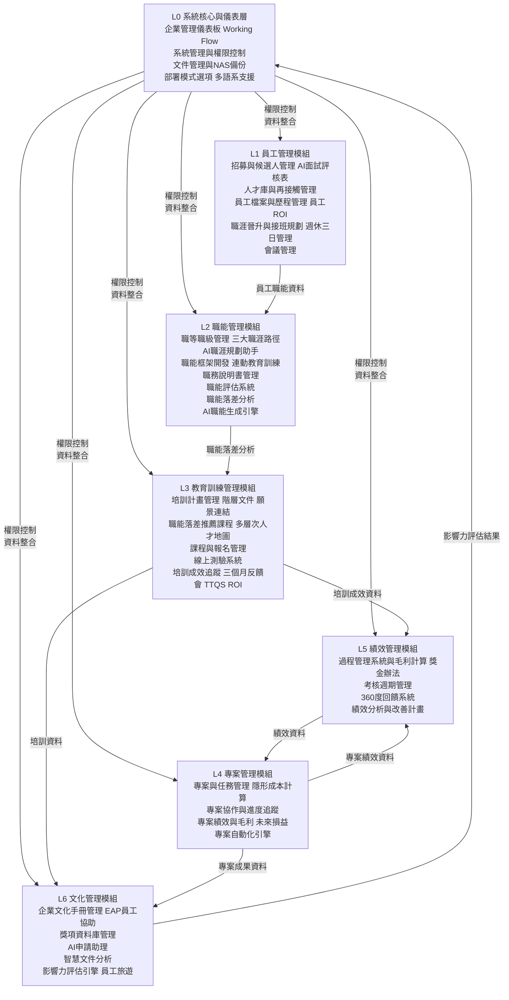

# Bombus 企業管理系統 V7.0 - 完整流程圖

**完整系統流程圖 - 整合版**

版本 V7.0 | 更新日期：2025-12-17

> V7 更新：調整 L1、L2 子模組順序；L3 新增職能落差推薦課程機制（通識/專業/管理三大職能類別）；L1.5 會議管理完整規格（三階段流程、Google 整合、關鍵結論追蹤表）

---

## 目錄

1. [系統總覽](#系統總覽)
2. [部署模式](#部署模式)
3. [L0 核心層](#l0---系統核心與儀表層)
4. [L1 員工管理](#l1---員工管理模組)
5. [L2 職能管理](#l2---職能管理模組)
6. [L3 教育訓練](#l3---教育訓練管理模組)
7. [L4 專案管理](#l4---專案管理模組)
8. [L5 績效管理](#l5---績效管理模組)
9. [L6 文化管理](#l6---文化管理模組)
10. [餐飲應用範例](#應用場景範例餐飲連鎖企業)

---

## 系統總覽

### 關鍵數據

| 指標 | 數值 |
|------|------|
| 系統層級 (L0-L6) | 7 |
| 子模組數量 | 35+ |
| 支援語言 | 4 |
| 部署模式 | 3 |

### 系統架構



### 關鍵名詞定義

#### KR（Key Results - 關鍵結果）

本系統使用「**KR（關鍵結果）**」來衡量組織、部門及個人的工作成效與目標達成度。OKR 是一套目標管理框架，其中 Objectives（目標）定義方向，Key Results（關鍵結果）是可量化的衡量標準，用於評估組織在達成戰略和營運目標方面的成功程度。

這些關鍵結果涵蓋財務、營運、人才發展等多個維度，協助管理層做出數據驅動的決策，並確保團隊聚焦於真正重要的成果。

### V7 版本更新摘要

#### 調整事項

- **L1.2 / L1.3 互換**：人才庫與再接觸管理調整為 1.2，員工檔案與歷程管理調整為 1.3
- **L2.2 / L2.3 互換**：職能框架開發調整為 2.2，職務說明書管理調整為 2.3
- **L3 新增**：3.2 課程管理之前新增「根據職能落差推薦課程」機制，涵蓋通識、專業、管理三大職能類別

#### 延續 V6 功能

- **L0**: 系統部署模式（雲端/混合雲/地端）+ 多語系支援（7 種語言）
- **L1.1**: AI 智能面試評核表（關鍵字±分 + AI 量化分析）
- **L1.4**: 週休三日彈性工時管理辦法
- **L2.1**: 三大職涯發展路徑（垂直晉升/橫向發展/跨部門發展）
- **L2.2**: 職能與教育訓練連動機制
- **L3.2**: 多層次人才地圖生成引擎（職能熱力圖、人才九宮格、學習路徑圖、關鍵人才儀表板）
- **L3.4**: 三個月反饋分享會機制（Level 3 行為評估）
- **L4.3**: 未來損益（Forecast 預測系統，自動串接內部流程檢核點）
- **L6.1**: EAP 員工協助方案
- **L6.1**: 員工旅遊活動紀錄

#### 新增功能

- **L1.5 會議管理**：完整三階段流程（新增會議→會議紀錄→會議追蹤），整合 Google 日曆/Mail、線上簽到、關鍵結論執行進度表

#### 待確認事項

- **L3.5 TTQS 標準**：需與 Amos/Peter 確認評定標準
- **L5.1 毛利計算**：參考文件 BS_獎金辦法2025年.xlsx

---

## 部署模式

### 三種部署架構選項

本系統支援三種部署模式，組織可依據安全性需求、IT 基礎建設能力及預算考量選擇適合方案：

### 公有雲模式（Cloud SaaS）

**部署位置：** AWS / Azure / GCP 等公有雲平台

**適用對象：** 中小型企業、快速啟動需求、無專屬 IT 團隊

- 最快部署速度（1-2 週上線）
- 按月訂閱制，成本可控
- 自動更新與維護
- 99.9% SLA 保證
- 彈性擴充運算資源

**資料儲存：** 加密儲存於雲端資料中心（符合 ISO 27001、SOC 2 認證）

### 混合雲模式（Hybrid Cloud）

**部署位置：** 核心資料存放於企業私有雲，運算服務使用公有雲

**適用對象：** 中大型企業、有資料主權需求、已有私有雲基礎建設

- 敏感資料（員工個資、薪資）存放私有雲
- AI 運算、報表分析等服務使用公有雲
- 資料傳輸採 TLS 1.3 + VPN 加密
- 彈性調配運算資源
- 部署時間約 4-6 週

**資料儲存：** 分層儲存，核心資料地端、運算結果雲端

### 地端部署模式（On-Premises）

**部署位置：** 企業自有機房或專屬資料中心

**適用對象：** 大型企業、政府機關、高度資安需求產業（金融、國防）

- 100% 資料主權掌控
- 符合特殊法規要求（個資法、金管會規範）
- 可整合既有 AD / LDAP 認證系統
- 需自行維護硬體與軟體更新
- 部署時間約 8-12 週

**資料儲存：** 完全存放於企業內部伺服器，可選配 NAS 備份方案

### 多語系支援

本系統採用國際化（i18n）架構，支援多語言無縫切換：

#### 支援語言清單

| 語言 | 地區 |
|------|------|
| 繁體中文 | 台灣（預設） |
| 英文 | 美國/英國 |
| 馬來文 | 馬來西亞 |
| 越南文 | 越南 |

#### 語系功能特性

- **動態切換：** 使用者可在設定頁面即時切換語言，無需重新登入
- **自動偵測：** 首次登入根據瀏覽器語言自動設定
- **時區同步：** 配合語言自動調整時區顯示
- **文件模板多語化：** 面試評核表、培訓證書等文件支援多語輸出
- **AI 多語分析：** AI 面試分析、職能生成引擎支援多語處理
- **報表多語：** 匯出的 PDF / Excel 報表支援語言選擇
- **管理後台：** 提供翻譯管理介面，HR 可自訂專有名詞翻譯

---

## L0 - 系統核心與儀表層

> **模組摘要：** L0 提供全模組的整合儀表板、權限機制與統一架構入口，協助組織角色化視圖與核心資料整合與管控。

### 0.0 企業管理儀表板

- 提供角色導向視圖（高階主管、HR、部門主管、員工）
- 整合即時資料流（員工 / 專案 / 績效模組）
- 生成 AI OKR 的 KR 摘要（自動一句話狀態總結）
- 顯示模組間 API 對應圖
- 根據角色權限顯示不同維度 OKR 的 KR
- **Working Flow 可視化：** 呈現各部門職責與協作關係圖，展示跨部門工作流程與溝通節點

### 0.1 系統管理與權限控制

#### 權限模型與組織架構整合

- 建立多層角色權限架構（模組 / 功能 / 資料列）
- 同步組織圖與部門結構
- 提供權限範圍可視化設定介面

#### 授權與稽核機制

- 實作 API Middleware 權限驗證
- 建立權限快取與 Token 刷新策略
- 生成稽核報告與異常追蹤
- 查詢操作日誌與角色歷程

#### 系統整合與監控

- 建立跨模組共用認證中心（教育 / 績效 / 專案 / 文化管理）
- 提供中央狀態監控板（System Health Board）
- 整合 Google / 104 / Anthropic API 記錄層

#### 文件管理與備份

- **文件儲存庫：** 統一管理系統內所有文件（面試評核表、管理辦法、培訓資料等）
- **每日自動備份：** 完成的文件每日自動備份至 NAS（Network Attached Storage）
- **版本控制：** 追蹤文件修改歷程與版本
- **存取權限：** 依角色控制文件查閱與編輯權限

---

## L1 - 員工管理模組

> **模組摘要：** L1 管理從招募、到職、在職紀錄、接觸再行銷到晉升規劃的整體員工週期，支援 AI 驅動的人才評估與媒合。

### 1.1 招募與候選人管理

- 管理職缺（發布 / 範本 / 核准 / 狀態）
- 整合候選人檔案與履歷解析
- 整合 104 平台（自動匯入與同步）
- 提供 AI 面試摘要與智能排序
- **Rite 測驗管理：** 整合 rite 測驗與評分流程，測驗完成後每日自動備份至 NAS

#### AI 智能面試評核表

**核心機制：** 關鍵字加減分 + AI 量化分析雙軌系統

##### 面試評核流程

**1. 面試前設定（僅限主管角色）：**

- 定義職缺關鍵評估維度（技術能力、溝通表達、文化適配等）
- 設定關鍵字庫與權重：
  - **正向關鍵字**（加分項）：如「團隊合作」+2 分、「專案經驗」+3 分、「主動學習」+2 分
  - **負向關鍵字**（扣分項）：如「頻繁跳槽」-3 分、「溝通困難」-2 分、「缺乏抗壓性」-2 分
- 設定評估範本（可從歷史高績效員工面試記錄匯入關鍵字）

**2. 面試中記錄：**

- 主管填寫候選人表現描述（自由文字輸入）
- 系統即時標記關鍵字並顯示累計分數
- 可上傳面試錄音/錄影（自動轉文字稿）

**3. AI 量化分析引擎：**

- **關鍵字匹配分析：**
  - 自動掃描面試記錄，偵測預設關鍵字
  - 計算關鍵字加減分總和
  - 顯示關鍵字出現頻率與上下文

- **語意深度分析：**
  - 使用自建 AI 分析面試記錄整體語意
  - 評估候選人軟實力（領導力、學習力、抗壓性）
  - 偵測面試官未察覺的潛在優勢或風險

- **適配度評分：**
  - 對照職務說明書（JD）需求
  - 計算候選人與職缺的匹配度（0-100 分）
  - 產出各維度雷達圖（技術 vs 態度 vs 經驗）

**4. 量化評分輸出：**

- **綜合評分** = 關鍵字分數 × 40% + AI 語意分數 × 30% + 適配度分數 × 30%（參數可調）
- 自動生成錄用建議（強烈推薦 / 推薦 / 待觀察 / 不推薦）
- 產出一頁式候選人評估報告（包含亮點摘要、風險提示、薪資建議）

**5. 歷史比對與學習：**

- 追蹤錄取候選人的實際績效表現
- 回饋優化關鍵字權重（機器學習模型持續改進）
- 建立「理想候選人畫像」參考庫

> **權限與備份**
> - 僅限主管角色填寫與查看完整評核表
> - 完成後自動備份至 NAS

#### 其他招募功能

- 管理錄取與轉員工流程（自動建檔 > 安排導師）
- 建立 AI 履歷推薦引擎與適配度評分模型
- 自動生成履歷摘要與推薦候選清單
- 執行職缺關鍵詞向量化分析

### 1.2 人才庫與再接觸管理

- 建立候選人保留與標籤化分類機制
- 建立智慧媒合引擎
- 提供再接觸提醒與自動追蹤流程
- 共用語意索引庫以支援履歷推薦

### 1.3 員工檔案與歷程管理

- 維護員工主資料與職務異動紀錄
- 管理文件版本與到期提醒
- 提供稽核與歷程回溯查詢
- 建立快速搜尋與批次作業介面

#### 員工 ROI 計算儀表板

- 計算員工投資回報率（薪資成本 vs 產出貢獻）
- 追蹤員工培訓投資與績效提升關聯
- 視覺化呈現個人與團隊 ROI 趨勢
- 支援多維度分析（部門、職級、年資）

### 1.4 職涯晉升與接班規劃

- 職涯路徑（管理職 / 專業職）
- 設定晉升標準與資格驗證規則
- 建立晉升核准與生效流程
- 建立接班人計畫並提供建議報告

#### 週休三日彈性工時管理辦法

**政策目標**

提供員工彈性工時選項，平衡工作與生活品質，同時維持組織營運效能與公平性。

##### 適用資格與申請條件

**1. 資格門檻：**

- 到職滿 6 個月以上正式員工
- 近三個月績效考核達 B 級以上
- 職能評估達標（無重大職能落差）
- 部門人力充足（週休三日員工不超過部門 30%）

**2. 申請流程：**

```
員工提出申請 → 直屬主管初審 → 部門主管複審 → HR 審核資格 →
試行期 3 個月 → 績效評估 → 正式核准/終止
```

**3. 試行期規範：**

- 首次申請需試行 3 個月
- 試行期間每月績效考核
- 未達標準自動恢復週休二日
- 試行成功可續行，每年重新審核一次

##### 監控與退場機制

**1. 系統自動監控：**

每月自動計算週休三日員工的：
- 任務完成率
- 專案貢獻度
- 協作評分（來自同事 360 度回饋）
- 產出品質分數

**2. 預警與輔導：**

- 連續 2 個月績效低於標準 → 系統發送預警通知
- HR 介入輔導，分析原因（工時分配、任務量、協作問題）
- 提供 1 個月改善期

**3. 終止條件：**

- 連續 3 個月績效未達標
- 部門營運需求變更（如：專案高峰期）
- 員工主動申請恢復
- 違反交接或協作規範

##### 系統功能支援

**1. 申請審核模組：**

- 線上申請表單（自動檢核資格）
- 多層級審核工作流
- 試行期進度追蹤儀表板

**2. 排班管理模組：**

- 視覺化部門排班日曆
- 人力覆蓋率即時監控
- 衝突預警（如：同組多人同日休假）

**3. 績效監控模組：**

- 自動產出月度檢核報表
- 異常偵測與提醒機制

**4. 資料分析模組：**

- 週休三日政策成效分析（離職率、滿意度、生產力）
- ROI 計算（人力成本 vs 產出效益）
- 組織層級趨勢報告（供管理層決策參考）

### 1.5 會議管理

會議管理模組提供從會議前準備、會議中記錄到會議後追蹤的完整生命週期管理。

#### 會議管理三階段流程

```
新增會議（前）→ 會議紀錄（中）→ 會議追蹤（後）
     ↓              ↓              ↓
  Google 日曆    線上簽到/記錄    結論追蹤表
  自動邀請       自動歸檔 NAS     進度回報
```

#### 第一階段：新增會議（前）

**1. 會議邀請與排程：**

- **Google 日曆整合：** 點選後自動連結到個人 Google 日曆
- **自動帶入資訊：**
  - 活動標題 = 會議主題
  - 邀請人員 = 出席人員
- 支援週期性會議設定（每週/每月/每季）
- 會議提醒通知（會前 1 天、1 小時、15 分鐘）

**2. 會議前準備：**

- 出席人員可於會議前點入填寫議程項目
- 上傳會前資料與附件
- 設定會議類型（跨部門會議、專案會議、例行會議等）

#### 第二階段：會議紀錄（中）

**1. 線上簽到表：**

- **自動帶入：** 出席人員、會議主題
- 出席人員點開此表可執行線上簽名
- 自動記錄簽到時間
- 支援請假/代理人標註

**2. 會議記錄表：**

- **自動帶入：** 出席人員、會議主題
- 出席人員點開此表可執行線上簽名確認
- **記錄內容：**
  - 會議議程（出席人員可於會議前點入填寫）
  - 會議結論（由會議記錄人填寫）
  - 結論當責人（指派負責執行的人員）
  - 完成時間（預計完成日期）

**3. 會議記錄寄送：**

- 點選後自動連結到個人 Google Mail
- **自動夾帶：** 會議紀錄 = 附件
- **自動帶入：** 出席人員 = 收件人
- 支援 CC 其他相關人員

**4. 自動歸檔：**

- 會議記錄完成後自動備份至 NAS
- 依會議類型/部門/日期分類儲存
- 支援全文檢索

#### 第三階段：會議追蹤（後）

**1. 會議追蹤表：**

- 點選後顯示所有會議紀錄清單（時間｜會議主題）
- 選擇會議記錄 > 新增會議追蹤表
- **自動帶入欄位：**
  - 會議結論（執行事項）
  - 當責人
  - 完成時間
  - 已完成勾記（checkbox）

**2. 關鍵結論執行進度表：**

| 欄位 | 說明 |
|------|------|
| 議題部門 | 負責該議題的部門（專案部、業務部、技術部、財務部、行政管理部等） |
| 議題結論_執行事項 | 具體需要執行的任務內容 |
| 當責人 | 負責執行該任務的人員 |
| 完成時間 | 預計完成日期 |

**3. 進度回報機制：**

- **會前回報提醒：** 當責人請於下次會議開始時，先進行所負責項目之執行進度回報
- 系統自動發送提醒通知
- 逾期未完成項目自動標記警示（紅燈）
- 支援進度百分比更新

**4. 自動歸檔：**

- 追蹤表更新後自動備份至 NAS
- 保留歷史修改紀錄

#### 會議效率分析

- **會議統計儀表板：**
  - 各部門會議時數統計
  - 會議結論執行率（已完成/總數）
  - 逾期項目數量與趨勢
- **個人會議負荷分析：**
  - 個人每週會議時數
  - 待辦事項數量
- **會議效能報告：**
  - 平均會議時長
  - 結論產出效率
  - 追蹤項目完成率

---

## L2 - 職能管理模組

> **模組摘要：** L2 定義並追蹤組織各職位對應職能，包含 JD 撰寫、職能評估、落差分析與 AI 自動化職能建構。

### 2.1 職等職級管理

#### 職等職級矩陣系統

- 建立職等職級矩陣對應
- 管理跨部門職能關聯
- 提供職能樹狀階層瀏覽介面
- **根據組織架構自動生成管理辦法**，並存入文件管理系統
- **從組織架構自動產出 Working Flow 視圖**

#### 三大職涯發展路徑

**1. 垂直晉升路徑**

- 包含管理職與專業職雙軌晉升
- 定義各階段職能要求與晉升門檻
- 設定晉升標準與資格驗證規則

**2. 橫向發展路徑**

- 不斷精進專業職能深度
- 成為領域專家或技術權威
- 專業職級晉升機制

**3. 跨部門發展路徑**

- 支援跨職能轉調（如：業務→財務、工程→行政）
- 評估轉調所需職能差距
- 提供轉調培訓建議

#### AI 職涯規劃助手

- **現況定位：** 根據職能評估結果，告知員工目前所在位置
- **發展建議：** 依據選定路徑，推薦需要培養的職能
- **訓練計畫：** 自動連結至教育訓練模組，產出個人化學習地圖
- **進度追蹤：** 追蹤職能成長軌跡，提供晉升可行性評估
- **情境模擬：** 模擬不同職涯選擇的發展路徑與所需時間

### 2.2 職能框架開發

#### 職能模型框架

- **核心職能架構：** 定義組織共通職能（價值觀、文化認同）
- **專業職能架構：** 建立各職務專業技能體系
- **管理職能架構：** 規劃管理階層所需領導能力
- **通識職能架構：** 包含法規遵循、資訊安全、職業安全等共同知識

#### 職能要素定義

- **知識要素（K）：** 定義各職能所需知識領域
- **技能要素（S）：** 定義各職能操作技能標準
- **態度要素（A）：** 定義各職能行為態度指標

#### 職能評估工具

- **月度檢核表：** 定期評估職能表現
- **熟練度等級：** 初階 / 熟練 / 專家三級分類
- **CRUD 職能資料介面：** 新增、查詢、修改、刪除職能資料
- **批次角色對應工具：** 批量設定職位與職能關聯

#### 職能與教育訓練連動機制

**自動觸發培訓建議：**

- 當員工職能評估結果低於標準時，系統自動推薦對應課程
- 連結至 L3.2 課程與報名管理模組，顯示可報名的相關課程清單

**培訓完成後自動更新職能：**

- L3 教育訓練模組的課程完成記錄自動回傳至 L2
- 更新員工職能狀態（如：「資料分析」職能從「初階」提升至「熟練」）
- 重新計算職能落差分數

**學習地圖生成：**

- 根據員工當前職能狀態與目標職位要求，自動產出「個人化學習地圖」
- 顯示學習路徑時間軸（預計需多久達成目標職能）
- 整合 L3.2 多層次人才地圖，呈現組織整體職能發展進度

### 2.3 職務說明書管理（JD）

- 設定職能基準辦法
- 提供 JD 範本與自動產生模板
- 管理職能關聯與版本控制
- 提供 AI 撰寫助手功能
- 對齊職能標準與產業對照參照表

### 2.4 職能評估系統

- 提供自評與主管評估表
- 設定評估排程、提醒與歷史記錄追蹤
- 評估結果自動連結至 AI 職涯規劃助手

### 2.5 職能落差分析

- 比對 JD 需求與員工職能差距
- 評估落差嚴重度分數
- 提供部門與組織層級分析
- 與教育訓練模組整合應用

### 2.6 AI 職能生成引擎

- 自動由 JD 或職敘產出職能模型
- 擷取 AI 行為指標
- 對齊 ISO / 行業標準職能對照表
- 自動分類職能庫與技能群集

---

## L3 - 教育訓練管理模組

> **模組摘要：** L3 管理組織內訓策略與執行，支援從年度培訓規劃、課程管理、測驗到成效回饋的完整教育循環。

### 3.1 培訓計畫管理

#### 階層式培訓文件架構

- **L1 管理層級文件：** 組織培訓策略、政策、管理辦法
- **L2 年度層級文件：** 年度培訓計畫、預算分配、目標設定
- **L3 常用層級文件：** 常態性課程、標準培訓流程、範本
- **L4 執行層級文件：** 個別課程計畫、學員名單、執行細節

#### 策略連結

- **願景使命連結：** 將培訓目標與組織願景、使命對齊
- **策略目標對應：** 培訓計畫支援組織年度策略目標
- **職能發展路徑：** 依據 L2 職能落差自動產出訓練建議

#### 計畫管理功能

- 建立年度或專案型培訓計畫
- 提供多層級核准鏈與版本控制
- 顯示執行進度與預算控制儀表板
- 文件完成後自動備份至 NAS

### 3.2 根據職能落差推薦課程（多層次人才學習地圖）[NEW]

> **V7 新增：** 整合 L2 職能落差分析，自動推薦對應培訓課程

#### 三大職能類別

本系統依據職能性質，將課程分為三大類別進行推薦：

**1. 通識職能課程**

- 法規遵循與合規培訓
- 資訊安全與個資保護
- 職業安全衛生
- 企業倫理與行為準則
- 溝通技巧與簡報能力
- 時間管理與效率提升

**2. 專業職能課程**

- 依職務類別分類（業務、財務、工程、行銷等）
- 技術技能培訓（軟體工具、專業知識）
- 產業知識與市場趨勢
- 專案管理與執行能力
- 品質管理與流程優化

**3. 管理職能課程**

- 領導力發展
- 團隊管理與激勵
- 績效管理與回饋技巧
- 策略思維與決策能力
- 變革管理
- 跨部門協作與溝通

#### 推薦機制

**1. 自動分析流程：**

```
L2 職能評估結果 → 職能落差分析 → 識別落差職能類別（通識/專業/管理）
      ↓
比對課程資料庫 → 篩選符合職能需求的課程
      ↓
根據落差嚴重度排序 → 產出個人化推薦清單
```

**2. 推薦優先順序：**

- **高優先（紅燈）：** 落差分數 > 30%，需立即培訓
- **中優先（黃燈）：** 落差分數 10-30%，建議近期安排
- **低優先（綠燈）：** 落差分數 < 10%，可選修強化

**3. 推薦輸出內容：**

- 推薦課程名稱與類別（通識/專業/管理）
- 對應提升的職能項目
- 課程時數與開課時間
- 預計職能提升幅度
- 相關認證或證照

#### 與其他模組連動

- **連結 L2.5 職能落差分析：** 自動取得員工職能缺口資料
- **連結 L3.3 課程與報名管理：** 一鍵報名推薦課程
- **連結 L3.4 多層次人才地圖：** 追蹤培訓後職能提升狀況

### 3.3 課程與報名管理

- 支援課程類型分類（OJT / Off-JT / SD）與功能分群（通識、專業、管理）
- 整合講師與教材平台，提供講師遴選標準
- 管理課程報名、審核、排程與課前、課中、課後文件流程
- 提供 QR Code 出席與簽到追蹤機制

#### 多功能多層次人才地圖生成引擎

**功能目標**

整合 L1 員工資料、L2 職能評估、L3 培訓記錄，自動生成組織人才發展全景圖，協助 HR 與管理層快速掌握人才佈局與培育缺口。

##### 四大人才地圖類型

**1. 組織職能熱力圖（Competency Heatmap）**

- **呈現方式：** 矩陣式熱力圖（橫軸：職能項目，縱軸：部門/員工）
- **顏色標示：**
  - 深綠色：職能優秀（熟練/專家等級）
  - 淺綠色：職能達標（符合 JD 要求）
  - 黃色：職能接近標準（需輕度培訓）
  - 紅色：職能落差大（需重點培育）
- **應用場景：** 快速定位組織職能短板，優先安排培訓資源

**2. 人才九宮格（Talent 9-Box Grid）**

- **呈現方式：** 3×3 矩陣（橫軸：績效表現，縱軸：發展潛力）
- **九大分類：**
  - 高績效高潛力：明星員工（接班人候選）
  - 高績效中潛力：核心骨幹（穩定貢獻者）
  - 高績效低潛力：專業專家（技術權威）
  - 中績效高潛力：潛力股（需重點培育）
  - 中績效中潛力：穩定員工（持續觀察）
  - 中績效低潛力：需改善（啟動 PIP）
  - 低績效高潛力：待開發（調整職位）
  - 低績效中潛力：風險員工（輔導或淘汰）
  - 低績效低潛力：淘汰名單
- **數據來源：** L5 績效考核 + L2 職能評估 + L1.3 員工 ROI
- **應用場景：** 年度人才盤點、晉升決策、接班人規劃

**3. 學習發展路徑圖（Learning Journey Map）**

- **呈現方式：** 時間軸 + 技能樹狀圖
- **分層展示：**
  - **組織層級：** 整體培訓完成率、各部門學習進度
  - **部門層級：** 部門關鍵職能培育進度、團隊學習排行榜
  - **個人層級：** 員工個人化學習地圖（當前職能 → 目標職位所需職能 → 推薦課程）
- **智能推薦：**
  - 根據職涯目標（如：想晉升為專案經理），系統自動規劃學習路徑
  - 推薦課程順序（基礎課 → 進階課 → 實戰演練）
  - 預估學習時間與完成日期
- **應用場景：** 員工自主學習、主管輔導部屬、HR 規劃培訓資源

**4. 關鍵人才儀表板（Key Talent Dashboard）**

- **呈現方式：** 卡片式儀表板 + 互動式篩選器
- **數據維度：**
  - 關鍵職位覆蓋率（如：財務經理有 2 位接班人候選）
  - 高風險人才預警（離職傾向、績效下滑、職能退化）
  - 人才流失成本估算（替換成本 + 培訓成本 + 產出損失）
  - 外部挖角風險評估（市場薪資對比、產業搶人熱度）
- **預警機制：**
  - 關鍵人才離職風險超過 60% → 自動通知 HR 啟動留才計畫
  - 關鍵職位無接班人 → 自動推薦內部培育或外部招募
- **應用場景：** 高階主管決策、人才保留策略、薪酬調整參考

##### 地圖生成邏輯

```
L1 員工檔案（年資、職級、部門）
      +
L2 職能評估（職能分數、落差分析）
      +
L3 培訓記錄（課程完成、測驗成績、證照）
      +
L5 績效數據（考核評級、OKR 達成率、360 度回饋）
      ↓
AI 演算法整合分析
      ↓
自動生成四大人才地圖 + 決策建議
```

##### 互動功能

- **鑽取分析：** 點擊地圖任一區塊，深入查看明細資料（如：點擊「紅色職能區塊」顯示該職能落後員工清單）
- **情境模擬：** 假設某員工完成特定培訓，預測其在人才地圖中的位置變化
- **匯出報表：** 支援 PDF / PNG / Excel 匯出，用於管理會議簡報
- **定期更新：** 每月自動重新計算並發送人才地圖更新報告

### 3.4 線上測驗系統

- 提供多題型題庫（選擇 / 問答 / 填空）
- 建立測驗範本並自動組卷
- 管控作答行為並設防作弊機制
- 提供自動評分與證書產出功能

### 3.5 培訓成效追蹤與回饋循環

#### TTQS 品質管理系統

> **注意：** TTQS 評定標準規格需與 Amos / Peter 確認

- **訓練需求分析：** 符合 TTQS 需求訪談與分析規範
- **訓練計畫擬定：** 依 TTQS 格式產出完整培訓計畫
- **訓練執行紀錄：** 記錄出席、教材、教室日誌等必要資料
- **成效評估機制：**
  - Level 1 反應評估：課程滿意度調查
  - Level 2 學習評估：前測與後測比較
  - Level 3 行為評估：職能改善追蹤（透過三個月反饋分享會驗證）
  - Level 4 成果評估：績效與業務指標變化
- **持續改善循環：** 自動產出改善建議與後續訓練提案

#### Level 3 行為評估：三個月反饋分享會機制

**目的**

驗證培訓是否真正改變員工工作行為，而非僅停留在知識層面，透過結構化分享會收集實際應用案例。

##### 執行流程

**1. 課程結束後第 90 天自動觸發：**

- 系統自動發送會議邀請給：學員、學員主管、HR、講師（選填）
- 預設排程於週五下午（避開業務高峰）
- 自動生成分享會議程與評估表單

**2. 分享會議程（建議 90 分鐘）：**

**第一階段（30 分鐘）：學員輪流分享**

- 每位學員 5 分鐘簡報：「我在工作中應用了哪些課程內容？」
- 必須提供具體案例（STAR 法則：情境、任務、行動、結果）
- 附上成果佐證（如：報表數據、專案成效、客戶回饋）

**第二階段（30 分鐘）：主管回饋**

- 主管驗證學員分享的真實性
- 評估行為改變的持續性（是否只是短期表現）
- 指出尚未應用的課程內容與原因（環境限制 or 能力不足）

**第三階段（30 分鐘）：AI 輔助分析與改進建議**

- 系統即時分析分享內容，產出「行為轉化率」分數（0-100 分）
- 對比培訓前後的績效數據（來自 L5 績效管理模組）
- 自動生成「未應用內容」的障礙分析報告
- HR 與講師討論課程優化方向

**3. 評估指標與量化分析：**

- **行為轉化率** = (實際應用的課程內容 / 課程總內容) × 100%
- **績效提升度** = (培訓後 3 個月平均績效 - 培訓前 3 個月平均績效) / 培訓前績效 × 100%
- **知識留存率** = 三個月後測驗分數 / 課程結束後測分數 × 100%
- **主管滿意度** = 主管對學員行為改變的評分（1-5 分）

**4. 系統功能支援：**

- **分享會自動排程：** 課程結束後 90 天自動建立會議
- **案例庫建置：** 優秀應用案例自動收錄至「最佳實踐資料庫」，供後續課程參考
- **AI 逐字稿分析：** 會議錄音自動轉文字，AI 提取關鍵應用行為
- **追蹤儀表板：** 顯示各課程的「行為轉化率」排行榜，找出高 ROI 課程

**5. 後續行動：**

- **行為轉化率 ≥ 70%：** 課程設計優秀，納入常態課程清單
- **行為轉化率 50-70%：** 課程需優化，增加實戰演練環節
- **行為轉化率 < 50%：** 檢討課程必要性，考慮停開或大幅改版
- **個人轉化率 < 40%：** 啟動一對一輔導，安排 OJT 導師協助

**6. 與其他模組連動：**

- 自動更新 L2 職能評估結果（行為改變 → 職能提升）
- 回饋至 L3.1 培訓計畫（優化下一年度課程設計）
- 影響 L5 績效考核（培訓應用度納入考核指標）

##### 範例案例

```
課程：「資料分析與視覺化工作坊」
學員：業務部 - 王小明

【三個月後分享內容】
- 應用工具：使用 Power BI 建立業務儀表板（課程教授內容）
- 具體成果：每週業務會議準備時間從 4 小時降至 1 小時
- 數據佐證：附上儀表板截圖 + 主管證實會議效率提升
- 行為轉化率：75%（8 項課程技能應用了 6 項）
- 績效提升度：+12%（業績達成率從 88% 提升至 100%）

【AI 分析建議】
- 未應用內容：Python 自動化腳本（原因：公司無 Python 環境）
- 改進建議：增加 Excel VBA 自動化課程，更符合實際工作環境
```

#### 成效分析與回饋

- 比較前測與後測結果，支援季度與年度報表
- 教室日誌、課程總結報告書自動備份至 NAS
- 自動更新員工職能狀態至 L2 職能管理模組
- 若成效不達標，自動生成新訓練提案
- 顯示培訓儀表板與成效趨勢

#### 教育訓練 ROI 計算儀表板

- **投資成本計算：** 培訓費用、講師成本、學員時間成本
- **效益量化分析：** 職能提升、績效改善、錯誤率降低、產出增加
- **ROI 公式：** (培訓效益 - 培訓成本) / 培訓成本 × 100%
- **多維度報表：** 按課程、部門、職能類別分析 ROI
- **趨勢追蹤：** 長期追蹤培訓投資回報率變化

---

## L4 - 專案管理模組

> **模組摘要：** L4 管理專案計畫、任務分解、協作追蹤與成果輸出，串聯績效資料並強化自動化與 AI 智能分析。

### 4.1 專案與任務管理

- 專案管理使用文件
- WBS 任務分解結構
- 設定專案目標、範疇與驗收條件
- 成本追蹤機制

#### 隱形成本計算

- 人力成本計算（工時 × 人員時薪）
- 總成本可視化儀表板

### 4.2 專案協作與進度追蹤

- 提供成員協作介面（留言 / 任務狀態同步）
- 設定自動提醒與阻礙回報流程
- 建立週報 / 雙週報節點追蹤
- 整合績效系統資料作為進度輸入來源

### 4.3 專案績效與毛利

> **權限設定：** 此功能設定為最高權限等級，僅限高階管理層查看

- 將專案目標分解至任務層級
- 建立任務與 OKR 自動對應邏輯
- 提供 OKR 的 KR 與貢獻度報表

#### 專案毛利計算

- 專案收入追蹤
- 直接成本（人力、設備、外包）
- 間接成本（管理、行政支援）
- 毛利率 = (收入 - 成本) / 收入 × 100%
- 專案獲利排行榜

發送效能偏差自動提醒（Variance Alert）

#### 未來損益（Forecast 預測系統）

**功能目標**

追蹤 Forecast，以確保專案實現的最大效益。

##### Forecast 總表結構

**1. 專案清單欄位**

| 欄位 | 說明 |
|------|------|
| 客戶/歸屬 | 客戶名稱與所屬單位 |
| 專案名稱 | 專案完整名稱 |
| 預算(萬) | 專案預算金額 |
| 專案部 | 專案經理負責人 |
| 業務部 | 業務負責人 |
| 工程部 | 工程負責人 |
| 專案 Forecast 甘特圖 | 進度階段 0.1~1.0 |
| 進度說明 | 當前專案狀態描述 |

**2. 進度階段定義（0.1 ~ 1.0）**

| 進度 | 階段名稱 | 說明 |
|------|----------|------|
| 10% | 初步接觸 (Initial Contact) | 客戶首次接觸專案，尚處於探索需求階段 |
| 20% | 需求確認 (Needs Analysis) | 建立初步需求，雙方尚未確立具體合作方向 |
| 30% | 解決方案建議 (Solution Proposal) | 提出初步解決方案，獲得客戶對方案方向的基本認可 |
| 40% | 提案與預算討論 (Proposal Discussion) | 提交正式提案與初步預算，進入細節磋商階段 |
| 50% | 初步承諾 (Initial Commitment) | 客戶對提案方向及預算表達認可，尚未簽訂合約 |
| 60% | 合約談判-需求確認 (Contract Negotiation) | 就合約條款、付款計劃、交付時間進行最終確認 |
| 70% | 專案啟動-徵商報價 (Project Kick-off) | 專案正式啟動，執行計劃開始推進 |
| 80% | 合約簽訂 (Contract Signed) | 正式簽署合約，進入執行準備階段 |
| 90% | 成果交付 (Delivery) | 根據合約交付產品或服務，完成驗收 |
| 100% | 結案與售後服務 (Project Closure) | 專案完成，進入售後支援或維護階段 |

**3. 系統自動串接內部流程**

- 串接 L4.2 專案協作與進度追蹤模組
- 自動偵測任務完成狀態
- 判斷是否到達進度階段檢核點
- 進度更新時自動記錄日期

##### 專案管理範本

**1. 任務管理欄位**

| 欄位 | 說明 |
|------|------|
| 目標 | 專案目標設定 |
| 主要任務 | 任務清單與所需時間 |
| 任務狀況 | 0=預計、1=已完成、-1=紅燈(出現狀況) |
| 負責人 | A=主要負責人、B=次要負責人、C=執行、R=審查 |

**2. 品質要求與審查**

- 審查結果標記：G=良好、Y=待確認、R=需改善

##### 專案更新簡表

追蹤銷售機會與專案狀態：

| 欄位 | 說明 |
|------|------|
| Opportunity Account | 機會客戶 |
| Opportunity Name | 機會名稱 |
| Cx Case Number | 案件編號 |
| Major Sales / Sales / SE | 銷售與工程人員 |
| Expected Budget | 預期預算 |
| Stage | 專案階段 |
| Forecast Status | Forecast 狀態 |
| Expected Bidding Date | 預計招標日期 |
| 結案時間(驗收) | 驗收完成時間 |

### 4.4 專案報表與分析

- 產出一頁式專案報告（目標 / 任務 / 進度 / 成本 / 毛利）
- 顯示專案熱力圖（多專案績效對比）
- 偵測成本偏差與建立預警模型
- 自動產出專案成果摘要

### 4.5 專案自動化引擎

- 建立任務週期重複排程機制
- 發送預警（延誤 / 預算 / 貢獻異常）
- 整合 Slack / Email 通知管道
- 自動歸檔專案知識與結案報告

---

## L5 - 績效管理模組

> **模組摘要：** L5 管理目標設定、過程追蹤、回饋與考核週期，整合個人與組織績效數據，用於驅動改進與獎懲機制。

### 5.1 過程管理系統與毛利計算

> **注意：** 毛利計算規格參考 BS_獎金辦法2025年.xlsx

#### 目標與任務管理

- 建立目標設定與對齊邏輯（OKR / SMART）
- 追蹤任務與行為績效
- 呈現任務進度視覺化介面
- 整合評分與績效結算

#### 毛利計算參數設定系統

##### 設定頁面功能

**基本薪資設定：**

- 員工基本薪資維護
- 薪資調整歷史記錄
- 薪資等級對照表
- 支援批次匯入與更新

**部門參數設定：**

- 部門成本中心代碼
- 部門間接成本分攤比例
- 部門毛利目標設定
- 部門獎金池分配權重

**職稱參數設定：**

- 職稱薪資級距定義
- 職稱績效係數設定
- 職稱獎金分配比例
- 管理職 vs 專業職差異化設定

**計算公式設定：**

*人力成本計算：*

- 可自訂工時單價 = 月薪 ÷ 工作時數 × 係數
- 可設定加班成本倍數
- 可設定福利與保險分攤比例

*成本分類設定：*

- 直接成本項目定義（人力、材料、外包）
- 間接成本項目定義（租金、水電、行政）
- 成本歸屬規則（依部門/專案/任務）

*毛利計算邏輯：*

- 毛利 = 營收 - Σ（直接成本 + 分攤間接成本）
- 毛利率 = 毛利 ÷ 營收 × 100%
- 可自訂計算週期（月/季/年）

**獎金分配規則設定：**

*獎金池計算：*

- 設定毛利目標達成率與獎金池關係（例：達成 100% → 提撥 10% 毛利）
- 分級獎金池比例（例：80-90% → 5%, 90-100% → 10%, 100%+ → 15%）

*個人貢獻度計算：*

- 任務完成度權重
- 專案參與度權重
- 績效考核分數權重
- 職能等級加權係數

*分配比例設定：*

- 部門獎金 vs 個人獎金比例
- 主管加給比例
- 特殊貢獻獎勵規則

**權限與稽核：**

- 參數修改權限控制
- 參數變更歷史記錄
- 變更原因與核准流程
- 參數版本管理（支援年度切換）

#### 毛利計算與績效分析

**營收與成本追蹤：**

- 自動從財務系統同步營收資料 (API串接)
- 自動計算人力成本（基於薪資設定 × 實際工時）
- 整合專案成本資料（L4 專案管理模組）
- 間接成本自動分攤（依設定規則）

**自動化計算引擎：**

- 定期自動計算部門與個人毛利貢獻
- 定期自動結算獎金池與個人獎金
- 自動產出獎金計算報表（包含明細與公式）
- 異常偵測與預警（成本異常、毛利率偏低）

**儀表板呈現：**

- **即時毛利監控：** 當月累計毛利、毛利率、目標達成率
- **歷史趨勢分析：** 毛利率趨勢圖、同期比較、年度走勢
- **部門排行榜：** 毛利貢獻排名、獎金池預估
- **個人績效視圖：** 個人毛利貢獻、預估獎金、貢獻度分析

### 5.2 考核週期管理

- 支援月度 / 季度 / 半年 / 年度考核模式
- 建立自動化流程引擎與通知機制
- 提供考核表單與量表自定義功能

### 5.3 360 度回饋系統

- 收集來自上級 / 同儕 / 下屬 / 自評的回饋
- 提供匿名化與隱私保護設定
- 產出回饋摘要與視覺化報表
- 整合職能評估結果（來自 L2.4）

### 5.4 績效紀錄與日誌系統

- 建立分類日誌（成就 / 問題 / 觀察）
- 提供即時紀錄介面
- 整合考核資料與趨勢檢索功能
- 自動連結至專案成果（L4）與培訓成效（L3）

### 5.5 績效分析與改善計畫

- 顯示個人 / 團隊 / 組織績效儀表板
- 產出報告並支援多格式匯出
- 建立與追蹤 PIP（績效改善計畫）
- 整合教育訓練 ROI 與員工 ROI 數據

---

## L6 - 文化管理模組

> **模組摘要：** L6 聚焦於企業文化建構、價值證明與報獎管理，整合文件資料、自動化產出與影響力評估，協助組織塑造文化認同並呈現成果。

### 6.1 企業文化手冊管理

#### 文化手冊編輯與發布

- 建立企業願景、使命、核心價值觀
- 定義行為準則與文化規範
- 編寫組織故事與創辦理念
- 支援多語言版本管理

#### 文化傳播機制

- 新進員工文化導讀流程
- 文化故事分享平台
- 定期文化活動提醒
- 文化價值觀融入績效評估（連結 L5）

#### 文化評估與追蹤

- 員工文化認同度調查
- 文化實踐行為觀察記錄
- 文化指標儀表板
- AI 文化落實分析報告

#### 員工協助方案（EAP）整合

**EAP 模組目標**

提供員工心理健康、工作生活平衡、家庭關係等全方位支持，建立關懷文化並預防職業倦怠。

##### 功能架構

**1. 諮詢服務管理：**

*心理諮商預約：*

- 與外部心理諮商機構合作
- 員工可匿名預約諮商（系統不記錄諮商內容，僅記錄使用次數）
- 每年每位員工免費諮商額度（如：3-6 次）
- 超額諮商費用由員工或公司補助（可設定規則）

**2. 健康促進計畫：**

*健康檢查追蹤：*

- 記錄員工年度健檢結果（加密儲存）
- 異常指標提醒（如：血壓、血糖偏高）
- 推薦健康改善方案（運動課程、營養諮詢）

*壓力管理工作坊：*

- 定期舉辦正念冥想、時間管理課程
- 連結 L3 教育訓練模組排程

**3. 工作生活平衡支援：（待討論）**

*彈性工時申請：*

- 遠端工作申請（連結 L1.4 週休三日管理辦法）
- 彈性上下班時間（如：9:00-18:00 or 10:00-19:00）

*育兒支援：*

- 托嬰資訊分享平台
- 育嬰假申請與追蹤
- 育兒津貼計算器

**4. 危機干預機制：**

*主動關懷流程：*

- HR 或主管發起一對一談話（非正式考核）
- 提供 EAP 資源介紹
- 必要時轉介專業諮商

*重大事件支援：*

- 員工或家屬發生重大傷病、意外、喪親
- 啟動緊急支援方案（慰問金、彈性假期、心理諮商）
- HR 專案追蹤恢復狀況

**5. 匿名性與隱私保護：**

- EAP 使用記錄完全匿名（HR 僅能看到整體使用率，無法追蹤個人）
- 諮商內容不進入任何系統
- 員工可選擇「匿名模式」預約服務（使用匿名代碼）

**6. 成效評估：**

*使用率儀表板（去識別化）：*

- 各項服務使用次數（心理諮商、法律諮詢、健檢追蹤）
- 部門使用率對比

*影響力分析：*

- 對比「使用 EAP 員工」vs「未使用員工」的績效、離職率
- 計算 EAP 投資回報率（降低離職成本、提升生產力）

*員工滿意度調查：*

- 每季匿名問卷調查 EAP 服務品質
- 收集改進建議

#### 員工旅遊活動紀錄

- 記錄員工旅遊活動（提案、報名、執行、回饋）
- 連結 **L6.6 影響力評估**：計算旅遊活動對員工滿意度、留任率的影響

### 6.2 獎項資料庫管理

- 建立獎項目錄與時程追蹤
- 提供智慧篩選與推薦功能
- 顯示年度更新與截止提醒

### 6.3 文件儲存庫

- 管理文件分類、標籤與版本控制
- 支援多格式批次上傳
- 追蹤文件到期並發送提醒通知
- 整合版本歷史與 AI 文件彙整
- 與 L0 文件管理系統整合，每日備份至 NAS

### 6.4 AI 申請助理

- 自動產生申請檢核表
- 萃取多模組資料並自動填入申請格式
- 建立 AI 文案產生器（亮點 / 成果 / 摘要）
- 提供簡報輸出（PPT / PDF / Keynote）
- 顯示申請進度與歷史紀錄追蹤

### 6.5 智慧文件分析

- 偵測文件缺漏並執行品質評估
- 發送自動警示與責任人通知
- 顯示合規風險儀表板與建議行動

### 6.6 影響力評估引擎

- 整合績效（L5）/ 專案（L4）/ 培訓（L3）資料進行成效分析
- 自動產出報獎潛力模型
- 提供推薦建議與成果摘要
- 產出亮點摘要文件供外部提報使用
- **文化影響力評估：** 分析企業文化（含 EAP、員工旅遊）對組織績效的影響力

---

## 應用場景範例：餐飲連鎖企業

### 企業背景：「鮮食家連鎖餐廳」

#### 企業規模

- 10 家分店，每店 15-20 人（店長 1、副店 1、內場 8、外場 8）
- 總部：HR 2 人、營運總監 1 人、區域督導 3 人
- 年營業額：1.2 億元

#### 核心痛點

- 員工年流動率 60%（餐飲業平均值）
- 新人培訓週期長（需老手帶 2-3 週）
- 服務品質不穩定（依賴資深員工經驗）
- 分店績效差異大（最佳店 vs 最差店營收差 40%）
- 晉升標準模糊，優秀員工留不住

### L1 員工管理：解決高流動率招募問題

#### 問題情境

- 每月平均需招募 5-8 位新人補缺
- HR 手動篩選履歷耗時 3 天
- 面試評估標準不一（不同店長偏好不同）

#### 系統應用

**1. AI 面試評核表（L1.1）**

```
設定餐飲業關鍵字庫：
- 正向：「抗壓性強」+3 分、「餐飲經驗」+2 分、「假日可配合」+2 分
- 負向：「不願加班」-3 分、「無法久站」-2 分

店長面試後填寫觀察記錄，系統自動計算適配度
錄取率從 30% 提升至 65%（減少試用期淘汰）
```

**2. 快速到職流程（L1.3）**

- 錄取後自動建檔、分配制服尺寸、排定培訓課程
- 到職當天即可查看個人化學習地圖

#### 落地成效

- 招募週期從 14 天縮短至 7 天
- 試用期留任率從 50% 提升至 75%

### L2 職能管理：建立內外場晉升路徑

#### 問題情境

- 內場廚師不知如何晉升主廚
- 外場服務生做 2 年仍無升遷機會，紛紛離職
- 店長標準不明確，優秀員工被挖角

#### 系統應用

**1. 內場職能分級（L2.1 垂直晉升路徑）**

```
備餐員（月薪 3 萬）→ 線上廚師（3.5 萬）→ 爐灶手（4 萬）→ 主廚（5 萬）

晉升條件：
- 備餐員 → 線上廚師：刀工測驗 85 分、備料速度達標、工作滿 3 個月
- 線上廚師 → 爐灶手：完成 10 道主菜認證、出餐失誤率 < 3%、滿 6 個月
- 爐灶手 → 主廚：通過主廚考核、帶領新人培訓、滿 1 年
```

**2. 外場職能分級（L2.1 垂直晉升路徑）**

```
新手服務生（月薪 3 萬）→ 資深服務生（3.3 萬）→ 領班（3.8 萬）→ 副店長（4.5 萬）→ 店長（5.5 萬）

晉升條件：
- 新手 → 資深：點餐系統熟練、客訴處理 0 次、滿 2 個月
- 資深 → 領班：月加購率 > 20%、帶領新人 2 位以上、滿 6 個月
- 領班 → 副店長：完成店務管理課程、協助開店/關店、滿 1 年
```

**3. 職能評估與落差分析（L2.4 + L2.5）**

- 每月店長評估員工職能（刀工、出餐速度、服務態度）
- 系統自動標記未達標項目，推薦對應培訓課程

#### 落地成效

- 員工晉升路徑透明化，離職率從 60% 降至 45%
- 內部晉升比例從 20% 提升至 50%（減少外部招募成本）

### L3 教育訓練：新人 3 天快速上手

#### 問題情境

- 新人需老手帶 2-3 週，影響既有人力
- 各店訓練品質不一，標準化困難
- 缺乏培訓成效追蹤

#### 系統應用

**1. 新人訓練 SOP（L3.1 + L3.3）**

- **Day 1：** 觀看線上教學影片（點餐系統、內場備料 SOP）+ QR Code 簽到
- **Day 2：** 實作測驗（模擬點餐、刀工考核）+ 老手帶領實習
- **Day 3：** 獨立作業 + 主管評分（合格即可正式上線）

**2. 線上測驗系統（L3.4）**

- 內場：刀工影片上傳 → AI 評分切菜速度與規格
- 外場：客訴情境模擬 → 選擇題測驗（80 分及格）

**3. 三個月反饋分享會（L3.5）**

- 新人到職滿 3 個月後，分享「哪些培訓內容最實用」
- 淘汰低轉化率課程（如：過於理論的「餐飲業發展史」）
- 優化高頻問題（如：加開「尖峰時段應對技巧」課程）

#### 落地成效

- 新人訓練週期從 2-3 週縮短至 3 天
- 培訓成本降低 60%（減少老手陪訓時數）
- 新人 3 個月留任率從 50% 提升至 70%

### L4 專案管理：新店開幕與促銷活動

#### 問題情境

- 新店開幕流程混亂（裝潢、設備、人員招募常延誤）
- 促銷活動成效難追蹤（不知道哪個活動賺錢）

#### 系統應用

**1. 新店開幕專案（L4.1 WBS 任務分解）**

```
專案目標：第 11 店於 3 個月內開幕，首月營收目標 80 萬

任務分解：
- 選址與租約（Week 1-4）
- 裝潢與設備（Week 5-10）
- 人員招募（Week 8-12）：店長 1、副店 1、內場 8、外場 8
- 培訓與試營運（Week 11-12）
- 正式開幕（Week 13）
```

**2. 專案毛利計算（L4.3）**

- 成本追蹤：裝潢 120 萬、設備 80 萬、人力成本 30 萬（3 個月）
- 預估首月營收 80 萬、毛利率 35% → 毛利 28 萬
- 盈虧平衡預估：第 9 個月（累計營收 720 萬，成本 230 萬）

#### 落地成效

- 新店開幕準時率從 40% 提升至 90%
- 開幕首月營收達成率從 60% 提升至 85%

### L5 績效管理：分店 & 個人績效評估

#### 問題情境

- 分店績效僅看營收，忽略客訴、食材損耗
- 個人獎金分配不公（店長主觀印象）

#### 系統應用

**1. 分店 OKR 設定（L5.1）**

```
Objective（目標）：成為區域營收冠軍店

Key Results（關鍵結果）：
- KR1：月營收達 120 萬（權重 40%）
- KR2：客訴次數 ≤ 3 次/月（權重 30%）
- KR3：食材損耗率 ≤ 5%（權重 20%）
- KR4：員工滿意度 ≥ 4.0/5.0（權重 10%）
```

**2. 個人績效評估（L5.2 + L5.3）**

- 內場：出餐準時率、菜品退單率、食材成本控制
- 外場：翻桌率、加購率、客訴次數
- 360 度回饋：同事互評服務態度、團隊合作

**3. 獎金自動計算（L5.1 毛利計算）**

```
店鋪達成率 95% → 提撥毛利 10% 作為獎金池

個人貢獻度計算：
- 出餐準時率（內場）：30%
- 翻桌率（外場）：30%
- 客訴次數（全員）：20%
- 職能等級加權：20%

範例：資深廚師小明
- 基本薪資 4 萬、出餐準時率 98%、客訴 0 次
- 本月獎金 = 獎金池 × 個人貢獻度 = 12 萬 × 8.5% = 1.02 萬
```

#### 落地成效

- 分店績效透明化，最佳店與最差店營收差距從 40% 縮小至 15%
- 員工獎金公平性提升，滿意度從 3.2 分提升至 4.1 分

### L6 文化管理：打造「家的溫暖」品牌文化

#### 問題情境

- 員工僅視為「打工」，缺乏品牌認同
- 餐飲業高壓環境，員工倦怠率高

#### 系統應用

**1. 企業文化手冊（L6.1）**

- 定義核心價值觀：「用心款待、團隊互助、追求卓越」
- 每月「文化之星」表揚：展示優良事蹟（如：主動幫忙同事、客人感謝信）

**2. EAP 員工協助方案（L6.1）**

- 每位員工每年 3 次免費心理諮商（匿名）
- 壓力管理工作坊：教導尖峰時段情緒調適

**3. 員工旅遊活動紀錄（L6.1）**

- 每年全公司員工旅遊（墾丁 2 天 1 夜）
- 旅遊後滿意度調查：4.8/5.0 分
- 影響力評估：旅遊後 3 個月離職率下降 20%

#### 落地成效

- 員工品牌認同度從 3.0 分提升至 4.3 分
- 主動推薦親友應徵比例從 10% 提升至 35%

### 預期效益總覽

| 指標 | 改善幅度 |
|------|----------|
| 招募週期縮短 | 50% |
| 培訓時間減少 | 85% |
| 流動率降低 | 15% |
| 內部晉升提升 | 50% |
